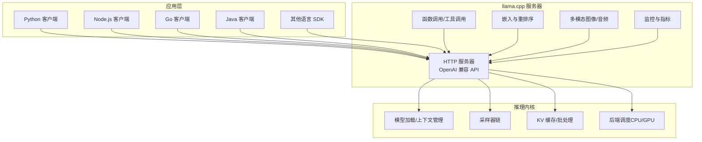
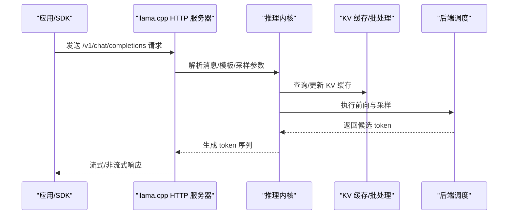
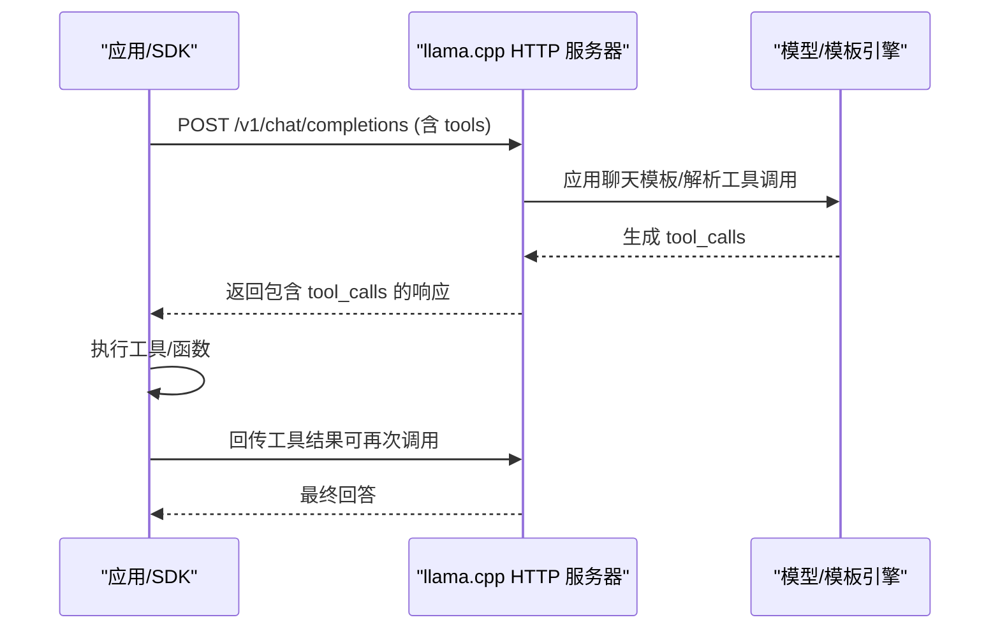
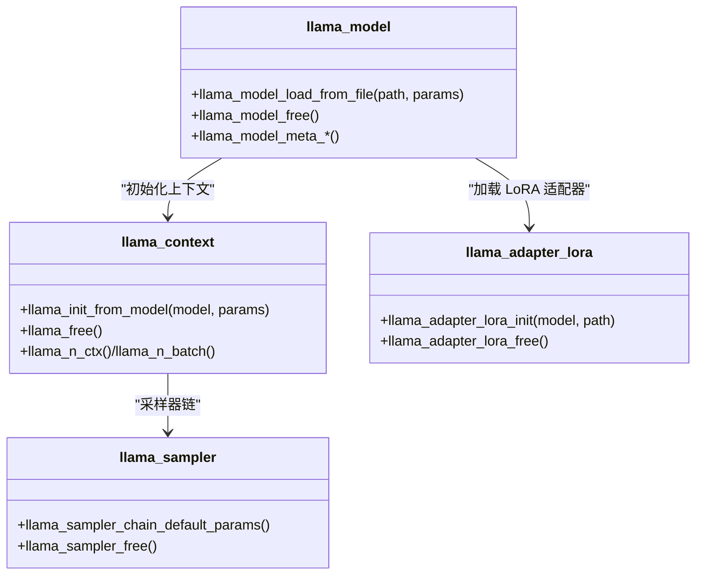

# API 集成指南

<cite>
**本文引用的文件**   
- [README.md](file://README.md)
- [function-calling.md](file://docs/function-calling.md)
- [server/README.md](file://tools/server/README.md)
- [llama.h](file://include/llama.h)
- [llama-cpp.h](file://include/llama-cpp.h)
- [server-llama2-13B.sh](file://examples/server-llama2-13B.sh)
</cite>

## 目录
1. [简介](#简介)
2. [项目结构](#项目结构)
3. [核心组件](#核心组件)
4. [架构总览](#架构总览)
5. [详细组件分析](#详细组件分析)
6. [依赖关系分析](#依赖关系分析)
7. [性能考量](#性能考量)
8. [故障排查指南](#故障排查指南)
9. [结论](#结论)
10. [附录](#附录)

## 简介
本指南面向需要将 llama.cpp 服务器集成到现有应用中的开发者，系统性说明如何通过 OpenAI 兼容 API、函数调用（工具调用）与多模态能力对接现有系统；同时覆盖多语言客户端 SDK 使用方式、与微服务/网关的集成模式、错误处理与重试策略、集成测试与验证方法，以及版本兼容与迁移建议。

## 项目结构
llama.cpp 提供了高性能的本地推理引擎与轻量 HTTP 服务器，支持 OpenAI 兼容 API、Anthropic Messages API、函数调用、嵌入与重排序等能力，并内置 Web UI 与监控端点。其核心由 C/C++ 实现，同时提供 C 头文件与 C++ RAII 包装头文件，便于在多种语言中进行绑定或直接调用。

图示来源
- [server/README.md:1-25](file://tools/server/README.md#L1-L25)
- [README.md:375-444](file://README.md#L375-L444)

章节来源
- [README.md:375-444](file://README.md#L375-L444)
- [server/README.md:1-25](file://tools/server/README.md#L1-L25)

## 核心组件
- HTTP 服务器与 OpenAI 兼容 API：提供 /v1/chat/completions、/v1/completions、/v1/embeddings、/v1/messages 等端点，支持流式响应与 JSON Schema 约束输出。
- 函数调用/工具调用：通过 Jinja 模板与聊天格式解析，支持 OpenAI 风格的 function 调用，适用于智能体与工具编排。
- 多模态：支持图像/音频输入，结合聊天模板与消息 API。
- 嵌入与重排序：提供 /v1/embeddings 与 /reranking 端点，适配检索增强与排序场景。
- 监控与指标：/metrics Prometheus 兼容导出，/slots 请求槽位状态查询，/props 动态属性查看。
- C/C++ 推理接口：llama.h 提供模型/上下文/采样器等核心 API；llama-cpp.h 提供 C++ RAII 封装。

章节来源
- [server/README.md:1129-1449](file://tools/server/README.md#L1129-L1449)
- [function-calling.md:1-40](file://docs/function-calling.md#L1-L40)
- [llama.h:432-520](file://include/llama.h#L432-L520)
- [llama-cpp.h:1-31](file://include/llama-cpp.h#L1-L31)

## 架构总览
下图展示从应用到服务器再到推理内核的整体调用路径与数据流。

图示来源
- [server/README.md:1194-1299](file://tools/server/README.md#L1194-L1299)
- [llama.h:500-520](file://include/llama.h#L500-L520)

## 详细组件分析

### OpenAI 兼容 API 集成
- 端点概览
  - /v1/models：返回已加载模型元信息
  - /v1/completions：文本补全（兼容 OpenAI 参数）
  - /v1/chat/completions：聊天补全（支持流式与 JSON Schema 约束）
  - /v1/embeddings：嵌入生成（需模型支持 pooling）
  - /v1/messages：Anthropic Messages API 兼容
- 关键参数与行为
  - 支持温度、top_p、repeat_penalty、logit_bias、grammar/json_schema 等
  - 流式响应采用 SSE（Server-Sent Events），浏览器 EventSource 不支持 POST，需自定义客户端
  - 响应包含 timings 与 token 统计，便于性能观测
- 认证与安全
  - 可配置 API Key；可启用 HTTPS 证书与私钥
- 多模态
  - 在聊天消息中以 image_url 形式传入媒体内容（base64 或远程 URL）

章节来源
- [server/README.md:1131-1449](file://tools/server/README.md#L1131-L1449)

### 函数调用（工具调用）实现与使用
- 支持范围
  - 多数主流模型具备原生工具调用格式（如 Llama 3.1/3.2、Qwen 2.5、Hermes 2/3、Mistral Nemo、Firefunction v2、Command R7B、DeepSeek R1 等）
  - 通用格式作为回退方案，可能消耗更多 token 且效率较低
  - 部分模型默认禁用并行工具调用，可通过请求参数开启
- 启用方式
  - 启动时使用 --jinja 标志；必要时通过 --chat-template-file 指定工具兼容模板
  - 若无官方 tool_use 模板，可使用 --chat-template chatml 或自定义模板
- 使用流程
  - 在请求中提供 tools 数组与 messages
  - 服务器根据模板解析并生成 tool_calls
  - 客户端执行工具逻辑并回传结果，继续对话直至完成

图示来源
- [function-calling.md:282-391](file://docs/function-calling.md#L282-L391)
- [server/README.md:1260-1265](file://tools/server/README.md#L1260-L1265)

章节来源
- [function-calling.md:1-427](file://docs/function-calling.md#L1-L427)
- [server/README.md:1194-1299](file://tools/server/README.md#L1194-L1299)

### 多模态集成
- 支持在聊天消息中传入图片/音频，结合聊天模板与消息 API
- 服务端会校验模型是否具备多模态能力（/models 或 /v1/models 中的 capability 字段）
- 媒体标记符与占位符替换由服务端处理，确保与提示词正确拼接

章节来源
- [server/README.md:288-297](file://tools/server/README.md#L288-L297)
- [server/README.md:1198-1204](file://tools/server/README.md#L1198-L1204)

### 嵌入与重排序
- /v1/embeddings：支持字符串或数组输入，返回归一化嵌入向量
- /reranking：基于重排序模型对文档进行打分排序

章节来源
- [server/README.md:1343-1378](file://tools/server/README.md#L1343-L1378)
- [server/README.md:660-692](file://tools/server/README.md#L660-L692)

### 监控与指标
- /metrics：Prometheus 兼容指标导出，包含吞吐、缓存使用率、请求数等
- /slots：查询各请求槽位的处理状态与采样参数
- /props：查看全局属性（可选启用 POST 修改）

章节来源
- [server/README.md:1019-1083](file://tools/server/README.md#L1019-L1083)
- [server/README.md:727-822](file://tools/server/README.md#L727-L822)

### C/C++ 推理接口（库内核）
- C 接口：llama.h 提供模型/上下文/采样器/内存管理等核心 API
- C++ RAII：llama-cpp.h 提供 unique_ptr 包装，简化资源生命周期管理
- 适用场景：需要在应用内部直接调用推理、避免网络开销或进行边缘部署

图示来源
- [llama.h:474-520](file://include/llama.h#L474-L520)
- [llama.h:634-688](file://include/llama.h#L634-L688)
- [llama-cpp.h:11-31](file://include/llama-cpp.h#L11-L31)

章节来源
- [llama.h:432-520](file://include/llama.h#L432-L520)
- [llama-cpp.h:1-31](file://include/llama-cpp.h#L1-L31)

## 依赖关系分析
- 服务器依赖
  - httplib（HTTP）、nlohmann/json（JSON）、ggml/gguf（张量/权重）
- 运行时后端
  - CPU、CUDA、HIP、Metal、Vulkan、OpenCL、SYCL、RPC 等
- 多模态子系统
  - stb-image、miniaudio 等用于图像/音频解码

章节来源
- [README.md:590-597](file://README.md#L590-L597)

## 性能考量
- 上下文与批处理
  - 合理设置 --ctx-size、--batch-size、--ubatch-size，避免过小导致频繁重建 KV
- 并行与连续批处理
  - --parallel 控制并发槽位；--cont-batching 开启动态批处理提升吞吐
- KV 缓存优化
  - --cache-type-k/--cache-type-v 选择合适的数据类型；--kv-offload 可将 KV 卸载至设备
- 设备与分片
  - --n-gpu-layers、--split-mode、--tensor-split 控制显存占用与并行度
- 温度与采样
  - 适度降低温度与 top_p 可减少 token 数量，提高吞吐
- 指标观测
  - 使用 /metrics 与 /slots 观察吞吐、延迟与缓存命中情况

章节来源
- [server/README.md:160-260](file://tools/server/README.md#L160-L260)
- [server/README.md:1019-1033](file://tools/server/README.md#L1019-L1033)

## 故障排查指南
- 健康检查
  - /health：模型加载中返回 503，就绪后返回 200
- 常见问题定位
  - /props 查看当前全局属性与聊天模板
  - /slots 查询空闲槽位与采样参数
  - /metrics 导出 Prometheus 指标，观察吞吐与缓存使用
- 错误与重试
  - 对于流式响应，注意断连后的恢复策略（客户端侧实现）
  - 对于工具调用失败，确认模板与并行工具调用开关
- 日志与调试
  - --log-verbose/--log-file 输出详细日志；--log-colors 控制颜色输出

章节来源
- [server/README.md:369-381](file://tools/server/README.md#L369-L381)
- [server/README.md:727-822](file://tools/server/README.md#L727-L822)
- [server/README.md:1019-1083](file://tools/server/README.md#L1019-L1083)

## 结论
通过 OpenAI 兼容 API、函数调用与多模态能力，llama.cpp 能够无缝对接现有应用与平台生态。配合多语言 SDK、微服务/网关与可观测性指标，可在本地与云端稳定运行。建议优先采用 OpenAI 兼容 API 以降低迁移成本，并结合模板与工具调用构建智能体工作流。

## 附录

### 多语言集成示例（要点）
- Python
  - 使用 openai 库，将 base_url 指向 http://host:port/v1
  - 示例：参考 /v1/chat/completions 与 /v1/embeddings 的请求体字段
- Node.js
  - 使用 axios/fetch 发送 POST 请求至 /v1/chat/completions
  - 注意 SSE 流式响应需自定义解析
- Go
  - 使用 net/http 或第三方库发送请求，按 OpenAI 文档构造消息与工具定义
- Java
  - 使用 HTTP 客户端或 OkHttp 发送请求，注意 JSON Schema 约束与流式处理

章节来源
- [server/README.md:1175-1193](file://tools/server/README.md#L1175-L1193)
- [server/README.md:1218-1238](file://tools/server/README.md#L1218-L1238)

### 微服务与 API 网关集成模式
- 单实例模式
  - 直接部署 llama-server，应用通过 HTTP 调用
- 多模型路由模式
  - 启动无模型的路由器，按请求的 model 字段动态加载/卸载模型
  - 支持缓存目录、本地目录与预设配置
- 网关/反向代理
  - 在网关层统一鉴权（API Key）、限流与熔断
  - 将 /v1/* 路径转发至具体实例或路由服务器

章节来源
- [server/README.md:1458-1599](file://tools/server/README.md#L1458-L1599)

### 版本兼容与迁移指南
- API 变更
  - 参考 README 中“Recent API changes”与“Changelog for llama-server REST API”
- 模型格式
  - 使用 GGUF 格式；可通过 convert_* 脚本转换与量化
- 迁移步骤
  - 从旧版 CLI/服务器迁移到 OpenAI 兼容 API
  - 更新客户端 SDK 的 base_url 与请求体字段
  - 验证函数调用与多模态功能是否符合预期

章节来源
- [README.md:13-16](file://README.md#L13-L16)
- [README.md:297-324](file://README.md#L297-L324)

### 集成测试与验证方法
- 健康检查
  - 调用 /health 确认就绪
- 基础通路
  - /v1/models -> /v1/completions -> /v1/chat/completions（含流式）
- 工具调用
  - 准备 tools 列表，验证 tool_calls 是否被正确生成与解析
- 多模态
  - 传入图片/音频，验证服务端返回与模板解析
- 指标验证
  - /metrics 与 /slots 观察吞吐与缓存使用

章节来源
- [server/README.md:369-381](file://tools/server/README.md#L369-L381)
- [server/README.md:1131-1299](file://tools/server/README.md#L1131-L1299)
- [function-calling.md:334-391](file://docs/function-calling.md#L334-L391)

### 快速启动与示例脚本
- 使用示例脚本快速启动本地服务器并访问 Web UI 与 API
- 可通过环境变量与命令行参数调整线程数、上下文大小与并发槽位

章节来源
- [server-llama2-13B.sh:1-27](file://examples/server-llama2-13B.sh#L1-L27)
- [README.md:375-444](file://README.md#L375-L444)