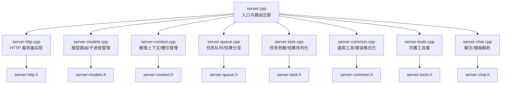
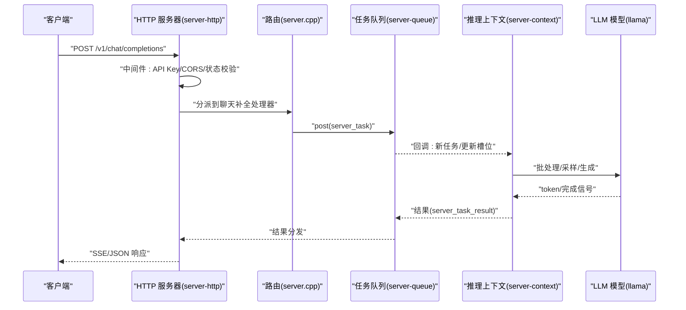
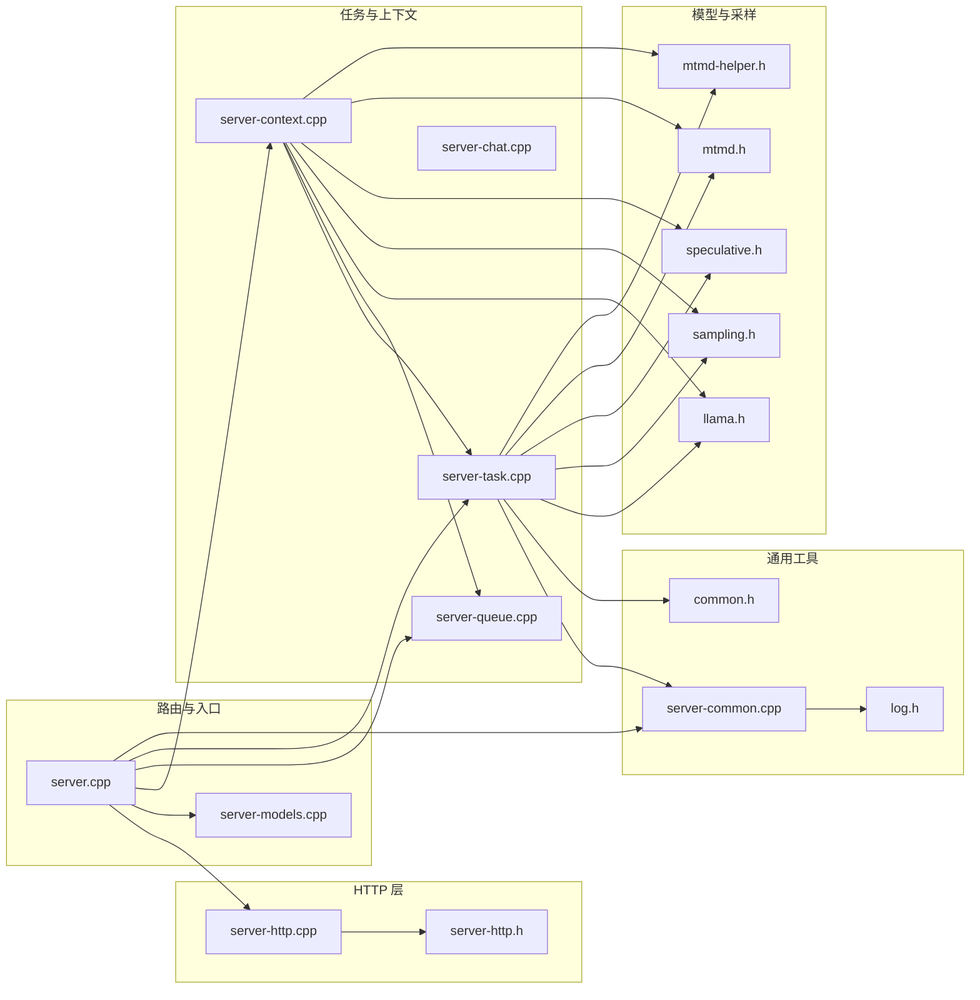

# HTTP 服务器和 API

<cite>
**本文档引用的文件**
- [server.cpp](file://tools/server/server.cpp)
- [server-http.cpp](file://tools/server/server-http.cpp)
- [server-common.cpp](file://tools/server/server-common.cpp)
- [server-queue.cpp](file://tools/server/server-queue.cpp)
- [server-task.cpp](file://tools/server/server-task.cpp)
- [server-context.cpp](file://tools/server/server-context.cpp)
- [server-models.cpp](file://tools/server/server-models.cpp)
- [server-tools.cpp](file://tools/server/server-tools.cpp)
- [server-chat.cpp](file://tools/server/server-chat.cpp)
- [server-http.h](file://tools/server/server-http.h)
- [server-common.h](file://tools/server/server-common.h)
- [server-queue.h](file://tools/server/server-queue.h)
- [server-task.h](file://tools/server/server-task.h)
- [server-context.h](file://tools/server/server-context.h)
- [server-models.h](file://tools/server/server-models.h)
- [server-tools.h](file://tools/server/server-tools.h)
- [server-chat.h](file://tools/server/server-chat.h)
- [common.h](file://common/common.h)
- [llama.h](file://include/llama.h)
- [arg.h](file://common/arg.h)
- [preset.h](file://common/preset.h)
- [download.h](file://common/download.h)
- [log.h](file://common/log.h)
- [json-schema-to-grammar.h](file://src/json-schema-to-grammar.h)
- [sampling.h](file://src/sampling.h)
- [speculative.h](file://src/speculative.h)
- [mtmd.h](file://src/mtmd.h)
- [mtmd-helper.h](file://src/mtmd-helper.h)
</cite>

## 目录
1. [简介](#简介)
2. [项目结构](#项目结构)
3. [核心组件](#核心组件)
4. [架构总览](#架构总览)
5. [详细组件分析](#详细组件分析)
6. [依赖关系分析](#依赖关系分析)
7. [性能考量](#性能考量)
8. [故障排查指南](#故障排查指南)
9. [结论](#结论)
10. [附录](#附录)

## 简介
本文件系统性阐述 llama.cpp 的 HTTP 服务器架构与 OpenAI 兼容 API 实现，覆盖聊天补全、文本补全、嵌入生成、重排序等接口；说明 WebSocket 支持与实时通信机制；介绍内置 Web UI 的实现与定制选项；提供完整 API 使用示例（请求格式、响应结构、错误处理）；详述服务器配置项（并发控制、内存管理、性能调优）、安全与访问控制、部署与监控方案以及与其他服务的集成方式。

## 项目结构
llama.cpp 的 HTTP 服务器位于 tools/server 目录，采用“路由注册 + 请求处理器 + 异步任务队列 + 推理上下文”的分层设计。核心模块包括：
- 服务器入口与生命周期：tools/server/server.cpp
- HTTP 层实现：tools/server/server-http.cpp
- 通用工具与错误格式化：tools/server/server-common.cpp
- 任务队列与结果分发：tools/server/server-queue.cpp
- 任务参数与结果序列化：tools/server/server-task.cpp
- 推理上下文与槽位管理：tools/server/server-context.cpp
- 模型路由与多实例管理：tools/server/server-models.cpp
- 内置工具集：tools/server/server-tools.cpp
- 聊天与模板解析：tools/server/server-chat.cpp
- 头文件定义：tools/server/server-*.h

图表来源
- [server.cpp:1-354](file://tools/server/server.cpp#L1-L354)
- [server-http.cpp:1-484](file://tools/server/server-http.cpp#L1-L484)
- [server-context.cpp:1-800](file://tools/server/server-context.cpp#L1-L800)
- [server-queue.cpp:1-451](file://tools/server/server-queue.cpp#L1-L451)
- [server-task.cpp:1-800](file://tools/server/server-task.cpp#L1-L800)
- [server-common.cpp:1-800](file://tools/server/server-common.cpp#L1-L800)
- [server-models.cpp:1-800](file://tools/server/server-models.cpp#L1-L800)
- [server-tools.cpp:1-769](file://tools/server/server-tools.cpp#L1-L769)
- [server-chat.cpp](file://tools/server/server-chat.cpp)

章节来源
- [server.cpp:1-354](file://tools/server/server.cpp#L1-L354)
- [server-http.cpp:1-484](file://tools/server/server-http.cpp#L1-L484)

## 核心组件
- HTTP 服务器与中间件：基于 cpp-httplib，支持 SSL/TLS、CORS、API Key 验证、健康检查、静态资源托管与 Web UI 嵌入。
- 路由与处理器：统一注册 /health、/metrics、/models、/v1/* 等端点，按 OpenAI 兼容规范实现聊天补全、文本补全、嵌入、重排序等。
- 任务系统：异步任务队列 + 结果分发器，支持流式输出、批量任务、取消与超时。
- 推理上下文：多槽位并发、提示缓存、采样器、推测解码、LoRA 热切换。
- 模型路由：路由器模式下可动态加载/卸载子模型实例，支持多实例负载与睡眠唤醒。
- 内置工具：文件读写、搜索、正则匹配、命令执行等，便于本地开发与调试。
- Web UI：可选内嵌前端资源或外部静态目录，提供基础交互界面。

章节来源
- [server-http.cpp:54-299](file://tools/server/server-http.cpp#L54-L299)
- [server.cpp:126-226](file://tools/server/server.cpp#L126-L226)
- [server-queue.cpp:22-222](file://tools/server/server-queue.cpp#L22-L222)
- [server-context.cpp:632-800](file://tools/server/server-context.cpp#L632-L800)
- [server-models.cpp:167-380](file://tools/server/server-models.cpp#L167-L380)
- [server-tools.cpp:700-769](file://tools/server/server-tools.cpp#L700-L769)

## 架构总览
llama.cpp HTTP 服务器采用“单进程多线程 + 事件循环 + 异步任务队列”的架构。HTTP 层负责请求接入与中间件处理；路由层将请求分派到具体处理器；任务处理器将请求转换为内部任务，投递到队列；推理上下文在工作线程中执行批处理与生成；结果通过流式或一次性返回给客户端。

图表来源
- [server-http.cpp:422-482](file://tools/server/server-http.cpp#L422-L482)
- [server.cpp:172-226](file://tools/server/server.cpp#L172-L226)
- [server-queue.cpp:125-209](file://tools/server/server-queue.cpp#L125-L209)
- [server-context.cpp:632-800](file://tools/server/server-context.cpp#L632-L800)

## 详细组件分析

### HTTP 服务器与中间件
- 初始化与 SSL：根据参数选择是否启用 SSL，并设置默认头、异常处理与错误页。
- 中间件链：
  - CORS 预检处理（OPTIONS）
  - 服务器就绪状态检查（未就绪返回 503 或加载页面）
  - API Key 校验（支持 Authorization 与 X-Api-Key，Bearer 前缀可选）
- 线程池：固定工作线程数 + 最大动态线程，保证高并发下的稳定性。
- 静态资源与 Web UI：可挂载外部目录或内嵌 index.html/bundle.js/css。
- 流式响应：支持 chunked transfer 编码，用于 SSE 场景。

章节来源
- [server-http.cpp:54-299](file://tools/server/server-http.cpp#L54-L299)
- [server-http.cpp:301-346](file://tools/server/server-http.cpp#L301-L346)
- [server-http.cpp:422-482](file://tools/server/server-http.cpp#L422-L482)

### 路由与 OpenAI 兼容 API
- 健康检查与指标：/health、/v1/health、/metrics
- 模型管理：/models、/v1/models；路由器模式下支持 /models/load、/models/unload
- 文本补全：/completion、/completions、/v1/completions（兼容 OpenAI）
- 聊天补全：/chat/completions、/v1/chat/completions（兼容 OpenAI）
- 嵌入生成：/embeddings、/v1/embeddings
- 重排序：/rerank、/v1/rerank
- 其他：/tokenize、/detokenize、/apply-template、/lora-adapters、/slots、/tools（实验性）

章节来源
- [server.cpp:172-226](file://tools/server/server.cpp#L172-L226)

### 任务系统与流式输出
- 任务队列：支持普通入队、前置入队、延迟任务、清理目标任务等。
- 结果分发：等待集合、超时等待、批量等待、取消与停止。
- 流式输出：通过 next()/recv_with_timeout() 迭代返回增量结果，支持 include_usage 控制。

章节来源
- [server-queue.cpp:22-222](file://tools/server/server-queue.cpp#L22-L222)
- [server-queue.cpp:343-451](file://tools/server/server-queue.cpp#L343-L451)

### 推理上下文与槽位管理
- 槽位状态机：空闲、等待父任务、开始处理、处理提示、完成提示、生成中。
- 提示缓存：保存/加载序列状态，支持多模态输入（图像/音频）。
- 采样器与生成参数：温度、Top-K、Top-P、典型采样、Dry、Mirostat 等。
- 推测解码：Draft 模型并行生成，提升吞吐。
- LoRA 热切换：支持当前/下一组 LoRA 的比较与缓存清理策略。

章节来源
- [server-context.cpp:65-77](file://tools/server/server-context.cpp#L65-L77)
- [server-context.cpp:195-562](file://tools/server/server-context.cpp#L195-L562)
- [server-task.cpp:228-604](file://tools/server/server-task.cpp#L228-L604)

### 模型路由与多实例管理
- 路由器模式：无模型参数启动，仅作为路由与子实例管理器。
- 子实例生命周期：spawn/ready/sleep/exit 协议，支持自动加载、LRU 卸载、优雅停止与强制终止。
- 配置来源：缓存、本地目录、INI 自定义预设，支持别名与标签。
- 端口分配：随机端口分配，避免冲突。

章节来源
- [server-models.cpp:167-380](file://tools/server/server-models.cpp#L167-L380)
- [server-models.cpp:533-800](file://tools/server/server-models.cpp#L533-L800)

### 内置工具集（实验性）
- 工具类型：文件读取、文件搜索、正则搜索、命令执行、文件写入、行编辑、应用补丁。
- 权限控制：只读/写权限区分，防止误用。
- 安全限制：输出大小上限、超时控制、平台命令适配。

章节来源
- [server-tools.cpp:122-769](file://tools/server/server-tools.cpp#L122-L769)

### Web UI 实现与定制
- 内嵌资源：index.html、bundle.js、bundle.css，支持 COEP/COOP。
- 外部目录：通过 --public-path 挂载自定义静态资源。
- 加载页：服务未就绪时返回加载页面，避免白屏。

章节来源
- [server-http.cpp:266-298](file://tools/server/server-http.cpp#L266-L298)

## 依赖关系分析

图表来源
- [server.cpp:1-354](file://tools/server/server.cpp#L1-L354)
- [server-http.cpp:1-484](file://tools/server/server-http.cpp#L1-L484)
- [server-context.cpp:1-800](file://tools/server/server-context.cpp#L1-L800)
- [server-queue.cpp:1-451](file://tools/server/server-queue.cpp#L1-L451)
- [server-task.cpp:1-800](file://tools/server/server-task.cpp#L1-L800)
- [server-common.cpp:1-800](file://tools/server/server-common.cpp#L1-L800)
- [server-models.cpp:1-800](file://tools/server/server-models.cpp#L1-L800)
- [server-chat.cpp](file://tools/server/server-chat.cpp)

## 性能考量
- 并发与线程池：HTTP 线程数可配置，默认使用 n_parallel + 固定线程数 + 动态线程上限，平衡吞吐与资源占用。
- 批处理与上下文：合理设置 n_batch/n_ubatch，嵌入场景需单 ubatch 处理以避免断言失败。
- 推测解码：开启 draft 模型可显著提升吞吐，注意 n_ctx 与剩余预算的约束。
- 提示缓存：利用 prompt cache 减少重复计算，提高多用户场景下的响应速度。
- 内存管理：KV 统一/分离、内存对齐、批大小与上下文长度权衡。
- 多实例：路由器模式下按需加载，LRU 卸载，避免内存峰值过高。

章节来源
- [server.cpp:86-100](file://tools/server/server.cpp#L86-L100)
- [server-context.cpp:254-286](file://tools/server/server-context.cpp#L254-L286)
- [server-models.cpp:500-531](file://tools/server/server-models.cpp#L500-L531)

## 故障排查指南
- 常见错误类型与映射：无效请求、认证失败、未找到、服务器错误、权限不足、不可用、超出上下文等。
- 异常包装：所有处理器通过 ex_wrapper 捕获异常并返回标准 JSON 错误体。
- 日志与调试：HTTP 层记录请求/响应摘要，推理上下文输出计时与统计信息。
- 健康检查：/health 与 /metrics 可快速判断服务状态与资源占用。
- API Key：未配置或不匹配会返回 401，确认 Authorization/X-Api-Key 与后端密钥列表一致。

章节来源
- [server-common.cpp:16-58](file://tools/server/server-common.cpp#L16-L58)
- [server.cpp:38-72](file://tools/server/server.cpp#L38-L72)
- [server-http.cpp:34-52](file://tools/server/server-http.cpp#L34-L52)
- [server-http.cpp:128-196](file://tools/server/server-http.cpp#L128-L196)

## 结论
llama.cpp 的 HTTP 服务器以清晰的分层架构实现了 OpenAI 兼容 API，具备完善的中间件、任务系统、推理上下文与多实例路由能力。通过合理的并发与内存管理策略，可在生产环境中稳定提供高质量的推理服务。内置工具与 Web UI 为本地开发与演示提供了便利，同时保持了良好的扩展性与安全性。

## 附录

### OpenAI 兼容 API 规范要点
- 路径与方法
  - GET /health, /v1/health → 健康检查
  - GET /metrics → 指标导出
  - GET/POST /models, /v1/models → 模型列表
  - POST /v1/chat/completions → 聊天补全（流式/非流式）
  - POST /v1/completions → 文本补全
  - POST /v1/embeddings → 嵌入生成
  - POST /v1/rerank → 重排序
  - POST /tokenize, /detokenize, /apply-template → 分词/反分词/模板应用
  - GET/POST /lora-adapters → LoRA 管理
  - GET/POST /slots → 保存/加载槽位状态
  - GET/POST /tools → 内置工具（实验性）
- 认证
  - 支持 Authorization: Bearer <key> 与 X-Api-Key
  - 未配置或无效返回 401
- 流式输出
  - 使用 SSE，逐条发送 data: {...}\n\n
  - include_usage 控制是否包含 usage 字段
- 嵌入与重排序
  - 嵌入要求单 ubatch 处理，确保 n_batch ≤ n_ubatch
  - 重排序接口支持 OpenAI 风格字段

章节来源
- [server.cpp:172-226](file://tools/server/server.cpp#L172-L226)
- [server-http.cpp:128-196](file://tools/server/server-http.cpp#L128-L196)
- [server.cpp:86-93](file://tools/server/server.cpp#L86-L93)

### WebSocket 支持与实时通信
- 当前实现主要基于 HTTP 与 SSE，未发现专用 WebSocket 路由或处理器。
- 若需实时双向通信，建议通过客户端轮询或在现有 SSE 基础上扩展消息协议。

章节来源
- [server-http.cpp:422-482](file://tools/server/server-http.cpp#L422-L482)

### Web UI 定制选项
- 启用/禁用：通过参数控制是否启用 Web UI
- 静态资源：可挂载外部目录或使用内嵌资源
- 加载页：未就绪时返回加载页面，避免白屏
- COEP/COOP：内嵌 HTML 设置跨源隔离头，满足特定运行环境需求

章节来源
- [server-http.cpp:266-298](file://tools/server/server-http.cpp#L266-L298)

### API 使用示例（请求/响应/错误）
- 聊天补全（流式）
  - 请求：POST /v1/chat/completions，body 包含 messages、temperature、max_tokens、stream=true 等
  - 响应：SSE，逐条返回 choices[].delta.content，结束时返回 usage
  - 错误：400/401/404/500，返回 { error: { type, message, code } }
- 文本补全
  - 请求：POST /v1/completions，body 包含 prompt、temperature、max_tokens、stream 等
  - 响应：choices[].text 或 SSE 流
- 嵌入生成
  - 请求：POST /v1/embeddings，body 包含 input、model 等
  - 响应：data[].embedding 数组
- 重排序
  - 请求：POST /v1/rerank，body 包含 query、documents、top_n 等
  - 响应：results[]，按 relevance 排序
- 错误处理
  - 400：参数无效
  - 401：API Key 无效
  - 404：资源不存在
  - 500：服务器内部错误
  - 503：服务未就绪

章节来源
- [server-common.cpp:16-58](file://tools/server/server-common.cpp#L16-L58)
- [server-task.cpp:714-800](file://tools/server/server-task.cpp#L714-L800)

### 服务器配置选项（节选）
- 网络与安全
  - --host/--port/--ssl-key-file/--ssl-cert-file/--api-keys/--timeout-read/--timeout-write/--reuse-port
- 并发与线程
  - --n-threads-http（HTTP 线程池）、--n-parallel（槽位/并行）
- 推理与采样
  - temperature/top_k/top_p/repeat_last_n/repeat_penalty/frequency_penalty/presence_penalty、mirostat、dry_*、logit_bias、grammar/json_schema、logprobs、n_probs、backend_sampling
- 上下文与批处理
  - n_ctx/n_batch/n_ubatch/cache_prompt/n_keep/n_discard
- 多实例与模型
  - --models-dir/--models-max/--models-preset/--models-autoload、--alias/--tags
- 内置工具
  - --server-tools（启用工具列表）

章节来源
- [server.cpp:74-100](file://tools/server/server.cpp#L74-L100)
- [server-task.cpp:228-604](file://tools/server/server-task.cpp#L228-L604)
- [server-models.cpp:167-380](file://tools/server/server-models.cpp#L167-L380)

### 安全与访问控制
- API Key：支持多密钥，仅对受保护端点生效
- CORS：OPTIONS 预检，允许跨域访问
- 未就绪保护：服务启动阶段返回 503 或加载页，避免数据竞争
- 内置工具：实验性功能，仅在明确启用时暴露，且具备权限与安全限制

章节来源
- [server-http.cpp:128-196](file://tools/server/server-http.cpp#L128-L196)
- [server-http.cpp:198-246](file://tools/server/server-http.cpp#L198-L246)
- [server-tools.cpp:712-769](file://tools/server/server-tools.cpp#L712-L769)

### 部署指南与监控
- 部署
  - 单实例：直接启动，指定模型与端口
  - 路由器模式：不指定模型，通过 /models/load 动态加载子实例
  - Docker：可参考仓库提供的 Dockerfile（CUDA/ROCm/OpenVINO 等）
- 监控
  - /metrics 导出 Prometheus 格式指标
  - /health 快速健康检查
  - 日志：INFO/WRN/ERR 级别输出，便于定位问题

章节来源
- [server.cpp:233-350](file://tools/server/server.cpp#L233-L350)
- [server-http.cpp:301-346](file://tools/server/server-http.cpp#L301-L346)

### 与其他服务的集成
- 路由器与子实例：通过进程间通信与命令协议（ready/sleep/exit）协作
- 下游服务：可将 /metrics 与 /health 集成到外部监控系统
- 文件系统：内置工具可与外部 CI/CD 或运维脚本配合

章节来源
- [server-models.cpp:533-800](file://tools/server/server-models.cpp#L533-L800)