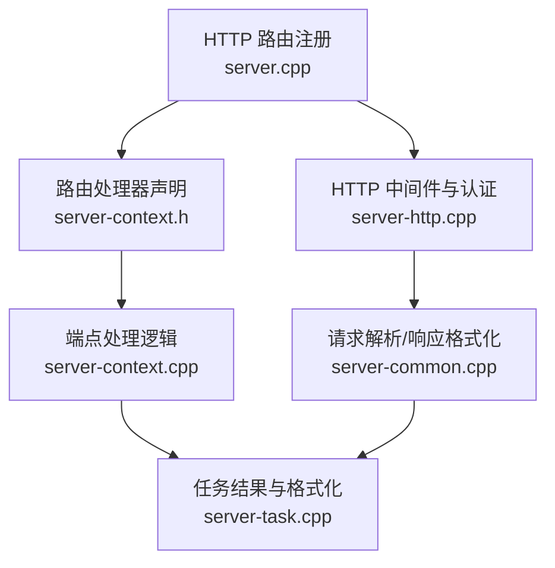
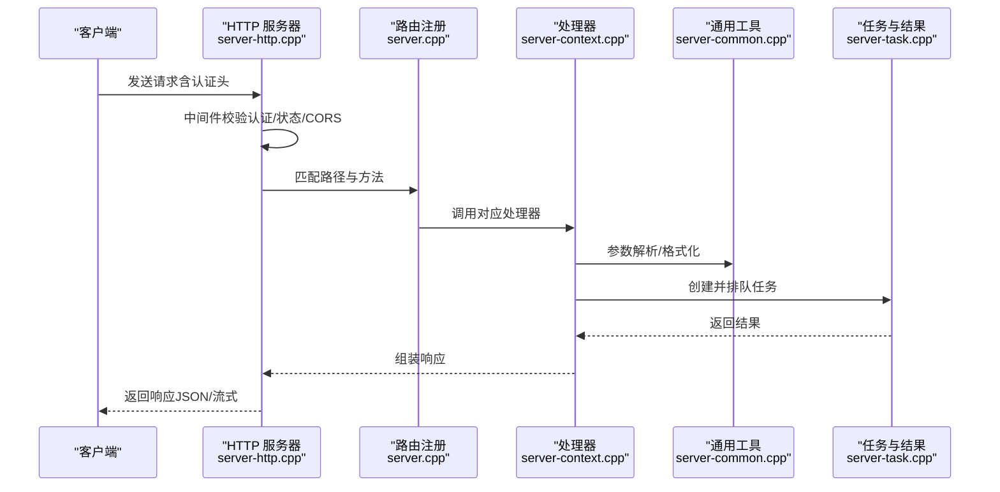
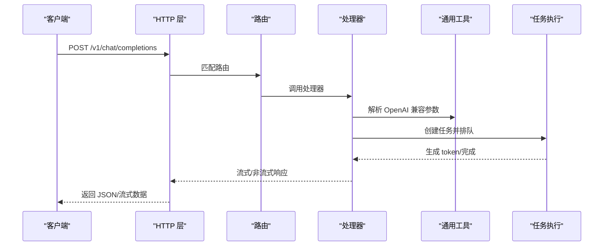
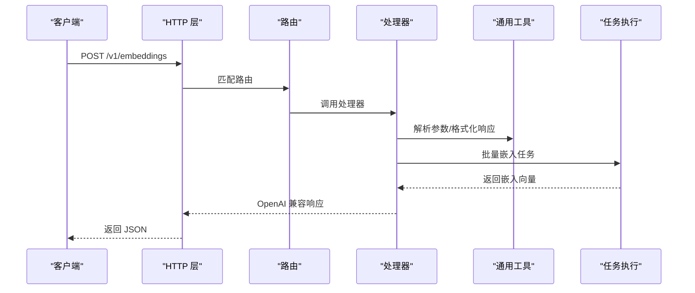
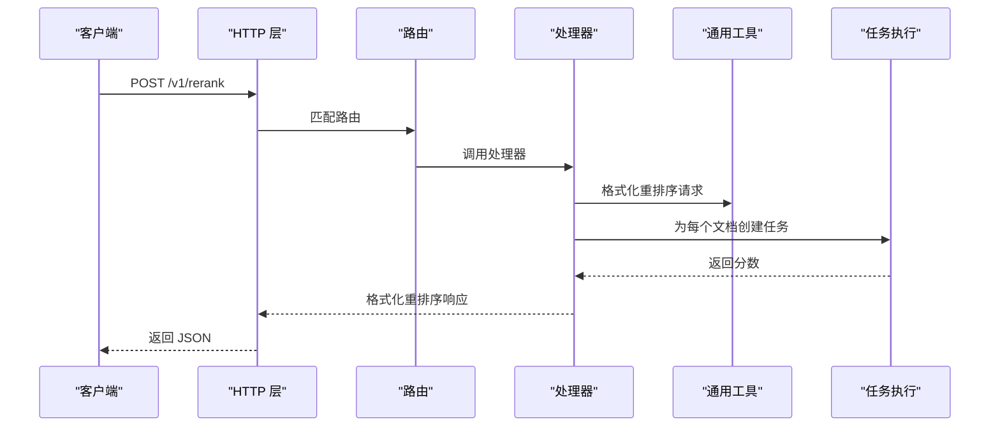
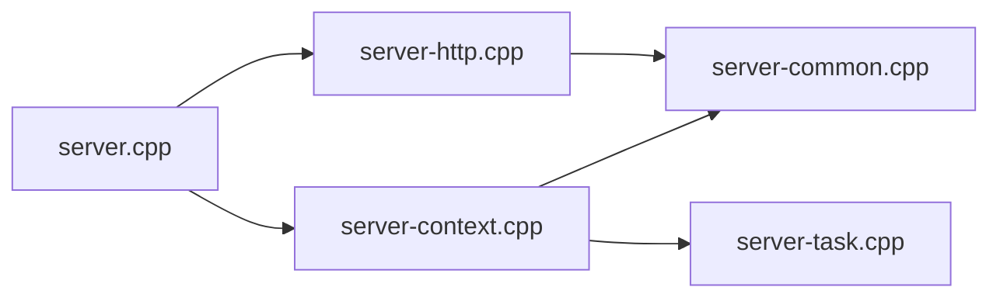

# REST API 规范

<cite>
**本文档引用的文件**
- [README.md](file://README.md)
- [server.cpp](file://tools/server/server.cpp)
- [server-http.cpp](file://tools/server/server-http.cpp)
- [server-context.h](file://tools/server/server-context.h)
- [server-common.cpp](file://tools/server/server-common.cpp)
- [server-context.cpp](file://tools/server/server-context.cpp)
- [server-task.cpp](file://tools/server/server-task.cpp)
- [server-common.h](file://tools/server/server-common.h)
- [test_security.py](file://tools/server/tests/unit/test_security.py)
</cite>

## 目录
1. [简介](#简介)
2. [项目结构](#项目结构)
3. [核心组件](#核心组件)
4. [架构总览](#架构总览)
5. [详细组件分析](#详细组件分析)
6. [依赖关系分析](#依赖关系分析)
7. [性能考虑](#性能考虑)
8. [故障排除指南](#故障排除指南)
9. [结论](#结论)
10. [附录](#附录)

## 简介
本文件为 llama.cpp 项目中 OpenAI 兼容 REST API 的完整规范文档，覆盖以下端点与能力：
- 聊天补全：/v1/chat/completions（以及兼容的 /chat/completions）
- 文本补全：/v1/completions（以及兼容的 /completions）
- 嵌入生成：/v1/embeddings（以及兼容的 /embeddings）
- 重排序：/v1/rerank、/v1/reranking（以及兼容的 /rerank、/reranking）
- 转录：/v1/audio/transcriptions（以及兼容的 /audio/transcriptions）
- 其他工具：/v1/responses、/v1/messages、/v1/messages/count_tokens、/tokenize、/detokenize、/apply-template
- 健康检查与模型列表：/health、/v1/health、/models、/v1/models
- 槽位管理：/slots、/slots/{id_slot}

同时，文档说明了认证机制、速率限制策略、版本控制方式、错误码与响应格式，并提供最佳实践与常见问题解决方案。

## 项目结构
llama.cpp 的 OpenAI 兼容服务由 tools/server 子模块提供，核心文件包括：
- HTTP 路由注册与中间件：tools/server/server.cpp
- HTTP 服务器实现与中间件：tools/server/server-http.cpp
- 路由处理器声明与元数据：tools/server/server-context.h
- 请求解析、响应格式化与通用工具：tools/server/server-common.cpp
- 各端点处理逻辑与任务执行：tools/server/server-context.cpp
- 任务结果与响应格式：tools/server/server-task.cpp
- OpenAI 兼容参数解析与格式化函数声明：tools/server/server-common.h
- 安全测试用例（认证）：tools/server/tests/unit/test_security.py

**图表来源**
- [server.cpp:172-203](file://tools/server/server.cpp#L172-L203)
- [server-http.cpp:140-196](file://tools/server/server-http.cpp#L140-L196)
- [server-context.h:90-146](file://tools/server/server-context.h#L90-L146)
- [server-common.cpp:16-58](file://tools/server/server-common.cpp#L16-L58)
- [server-context.cpp:3795-3857](file://tools/server/server-context.cpp#L3795-L3857)

**章节来源**
- [server.cpp:172-203](file://tools/server/server.cpp#L172-L203)
- [server-http.cpp:140-196](file://tools/server/server-http.cpp#L140-L196)
- [server-context.h:90-146](file://tools/server/server-context.h#L90-L146)

## 核心组件
- HTTP 服务器与中间件
  - 提供基于 cpp-httplib 的 HTTP 服务，支持 SSL/TLS、超时配置、线程池等。
  - 中间件负责：
    - 认证校验（支持 Authorization 头或 X-Api-Key 头，Bearer 方式）
    - 服务状态检查（未就绪返回 503）
    - CORS 预检处理
- 路由与处理器
  - 在 server.cpp 中集中注册所有端点，映射到 server-context.cpp 中的具体处理函数。
  - 处理器通过 server_common.cpp 提供的 OpenAI 兼容参数解析与响应格式化函数完成请求转换与响应生成。
- 任务队列与执行
  - server-context.cpp 中的 handle_completions_impl、handle_embeddings_impl 等负责将请求转换为内部任务并排队执行，最终通过 server-task.cpp 的结果格式化输出。

**章节来源**
- [server-http.cpp:54-127](file://tools/server/server-http.cpp#L54-L127)
- [server-http.cpp:140-196](file://tools/server/server-http.cpp#L140-L196)
- [server.cpp:172-203](file://tools/server/server.cpp#L172-L203)
- [server-context.cpp:126-135](file://tools/server/server-context.cpp#L126-L135)

## 架构总览
下图展示了从客户端请求到服务端处理与响应的总体流程：

**图表来源**
- [server-http.cpp:140-196](file://tools/server/server-http.cpp#L140-L196)
- [server.cpp:172-203](file://tools/server/server.cpp#L172-L203)
- [server-context.cpp:126-135](file://tools/server/server-context.cpp#L126-L135)
- [server-common.cpp:16-58](file://tools/server/server-common.cpp#L16-L58)
- [server-task.cpp:1825-1871](file://tools/server/server-task.cpp#L1825-L1871)

## 详细组件分析

### 认证机制
- 支持的头部：
  - Authorization: Bearer <API_KEY>
  - X-Api-Key: <API_KEY>
- 公共端点（无需认证）：
  - /health、/v1/health、/models、/v1/models、/、/index.html、/bundle.js、/bundle.css
- 未就绪状态：
  - 服务器启动但模型尚未加载完成时，除公共端点外均返回 503（Unavailable）

**章节来源**
- [server-http.cpp:140-196](file://tools/server/server-http.cpp#L140-L196)
- [test_security.py:48-85](file://tools/server/tests/unit/test_security.py#L48-L85)

### 错误码与错误响应
- 标准错误类型与 HTTP 状态码映射：
  - invalid_request_error → 400
  - authentication_error → 401
  - not_found_error → 404
  - server_error → 500
  - permission_error → 403
  - not_supported_error → 501
  - unavailable_error → 503
  - exceed_context_size_error → 400（额外携带提示）
- 错误响应结构包含：
  - code、message、type 字段；当超出上下文长度时，可能包含 n_prompt_tokens 与 n_ctx

**章节来源**
- [server-common.cpp:16-58](file://tools/server/server-common.cpp#L16-L58)
- [server-task.cpp:1854-1861](file://tools/server/server-task.cpp#L1854-L1861)

### 版本控制与兼容性
- OpenAI 兼容端点统一以 /v1/ 前缀提供，同时保留历史兼容端点（如 /chat/completions、/embeddings 等）。
- 项目 README 明确指出 OpenAI API 兼容性与服务器端启动方式。

**章节来源**
- [server.cpp:172-203](file://tools/server/server.cpp#L172-L203)
- [README.md:375-443](file://README.md#L375-L443)

### 端点规范

#### /v1/chat/completions（聊天补全）
- 方法：POST
- URL：/v1/chat/completions
- 功能：生成对话回复，支持消息数组、系统提示、函数调用、流式输出等。
- 认证：需要 API Key（除公共端点外）
- 响应：OpenAI 兼容格式，支持流式 SSE 返回。
- 参考实现位置：
  - 路由注册：[server.cpp:182-183](file://tools/server/server.cpp#L182-L183)
  - 处理器：[server-context.cpp:126-135](file://tools/server/server-context.cpp#L126-L135)

**章节来源**
- [server.cpp:182-183](file://tools/server/server.cpp#L182-L183)
- [server-context.cpp:126-135](file://tools/server/server-context.cpp#L126-L135)

#### /v1/completions（文本补全）
- 方法：POST
- URL：/v1/completions
- 功能：传统文本补全，支持 prompt、最大生成长度、采样参数等。
- 认证：需要 API Key
- 响应：OpenAI 兼容格式，支持流式输出。
- 参考实现位置：
  - 路由注册：[server.cpp:180-181](file://tools/server/server.cpp#L180-L181)
  - 处理器：[server-context.cpp:126-135](file://tools/server/server-context.cpp#L126-L135)

**章节来源**
- [server.cpp:180-181](file://tools/server/server.cpp#L180-L181)
- [server-context.cpp:126-135](file://tools/server/server-context.cpp#L126-L135)

#### /v1/embeddings（嵌入生成）
- 方法：POST
- URL：/v1/embeddings
- 功能：生成文本嵌入向量，支持批量输入与 OpenAI 兼容响应格式。
- 认证：需要 API Key
- 响应：包含索引、嵌入向量与评估 token 数。
- 参考实现位置：
  - 路由注册：[server.cpp](file://tools/server/server.cpp#L193)
  - 处理器：[server-context.cpp](file://tools/server/server-context.cpp#L135)
  - 响应格式化：[server-common.cpp:1171-1180](file://tools/server/server-common.cpp#L1171-L1180)

**章节来源**
- [server.cpp](file://tools/server/server.cpp#L193)
- [server-context.cpp](file://tools/server/server-context.cpp#L135)
- [server-common.cpp:1171-1180](file://tools/server/server-common.cpp#L1171-L1180)

#### /v1/rerank（重排序）
- 方法：POST
- URL：/v1/rerank 或 /v1/reranking
- 功能：对候选文档按查询进行重排序，返回分数与 token 评估数。
- 认证：需要 API Key
- 响应：包含索引、分数与使用统计。
- 参考实现位置：
  - 路由注册：[server.cpp:194-197](file://tools/server/server.cpp#L194-L197)
  - 处理器：[server-context.cpp:4008-4073](file://tools/server/server-context.cpp#L4008-L4073)
  - 响应格式化：[server-common.cpp:1217-1258](file://tools/server/server-common.cpp#L1217-L1258)

**章节来源**
- [server.cpp:194-197](file://tools/server/server.cpp#L194-L197)
- [server-context.cpp:4008-4073](file://tools/server/server-context.cpp#L4008-L4073)
- [server-common.cpp:1217-1258](file://tools/server/server-common.cpp#L1217-L1258)

#### /v1/audio/transcriptions（转录）
- 方法：POST
- URL：/v1/audio/transcriptions
- 功能：将音频转录为文本，支持多模态输入。
- 认证：需要 API Key
- 响应：OpenAI 兼容的 ASR 结果。
- 参考实现位置：
  - 路由注册：[server.cpp:186-187](file://tools/server/server.cpp#L186-L187)
  - 处理器：[server-context.cpp:3813-3839](file://tools/server/server-context.cpp#L3813-L3839)

**章节来源**
- [server.cpp:186-187](file://tools/server/server.cpp#L186-L187)
- [server-context.cpp:3813-3839](file://tools/server/server-context.cpp#L3813-L3839)

#### /v1/responses（Responses API）
- 方法：POST
- URL：/v1/responses
- 功能：将 Responses 格式转换为 OpenAI 兼容的聊天补全请求。
- 认证：需要 API Key
- 参考实现位置：
  - 路由注册：[server.cpp:184-185](file://tools/server/server.cpp#L184-L185)
  - 处理器：[server-context.cpp:3795-3811](file://tools/server/server-context.cpp#L3795-L3811)

**章节来源**
- [server.cpp:184-185](file://tools/server/server.cpp#L184-L185)
- [server-context.cpp:3795-3811](file://tools/server/server-context.cpp#L3795-L3811)

#### /v1/messages（Anthropic Messages）
- 方法：POST
- URL：/v1/messages
- 功能：将 Anthropic 消息格式转换为 OpenAI 兼容的聊天补全请求。
- 认证：需要 API Key
- 参考实现位置：
  - 路由注册：[server.cpp](file://tools/server/server.cpp#L188)
  - 处理器：[server-context.cpp:3841-3857](file://tools/server/server-context.cpp#L3841-L3857)

**章节来源**
- [server.cpp](file://tools/server/server.cpp#L188)
- [server-context.cpp:3841-3857](file://tools/server/server-context.cpp#L3841-L3857)

#### /v1/messages/count_tokens（Anthropic Token Count）
- 方法：POST
- URL：/v1/messages/count_tokens
- 功能：计算消息的 token 数量。
- 认证：需要 API Key
- 参考实现位置：
  - 路由注册：[server.cpp](file://tools/server/server.cpp#L189)
  - 处理器：[server-context.cpp:3972-3984](file://tools/server/server-context.cpp#L3972-L3984)

**章节来源**
- [server.cpp](file://tools/server/server.cpp#L189)
- [server-context.cpp:3972-3984](file://tools/server/server-context.cpp#L3972-L3984)

#### /tokenize（分词）
- 方法：POST
- URL：/tokenize
- 功能：将文本分词为 token 序列。
- 认证：需要 API Key
- 参考实现位置：
  - 路由注册：[server.cpp](file://tools/server/server.cpp#L198)
  - 处理器：[server-context.cpp:3972-3984](file://tools/server/server-context.cpp#L3972-L3984)

**章节来源**
- [server.cpp](file://tools/server/server.cpp#L198)
- [server-context.cpp:3972-3984](file://tools/server/server-context.cpp#L3972-L3984)

#### /detokenize（反分词）
- 方法：POST
- URL：/detokenize
- 功能：将 token 序列还原为文本。
- 认证：需要 API Key
- 参考实现位置：
  - 路由注册：[server.cpp](file://tools/server/server.cpp#L199)
  - 处理器：[server-context.cpp:3986-3998](file://tools/server/server-context.cpp#L3986-L3998)

**章节来源**
- [server.cpp](file://tools/server/server.cpp#L199)
- [server-context.cpp:3986-3998](file://tools/server/server-context.cpp#L3986-L3998)

#### /apply-template（应用模板）
- 方法：POST
- URL：/apply-template
- 功能：根据模板格式化输入。
- 认证：需要 API Key
- 参考实现位置：
  - 路由注册：[server.cpp](file://tools/server/server.cpp#L200)
  - 处理器：[server-context.cpp:3972-3984](file://tools/server/server-context.cpp#L3972-L3984)

**章节来源**
- [server.cpp](file://tools/server/server.cpp#L200)
- [server-context.cpp:3972-3984](file://tools/server/server-context.cpp#L3972-L3984)

#### /health 与 /v1/health（健康检查）
- 方法：GET
- URL：/health、/v1/health
- 功能：检查服务健康状态。
- 认证：无需 API Key
- 参考实现位置：
  - 路由注册：[server.cpp:172-173](file://tools/server/server.cpp#L172-L173)
  - 处理器：[server-context.cpp:126-135](file://tools/server/server-context.cpp#L126-L135)

**章节来源**
- [server.cpp:172-173](file://tools/server/server.cpp#L172-L173)
- [server-context.cpp:126-135](file://tools/server/server-context.cpp#L126-L135)

#### /models 与 /v1/models（模型列表）
- 方法：GET
- URL：/models、/v1/models
- 功能：列出可用模型信息。
- 认证：无需 API Key
- 参考实现位置：
  - 路由注册：[server.cpp:177-178](file://tools/server/server.cpp#L177-L178)
  - 处理器：[server-context.cpp:126-135](file://tools/server/server-context.cpp#L126-L135)

**章节来源**
- [server.cpp:177-178](file://tools/server/server.cpp#L177-L178)
- [server-context.cpp:126-135](file://tools/server/server-context.cpp#L126-L135)

#### /slots 与 /slots/{id_slot}（槽位管理）
- 方法：GET、POST
- URL：/slots、/slots/{id_slot}
- 功能：保存/恢复/清除推理槽位状态。
- 认证：需要 API Key
- 参考实现位置：
  - 路由注册：[server.cpp:205-206](file://tools/server/server.cpp#L205-L206)
  - 处理器：[server-context.cpp:132-134](file://tools/server/server-context.cpp#L132-L134)

**章节来源**
- [server.cpp:205-206](file://tools/server/server.cpp#L205-L206)
- [server-context.cpp:132-134](file://tools/server/server-context.cpp#L132-L134)

### 数据流与处理逻辑

#### 聊天补全处理流程

**图表来源**
- [server.cpp:182-183](file://tools/server/server.cpp#L182-L183)
- [server-context.cpp:126-135](file://tools/server/server-context.cpp#L126-L135)
- [server-common.cpp:305-308](file://tools/server/server-common.cpp#L305-L308)

#### 嵌入生成处理流程

**图表来源**
- [server.cpp](file://tools/server/server.cpp#L193)
- [server-context.cpp](file://tools/server/server-context.cpp#L135)
- [server-common.cpp:1171-1180](file://tools/server/server-common.cpp#L1171-L1180)

#### 重排序处理流程

**图表来源**
- [server.cpp:194-197](file://tools/server/server.cpp#L194-L197)
- [server-context.cpp:4008-4073](file://tools/server/server-context.cpp#L4008-L4073)
- [server-common.cpp:1217-1258](file://tools/server/server-common.cpp#L1217-L1258)

## 依赖关系分析
- 组件耦合
  - server.cpp 仅负责路由注册与代理（路由器模式），不直接处理业务逻辑，降低耦合度。
  - server-context.cpp 将 OpenAI 兼容参数解析与内部任务执行解耦，便于扩展新端点。
  - server-common.cpp 提供统一的参数解析与响应格式化函数，提升复用性。
- 外部依赖
  - HTTP 服务器基于 cpp-httplib，支持 SSL/TLS、超时与线程池。
  - JSON 库用于请求/响应序列化。
- 循环依赖
  - 通过前置声明与分离接口（server-context.h）避免循环依赖。

**图表来源**
- [server.cpp:127-225](file://tools/server/server.cpp#L127-L225)
- [server-context.cpp:1-50](file://tools/server/server-context.cpp#L1-L50)
- [server-http.cpp:1-50](file://tools/server/server-http.cpp#L1-L50)
- [server-common.cpp:1-50](file://tools/server/server-common.cpp#L1-L50)
- [server-task.cpp:1-50](file://tools/server/server-task.cpp#L1-L50)

**章节来源**
- [server.cpp:127-225](file://tools/server/server.cpp#L127-L225)
- [server-context.h:90-146](file://tools/server/server-context.h#L90-L146)

## 性能考虑
- 并发与线程池
  - HTTP 服务器默认使用固定线程池，线程数量可配置，建议根据 CPU 核心数与负载调整。
- 批处理与上下文
  - 嵌入模式要求批大小与微批大小一致，避免断言失败。
- 超时设置
  - 支持读/写超时配置，建议根据网络环境与模型延迟合理设置。
- 多模态与媒体
  - 多模态输入会增加 token 与内存开销，注意上下文长度限制与资源占用。

**章节来源**
- [server-http.cpp:248-260](file://tools/server/server-http.cpp#L248-L260)
- [server.cpp:86-100](file://tools/server/server.cpp#L86-L100)

## 故障排除指南
- 401 未授权
  - 检查 Authorization 头是否为 Bearer <API_KEY>，或 X-Api-Key 是否正确传递。
  - 参考测试用例验证正确 API Key 行为。
- 503 服务不可用
  - 服务器正在加载模型，稍后再试；或检查 /health 端点确认状态。
- 501 不支持
  - 如请求 /v1/rerank 但未启用 reranking 模式，需重新启动服务并添加相应参数。
- 上下文过长
  - 当提示长度超过模型上下文时，返回 exceed_context_size_error，需缩短输入或增大上下文。

**章节来源**
- [server-http.cpp:180-196](file://tools/server/server-http.cpp#L180-L196)
- [server-context.cpp:4010-4012](file://tools/server/server-context.cpp#L4010-L4012)
- [server-task.cpp:1854-1861](file://tools/server/server-task.cpp#L1854-L1861)

## 结论
本规范文档基于 llama.cpp 的 OpenAI 兼容服务实现，系统梳理了各端点的 HTTP 方法、URL、认证、响应格式与错误码，并提供了架构视图与处理流程图。结合性能与故障排除建议，可帮助开发者高效集成与稳定运行该服务。

## 附录
- 快速启动与示例命令参见项目 README 的 llama-server 部分。
- 安全测试用例展示了正确的 API Key 使用方式。

**章节来源**
- [README.md:375-443](file://README.md#L375-L443)
- [test_security.py:48-85](file://tools/server/tests/unit/test_security.py#L48-L85)