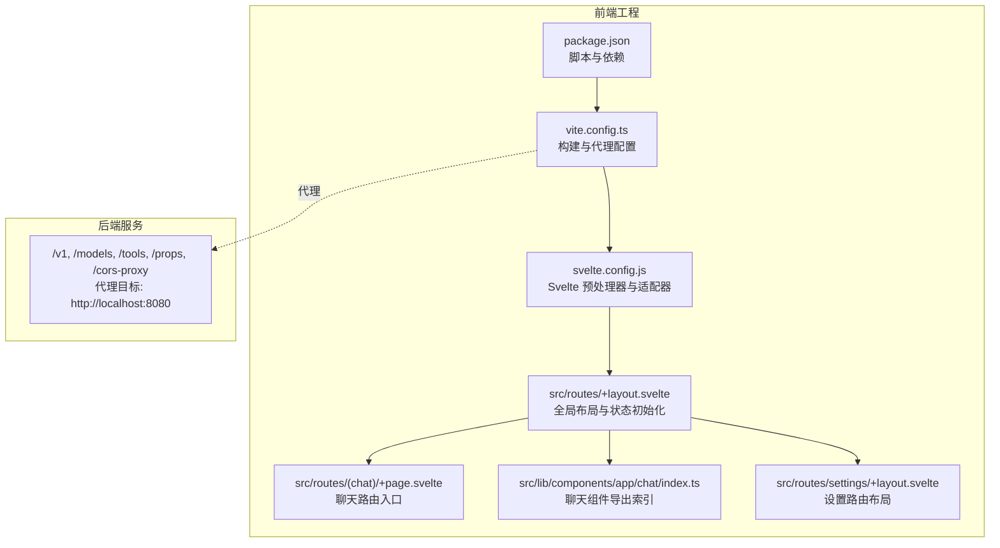
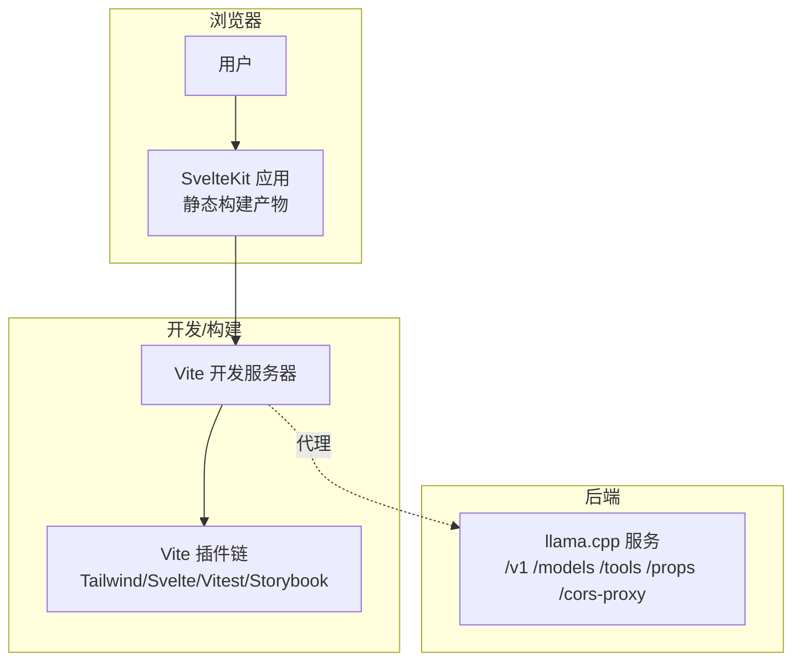
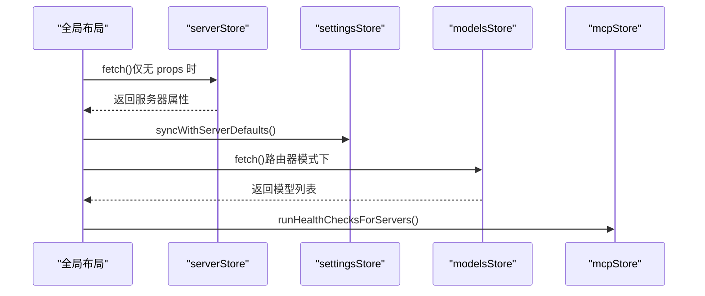
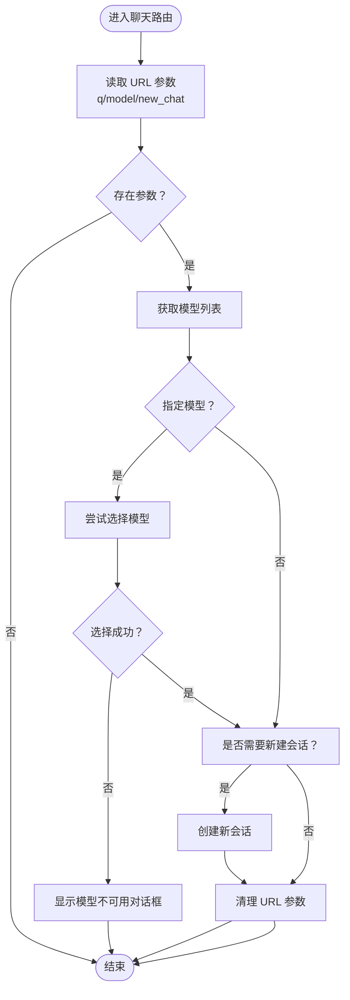
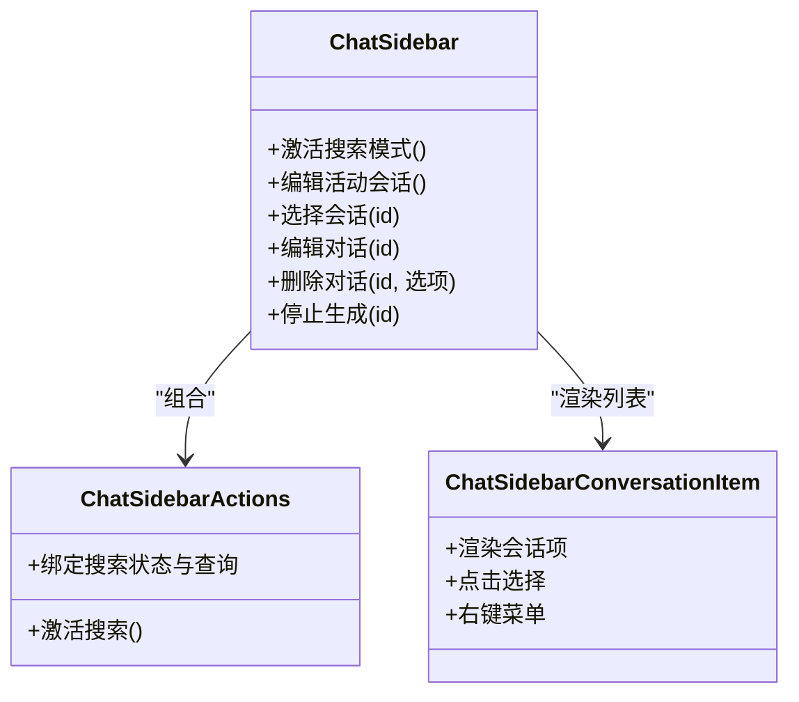
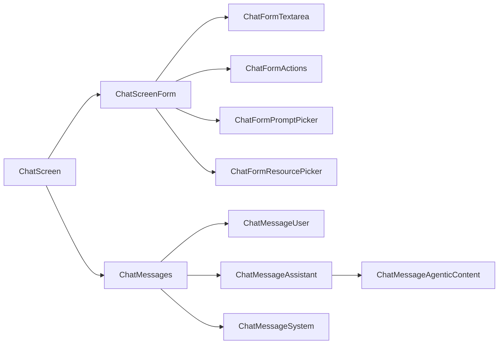
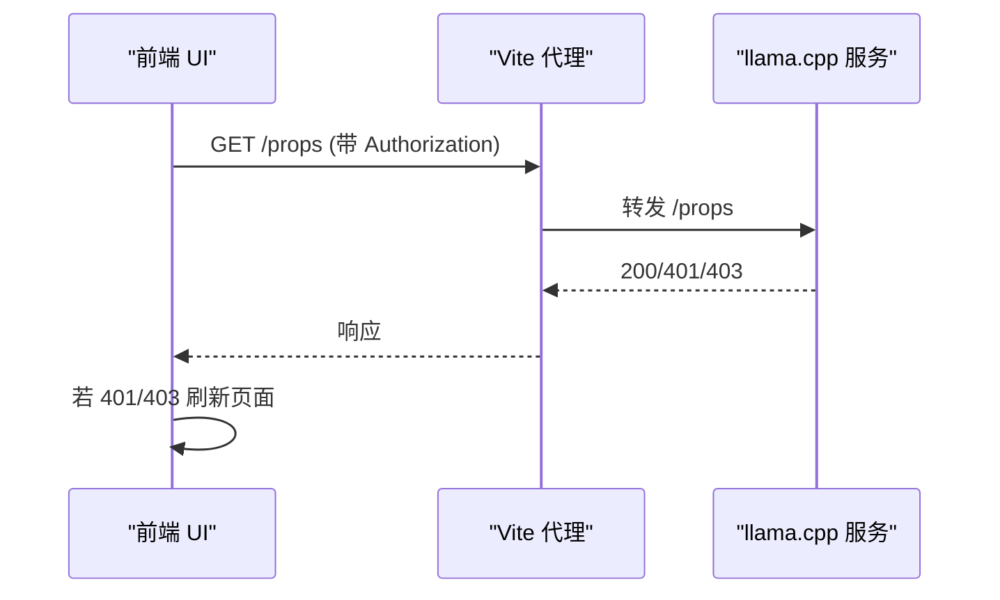
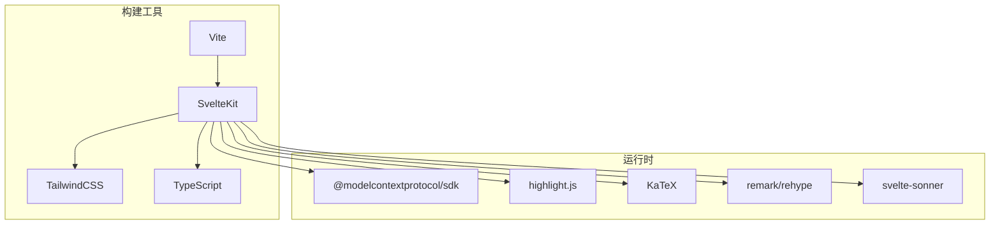

# Web UI 界面

<cite>
**本文引用的文件**
- [package.json](file://tools/server/webui/package.json)
- [vite.config.ts](file://tools/server/webui/vite.config.ts)
- [svelte.config.js](file://tools/server/webui/svelte.config.js)
- [+layout.svelte](file://tools/server/webui/src/routes/+layout.svelte)
- [+page.svelte（聊天路由）](file://tools/server/webui/src/routes/(chat)/+page.svelte)
- [ChatSidebar.svelte](file://tools/server/webui/src/lib/components/app/chat/ChatSidebar/ChatSidebar.svelte)
- [chat 组件索引](file://tools/server/webui/src/lib/components/app/chat/index.ts)
- [+layout.svelte（设置路由）](file://tools/server/webui/src/routes/settings/+layout.svelte)
</cite>

## 目录
1. [简介](#简介)
2. [项目结构](#项目结构)
3. [核心组件](#核心组件)
4. [架构总览](#架构总览)
5. [详细组件分析](#详细组件分析)
6. [依赖关系分析](#依赖关系分析)
7. [性能考量](#性能考量)
8. [故障排查指南](#故障排查指南)
9. [结论](#结论)
10. [附录](#附录)

## 简介
本文件系统性介绍 llama.cpp 内置 Web UI 的架构与实现，覆盖前端技术栈（Svelte、TypeScript、TailwindCSS、Vite）、用户界面组件（聊天界面、模型选择、设置面板、主题切换）、前后端交互机制（API 调用与状态管理）、界面定制与扩展、部署与开发环境配置，以及用户体验与无障碍支持。文档同时提供关键流程的可视化图示与定位到源码路径的参考，便于读者快速理解与深入开发。

## 项目结构
Web UI 位于 tools/server/webui 目录，采用 SvelteKit + Vite 的现代前端工程化方案，结合静态适配器输出可直接部署的静态页面。项目通过代理将前端请求转发至后端服务（默认本地 8080 端口），并提供 Storybook、Playwright、Vitest 等测试与文档工具链。

**图表来源**
- [package.json:1-97](file://tools/server/webui/package.json#L1-L97)
- [vite.config.ts:1-110](file://tools/server/webui/vite.config.ts#L1-L110)
- [svelte.config.js:1-38](file://tools/server/webui/svelte.config.js#L1-L38)
- [+layout.svelte:1-233](file://tools/server/webui/src/routes/+layout.svelte#L1-L233)
- [+page.svelte（聊天路由）](file://tools/server/webui/src/routes/(chat)/+page.svelte#L1-L104)
- [chat 组件索引:1-785](file://tools/server/webui/src/lib/components/app/chat/index.ts#L1-L785)
- [+layout.svelte（设置路由）:1-38](file://tools/server/webui/src/routes/settings/+layout.svelte#L1-L38)

**章节来源**
- [package.json:1-97](file://tools/server/webui/package.json#L1-L97)
- [vite.config.ts:1-110](file://tools/server/webui/vite.config.ts#L1-L110)
- [svelte.config.js:1-38](file://tools/server/webui/svelte.config.js#L1-L38)

## 核心组件
- 全局布局与状态初始化：在应用启动时拉取服务器属性、同步设置、在路由器模式下加载可用模型，并进行 API Key 变更检测与重定向。
- 聊天路由入口：处理 URL 参数（如预填模型、新建会话、预发消息），并在必要时自动创建会话与模型选择。
- 聊天侧边栏：展示最近会话、搜索过滤、重命名与删除对话、移动端交互与展开控制。
- 聊天组件体系：统一导出附件、表单、消息、屏幕容器、设置等模块化组件，支持多模态输入（图像、文本、PDF、音频）与 MCP 提示/资源选择。
- 设置路由布局：提供设置页关闭逻辑与移动端返回行为。

**章节来源**
- [+layout.svelte:1-233](file://tools/server/webui/src/routes/+layout.svelte#L1-L233)
- [+page.svelte（聊天路由）](file://tools/server/webui/src/routes/(chat)/+page.svelte#L1-L104)
- [ChatSidebar.svelte:1-295](file://tools/server/webui/src/lib/components/app/chat/ChatSidebar/ChatSidebar.svelte#L1-L295)
- [chat 组件索引:1-785](file://tools/server/webui/src/lib/components/app/chat/index.ts#L1-L785)
- [+layout.svelte（设置路由）:1-38](file://tools/server/webui/src/routes/settings/+layout.svelte#L1-L38)

## 架构总览
Web UI 采用“前端静态构建 + 后端服务代理”的架构。前端通过 Vite 开发服务器提供热更新与代理能力；生产环境下由 SvelteKit 静态适配器输出 HTML/CSS/JS，部署于任意静态站点或反向代理之后。全局布局负责一次性初始化服务器属性与设置同步，聊天路由负责根据 URL 参数执行会话与模型初始化，侧边栏提供会话导航与管理，聊天组件体系承载多模态输入与消息渲染。

**图表来源**
- [vite.config.ts:93-108](file://tools/server/webui/vite.config.ts#L93-L108)
- [+layout.svelte:136-163](file://tools/server/webui/src/routes/+layout.svelte#L136-L163)

## 详细组件分析

### 前端技术栈与构建配置
- 框架与语言：Svelte 5 + TypeScript，使用 SvelteKit 作为路由与构建框架。
- 样式与主题：TailwindCSS v4，SCSS 预处理，启用 Tailwind Forms/Typo 扩展，支持 KaTeX 字体别名。
- 构建与打包：Vite，开启最小化与大包警告阈值控制；ESBuild 行数限制与标识符最小化策略可调。
- 测试与文档：Playwright（端到端）、Vitest（单元/浏览器）、Storybook（UI 组件故事）。
- 代理与开发体验：开发服务器代理 /v1、/models、/tools、/props、/cors-proxy 到本地 8080 端口；COOP/COEP 头以支持 WebAssembly 线程。
- 适配器与输出：静态适配器，输出到 ../public，回退页面 index.html，版本名包含应用标识。

**章节来源**
- [package.json:25-96](file://tools/server/webui/package.json#L25-L96)
- [vite.config.ts:1-110](file://tools/server/webui/vite.config.ts#L1-L110)
- [svelte.config.js:1-38](file://tools/server/webui/svelte.config.js#L1-L38)

### 全局布局与状态管理
- 初始化服务器属性：仅在未加载时拉取，避免重复请求。
- 同步设置：服务器属性就绪后，将默认参数同步到本地设置存储。
- 路由器模式：在有模型列表且处于路由器模式时，异步获取路由器模型信息。
- MCP 健康检查：后台轮询已启用的 MCP 服务器健康状态。
- API Key 变更检测：在聊天/会话路由中定期校验鉴权状态，异常时刷新页面。
- 会话标题更新确认：通过对话框回调实现可取消的标题变更流程。

**图表来源**
- [+layout.svelte:80-134](file://tools/server/webui/src/routes/+layout.svelte#L80-L134)

**章节来源**
- [+layout.svelte:1-233](file://tools/server/webui/src/routes/+layout.svelte#L1-L233)

### 聊天路由与 URL 参数处理
- 支持的查询参数：q（预填入消息并新建会话）、model（预选模型）、new_chat（强制新建会话）。
- 加载顺序：先确保模型列表可用，再根据参数选择模型或创建会话；完成后清理 URL 参数防止重复提交。
- 路由器模式兼容：若当前模型未加载，则清空选择并尝试选择首个已加载模型。

**图表来源**
- [+page.svelte（聊天路由）](file://tools/server/webui/src/routes/(chat)/+page.svelte#L34-L92)

**章节来源**
- [+page.svelte（聊天路由）](file://tools/server/webui/src/routes/(chat)/+page.svelte#L1-L104)

### 聊天侧边栏与会话管理
- 功能概览：头部包含应用名称、移动端关闭按钮、侧边栏操作区；中部滚动区域展示会话树（支持搜索过滤）；底部提供删除与重命名对话的弹窗。
- 搜索模式：激活后仅展示匹配结果，支持按回车键在移动端触发搜索。
- 交互细节：点击会话项跳转到对应会话；右键菜单支持编辑与删除；删除可选择连同派生会话一并删除；移动端点击项后自动收起侧边栏。
- 与布局联动：当侧边栏关闭时，自动退出搜索模式并清空查询；支持从布局触发搜索与编辑活动会话。

**图表来源**
- [ChatSidebar.svelte:1-295](file://tools/server/webui/src/lib/components/app/chat/ChatSidebar/ChatSidebar.svelte#L1-L295)

**章节来源**
- [ChatSidebar.svelte:1-295](file://tools/server/webui/src/lib/components/app/chat/ChatSidebar/ChatSidebar.svelte#L1-L295)

### 聊天组件体系与多模态支持
- 附件系统：统一归一化数据库与上传态数据为显示项，支持图片缩略图、文件图标、PDF 文本提取/图像预览、MCP 提示/资源附件展开与全尺寸预览。
- 输入表单：支持富文本输入、拖拽/粘贴/选择文件、语音录制（模型支持时）、MCP 提示/资源选择、模型选择（路由器模式）。
- 消息渲染：区分用户/助手/系统消息，支持分支导航（编辑/重生成产生的替代版本）、统计信息、工具调用与推理块的可折叠渲染。
- 屏幕容器：整合消息列表、输入表单、拖拽覆盖层、处理信息展示，支持自动滚动与错误对话框管理。

**图表来源**
- [chat 组件索引:1-785](file://tools/server/webui/src/lib/components/app/chat/index.ts#L1-L785)

**章节来源**
- [chat 组件索引:1-785](file://tools/server/webui/src/lib/components/app/chat/index.ts#L1-L785)

### 设置面板与主题切换
- 设置路由布局：提供移动端关闭按钮，支持历史回退或回到首页。
- 设置参数同步：采样参数可来自服务器默认、用户自定义或应用默认，参数指示器实时反馈当前来源。
- 工具权限与 MCP 服务器管理：按组显示工具与 MCP 服务器，支持启用/禁用、健康状态指示与设置入口。

**章节来源**
- [+layout.svelte（设置路由）:1-38](file://tools/server/webui/src/routes/settings/+layout.svelte#L1-L38)
- [chat 组件索引:660-710](file://tools/server/webui/src/lib/components/app/chat/index.ts#L660-L710)

### 前后端交互机制
- 代理配置：开发服务器将 /v1、/models、/tools、/props、/cors-proxy 请求转发到 http://localhost:8080。
- 鉴权检测：在聊天/会话路由中，通过 /props 接口携带 Authorization 头验证 API Key，异常时刷新页面。
- COOP/COEP：设置跨源隔离头以支持 WebAssembly 线程与共享内存场景。

**图表来源**
- [+layout.svelte:136-163](file://tools/server/webui/src/routes/+layout.svelte#L136-L163)
- [vite.config.ts:93-108](file://tools/server/webui/vite.config.ts#L93-L108)

**章节来源**
- [+layout.svelte:136-163](file://tools/server/webui/src/routes/+layout.svelte#L136-L163)
- [vite.config.ts:93-108](file://tools/server/webui/vite.config.ts#L93-L108)

## 依赖关系分析
- 构建与工具链：Vite + SvelteKit + TailwindCSS + TypeScript + Prettier + ESLint + Vitest + Playwright + Storybook。
- 运行时依赖：MCP SDK、语法高亮、KaTeX、Markdown 渲染、通知提示等。
- 代理与安全：开发服务器代理后端接口，设置 COOP/COEP 以满足 WASM 线程要求。

**图表来源**
- [package.json:25-96](file://tools/server/webui/package.json#L25-L96)

**章节来源**
- [package.json:25-96](file://tools/server/webui/package.json#L25-L96)

## 性能考量
- 构建优化：启用最小化与大包警告阈值，合理设置内联资源阈值，避免过大的静态资源影响首屏。
- 代码分割：SvelteKit 默认按路由拆分，结合单 bundle 输出策略，平衡请求数与缓存命中。
- 图片与字体：Tailwind 配置优先使用 woff2，减少字体体积与加载时间。
- 交互性能：聊天侧边栏与消息列表使用虚拟滚动与懒加载策略（由具体组件实现），避免长列表卡顿。
- 代理与网络：开发代理减少跨域问题，生产环境建议使用 CDN 与反向代理提升响应速度。

## 故障排查指南
- API Key 变更导致 401/403：前端会在聊天/会话路由中定时校验 /props，若失败则刷新页面。检查后端鉴权配置与前端 Authorization 头是否正确。
- 代理不通：确认 vite.config.ts 中代理目标地址与端口正确，后端服务已启动。
- COOP/COEP 导致跨源隔离：若出现 WASM 线程相关错误，检查浏览器是否正确接收 COOP/COEP 头。
- 设置不同步：确保服务器属性已加载后再进行设置同步；检查 settingsStore 的同步逻辑。
- 会话搜索无结果：确认已打开搜索模式并输入有效关键词；移动端需先展开侧边栏。

**章节来源**
- [+layout.svelte:136-163](file://tools/server/webui/src/routes/+layout.svelte#L136-L163)
- [vite.config.ts:93-108](file://tools/server/webui/vite.config.ts#L93-L108)

## 结论
该 Web UI 以 SvelteKit + Vite 为基础，结合 TailwindCSS 与丰富的第三方生态，提供了完整的聊天、模型选择、设置与多模态输入体验。通过代理与状态初始化机制，实现了与后端服务的无缝对接；通过组件化与模块化设计，保证了可维护性与可扩展性。配合完善的测试与文档工具链，便于团队协作与持续演进。

## 附录
- 部署建议：使用 SvelteKit 静态适配器输出到 ../public，部署于 Nginx/Apache 或静态托管平台；如需 WebSocket/流式响应，请在反向代理层配置相应支持。
- 开发环境：安装 Node.js 与包管理器后，执行安装脚本与开发命令；通过代理访问后端服务，使用 Storybook 查看组件故事，使用 Playwright 进行端到端测试。
- 用户体验与无障碍：组件广泛使用语义化标签与屏幕阅读器友好的文案；提供键盘快捷键与触控优化；建议在生产环境增加可访问性测试与视觉对比度检查。