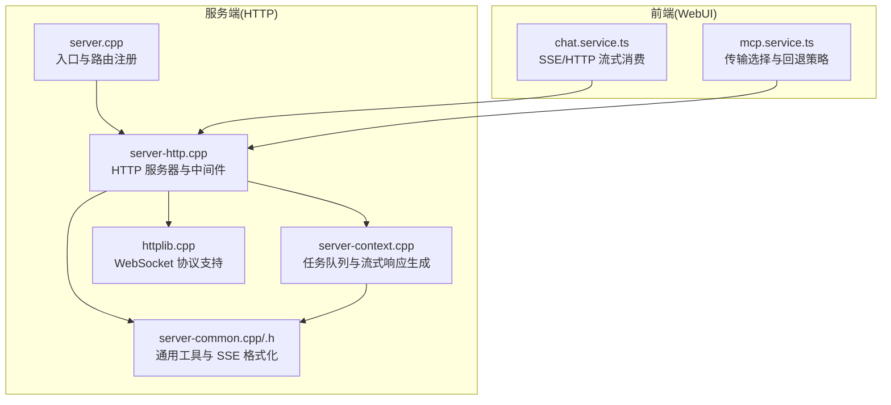
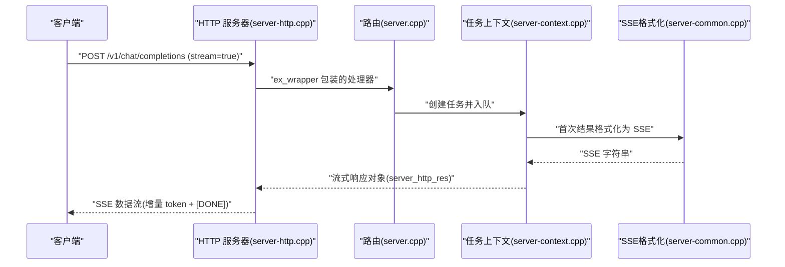
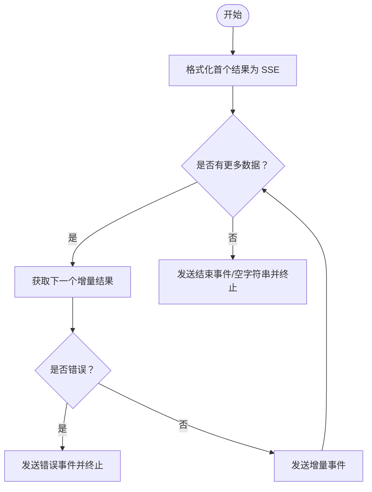
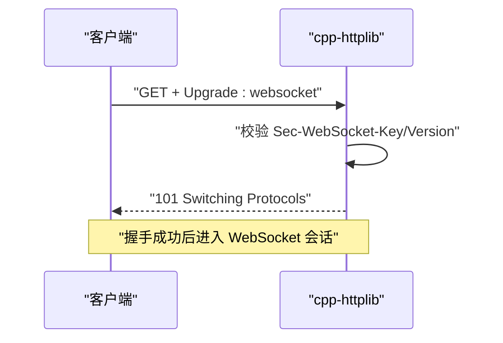
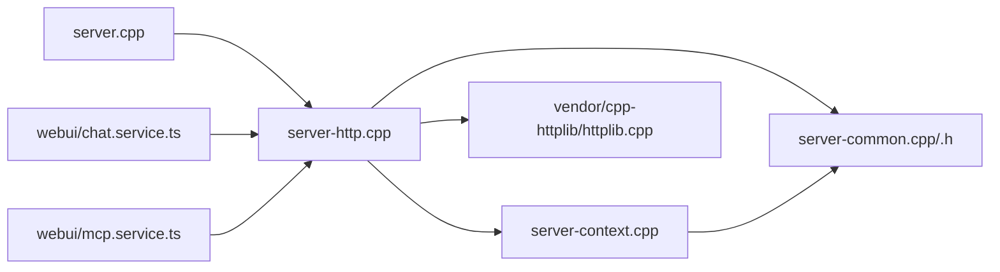
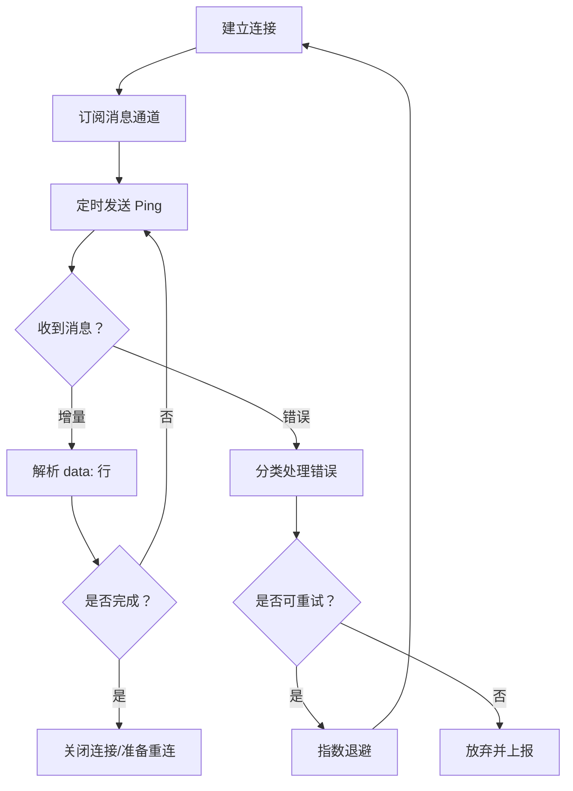

# WebSocket 实时通信

<cite>
**本文档引用的文件**
- [server-http.cpp](file://tools/server/server-http.cpp)
- [server-common.cpp](file://tools/server/server-common.cpp)
- [server-common.h](file://tools/server/server-common.h)
- [server-context.cpp](file://tools/server/server-context.cpp)
- [server.cpp](file://tools/server/server.cpp)
- [httplib.cpp](file://vendor/cpp-httplib/httplib.cpp)
- [chat.service.ts](file://tools/server/webui/src/lib/services/chat.service.ts)
- [mcp.service.ts](file://tools/server/webui/src/lib/services/mcp.service.ts)
</cite>

## 目录
1. [简介](#简介)
2. [项目结构](#项目结构)
3. [核心组件](#核心组件)
4. [架构总览](#架构总览)
5. [详细组件分析](#详细组件分析)
6. [依赖关系分析](#依赖关系分析)
7. [性能考虑](#性能考虑)
8. [故障排查指南](#故障排查指南)
9. [结论](#结论)
10. [附录](#附录)

## 简介
本文件系统性阐述 llama.cpp 服务端在实时通信方面的实现，重点覆盖以下方面：
- 连接建立：HTTP 服务器如何初始化、路由注册与中间件处理
- 消息格式与事件类型：SSE（Server-Sent Events）事件格式与 OpenAI/Anthropic 兼容的消息结构
- 流式响应：增量 token 传输与完成信号的实现机制
- 客户端集成示例：WebSocket/SSE/HTTP 流式传输的使用方式、连接管理、错误处理与重连策略
- 与 HTTP API 的差异与适用场景
- 性能优化建议与调试技巧
- 完整客户端代码示例与最佳实践

## 项目结构
llama.cpp 的实时通信能力由服务端 HTTP 层、通用工具层与第三方 HTTP 库共同构成，并通过 WebUI 提供前端示例。

**图表来源**
- [server.cpp:74-200](file://tools/server/server.cpp#L74-L200)
- [server-http.cpp:54-299](file://tools/server/server-http.cpp#L54-L299)
- [server-common.cpp:1347-1407](file://tools/server/server-common.cpp#L1347-L1407)
- [server-context.cpp:3290-3404](file://tools/server/server-context.cpp#L3290-L3404)
- [httplib.cpp:808-846](file://vendor/cpp-httplib/httplib.cpp#L808-L846)
- [chat.service.ts:482-532](file://tools/server/webui/src/lib/services/chat.service.ts#L482-L532)
- [mcp.service.ts:354-452](file://tools/server/webui/src/lib/services/mcp.service.ts#L354-L452)

**章节来源**
- [server.cpp:74-200](file://tools/server/server.cpp#L74-L200)
- [server-http.cpp:54-299](file://tools/server/server-http.cpp#L54-L299)

## 核心组件
- HTTP 服务器与中间件：负责请求解析、鉴权、健康检查、线程池配置与静态资源托管
- 通用工具层：提供 SSE 格式化函数，统一 OpenAI/Anthropic 风格的事件输出
- 任务上下文与流式生成：将推理结果以增量方式输出，支持 [DONE] 结束标记
- 第三方 HTTP 库：提供 WebSocket 握手与帧处理能力
- 前端服务：演示如何消费 SSE/HTTP 流式数据，以及传输选择与错误处理

**章节来源**
- [server-http.cpp:54-299](file://tools/server/server-http.cpp#L54-L299)
- [server-common.cpp:1347-1407](file://tools/server/server-common.cpp#L1347-L1407)
- [server-context.cpp:3290-3404](file://tools/server/server-context.cpp#L3290-L3404)
- [httplib.cpp:808-846](file://vendor/cpp-httplib/httplib.cpp#L808-L846)
- [chat.service.ts:482-532](file://tools/server/webui/src/lib/services/chat.service.ts#L482-L532)
- [mcp.service.ts:354-452](file://tools/server/webui/src/lib/services/mcp.service.ts#L354-L452)

## 架构总览
llama.cpp 的实时通信采用“HTTP + SSE”为主、可选 WebSocket 的混合方案。后端通过任务队列产生增量结果，前端以 SSE 或 HTTP 流式接口消费；WebSocket 在第三方库中具备握手与帧处理能力，但当前服务端未直接暴露 WebSocket 路由。

**图表来源**
- [server.cpp:172-200](file://tools/server/server.cpp#L172-L200)
- [server-http.cpp:387-420](file://tools/server/server-http.cpp#L387-L420)
- [server-context.cpp:3290-3404](file://tools/server/server-context.cpp#L3290-L3404)
- [server-common.cpp:1347-1407](file://tools/server/server-common.cpp#L1347-L1407)

## 详细组件分析

### HTTP 服务器与中间件
- 初始化与线程池：根据参数设置 HTTP 线程数，默认使用固定线程池与最大动态线程上限
- 中间件链：
  - CORS 与预检请求处理
  - 服务器状态检查（加载中返回 503）
  - API Key 校验（支持多端点白名单）
- 静态资源与 WebUI：可嵌入或挂载本地目录
- 请求处理：将请求封装为内部结构，调用处理器生成响应，支持同步与流式两种模式

**章节来源**
- [server-http.cpp:54-299](file://tools/server/server-http.cpp#L54-L299)
- [server-http.cpp:387-420](file://tools/server/server-http.cpp#L387-L420)
- [server.cpp:172-200](file://tools/server/server.cpp#L172-L200)

### SSE 格式化与事件类型
- OpenAI 风格 SSE：逐条发送 data: JSON 对象，末尾以空行分隔
- OpenAI 响应事件 SSE：支持 event/data 键，用于区分不同事件类型
- Anthropic 风格 SSE：兼容 event/data 格式，便于统一消费
- 完成信号：当无更多数据时，返回空字符串或 [DONE]（视具体实现）

**章节来源**
- [server-common.cpp:1347-1407](file://tools/server/server-common.cpp#L1347-L1407)

### 流式响应生成与增量 token 传输
- 首次结果：将首个部分结果格式化为 SSE 字符串
- 后续增量：通过回调函数持续获取任务结果，逐条输出增量 token
- 终止条件：连接关闭、显式停止、错误发生或无更多数据
- 内容类型：text/event-stream

**图表来源**
- [server-context.cpp:3305-3400](file://tools/server/server-context.cpp#L3305-L3400)

**章节来源**
- [server-context.cpp:3290-3404](file://tools/server/server-context.cpp#L3290-L3404)

### WebSocket 支持与握手流程
- 握手校验：检查 Upgrade/Connection 头、Sec-WebSocket-Key、版本号等
- 帧处理：支持掩码与非掩码帧、扩展长度字段、控制帧限制
- 当前状态：第三方库提供握手与帧处理能力，但服务端未直接注册 WebSocket 路由

**图表来源**
- [httplib.cpp:814-846](file://vendor/cpp-httplib/httplib.cpp#L814-L846)
- [httplib.cpp:848-907](file://vendor/cpp-httplib/httplib.cpp#L848-L907)

**章节来源**
- [httplib.cpp:808-846](file://vendor/cpp-httplib/httplib.cpp#L808-L846)
- [httplib.cpp:848-907](file://vendor/cpp-httplib/httplib.cpp#L848-L907)

### 前端消费与传输选择
- SSE/HTTP 流式消费：按行解析 data: 行，遇到空行结束一条事件
- 传输回退策略：优先 WebSocket（若可用），否则回退到 StreamableHTTP，再回退到 SSE
- 错误映射：网络错误、超时、连接拒绝等用户友好提示

**章节来源**
- [chat.service.ts:482-532](file://tools/server/webui/src/lib/services/chat.service.ts#L482-L532)
- [mcp.service.ts:354-452](file://tools/server/webui/src/lib/services/mcp.service.ts#L354-L452)

## 依赖关系分析

**图表来源**
- [server.cpp:74-200](file://tools/server/server.cpp#L74-L200)
- [server-http.cpp:54-299](file://tools/server/server-http.cpp#L54-L299)
- [server-common.cpp:1347-1407](file://tools/server/server-common.cpp#L1347-L1407)
- [server-context.cpp:3290-3404](file://tools/server/server-context.cpp#L3290-L3404)
- [httplib.cpp:808-846](file://vendor/cpp-httplib/httplib.cpp#L808-L846)
- [chat.service.ts:482-532](file://tools/server/webui/src/lib/services/chat.service.ts#L482-L532)
- [mcp.service.ts:354-452](file://tools/server/webui/src/lib/services/mcp.service.ts#L354-L452)

**章节来源**
- [server.cpp:74-200](file://tools/server/server.cpp#L74-L200)
- [server-http.cpp:54-299](file://tools/server/server-http.cpp#L54-L299)

## 性能考虑
- 线程池配置：合理设置 HTTP 线程数，避免过多动态线程导致上下文切换开销
- 流式写入：利用 chunked_content_provider 与 DataSink，减少内存占用
- 编码与解码：SSE 输出采用安全 JSON 序列化，避免大对象重复拷贝
- 前端缓冲：客户端按行解析，注意 UTF-8 边界，避免截断导致解析失败
- 超时与重试：结合服务端读/写超时与客户端指数退避重试策略

[本节为通用指导，无需特定文件引用]

## 故障排查指南
- 503 服务不可用：模型加载中，等待完成后重试
- 401 未授权：检查 API Key 是否正确传递
- 404 文件不存在：确认静态资源路径与挂载点
- SSE 解析异常：确保每条事件以空行结尾，逐行读取 data: 行
- 网络错误与超时：检查服务端监听地址、防火墙与代理设置

**章节来源**
- [server-http.cpp:98-112](file://tools/server/server-http.cpp#L98-L112)
- [server-http.cpp:198-246](file://tools/server/server-http.cpp#L198-L246)
- [chat.service.ts:252-281](file://tools/server/webui/src/lib/services/chat.service.ts#L252-L281)

## 结论
llama.cpp 的实时通信以 HTTP + SSE 为核心，配合任务队列与增量输出，实现了低延迟、高吞吐的流式响应。WebSocket 能力由底层库提供，但服务端当前未直接暴露 WebSocket 路由。前端提供了灵活的传输选择与错误处理策略，便于在不同网络环境下稳定运行。

[本节为总结性内容，无需特定文件引用]

## 附录

### WebSocket 客户端集成示例（概念性流程）
- 连接管理：建立连接后订阅消息通道，维护心跳与 Ping/Pong
- 错误处理：捕获网络异常、协议错误与业务错误，进行分类处理
- 重连机制：指数退避与最大重试次数，避免雪崩效应
- 事件解析：按行解析 data: 与 event:，识别完成信号与错误事件

[本图为概念性流程图，不对应具体源码，故无图表来源]

### 与 HTTP API 的区别与适用场景
- HTTP API：一次性请求/响应，适合批量处理与简单交互
- 实时流式：SSE/HTTP 流式或 WebSocket，适合对话、推理过程可视化与长会话场景
- 选择建议：需要即时反馈与进度展示时优先流式；对延迟敏感且网络环境稳定时可考虑 WebSocket

[本节为通用指导，无需特定文件引用]