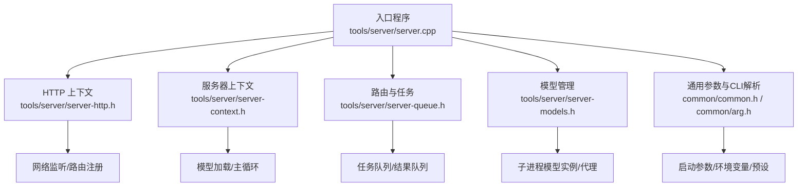
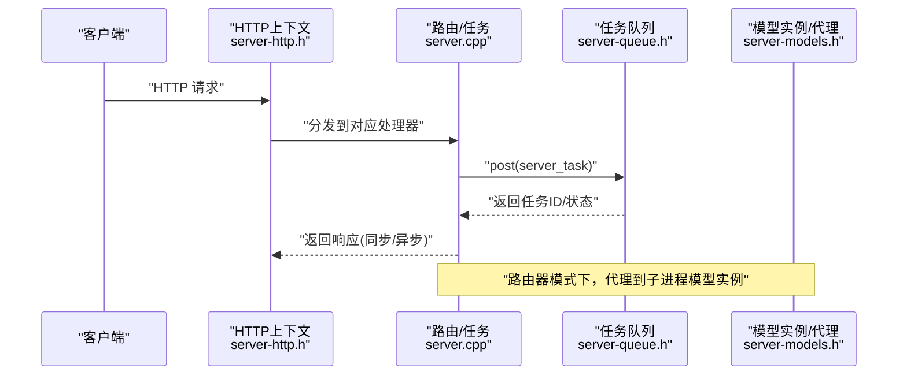
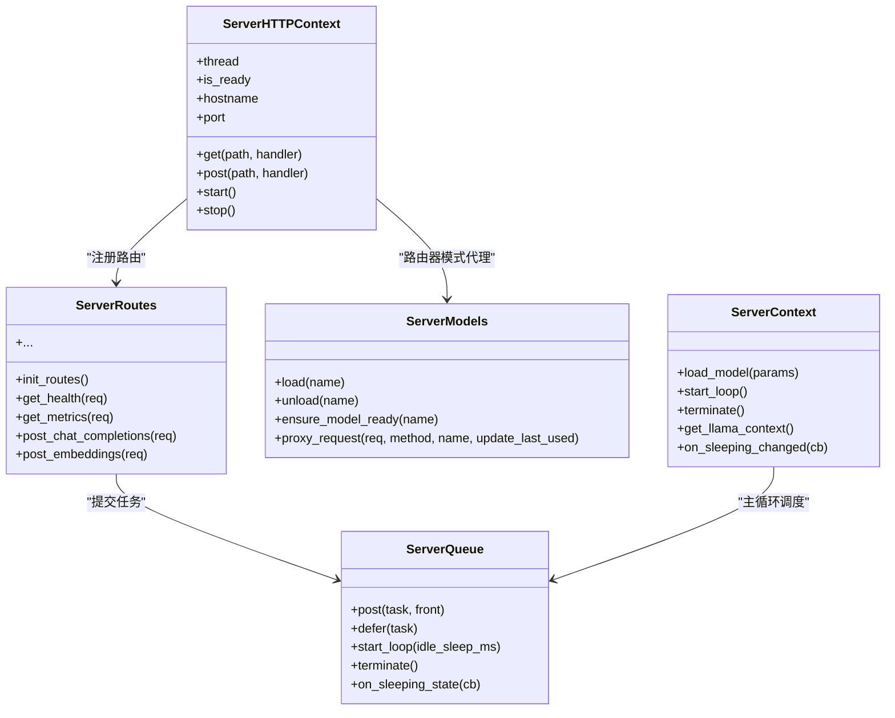

# 服务器配置

<cite>
**本文引用的文件**
- [tools/server/server.cpp](file://tools/server/server.cpp)
- [tools/server/server-common.h](file://tools/server/server-common.h)
- [tools/server/server-http.h](file://tools/server/server-http.h)
- [tools/server/server-queue.h](file://tools/server/server-queue.h)
- [tools/server/server-models.h](file://tools/server/server-models.h)
- [tools/server/server-context.h](file://tools/server/server-context.h)
- [common/common.h](file://common/common.h)
- [common/arg.h](file://common/arg.h)
- [.devops/cpu.Dockerfile](file://.devops/cpu.Dockerfile)
</cite>

## 目录
1. [简介](#简介)
2. [项目结构](#项目结构)
3. [核心组件](#核心组件)
4. [架构总览](#架构总览)
5. [详细组件分析](#详细组件分析)
6. [依赖关系分析](#依赖关系分析)
7. [性能考虑](#性能考虑)
8. [故障排查指南](#故障排查指南)
9. [结论](#结论)
10. [附录](#附录)

## 简介
本文件系统性介绍 llama.cpp HTTP 服务器的配置与管理，覆盖启动参数、环境变量与配置文件的使用；并发控制、线程池与资源限制；内存管理策略（KV 缓存大小与批处理）；模型路由与负载均衡；性能调优（吞吐与延迟）；监控指标与日志；安全配置（CORS、API 密钥、访问控制）；以及 Docker 部署示例。内容基于仓库中的服务端实现与通用参数体系，帮助用户在生产环境中稳定、高效地运行服务。

## 项目结构
HTTP 服务器由“入口程序 + HTTP 上下文 + 路由与任务队列 + 模型管理 + 通用参数”等模块组成。入口负责解析参数、初始化后端、启动 HTTP 服务、加载模型或作为路由器代理请求；HTTP 层封装请求/响应与路由注册；任务队列负责并发调度与睡眠唤醒；模型管理支持单实例与多实例子进程模式，并提供路由与代理能力。

图示来源
- [tools/server/server.cpp:74-354](file://tools/server/server.cpp#L74-L354)
- [tools/server/server-http.h:63-90](file://tools/server/server-http.h#L63-L90)
- [tools/server/server-context.h:54-84](file://tools/server/server-context.h#L54-L84)
- [tools/server/server-queue.h:13-206](file://tools/server/server-queue.h#L13-L206)
- [tools/server/server-models.h:86-162](file://tools/server/server-models.h#L86-L162)
- [common/common.h:70-200](file://common/common.h#L70-L200)
- [common/arg.h:19-134](file://common/arg.h#L19-L134)

章节来源
- [tools/server/server.cpp:74-354](file://tools/server/server.cpp#L74-L354)
- [tools/server/server-http.h:63-90](file://tools/server/server-http.h#L63-L90)
- [tools/server/server-context.h:54-84](file://tools/server/server-context.h#L54-L84)
- [tools/server/server-queue.h:13-206](file://tools/server/server-queue.h#L13-L206)
- [tools/server/server-models.h:86-162](file://tools/server/server-models.h#L86-L162)
- [common/common.h:70-200](file://common/common.h#L70-L200)
- [common/arg.h:19-134](file://common/arg.h#L19-L134)

## 核心组件
- 入口与生命周期：解析参数、初始化后端、启动 HTTP 服务、加载模型、信号处理与优雅停机。
- HTTP 上下文：封装监听地址、端口、线程、路由注册、请求/响应对象与异常包装器。
- 服务器上下文：模型加载、主循环、睡眠状态回调、元数据暴露。
- 任务队列：任务入队/出队、延迟队列、睡眠唤醒、结果聚合。
- 模型管理：单实例/多实例模式、子进程生命周期、状态机、路由与代理。
- 通用参数：CPU 线程、批处理、上下文大小、采样参数、预设与环境变量映射。

章节来源
- [tools/server/server.cpp:74-354](file://tools/server/server.cpp#L74-L354)
- [tools/server/server-http.h:63-90](file://tools/server/server-http.h#L63-L90)
- [tools/server/server-context.h:54-84](file://tools/server/server-context.h#L54-L84)
- [tools/server/server-queue.h:13-206](file://tools/server/server-queue.h#L13-L206)
- [tools/server/server-models.h:86-162](file://tools/server/server-models.h#L86-L162)
- [common/common.h:57-200](file://common/common.h#L57-L200)
- [common/arg.h:19-134](file://common/arg.h#L19-L134)

## 架构总览
HTTP 服务器采用“单线程事件循环 + 多工作线程队列”的模式：HTTP 线程负责监听与路由分发；任务队列线程负责推理执行；可选的子进程模型实例通过 HTTP 代理进行路由与负载均衡。

图示来源
- [tools/server/server.cpp:126-226](file://tools/server/server.cpp#L126-L226)
- [tools/server/server-queue.h:34-76](file://tools/server/server-queue.h#L34-L76)
- [tools/server/server-models.h:150-162](file://tools/server/server-models.h#L150-L162)

## 详细组件分析

### 启动参数、环境变量与配置文件
- 参数来源与优先级
  - 命令行参数：通过通用参数解析器填充 common_params。
  - 环境变量：部分参数可通过 env 映射注入（参见 common_arg 的 env 字段）。
  - 预设（preset）：支持从预设文件加载参数，部分参数仅用于预设（preset-only）。
- 关键参数类别
  - 运行与网络：主机名、端口、路径前缀、健康检查、WebUI 设置。
  - 并发与批处理：n_parallel、n_batch、n_ubatch、idle_sleep_ms。
  - 内存与上下文：n_ctx、rope_freq_*、pooling_type 等。
  - 采样与生成：温度、top_k、top_p、典型采样等（在通用采样枚举中定义）。
  - 多模态与工具：MTMD、内置工具开关、CORS 代理等。
- 解析与验证
  - 入口处对嵌入模式下的批处理一致性进行校验。
  - 自动并行模式时统一 KV 策略与并行数。
  - 模型别名自动回填为 alias。

章节来源
- [tools/server/server.cpp:78-105](file://tools/server/server.cpp#L78-L105)
- [tools/server/server.cpp:86-93](file://tools/server/server.cpp#L86-L93)
- [common/arg.h:19-104](file://common/arg.h#L19-L104)
- [common/common.h:102-176](file://common/common.h#L102-L176)

### 并发控制、线程池与资源限制
- 线程与并发
  - n_parallel：并行请求槽位数量；当为负值时启用自动模式并统一 KV。
  - n_threads：CPU 线程数（常见参数结构中定义）。
  - idle_sleep_ms：空闲睡眠阈值，用于降低空闲时资源占用。
- 任务队列
  - 主队列与延迟队列分离，支持高优先级前置入队。
  - 支持睡眠状态切换与回调通知，便于外部监控。
- 资源限制
  - n_batch/n_ubatch：批处理与微批处理大小，影响 KV 与吞吐。
  - n_ctx：上下文长度，影响 KV 缓存容量与显存占用。
  - pooling_type：嵌入池化类型，影响向量维度与内存。

章节来源
- [tools/server/server.cpp:95-100](file://tools/server/server.cpp#L95-L100)
- [tools/server/server-queue.h:13-115](file://tools/server/server-queue.h#L13-L115)
- [common/common.h:57-64](file://common/common.h#L57-L64)

### 内存管理策略（KV 缓存、批处理）
- KV 缓存
  - 统一 KV（kv_unified）在自动并行模式下启用，有助于减少跨实例 KV 分散。
  - 路由器模式下，子进程实例各自维护 KV，HTTP 代理转发请求。
- 批处理与上下文
  - 嵌入模式要求所有 token 在单个微批内处理，入口会强制 n_batch ≤ n_ubatch。
  - n_ctx 控制最大上下文，直接影响 KV 表大小与内存占用。
- 内存分解打印
  - 退出时打印内存分解信息，辅助定位内存问题。

章节来源
- [tools/server/server.cpp:95-100](file://tools/server/server.cpp#L95-L100)
- [tools/server/server.cpp:86-93](file://tools/server/server.cpp#L86-L93)
- [tools/server/server.cpp:346-350](file://tools/server/server.cpp#L346-L350)

### 模型路由与负载均衡
- 单实例模式：直接加载模型，提供完整 API。
- 路由器模式：不加载具体模型，仅管理子进程模型实例，按需代理请求。
- 子进程模型实例
  - 状态机：UNLOADED → LOADING → LOADED ← SLEEPING。
  - 支持 LRU 清理、就绪检测、睡眠状态通知。
- 负载均衡
  - 通过子进程实例的就绪状态与睡眠状态进行动态调度。
  - 路由器对多个实例进行代理，结合健康检查与就绪状态。

章节来源
- [tools/server/server.cpp:125-170](file://tools/server/server.cpp#L125-L170)
- [tools/server/server-models.h:14-55](file://tools/server/server-models.h#L14-L55)
- [tools/server/server-models.h:150-162](file://tools/server/server-models.h#L150-L162)

### 性能调优指南（吞吐与延迟）
- 吞吐优化
  - 提升 n_parallel：增加并行槽位，但需平衡 KV 统一与内存占用。
  - 合理设置 n_batch/n_ubatch：在保证一致性前提下提升批处理效率。
  - 启用自动并行模式：自动选择合理并行数与 KV 统一策略。
- 延迟降低
  - 合理 idle_sleep_ms：避免频繁唤醒导致抖动。
  - 使用睡眠状态回调：在进入睡眠前触发清理，减少唤醒成本。
  - 优化 n_ctx：根据实际需求调整上下文长度，避免过度缓存。
- 采样与生成
  - 通过采样参数（温度、top_k、top_p 等）调节生成行为，间接影响吞吐与延迟权衡。

章节来源
- [tools/server/server.cpp:95-100](file://tools/server/server.cpp#L95-L100)
- [tools/server/server-queue.h:62-76](file://tools/server/server-queue.h#L62-L76)
- [common/common.h:102-176](file://common/common.h#L102-L176)

### 监控指标与日志
- 指标与健康
  - /health：公开健康检查端点。
  - /metrics：公开指标端点（由路由层注册）。
- 日志
  - 统一日志宏（SRV_*、SLT_*），便于区分服务器与槽位级别日志。
  - 异常包装器将未捕获异常转换为错误响应并记录日志。
- 内存分解
  - 退出时输出内存分解信息，辅助诊断内存问题。

章节来源
- [tools/server/server.cpp:172-178](file://tools/server/server.cpp#L172-L178)
- [tools/server/server.cpp:174](file://tools/server/server.cpp#L174)
- [tools/server/server.cpp:39-72](file://tools/server/server.cpp#L39-L72)
- [tools/server/server.cpp:346-350](file://tools/server/server.cpp#L346-L350)

### 安全配置（CORS、API 密钥、访问控制）
- CORS 代理
  - 实验性功能，仅在启用 webui_mcp_proxy 时开放 /cors-proxy GET/POST。
  - 警告：该功能实验性且不建议在不受信任环境暴露。
- 内置工具
  - 实验性功能，仅在启用 server_tools 时开放 /tools GET/POST。
  - 警告：该功能实验性且不建议在不受信任环境暴露。
- API 密钥与访问控制
  - 当前路由层未内置 API Key 校验逻辑；如需鉴权，请在反向代理层（如 Nginx/Traefik）或网关侧实现。
- HTTPS 与 TLS
  - 未在仓库中发现内置 TLS 终止；建议通过反向代理提供 HTTPS。

章节来源
- [tools/server/server.cpp:207-225](file://tools/server/server.cpp#L207-L225)
- [tools/server/server.cpp:208-215](file://tools/server/server.cpp#L208-L215)

### Docker 部署配置示例
- 多阶段构建
  - 构建阶段安装编译工具链，使用 CMake 构建二进制与共享库。
  - 基础镜像仅包含运行时依赖。
  - full/light/server 三种镜像变体，分别包含完整工具、仅 CLI、仅服务端。
- 环境变量
  - 默认绑定 0.0.0.0，可通过环境变量覆盖。
- 健康检查
  - 使用 curl 对 /health 进行探测。
- 入口命令
  - server 变体以 /app/llama-server 为入口，直接启动服务端。

章节来源
- [.devops/cpu.Dockerfile:1-92](file://.devops/cpu.Dockerfile#L1-L92)

## 依赖关系分析

图示来源
- [tools/server/server-http.h:63-90](file://tools/server/server-http.h#L63-L90)
- [tools/server/server-context.h:54-84](file://tools/server/server-context.h#L54-L84)
- [tools/server/server-queue.h:13-115](file://tools/server/server-queue.h#L13-L115)
- [tools/server/server-models.h:86-162](file://tools/server/server-models.h#L86-L162)
- [tools/server/server.cpp:126-226](file://tools/server/server.cpp#L126-L226)

## 性能考虑
- 吞吐与延迟权衡
  - 增大 n_parallel 提升并发，但需关注 KV 统一与内存压力。
  - 合理设置 n_batch/n_ubatch，避免嵌入模式下的断言失败。
  - 通过 idle_sleep_ms 平衡空闲资源占用与唤醒开销。
- 内存与上下文
  - n_ctx 影响 KV 表规模，应根据模型与硬件能力设定。
  - 启用睡眠状态回调可在进入睡眠前清理缓存，降低唤醒成本。
- 采样参数
  - 采样策略（top_k、top_p、温度等）影响生成速度与质量，需结合业务场景调优。

章节来源
- [tools/server/server.cpp:95-100](file://tools/server/server.cpp#L95-L100)
- [tools/server/server-queue.h:62-76](file://tools/server/server-queue.h#L62-L76)
- [common/common.h:102-176](file://common/common.h#L102-L176)

## 故障排查指南
- 常见问题
  - 嵌入模式报错：确保 n_batch ≤ n_ubatch（入口已做强制对齐）。
  - 路由器模式无法加载：检查子进程实例状态与就绪标志。
  - 空闲唤醒抖动：适当增大 idle_sleep_ms 或启用睡眠回调清理。
- 日志与错误
  - 异常包装器将异常转为 500 错误响应并记录日志。
  - 使用 SRV_* 与 SLT_* 宏区分服务器与槽位日志级别。
- 退出诊断
  - 退出时打印内存分解，辅助定位内存泄漏或异常占用。

章节来源
- [tools/server/server.cpp:86-93](file://tools/server/server.cpp#L86-L93)
- [tools/server/server.cpp:39-72](file://tools/server/server.cpp#L39-L72)
- [tools/server/server.cpp:346-350](file://tools/server/server.cpp#L346-L350)

## 结论
llama.cpp HTTP 服务器通过清晰的模块划分与通用参数体系，提供了灵活的部署与运维能力。结合合理的并发与批处理配置、内存与上下文参数调优、以及路由器模式的子进程代理，可在不同场景下实现稳定的吞吐与低延迟。建议在生产环境通过反向代理实现 TLS、鉴权与限流，并配合健康检查与日志监控保障稳定性。

## 附录

### A. 启动参数与环境变量映射要点
- 命令行参数：通过 common_params_parse 解析，支持采样、SPEC、预设等分类参数。
- 环境变量：部分参数可通过 env 映射注入（参见 common_arg 的 env 字段）。
- 预设（preset-only）：仅用于预设加载，不在 CLI 中直接出现。

章节来源
- [common/arg.h:19-104](file://common/arg.h#L19-L104)
- [common/common.h:102-176](file://common/common.h#L102-L176)

### B. Docker 部署要点
- 使用 server 变体镜像，容器默认绑定 0.0.0.0 并提供健康检查。
- 如需 HTTPS，请在反向代理层提供 TLS 终止。
- 通过环境变量传递启动参数（例如 LLAMA_ARG_HOST/PORT 等，视具体镜像与入口脚本而定）。

章节来源
- [.devops/cpu.Dockerfile:83-92](file://.devops/cpu.Dockerfile#L83-L92)