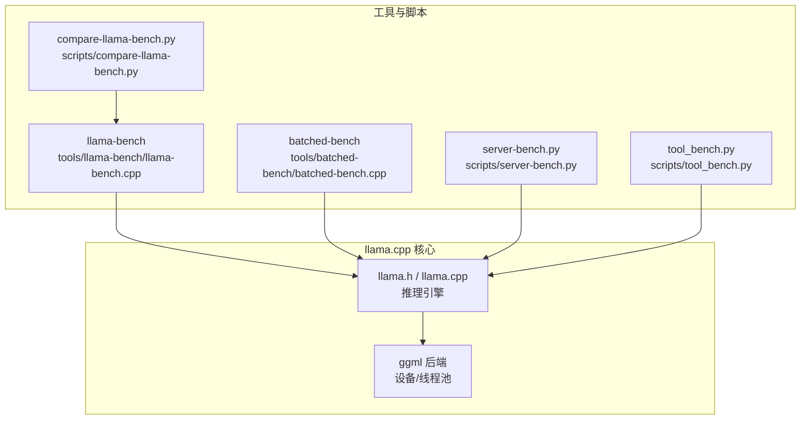
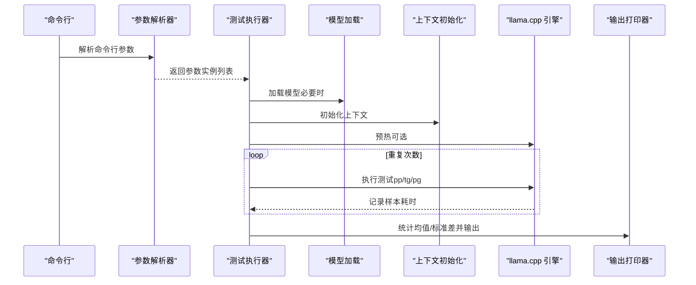
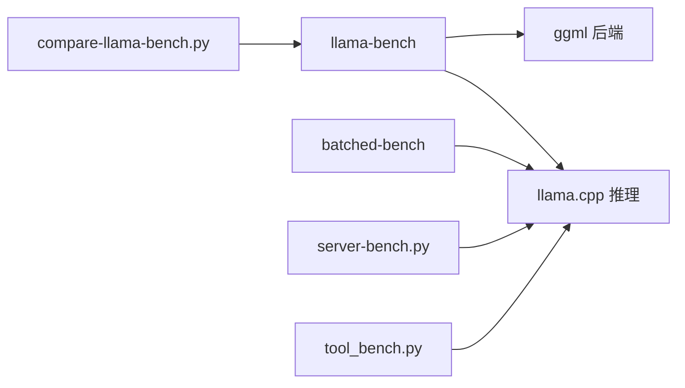

# llama-bench 基准测试工具

<cite>
**本文档引用的文件**
- [llama-bench.cpp](file://tools/llama-bench/llama-bench.cpp)
- [README.md](file://tools/llama-bench/README.md)
- [batched-bench.cpp](file://tools/batched-bench/batched-bench.cpp)
- [README.md](file://tools/batched-bench/README.md)
- [compare-llama-bench.py](file://scripts/compare-llama-bench.py)
- [server-bench.py](file://scripts/server-bench.py)
- [tool_bench.py](file://scripts/tool_bench.py)
</cite>

## 目录
1. [简介](#简介)
2. [项目结构](#项目结构)
3. [核心组件](#核心组件)
4. [架构总览](#架构总览)
5. [详细组件分析](#详细组件分析)
6. [依赖关系分析](#依赖关系分析)
7. [性能考量](#性能考量)
8. [故障排查指南](#故障排查指南)
9. [结论](#结论)
10. [附录](#附录)

## 简介
llama-bench 是 llama.cpp 提供的高性能推理基准测试工具，用于系统性评估模型在不同硬件与配置下的推理性能。它支持多种测试模式（提示处理、文本生成、提示+生成组合），并输出平均吞吐量（tokens/s）及标准差，同时提供多种输出格式（Markdown、CSV、JSON、JSONL、SQL）。配合批量基准工具（batched-bench）与比较脚本（compare-llama-bench.py），可完成跨平台、跨配置的对比分析与可视化。

## 项目结构
llama-bench 工具位于 tools/llama-bench 目录，配套的批量基准工具位于 tools/batched-bench，辅助脚本位于 scripts 目录：
- tools/llama-bench：llama-bench 主程序与使用说明
- tools/batched-bench：批量解码性能基准
- scripts/compare-llama-bench.py：多版本/多配置结果对比与可视化
- scripts/server-bench.py：HTTP 服务器端到端吞吐测试
- scripts/tool_bench.py：工具调用（function call）测试与可视化

图表来源
- [llama-bench.cpp:2139-2399](file://tools/llama-bench/llama-bench.cpp#L2139-L2399)
- [batched-bench.cpp:1-260](file://tools/batched-bench/batched-bench.cpp#L1-L260)
- [compare-llama-bench.py:1-1103](file://scripts/compare-llama-bench.py#L1-L1103)
- [server-bench.py:1-299](file://scripts/server-bench.py#L1-L299)
- [tool_bench.py:1-380](file://scripts/tool_bench.py#L1-L380)

章节来源
- [llama-bench.cpp:1-2432](file://tools/llama-bench/llama-bench.cpp#L1-L2432)
- [README.md:1-352](file://tools/llama-bench/README.md#L1-L352)
- [batched-bench.cpp:1-260](file://tools/batched-bench/batched-bench.cpp#L1-L260)
- [README.md:1-61](file://tools/batched-bench/README.md#L1-L61)
- [compare-llama-bench.py:1-1103](file://scripts/compare-llama-bench.py#L1-L1103)
- [server-bench.py:1-299](file://scripts/server-bench.py#L1-L299)
- [tool_bench.py:1-380](file://scripts/tool_bench.py#L1-L380)

## 核心组件
- 命令行参数解析与参数实例化：支持模型、批大小、微批大小、线程数、GPU 层数、KV 类型、分片模式、设备选择、张量缓冲区类型覆盖、mmap/direct-io、嵌入、FlashAttention、NUMA、优先级、重复次数、进度显示、预热跳过、延迟、HuggingFace 下载等。
- 测试执行器：按参数组合依次运行提示处理（pp）、文本生成（tg）、提示+生成（pg）三类测试；每轮测试重复多次取均值与标准差。
- 输出打印器：支持 CSV、JSON、JSONL、Markdown、SQL 五种输出格式，并可分别配置 stdout/stderr 输出格式。
- 批量基准：batched-bench 支持共享/非共享提示两种模式，统计每批提示处理速度、生成速度与总速度。
- 结果比较与可视化：compare-llama-bench.py 支持从 SQLite/JSON/JSONL/CSV 导入数据，进行多版本/多配置对比，生成表格与可选绘图。

章节来源
- [llama-bench.cpp:318-404](file://tools/llama-bench/llama-bench.cpp#L318-L404)
- [llama-bench.cpp:1234-1379](file://tools/llama-bench/llama-bench.cpp#L1234-L1379)
- [llama-bench.cpp:1632-2057](file://tools/llama-bench/llama-bench.cpp#L1632-L2057)
- [batched-bench.cpp:18-260](file://tools/batched-bench/batched-bench.cpp#L18-L260)
- [compare-llama-bench.py:1-1103](file://scripts/compare-llama-bench.py#L1-L1103)

## 架构总览
llama-bench 的执行流程由“参数解析 → 参数实例化 → 模型/上下文初始化 → 预热 → 多次测试采样 → 统计与输出”构成。其核心是通过 llama.cpp 推理接口对不同配置进行基准测试，并以统一的数据结构记录样本耗时与派生吞吐量。

图表来源
- [llama-bench.cpp:2139-2399](file://tools/llama-bench/llama-bench.cpp#L2139-L2399)
- [llama-bench.cpp:1632-2057](file://tools/llama-bench/llama-bench.cpp#L1632-L2057)

## 详细组件分析

### 命令行参数与测试参数
- 模型与下载：支持本地模型路径或 HuggingFace 仓库+文件名，自动下载并加入测试集。
- 测试参数：n_prompt（提示长度）、n_gen（生成长度）、n_depth（预填充 KV 缓存深度）、n_batch/n_ubatch（批/微批大小）、type_k/type_v（KV 类型）、threads、cpu_mask/cpu_strict/poll、n_gpu_layers、n_cpu_moe、split_mode、main_gpu、no_kv_offload、flash_attn、device、mmap、direct-io、embeddings、tensor-split、tensor-buft-overrides、no-op-offload、no-host、fit-target/fit-ctx。
- 运行控制：repetitions、prio、delay、output、output-err、verbose、progress、no-warmup、list-devices、RPC 设备注册。

章节来源
- [llama-bench.cpp:406-470](file://tools/llama-bench/llama-bench.cpp#L406-L470)
- [llama-bench.cpp:500-1121](file://tools/llama-bench/llama-bench.cpp#L500-L1121)
- [README.md:20-71](file://tools/llama-bench/README.md#L20-L71)

### 参数实例化与组合
- 将多值参数按笛卡尔积展开为参数实例，优先减少模型重载次数，先固定模型再遍历其他参数。
- 支持 n_prompt、n_gen、n_pg（成对指定）三种测试场景。

章节来源
- [llama-bench.cpp:1234-1379](file://tools/llama-bench/llama-bench.cpp#L1234-L1379)

### 测试执行与采样
- 预热：默认执行一次提示处理与一次生成（若对应测试启用），可禁用。
- 采样：对每个参数实例重复多次，记录每次总耗时（纳秒），计算平均与标准差。
- 深度缓存：当 n_depth > 0 时，复用上下文状态以加速后续测试。
- 线程池：根据 cpu_mask、cpu_strict、poll、prio 设置线程池参数。

章节来源
- [llama-bench.cpp:2299-2399](file://tools/llama-bench/llama-bench.cpp#L2299-L2399)
- [llama-bench.cpp:2065-2113](file://tools/llama-bench/llama-bench.cpp#L2065-L2113)

### 输出格式与字段
- 输出格式：CSV、JSON、JSONL、Markdown、SQL。
- 字段：构建信息、CPU/GPU 描述、后端、模型元信息、上下文与批配置、线程与 NUMA、KV 类型、GPU 分层、分片模式、主 GPU、KV offload、FlashAttention、设备列表、张量分片、张量缓冲区覆盖、mmap、嵌入、no-op offload、no-host、fit-target/fit-min-ctx、n_prompt/n_gen/n_depth、测试时间、样本耗时与吞吐量均值与标准差、以及各次样本明细。

章节来源
- [llama-bench.cpp:1632-2057](file://tools/llama-bench/llama-bench.cpp#L1632-L2057)
- [README.md:179-352](file://tools/llama-bench/README.md#L179-L352)

### 批量基准工具（batched-bench）
- 两种模式：提示不共享（每批独立提示，N_KV = B*(PP+TG)）、提示共享（公共提示，N_KV = PP+B*TG）。
- 统计指标：每批提示处理时间与速度（S_PP）、生成总时间与速度（S_TG）、总时间与总速度（S）。
- 输出：Markdown 表格或 JSONL。

章节来源
- [batched-bench.cpp:18-260](file://tools/batched-bench/batched-bench.cpp#L18-L260)
- [README.md:1-61](file://tools/batched-bench/README.md#L1-L61)

### 结果比较与可视化（compare-llama-bench.py）
- 输入：SQLite/JSON/JSONL/CSV 文件，自动识别表结构。
- 功能：按提交哈希与键属性分组，计算平均吞吐量，生成对比表格；支持按列筛选与布尔字段人性化展示；可生成性能对比图。
- 关键属性：CPU/GPU、后端、GPU 层数、张量覆盖、模型文件/类型、批/微批、嵌入、CPU 掩码/严格模式、Poll、线程数、KV 类型、mmap、KV offload、分片模式、主 GPU、张量分片、FlashAttention、n_prompt/n_gen/n_depth、fit-target/fit-min-ctx 等。

章节来源
- [compare-llama-bench.py:1-1103](file://scripts/compare-llama-bench.py#L1-L1103)

### HTTP 服务器端到端测试（server-bench.py）
- 通过 HTTP API 发送请求，统计首 token 时间、生成速率、请求吞吐、平均生成深度等。
- 可生成提示长度-首 token 时间散点图与生成速率直方图。

章节来源
- [server-bench.py:1-299](file://scripts/server-bench.py#L1-L299)

### 工具调用测试（tool_bench.py）
- 对比不同服务器（llama-server 当前与基线、ollama）在相同工具调用任务上的成功率与耗时分布。
- 输出 JSONL 并支持热力图可视化。

章节来源
- [tool_bench.py:1-380](file://scripts/tool_bench.py#L1-L380)

## 依赖关系分析
- llama-bench 依赖 llama.cpp 推理接口与 ggml 后端（CPU/GPU/加速器），通过设备枚举与线程池参数控制性能。
- 批量基准工具与主工具共享相同的推理路径，但聚焦于批内解码效率。
- 比较脚本与服务器/工具测试脚本作为外部分析工具，消费 llama-bench 的输出（SQL/JSON/JSONL/CSV）进行对比与可视化。

图表来源
- [llama-bench.cpp:2139-2399](file://tools/llama-bench/llama-bench.cpp#L2139-L2399)
- [batched-bench.cpp:1-260](file://tools/batched-bench/batched-bench.cpp#L1-L260)
- [compare-llama-bench.py:1-1103](file://scripts/compare-llama-bench.py#L1-L1103)
- [server-bench.py:1-299](file://scripts/server-bench.py#L1-L299)
- [tool_bench.py:1-380](file://scripts/tool_bench.py#L1-L380)

## 性能考量
- 吞吐量（tokens/s）：基于样本耗时推导，平均值与标准差可用于评估稳定性。
- 影响因素：批大小、微批大小、线程数、KV 类型（F16/BF16/Q 系列）、GPU 分层数量、分片模式、主 GPU、KV offload、FlashAttention、mmap/direct-io、张量缓冲区覆盖、NUMA 与进程优先级。
- 预热与重复：建议开启预热并适当增加重复次数以降低噪声。
- 深度缓存：n_depth > 0 时复用上下文状态，提升重复测试效率。

章节来源
- [llama-bench.cpp:1465-1480](file://tools/llama-bench/llama-bench.cpp#L1465-L1480)
- [README.md:83-88](file://tools/llama-bench/README.md#L83-L88)

## 故障排查指南
- 设备不可用：使用 --list-devices 查看可用设备；确保设备名称正确且驱动已加载。
- 线程池创建失败：检查 cpu_mask、cpu_strict、poll、prio 设置是否合理。
- 模型加载失败：确认模型路径或 HuggingFace 仓库/文件存在且权限正确；必要时清理缓存后重试。
- 内存不足：尝试减小批大小、微批大小、上下文长度，或调整 KV 类型与 offload 策略。
- 输出异常：检查输出格式参数与目标文件权限；必要时切换到 JSONL 或 SQL 便于导入数据库。

章节来源
- [llama-bench.cpp:662-680](file://tools/llama-bench/llama-bench.cpp#L662-L680)
- [llama-bench.cpp:2278-2295](file://tools/llama-bench/llama-bench.cpp#L2278-L2295)
- [llama-bench.cpp:2254-2258](file://tools/llama-bench/llama-bench.cpp#L2254-L2258)

## 结论
llama-bench 提供了系统化的推理性能评估能力，结合批量基准与比较脚本，能够高效地完成跨平台、跨配置的对比分析与可视化。通过合理设置批大小、线程数、KV 类型与 offload 策略，可在不同硬件平台上获得稳定且可复现的性能结果。

## 附录

### 测试指标定义
- 推理延迟：单次测试总耗时（纳秒）→ 派生吞吐量（tokens/s）
- 吞吐量：平均 tokens/s 与标准差，反映稳定性
- 其他：首 token 时间（服务器端到端）、生成速率、请求吞吐（服务器端到端）

章节来源
- [llama-bench.cpp:1465-1480](file://tools/llama-bench/llama-bench.cpp#L1465-L1480)
- [server-bench.py:215-243](file://scripts/server-bench.py#L215-L243)

### 测试参数配置要点
- 序列长度：n_prompt、n_gen、n_depth
- 批处理：n_batch、n_ubatch
- 硬件与调度：n_gpu_layers、split_mode、main_gpu、devices、cpu_mask、cpu_strict、poll、threads、prio、numa
- 存储与内存：use_mmap、use_direct_io、no_kv_offload、flash_attn、type_k/type_v
- 模型适配：fit-target、fit-ctx
- 输出与重复：reps、delay、verbose、progress、no-warmup、output、output-err

章节来源
- [llama-bench.cpp:406-470](file://tools/llama-bench/llama-bench.cpp#L406-L470)
- [README.md:20-71](file://tools/llama-bench/README.md#L20-L71)

### 执行步骤与结果解读
- 执行步骤
  1) 准备模型：本地路径或 HuggingFace 仓库/文件
  2) 选择测试场景：pp/tg/pg 或组合
  3) 设置参数：批大小、线程数、KV 类型、offload 等
  4) 运行测试：llama-bench -o [csv|json|jsonl|md|sql]
  5) 结果解读：关注平均吞吐量与标准差；结合批量基准与比较脚本进行对比
- 结果解读
  - 吞吐量上升：通常得益于更大的批/微批、更优的 offload/分片策略、合适的线程数
  - 标准差较大：可能受 IO/调度/预热影响，建议增加重复次数与预热

章节来源
- [README.md:90-178](file://tools/llama-bench/README.md#L90-L178)
- [batched-bench.cpp:129-246](file://tools/batched-bench/batched-bench.cpp#L129-L246)
- [compare-llama-bench.py:105-126](file://scripts/compare-llama-bench.py#L105-L126)

### 不同硬件平台的对比与性能分析
- 使用 compare-llama-bench.py 导入多版本/多配置结果，按硬件与配置分组对比吞吐量变化。
- 结合服务器端到端测试（server-bench.py）与工具调用测试（tool_bench.py）评估实际服务场景性能。

章节来源
- [compare-llama-bench.py:105-126](file://scripts/compare-llama-bench.py#L105-L126)
- [server-bench.py:147-273](file://scripts/server-bench.py#L147-L273)
- [tool_bench.py:80-201](file://scripts/tool_bench.py#L80-L201)

### 可视化与报告生成
- llama-bench：Markdown/CSV/JSON/JSONL/SQL 输出，便于进一步处理
- compare-llama-bench.py：生成对比表格与可选绘图
- server-bench.py：生成首 token 时间散点图与生成速率直方图
- tool_bench.py：生成工具调用成功比率热力图

章节来源
- [README.md:179-352](file://tools/llama-bench/README.md#L179-L352)
- [compare-llama-bench.py:177-201](file://scripts/compare-llama-bench.py#L177-L201)
- [server-bench.py:256-273](file://scripts/server-bench.py#L256-L273)
- [tool_bench.py:180-201](file://scripts/tool_bench.py#L180-L201)

### 优化建议
- 调整批大小与微批大小以匹配显存与带宽
- 在 GPU 上合理设置 n_gpu_layers 与分片模式
- 启用/禁用 KV offload 与 FlashAttention 观察收益
- 使用合适的 KV 类型（如 BF16/F16/Q 系列）平衡精度与性能
- 利用 fit-target/fit-ctx 自动适配设备内存
- 通过比较脚本与批量基准定位瓶颈并迭代优化

章节来源
- [llama-bench.cpp:2215-2246](file://tools/llama-bench/llama-bench.cpp#L2215-L2246)
- [README.md:83-88](file://tools/llama-bench/README.md#L83-L88)