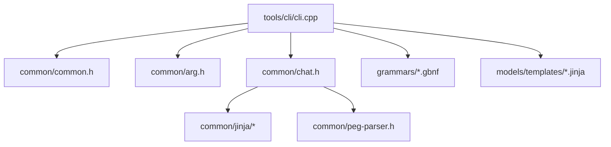
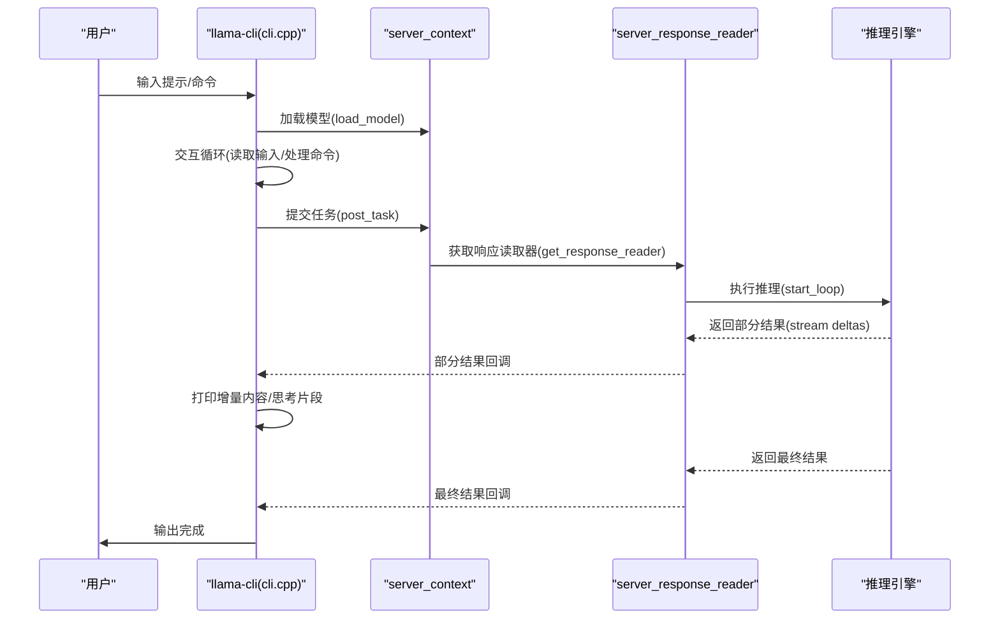
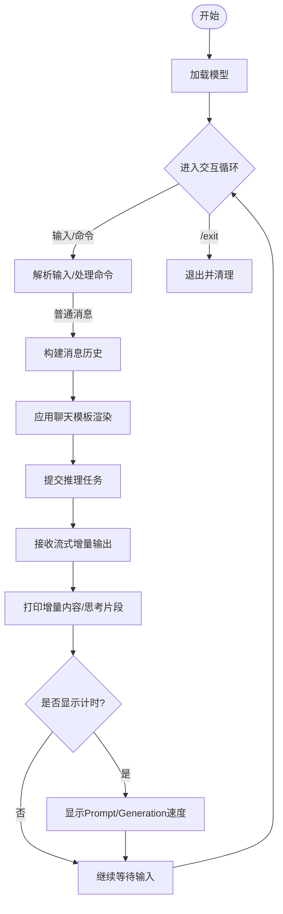
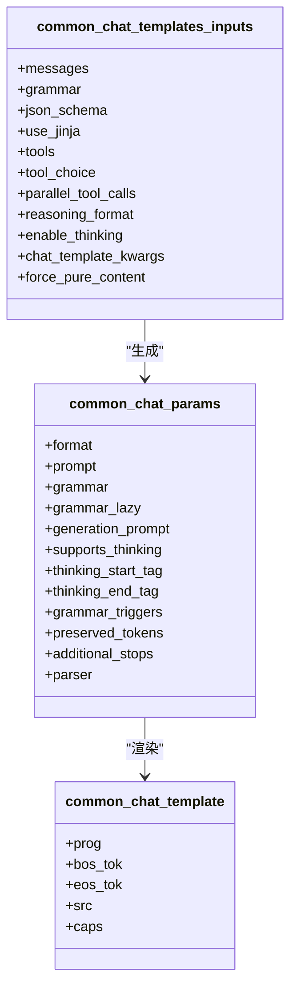
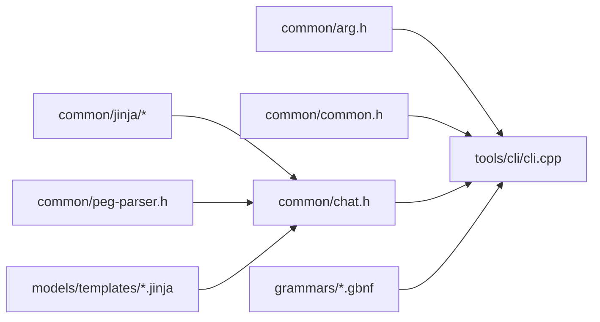

# llama-cli 命令行界面

<cite>
**本文引用的文件**
- [README.md](file://README.md)
- [cli.cpp](file://tools/cli/cli.cpp)
- [README.md](file://tools/cli/README.md)
- [arg.h](file://common/arg.h)
- [common.h](file://common/common.h)
- [chat.h](file://common/chat.h)
- [README.md](file://models/templates/README.md)
- [meta-llama-Llama-3.1-8B-Instruct.jinja](file://models/templates/meta-llama-Llama-3.1-8B-Instruct.jinja)
- [README.md](file://grammars/README.md)
</cite>

## 目录
1. [简介](#简介)
2. [项目结构](#项目结构)
3. [核心组件](#核心组件)
4. [架构总览](#架构总览)
5. [详细组件分析](#详细组件分析)
6. [依赖关系分析](#依赖关系分析)
7. [性能考虑](#性能考虑)
8. [故障排除指南](#故障排除指南)
9. [结论](#结论)
10. [附录：完整参数速查表](#附录完整参数速查表)

## 简介
llama-cli 是 llama.cpp 提供的命令行工具，用于在本地或服务器环境中进行大模型推理与对话。它支持交互式对话模式、批处理模式（通过输入文件）、自定义聊天模板（Jinja）与语法约束（GBNF/JSON Schema），并可输出流式结果与性能计时信息。用户可通过丰富的命令行参数控制模型加载、采样策略、内存与设备分配、以及推理管线的高级特性（如推测解码、多模态输入等）。

## 项目结构
llama-cli 位于 tools/cli 目录下，其核心入口为 cli.cpp；参数解析由 common 子模块提供；聊天模板系统基于 Jinja 引擎与 PEG 解析器；语法约束支持 GBNF 与 JSON Schema；模板资源位于 models/templates。

图表来源
- [cli.cpp:1-653](file://tools/cli/cli.cpp#L1-L653)
- [arg.h:1-134](file://common/arg.h#L1-L134)
- [common.h:1-200](file://common/common.h#L1-L200)
- [chat.h:1-200](file://common/chat.h#L1-L200)

章节来源
- [cli.cpp:1-653](file://tools/cli/cli.cpp#L1-L653)
- [README.md:325-443](file://README.md#L325-L443)

## 核心组件
- 参数解析与帮助生成：通过 common/arg.h 定义的参数集与解析器，生成 CLI 帮助文档（tools/cli/README.md）。
- 聊天模板系统：基于 common/chat.h 的通用聊天模板接口，支持 Jinja 渲染与 PEG 自动解析，覆盖多模型格式。
- 语法约束：支持 GBNF 与 JSON Schema，用于约束输出格式（如 JSON 对象、列表、特定字段等）。
- 推理执行：cli.cpp 中的 generate_completion 流程负责构建任务、提交给服务端线程、接收流式增量结果并打印。
- 多模态与批处理：支持图像/音频输入标记注入、文本文件批量读取与 glob 匹配、单轮对话与计时显示。

章节来源
- [README.md:1-197](file://tools/cli/README.md#L1-L197)
- [chat.h:1-200](file://common/chat.h#L1-L200)
- [cli.cpp:80-224](file://tools/cli/cli.cpp#L80-L224)

## 架构总览
llama-cli 的运行流程如下：启动后初始化日志、线程与控制台；加载模型；进入交互循环；根据用户输入构建消息历史；调用聊天模板渲染；提交推理任务；以流式方式接收增量输出；在需要时显示性能计时。

图表来源
- [cli.cpp:345-653](file://tools/cli/cli.cpp#L345-L653)
- [cli.cpp:80-183](file://tools/cli/cli.cpp#L80-L183)

## 详细组件分析

### 1) 命令行参数与选项
llama-cli 的参数分为“通用参数”“采样参数”“CLI 特定参数”。以下为关键类别与典型用途：

- 通用参数（模型/上下文/线程/设备/缓存/离线/日志）
  - 模型选择：-m/--model、-hf/--hf-repo、-hfrd/--hf-repo-draft、--lora、--lora-scaled、--control-vector 等
  - 上下文与批处理：-c/--ctx-size、-n/--n-predict、-b/--batch-size、-ub/--ubatch-size、--keep、--swa-full
  - 线程与亲和：-t/--threads、-tb/--threads-batch、--cpu-mask、--cpu-range、--cpu-strict、--prio、--poll 等
  - 设备与显存：-ngl/--gpu-layers、-sm/--split-mode、-ts/--tensor-split、-dev/--device、--list-devices
  - 缓存与内存：--cache-type-k/--cache-type-v、--kv-offload、--repack、--cache-ram、--mlock、--mmap、--direct-io
  - 兼容性与校验：--override-kv、--check-tensors、--override-tensor、--override-tensor-draft
  - 离线与日志：--offline、--log-file、--log-colors、--log-verbosity、--log-prefix、--log-timestamps

- 采样参数（温度/Top-k/Top-p/惩罚/自适应/动态温度/MIROSTAT/语法约束）
  - 采样顺序与开关：--samplers、--sampler-seq、--ignore-eos、--seed
  - 常用采样：--temp、--top-k、--top-p、--min-p、--top-n-sigma、--typical-p、--repeat-last-n、--repeat-penalty、--presence-penalty、--frequency-penalty
  - DRY/XTCS/自适应/动态温度：--dry-*、--xtc-*、--adaptive-*、--dynatemp-*
  - Mirostat：--mirostat、--mirostat-lr、--mirostat-ent
  - 语法约束：--grammar/--grammar-file、--json-schema/--json-schema-file、--backend-sampling

- CLI 特定参数（对话/模板/推理行为/多模态/推理管线）
  - 对话与显示：--display-prompt/--no-display-prompt、-co/--color、--show-timings/--no-show-timings、--simple-io
  - 交互与单轮：-cnv/--conversation、--single-turn、-mli/--multiline-input、-r/--reverse-prompt、-sp/--special
  - 系统提示与上下文：-sys/--system-prompt、-sysf/--system-prompt-file、--context-shift
  - 聊天模板：--chat-template/--chat-template-file、--chat-template-kwargs、--jinja/--no-jinja、--skip-chat-parsing/--no-skip-chat-parsing
  - 思维/推理：--reasoning/--no-reasoning、--reasoning-format、--reasoning-budget、--reasoning-budget-message
  - 多模态：--image/--audio、--mmproj/--mmproj-url/--mmproj-auto/--mmproj-offload、--image-min-tokens/--image-max-tokens
  - 推测解码：--draft/--draft-n、--draft-min、--draft-p-min、--ctx-size-draft、-devd/--device-draft、-ngld/--gpu-layers-draft、--model-draft、--spec-replace
  - 默认模型快捷：--gpt-oss-20b-default、--gpt-oss-120b-default、--vision-gemma-4b-default、--vision-gemma-120b-default

章节来源
- [README.md:9-197](file://tools/cli/README.md#L9-L197)

### 2) 交互式对话模式
- 自动启用：若模型元数据包含内置聊天模板，则默认进入对话模式；也可通过 -cnv/--conversation 显式开启。
- 交互循环：读取用户输入，支持多行输入（-mli）、支持 /regen 回退上一条回复、/clear 清空历史、/read 读取文本文件、/glob 使用通配符批量添加文件、/image /audio 注入多模态输入标记。
- 流式输出：generate_completion 通过 server_response_reader 逐步输出增量内容与“思考”片段，并在需要时显示计时信息。

图表来源
- [cli.cpp:446-639](file://tools/cli/cli.cpp#L446-L639)
- [cli.cpp:80-183](file://tools/cli/cli.cpp#L80-L183)

章节来源
- [cli.cpp:446-639](file://tools/cli/cli.cpp#L446-L639)

### 3) 批处理模式与自动化脚本
- 文本批处理：通过 -f/--file 或 -bf/--binary-file 指定输入文件；/read 与 /glob 支持从当前目录或递归匹配路径批量注入文本。
- 多模态批处理：支持 --image 与 --audio 传入多个媒体文件，llama-cli 将注入对应标记并参与模板渲染。
- 单轮对话：--single-turn 可在预设首轮后立即结束，适合自动化脚本一次性生成。
- 计时与内存统计：退出时打印内存分解统计，便于性能分析与优化。

章节来源
- [cli.cpp:446-639](file://tools/cli/cli.cpp#L446-L639)
- [README.md:144-197](file://tools/cli/README.md#L144-L197)

### 4) 聊天模板系统与 Jinja 模板
- 模板来源：优先使用模型元数据中的内置模板；也可通过 --chat-template/--chat-template-file 指定自定义模板；--jinja/--no-jinja 控制是否启用 Jinja 引擎。
- 模板能力：common_chat_templates 支持工具调用（tool_use）、日期注入、思维/推理标签（如 <think>...</think>）、生成提示（generation prompt）等。
- 模板示例：models/templates 下包含多种常见模型的 Jinja 模板，如 meta-llama-Llama-3.1-8B-Instruct.jinja，展示了系统消息、工具清单、角色消息与生成提示的标准结构。

图表来源
- [chat.h:158-200](file://common/chat.h#L158-L200)
- [meta-llama-Llama-3.1-8B-Instruct.jinja:1-110](file://models/templates/meta-llama-Llama-3.1-8B-Instruct.jinja#L1-L110)

章节来源
- [chat.h:1-200](file://common/chat.h#L1-L200)
- [README.md:1-27](file://models/templates/README.md#L1-L27)
- [meta-llama-Llama-3.1-8B-Instruct.jinja:1-110](file://models/templates/meta-llama-Llama-3.1-8B-Instruct.jinja#L1-L110)

### 5) 语法约束与 JSON 输出格式
- GBNF 语法约束：--grammar/--grammar-file 可限制输出为合法字符串序列，适用于固定格式（如棋类走法、列表等）。
- JSON Schema 约束：--json-schema/--json-schema-file 可将 JSON Schema 转换为 GBNF 并约束输出，适合生成结构化 JSON（对象/数组/字段类型/必填项等）。
- 输出格式：llama-cli 默认以流式增量方式输出，同时支持纯内容输出（--skip-chat-parsing）或保留模板中工具调用与推理标签的解析。

章节来源
- [README.md:1-410](file://grammars/README.md#L1-L410)
- [README.md:137-141](file://tools/cli/README.md#L137-L141)

### 6) 使用示例（按功能分类）
- 基础对话
  - llama-cli -m model.gguf
  - llama-cli -hf meta-llama/Llama-3.1-8B-Instruct-GGUF
- 自定义模板
  - llama-cli -m model.gguf -cnv --chat-template chatml
  - llama-cli -m model.gguf -cnv --chat-template-file ./custom.jinja
- 语法约束（JSON）
  - llama-cli -m model.gguf -j '{...}' -p '生成一个JSON对象'
- 语法约束（GBNF）
  - llama-cli -m model.gguf --grammar-file grammars/json.gbnf -p '请求...'
- 多模态
  - llama-cli -m model.gguf --image img.jpg --audio aud.wav
- 批处理
  - llama-cli -m model.gguf -f prompts.txt --single-turn
  - llama-cli -m model.gguf -bf binary.bin --single-turn
- 性能与内存
  - llama-cli -m model.gguf --show-timings --cache-ram 4096
- 推测解码
  - llama-cli -m model.gguf -md draft.gguf --draft 16 --draft-min 0

章节来源
- [README.md:325-443](file://README.md#L325-L443)
- [README.md:1-197](file://tools/cli/README.md#L1-L197)

## 依赖关系分析
- 参数解析依赖 common/arg.h 与 common/common.h 中的枚举与结构体。
- 聊天模板系统依赖 common/chat.h 与 jinja 子系统（lexer/parser/runtime/caps）。
- 语法约束依赖 grammars/ 目录下的 GBNF 文件与 JSON Schema 转换工具链。
- CLI 主程序依赖 server-context 与 server-response-reader 实现异步流式推理。

图表来源
- [arg.h:1-134](file://common/arg.h#L1-L134)
- [common.h:1-200](file://common/common.h#L1-L200)
- [chat.h:1-200](file://common/chat.h#L1-L200)
- [cli.cpp:1-27](file://tools/cli/cli.cpp#L1-L27)

章节来源
- [arg.h:1-134](file://common/arg.h#L1-L134)
- [common.h:1-200](file://common/common.h#L1-L200)
- [chat.h:1-200](file://common/chat.h#L1-L200)
- [cli.cpp:1-27](file://tools/cli/cli.cpp#L1-L27)

## 性能考虑
- 线程与亲和：合理设置 -t/--threads 与 --cpu-mask/--cpu-range，避免过度竞争导致抖动。
- 批处理与上下文：适当增大 -b/--batch-size 与 -ub/--ubatch-size，但需平衡内存占用；--keep 与 --swa-full 影响上下文复用与缓存效率。
- 设备与显存：使用 -ngl/--gpu-layers 与 -sm/--split-mode 控制分层/分片策略；--tensor-split 在多卡间分配比例。
- KV 缓存：--cache-type-k/--cache-type-v 与 --kv-offload 可降低显存压力；--cache-ram 控制主机缓存上限。
- 推测解码：--draft 与 --draft-min 提升吞吐，但需注意主/草稿模型兼容性与 --spec-replace。
- 日志与 I/O：--log-verbosity 与 --log-file 影响 I/O 开销；--simple-io 提升子进程兼容性。

## 故障排除指南
- 模型加载失败
  - 检查 -m/--model 或 -hf/--hf-repo 是否正确；确认磁盘空间与权限；必要时使用 --offline 仅使用缓存。
- 内存不足
  - 减小 -c/--ctx-size、--cache-ram；关闭 --kv-offload 或调整 --cache-type-k/--cache-type-v；减少 -ngl/--gpu-layers。
- 采样异常或输出不收敛
  - 调整 --temp、--top-k、--top-p、--repeat-penalty；必要时启用 --ignore-eos 或使用 --mirostat。
- 语法约束导致生成缓慢
  - 优化 GBNF 规则（参考 grammars/README.md 的性能建议）；对复杂 JSON Schema 使用提前转换为 GBNF。
- 多模态输入无效
  - 确认模型支持视觉/音频输入；检查 --image/--audio 与 --mmproj-* 参数组合；确保文件存在且可读。
- 交互卡顿
  - 启用 --simple-io；减少 --log-verbosity；避免过高的 --poll/--prio-batch。

章节来源
- [README.md:123-140](file://grammars/README.md#L123-L140)
- [README.md:92-101](file://tools/cli/README.md#L92-L101)

## 结论
llama-cli 提供了从基础对话到复杂提示工程的全栈能力：交互式对话、批处理与自动化、Jinja 聊天模板、GBNF/JSON Schema 语法约束、多模态输入、推测解码与多设备调度。通过合理的参数组合与性能优化，可在本地与云端高效运行大模型推理，并满足结构化输出与工程化需求。

## 附录：完整参数速查表
- 通用参数（节选）
  - -m/--model、-hf/--hf-repo、-hfrd/--hf-repo-draft、--lora、--lora-scaled、--control-vector、--control-vector-scaled、--control-vector-layer-range
  - -c/--ctx-size、-n/--n-predict、-b/--batch-size、-ub/--ubatch-size、--keep、--swa-full、--rope-scaling/--rope-scale/--yarn-*、--flash-attn
  - -t/--threads、-tb/--threads-batch、--cpu-mask、--cpu-range、--cpu-strict、--prio、--poll、--cpu-strict-batch、--prio-batch、--poll-batch
  - -ngl/--gpu-layers、-sm/--split-mode、-ts/--tensor-split、-dev/--device、--list-devices、--override-tensor、--override-kv
  - --cache-type-k/--cache-type-v、--kv-offload、--repack、--cache-ram、--mlock、--mmap、--direct-io、--numa、--op-offload
  - --check-tensors、--override-tensor-draft、--cpu-moe、--n-cpu-moe、--cpu-moe-draft、--n-cpu-moe-draft
  - --offline、--log-file、--log-colors、--log-verbosity、--log-prefix、--log-timestamps
- 采样参数（节选）
  - --samplers、--sampler-seq、--ignore-eos、--seed、--temp、--top-k、--top-p、--min-p、--top-n-sigma、--xtc-*、--typical-p、--repeat-last-n、--repeat-penalty、--presence-penalty、--frequency-penalty、--dry-*、--adaptive-*、--dynatemp-*、--mirostat、--mirostat-lr、--mirostat-ent、--logit-bias、--grammar/--grammar-file、--json-schema/--json-schema-file、--backend-sampling
- CLI 特定参数（节选）
  - --display-prompt/--no-display-prompt、-co/--color、--show-timings/--no-show-timings、--simple-io、-sys/--system-prompt、-sysf/--system-prompt-file、-r/--reverse-prompt、-sp/--special、-cnv/--conversation、--single-turn、-mli/--multiline-input、--warmup/--no-warmup、--context-shift/--no-context-shift
  - --chat-template/--chat-template-file、--chat-template-kwargs、--jinja/--no-jinja、--skip-chat-parsing/--no-skip-chat-parsing、--reasoning/--no-reasoning、--reasoning-format、--reasoning-budget、--reasoning-budget-message
  - --image/--audio、--mmproj/--mmproj-url/--mmproj-auto/--mmproj-offload、--image-min-tokens/--image-max-tokens
  - --draft/--draft-n、--draft-min、--draft-p-min、--ctx-size-draft、-devd/--device-draft、-ngld/--gpu-layers-draft、--model-draft、--spec-replace
  - --gpt-oss-20b-default、--gpt-oss-120b-default、--vision-gemma-4b-default、--vision-gemma-120b-default

章节来源
- [README.md:9-197](file://tools/cli/README.md#L9-L197)