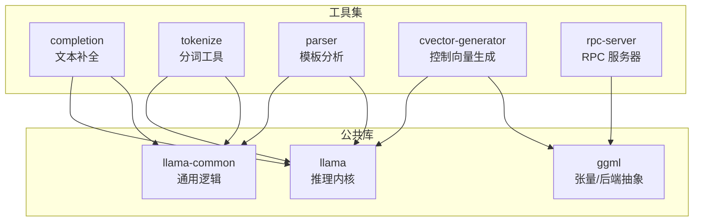
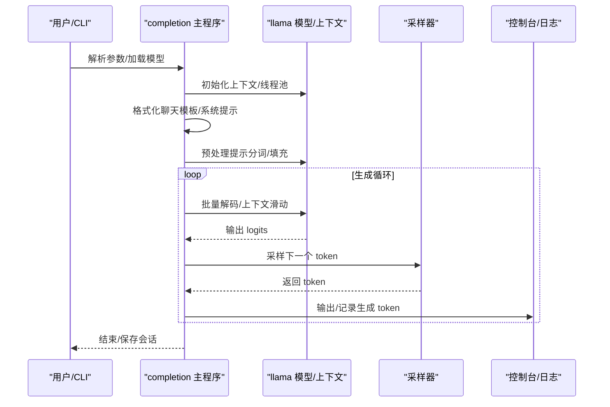
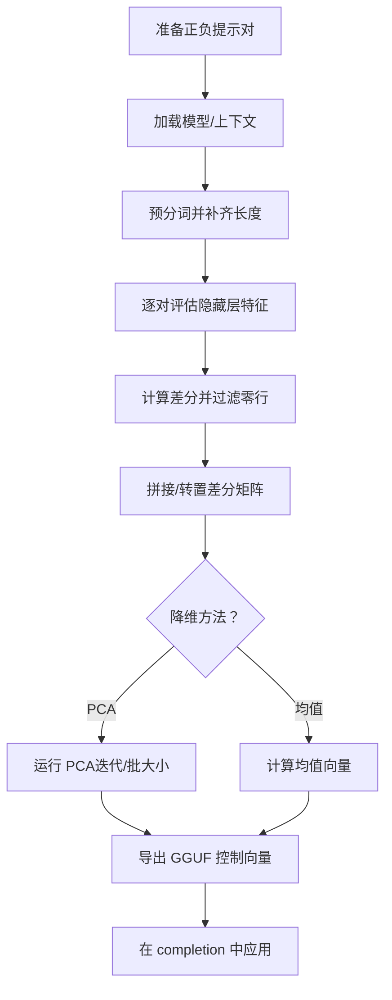
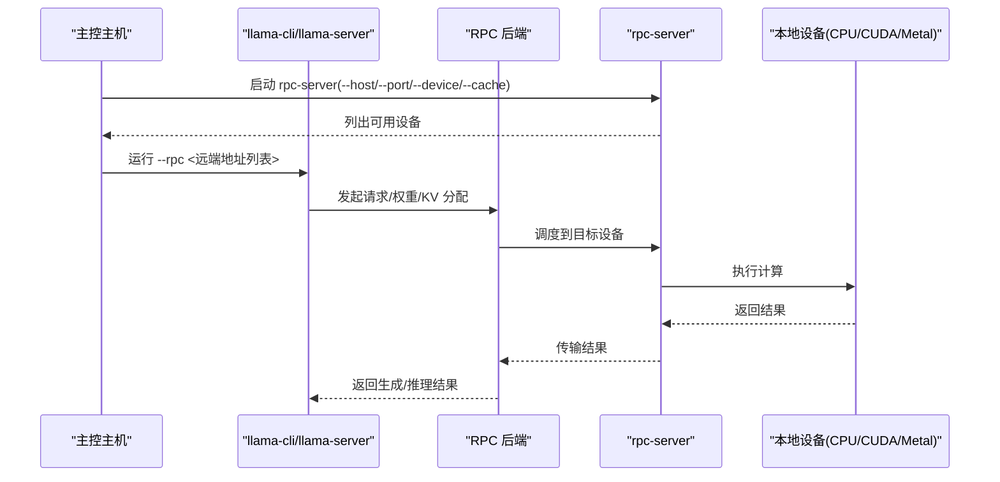
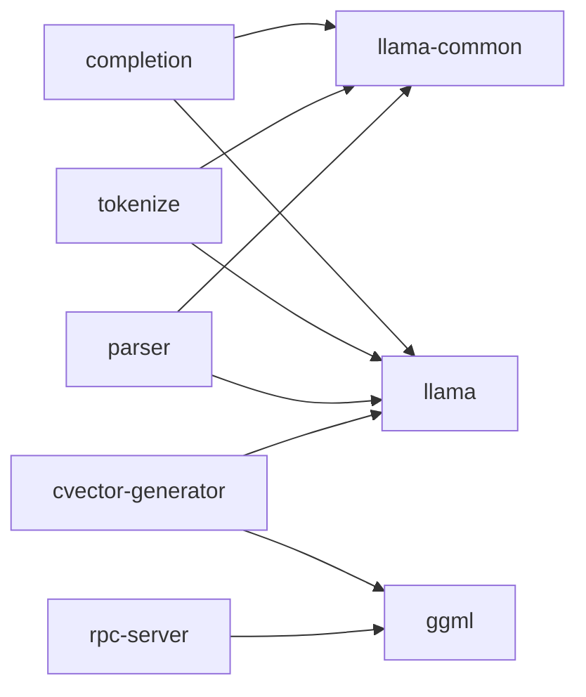

# 专用工具集

<cite>
**本文引用的文件**
- [tools/completion/completion.cpp](file://tools/completion/completion.cpp)
- [tools/completion/README.md](file://tools/completion/README.md)
- [tools/tokenize/tokenize.cpp](file://tools/tokenize/tokenize.cpp)
- [tools/tokenize/CMakeLists.txt](file://tools/tokenize/CMakeLists.txt)
- [tools/parser/template-analysis.cpp](file://tools/parser/template-analysis.cpp)
- [tools/parser/CMakeLists.txt](file://tools/parser/CMakeLists.txt)
- [tools/cvector-generator/cvector-generator.cpp](file://tools/cvector-generator/cvector-generator.cpp)
- [tools/cvector-generator/README.md](file://tools/cvector-generator/README.md)
- [tools/rpc/rpc-server.cpp](file://tools/rpc/rpc-server.cpp)
- [tools/rpc/README.md](file://tools/rpc/README.md)
</cite>

## 目录
1. [简介](#简介)
2. [项目结构](#项目结构)
3. [核心组件](#核心组件)
4. [架构总览](#架构总览)
5. [详细组件分析](#详细组件分析)
6. [依赖关系分析](#依赖关系分析)
7. [性能考量](#性能考量)
8. [故障排查指南](#故障排查指南)
9. [结论](#结论)
10. [附录](#附录)

## 简介
本文件系统化梳理并说明 llama.cpp 仓库中的专用工具集，包括：
- 补全工具（completion）：文本生成、对话模式、采样策略与上下文管理
- 分词工具（tokenize）：基于模型的分词行为、自定义选项与输出格式
- 解析器工具（parser）：Jinja 聊天模板能力分析、推理/工具调用差异对比
- 向量生成器（cvector-generator）：控制向量生成流程、PCA/均值降维方法
- RPC 服务器工具（rpc）：远程设备后端暴露与分布式推理

文档提供各工具的使用场景、配置要点、组合工作流以及选型建议，帮助用户在不同任务中高效选择与集成。

## 项目结构
专用工具主要位于 tools 目录下，每个工具独立为可执行程序，并通过 CMakeLists.txt 链接到公共库与线程库。典型结构如下：
- tools/completion：文本补全与对话交互
- tools/tokenize：分词与令牌打印
- tools/parser：模板能力分析与调试
- tools/cvector-generator：控制向量生成（PCA/均值）
- tools/rpc：RPC 服务器，暴露本地加速设备供远端 llama.cpp 使用

图示来源
- [tools/completion/completion.cpp](file://tools/completion/completion.cpp)
- [tools/tokenize/tokenize.cpp](file://tools/tokenize/tokenize.cpp)
- [tools/parser/template-analysis.cpp](file://tools/parser/template-analysis.cpp)
- [tools/cvector-generator/cvector-generator.cpp](file://tools/cvector-generator/cvector-generator.cpp)
- [tools/rpc/rpc-server.cpp](file://tools/rpc/rpc-server.cpp)

章节来源
- [tools/completion/README.md](file://tools/completion/README.md)
- [tools/tokenize/CMakeLists.txt](file://tools/tokenize/CMakeLists.txt)
- [tools/parser/CMakeLists.txt](file://tools/parser/CMakeLists.txt)

## 核心组件
- 补全工具（completion）
  - 功能：单轮/多轮文本生成、对话模式、反向提示、上下文滑动、采样链与参数
  - 关键点：支持聊天模板、Jinja、推理/思考内容、工具调用、会话缓存、批处理与线程池
- 分词工具（tokenize）
  - 功能：按模型分词、打印 ID 或字符串、统计数量、禁用 BOS/转义/特殊解析
  - 关键点：支持从命令行、文件或标准输入读取；跨平台编码处理
- 解析器工具（parser）
  - 功能：模板能力分析（工具调用、并行工具调用、系统角色、Typed Content）、推理变量探测、差异对比
  - 关键点：内置测试模板集合、统一消息结构、差异拆分输出
- 向量生成器（cvector-generator）
  - 功能：基于正负提示对提取隐藏层特征差分，进行零行过滤、拼接、PCA 或均值降维，导出 GGUF 控制向量
  - 关键点：回调式收集中间层张量、内存复用、可配置降维迭代与批大小
- RPC 服务器（rpc）
  - 功能：暴露本地加速设备（CPU/CUDA/Metal 等），供远端 llama.cpp 通过 RPC 后端调度
  - 关键点：本地缓存、自动 RDMA 协商、安全警告、设备选择

章节来源
- [tools/completion/completion.cpp](file://tools/completion/completion.cpp)
- [tools/tokenize/tokenize.cpp](file://tools/tokenize/tokenize.cpp)
- [tools/parser/template-analysis.cpp](file://tools/parser/template-analysis.cpp)
- [tools/cvector-generator/cvector-generator.cpp](file://tools/cvector-generator/cvector-generator.cpp)
- [tools/rpc/rpc-server.cpp](file://tools/rpc/rpc-server.cpp)

## 架构总览
以下序列图展示“补全工具”从启动到生成的主流程，涵盖模型加载、线程池、提示格式化、批处理解码与采样等环节。

图示来源
- [tools/completion/completion.cpp](file://tools/completion/completion.cpp)

## 详细组件分析

### 补全工具（completion）
- 使用场景
  - 文本生成：一次性生成固定长度文本
  - 对话模式：结合聊天模板与系统提示，支持多轮交互
  - 无限续写：在有限上下文下持续生成，必要时启用上下文滑动
  - 工具调用与推理：配合模板与推理预算，生成带工具调用或思考内容的响应
- 关键配置
  - 模型与设备：--model/-m、--n-gpu-layers、--device、--tensor-split
  - 采样策略：--samplers/--sampler-seq、--temperature、--top-k、--top-p、--repeat-penalty 等
  - 交互与模板：--interactive/--interactive-first、--chat-template/--chat-template-file、--jinja、--reasoning/--reasoning-format
  - 上下文与缓存：--ctx-size、--keep、--prompt-cache、--context-shift
- 典型工作流
  - 单轮生成：指定 --model 与 --prompt，设置 --n-predict 控制长度
  - 对话模式：设置 --chat-template 或 --jinja，配合 --system-prompt 与 --interactive-first
  - 无限续写：--ignore-eos 与 -n -1，注意上下文滑动与性能影响
- 组合使用
  - 与解析器工具：先用模板分析工具评估模板对工具调用/推理的支持，再在 completion 中启用相应开关
  - 与向量生成器：在生成前应用控制向量（--control-vector-scaled 与 --control-vector-layer-range）

章节来源
- [tools/completion/completion.cpp](file://tools/completion/completion.cpp)
- [tools/completion/README.md](file://tools/completion/README.md)

### 分词工具（tokenize）
- 使用场景
  - 快速验证模型分词行为，检查 BOS/特殊符号处理
  - 将提示转换为 token 序列，便于后续批处理或调试
  - 统计 token 数量，辅助上下文规划
- 自定义选项
  - 输入来源：--prompt/-p、--file/-f、--stdin
  - 分词行为：--no-bos、--no-escape、--no-parse-special
  - 输出控制：--ids（仅打印 ID）、--show-count（打印总数）、--log-disable（静默日志）
- 典型工作流
  - 从命令行直接分词：--model 指定模型，--prompt 提供文本
  - 从文件读取：--file 指向文件路径
  - 从标准输入读取：--stdin，适合管道或脚本
- 组合使用
  - 与 completion：先用 tokenize 获取 token 序列，再在 completion 中以相同规则进行生成
  - 与 cvector-generator：预分词用于构造正负提示对

章节来源
- [tools/tokenize/tokenize.cpp](file://tools/tokenize/tokenize.cpp)
- [tools/tokenize/CMakeLists.txt](file://tools/tokenize/CMakeLists.txt)

### 解析器工具（parser）
- 使用场景
  - 模板能力评估：判断模板是否支持工具调用、并行工具调用、系统角色、Typed Content
  - 推理变量探测：识别模板是否查询“启用推理/思考”的变量名
  - 差异对比：比较“有/无工具”、“有/无推理”、“单/双工具调用”等场景下的模板差异
- 关键功能
  - 模板分析：读取模板源，构建能力概览（supports_*）
  - 差异拆分：计算两段输出的公共前后缀与差异部分，直观对比
  - 推理变量检查：遍历候选变量名，检测模板实际使用的变量
- 典型工作流
  - 分析所有模板：--all
  - 分析特定模板：--template <名称片段> 或 --template-file <路径>
  - 基于测试消息与工具定义，生成多种场景输出并对比差异
- 组合使用
  - 与 completion：根据模板分析结果，在 completion 中启用 --jinja、--reasoning、--reasoning-format 等

章节来源
- [tools/parser/template-analysis.cpp](file://tools/parser/template-analysis.cpp)
- [tools/parser/CMakeLists.txt](file://tools/parser/CMakeLists.txt)

### 向量生成器（cvector-generator）
- 使用场景
  - 控制向量生成：通过正负提示对的隐藏层特征差分，得到可用于调节风格/语气的控制向量
  - 降维方法：PCA 或均值（--method mean），导出为 GGUF 文件
  - 层范围：指定应用层区间（--control-vector-layer-range），提升效果
- 处理流程
  - 加载模型与上下文，准备正负提示对
  - 回调收集各层张量，计算差分并过滤零行
  - 拼接差分矩阵，按需转置，运行 PCA 或均值降维
  - 导出为 GGUF 控制向量文件
- 典型工作流
  - 准备正负提示文件（每行一对），运行 cvector-generator -m 模型 --pca-iter/--pca-batch
  - 在 completion 中加载生成的 GGUF 并指定层范围
- 组合使用
  - 与 completion：在生成前叠加控制向量，调整输出风格
  - 与 parser：结合模板分析结果，设计更合理的正负提示对

图示来源
- [tools/cvector-generator/cvector-generator.cpp](file://tools/cvector-generator/cvector-generator.cpp)
- [tools/cvector-generator/README.md](file://tools/cvector-generator/README.md)

章节来源
- [tools/cvector-generator/cvector-generator.cpp](file://tools/cvector-generator/cvector-generator.cpp)
- [tools/cvector-generator/README.md](file://tools/cvector-generator/README.md)

### RPC 服务器工具（rpc）
- 使用场景
  - 分布式推理：将本地加速设备（如 CUDA/Metal/CPU）通过 RPC 暴露给远端 llama.cpp
  - 多主机协同：在多个主机上部署 rpc-server，由主控统一调度
  - 本地缓存：减少大张量在网络间重复传输
- 关键配置
  - 主机与端口：--host/--port，默认 127.0.0.1:50052
  - 设备选择：--device 或 CUDA_VISIBLE_DEVICES，支持多设备
  - 线程数：--threads 控制 CPU 设备线程数
  - 本地缓存：--cache 开启，缓存目录默认 $HOME/.cache/llama.cpp/rpc
- 安全与限制
  - 当前为实验性且不安全，不要暴露在开放网络
  - 可通过环境变量 GGML_RPC_DEBUG 启用调试日志
- 典型工作流
  - 在远端主机启动 rpc-server，暴露所需设备
  - 在主控主机以 --rpc 指定远端地址列表，运行 llama-cli/llama-server
  - 可选开启 --tensor-split 自定义权重与 KV 缓存分配比例

图示来源
- [tools/rpc/rpc-server.cpp](file://tools/rpc/rpc-server.cpp)
- [tools/rpc/README.md](file://tools/rpc/README.md)

章节来源
- [tools/rpc/rpc-server.cpp](file://tools/rpc/rpc-server.cpp)
- [tools/rpc/README.md](file://tools/rpc/README.md)

## 依赖关系分析
- 组件耦合
  - completion 依赖 llama 与 llama-common，负责模型初始化、线程池、采样与 I/O
  - tokenize 依赖 llama 与 llama-common，专注于分词与输出
  - parser 依赖 llama-common 与 jinja 运行时，聚焦模板能力与差异分析
  - cvector-generator 依赖 ggml 与 gguf，负责张量收集与导出
  - rpc-server 依赖 ggml 的 RPC 注册表与设备后端
- 外部依赖
  - 线程库：各工具链接 ${CMAKE_THREAD_LIBS_INIT}
  - 设备后端：CUDA/Metal/Vulkan 等（编译期可选）
- 潜在环路
  - 工具间无直接环形依赖，均为单向使用公共库

图示来源
- [tools/completion/completion.cpp](file://tools/completion/completion.cpp)
- [tools/tokenize/tokenize.cpp](file://tools/tokenize/tokenize.cpp)
- [tools/parser/template-analysis.cpp](file://tools/parser/template-analysis.cpp)
- [tools/cvector-generator/cvector-generator.cpp](file://tools/cvector-generator/cvector-generator.cpp)
- [tools/rpc/rpc-server.cpp](file://tools/rpc/rpc-server.cpp)

章节来源
- [tools/tokenize/CMakeLists.txt](file://tools/tokenize/CMakeLists.txt)
- [tools/parser/CMakeLists.txt](file://tools/parser/CMakeLists.txt)

## 性能考量
- 线程与批处理
  - completion 支持独立的批处理线程参数（--threads-batch），合理设置可提升提示阶段吞吐
- 设备与显存
  - 通过 --n-gpu-layers 与 --tensor-split 控制显存占用与分布
  - RPC 场景下，本地缓存可显著降低大张量传输开销
- 采样与上下文
  - 合理设置采样参数（温度、top-k、top-p、重复惩罚）平衡多样性与稳定性
  - 上下文滑动与 keep 策略影响长文本生成的连贯性与延迟
- 向量生成
  - PCA 迭代次数与批大小影响收敛速度与质量；均值法简单快速但表达力有限

## 故障排查指南
- completion
  - 无法创建上下文/线程池：检查设备后端初始化与权限
  - 交互中断：SIGINT 处理会优雅退出并打印性能统计
  - 上下文过长：启用 --context-shift 或减小 --n-predict
- tokenize
  - 模型未加载：确认 --model 路径正确；使用 --log-disable 静默日志定位问题
  - 输入冲突：--stdin、--file、--prompt 互斥，确保只指定其一
- parser
  - 模板未找到：--template 仅接受内置模板子串或 --template-file 指定文件
  - 差异分析异常：检查消息结构与工具定义 JSON 是否符合预期
- cvector-generator
  - 正负提示数量不一致：确保每行一一对应
  - PCA 参数非法：--n_pca_iterations 必须是 --n_pca_batch 的整数倍
- rpc
  - 无法连接：确认 --host/--port 与防火墙设置；仅在受控网络使用
  - 设备不可见：检查设备后端是否已构建并加载（-DGGML_RPC=ON）

章节来源
- [tools/completion/completion.cpp](file://tools/completion/completion.cpp)
- [tools/tokenize/tokenize.cpp](file://tools/tokenize/tokenize.cpp)
- [tools/parser/template-analysis.cpp](file://tools/parser/template-analysis.cpp)
- [tools/cvector-generator/cvector-generator.cpp](file://tools/cvector-generator/cvector-generator.cpp)
- [tools/rpc/rpc-server.cpp](file://tools/rpc/rpc-server.cpp)

## 结论
专用工具集覆盖了从“输入预处理（分词）—模板解析（解析器）—生成（补全）—控制（向量）—分布式（RPC）”的完整链路。通过合理选择与组合这些工具，用户可以在不同场景下实现稳定高效的推理与应用集成。建议优先以 parser 工具评估模板能力，再在 completion 中启用相应开关；在需要风格控制时，使用 cvector-generator 生成控制向量；在多设备/多主机环境下，谨慎使用 rpc 工具并优先保障安全。

## 附录
- 选型建议
  - 需要稳定文本生成：优先 completion，按任务选择采样策略与上下文参数
  - 需要验证分词一致性：使用 tokenize，统一 --no-bos/--no-escape/--no-parse-special
  - 需要模板能力评估：使用 parser，结合 --all 或 --template-file
  - 需要风格/语气控制：使用 cvector-generator，结合 completion 的控制向量参数
  - 需要分布式推理：使用 rpc，严格限制网络暴露与缓存策略
- 组合工作流示例
  - 模板驱动的工具调用：parser → completion（--jinja/--reasoning）→ 生成
  - 风格控制：cvector-generator → completion（--control-vector-scaled）→ 生成
  - 分布式推理：rpc-server → llama-cli/llama-server（--rpc）