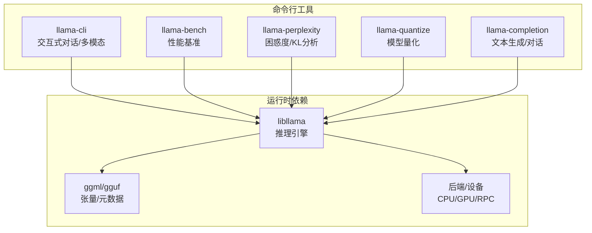
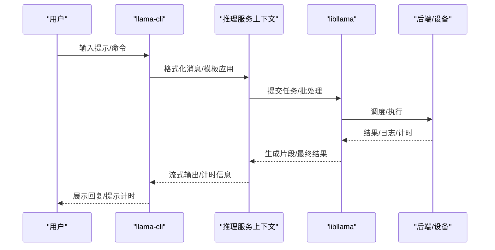
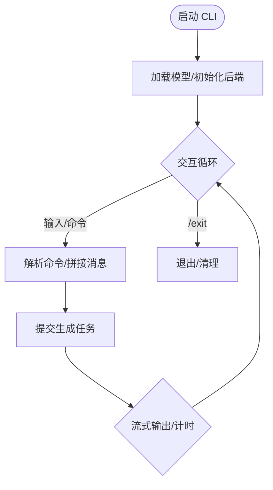
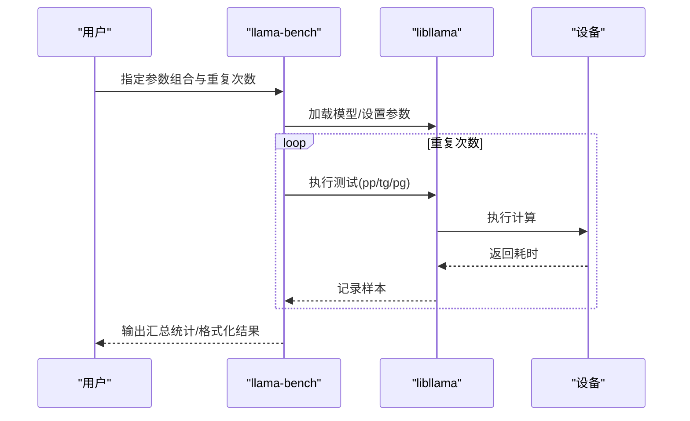
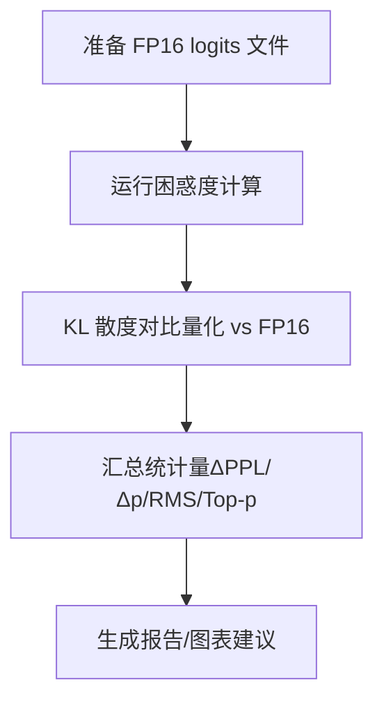
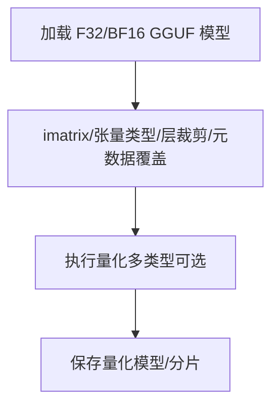
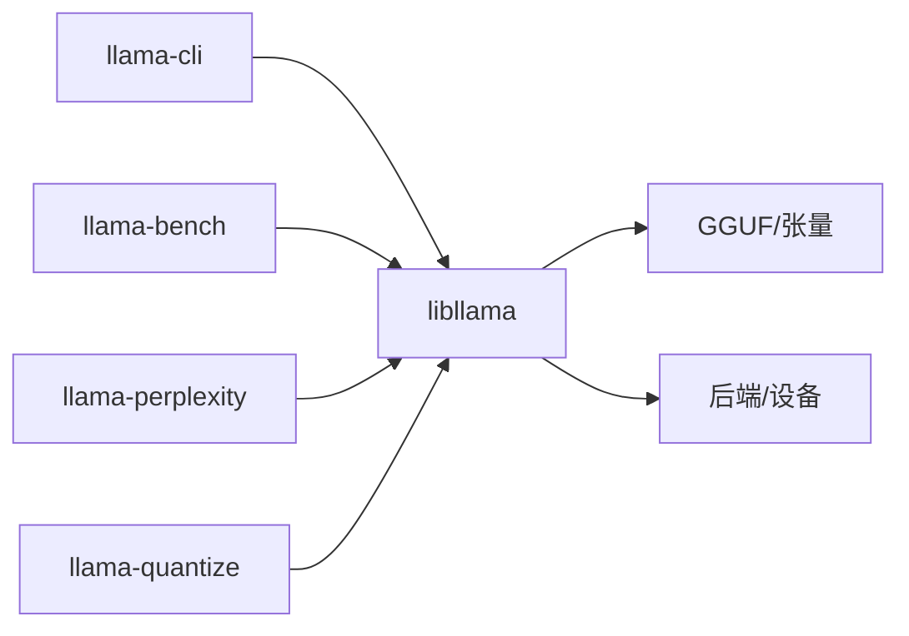

# 命令行工具

<cite>
**本文引用的文件**
- [tools/cli/cli.cpp](file://tools/cli/cli.cpp)
- [tools/llama-bench/llama-bench.cpp](file://tools/llama-bench/llama-bench.cpp)
- [tools/perplexity/perplexity.cpp](file://tools/perplexity/perplexity.cpp)
- [tools/quantize/quantize.cpp](file://tools/quantize/quantize.cpp)
- [tools/completion/README.md](file://tools/completion/README.md)
- [tools/llama-bench/README.md](file://tools/llama-bench/README.md)
- [tools/perplexity/README.md](file://tools/perplexity/README.md)
- [tools/quantize/README.md](file://tools/quantize/README.md)
</cite>

## 目录
1. [简介](#简介)
2. [项目结构](#项目结构)
3. [核心组件](#核心组件)
4. [架构总览](#架构总览)
5. [详细组件分析](#详细组件分析)
6. [依赖关系分析](#依赖关系分析)
7. [性能考量](#性能考量)
8. [故障排除指南](#故障排除指南)
9. [结论](#结论)
10. [附录](#附录)

## 简介
本文件系统性介绍 llama.cpp 提供的命令行工具，重点覆盖以下工具与能力：
- llama-cli：交互式对话、多模态输入（文本/图像/音频）、Jinja 模板、推理预算与思维标签支持、计时输出
- llama-bench：基准测试工具，支持多种测试组合（提示预填充、生成、组合），可输出多种格式并统计均值与标准差
- llama-perplexity：困惑度计算与 KL 散度分析，支持记录/复用 logits 以进行更细致的对比
- llama-quantize：模型量化工具，支持多种量化类型、重要性矩阵（imatrix）优化、按张量选择性量化、层裁剪、元数据覆盖等
- 其他实用工具：完成器（llama-completion）、服务端（llama-server）、RPC、TTS、IMatrix、GGUF 分割等（作为参考）

本指南在不直接粘贴源码的前提下，通过“代码片段路径”定位到具体实现位置，并提供参数说明、使用示例、批量与自动化脚本编写建议、扩展与定制方法以及故障排除技巧。

## 项目结构
llama.cpp 的命令行工具主要位于 tools/ 目录下，每个工具独立编译为可执行程序。核心工具与其职责概览如下：
- llama-cli：交互式对话与多模态输入
- llama-bench：性能基准测试
- llama-perplexity：困惑度与 KL 散度分析
- llama-quantize：模型量化
- llama-completion：文本生成与对话（非交互式）
- llama-server：服务端（不在本次文档目标范围内，但与 CLI/Completion 同属推理工具链）
- 其他工具：imatrix、gguf-split、rpc、tts 等

图示来源
- [tools/cli/cli.cpp](file://tools/cli/cli.cpp)
- [tools/llama-bench/llama-bench.cpp](file://tools/llama-bench/llama-bench.cpp)
- [tools/perplexity/perplexity.cpp](file://tools/perplexity/perplexity.cpp)
- [tools/quantize/quantize.cpp](file://tools/quantize/quantize.cpp)

章节来源
- [tools/cli/cli.cpp](file://tools/cli/cli.cpp)
- [tools/llama-bench/llama-bench.cpp](file://tools/llama-bench/llama-bench.cpp)
- [tools/perplexity/perplexity.cpp](file://tools/perplexity/perplexity.cpp)
- [tools/quantize/quantize.cpp](file://tools/quantize/quantize.cpp)

## 核心组件
本节聚焦四大工具的功能特性与使用要点。

- llama-cli
  - 对话模式：内置命令集（/exit、/regen、/clear、/read、/glob、/image、/audio），支持多轮会话与系统提示
  - 多模态输入：支持文本文件注入、glob 批量加载、图像/音频标记注入
  - 模板与语法：Jinja 模板应用、推理预算（thinking）控制、纯内容解析
  - 计时输出：显示每秒 token 数（prompt 与 generation）
  - 参考路径：[tools/cli/cli.cpp](file://tools/cli/cli.cpp)

- llama-bench
  - 测试类型：提示预填充（pp）、文本生成（tg）、提示+生成（pg）
  - 参数组合：支持多值与范围表达式，自动笛卡尔组合；重复次数可配置
  - 输出格式：markdown、csv、json、jsonl、sql
  - 统计指标：平均 t/s 与标准差；可输出单次样本序列
  - 参考路径：[tools/llama-bench/llama-bench.cpp](file://tools/llama-bench/llama-bench.cpp)，[tools/llama-bench/README.md](file://tools/llama-bench/README.md)

- llama-perplexity
  - 困惑度：支持滑动窗口与分块计算，支持打印中间困惑度
  - KL 散度：通过二进制 logits 文件对比 FP16 与量化模型分布差异
  - 统计量：均值困惑度、ΔPPL、均值 Δp、RMS Δp、相同 top-p 比例等
  - 参考路径：[tools/perplexity/perplexity.cpp](file://tools/perplexity/perplexity.cpp)，[tools/perplexity/README.md](file://tools/perplexity/README.md)

- llama-quantize
  - 量化类型：支持多种量化方案（含 IQ1_S/IQ2_*、Q2_K/Q3_K_*、Q4_K_*、Q5_K_*、Q6_K、Q8_0、F16/BF16/F32、COPY）
  - 优化：imatrix 重要性矩阵、按张量选择性量化、层裁剪、KV 元数据覆盖
  - 性能/体积权衡：不同量化方案的位重与速度表现
  - 参考路径：[tools/quantize/quantize.cpp](file://tools/quantize/quantize.cpp)，[tools/quantize/README.md](file://tools/quantize/README.md)

章节来源
- [tools/cli/cli.cpp](file://tools/cli/cli.cpp)
- [tools/llama-bench/llama-bench.cpp](file://tools/llama-bench/llama-bench.cpp)
- [tools/llama-bench/README.md](file://tools/llama-bench/README.md)
- [tools/perplexity/perplexity.cpp](file://tools/perplexity/perplexity.cpp)
- [tools/perplexity/README.md](file://tools/perplexity/README.md)
- [tools/quantize/quantize.cpp](file://tools/quantize/quantize.cpp)
- [tools/quantize/README.md](file://tools/quantize/README.md)

## 架构总览
llama-cli 与 llama-bench 等工具共享 libllama 推理接口与 gguf 模型加载能力，底层通过后端（CPU/GPU/RPC）执行张量运算。llama-perplexity 与 llama-quantize 则分别面向评估与模型压缩场景。

图示来源
- [tools/cli/cli.cpp](file://tools/cli/cli.cpp)

## 详细组件分析

### llama-cli：对话、模板、语法约束与批量处理
- 功能特性
  - 内置命令：/exit、/regen、/clear、/read、/glob、/image、/audio
  - 多模态：文本文件注入、glob 批量、图像/音频标记注入
  - 模板与推理：Jinja 模板、推理预算（thinking）标签、纯内容解析
  - 计时：显示每秒 token 数（prompt 与 generation）
- 关键流程
  - 初始化：加载模型、设置线程/NUMA、注册信号处理器
  - 交互循环：读取用户输入，解析命令，拼接消息，调用生成接口
  - 生成：提交任务、流式接收片段、更新计时、可选显示推理预算状态
  - 终止：清理资源、打印内存分解信息
- 使用示例（路径）
  - 基本对话：[tools/cli/cli.cpp](file://tools/cli/cli.cpp)
  - 多模态输入：[tools/cli/cli.cpp](file://tools/cli/cli.cpp)
  - 计时输出：[tools/cli/cli.cpp](file://tools/cli/cli.cpp)
- 批量与自动化
  - 使用 /glob 批量注入文本文件
  - 将 CLI 运行封装为 shell 脚本，配合 --prompt 与 --single-turn 实现自动化
  - 通过 --show-timings 获取吞吐指标用于监控
- 定制与扩展
  - 自定义模板：通过聊天模板或 --jinja 控制
  - 语法约束：结合 --grammar 或 --json-schema 限制输出
  - 扩展命令：在命令表中添加新前缀与补全逻辑

图示来源
- [tools/cli/cli.cpp](file://tools/cli/cli.cpp)

章节来源
- [tools/cli/cli.cpp](file://tools/cli/cli.cpp)

### llama-bench：基准测试、参数与结果分析
- 测试类型
  - pp：仅提示预填充
  - tg：仅文本生成
  - pg：先预填充再生成
- 参数组合
  - 支持多值与范围表达式（逗号分隔或多次指定）
  - 自动笛卡尔组合所有参数组合
  - 重复次数 -r 控制统计稳定性
- 输出格式
  - markdown（默认）、csv、json、jsonl、sql
  - json/jsonl 可输出单次样本序列
- 性能指标
  - 平均 t/s 与标准差
  - 可选进度条与设备列表查询
- 使用示例（路径）
  - 文本生成不同模型：[tools/llama-bench/README.md](file://tools/llama-bench/README.md)
  - 不同 batch size：[tools/llama-bench/README.md](file://tools/llama-bench/README.md)
  - 不同线程数：[tools/llama-bench/README.md](file://tools/llama-bench/README.md)
  - 不同 GPU 层数：[tools/llama-bench/README.md](file://tools/llama-bench/README.md)
  - 预填充上下文深度：[tools/llama-bench/README.md](file://tools/llama-bench/README.md)

图示来源
- [tools/llama-bench/llama-bench.cpp](file://tools/llama-bench/llama-bench.cpp)
- [tools/llama-bench/README.md](file://tools/llama-bench/README.md)

章节来源
- [tools/llama-bench/llama-bench.cpp](file://tools/llama-bench/llama-bench.cpp)
- [tools/llama-bench/README.md](file://tools/llama-bench/README.md)

### llama-perplexity：困惑度与 KL 散度分析
- 功能要点
  - 困惑度：滑动窗口/分块计算，支持打印中间困惑度
  - KL 散度：通过二进制 logits 文件对比 FP16 与量化模型
  - 统计量：均值困惑度、ΔPPL、均值 Δp、RMS Δp、相同 top-p 比例、百分位 Δp 等
- 使用流程
  - 生成 FP16 模型的 logits 二进制文件
  - 使用量化模型与该文件进行 KL 分析
  - 输出统计指标与可视化建议
- 使用示例（路径）
  - 基本困惑度计算：[tools/perplexity/perplexity.cpp](file://tools/perplexity/perplexity.cpp)
  - KL 散度分析与统计量：[tools/perplexity/README.md](file://tools/perplexity/README.md)

图示来源
- [tools/perplexity/perplexity.cpp](file://tools/perplexity/perplexity.cpp)
- [tools/perplexity/README.md](file://tools/perplexity/README.md)

章节来源
- [tools/perplexity/perplexity.cpp](file://tools/perplexity/perplexity.cpp)
- [tools/perplexity/README.md](file://tools/perplexity/README.md)

### llama-quantize：模型量化与优化
- 量化类型
  - 支持 IQ1_S/IQ1_M/IQ2_*、Q2_K/Q3_K_*、Q4_K_*、Q5_K_*、Q6_K、Q8_0、F16/BF16/F32、COPY
- 优化策略
  - imatrix 重要性矩阵：提升量化质量
  - 按张量选择性量化：正则表达式匹配
  - 层裁剪：移除指定层数
  - KV 元数据覆盖：调整模型元信息
- 使用示例（路径）
  - 基本量化：[tools/quantize/README.md](file://tools/quantize/README.md)
  - imatrix 与选择性量化：[tools/quantize/README.md](file://tools/quantize/README.md)
  - 层裁剪与元数据覆盖：[tools/quantize/README.md](file://tools/quantize/README.md)

图示来源
- [tools/quantize/quantize.cpp](file://tools/quantize/quantize.cpp)
- [tools/quantize/README.md](file://tools/quantize/README.md)

章节来源
- [tools/quantize/quantize.cpp](file://tools/quantize/quantize.cpp)
- [tools/quantize/README.md](file://tools/quantize/README.md)

### 补充：llama-completion（非交互式文本生成）
- 用途：非交互式文本生成、对话（基于模板）、采样策略、性能计时
- 适用场景：批处理生成、脚本集成、离线推理
- 参考路径：[tools/completion/README.md](file://tools/completion/README.md)

章节来源
- [tools/completion/README.md](file://tools/completion/README.md)

## 依赖关系分析
- 工具间耦合
  - llama-cli 与 llama-bench 共享 libllama 推理接口
  - llama-perplexity 与 llama-quantize 依赖 gguf 模型格式与量化/评估流程
- 外部依赖
  - 设备后端：CPU/GPU/RPC
  - 数据格式：GGUF、imatrix（二进制）
  - 采样与推理：libllama 抽象层

图示来源
- [tools/cli/cli.cpp](file://tools/cli/cli.cpp)
- [tools/llama-bench/llama-bench.cpp](file://tools/llama-bench/llama-bench.cpp)
- [tools/perplexity/perplexity.cpp](file://tools/perplexity/perplexity.cpp)
- [tools/quantize/quantize.cpp](file://tools/quantize/quantize.cpp)

章节来源
- [tools/cli/cli.cpp](file://tools/cli/cli.cpp)
- [tools/llama-bench/llama-bench.cpp](file://tools/llama-bench/llama-bench.cpp)
- [tools/perplexity/perplexity.cpp](file://tools/perplexity/perplexity.cpp)
- [tools/quantize/quantize.cpp](file://tools/quantize/quantize.cpp)

## 性能考量
- 线程与 NUMA：合理设置 -t 与 --numa，避免跨 NUMA 访问带来的延迟
- 批大小：-b 与 -ub 影响吞吐与显存占用，需根据硬件平衡
- KV 缓存：--cache-type-k/--cache-type-v 与 --kv-offload 影响显存与带宽
- 设备选择：--device 与 --n-gpu-layers 控制 GPU 分层与显存占用
- 量化与精度：量化类型影响速度与精度，imatrix 可显著降低精度损失
- 基准测试：使用 -r 增加重复次数，减少随机波动；使用 --progress 观察进度

## 故障排除指南
- CLI 无法加载模型
  - 检查模型路径与权限；确认后端可用
  - 参考路径：[tools/cli/cli.cpp](file://tools/cli/cli.cpp)
- 生成卡顿或中断
  - 检查上下文长度与 --keep；必要时启用 --context-shift 或调整 --n-predict
  - 参考路径：[tools/completion/README.md](file://tools/completion/README.md)
- 基准测试结果不稳定
  - 增加 -r 重复次数；关闭干扰进程；确保 --progress 与设备稳定
  - 参考路径：[tools/llama-bench/README.md](file://tools/llama-bench/README.md)
- 量化后困惑度上升
  - 使用 imatrix；尝试 --allow-requantize 与 --leave-output-tensor；调整 --pure
  - 参考路径：[tools/quantize/README.md](file://tools/quantize/README.md)
- 权限与环境变量
  - HF_TOKEN 等环境变量对下载与访问的影响
  - 参考路径：[tools/llama-bench/llama-bench.cpp](file://tools/llama-bench/llama-bench.cpp)

章节来源
- [tools/cli/cli.cpp](file://tools/cli/cli.cpp)
- [tools/completion/README.md](file://tools/completion/README.md)
- [tools/llama-bench/README.md](file://tools/llama-bench/README.md)
- [tools/llama-bench/llama-bench.cpp](file://tools/llama-bench/llama-bench.cpp)
- [tools/quantize/README.md](file://tools/quantize/README.md)

## 结论
llama.cpp 的命令行工具覆盖了从交互对话、性能基准、困惑度评估到模型量化的完整工作流。通过合理配置参数、利用 imatrix 与模板、结合批量与自动化脚本，可在不同硬件与场景下获得稳定的吞吐与精度表现。建议在生产环境中优先采用量化与 imatrix 优化，并通过基准测试与困惑度/KL 分析持续验证模型质量。

## 附录
- 批量处理与自动化脚本编写建议
  - 使用 /glob 批量注入文本文件，结合 --single-turn 与 --show-timings 输出吞吐
  - 将 CLI 包装为 shell 脚本，循环读取输入目录，输出到日志文件
  - 在 CI 中使用 llama-bench 的 csv/jsonl 输出，导入数据库进行趋势分析
- 扩展与定制方法
  - CLI：新增命令前缀与补全回调，扩展消息格式与模板
  - Bench：增加新的测试组合与输出字段，扩展统计维度
  - Perplexity：扩展 KL 分析维度（如分词粒度、上下文分段）
  - Quantize：新增量化类型映射、张量选择规则、元数据覆盖策略