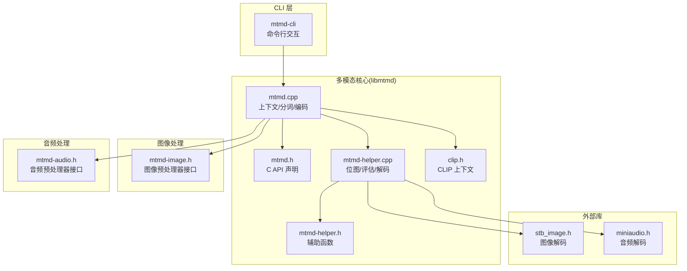
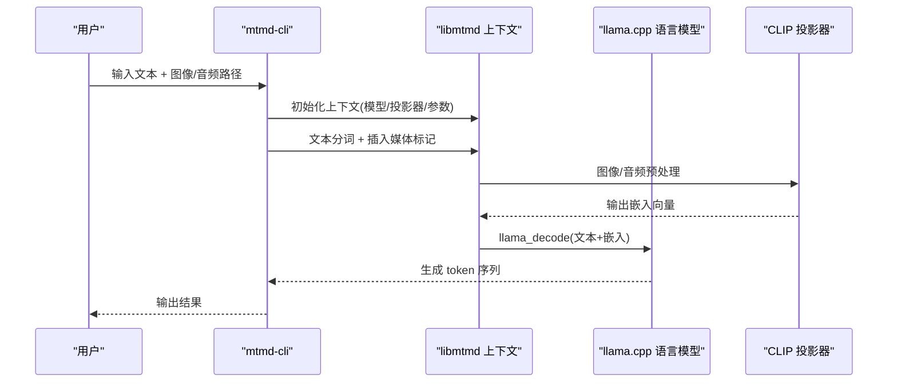
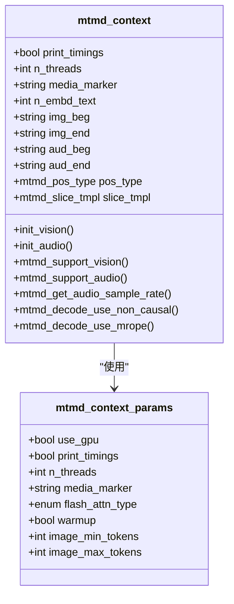
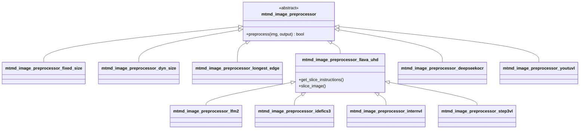
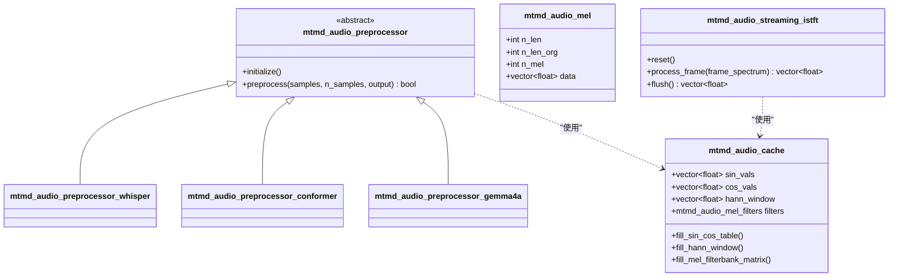
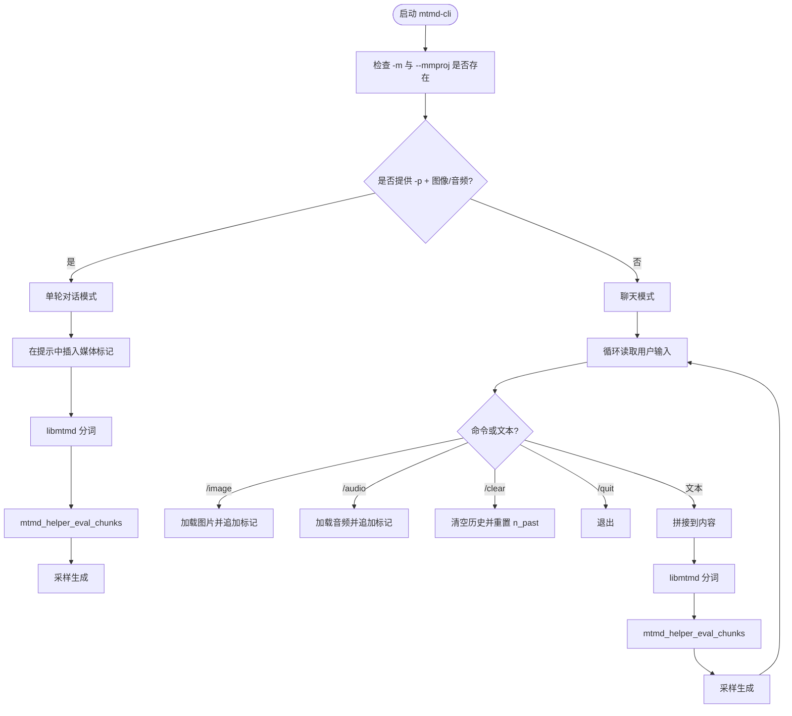
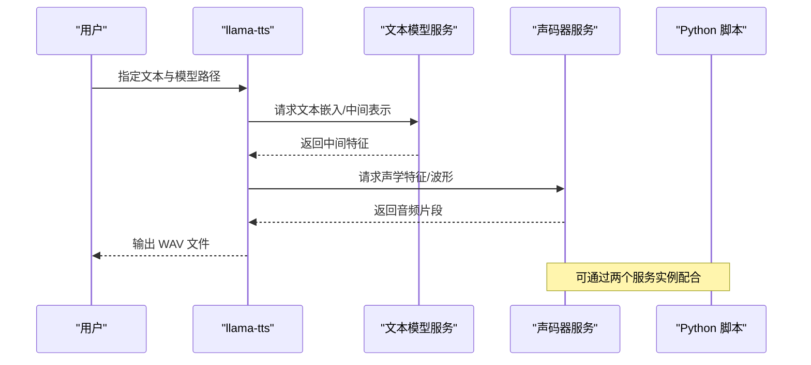
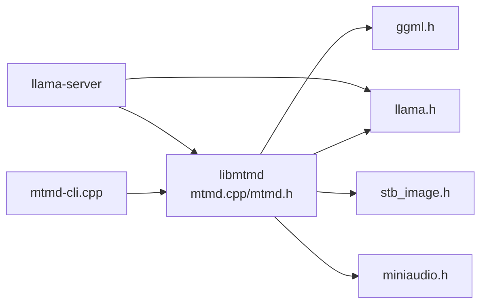

# 多模态处理工具

<cite>
**本文引用的文件**
- [README.md](file://README.md)
- [multimodal.md](file://docs/multimodal.md)
- [README.md](file://tools/mtmd/README.md)
- [mtmd.h](file://tools/mtmd/mtmd.h)
- [mtmd.cpp](file://tools/mtmd/mtmd.cpp)
- [mtmd-image.h](file://tools/mtmd/mtmd-image.h)
- [mtmd-audio.h](file://tools/mtmd/mtmd-audio.h)
- [mtmd-cli.cpp](file://tools/mtmd/mtmd-cli.cpp)
- [clip.h](file://tools/mtmd/clip.h)
- [mtmd-helper.h](file://tools/mtmd/mtmd-helper.h)
- [mtmd-helper.cpp](file://tools/mtmd/mtmd-helper.cpp)
- [README.md](file://tools/tts/README.md)
- [README.md](file://tools/cli/README.md)
- [gemma3.md](file://docs/multimodal/gemma3.md)
</cite>

## 目录
1. [简介](#简介)
2. [项目结构](#项目结构)
3. [核心组件](#核心组件)
4. [架构总览](#架构总览)
5. [详细组件分析](#详细组件分析)
6. [依赖关系分析](#依赖关系分析)
7. [性能考虑](#性能考虑)
8. [故障排查指南](#故障排查指南)
9. [结论](#结论)
10. [附录](#附录)

## 简介
本文件系统性介绍 llama.cpp 中的多模态处理工具（MTMD），涵盖图像、音频、视频等多模态输入的处理能力，CLI 模式下的多模态交互方式，以及图像与音频的预处理、编码与解码流程。同时说明多模态模型的加载与推理方法、不同模态间的融合与交互策略，并给出常见问题的排查建议。

## 项目结构
- 多模态子系统以 libmtmd 为核心，提供统一的 C/C++ 接口，支持多种视觉与音频投影器（mmproj）。
- CLI 工具通过 mtmd-cli 聚合多模态输入与文本生成流程，支持聊天模式与单轮对话模式。
- 音频子系统基于 miniaudio 解码，提供多种音频预处理器（Whisper、Conformer、Gemma4A 等）。
- 图像子系统基于 stb_image 解码，提供多种图像预处理策略（固定尺寸、动态尺寸、多切片 UHD 等）。
- 服务器端通过 OpenAI 兼容接口支持多模态聊天完成。

**图表来源**
- [mtmd-cli.cpp:1-442](file://tools/mtmd/mtmd-cli.cpp#L1-L442)
- [mtmd.cpp:1-800](file://tools/mtmd/mtmd.cpp#L1-L800)
- [mtmd.h:1-333](file://tools/mtmd/mtmd.h#L1-L333)
- [mtmd-helper.cpp:1-538](file://tools/mtmd/mtmd-helper.cpp#L1-L538)
- [clip.h:1-119](file://tools/mtmd/clip.h#L1-L119)
- [mtmd-image.h:1-180](file://tools/mtmd/mtmd-image.h#L1-L180)
- [mtmd-audio.h:1-124](file://tools/mtmd/mtmd-audio.h#L1-L124)

**章节来源**
- [README.md:1-597](file://README.md#L1-L597)
- [multimodal.md:1-145](file://docs/multimodal.md#L1-L145)
- [README.md:1-64](file://tools/mtmd/README.md#L1-L64)

## 核心组件
- libmtmd 上下文：封装视觉与音频 CLIP 编码器、投影器类型、边界标记、切片模板、线程与计时参数等。
- 分词与拼接：将文本提示与媒体标记替换为对应的文本/图像/音频令牌序列。
- 编码与解码：对图像/音频进行预处理，调用 CLIP 编码得到嵌入，再通过 llama_decode 注入到语言模型。
- 辅助工具：位图构造、批量解码、位置信息（M-RoPE）管理、日志回调等。

**章节来源**
- [mtmd.h:1-333](file://tools/mtmd/mtmd.h#L1-L333)
- [mtmd.cpp:139-598](file://tools/mtmd/mtmd.cpp#L139-L598)
- [mtmd-helper.h:1-101](file://tools/mtmd/mtmd-helper.h#L1-L101)
- [mtmd-helper.cpp:99-538](file://tools/mtmd/mtmd-helper.cpp#L99-L538)

## 架构总览
多模态推理在 llama.cpp 中采用“文本模型 + 多模态投影器”的双引擎架构：
- 文本侧：llama.cpp 的语言模型负责生成与理解。
- 多模态侧：libmtmd 通过 CLIP 投影器将图像/音频转换为与文本维度一致的嵌入，再注入到语言模型的注意力中。

**图表来源**
- [mtmd-cli.cpp:231-275](file://tools/mtmd/mtmd-cli.cpp#L231-L275)
- [mtmd.cpp:637-720](file://tools/mtmd/mtmd.cpp#L637-L720)
- [mtmd-helper.cpp:390-417](file://tools/mtmd/mtmd-helper.cpp#L390-L417)

**章节来源**
- [multimodal.md:1-32](file://docs/multimodal.md#L1-L32)
- [mtmd.cpp:139-256](file://tools/mtmd/mtmd.cpp#L139-L256)

## 详细组件分析

### 组件 A：libmtmd 上下文与生命周期
- 上下文参数：是否使用 GPU、打印计时、线程数、媒体标记、FlashAttention 类型、动态分辨率限制、回调等。
- 视觉/音频初始化：根据投影器类型设置边界标记、切片模板、预处理器；校验文本模型与投影器维度一致性。
- 支持能力查询：是否支持视觉/音频输入、采样率、是否需要非因果注意力、是否使用 M-RoPE。

**图表来源**
- [mtmd.h:83-136](file://tools/mtmd/mtmd.h#L83-L136)
- [mtmd.cpp:139-256](file://tools/mtmd/mtmd.cpp#L139-L256)

**章节来源**
- [mtmd.h:83-136](file://tools/mtmd/mtmd.h#L83-L136)
- [mtmd.cpp:139-256](file://tools/mtmd/mtmd.cpp#L139-L256)

### 组件 B：图像处理工具与预处理
- 位图结构：RGB 数据、尺寸、可选 ID、是否音频标记。
- 预处理器族：
  - 固定尺寸：直接缩放到模型期望尺寸。
  - 动态尺寸：按补丁大小整除且保持长边策略，适合 Qwen/VL 等。
  - 多切片 UHD：支持 LLaVA-UHD/MiniCPM-V/IDEFICS3/Step3-VL 等的网格切片与顺序插入。
  - 特殊模型适配：如 Gemma3、InternVL、Kimivl、GLM-4V、DeepseekOCR、HunyuanVL 等。
- 切片模板：控制 overview 与 slice 的插入顺序与边界符。

**图表来源**
- [mtmd-image.h:11-180](file://tools/mtmd/mtmd-image.h#L11-L180)

**章节来源**
- [mtmd-image.h:1-180](file://tools/mtmd/mtmd-image.h#L1-L180)
- [mtmd.cpp:258-491](file://tools/mtmd/mtmd.cpp#L258-L491)

### 组件 C：音频处理工具与预处理
- 位图与缓冲：音频 PCM 浮点数据、Mel 滤波器、Sin/Cos 表、Hann 窗等缓存。
- 预处理器族：
  - Whisper 系列：适用于 Qwen2/3-Audio、Voxtral、UltraVox 等。
  - Conformer：LFM2-Audio。
  - Gemma4A：特定边界标记与预处理。
- 流式 ISTFT：将频谱帧逐步还原为音频样本，支持重叠相加与窗和归一化。

**图表来源**
- [mtmd-audio.h:12-124](file://tools/mtmd/mtmd-audio.h#L12-L124)

**章节来源**
- [mtmd-audio.h:1-124](file://tools/mtmd/mtmd-audio.h#L1-L124)
- [mtmd.cpp:493-548](file://tools/mtmd/mtmd.cpp#L493-L548)

### 组件 D：CLI 模式下的多模态交互
- 单轮对话：支持 -p 提示 + --image/--audio 文件列表，自动在提示中插入媒体标记。
- 聊天模式：支持 /image、/audio 命令动态添加媒体，/clear 清空历史，/quit 或 /exit 退出。
- 参数要点：--mmproj/--mmproj-url 控制投影器；--mmproj-offload 控制是否 GPU offload；--image-min-tokens/--image-max-tokens 控制动态分辨率图像的 token 数范围。

**图表来源**
- [mtmd-cli.cpp:277-442](file://tools/mtmd/mtmd-cli.cpp#L277-L442)
- [README.md:163-170](file://tools/cli/README.md#L163-L170)

**章节来源**
- [mtmd-cli.cpp:1-442](file://tools/mtmd/mtmd-cli.cpp#L1-L442)
- [README.md:163-170](file://tools/cli/README.md#L163-L170)

### 组件 E：TTS 工具（文本转语音）
- 模型链路：文本模型（OuteTTS）+ 声码器（WavTokenizer）。
- 运行方式：本地二进制或通过两个 llama-server 实例分别服务文本模型与声码器，再由 Python 脚本发起请求合成音频。
- 快速开始：下载模型 → 转换为 GGUF → 量化（可选）→ 启动服务 → 生成输出音频文件。

**图表来源**
- [README.md:1-118](file://tools/tts/README.md#L1-L118)

**章节来源**
- [README.md:1-118](file://tools/tts/README.md#L1-L118)

## 依赖关系分析
- libmtmd 依赖：
  - llama.cpp 的语言模型接口（llama.h）用于生成与解码。
  - ggml 后端调度与张量操作（ggml.h）。
  - stb_image.h 用于图像解码。
  - miniaudio.h 用于音频解码。
- 服务器与 CLI：
  - 服务器通过 OpenAI 兼容接口暴露多模态聊天完成能力。
  - CLI 通过 libmtmd 将媒体与文本拼接后送入语言模型。

**图表来源**
- [mtmd.cpp:1-25](file://tools/mtmd/mtmd.cpp#L1-L25)
- [mtmd-cli.cpp:1-11](file://tools/mtmd/mtmd-cli.cpp#L1-L11)
- [README.md:593-596](file://README.md#L593-L596)

**章节来源**
- [mtmd.cpp:1-25](file://tools/mtmd/mtmd.cpp#L1-L25)
- [README.md:593-596](file://README.md#L593-L596)

## 性能考虑
- GPU offload：默认启用 mmproj GPU offload，可通过参数关闭以避免显存不足。
- FlashAttention：支持自动/启用/禁用，按模型与硬件选择合适策略。
- 线程与批大小：合理设置 --threads 与 --batch-size/--ubatch-size，平衡吞吐与延迟。
- 动态分辨率：对高分辨率图像使用动态尺寸预处理，减少冗余 token。
- M-RoPE：对于 Qwen/VL 等模型，正确设置时间/空间位置，避免注意力错误。

[本节为通用指导，无需具体文件引用]

## 故障排查指南
- 报错“number of bitmaps 不匹配标记数量”：确保提示中的媒体标记与提供的媒体文件一一对应。
- “模型不支持视觉/音频输入”：确认所用 mmproj 与文本模型匹配，且投影器类型支持相应模态。
- “维度不一致”：文本模型嵌入维度需与 mmproj 嵌入维度一致，否则会抛出异常。
- “音频质量较低”：当前音频输入仍处于实验阶段，建议尝试不同模型或调整采样率。
- “内存不足”：关闭 GPU offload、降低批大小、减少图像分辨率或切换更小的模型。

**章节来源**
- [mtmd.cpp:644-687](file://tools/mtmd/mtmd.cpp#L644-L687)
- [mtmd.cpp:244-249](file://tools/mtmd/mtmd.cpp#L244-L249)
- [mtmd.cpp:499-500](file://tools/mtmd/mtmd.cpp#L499-L500)

## 结论
llama.cpp 的 MTMD 子系统提供了统一的多模态处理框架，支持图像与音频输入，并通过多种预处理器适配不同模型架构。CLI 与服务器均提供便捷入口，结合 libmtmd 的分词、编码与解码流程，能够实现从媒体到文本的端到端推理。未来可进一步优化音频质量、扩展更多模型与预处理策略。

[本节为总结性内容，无需具体文件引用]

## 附录

### A. 多模态模型与 mmproj 获取
- Gemma 3 视觉：通过转换脚本生成 mmproj 文件，再与文本模型配合使用。
- 其他模型：参考官方文档列出的预量化模型与转换步骤。

**章节来源**
- [gemma3.md:27-51](file://docs/multimodal/gemma3.md#L27-L51)
- [README.md:44-64](file://tools/mtmd/README.md#L44-L64)

### B. CLI 常用参数（与多模态相关）
- --mmproj/--mmproj-url：指定投影器文件或 URL。
- --mmproj-offload/--no-mmproj-offload：控制是否 GPU offload。
- --image/--audio：指定媒体文件（可逗号分隔多个）。
- --image-min-tokens/--image-max-tokens：动态分辨率图像的 token 数范围。

**章节来源**
- [README.md:163-170](file://tools/cli/README.md#L163-L170)