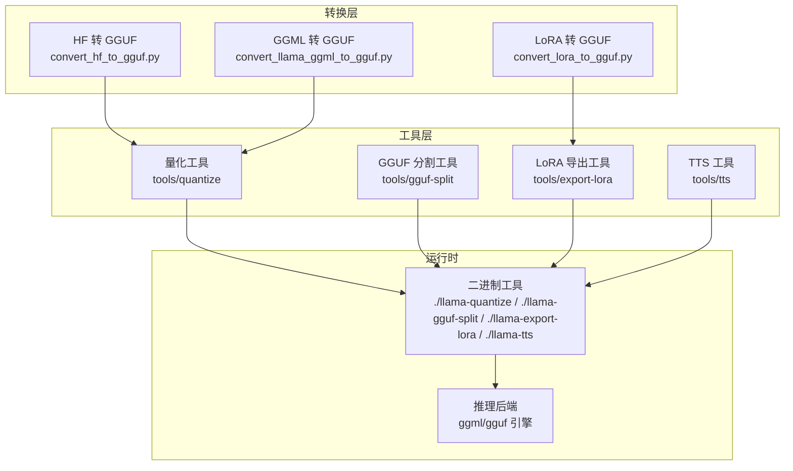
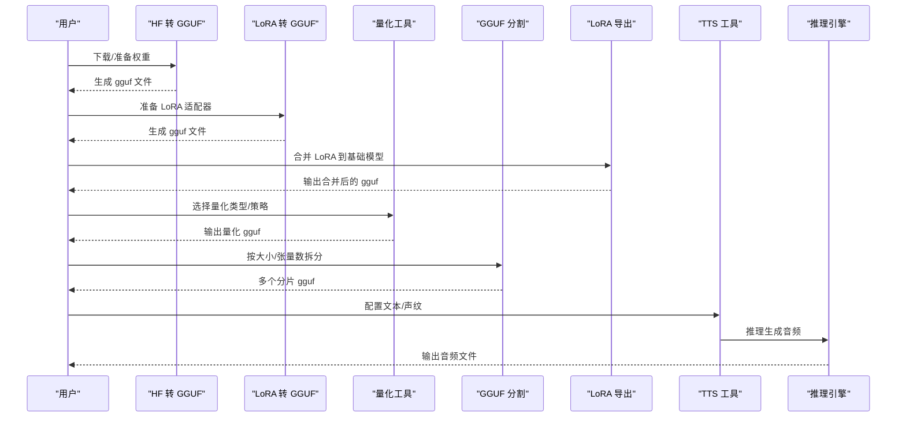
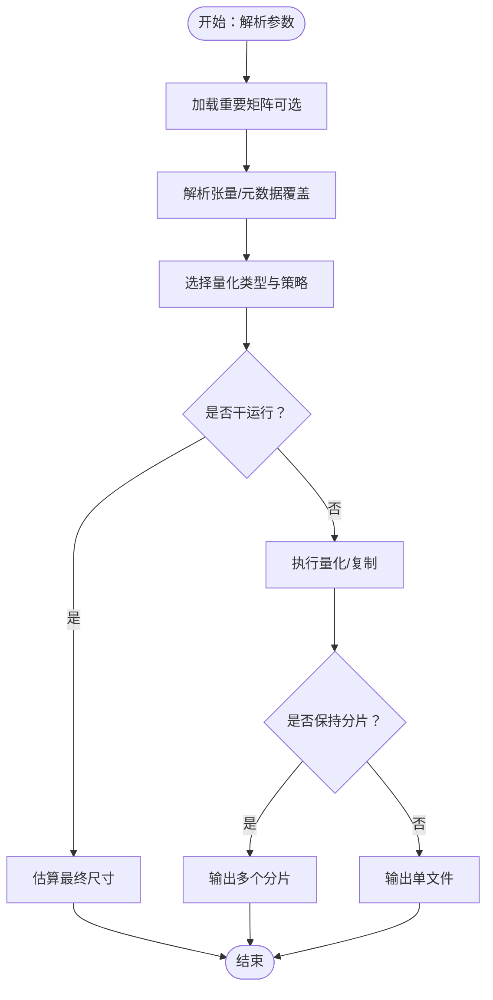
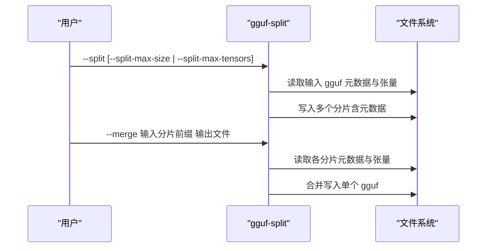
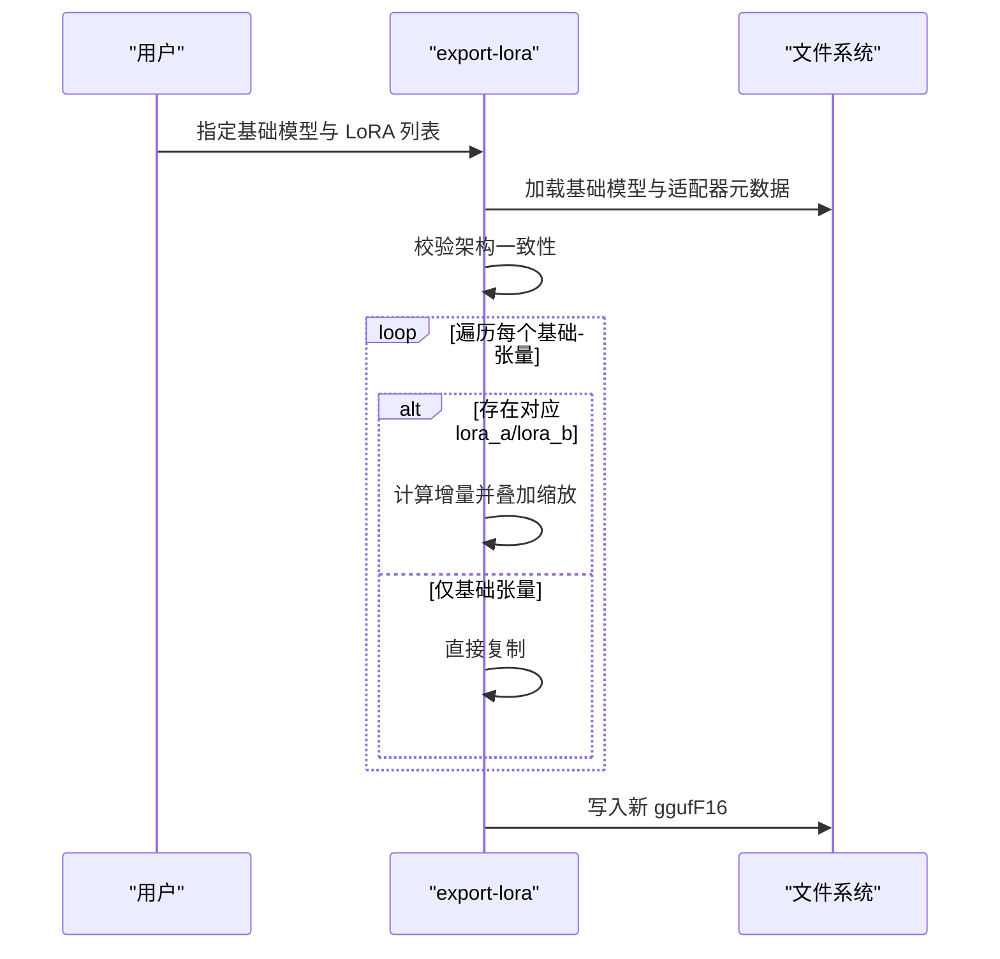
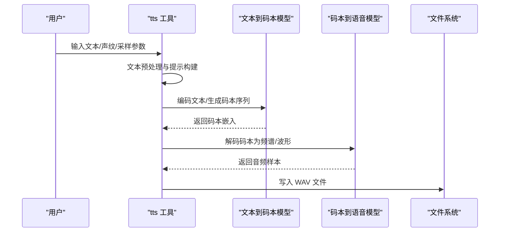
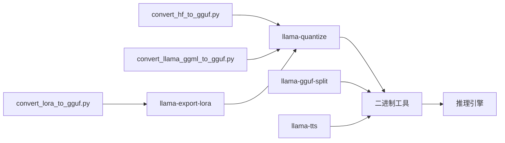

# 模型处理工具

<cite>
**本文引用的文件**
- [README.md](file://README.md)
- [quantize.cpp](file://tools/quantize/quantize.cpp)
- [quantize/README.md](file://tools/quantize/README.md)
- [gguf-split.cpp](file://tools/gguf-split/gguf-split.cpp)
- [gguf-split/README.md](file://tools/gguf-split/README.md)
- [export-lora.cpp](file://tools/export-lora/export-lora.cpp)
- [export-lora/README.md](file://tools/export-lora/README.md)
- [tts.cpp](file://tools/tts/tts.cpp)
- [tts/README.md](file://tools/tts/README.md)
- [convert_hf_to_gguf.py](file://convert_hf_to_gguf.py)
- [convert_lora_to_gguf.py](file://convert_lora_to_gguf.py)
- [convert_llama_ggml_to_gguf.py](file://convert_llama_ggml_to_gguf.py)
- [requirements.txt](file://requirements.txt)
- [requirements-convert_hf_to_gguf.txt](file://requirements/requirements-convert_hf_to_gguf.txt)
- [requirements-convert_lora_to_gguf.txt](file://requirements/requirements-convert_lora_to_gguf.txt)
- [requirements-convert_llama_ggml_to_gguf.txt](file://requirements/requirements-convert_llama_ggml_to_gguf.txt)
</cite>

## 目录
1. [简介](#简介)
2. [项目结构](#项目结构)
3. [核心组件](#核心组件)
4. [架构总览](#架构总览)
5. [详细组件分析](#详细组件分析)
6. [依赖关系分析](#依赖关系分析)
7. [性能考虑](#性能考虑)
8. [故障排查指南](#故障排查指南)
9. [结论](#结论)
10. [附录](#附录)

## 简介
本文件系统性梳理并说明 llama.cpp 中的模型处理工具链，覆盖以下能力：
- 量化工具：支持多种精度级别与混合量化策略，兼顾体积与性能，并提供重要矩阵（imatrix）优化与分片输出选项。
- GGUF 分割工具：将大型 GGUF 模型按大小或张量数量进行拆分，或合并回单文件，便于分布式部署与存储管理。
- LoRA 导出工具：将 LoRA 适配器合并到基础模型，生成可直接推理的 GGUF 文件。
- TTS 工具：基于文本到音素/码本再到波形的端到端流水线，支持多版本 OuteTTS 模型与声纹配置。
- 模型转换与预处理：从 Hugging Face 或 GGML 权重转换为 GGUF 的完整工作流，以及量化、导出、分割等后续处理。
- 批量处理与自动化：通过命令行参数与脚本化组合，实现可重复、可扩展的批量化与自动化。

## 项目结构
围绕模型处理的关键目录与文件：
- tools/quantize：量化工具源码与说明
- tools/gguf-split：GGUF 拆分/合并工具源码与说明
- tools/export-lora：LoRA 合并导出工具源码与说明
- tools/tts：文本转语音示例与工具源码
- 转换脚本：convert_hf_to_gguf.py、convert_lora_to_gguf.py、convert_llama_ggml_to_gguf.py
- 依赖清单：requirements/*.txt

图示来源
- [quantize.cpp:493-756](file://tools/quantize/quantize.cpp#L493-L756)
- [gguf-split.cpp:573-589](file://tools/gguf-split/gguf-split.cpp#L573-L589)
- [export-lora.cpp:414-439](file://tools/export-lora/export-lora.cpp#L414-L439)
- [tts.cpp:539-800](file://tools/tts/tts.cpp#L539-L800)

章节来源
- [README.md:323-443](file://README.md#L323-L443)

## 核心组件
- 量化工具（llama-quantize）
  - 支持多种量化类型（如 IQ2_XXS/IQ3_S/Q2_K/Q3_K_M/Q4_K_M/Q5_K_M/Q6_K/Q8_0/F16/BF16/F32/COPY），并可启用纯量化（--pure）、允许二次量化（--allow-requantize）、保留输出权重（--leave-output-tensor）、使用重要矩阵（--imatrix）等高级选项。
  - 可按张量名或正则表达式精细控制特定张量的量化类型，支持裁剪层（--prune-layers）与元数据覆盖（--override-kv）。
  - 支持保持输入分片（--keep-split）与干运行（--dry-run）估算最终尺寸。
- GGUF 分割工具（llama-gguf-split）
  - 默认拆分（--split），支持两种模式：按最大张量数（--split-max-tensors）或按最大文件大小（--split-max-size N[M|G]）。
  - 合并模式（--merge），自动扫描同目录下命名规范的分片并合并为单文件。
- LoRA 导出工具（llama-export-lora）
  - 将一个或多个 LoRA 适配器合并到基础模型，生成新的 GGUF 文件；支持缩放系数与多适配器叠加。
  - 对张量一致性有要求，当前不支持子集适配器合并。
- TTS 工具（llama-tts）
  - 文本预处理（数字转词、小写、标点清理、分隔符替换），构建提示模板，调用两个模型（文本到码本、码本到语音）完成端到端合成。
  - 支持声纹文件加载与版本区分（0.2/0.3）。

章节来源
- [quantize.cpp:28-74](file://tools/quantize/quantize.cpp#L28-L74)
- [quantize.cpp:125-182](file://tools/quantize/quantize.cpp#L125-L182)
- [quantize.cpp:508-574](file://tools/quantize/quantize.cpp#L508-L574)
- [quantize.cpp:647-756](file://tools/quantize/quantize.cpp#L647-L756)
- [quantize/README.md:47-100](file://tools/quantize/README.md#L47-L100)
- [gguf-split.cpp:29-50](file://tools/gguf-split/gguf-split.cpp#L29-L50)
- [gguf-split.cpp:90-176](file://tools/gguf-split/gguf-split.cpp#L90-L176)
- [gguf-split.cpp:364-400](file://tools/gguf-split/gguf-split.cpp#L364-L400)
- [gguf-split.cpp:402-571](file://tools/gguf-split/gguf-split.cpp#L402-L571)
- [gguf-split/README.md:5-11](file://tools/gguf-split/README.md#L5-L11)
- [export-lora.cpp:115-272](file://tools/export-lora/export-lora.cpp#L115-L272)
- [export-lora.cpp:282-397](file://tools/export-lora/export-lora.cpp#L282-L397)
- [export-lora/README.md:5-34](file://tools/export-lora/README.md#L5-L34)
- [tts.cpp:539-800](file://tools/tts/tts.cpp#L539-L800)
- [tts/README.md:6-118](file://tools/tts/README.md#L6-L118)

## 架构总览
下图展示从“原始权重/LoRA/HF 模型”到“可部署 GGUF”的完整处理链路，以及各工具在其中的角色与交互。

图示来源
- [convert_hf_to_gguf.py](file://convert_hf_to_gguf.py)
- [convert_lora_to_gguf.py](file://convert_lora_to_gguf.py)
- [export-lora.cpp:131-272](file://tools/export-lora/export-lora.cpp#L131-L272)
- [quantize.cpp:493-756](file://tools/quantize/quantize.cpp#L493-L756)
- [gguf-split.cpp:364-571](file://tools/gguf-split/gguf-split.cpp#L364-L571)
- [tts.cpp:539-800](file://tools/tts/tts.cpp#L539-L800)

## 详细组件分析

### 量化工具（llama-quantize）
- 功能要点
  - 量化类型枚举与描述，覆盖 2.x~8.x 比特及 F16/BF16/F32/COPY 等。
  - 重要矩阵（imatrix）支持：可从旧版/新版 imatrix 文件加载，按张量名包含/排除，自动写入元数据键值。
  - 细粒度控制：张量类型覆盖（--tensor-type）、张量类型文件（--tensor-type-file）、裁剪层（--prune-layers）、元数据覆盖（--override-kv）。
  - 性能与体积权衡：--pure 关闭混合量化；--leave-output-tensor 保留输出层以提升质量；--keep-split 保持分片输出。
- 使用建议
  - 小模型或对精度敏感：优先 IQ2_S/IQ3_M/Q3_K_M/Q4_K_M；大模型或追求吞吐：Q4_K_S/Q5_K_S/Q6_K。
  - 使用 imatrix 可显著降低困惑度与 KL 散度损失，建议配合 --imatrix 与 --include-weights/--exclude-weights 精准优化关键层。
  - 大模型量化前确保磁盘空间充足，内存与磁盘占用与原模型相当。

图示来源
- [quantize.cpp:508-756](file://tools/quantize/quantize.cpp#L508-L756)
- [quantize/README.md:100-172](file://tools/quantize/README.md#L100-L172)

章节来源
- [quantize.cpp:28-74](file://tools/quantize/quantize.cpp#L28-L74)
- [quantize.cpp:125-182](file://tools/quantize/quantize.cpp#L125-L182)
- [quantize.cpp:508-756](file://tools/quantize/quantize.cpp#L508-L756)
- [quantize/README.md:47-100](file://tools/quantize/README.md#L47-L100)
- [quantize/README.md:112-172](file://tools/quantize/README.md#L112-L172)

### GGUF 分割工具（llama-gguf-split）
- 功能要点
  - 拆分模式：按张量数量（默认每 128 个）或按文件大小（如 500M/2G）。
  - 合并模式：自动识别分片计数与前缀，顺序读取并写入元数据与张量数据。
  - 元数据标记：为每个分片设置分片编号与总数，便于加载器识别。
- 使用建议
  - 大模型部署前先拆分，避免单文件过大导致加载困难；根据目标环境磁盘/网络限制选择合适大小。
  - 合并时确保分片命名规范一致，避免遗漏或错序。

图示来源
- [gguf-split.cpp:364-571](file://tools/gguf-split/gguf-split.cpp#L364-L571)
- [gguf-split/README.md:5-11](file://tools/gguf-split/README.md#L5-L11)

章节来源
- [gguf-split.cpp:90-176](file://tools/gguf-split/gguf-split.cpp#L90-L176)
- [gguf-split.cpp:364-571](file://tools/gguf-split/gguf-split.cpp#L364-L571)
- [gguf-split/README.md:5-11](file://tools/gguf-split/README.md#L5-L11)

### LoRA 导出工具（llama-export-lora）
- 功能要点
  - 校验基础模型与 LoRA 适配器架构一致性，检查 general.type 与 adapter.type。
  - 支持多适配器叠加与缩放系数；对 token embeddings 特殊处理（乘法矩阵）。
  - 输出强制为 F16（兼容大多数推理场景）。
- 使用建议
  - 当前不支持子集适配器合并，需确保所有适配器包含相同张量集合。
  - 若 LoRA 为量化权重，需先转换为 F32/F16 再合并。

图示来源
- [export-lora.cpp:115-272](file://tools/export-lora/export-lora.cpp#L115-L272)
- [export-lora.cpp:282-397](file://tools/export-lora/export-lora.cpp#L282-L397)
- [export-lora/README.md:5-34](file://tools/export-lora/README.md#L5-L34)

章节来源
- [export-lora.cpp:161-207](file://tools/export-lora/export-lora.cpp#L161-L207)
- [export-lora.cpp:282-397](file://tools/export-lora/export-lora.cpp#L282-L397)
- [export-lora/README.md:5-34](file://tools/export-lora/README.md#L5-L34)

### TTS 工具（llama-tts）
- 功能要点
  - 文本预处理：数字转英文、小写、清理特殊字符、替换分隔符。
  - 提示模板：构造“角色/引导/文本/音频数据”序列，支持版本差异（0.2/0.3）。
  - 推理与合成：两阶段模型（文本到码本、码本到波形），多线程 IRFFT 与重叠相加重建音频。
  - 声纹：支持外部声纹文件，动态注入音频词典与持续时间信息。
- 使用建议
  - 确保两个模型均以 GGUF 格式加载；若使用服务器模式，注意 embedding/pooling 参数。
  - 合成较长文本时适当调整上下文长度与批大小，平衡速度与质量。

图示来源
- [tts.cpp:539-800](file://tools/tts/tts.cpp#L539-L800)
- [tts/README.md:6-118](file://tools/tts/README.md#L6-L118)

章节来源
- [tts.cpp:539-800](file://tools/tts/tts.cpp#L539-L800)
- [tts/README.md:6-118](file://tools/tts/README.md#L6-L118)

## 依赖关系分析
- 转换脚本依赖
  - convert_hf_to_gguf.py：依赖 requirements-convert_hf_to_gguf.txt
  - convert_lora_to_gguf.py：依赖 requirements-convert_lora_to_gguf.txt
  - convert_llama_ggml_to_gguf.py：依赖 requirements-convert_llama_ggml_to_gguf.txt
- 运行时依赖
  - 顶层 requirements.txt：统一安装运行所需 Python 包
- 工具链耦合
  - 转换脚本 → 量化/导出/分割工具 → 推理引擎
  - LoRA 导出工具与量化工具可串联使用，形成“LoRA → 合并 → 量化”的闭环

图示来源
- [convert_hf_to_gguf.py](file://convert_hf_to_gguf.py)
- [convert_lora_to_gguf.py](file://convert_lora_to_gguf.py)
- [convert_llama_ggml_to_gguf.py](file://convert_llama_ggml_to_gguf.py)
- [quantize.cpp:493-756](file://tools/quantize/quantize.cpp#L493-L756)
- [gguf-split.cpp:573-589](file://tools/gguf-split/gguf-split.cpp#L573-L589)
- [export-lora.cpp:414-439](file://tools/export-lora/export-lora.cpp#L414-L439)
- [tts.cpp:539-800](file://tools/tts/tts.cpp#L539-L800)

章节来源
- [requirements.txt](file://requirements.txt)
- [requirements-convert_hf_to_gguf.txt](file://requirements/requirements-convert_hf_to_gguf.txt)
- [requirements-convert_lora_to_gguf.txt](file://requirements/requirements-convert_lora_to_gguf.txt)
- [requirements-convert_llama_ggml_to_gguf.txt](file://requirements/requirements-convert_llama_ggml_to_gguf.txt)

## 性能考虑
- 量化性能与精度
  - 更低比特（如 Q4_K、Q5_K）通常更快更省内存，但可能引入精度损失；高比特（Q6_K/Q8_0）更接近原精度但体积更大。
  - 使用 imatrix 可显著降低精度损失，尤其在关键层（注意力、FFN 输出）上。
  - --pure 与 --leave-output-tensor 在不同任务上效果不同，建议结合下游指标（困惑度、KL 散度）评估。
- 分片与加载
  - 拆分有助于并行加载与缓存命中；合并适合集中部署与简化路径。
  - 合并时注意分片命名与计数键值一致性，避免加载失败。
- LoRA 合并
  - 合并后仍可继续量化，但需确保 LoRA 未量化；多适配器叠加时注意缩放系数与稳定性。
- TTS 合成
  - 多线程 IRFFT 与折叠重建提升速度；长文本建议增大上下文与批大小，同时控制采样策略（top_k 等）。

## 故障排查指南
- 量化相关
  - imatrix 文件格式错误：确认新版 GGUF imatrix 结构与旧版二进制格式差异，必要时重新生成。
  - --include-weights 与 --exclude-weights 同时使用：会触发参数冲突，需二选一。
  - --allow-requantize 二次量化可能导致质量下降，建议仅在必要时开启。
- 分割/合并相关
  - 合并失败：检查分片计数键值是否存在且有效，确保输入前缀正确。
  - 拆分过小导致某分片无张量：提高 --split-max-size 或 --split-max-tensors。
- LoRA 导出相关
  - 适配器张量集合不一致：当前不支持子集合并，需逐个适配器单独处理。
  - LoRA 量化权重：需先转换为 F32/F16 再合并。
- TTS 相关
  - 文本预处理异常：检查分隔符与版本差异（0.2/0.3），确保提示模板匹配模型 chat template。
  - 声纹文件缺失或格式错误：确认 JSON 字段完整性（words/durations/codes）。

章节来源
- [quantize.cpp:576-582](file://tools/quantize/quantize.cpp#L576-L582)
- [quantize.cpp:588-645](file://tools/quantize/quantize.cpp#L588-L645)
- [gguf-split.cpp:402-486](file://tools/gguf-split/gguf-split.cpp#L402-L486)
- [gguf-split.cpp:486-501](file://tools/gguf-split/gguf-split.cpp#L486-L501)
- [export-lora.cpp:194-207](file://tools/export-lora/export-lora.cpp#L194-L207)
- [export-lora.cpp:304-307](file://tools/export-lora/export-lora.cpp#L304-L307)
- [tts.cpp:478-498](file://tools/tts/tts.cpp#L478-L498)

## 结论
llama.cpp 的模型处理工具链提供了从“转换—量化—导出—分割—推理”的完整闭环。通过合理选择量化级别、利用 imatrix 优化、采用分片策略与 LoRA 合并，可在保证性能的同时灵活适配不同硬件与部署场景。TTS 工具进一步拓展了文本到语音的应用边界。建议在生产环境中结合指标监控与自动化脚本，实现稳定高效的批量处理与运维。

## 附录
- 快速参考
  - 量化：./llama-quantize [输入] [输出] [量化类型] [线程数]
  - 分割：./llama-gguf-split --split [--split-max-size | --split-max-tensors] 输入 输出
  - 合并：./llama-gguf-split --merge 输入分片前缀 输出
  - LoRA 导出：./llama-export-lora -m 基础模型 --lora 适配器1 [--lora 适配器2 ...] -o 输出
  - TTS：./llama-tts -m 文本模型 -mv 语音解码器 -p "你好世界"
- 最佳实践
  - 先转换再量化，再分片部署；LoRA 合并后可继续量化。
  - 使用 imatrix 优化关键层；评估不同量化类型的困惑度与吞吐。
  - 批量处理建议封装 shell/python 脚本，统一日志与错误处理。