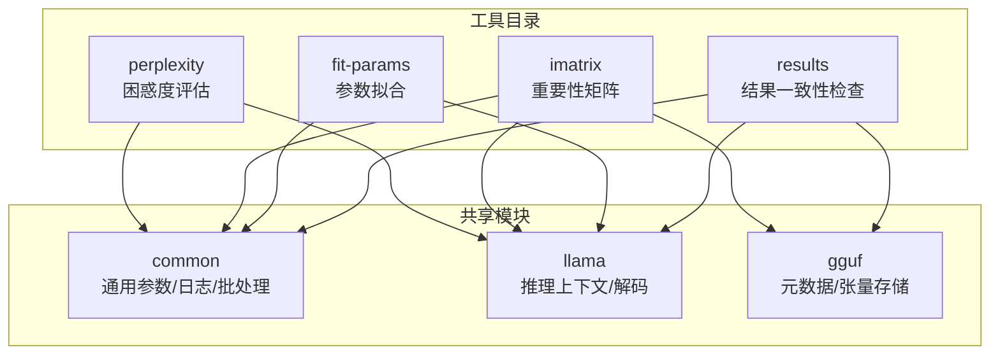
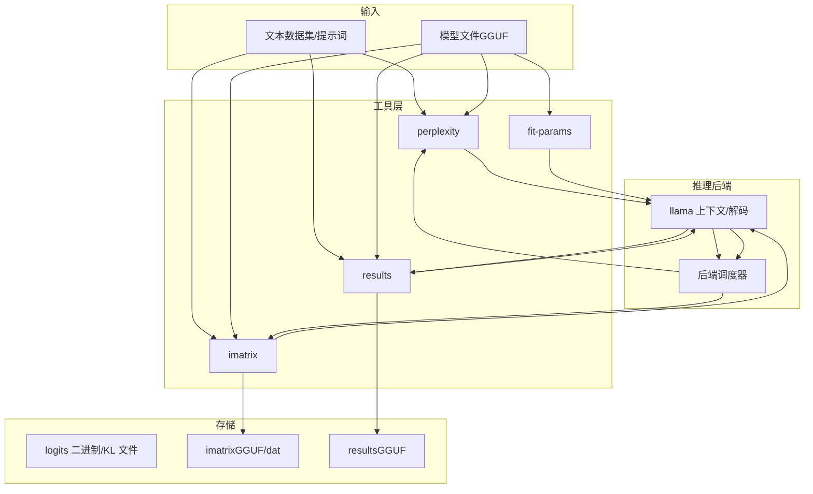
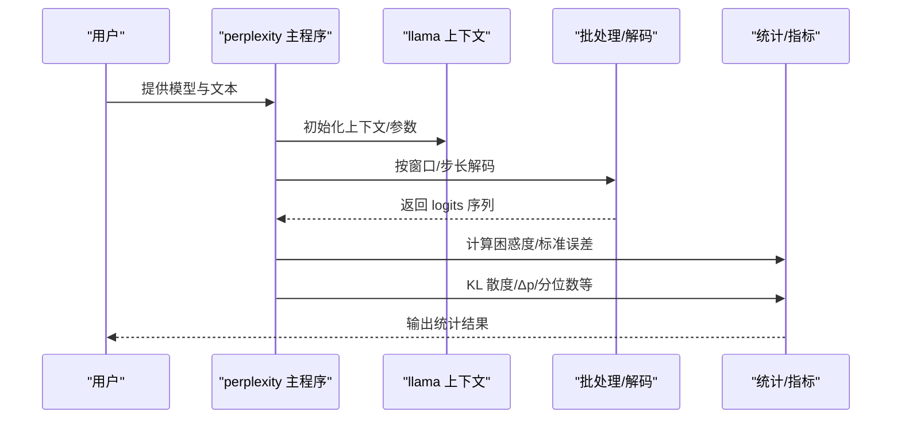
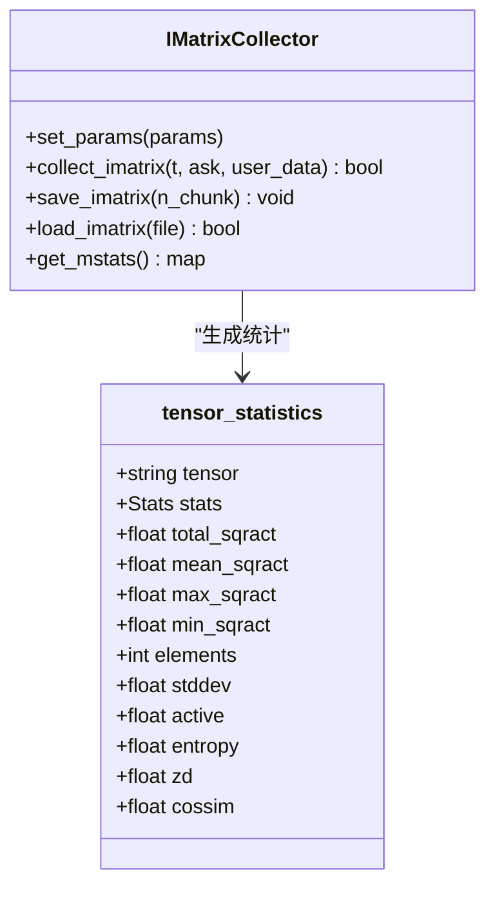
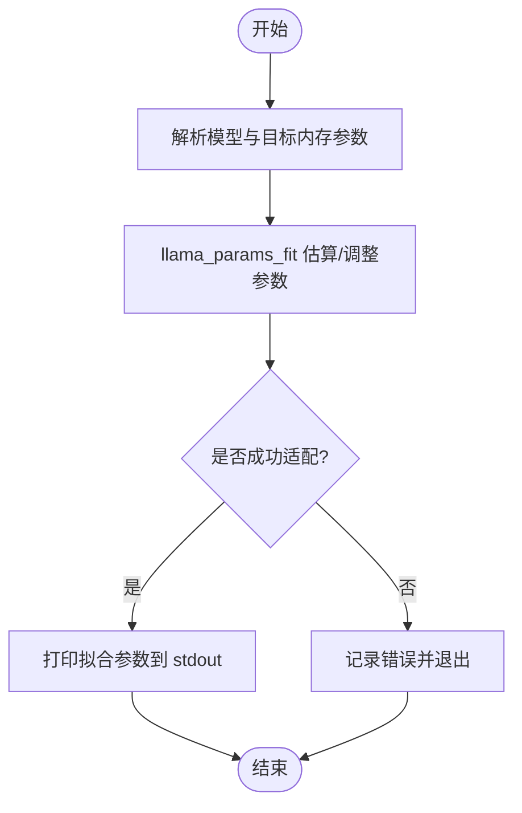
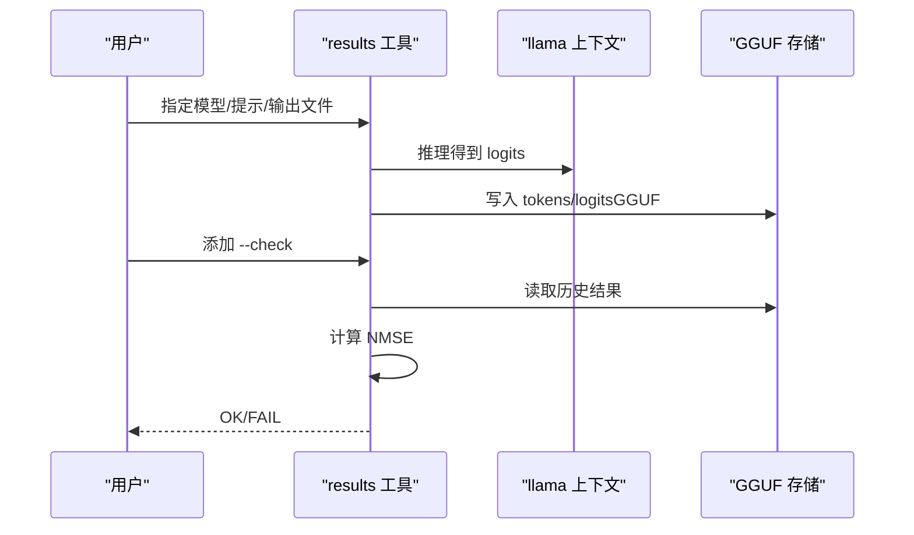
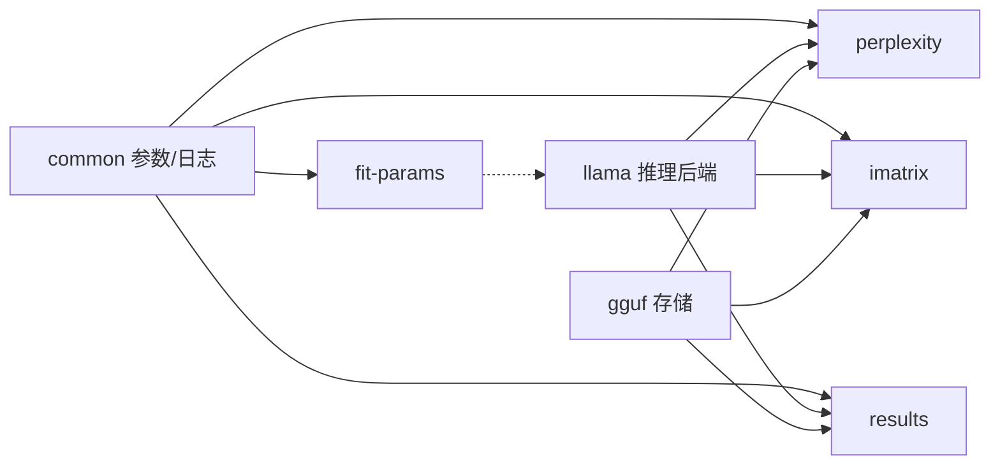

# 评估和分析工具

<cite>
**本文档引用的文件**
- [perplexity.cpp](file://tools/perplexity/perplexity.cpp)
- [README.md](file://tools/perplexity/README.md)
- [imatrix.cpp](file://tools/imatrix/imatrix.cpp)
- [README.md](file://tools/imatrix/README.md)
- [fit-params.cpp](file://tools/fit-params/fit-params.cpp)
- [README.md](file://tools/fit-params/README.md)
- [results.cpp](file://tools/results/results.cpp)
- [README.md](file://tools/results/README.md)
</cite>

## 目录
1. [简介](#简介)
2. [项目结构](#项目结构)
3. [核心组件](#核心组件)
4. [架构总览](#架构总览)
5. [详细组件分析](#详细组件分析)
6. [依赖关系分析](#依赖关系分析)
7. [性能考虑](#性能考虑)
8. [故障排查指南](#故障排查指南)
9. [结论](#结论)
10. [附录](#附录)

## 简介
本文件系统性梳理并解读 llama.cpp 仓库中的四类评估与分析工具：困惑度（perplexity）评估、重要性矩阵（imatrix）分析、参数拟合（fit-params）与结果一致性检查（results）。文档面向不同技术背景的读者，既提供代码级实现细节，也给出使用场景、最佳实践与可视化建议，并说明如何组合多个工具进行综合评估。

## 项目结构
四个工具分别位于 tools 目录下，每个工具包含独立的可执行程序、参数解析与使用说明文档：
- perplexity：语言模型困惑度计算与 KL 散度等扩展指标
- imatrix：基于推理激活统计的重要性矩阵收集与分析
- fit-params：自动适配设备内存的参数拟合工具
- results：对模型输出进行一致性校验与统计比较

图表来源
- [perplexity.cpp:1-50](file://tools/perplexity/perplexity.cpp#L1-L50)
- [imatrix.cpp:1-50](file://tools/imatrix/imatrix.cpp#L1-L50)
- [fit-params.cpp:1-30](file://tools/fit-params/fit-params.cpp#L1-L30)
- [results.cpp:1-20](file://tools/results/results.cpp#L1-L20)

章节来源
- [perplexity.cpp:1-120](file://tools/perplexity/perplexity.cpp#L1-L120)
- [imatrix.cpp:1-120](file://tools/imatrix/imatrix.cpp#L1-L120)
- [fit-params.cpp:1-40](file://tools/fit-params/fit-params.cpp#L1-L40)
- [results.cpp:1-40](file://tools/results/results.cpp#L1-L40)

## 核心组件
- 困惑度工具（perplexity）
  - 支持两种计算模式：滑动窗口（stride>0）与固定窗口（默认）
  - 提供困惑度均值与标准误差估计；支持保存/加载 logits 二进制文件，计算 KL 散度与概率变化统计
  - 内置 HellaSwag、Winograd 等多项选择任务评分流程
- 重要性矩阵工具（imatrix）
  - 基于推理过程中的激活平方和统计，生成每层/每张量的重要性分数
  - 支持 GGUF 与旧版 dat 两种格式；可合并多份 imatrix 文件
  - 提供统计摘要：Σ(Act²)、均值/方差、活跃比例、熵、Z 分数、层间余弦相似度
- 参数拟合工具（fit-params）
  - 自动根据可用显存调整上下文大小、GPU 层数与张量分片策略
  - 输出可直接复用的 CLI 参数，便于在资源受限环境下稳定运行
- 结果一致性工具（results）
  - 将当前推理 logits 与历史结果对比，采用归一化均方误差（NMSE）作为度量
  - 可用于回归检测与版本对比，阈值为 1e-6

章节来源
- [perplexity.cpp:296-662](file://tools/perplexity/perplexity.cpp#L296-L662)
- [imatrix.cpp:61-79](file://tools/imatrix/imatrix.cpp#L61-L79)
- [imatrix.cpp:129-202](file://tools/imatrix/imatrix.cpp#L129-L202)
- [fit-params.cpp:15-75](file://tools/fit-params/fit-params.cpp#L15-L75)
- [results.cpp:14-56](file://tools/results/results.cpp#L14-L56)

## 架构总览
四个工具共享 common 参数体系与日志框架，推理后端由 llama 模块提供；imatrix 使用 GGUF 存储中间统计；results 使用 GGUF 元数据与张量组织结果。

图表来源
- [perplexity.cpp:444-662](file://tools/perplexity/perplexity.cpp#L444-L662)
- [imatrix.cpp:919-1094](file://tools/imatrix/imatrix.cpp#L919-L1094)
- [fit-params.cpp:15-75](file://tools/fit-params/fit-params.cpp#L15-L75)
- [results.cpp:58-182](file://tools/results/results.cpp#L58-L182)

## 详细组件分析

### 困惑度工具（perplexity）
- 计算原理
  - 困惑度定义为指数平均负对数似然：PPL = exp(E[-log p(token_i|context)])
  - 工具在固定窗口内对后半段 token 的下一个 token 进行预测，统计对数似然并求均值与标准误差
  - 支持“滑动窗口”模式，按步长遍历序列，适合长文本评估
- 扩展指标（KL 散度与概率变化）
  - 通过保存/加载 logits 二进制文件，计算与 FP16 基线的 KL 散度、概率变化均值与分位数、RMS Δp、Top-p 一致性等
  - 适用于量化质量评估与噪声分析
- 多项选择任务评分
  - 内置 HellaSwag、Winogrande、TruthfulQA 等任务的评分流程，支持批量与并行计算

图表来源
- [perplexity.cpp:444-662](file://tools/perplexity/perplexity.cpp#L444-L662)
- [perplexity.cpp:844-1015](file://tools/perplexity/perplexity.cpp#L844-L1015)
- [perplexity.cpp:1101-1301](file://tools/perplexity/perplexity.cpp#L1101-L1301)

章节来源
- [perplexity.cpp:296-662](file://tools/perplexity/perplexity.cpp#L296-L662)
- [README.md:1-194](file://tools/perplexity/README.md#L1-L194)

使用场景与最佳实践
- 模型质量基线：FP16 基线困惑度作为比较基准
- 量化影响评估：KL 散度与 Δp 指标反映量化引入的分布偏差与概率变化
- 长文本评估：滑动窗口模式适合大语料，注意设置合理步长与上下文大小
- 任务导向评估：使用内置多项选择任务评分验证下游能力

### 重要性矩阵工具（imatrix）
- 统计采集
  - 在推理过程中拦截矩阵乘法节点，收集激活平方和（Σ Act²），并记录每专家/每张量的计数
  - 支持间接专家选择（MoE）与常规稠密张量两类
- 统计分析
  - 每张量：Σ(Act²)、最小/最大、均值/标准差、活跃比例、熵、Z 分数、CosSim（与前一层的余弦相似度）
  - 每层加权平均：按元素数量加权的 Σ(Act²)、ZD、CosSim
- 文件格式
  - 默认 GGUF；支持旧版 dat 格式；可转换与合并多份 imatrix 文件

图表来源
- [imatrix.cpp:61-79](file://tools/imatrix/imatrix.cpp#L61-L79)
- [imatrix.cpp:129-202](file://tools/imatrix/imatrix.cpp#L129-L202)

章节来源
- [imatrix.cpp:229-409](file://tools/imatrix/imatrix.cpp#L229-L409)
- [imatrix.cpp:1096-1203](file://tools/imatrix/imatrix.cpp#L1096-L1203)
- [README.md:1-99](file://tools/imatrix/README.md#L1-L99)

使用场景与最佳实践
- 量化增强：将 imatrix 作为量化先验，提升低比特精度下的模型质量
- 层/张量重要性排序：依据 Σ(Act²) 与 CosSim 识别关键路径
- 多数据集融合：合并不同数据集的 imatrix，扩大样本覆盖
- 注意事项：统计基于平方激活，非原始激活；余弦相似度可能受向量方向影响

### 参数拟合工具（fit-params）
- 功能概述
  - 根据可用显存自动调整上下文大小、GPU 层数与张量分片，确保满足内存预算
  - 输出可直接复用的 CLI 参数，便于在服务器或容器环境中快速部署
- 使用流程
  - 运行工具打印拟合后的参数 → 将输出作为后续命令行参数传入主程序

图表来源
- [fit-params.cpp:15-75](file://tools/fit-params/fit-params.cpp#L15-L75)

章节来源
- [fit-params.cpp:15-75](file://tools/fit-params/fit-params.cpp#L15-L75)
- [README.md:1-56](file://tools/fit-params/README.md#L1-L56)

使用场景与最佳实践
- 资源受限环境：在小显存设备上稳定运行大模型
- 自动化部署：将拟合参数写入配置文件，配合服务启动脚本
- 容器化：在 Kubernetes 中根据节点资源动态注入参数

### 结果一致性工具（results）
- 核心指标
  - 归一化均方误差（NMSE）：衡量当前 logits 与历史结果的差异
  - 对比阈值：1e-6，超过则判定失败
- 工作流程
  - 生成阶段：将 tokens 与 logits 保存至 GGUF 文件
  - 校验阶段：从 GGUF 加载历史 logits，计算 NMSE 并输出结果

图表来源
- [results.cpp:58-182](file://tools/results/results.cpp#L58-L182)

章节来源
- [results.cpp:14-56](file://tools/results/results.cpp#L14-L56)
- [results.cpp:58-182](file://tools/results/results.cpp#L58-L182)
- [README.md:1-12](file://tools/results/README.md#L1-L12)

使用场景与最佳实践
- 版本回归检测：每次模型更新后运行一次生成与校验，快速发现异常
- CI/CD 集成：将 --check 步骤加入流水线，保证输出稳定性
- 本地开发：在修改推理逻辑后快速验证一致性

## 依赖关系分析
- 共享依赖
  - common：参数解析、日志、批处理与通用初始化
  - llama：模型加载、上下文管理、解码与 logits 获取
  - gguf：imatrix 与 results 的元数据与张量存储
- 工具间耦合
  - perplexity 与 results：均可依赖 GGUF 存储中间结果
  - imatrix 与 perplexity：均可利用 llama 解码与批处理能力
  - fit-params 与其余工具：通过 CLI 参数注入，间接影响运行时行为

图表来源
- [perplexity.cpp:1-30](file://tools/perplexity/perplexity.cpp#L1-L30)
- [imatrix.cpp:1-25](file://tools/imatrix/imatrix.cpp#L1-L25)
- [results.cpp:1-10](file://tools/results/results.cpp#L1-L10)
- [fit-params.cpp:1-15](file://tools/fit-params/fit-params.cpp#L1-L15)

章节来源
- [perplexity.cpp:1-30](file://tools/perplexity/perplexity.cpp#L1-L30)
- [imatrix.cpp:1-25](file://tools/imatrix/imatrix.cpp#L1-L25)
- [results.cpp:1-10](file://tools/results/results.cpp#L1-L10)
- [fit-params.cpp:1-15](file://tools/fit-params/fit-params.cpp#L1-L15)

## 性能考虑
- 并行与批处理
  - perplexity 与 imatrix 在 logits 计算与统计聚合中广泛使用多线程，建议根据 CPU/内存容量调整线程数
  - 批大小与上下文大小需平衡吞吐与显存占用
- 内存优化
  - fit-params 自动减少上下文或迁移层到系统内存，避免 OOM
  - imatrix 的 GGUF 格式更利于大文件管理与增量保存
- I/O 与存储
  - perplexity 的 logits 二进制文件体积较大，建议使用高速存储与合适的压缩策略（如仅保存缩放后的 16 位表示）
  - results 与 imatrix 的 GGUF 文件便于跨平台传输与版本控制

## 故障排查指南
- 困惑度工具
  - 输入长度不足：当 token 数小于 2×上下文时会报错，需增加数据或减小上下文
  - 步长设置不当：步长必须大于零，否则无法进入滑动窗口模式
  - KL 散度文件过大：注意磁盘空间，必要时清理临时文件
- imatrix 工具
  - 张量维度不匹配：旧版与新版格式混用时可能出现尺寸不一致，需转换为统一格式
  - 部分专家未被触发：MoE 模型中某些专家可能无激活，工具会警告并跳过
- fit-params 工具
  - 无法满足内存预算：工具会输出具体缺口与调整建议，可降低上下文或减少 GPU 层数
- results 工具
  - NMSE 超限：检查模型版本、参数或数据是否发生变化；必要时重新生成历史结果

章节来源
- [perplexity.cpp:314-340](file://tools/perplexity/perplexity.cpp#L314-L340)
- [imatrix.cpp:289-304](file://tools/imatrix/imatrix.cpp#L289-L304)
- [results.cpp:132-141](file://tools/results/results.cpp#L132-L141)

## 结论
- perplexity 提供了从基础困惑度到 KL 散度与概率变化的全链路评估能力，适合量化与蒸馏质量分析
- imatrix 通过激活统计刻画模型内部重要性，是量化与知识蒸馏的重要先验
- fit-params 保障在异构硬件上的稳定运行，降低部署门槛
- results 以 NMSE 为核心指标，便于自动化回归检测与版本对比
- 综合使用：先用 imatrix 指导量化，再用 perplexity 与多项选择任务评估下游效果，最后用 results 校验输出稳定性

## 附录
- 数据分析与可视化建议
  - 困惑度：绘制随上下文/步长变化的趋势图，标注均值与误差带
  - KL 散度：对比不同量化方案的分布差异，关注尾部（99%+）KL 值
  - imatrix：按层/张量绘制 Σ(Act²) 热力图，识别关键路径；计算 CosSim 评估层间一致性
  - results：NMSE 时间序列图，定位回归点
- 最佳实践清单
  - 使用固定数据集（如 Wikitext-2）与相同预处理，确保可比性
  - 在 GPU 与 CPU 后端分别评估，对比延迟与稳定性
  - 将工具输出纳入 CI/CD，建立持续回归监控