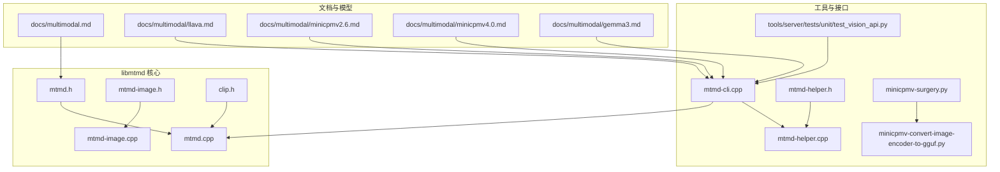
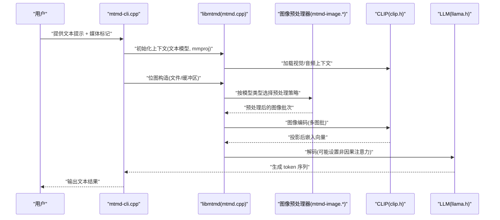
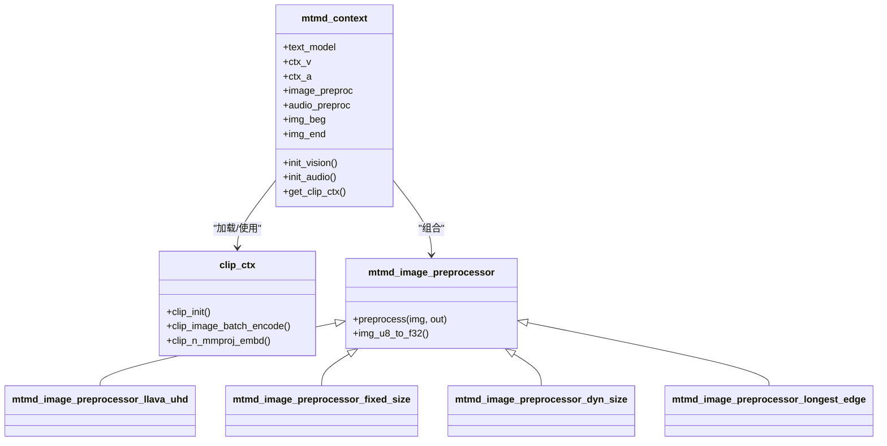
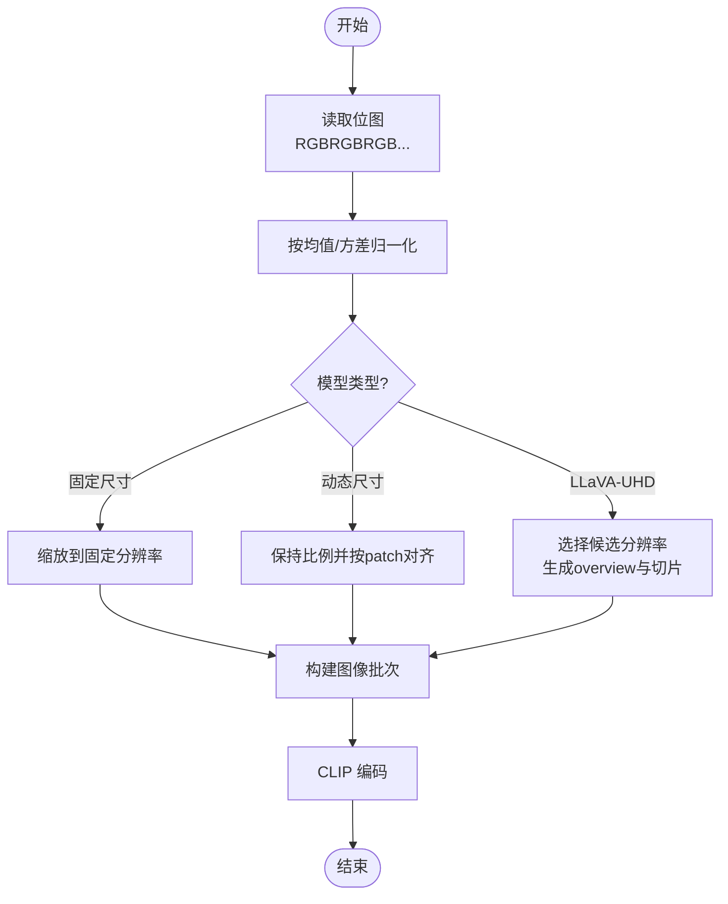
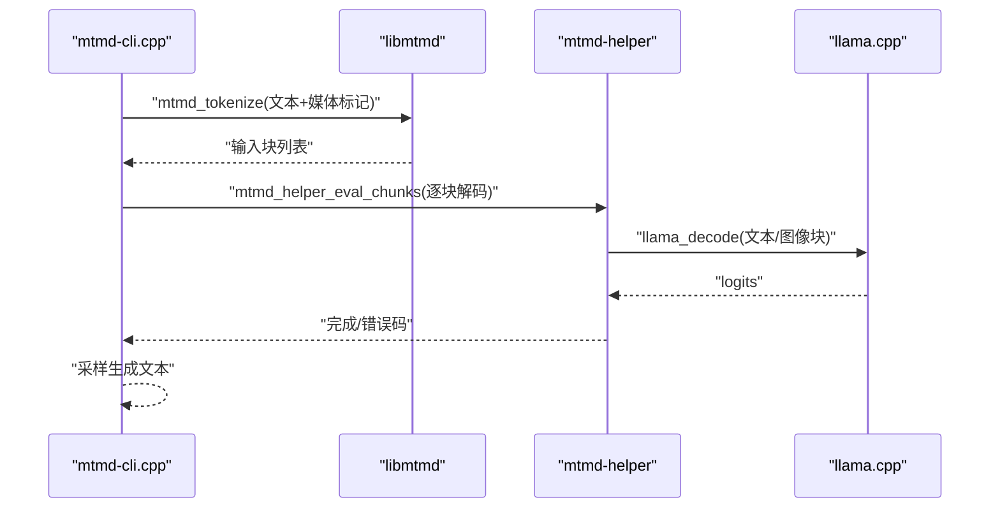
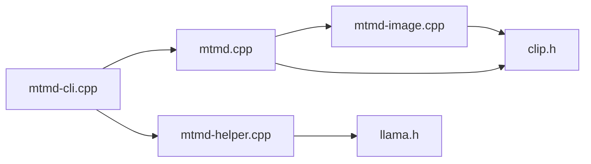

# 图像处理

<cite>
**本文引用的文件**
- [multimodal.md](file://docs/multimodal.md)
- [llava.md](file://docs/multimodal/llava.md)
- [minicpmv2.6.md](file://docs/multimodal/minicpmv2.6.md)
- [minicpmv4.0.md](file://docs/multimodal/minicpmv4.0.md)
- [gemma3.md](file://docs/multimodal/gemma3.md)
- [mtmd.h](file://tools/mtmd/mtmd.h)
- [mtmd.cpp](file://tools/mtmd/mtmd.cpp)
- [mtmd-image.h](file://tools/mtmd/mtmd-image.h)
- [mtmd-image.cpp](file://tools/mtmd/mtmd-image.cpp)
- [clip.h](file://tools/mtmd/clip.h)
- [mtmd-cli.cpp](file://tools/mtmd/mtmd-cli.cpp)
- [mtmd-helper.h](file://tools/mtmd/mtmd-helper.h)
- [mtmd-helper.cpp](file://tools/mtmd/mtmd-helper.cpp)
- [minicpmv-surgery.py](file://tools/mtmd/legacy-models/minicpmv-surgery.py)
- [minicpmv-convert-image-encoder-to-gguf.py](file://tools/mtmd/legacy-models/minicpmv-convert-image-encoder-to-gguf.py)
- [test_vision_api.py](file://tools/server/tests/unit/test_vision_api.py)
</cite>

## 目录
1. [简介](#简介)
2. [项目结构](#项目结构)
3. [核心组件](#核心组件)
4. [架构总览](#架构总览)
5. [详细组件分析](#详细组件分析)
6. [依赖关系分析](#依赖关系分析)
7. [性能考虑](#性能考虑)
8. [故障排查指南](#故障排查指南)
9. [结论](#结论)
10. [附录](#附录)

## 简介
本章节系统性介绍 llama.cpp 的图像处理能力与多模态实现，重点覆盖以下方面：
- 视觉编码器（以 CLIP 为主）的集成方式与图像特征提取机制
- 图像预处理流程：尺寸调整、归一化、数据格式转换
- 多模态视觉模型的加载与推理流程（如 LLaVA、MiniCPM-V、Qwen-VL、Gemma 3 等）
- 图像输入的 CLI 与服务端 API 接口及参数配置
- 最佳实践与性能优化建议
- 典型应用示例：图像问答、图像描述等

## 项目结构
llama.cpp 的多模态能力由独立的 libmtmd 子系统提供，并通过 CLI 工具与服务端统一接入。关键目录与文件如下：
- 文档与模型说明：docs/multimodal 及其子文档
- 核心库与接口：tools/mtmd 下的头文件与实现
- CLI 与服务端：tools/mtmd/mtmd-cli.cpp 以及 tools/server
- 模型转换脚本：tools/mtmd/legacy-models 下的模型拆分与导出脚本

**图表来源**
- [multimodal.md:1-145](file://docs/multimodal.md#L1-L145)
- [mtmd.h:1-333](file://tools/mtmd/mtmd.h#L1-L333)
- [mtmd.cpp:1-800](file://tools/mtmd/mtmd.cpp#L1-L800)
- [mtmd-image.h:1-180](file://tools/mtmd/mtmd-image.h#L1-L180)
- [mtmd-image.cpp:1-800](file://tools/mtmd/mtmd-image.cpp#L1-L800)
- [clip.h:1-119](file://tools/mtmd/clip.h#L1-L119)
- [mtmd-cli.cpp:1-200](file://tools/mtmd/mtmd-cli.cpp#L1-L200)
- [mtmd-helper.h:1-101](file://tools/mtmd/mtmd-helper.h#L1-L101)
- [mtmd-helper.cpp:1-200](file://tools/mtmd/mtmd-helper.cpp#L1-L200)
- [minicpmv-surgery.py:1-48](file://tools/mtmd/legacy-models/minicpmv-surgery.py#L1-L48)
- [minicpmv-convert-image-encoder-to-gguf.py:1-200](file://tools/mtmd/legacy-models/minicpmv-convert-image-encoder-to-gguf.py#L1-L200)
- [test_vision_api.py:63-127](file://tools/server/tests/unit/test_vision_api.py#L63-L127)

**章节来源**
- [multimodal.md:1-145](file://docs/multimodal.md#L1-L145)
- [mtmd.h:1-333](file://tools/mtmd/mtmd.h#L1-L333)
- [mtmd.cpp:1-800](file://tools/mtmd/mtmd.cpp#L1-L800)
- [mtmd-image.h:1-180](file://tools/mtmd/mtmd-image.h#L1-L180)
- [mtmd-image.cpp:1-800](file://tools/mtmd/mtmd-image.cpp#L1-L800)
- [clip.h:1-119](file://tools/mtmd/clip.h#L1-L119)
- [mtmd-cli.cpp:1-200](file://tools/mtmd/mtmd-cli.cpp#L1-L200)
- [mtmd-helper.h:1-101](file://tools/mtmd/mtmd-helper.h#L1-L101)
- [mtmd-helper.cpp:1-200](file://tools/mtmd/mtmd-helper.cpp#L1-L200)
- [minicpmv-surgery.py:1-48](file://tools/mtmd/legacy-models/minicpmv-surgery.py#L1-L48)
- [minicpmv-convert-image-encoder-to-gguf.py:1-200](file://tools/mtmd/legacy-models/minicpmv-convert-image-encoder-to-gguf.py#L1-L200)
- [test_vision_api.py:63-127](file://tools/server/tests/unit/test_vision_api.py#L63-L127)

## 核心组件
- libmtmd：提供多模态上下文、图像/音频位图、输入块切分与编码、位置信息（含 M-RoPE）等能力
- CLIP 集成：通过 clip.h/clip.cpp 提供视觉/音频编码器初始化、图像批次编码、投影维度一致性校验等
- 图像预处理器族：针对不同模型（LLaVA-UHD、MiniCPM-V、Qwen-VL、Gemma 3 等）提供定制化预处理策略
- CLI 与服务端：mtmd-cli.cpp 提供命令行体验；服务端测试用例验证 OpenAI 兼容 API 的图像输入

关键接口与职责概览：
- mtmd.h：定义输入块类型、上下文参数、位图与图像令牌结构、tokenize/encode/decode 辅助函数
- mtmd.cpp：实现多模态上下文初始化、模型投影器类型识别、边界标记注入、LLM 解码前的非因果注意力开关、M-RoPE 位置计算
- mtmd-image.*：实现固定尺寸、动态尺寸、最长边对齐、LLaVA-UHD 切片等预处理策略
- clip.h：封装 CLIP 初始化、图像/音频编码、投影维度查询、Flash Attention 类型传递
- mtmd-cli.cpp：加载文本模型与 mmproj，构建聊天模板，读取媒体文件，生成响应
- mtmd-helper.*：提供计数、位置查询、批量解码辅助函数，简化调用方逻辑

**章节来源**
- [mtmd.h:53-254](file://tools/mtmd/mtmd.h#L53-L254)
- [mtmd.cpp:139-598](file://tools/mtmd/mtmd.cpp#L139-L598)
- [mtmd-image.h:11-180](file://tools/mtmd/mtmd-image.h#L11-L180)
- [mtmd-image.cpp:1-800](file://tools/mtmd/mtmd-image.cpp#L1-L800)
- [clip.h:35-119](file://tools/mtmd/clip.h#L35-L119)
- [mtmd-cli.cpp:68-176](file://tools/mtmd/mtmd-cli.cpp#L68-L176)
- [mtmd-helper.h:23-94](file://tools/mtmd/mtmd-helper.h#L23-L94)
- [mtmd-helper.cpp:99-200](file://tools/mtmd/mtmd-helper.cpp#L99-L200)

## 架构总览
下图展示了从用户输入到多模态推理的整体流程，涵盖图像预处理、CLIP 编码、投影对齐、LLM 解码与输出。

**图表来源**
- [mtmd-cli.cpp:136-176](file://tools/mtmd/mtmd-cli.cpp#L136-L176)
- [mtmd.cpp:179-256](file://tools/mtmd/mtmd.cpp#L179-L256)
- [mtmd-image.cpp:568-583](file://tools/mtmd/mtmd-image.cpp#L568-L583)
- [clip.h:50-119](file://tools/mtmd/clip.h#L50-L119)

## 详细组件分析

### 视觉编码器与 CLIP 集成
- 上下文初始化：根据 mmproj 文件与文本模型初始化 CLIP 视觉/音频上下文，校验投影维度与文本嵌入维度一致
- 投影器类型识别：依据模型元数据识别 MLP/MLP-NORM/LDP/COGVLM/MiniCPM-V/Qwen-VL 等类型，决定边界标记与预处理策略
- 编码路径：将预处理后的图像批次送入 CLIP 编码，得到与文本模型维度匹配的嵌入向量
- Flash Attention 与 GPU offload：支持自动/启用/禁用 Flash Attention，并可将 mmproj offload 至 GPU

**图表来源**
- [mtmd.cpp:139-256](file://tools/mtmd/mtmd.cpp#L139-L256)
- [clip.h:50-119](file://tools/mtmd/clip.h#L50-L119)
- [mtmd-image.h:11-180](file://tools/mtmd/mtmd-image.h#L11-L180)

**章节来源**
- [mtmd.cpp:139-256](file://tools/mtmd/mtmd.cpp#L139-L256)
- [clip.h:50-119](file://tools/mtmd/clip.h#L50-L119)
- [mtmd-image.h:11-180](file://tools/mtmd/mtmd-image.h#L11-L180)

### 图像预处理流程
- 数据准备：从文件或缓冲区读取像素，确保 RGBRGBRGB… 格式与 nx*ny*3 字节长度
- 归一化：按模型均值/方差进行像素归一化
- 尺寸调整：
  - 固定尺寸：直接缩放至模型期望分辨率
  - 动态尺寸：保持长宽比，按 patch 对齐，支持最长边策略
  - LLaVA-UHD：根据候选分辨率与网格策略生成 overview 与多切片
- 输出：生成浮点批次，供 CLIP 编码使用

**图表来源**
- [mtmd-image.cpp:11-31](file://tools/mtmd/mtmd-image.cpp#L11-L31)
- [mtmd-image.cpp:568-583](file://tools/mtmd/mtmd-image.cpp#L568-L583)
- [mtmd-image.cpp:585-729](file://tools/mtmd/mtmd-image.cpp#L585-L729)

**章节来源**
- [mtmd-image.cpp:11-31](file://tools/mtmd/mtmd-image.cpp#L11-L31)
- [mtmd-image.cpp:568-583](file://tools/mtmd/mtmd-image.cpp#L568-L583)
- [mtmd-image.cpp:585-729](file://tools/mtmd/mtmd-image.cpp#L585-L729)

### 多模态视觉模型加载与推理
- LLaVA 1.5/1.6：通过 mmproj 与语言模型分离，先将图像预处理为 token 块，再与文本 token 合并，最后解码
- MiniCPM-V 2.6/4：Resampler（视觉投影）与 LLM 分离，使用专用手术脚本拆分权重，再导出为 mmproj
- Qwen-VL/Pixtral/Gemma 3：采用动态分辨率策略，边界标记注入，支持 M-RoPE 位置编码
- 通用流程：CLI 侧读取媒体、构造位图、调用 libmtmd tokenization、调用 helper 批量解码、采样生成

**图表来源**
- [mtmd-cli.cpp:178-200](file://tools/mtmd/mtmd-cli.cpp#L178-L200)
- [mtmd-helper.h:60-90](file://tools/mtmd/mtmd-helper.h#L60-L90)
- [mtmd-helper.cpp:124-200](file://tools/mtmd/mtmd-helper.cpp#L124-L200)

**章节来源**
- [mtmd-cli.cpp:178-200](file://tools/mtmd/mtmd-cli.cpp#L178-L200)
- [mtmd-helper.h:60-90](file://tools/mtmd/mtmd-helper.h#L60-L90)
- [mtmd-helper.cpp:124-200](file://tools/mtmd/mtmd-helper.cpp#L124-L200)

### 模型文档与示例
- LLaVA：支持 v1.5 与 v1.6，需指定聊天模板；可通过 mmproj 与 LLaMA 分离加载
- MiniCPM-V：提供手术脚本与图像编码器转换脚本，支持 2.6/4 版本
- Gemma 3：提供预量化模型与 mmproj 导出方法

**章节来源**
- [llava.md:1-144](file://docs/multimodal/llava.md#L1-L144)
- [minicpmv2.6.md:1-48](file://docs/multimodal/minicpmv2.6.md#L1-L48)
- [minicpmv4.0.md:1-48](file://docs/multimodal/minicpmv4.0.md#L1-L48)
- [gemma3.md:1-52](file://docs/multimodal/gemma3.md#L1-L52)

## 依赖关系分析
- libmtmd 依赖 llama.h 与 ggml.h 进行张量与上下文管理
- CLIP 封装层提供统一接口，屏蔽底层实现差异
- 不同模型的预处理策略通过继承体系扩展，避免在核心逻辑中引入分支
- CLI 与服务端通过公共 helper 函数降低重复实现

**图表来源**
- [mtmd-cli.cpp:1-200](file://tools/mtmd/mtmd-cli.cpp#L1-L200)
- [mtmd.cpp:1-800](file://tools/mtmd/mtmd.cpp#L1-L800)
- [mtmd-image.cpp:1-800](file://tools/mtmd/mtmd-image.cpp#L1-L800)
- [clip.h:1-119](file://tools/mtmd/clip.h#L1-L119)
- [mtmd-helper.cpp:1-200](file://tools/mtmd/mtmd-helper.cpp#L1-L200)

**章节来源**
- [mtmd-cli.cpp:1-200](file://tools/mtmd/mtmd-cli.cpp#L1-L200)
- [mtmd.cpp:1-800](file://tools/mtmd/mtmd.cpp#L1-L800)
- [mtmd-image.cpp:1-800](file://tools/mtmd/mtmd-image.cpp#L1-L800)
- [clip.h:1-119](file://tools/mtmd/clip.h#L1-L119)
- [mtmd-helper.cpp:1-200](file://tools/mtmd/mtmd-helper.cpp#L1-L200)

## 性能考虑
- GPU offload：默认将 mmproj offload 至 GPU，可显著提升图像编码速度
- Flash Attention：可按需开启/禁用，平衡吞吐与延迟
- 预热：初始化时可执行一次预热编码，减少首次推理抖动
- 线程数：合理设置线程数，兼顾 CPU 与 I/O 并发
- 预处理策略：优先选择与模型一致的预处理（固定/动态/最长边），避免额外缩放
- 批量解码：使用 helper 的批量解码接口，减少 llama_decode 调用次数

[本节为通用指导，无需特定文件引用]

## 故障排查指南
- 报错“未支持的解码 RoPE 类型”：检查文本模型的 RoPE 类型是否受当前模型支持
- “文本模型与 mmproj 维度不一致”：确认 mmproj 与文本模型来自同一架构版本
- “位图数量与媒体标记不匹配”：确保提示中的媒体标记与提供的位图一一对应
- “图像预处理失败”：检查输入像素格式与尺寸，确保符合预期
- “音频输入质量较低”：音频输入仍处于实验阶段，建议优先使用图像输入

**章节来源**
- [mtmd.cpp:196-211](file://tools/mtmd/mtmd.cpp#L196-L211)
- [mtmd.cpp:244-249](file://tools/mtmd/mtmd.cpp#L244-L249)
- [mtmd.cpp:644-653](file://tools/mtmd/mtmd.cpp#L644-L653)
- [mtmd.cpp:746-752](file://tools/mtmd/mtmd.cpp#L746-L752)
- [mtmd.cpp:499-501](file://tools/mtmd/mtmd.cpp#L499-L501)

## 结论
llama.cpp 的图像处理能力通过 libmtmd 与 CLIP 集成实现，具备完善的预处理策略与多模型适配。借助 CLI 与服务端接口，用户可以快速完成图像问答、图像描述等任务。通过合理的参数配置与预处理策略，可在保证质量的同时获得更优性能。

[本节为总结，无需特定文件引用]

## 附录

### 图像输入 API 与参数配置
- CLI 参数要点
  - -m/--mmproj：文本模型与 mmproj 文件
  - -hf：从 Hugging Face 加载预量化模型（部分模型自带 mmproj）
  - --no-mmproj-offload：禁用 mmproj GPU offload
  - --image/--audio：图像/音频文件路径
  - --chat-template：指定聊天模板（如 vicuna、deepseek、mistral-v7）
  - -p/--prompt：包含媒体标记的提示词
- 服务端 API（OpenAI 兼容）
  - /chat/completions：支持 messages 中的 text 与 image_url
  - /completions：支持 prompt 中的 JSON_MULTIMODAL 数组

**章节来源**
- [multimodal.md:9-32](file://docs/multimodal.md#L9-L32)
- [mtmd-cli.cpp:40-50](file://tools/mtmd/mtmd-cli.cpp#L40-L50)
- [test_vision_api.py:80-96](file://tools/server/tests/unit/test_vision_api.py#L80-L96)

### 典型应用场景
- 图像问答：在提示中插入媒体标记，提供图像文件，使用合适的聊天模板
- 图像描述：构造包含“请描述该图像”的提示，结合低温度采样参数
- 多图对话：在同一轮对话中多次插入媒体标记与图像，注意标记与位图一一对应

**章节来源**
- [llava.md:13-26](file://docs/multimodal/llava.md#L13-L26)
- [minicpmv2.6.md:40-47](file://docs/multimodal/minicpmv2.6.md#L40-L47)
- [minicpmv4.0.md:40-47](file://docs/multimodal/minicpmv4.0.md#L40-L47)