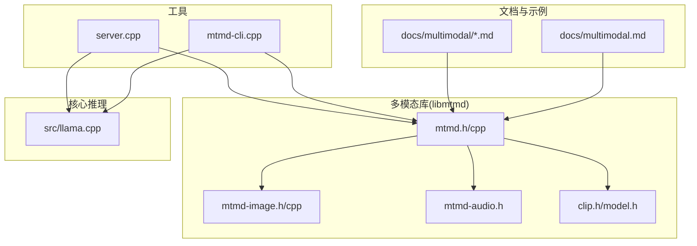
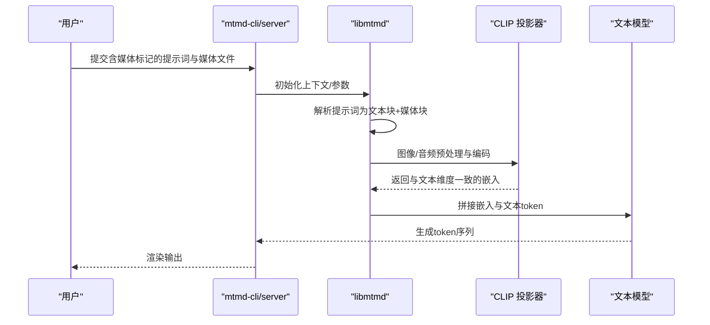
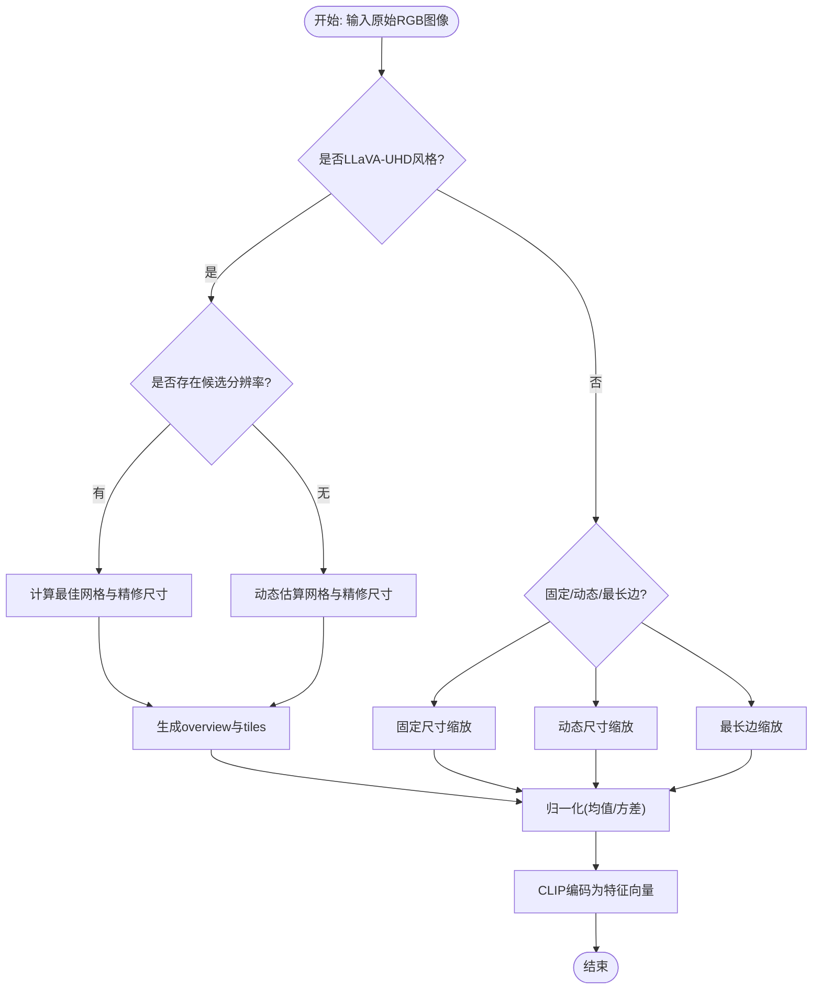
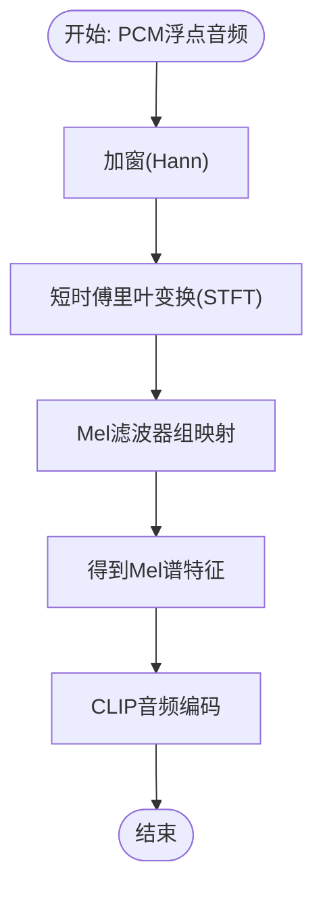
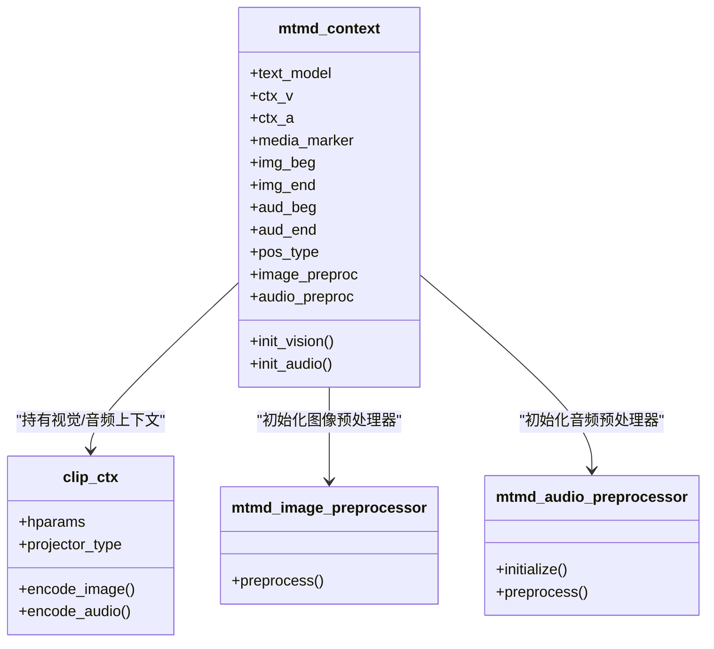
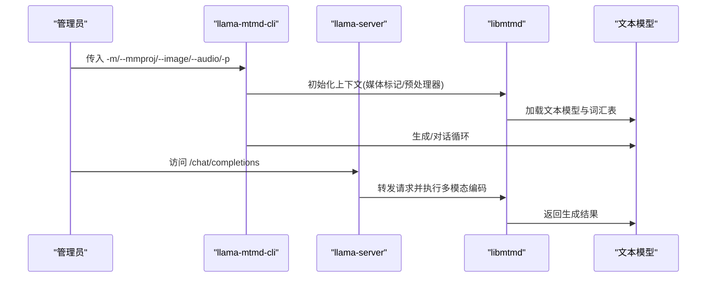
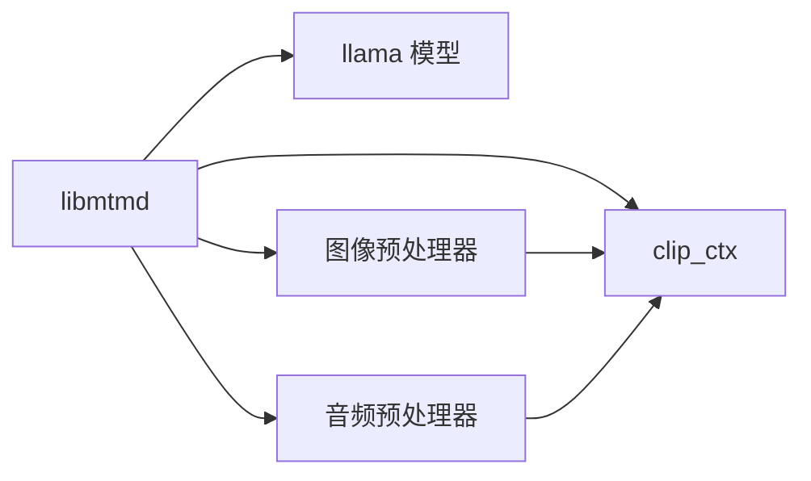

# 多模态处理

<cite>
**本文引用的文件**
- [multimodal.md](file://docs/multimodal.md)
- [minicpmv2.6.md](file://docs/multimodal/minicpmv2.6.md)
- [minicpmv4.0.md](file://docs/multimodal/minicpmv4.0.md)
- [minicpmv4.5.md](file://docs/multimodal/minicpmv4.5.md)
- [llava.md](file://docs/multimodal/llava.md)
- [mtmd.h](file://tools/mtmd/mtmd.h)
- [mtmd.cpp](file://tools/mtmd/mtmd.cpp)
- [mtmd-image.h](file://tools/mtmd/mtmd-image.h)
- [mtmd-image.cpp](file://tools/mtmd/mtmd-image.cpp)
- [mtmd-audio.h](file://tools/mtmd/mtmd-audio.h)
- [clip.h](file://tools/mtmd/clip.h)
- [clip-model.h](file://tools/mtmd/clip-model.h)
- [mtmd-cli.cpp](file://tools/mtmd/mtmd-cli.cpp)
- [server.cpp](file://tools/server/server.cpp)
- [llama.cpp](file://src/llama.cpp)
</cite>

## 目录
1. [简介](#简介)
2. [项目结构](#项目结构)
3. [核心组件](#核心组件)
4. [架构总览](#架构总览)
5. [详细组件分析](#详细组件分析)
6. [依赖关系分析](#依赖关系分析)
7. [性能考虑](#性能考虑)
8. [故障排查指南](#故障排查指南)
9. [结论](#结论)
10. [附录](#附录)

## 简介
本文件系统性梳理 llama.cpp 的多模态（图像、音频）处理能力与实现机制，覆盖以下方面：
- 图像处理：视觉编码器、图像预处理与特征提取
- 音频处理：语音识别、音频编码与声学特征
- 视频处理：当前仓库未实现视频编码/解码，仅在模型转换脚本中对视频相关张量做了跳过处理
- 多模态融合：特征对齐、注意力机制与跨模态交互
- 模型加载与推理流程：从模型到投影器再到文本生成的端到端过程
- 实际应用示例与配置：CLI 与服务端用法、参数与提示词模板
- 服务器部署与使用：HTTP 接口、路由与代理
- 性能优化与资源管理：GPU offload、线程与批处理、内存与显存

## 项目结构
llama.cpp 的多模态能力由独立的 libmtmd 库与工具链共同组成，主要涉及：
- 文档与示例：docs/multimodal 下的各模型使用说明
- 多模态库：tools/mtmd/* 提供 C/C++ API、图像/音频预处理、CLIP 投影器封装
- 服务器与 CLI：tools/server 与 tools/mtmd/mtmd-cli 提供 HTTP 与命令行入口
- 核心推理：src/llama.cpp 提供基础模型加载与推理接口

**图表来源**
- [mtmd.h:1-333](file://tools/mtmd/mtmd.h#L1-L333)
- [mtmd.cpp:1-800](file://tools/mtmd/mtmd.cpp#L1-L800)
- [mtmd-image.h:1-180](file://tools/mtmd/mtmd-image.h#L1-L180)
- [mtmd-image.cpp:1-800](file://tools/mtmd/mtmd-image.cpp#L1-L800)
- [mtmd-audio.h:1-124](file://tools/mtmd/mtmd-audio.h#L1-L124)
- [clip.h:1-119](file://tools/mtmd/clip.h#L1-L119)
- [clip-model.h:1-532](file://tools/mtmd/clip-model.h#L1-L532)
- [mtmd-cli.cpp:1-200](file://tools/mtmd/mtmd-cli.cpp#L1-L200)
- [server.cpp:1-200](file://tools/server/server.cpp#L1-L200)
- [llama.cpp:1-200](file://src/llama.cpp#L1-L200)

**章节来源**
- [multimodal.md:1-145](file://docs/multimodal.md#L1-L145)
- [mtmd.h:1-333](file://tools/mtmd/mtmd.h#L1-L333)
- [mtmd.cpp:1-800](file://tools/mtmd/mtmd.cpp#L1-L800)
- [mtmd-image.h:1-180](file://tools/mtmd/mtmd-image.h#L1-L180)
- [mtmd-image.cpp:1-800](file://tools/mtmd/mtmd-image.cpp#L1-L800)
- [mtmd-audio.h:1-124](file://tools/mtmd/mtmd-audio.h#L1-L124)
- [clip.h:1-119](file://tools/mtmd/clip.h#L1-L119)
- [clip-model.h:1-532](file://tools/mtmd/clip-model.h#L1-L532)
- [mtmd-cli.cpp:1-200](file://tools/mtmd/mtmd-cli.cpp#L1-L200)
- [server.cpp:1-200](file://tools/server/server.cpp#L1-L200)
- [llama.cpp:1-200](file://src/llama.cpp#L1-L200)

## 核心组件
- libmtmd 上下文与令牌化
  - mtmd_context：封装视觉/音频投影器上下文、媒体标记、分片模板、位置类型等
  - mtmd_tokenize：将文本与图像/音频位图组合为有序输入块（chunks），支持媒体标记替换与边界符插入
- 图像预处理管线
  - 固定尺寸、动态尺寸、最长边缩放、LLaVA-UHD 切片（overview + tiles）、特定模型定制（MiniCPM-V、IDEFICS3、InternVL、Step3VL 等）
- 音频预处理管线
  - Whisper Mel 谱、Conformer 特征、Gemma4A 声学特征；支持流式 ISTFT
- CLIP 投影器与编码
  - clip_ctx：封装视觉/音频编码器、投影层、输出维度一致性校验
  - clip_image_encode / clip_image_batch_encode：将图像批次编码为向量
- 服务器与 CLI
  - 通过 OpenAI 兼容接口提供聊天补全；CLI 支持本地图片/音频与提示词

**章节来源**
- [mtmd.h:53-254](file://tools/mtmd/mtmd.h#L53-L254)
- [mtmd.cpp:139-598](file://tools/mtmd/mtmd.cpp#L139-L598)
- [mtmd-image.h:11-180](file://tools/mtmd/mtmd-image.h#L11-L180)
- [mtmd-image.cpp:568-800](file://tools/mtmd/mtmd-image.cpp#L568-L800)
- [mtmd-audio.h:53-124](file://tools/mtmd/mtmd-audio.h#L53-L124)
- [clip.h:35-119](file://tools/mtmd/clip.h#L35-L119)
- [clip-model.h:38-142](file://tools/mtmd/clip-model.h#L38-L142)
- [mtmd-cli.cpp:68-176](file://tools/mtmd/mtmd-cli.cpp#L68-L176)
- [server.cpp:74-200](file://tools/server/server.cpp#L74-L200)

## 架构总览
多模态处理的总体数据流如下：
- 输入阶段：用户在提示词中插入媒体标记，libmtmd 将其拆分为文本块与媒体块
- 预处理阶段：根据模型类型选择合适的图像/音频预处理器，生成 patch 或 Mel 特征批次
- 编码阶段：调用 CLIP 投影器将图像/音频编码为与文本嵌入维度一致的向量
- 融合阶段：将图像/音频嵌入与文本 token 按顺序拼接，传入主语言模型进行解码与生成
- 输出阶段：采样器生成 token，最终渲染为自然语言回答

**图表来源**
- [mtmd.cpp:615-720](file://tools/mtmd/mtmd.cpp#L615-L720)
- [clip.h:102-119](file://tools/mtmd/clip.h#L102-L119)
- [mtmd-cli.cpp:178-200](file://tools/mtmd/mtmd-cli.cpp#L178-L200)

**章节来源**
- [mtmd.cpp:615-720](file://tools/mtmd/mtmd.cpp#L615-L720)
- [clip.h:102-119](file://tools/mtmd/clip.h#L102-L119)
- [mtmd-cli.cpp:178-200](file://tools/mtmd/mtmd-cli.cpp#L178-L200)

## 详细组件分析

### 图像处理模块
- 预处理策略
  - 固定尺寸：直接缩放到模型期望分辨率
  - 动态尺寸：按最长边或像素范围对齐，保持纵横比
  - LLaVA-UHD 切片：先生成 overview，再按网格切分为 tiles，支持 pinpoints（候选分辨率）与自适应网格
  - 特定模型定制：MiniCPM-V、IDEFICS3、InternVL、Step3VL、Yasu2、Gemma3/Gemma3n、GLM4V、DeepSeekOCR/HunyuanOCR 等
- 位置与对齐
  - 支持普通 RoPE 与 M-RoPE（Qwen-VL 风格），用于为图像 token 分配空间位置
  - 不同模型采用不同的边界符（如“<start_of_image>”、“<|image_start|>”等）插入到文本中
- 批处理与缓存
  - clip_image_f32_batch 存储多个图像的 patch 特征，便于批量编码
  - 预处理器内部维护均值/方差归一化参数与 resize 算法

**图表来源**
- [mtmd-image.cpp:568-800](file://tools/mtmd/mtmd-image.cpp#L568-L800)
- [mtmd-image.h:43-180](file://tools/mtmd/mtmd-image.h#L43-L180)
- [clip-model.h:38-142](file://tools/mtmd/clip-model.h#L38-L142)

**章节来源**
- [mtmd-image.h:11-180](file://tools/mtmd/mtmd-image.h#L11-L180)
- [mtmd-image.cpp:568-800](file://tools/mtmd/mtmd-image.cpp#L568-L800)
- [clip-model.h:38-142](file://tools/mtmd/clip-model.h#L38-L142)

### 音频处理功能
- 预处理与特征
  - Whisper：Mel 谱构建、Hann 窗、Sin/Cos 表缓存
  - Conformer：流式特征提取（LFM2）
  - Gemma4A：专用声学特征
- 流式 ISTFT
  - 支持逐帧 STFT 反变换，带重叠相加与窗函数和
- 采样率与窗口
  - 由模型超参决定（n_mel、n_fft、hop_len、sample_rate 等）

**图表来源**
- [mtmd-audio.h:63-124](file://tools/mtmd/mtmd-audio.h#L63-L124)
- [clip.h:113-119](file://tools/mtmd/clip.h#L113-L119)

**章节来源**
- [mtmd-audio.h:53-124](file://tools/mtmd/mtmd-audio.h#L53-L124)
- [clip.h:113-119](file://tools/mtmd/clip.h#L113-L119)

### 视频处理能力
- 当前状态
  - 代码库未实现视频编码/解码与时间步建模
  - 在模型转换脚本中明确跳过了与视频相关的张量，表明视频尚未作为多模态输入被支持
- 影响
  - 视频输入无法直接接入现有管线；若需视频能力，需扩展 CLIP 投影器与时间维度编码

**章节来源**
- [convert_hf_to_gguf.py:4490-4490](file://convert_hf_to_gguf.py#L4490-L4490)

### 多模态融合策略
- 特征对齐
  - 通过 mmproj 维度一致性校验确保图像/音频嵌入与文本嵌入维度一致
- 注意力机制
  - 支持 Flash Attention 类型传递至 CLIP
  - M-RoPE 与普通 RoPE 的位置编码差异影响图像 token 的空间位置分配
- 跨模态交互
  - 通过媒体标记插入边界符（如“<start_of_image>”、“<|image_start|>”等），将图像/音频嵌入无缝拼接到文本序列中
  - 部分模型（如 MiniCPM-V、IDEFICS3、Step3VL）引入分片/切片模板，以更精细地组织空间布局

**图表来源**
- [mtmd.cpp:139-598](file://tools/mtmd/mtmd.cpp#L139-L598)
- [clip.h:45-119](file://tools/mtmd/clip.h#L45-L119)
- [mtmd-image.h:12-22](file://tools/mtmd/mtmd-image.h#L12-L22)
- [mtmd-audio.h:53-61](file://tools/mtmd/mtmd-audio.h#L53-L61)

**章节来源**
- [mtmd.cpp:139-598](file://tools/mtmd/mtmd.cpp#L139-L598)
- [clip.h:45-119](file://tools/mtmd/clip.h#L45-L119)
- [mtmd-image.h:12-22](file://tools/mtmd/mtmd-image.h#L12-L22)
- [mtmd-audio.h:53-61](file://tools/mtmd/mtmd-audio.h#L53-L61)

### 多模态模型加载与推理流程
- CLI 加载与运行
  - 通过 -m 与 --mmproj 指定文本模型与投影器；或使用 -hf 自动下载
  - 支持 --no-mmproj-offload 关闭投影器 GPU offload
  - 支持 --image/--audio 与 -p 提示词；未提供媒体时进入对话模式
- 服务器加载与路由
  - 支持 /chat/completions 等 OpenAI 兼容接口
  - 路由模式可代理到不同模型实例，统一暴露公共端点

**图表来源**
- [mtmd-cli.cpp:40-176](file://tools/mtmd/mtmd-cli.cpp#L40-L176)
- [server.cpp:172-200](file://tools/server/server.cpp#L172-L200)
- [multimodal.md:9-32](file://docs/multimodal.md#L9-L32)

**章节来源**
- [mtmd-cli.cpp:40-176](file://tools/mtmd/mtmd-cli.cpp#L40-L176)
- [server.cpp:172-200](file://tools/server/server.cpp#L172-L200)
- [multimodal.md:9-32](file://docs/multimodal.md#L9-L32)

### 实际应用示例与配置
- CLI 示例
  - 使用 Hugging Face 预量化模型：-hf ggml-org/gemma-3-4b-it-GGUF
  - 指定本地模型与 mmproj：-m gemma-3-4b-it-Q4_K_M.gguf --mmproj mmproj-gemma-3-4b-it-Q4_K_M.gguf
  - 禁用 GPU offload：--no-mmproj-offload
- 服务器示例
  - 启动后通过 /chat/completions 提供多模态聊天补全
- 模型与提示词模板
  - LLaVA 使用 vicuna 模板；MobileVLM 使用 deepseek 模板；Mistral Small 使用 mistral-v7 模板

**章节来源**
- [multimodal.md:18-32](file://docs/multimodal.md#L18-L32)
- [llava.md:13-26](file://docs/multimodal/llava.md#L13-L26)
- [llava.md:127-130](file://docs/multimodal/llava.md#L127-L130)
- [mtmd-cli.cpp:108-129](file://tools/mtmd/mtmd-cli.cpp#L108-L129)

### 多模态服务器部署与使用
- 路由与代理
  - 路由模式下，/models/load 与 /models/unload 用于动态加载/卸载模型
  - 所有请求通过代理转发到具体模型实例
- OpenAI 兼容接口
  - /chat/completions、/v1/chat/completions、/v1/audio/transcriptions 等
- 错误处理
  - 统一封装异常为错误响应，返回 JSON 错误体

**章节来源**
- [server.cpp:130-200](file://tools/server/server.cpp#L130-L200)

## 依赖关系分析
- 组件耦合
  - mtmd_context 依赖 clip_ctx（视觉/音频）、预处理器、文本模型
  - 预处理器与 clip_hparams 紧密耦合，决定图像/音频处理策略
- 外部依赖
  - ggml 后端与调度器用于张量计算与 GPU offload
  - 服务器基于 HTTP 路由与异步处理

**图表来源**
- [mtmd.cpp:139-256](file://tools/mtmd/mtmd.cpp#L139-L256)
- [clip.h:45-119](file://tools/mtmd/clip.h#L45-L119)
- [clip-model.h:292-532](file://tools/mtmd/clip-model.h#L292-L532)

**章节来源**
- [mtmd.cpp:139-256](file://tools/mtmd/mtmd.cpp#L139-L256)
- [clip.h:45-119](file://tools/mtmd/clip.h#L45-L119)
- [clip-model.h:292-532](file://tools/mtmd/clip-model.h#L292-L532)

## 性能考虑
- GPU offload
  - 默认启用投影器 GPU offload；可通过 --no-mmproj-offload 关闭
  - 支持 Flash Attention 类型传递至 CLIP，提升注意力计算效率
- 线程与批处理
  - 通过 n_threads 控制 CPU 线程数；服务器模式支持并行与统一 KV
- 内存与显存
  - 动态图像尺寸与最大 token 数限制可减少显存占用
  - 预热（warmup）设置避免首次加载 OOM

**章节来源**
- [mtmd.cpp:122-137](file://tools/mtmd/mtmd.cpp#L122-L137)
- [clip-model.h:112-126](file://tools/mtmd/clip-model.h#L112-L126)
- [server.cpp:95-100](file://tools/server/server.cpp#L95-L100)

## 故障排查指南
- 常见问题
  - 投影器维度不匹配：文本模型嵌入维度与 mmproj 不一致会抛出异常
  - 视觉/音频投影器缺失：当只加载一种模态时，另一种上下文为空
  - 媒体标记数量与位图数量不一致：会返回错误码
  - 预处理失败：图像尺寸或格式不符合要求
- 定位手段
  - 启用调试回调（MTMD_DEBUG_GRAPH）观察计算图
  - 查看日志输出与错误码
  - 检查模型与 mmproj 是否匹配、媒体标记是否正确

**章节来源**
- [mtmd.cpp:223-249](file://tools/mtmd/mtmd.cpp#L223-L249)
- [mtmd.cpp:644-687](file://tools/mtmd/mtmd.cpp#L644-L687)
- [mtmd.cpp:748-752](file://tools/mtmd/mtmd.cpp#L748-L752)

## 结论
llama.cpp 的多模态能力以 libmtmd 为核心，围绕 CLIP 投影器实现了图像与音频的端到端处理，并通过多种预处理策略适配不同模型架构。当前仓库未实现视频处理，但为未来扩展预留了接口与参数。结合服务器与 CLI 工具，用户可以快速集成多模态能力并进行推理与部署。

## 附录
- 模型与示例
  - Gemma 3、SmolVLM、Pixtral、Qwen-VL、InternVL、Llama-4、Moondream2、Gemma-4 等
  - LLaVA 1.5/1.6、MiniCPM-V 2.6/4/4.5 等
- 术语
  - mmproj：多模态投影器（将视觉/音频特征映射到文本嵌入空间）
  - M-RoPE：多维旋转位置编码，用于为图像 token 分配空间位置

**章节来源**
- [multimodal.md:51-145](file://docs/multimodal.md#L51-L145)
- [llava.md:1-144](file://docs/multimodal/llava.md#L1-L144)
- [minicpmv2.6.md:26-47](file://docs/multimodal/minicpmv2.6.md#L26-L47)
- [minicpmv4.0.md:26-47](file://docs/multimodal/minicpmv4.0.md#L26-L47)
- [minicpmv4.5.md:26-47](file://docs/multimodal/minicpmv4.5.md#L26-L47)