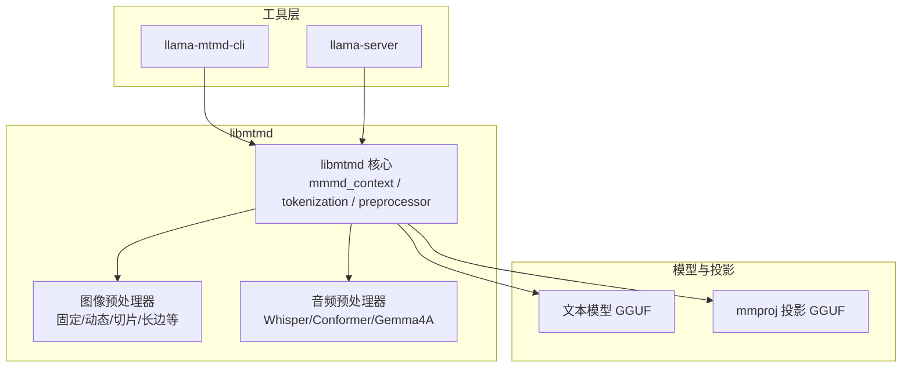
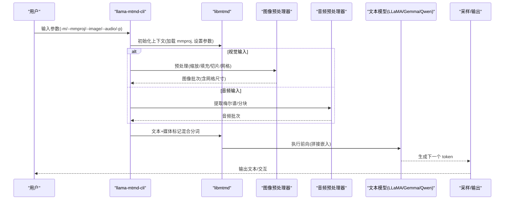
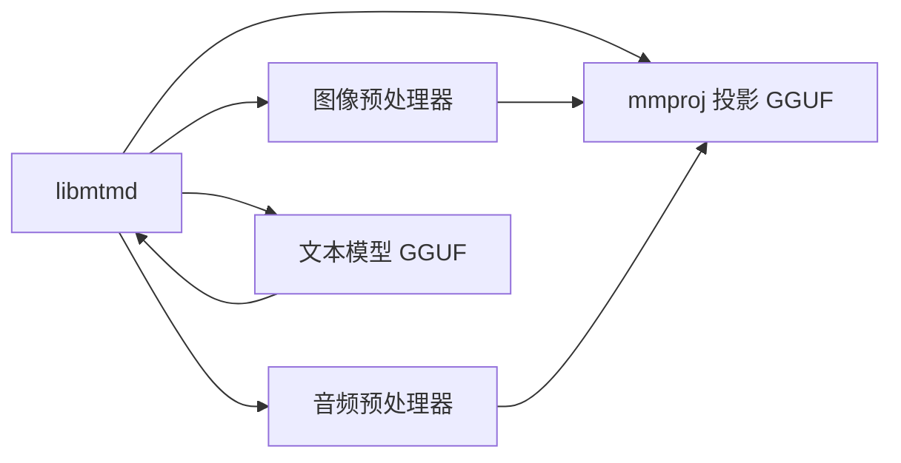
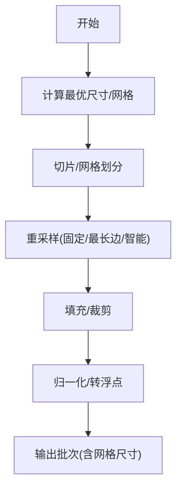
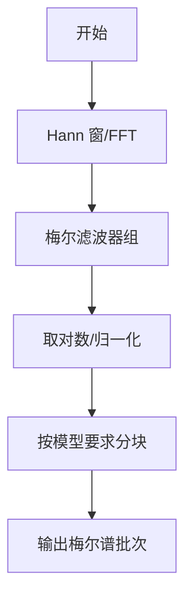
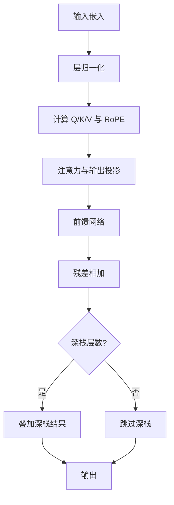

# 多模态模型

<cite>
**本文引用的文件**
- [multimodal.md](file://docs/multimodal.md)
- [llava.md](file://docs/multimodal/llava.md)
- [minicpmv4.0.md](file://docs/multimodal/minicpmv4.0.md)
- [minicpmv4.5.md](file://docs/multimodal/minicpmv4.5.md)
- [gemma3.md](file://docs/multimodal/gemma3.md)
- [README.md](file://tools/mtmd/README.md)
- [mtmd.cpp](file://tools/mtmd/mtmd.cpp)
- [mtmd-cli.cpp](file://tools/mtmd/mtmd-cli.cpp)
- [mtmd-image.cpp](file://tools/mtmd/mtmd-image.cpp)
- [mtmd-audio.cpp](file://tools/mtmd/mtmd-audio.cpp)
- [qwen3vl.cpp](file://src/models/qwen3vl.cpp)
</cite>

## 目录
1. [简介](#简介)
2. [项目结构](#项目结构)
3. [核心组件](#核心组件)
4. [架构总览](#架构总览)
5. [详细组件分析](#详细组件分析)
6. [依赖关系分析](#依赖关系分析)
7. [性能考量](#性能考量)
8. [故障排查指南](#故障排查指南)
9. [结论](#结论)
10. [附录](#附录)

## 简介
本文件系统性梳理 llama.cpp 的多模态能力，覆盖图像与音频输入、主流模型适配（如 LLaVA、MiniCPM-V、Qwen-VL/Gemmas、部分 OCR 模型等）、模型加载与初始化流程、配置参数与调优建议、模型文件格式与存储结构、模型选择与性能对比、实际应用案例与最佳实践，以及兼容性与版本管理要点。内容以仓库现有实现与文档为依据，避免臆测。

## 项目结构
llama.cpp 的多模态子系统由“通用多模态库 libmtmd”与“工具层”组成：
- libmtmd：统一处理图像/音频预处理、mmproj 投影器初始化、文本与媒体混合分词、KV 缓存与推理集成。
- 工具层：
  - llama-mtmd-cli：统一的多模态命令行工具，支持多种模型族。
  - llama-server：通过 OpenAI 兼容接口提供多模态服务。
- 文档与示例：各模型族的使用说明与转换指南。

图示来源
- [README.md](file://tools/mtmd/README.md)
- [mtmd.cpp](file://tools/mtmd/mtmd.cpp)
- [mtmd-cli.cpp](file://tools/mtmd/mtmd-cli.cpp)

章节来源
- [multimodal.md](file://docs/multimodal.md)
- [README.md](file://tools/mtmd/README.md)

## 核心组件
- libmtmd 上下文与参数
  - 初始化时根据 mmproj 文件加载视觉/音频投影器，校验文本模型与 mmproj 维度一致；设置 GPU/offload、线程数、flash-attn 类型、热身等。
  - 针对不同投影器类型（如 Qwen2VL、MiniCPM-V、Gemma3 等）注入不同的边界标记与布局策略。
- 图像预处理管线
  - 固定尺寸、动态尺寸、多切片/多网格（LLaVA-uhd/MiniCPM-V/IDEFICS3/Step3VL/LFM2）等策略；支持最长边缩放、智能分辨率、填充与裁剪、多算法重采样。
- 音频预处理管线
  - 基于 FFT/IFFT 的梅尔谱提取、Hann 窗、滤波器组、分块与归一化；支持 Whisper、Conformer、Gemma4A 等不同范式。
- 统一分词与嵌入拼接
  - 将文本与图像/音频嵌入按媒体标记插入，生成混合 token 序列，驱动后续解码。

章节来源
- [mtmd.cpp](file://tools/mtmd/mtmd.cpp)
- [mtmd-image.cpp](file://tools/mtmd/mtmd-image.cpp)
- [mtmd-audio.cpp](file://tools/mtmd/mtmd-audio.cpp)

## 架构总览
下面的序列图展示了从命令行到推理的关键调用链路，涵盖 mmproj 加载、图像/音频预处理、文本与媒体混合分词、KV 推理与采样输出。

图示来源
- [mtmd-cli.cpp](file://tools/mtmd/mtmd-cli.cpp)
- [mtmd.cpp](file://tools/mtmd/mtmd.cpp)
- [mtmd-image.cpp](file://tools/mtmd/mtmd-image.cpp)
- [mtmd-audio.cpp](file://tools/mtmd/mtmd-audio.cpp)

## 详细组件分析

### LLaVA 系列
- 支持范围
  - v1.5 与 v1.6 变体；提供预转换 GGUF 与转换脚本。
- 使用方式
  - 通过 llama-mtmd-cli 或服务器模式运行；需显式指定 mmproj；可选 Vicuna 聊天模板。
- 关键差异
  - v1.6 需要更大上下文窗口；在多提示批处理上收益明显；可通过“切片/瓦片”风格布局插入特殊标记。
- 推荐参数
  - 温度较低（如 0.1）以提升质量；GPU offload 使用 -ngl；上下文至少 3000（v1.6）。

章节来源
- [llava.md](file://docs/multimodal/llava.md)
- [multimodal.md](file://docs/multimodal.md)

### MiniCPM-V 系列
- 支持范围
  - 2.5/2.6/4/4.5 等版本；通过专用转换脚本拆分与导出 mmproj。
- 使用方式
  - 通过 llama-mtmd-cli 运行；单轮或多轮对话；支持媒体标记插入。
- 关键差异
  - 采用“概览图+切片/瓦片”的布局，边界标记与行尾控制较为复杂；不同版本号对应不同模板。
- 推荐参数
  - 合理设置上下文长度（如 4096）；温度与采样策略视任务而定。

章节来源
- [minicpmv4.0.md](file://docs/multimodal/minicpmv4.0.md)
- [minicpmv4.5.md](file://docs/multimodal/minicpmv4.5.md)
- [multimodal.md](file://docs/multimodal.md)

### Qwen-VL/Gemma 系列
- Gemma 3 视觉
  - 提供预量化模型；mmproj 可通过转换脚本生成；支持固定尺寸与动态尺寸布局。
- Qwen2/Qwen2.5/Qwen3-VL
  - 通过 mmproj 与文本模型配合；采用特定边界标记包裹嵌入；支持动态尺寸与网格布局。
- 推荐参数
  - 使用 mmproj offload 到 GPU；根据模型大小调整上下文与批大小。

章节来源
- [gemma3.md](file://docs/multimodal/gemma3.md)
- [multimodal.md](file://docs/multimodal.md)

### 音频与多模态融合
- 当前状态
  - 音频输入处于实验阶段，质量可能不如图像输入稳定。
- 支持范式
  - Whisper 风格（Qwen2A/Qwen3A/ULTRAVOX/Voxtral 等）
  - Conformer（LFM2A）
  - Gemma4A 特定梅尔谱与分块策略
- 推荐参数
  - 合理设置采样率、窗长、hop、梅尔 bins；必要时进行分块与归一化。

章节来源
- [README.md](file://tools/mtmd/README.md)
- [mtmd-audio.cpp](file://tools/mtmd/mtmd-audio.cpp)

### 模型加载与初始化流程
- 参数与开关
  - -m 指定文本模型 GGUF；--mmproj 指定 mmproj；--no-mmproj-offload 禁用 GPU offload；--mmproj-offload 等。
  - -hf 可直接使用 Hugging Face 仓库名，自动下载并加载。
- 初始化步骤
  - 校验 mmproj 与文本模型维度一致性；
  - 识别投影器类型，注入相应边界标记与布局策略；
  - 初始化图像/音频预处理器，准备热身与线程参数；
  - 在聊天或单轮模式下完成混合分词与前向执行。

章节来源
- [multimodal.md](file://docs/multimodal.md)
- [mtmd.cpp](file://tools/mtmd/mtmd.cpp)
- [mtmd-cli.cpp](file://tools/mtmd/mtmd-cli.cpp)

### 配置参数与调优建议
- 通用参数
  - 线程数、GPU offload、flash-attn 类型、最小/最大图像 token 数、热身开关。
- 图像侧
  - 重采样算法、填充颜色、最长边、智能分辨率、网格尺寸；切片/瓦片布局与边界标记。
- 音频侧
  - 采样率、窗长、hop、梅尔 bins、是否中心填充、是否归一化、是否使用自然对数。
- 推荐实践
  - 小模型/低显存：禁用 mmproj offload 或降低图像分辨率；增大上下文时注意 OOM。
  - 高分辨率/多切片：确保投影器支持 pinpoints/grid；合理设置网格与边界标记。
  - 音频：按模型要求分块；Whisper 系列注意 3000 帧限制；Gemma4A 注意 30 秒分块与左/右填充。

章节来源
- [mtmd.cpp](file://tools/mtmd/mtmd.cpp)
- [mtmd-image.cpp](file://tools/mtmd/mtmd-image.cpp)
- [mtmd-audio.cpp](file://tools/mtmd/mtmd-audio.cpp)

### 模型文件格式与存储结构
- 文本模型 GGUF
  - 存储权重、分词器、配置与元数据；用于常规语言建模。
- mmproj 投影 GGUF
  - 存储视觉/音频编码器与投影矩阵；与文本模型维度匹配；不同模型族有不同边界标记与布局。
- 存储位置与命名
  - 预量化模型通常位于 Hugging Face ggml-org 仓库；也可通过转换脚本生成本地 mmproj。

章节来源
- [multimodal.md](file://docs/multimodal.md)
- [README.md](file://tools/mtmd/README.md)

### 实际应用案例与最佳实践
- 单轮问答（图像）
  - 在提示中插入媒体标记，加载图片后一次性生成回答；适合快速验证。
- 对话式交互
  - 使用聊天模板与媒体命令（/image /audio），逐步追加媒体与历史。
- 多模态融合
  - 音频+图像+文本组合；注意 mmproj 维度一致与边界标记正确插入。
- OCR 场景
  - 部分 OCR 模型需要特定提示结构与边界标记；参考仓库讨论链接。

章节来源
- [multimodal.md](file://docs/multimodal.md)
- [mtmd-cli.cpp](file://tools/mtmd/mtmd-cli.cpp)

### 模型选择指南与性能对比
- 选择依据
  - 输入模态：仅图像/仅音频/图文/音视频；
  - 模型族：LLaVA（v1.5/v1.6）、MiniCPM-V（2.5/2.6/4/4.5）、Qwen-VL/Gemma 系列、部分 OCR。
- 性能特征
  - 图像侧：高分辨率与多切片显著增加计算量；GPU offload 能提升吞吐。
  - 音频侧：Whisper 分块与梅尔谱计算成本较高；分块策略影响延迟与质量。
  - 文本侧：上下文长度与批大小直接影响显存占用与速度。

章节来源
- [multimodal.md](file://docs/multimodal.md)
- [mtmd-image.cpp](file://tools/mtmd/mtmd-image.cpp)
- [mtmd-audio.cpp](file://tools/mtmd/mtmd-audio.cpp)

## 依赖关系分析
- 组件耦合
  - libmtmd 与 mmproj 投影器强耦合（边界标记、布局策略）；与文本模型通过维度一致性约束耦合。
  - 图像/音频预处理器与投影器类型强相关；不同模型族采用不同预处理策略。
- 外部依赖
  - 音频路径依赖 FFT/IFFT 与滤波器组；图像路径依赖重采样与填充策略。
- 潜在风险
  - mmproj 与文本模型维度不一致会触发初始化错误；
  - 不同模型族的媒体标记与布局不一致可能导致 token 插入异常。

图示来源
- [mtmd.cpp](file://tools/mtmd/mtmd.cpp)

章节来源
- [mtmd.cpp](file://tools/mtmd/mtmd.cpp)

## 性能考量
- 计算热点
  - 图像：重采样、填充、切片/网格划分、投影器前向；
  - 音频：FFT/IFFT、梅尔滤波器组、分块与拼接。
- 内存占用
  - 高分辨率与多切片显著增加中间张量内存；建议在受限设备上降低分辨率或关闭 offload。
- 并发与吞吐
  - 合理设置线程数与批大小；音频分块有助于控制单次计算规模。
- 上下文与窗口
  - 部分模型（如 LLaVA-1.6、MiniCPM-V）需要较大上下文；注意 OOM 风险。

## 故障排查指南
- 常见错误
  - “未找到视觉/音频输入支持”：确认 mmproj 是否为对应模态；检查投影器类型。
  - “维度不匹配”：检查 mmproj 与文本模型 n_embd 是否一致；确认使用了正确的 mmproj。
  - “媒体数量与标记不匹配”：确保提示中媒体标记数量与图片/音频数量一致。
  - “空音频/样本不足”：音频预处理要求最小样本长度；必要时进行填充。
- 定位手段
  - 开启调试回调与计时打印；
  - 分离测试图像/音频预处理与文本分词阶段；
  - 使用小分辨率与短上下文快速复现问题。

章节来源
- [mtmd.cpp](file://tools/mtmd/mtmd.cpp)
- [mtmd-cli.cpp](file://tools/mtmd/mtmd-cli.cpp)
- [mtmd-audio.cpp](file://tools/mtmd/mtmd-audio.cpp)

## 结论
llama.cpp 的多模态能力通过 libmtmd 实现统一抽象，覆盖图像与音频两大模态，并针对多个主流模型族提供了差异化预处理与布局策略。实践中应重点关注 mmproj 与文本模型的维度一致性、媒体标记与布局的正确性、以及图像/音频预处理的参数调优。对于音频输入，当前仍处于实验阶段，建议谨慎使用并关注质量与稳定性。

## 附录

### 关键流程：图像预处理（LLaVA-uhd/MiniCPM-V/IDEFICS3/Step3VL/LFM2）

图示来源
- [mtmd-image.cpp](file://tools/mtmd/mtmd-image.cpp)

### 关键流程：音频预处理（Whisper/Conformer/Gemma4A）

图示来源
- [mtmd-audio.cpp](file://tools/mtmd/mtmd-audio.cpp)

### 关键流程：Qwen3-VL 深栈（Deepstack）构建

图示来源
- [qwen3vl.cpp](file://src/models/qwen3vl.cpp)