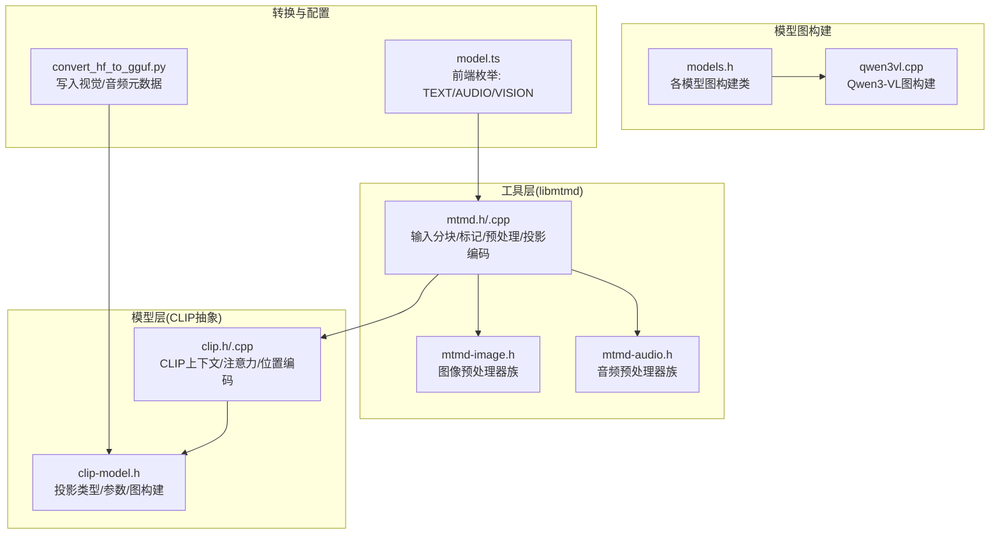
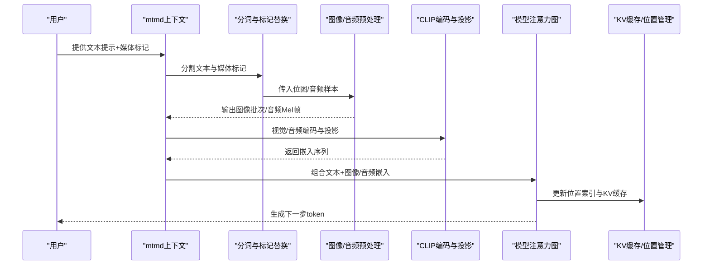
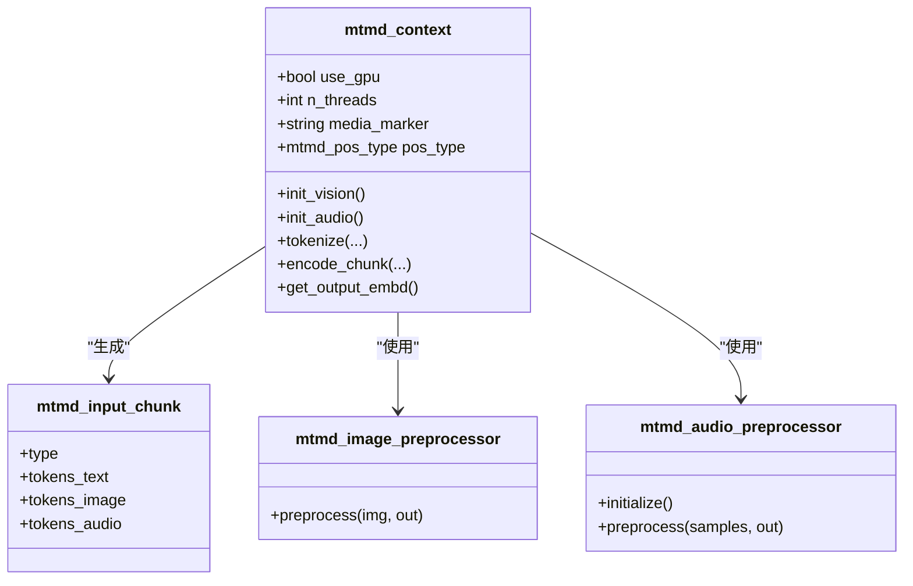
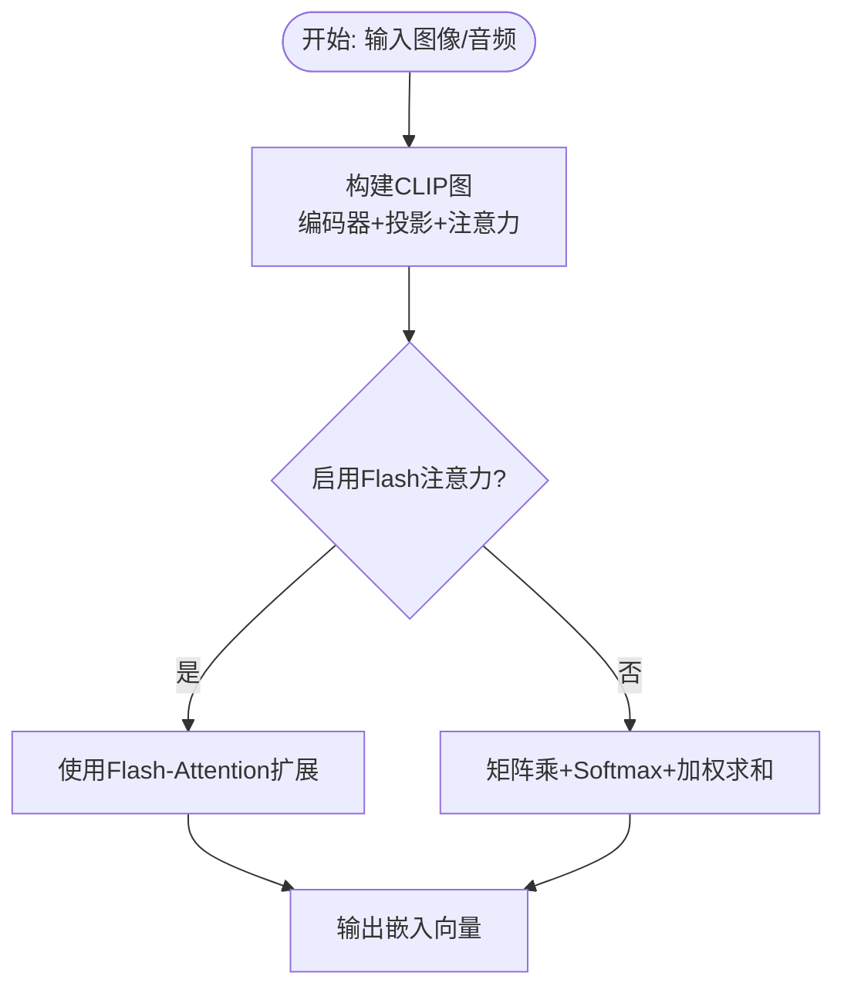
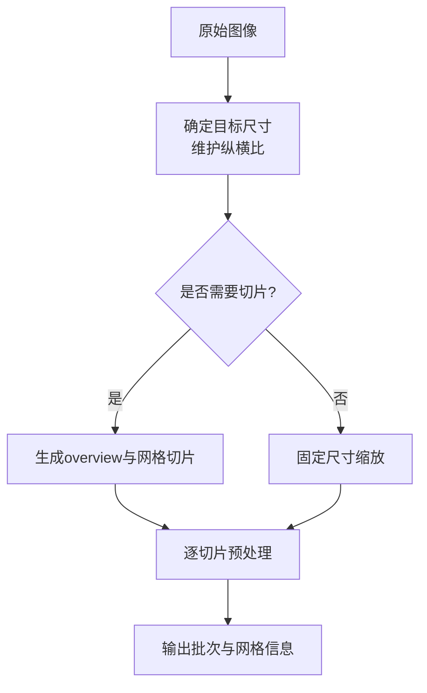
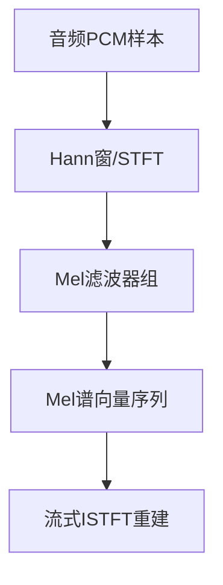
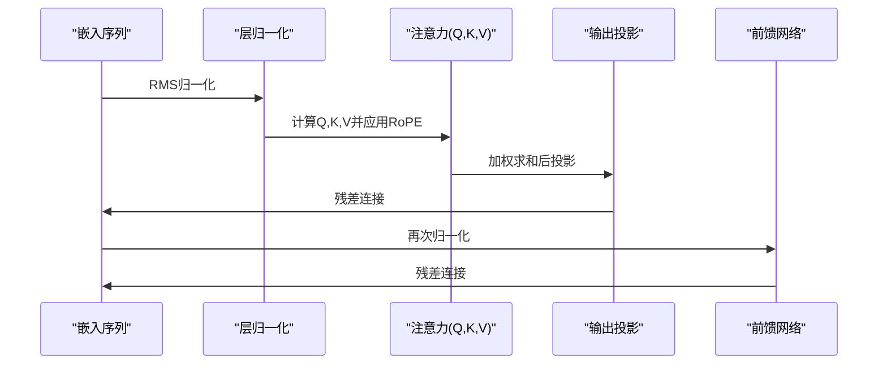
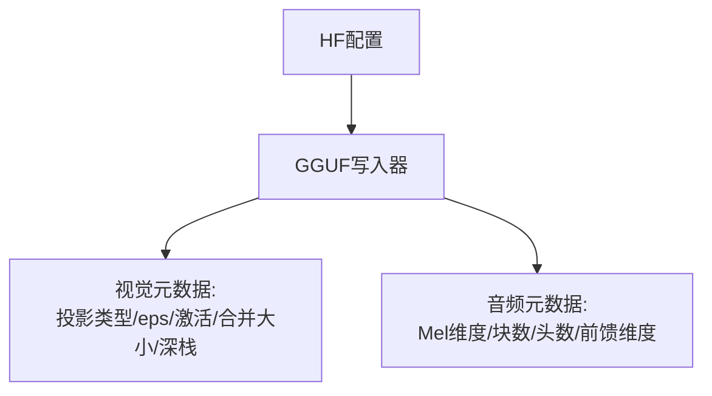
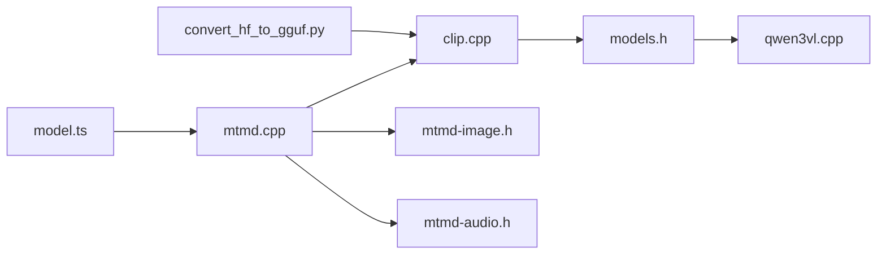

# 多模态融合

<cite>
**本文引用的文件**
- [multimodal.md](file://docs/multimodal.md)
- [mtmd.h](file://tools/mtmd/mtmd.h)
- [mtmd.cpp](file://tools/mtmd/mtmd.cpp)
- [clip.h](file://tools/mtmd/clip.h)
- [clip.cpp](file://tools/mtmd/clip.cpp)
- [mtmd-image.h](file://tools/mtmd/mtmd-image.h)
- [mtmd-audio.h](file://tools/mtmd/mtmd-audio.h)
- [qwen3vl.cpp](file://src/models/qwen3vl.cpp)
- [models.h](file://src/models/models.h)
- [model.ts](file://tools/server/webui/src/lib/enums/model.ts)
- [convert_hf_to_gguf.py](file://convert_hf_to_gguf.py)
</cite>

## 目录
1. [引言](#引言)
2. [项目结构](#项目结构)
3. [核心组件](#核心组件)
4. [架构总览](#架构总览)
5. [详细组件分析](#详细组件分析)
6. [依赖关系分析](#依赖关系分析)
7. [性能考量](#性能考量)
8. [故障排查指南](#故障排查指南)
9. [结论](#结论)
10. [附录](#附录)

## 引言
本文件系统性阐述 llama.cpp 的多模态融合技术与实现机制，覆盖图像与音频输入的预处理、投影与对齐、注意力机制（含跨模态交互）、架构设计（共享编码器与特定模态解码器）、推理流程与状态管理、配置参数与优化策略，并给出多模态对话、视觉问答等复杂场景的实践指引。内容基于仓库中 libmtmd、CLIP 抽象层、模型图构建以及转换脚本等关键实现进行归纳总结。

## 项目结构
llama.cpp 的多模态能力由“工具层”和“模型层”协同实现：
- 工具层（libmtmd）：负责多模态输入分块、标记替换、预处理、投影编码、输出嵌入获取与调度；支持图像与音频两类模态。
- 模型层（CLIP 抽象）：封装视觉/音频编码器、投影头、注意力计算、RoPE 扩展（如 M-RoPE）等。
- 模型图构建：针对具体多模态模型（如 Qwen3-VL）构建注意力与前馈网络，支持深度堆叠（DeepStack）等特性。
- 转换脚本：将 HuggingFace 模型转换为 GGUF 格式，写入视觉/音频投影类型、归一化参数、空间合并策略等元数据。

图表来源
- [mtmd.h:1-333](file://tools/mtmd/mtmd.h#L1-L333)
- [mtmd.cpp:1-800](file://tools/mtmd/mtmd.cpp#L1-L800)
- [clip.h:1-119](file://tools/mtmd/clip.h#L1-L119)
- [clip.cpp:1-800](file://tools/mtmd/clip.cpp#L1-L800)
- [mtmd-image.h:1-180](file://tools/mtmd/mtmd-image.h#L1-L180)
- [mtmd-audio.h:1-124](file://tools/mtmd/mtmd-audio.h#L1-L124)
- [models.h:545-551](file://src/models/models.h#L545-L551)
- [qwen3vl.cpp:1-123](file://src/models/qwen3vl.cpp#L1-L123)
- [convert_hf_to_gguf.py:2238-2263](file://convert_hf_to_gguf.py#L2238-L2263)
- [model.ts:1-5](file://tools/server/webui/src/lib/enums/model.ts#L1-L5)

章节来源
- [multimodal.md:1-145](file://docs/multimodal.md#L1-L145)
- [mtmd.h:1-333](file://tools/mtmd/mtmd.h#L1-L333)
- [clip.h:1-119](file://tools/mtmd/clip.h#L1-L119)

## 核心组件
- 多模态上下文（mtmd_context）
  - 统一管理视觉/音频 CLIP 上下文、文本模型维度一致性校验、媒体标记、切片模板（如 LLaVA-UHD、MiniCPM-V、IDEFICS3 等）、线程数与后端调度回调。
  - 支持动态分辨率与固定尺寸两种图像预处理路径，音频侧提供 Whisper/Conformer/Gemma4A 等多种预处理管线。
- CLIP 抽象（clip_ctx/clip_graph）
  - 封装视觉/音频编码器、投影头、注意力图构建、RoPE（含 M-RoPE）与位置嵌入插值、FFN 实现、Flash Attention 切换。
- 图像预处理器族（mtmd-image-preprocessor）
  - 固定尺寸、动态尺寸、最长边缩放、LLaVA-UHD 切片（含 MiniCPM-V/IDEFICS3/Step3VL/LFM2 定制逻辑）、YOYT-VL、GLM-OCR 等。
- 音频预处理器族（mtmd-audio-preprocessor）
  - Whisper 预处理（Mel 过滤、窗函数、STFT 缓存）、Conformer（语音编码器）、Streaming ISTFT。
- 模型图构建（llm_build_*）
  - 针对多模态模型（如 Qwen2-VL、Qwen3-VL、Qwen3-VL-MoE、LLaMA4 等）构建注意力、前馈、深度堆叠（DeepStack）等。

章节来源
- [mtmd.cpp:139-256](file://tools/mtmd/mtmd.cpp#L139-L256)
- [clip.cpp:142-226](file://tools/mtmd/clip.cpp#L142-L226)
- [mtmd-image.h:11-180](file://tools/mtmd/mtmd-image.h#L11-L180)
- [mtmd-audio.h:53-124](file://tools/mtmd/mtmd-audio.h#L53-L124)
- [models.h:533-551](file://src/models/models.h#L533-L551)

## 架构总览
多模态从“输入到推理”的整体链路如下：

图表来源
- [mtmd.cpp:637-692](file://tools/mtmd/mtmd.cpp#L637-L692)
- [clip.cpp:232-257](file://tools/mtmd/clip.cpp#L232-L257)
- [qwen3vl.cpp:36-104](file://src/models/qwen3vl.cpp#L36-L104)

## 详细组件分析

### 组件A：多模态上下文与输入分块
- 功能要点
  - 媒体标记替换：将提示中的媒体占位符替换为对应模态的起止标记与嵌入序列。
  - 文本/图像/音频三类输入块的组织与拼接，支持 BOS/EOS 自动注入。
  - 切片模板：针对 LLaVA-UHD、MiniCPM-V、IDEFICS3、Step3VL、LFM2 等定制布局与分隔符。
  - 位置类型：根据解码器 RoPE 类型选择普通位置或 M-RoPE 位置（t,x,y,z）。
- 关键接口
  - 初始化与参数：媒体标记、线程数、Flash Attention、最小/最大图像 token 数、回调。
  - 分词与分块：将文本与位图列表映射为输入块序列。
  - 编码与输出：获取投影后的嵌入缓冲区指针。

图表来源
- [mtmd.h:83-178](file://tools/mtmd/mtmd.h#L83-L178)
- [mtmd.cpp:139-256](file://tools/mtmd/mtmd.cpp#L139-L256)
- [mtmd-image.h:12-22](file://tools/mtmd/mtmd-image.h#L12-L22)
- [mtmd-audio.h:53-61](file://tools/mtmd/mtmd-audio.h#L53-L61)

章节来源
- [mtmd.h:53-178](file://tools/mtmd/mtmd.h#L53-L178)
- [mtmd.cpp:615-720](file://tools/mtmd/mtmd.cpp#L615-L720)

### 组件B：CLIP 抽象与注意力实现
- 功能要点
  - 视觉/音频编码器：统一通过 clip_ctx 管理后端（CPU/GPU）、调度器、Flash Attention 开关。
  - 注意力图构建：支持自注意力、Q/K 归一化、FFN（SiLU/GELU/GEGLU 等）、可选后归一化与残差。
  - 位置编码：支持常规 RoPE 与 M-RoPE（t,x,y），并提供位置嵌入插值以适配不同分辨率。
  - 投影头：按投影类型（MLP、Qwen-VL、Gemma3 等）构建，确保与文本嵌入维度一致。
- 关键接口
  - 编码与批量编码：单图/批图编码，返回向量。
  - 输出维度与 token 数：查询投影输出 token 数与 X/Y 方向 token 数。
  - 后端与调度：可设置评估回调，便于外部计时或监控。

图表来源
- [clip.cpp:294-501](file://tools/mtmd/clip.cpp#L294-L501)
- [clip.cpp:637-697](file://tools/mtmd/clip.cpp#L637-L697)

章节来源
- [clip.h:35-119](file://tools/mtmd/clip.h#L35-L119)
- [clip.cpp:142-226](file://tools/mtmd/clip.cpp#L142-L226)

### 组件C：图像预处理与多尺度切片
- 功能要点
  - 动态分辨率：按补丁大小与合并因子调整尺寸，保持纵横比，支持填充或裁剪。
  - 最长边策略：将最长边缩放到指定长度，其余边按比例缩放。
  - LLaVA-UHD 切片：根据候选分辨率选择最优网格，生成 overview 与多个 slice，支持不同模板（MiniCPM-V/IDEFICS3/Step3VL/LFM2）。
  - OCR 特化：针对 DeepseekOCR/HunyuanOCR 等模型的边界符与布局要求。
- 关键流程

图表来源
- [mtmd-image.h:43-89](file://tools/mtmd/mtmd-image.h#L43-L89)
- [mtmd-image.h:113-130](file://tools/mtmd/mtmd-image.h#L113-L130)
- [mtmd-image.h:132-140](file://tools/mtmd/mtmd-image.h#L132-L140)

章节来源
- [mtmd-image.h:24-89](file://tools/mtmd/mtmd-image.h#L24-L89)

### 组件D：音频预处理与流式重建
- 功能要点
  - Whisper 预处理：Mel 滤波器组、Hann 窗、STFT 缓存复用，支持多采样率与频率范围。
  - Conformer 预处理：面向 LFM2 音频编码器的定制流程。
  - 流式 ISTFT：按帧重建音频，支持重叠相加与窗口和归一化。
- 关键流程

图表来源
- [mtmd-audio.h:63-88](file://tools/mtmd/mtmd-audio.h#L63-L88)
- [mtmd-audio.h:93-123](file://tools/mtmd/mtmd-audio.h#L93-L123)

章节来源
- [mtmd-audio.h:12-88](file://tools/mtmd/mtmd-audio.h#L12-L88)

### 组件E：模型图构建与跨模态注意力
- 功能要点
  - Qwen3-VL 图构建：支持 Multi-RoPE（n_rot=4 段节），在注意力前对 Q/K 应用分段 RoPE；支持 DeepStack 层间残差叠加。
  - 注意力实现：支持 Flash Attention 与标准矩阵乘 Softmax 路径，Q/K 可分别归一化，输出经投影权重映射。
  - 前馈网络：支持 SiLU/GEGLU 等激活与并行 FFN 结构。
- 关键流程

图表来源
- [qwen3vl.cpp:36-104](file://src/models/qwen3vl.cpp#L36-L104)

章节来源
- [qwen3vl.cpp:1-123](file://src/models/qwen3vl.cpp#L1-L123)
- [models.h:545-551](file://src/models/models.h#L545-L551)

### 组件F：配置参数与元数据写入
- 功能要点
  - 视觉/音频投影类型：写入投影器类型（如 QWEN3VL、GEMMA3、ULTRAVOX 等）。
  - 归一化与激活：写入视觉注意力层归一化 eps、隐藏激活类型（SiLU/GELU）。
  - 空间合并与深栈：写入空间合并大小、深栈层数与标志。
  - 音频参数：Mel 维度、块数、头数、前馈维度等。
- 关键流程

图表来源
- [convert_hf_to_gguf.py:2238-2263](file://convert_hf_to_gguf.py#L2238-L2263)
- [convert_hf_to_gguf.py:4879-4896](file://convert_hf_to_gguf.py#L4879-L4896)

章节来源
- [convert_hf_to_gguf.py:2238-2263](file://convert_hf_to_gguf.py#L2238-L2263)

## 依赖关系分析
- 组件耦合
  - mtmd_context 依赖 clip_ctx（视觉/音频）、文本模型维度一致性检查、图像/音频预处理器。
  - clip_ctx 依赖 ggml 后端与调度器，内部通过 clip_graph 构建注意力与 FFN。
  - 模型图构建类（如 llm_build_qwen3vl）依赖 llama 模型参数与图构建基类。
- 外部集成点
  - WebUI 前端枚举支持 TEXT/AUDIO/VISION，驱动服务端多模态路由。
  - 转换脚本将 HF 模型元数据写入 GGUF，供推理加载。

图表来源
- [mtmd.cpp:1-800](file://tools/mtmd/mtmd.cpp#L1-L800)
- [clip.cpp:1-800](file://tools/mtmd/clip.cpp#L1-L800)
- [models.h:545-551](file://src/models/models.h#L545-L551)
- [qwen3vl.cpp:1-123](file://src/models/qwen3vl.cpp#L1-L123)
- [convert_hf_to_gguf.py:2238-2263](file://convert_hf_to_gguf.py#L2238-L2263)
- [model.ts:1-5](file://tools/server/webui/src/lib/enums/model.ts#L1-L5)

章节来源
- [models.h:533-551](file://src/models/models.h#L533-L551)

## 性能考量
- Flash Attention
  - 在 CLIP 与模型图构建中均可切换 Flash Attention，减少显存占用与提升吞吐，需注意精度设置与后端兼容性。
- 后端与调度
  - 支持自动选择 GPU/IGPU/CPU 后端，可设置评估回调用于计时与监控。
- 预处理与内存
  - 图像预处理尽量避免重复缩放与插值，音频预处理缓存窗函数与 Mel 滤波器矩阵，降低重复计算开销。
- 解码器位置管理
  - 对于 M-RoPE 模型，需正确传递 t/x/y/z 位置，避免 KV 缓存错位导致的性能退化。

## 故障排查指南
- 媒体标记不匹配
  - 错误：位图数量与媒体标记不一致；解决：确保提示中媒体标记与位图一一对应。
- 文本与投影维度不一致
  - 错误：文本模型嵌入维度与投影头输出不一致；解决：确认使用正确的 mmproj 文件或模型。
- 预处理失败
  - 错误：图像预处理返回失败；解决：检查输入位图尺寸与像素布局，确认预处理器类型匹配。
- 后端初始化失败
  - 错误：GPU 后端初始化失败回退 CPU；解决：检查环境变量 MTMD_BACKEND_DEVICE 或硬件可用性。
- 音频质量下降
  - 提示：音频输入处于实验阶段，质量可能不如预期；建议：优先使用 Whisper 预处理与标准采样率。

章节来源
- [mtmd.cpp:640-692](file://tools/mtmd/mtmd.cpp#L640-L692)
- [mtmd.cpp:223-250](file://tools/mtmd/mtmd.cpp#L223-L250)
- [clip.cpp:165-213](file://tools/mtmd/clip.cpp#L165-L213)

## 结论
llama.cpp 的多模态融合以 libmtmd 为核心，结合 CLIP 抽象与模型图构建，实现了对图像与音频的灵活接入与高效推理。通过多样化的预处理策略（动态分辨率、最长边、LLaVA-UHD 切片、OCR 特化）、可插拔的投影头与注意力实现（含 M-RoPE），以及完善的配置写入与运行时参数控制，系统能够覆盖从基础问答到复杂多模态对话的广泛场景。实践中应重点关注媒体标记一致性、维度匹配、后端调度与预处理缓存，以获得稳定且高性能的推理体验。

## 附录
- 使用与示例
  - CLI/服务器：参考文档中提供的命令示例，加载预量化模型或本地 mmproj 文件。
  - 多模态对话：在提示中插入媒体标记，libmtmd 会将其替换为对应的嵌入序列，随后进入标准解码流程。
  - 视觉问答：使用 Qwen3-VL/MiniCPM-V/IDEFICS3 等模型，结合切片模板与动态分辨率，提升高分辨率图像理解效果。
- 时序差异与信息互补
  - 图像/音频与文本的时序差异通过位置编码与 M-RoPE 解决；跨模态交互体现在注意力图构建与投影嵌入的拼接上，使文本生成同时考虑多源信息。

章节来源
- [multimodal.md:18-145](file://docs/multimodal.md#L18-L145)
- [qwen3vl.cpp:45-58](file://src/models/qwen3vl.cpp#L45-L58)