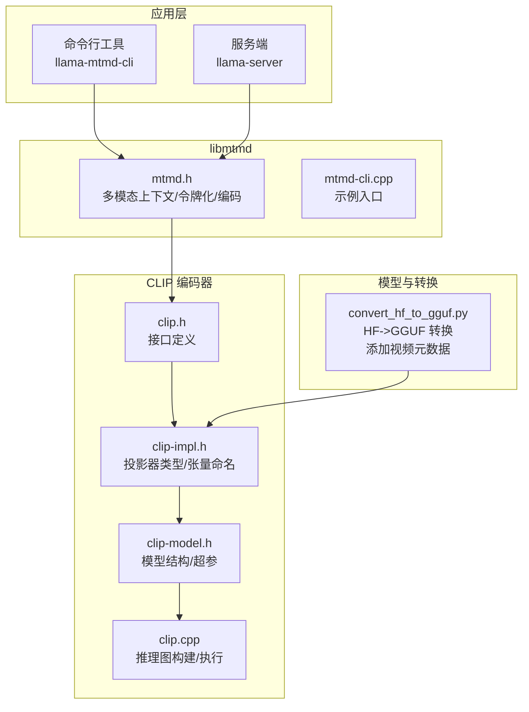
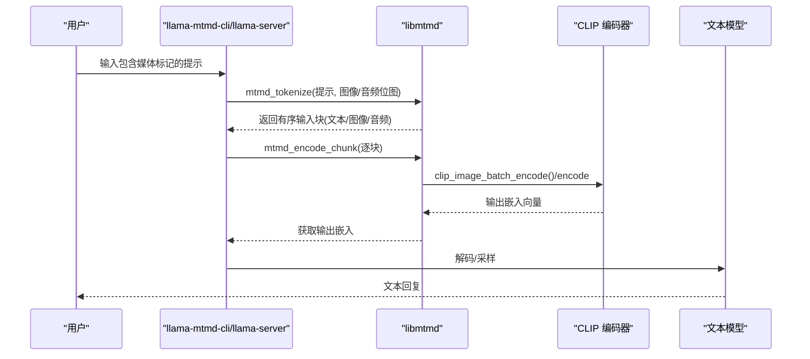
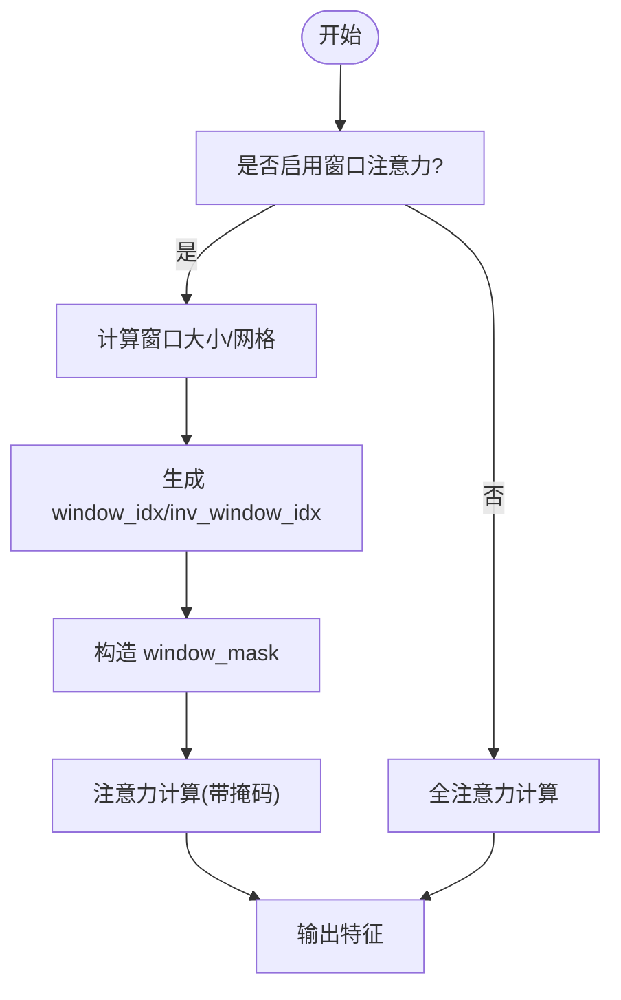
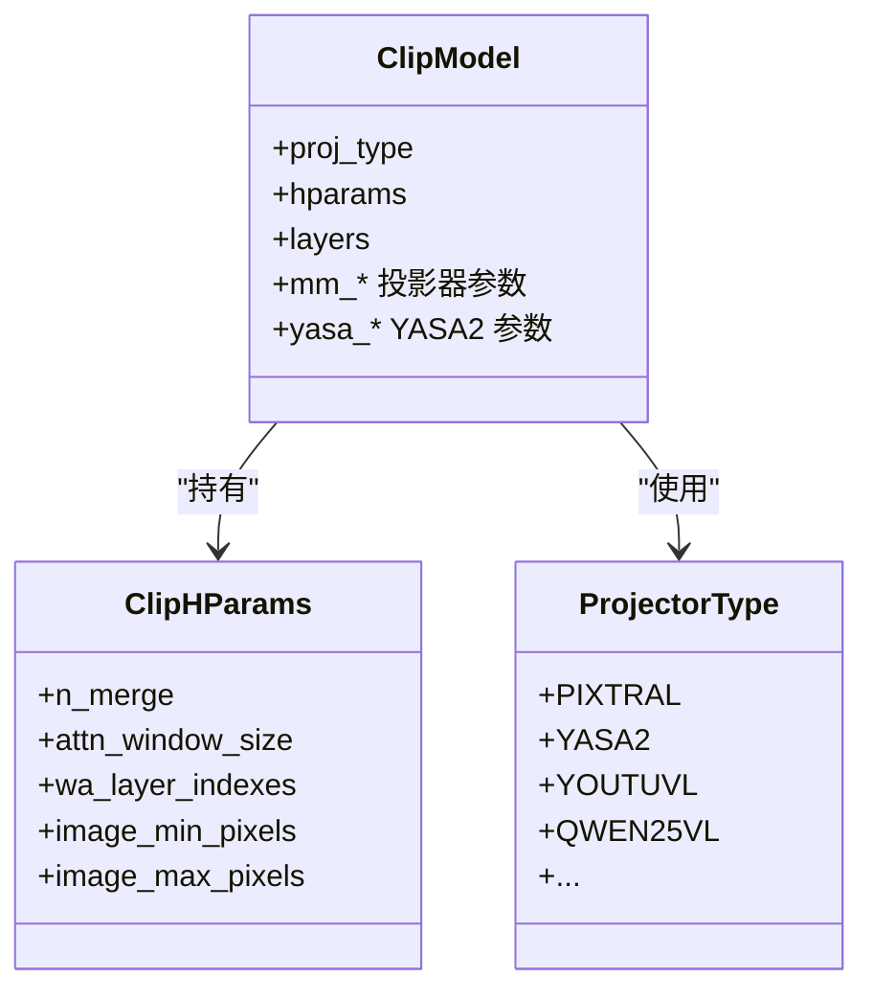
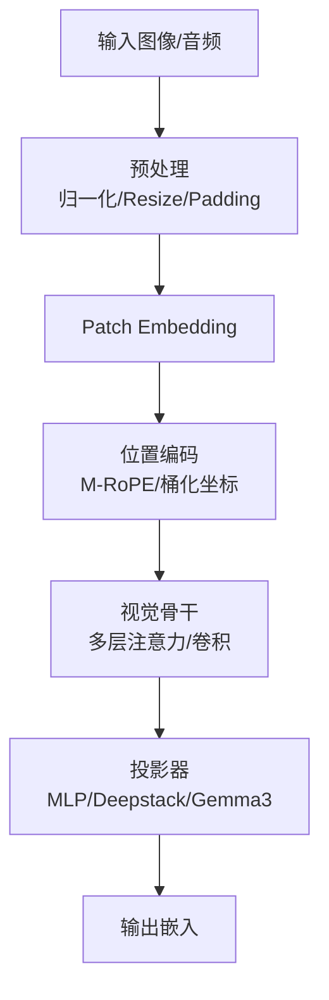
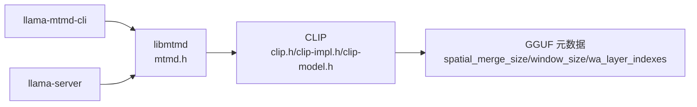

# 视频处理

<cite>
**本文引用的文件**
- [multimodal.md](file://docs/multimodal.md)
- [clip.h](file://tools/mtmd/clip.h)
- [clip-model.h](file://tools/mtmd/clip-model.h)
- [clip-impl.h](file://tools/mtmd/clip-impl.h)
- [clip.cpp](file://tools/mtmd/clip.cpp)
- [mtmd.h](file://tools/mtmd/mtmd.h)
- [convert_hf_to_gguf.py](file://convert_hf_to_gguf.py)
- [server-models.cpp](file://tools/server/server-models.cpp)
</cite>

## 目录
1. [简介](#简介)
2. [项目结构](#项目结构)
3. [核心组件](#核心组件)
4. [架构总览](#架构总览)
5. [详细组件分析](#详细组件分析)
6. [依赖关系分析](#依赖关系分析)
7. [性能考量](#性能考量)
8. [故障排查指南](#故障排查指南)
9. [结论](#结论)
10. [附录](#附录)

## 简介
本文件系统性梳理 llama.cpp 在“视频处理”方向的能力与实现，重点覆盖以下方面：
- 视频帧提取与时间维度建模：如何从视频中抽取帧序列并映射到多模态模型的时间/空间位置编码。
- 关键帧选择与窗口注意力：基于窗口注意力（Window Attention）与不规则全注意力模式（YoutuVL）的策略。
- 多模态视频模型实现：Pixtral、YASA 等视频理解模型在 llama.cpp 中的投影器类型、参数与推理路径。
- 视频编码器工作原理与特征提取：视觉编码器、投影器、位置编码与拼接/合并策略。
- 视频输入预处理与格式转换：像素布局、归一化、动态分辨率与分块策略。
- 应用场景与实现思路：视频问答、动作识别等任务的提示工程与调用方式。
- 性能优化与资源管理：内存分配、后端调度、Flash Attention、批处理与热身（warmup）。

## 项目结构
llama.cpp 的多模态子系统由两部分组成：
- libmtmd：多模态输入令牌化、图像/音频编码、输出嵌入获取。
- CLIP 视觉/音频编码器：负责将像素或梅尔谱等输入映射为文本模型可消费的嵌入。

图表来源
- [clip.h:1-119](file://tools/mtmd/clip.h#L1-L119)
- [clip-impl.h:262-354](file://tools/mtmd/clip-impl.h#L262-L354)
- [clip-model.h:292-532](file://tools/mtmd/clip-model.h#L292-L532)
- [clip.cpp:142-200](file://tools/mtmd/clip.cpp#L142-L200)
- [convert_hf_to_gguf.py:13116-13163](file://convert_hf_to_gguf.py#L13116-L13163)

章节来源
- [multimodal.md:1-145](file://docs/multimodal.md#L1-L145)
- [clip.h:1-119](file://tools/mtmd/clip.h#L1-L119)
- [clip-model.h:38-142](file://tools/mtmd/clip-model.h#L38-L142)
- [clip-impl.h:262-354](file://tools/mtmd/clip-impl.h#L262-L354)
- [clip.cpp:142-200](file://tools/mtmd/clip.cpp#L142-L200)
- [convert_hf_to_gguf.py:13116-13163](file://convert_hg_to_gguf.py#L13116-L13163)

## 核心组件
- 多模态上下文与令牌化（libmtmd）
  - 支持文本、图像、音频三类输入块；通过媒体标记（默认 <__media__>）将图像/音频插入到提示中，生成有序的输入块列表。
  - 提供 encode_chunk 接口，将图像/音频块编码为嵌入，供下游文本模型解码使用。
- CLIP 视觉/音频编码器
  - 统一的接口封装了不同投影器类型（MLP、Qwen-VL、Gemma3、Pixtral、YoutuVL、YASA2 等），并根据模型元数据决定 patch 合并、窗口注意力、位置编码等策略。
  - 支持 Flash Attention 自适应启用、后端调度与权重缓冲区管理。
- 模型转换与元数据
  - 将 HuggingFace 模型配置中的视频相关参数（如 spatial_merge_size、window_size、fullatt_block_indexes）写入 GGUF，供推理阶段读取。

章节来源
- [mtmd.h:53-254](file://tools/mtmd/mtmd.h#L53-L254)
- [clip.h:24-119](file://tools/mtmd/clip.h#L24-L119)
- [clip-model.h:292-532](file://tools/mtmd/clip-model.h#L292-L532)
- [clip-impl.h:262-354](file://tools/mtmd/clip-impl.h#L262-L354)
- [convert_hf_to_gguf.py:13116-13163](file://convert_hf_to_gguf.py#L13116-L13163)

## 架构总览
下图展示了从用户输入到文本生成的关键路径：提示令牌化（含媒体标记）→ 图像/音频编码 → 文本模型解码。

图表来源
- [mtmd.h:207-241](file://tools/mtmd/mtmd.h#L207-L241)
- [clip.cpp:3124-3231](file://tools/mtmd/clip.cpp#L3124-L3231)

章节来源
- [mtmd.h:207-241](file://tools/mtmd/mtmd.h#L207-L241)
- [clip.cpp:3124-3231](file://tools/mtmd/clip.cpp#L3124-L3231)

## 详细组件分析

### 视频帧提取与时间维度建模
- 帧序列到空间网格
  - 对于视频输入，通常先将视频解码为帧序列，再按策略选择关键帧或均匀采样，形成二维空间网格（宽×高）对应 token 空间。
  - 不同模型对 patch 合并与位置编码有差异化策略（例如 Qwen2.5VL/YoutuVL 的窗口注意力与索引重排）。
- 时间维度映射
  - 当前 CLIP 实现以二维空间 patch 为主；对于视频的时序信息，常见做法是：
    - 将每帧视为独立图像，按空间位置编码；
    - 或采用 3D/2.5D 视觉编码（MoonViT3D 等），在时间维上进行卷积/池化，再与空间位置编码结合。
  - 在 llama.cpp 中，视频输入的提示工程需明确帧序列与 token 的一一映射关系，以便后续窗口注意力或 M-RoPE 使用。

章节来源
- [clip.cpp:3362-3444](file://tools/mtmd/clip.cpp#L3362-L3444)
- [clip-model.h:38-142](file://tools/mtmd/clip-model.h#L38-L142)

### 关键帧选择与窗口注意力
- 窗口注意力（Window Attention）
  - 通过 attn_window_size 与 wa_layer_indexes 控制哪些窗口内使用全注意力，其余区域按滑动窗口分组，降低计算复杂度。
  - 推理时会构造 window_idx/inv_window_idx 与 window_mask，对注意力矩阵进行重排与掩码填充。
- 不规则全注意力（YoutuVL）
  - 通过 fullatt_block_indexes 显式指定某些层使用全注意力，其他层使用窗口注意力，形成不规则模式。

图表来源
- [clip.cpp:3377-3420](file://tools/mtmd/clip.cpp#L3377-L3420)
- [convert_hf_to_gguf.py:13140-13149](file://convert_hf_to_gguf.py#L13140-L13149)

章节来源
- [clip.cpp:3377-3420](file://tools/mtmd/clip.cpp#L3377-L3420)
- [convert_hf_to_gguf.py:13140-13149](file://convert_hf_to_gguf.py#L13140-L13149)

### 多模态视频模型实现（Pixtral、YASA 等）
- Pixtral 投影器
  - 投影器类型：PIXTRAL；支持 token_embd_img_break 与 mm_patch_merger，用于在行边界插入断点标记，提升空间建模能力。
- YASA2 视觉骨干
  - 投影器类型：YASA2；包含多阶段卷积与 GRN 模块，适合视频/时序视觉任务。
- 元数据写入
  - 转换脚本将投影器类型、空间合并尺寸、窗口大小、全注意力层索引等写入 GGUF，推理时读取以决定运行图与参数。

图表来源
- [clip-model.h:292-532](file://tools/mtmd/clip-model.h#L292-L532)
- [clip-impl.h:262-354](file://tools/mtmd/clip-impl.h#L262-L354)
- [convert_hf_to_gguf.py:13116-13163](file://convert_hf_to_gguf.py#L13116-L13163)

章节来源
- [clip-model.h:426-440](file://tools/mtmd/clip-model.h#L426-L440)
- [clip-impl.h:262-354](file://tools/mtmd/clip-impl.h#L262-L354)
- [convert_hf_to_gguf.py:13116-13163](file://convert_hf_to_gguf.py#L13116-L13163)

### 视频编码器工作原理与特征提取
- 视觉编码器
  - 通过 patch embedding、多层注意力与 FFN 提取空间特征；不同模型采用不同的 patch 合并策略（n_merge）、位置编码方案（M-RoPE、桶化坐标等）。
- 投影器
  - 将视觉特征映射到文本嵌入维度，常见类型包括 MLP、Qwen-VL 的深堆叠合并（deepstack）、Gemma3 的软嵌入归一化等。
- 特征提取流程
  - 预处理（归一化、resize、pad）→ patch 分割 → 位置编码 → 注意力/卷积 → 投影器 → 输出嵌入。

图表来源
- [clip.cpp:3115-3231](file://tools/mtmd/clip.cpp#L3115-L3231)
- [clip-model.h:292-532](file://tools/mtmd/clip-model.h#L292-L532)

章节来源
- [clip.cpp:3115-3231](file://tools/mtmd/clip.cpp#L3115-L3231)
- [clip-model.h:292-532](file://tools/mtmd/clip-model.h#L292-L532)

### 视频输入预处理与格式转换
- 输入格式
  - 图像：RGBRGBRGB… 布局，通道顺序为 RGB；尺寸为 nx×ny。
  - 音频：单通道浮点 PCM（F32），梅尔谱作为替代输入时，形状为 [n_frames, n_mel]。
- 预处理参数
  - 图像均值/方差、目标尺寸、最小/最大像素数、resize 算法、pad 颜色等；动态分辨率模型可通过自定义 token 数范围推导 min/max pixels。
- 分块策略
  - LLaVA-uhd 风格模型支持网格（overview/refined）分块，batch 中包含 overview 与若干子图，便于大分辨率输入。

章节来源
- [clip.h:94-118](file://tools/mtmd/clip.h#L94-L118)
- [clip-model.h:38-118](file://tools/mtmd/clip-model.h#L38-L118)
- [clip.cpp:457-483](file://tools/mtmd/clip.cpp#L457-L483)

### 应用场景与实现思路
- 视频问答（Video QA）
  - 在提示中插入媒体标记，并附带帧序列或关键帧集合；通过 mtmd_tokenize 与 mtmd_encode_chunk 生成嵌入，再交由文本模型生成答案。
- 动作识别（Action Recognition）
  - 将视频帧序列按固定步长采样为关键帧，分别编码为嵌入，结合时间顺序提示词（如“动作描述”、“类别标签”）引导模型输出分类结果。
- 通用建议
  - 使用合适的上下文长度与 token 数限制，避免 OOM。
  - 对动态分辨率模型，合理设置 image_min_tokens/image_max_tokens。

章节来源
- [mtmd.h:207-241](file://tools/mtmd/mtmd.h#L207-L241)
- [multimodal.md:1-145](file://docs/multimodal.md#L1-L145)

## 依赖关系分析
- libmtmd 依赖 CLIP 编码器完成图像/音频到嵌入的映射。
- CLIP 编码器依赖 GGUF 元数据决定投影器类型、窗口注意力参数与位置编码策略。
- 服务器与 CLI 通过 libmtmd 提供统一的多模态接口。

图表来源
- [mtmd.h:105-118](file://tools/mtmd/mtmd.h#L105-L118)
- [clip.h:50-51](file://tools/mtmd/clip.h#L50-L51)
- [clip-impl.h:20-66](file://tools/mtmd/clip-impl.h#L20-L66)
- [convert_hf_to_gguf.py:13116-13163](file://convert_hf_to_gguf.py#L13116-L13163)

章节来源
- [mtmd.h:105-118](file://tools/mtmd/mtmd.h#L105-L118)
- [clip.h:50-51](file://tools/mtmd/clip.h#L50-L51)
- [clip-impl.h:20-66](file://tools/mtmd/clip-impl.h#L20-L66)
- [convert_hf_to_gguf.py:13116-13163](file://convert_hf_to_gguf.py#L13116-L13163)

## 性能考量
- Flash Attention 自适应
  - 推理前尝试启用 Flash Attention，若不支持则回退；可通过环境变量选择后端设备。
- 内存与调度
  - 权重与中间张量通过后端缓冲区类型分配；首次推理前进行 warmup，减少首帧延迟。
- 批处理与并行
  - 当前批大小为 1 的限制；多图/多音频批处理需要扩展推理图构建逻辑。
- 窗口注意力
  - 合理设置窗口大小与层索引，平衡精度与吞吐；对大分辨率输入优先考虑窗口注意力。

章节来源
- [clip.cpp:165-200](file://tools/mtmd/clip.cpp#L165-L200)
- [clip.cpp:2473-2500](file://tools/mtmd/clip.cpp#L2473-L2500)
- [clip.cpp:3124-3133](file://tools/mtmd/clip.cpp#L3124-L3133)

## 故障排查指南
- OOM 或加载失败
  - 检查 image_min_tokens/image_max_tokens 设置是否与模型元数据一致；必要时调整为更小分辨率。
- 后端初始化失败
  - 确认 MTMD_BACKEND_DEVICE 环境变量正确；若 GPU 初始化失败，将自动回退到 CPU。
- 窗口注意力不生效
  - 确认 GGUF 中已写入 window_size 与 wa_layer_indexes；检查推理日志中是否启用了窗口注意力。
- 音频/图像输入异常
  - 确认输入位图尺寸与通道布局符合要求；音频输入应为单通道浮点 PCM 或梅尔谱。

章节来源
- [clip.cpp:171-192](file://tools/mtmd/clip.cpp#L171-L192)
- [clip.cpp:3033-3050](file://tools/mtmd/clip.cpp#L3033-L3050)
- [clip.h:130-145](file://tools/mtmd/clip.h#L130-L145)

## 结论
llama.cpp 的视频处理能力依托 libmtmd 与 CLIP 编码器，实现了从帧序列到嵌入的完整链路。通过窗口注意力、不规则全注意力与多种投影器类型，系统能够灵活适配不同视频理解模型（如 Pixtral、YASA2、YoutuVL）。实际部署中，建议结合模型元数据合理设置分辨率与 token 数上限，并利用窗口注意力与 Flash Attention 优化性能。

## 附录
- 参考文档与模型清单
  - 多模态使用说明与模型列表见 [multimodal.md:1-145](file://docs/multimodal.md#L1-L145)。
- 服务器模型加载
  - 服务器侧模型加载流程参考 [server-models.cpp:247-269](file://tools/server/server-models.cpp#L247-L269)。