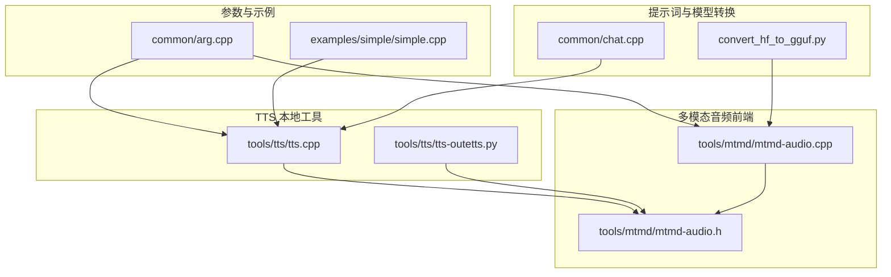
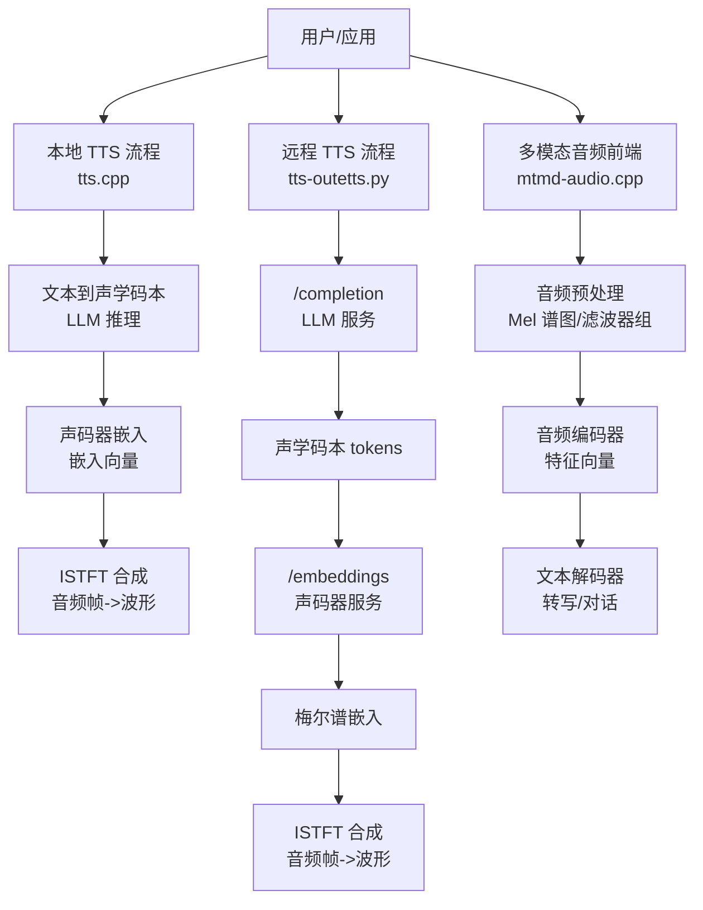
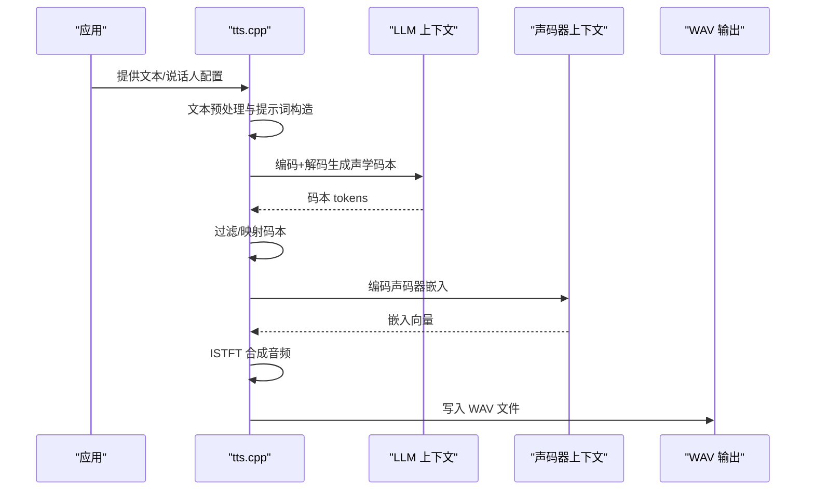
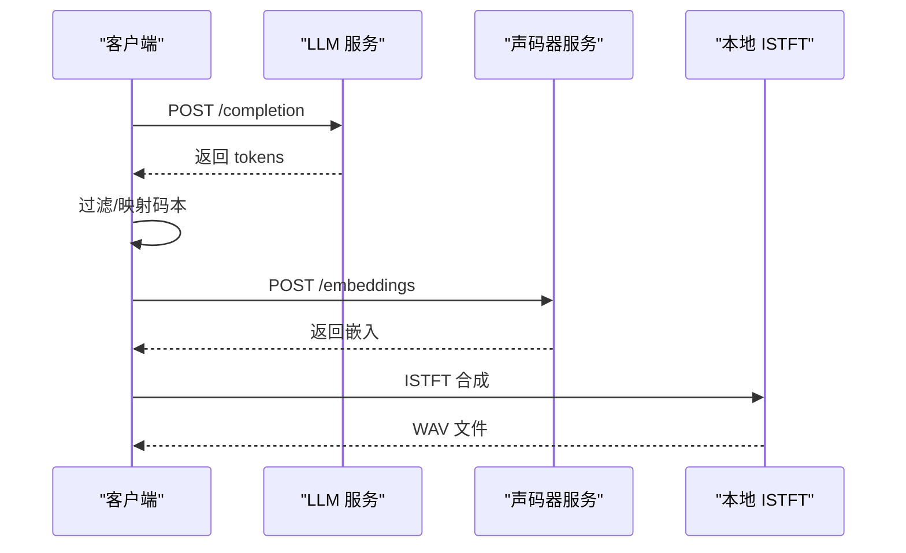
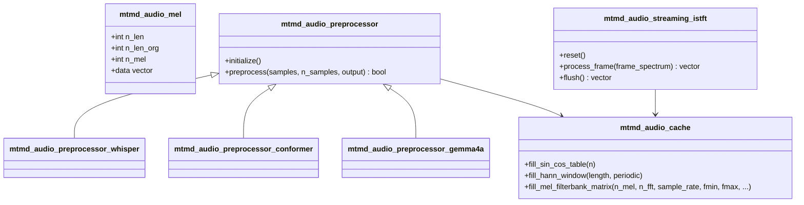
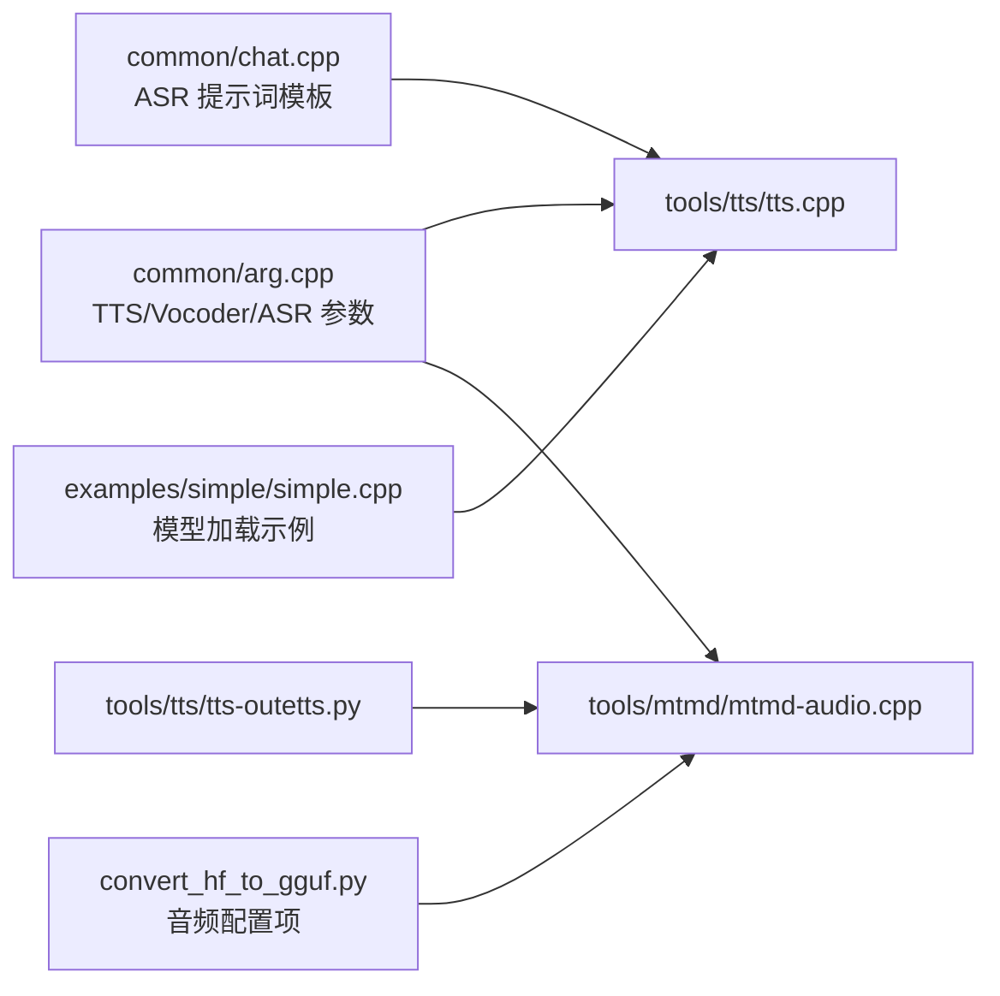

# 音频处理

<cite>
**本文引用的文件**
- [tools/tts/tts.cpp](file://tools/tts/tts.cpp)
- [tools/tts/tts-outetts.py](file://tools/tts/tts-outetts.py)
- [tools/mtmd/mtmd-audio.h](file://tools/mtmd/mtmd-audio.h)
- [tools/mtmd/mtmd-audio.cpp](file://tools/mtmd/mtmd-audio.cpp)
- [common/arg.cpp](file://common/arg.cpp)
- [common/chat.cpp](file://common/chat.cpp)
- [convert_hf_to_gguf.py](file://convert_hf_to_gguf.py)
- [examples/simple/simple.cpp](file://examples/simple/simple.cpp)
</cite>

## 目录
1. [简介](#简介)
2. [项目结构](#项目结构)
3. [核心组件](#核心组件)
4. [架构总览](#架构总览)
5. [详细组件分析](#详细组件分析)
6. [依赖关系分析](#依赖关系分析)
7. [性能考量](#性能考量)
8. [故障排查指南](#故障排查指南)
9. [结论](#结论)
10. [附录：API与配置](#附录api与配置)

## 简介
本文件系统性梳理 llama.cpp 在音频处理方面的能力与实现，重点覆盖以下主题：
- 语音识别（ASR）：Whisper 模型集成与音频转录流程
- 文本转语音（TTS）：OuteTTS 流水线与声码器（vocoder）推理
- 音频特征提取与声学模型处理：Mel 谱图、STFT/ISTFT、滤波器组
- 音频模型加载与推理：模型参数、采样策略、批处理
- API 与配置：命令行参数、服务器接口、WebUI 录音转换
- 实际应用：语音助手、音频转录等场景的实现要点
- 质量与延迟优化：预处理、缓存、并行与后处理技巧

## 项目结构
围绕音频处理的相关模块主要分布在如下位置：
- TTS 工具链：tools/tts/tts.cpp（本地推理）、tools/tts/tts-outetts.py（远程服务端流水线）
- 多模态音频前端：tools/mtmd/mtmd-audio.{h,cpp}（Whisper/Gemma4/Ultravox 等音频预处理与 ISTFT）
- 命令行参数与示例：common/arg.cpp、examples/simple/simple.cpp
- 语音助手提示词模板：common/chat.cpp
- 模型转换与多模态配置：convert_hf_to_gguf.py

图表来源
- [tools/tts/tts.cpp:1-1097](file://tools/tts/tts.cpp#L1-L1097)
- [tools/tts/tts-outetts.py:1-300](file://tools/tts/tts-outetts.py#L1-L300)
- [tools/mtmd/mtmd-audio.h:1-124](file://tools/mtmd/mtmd-audio.h#L1-L124)
- [tools/mtmd/mtmd-audio.cpp:1-837](file://tools/mtmd/mtmd-audio.cpp#L1-L837)
- [common/arg.cpp:3750-3897](file://common/arg.cpp#L3750-L3897)
- [examples/simple/simple.cpp:1-224](file://examples/simple/simple.cpp#L1-L224)
- [common/chat.cpp:553-563](file://common/chat.cpp#L553-L563)
- [convert_hf_to_gguf.py:4986-12462](file://convert_hf_to_gguf.py#L4986-L12462)

章节来源
- [tools/tts/tts.cpp:1-1097](file://tools/tts/tts.cpp#L1-L1097)
- [tools/tts/tts-outetts.py:1-300](file://tools/tts/tts-outetts.py#L1-L300)
- [tools/mtmd/mtmd-audio.h:1-124](file://tools/mtmd/mtmd-audio.h#L1-L124)
- [tools/mtmd/mtmd-audio.cpp:1-837](file://tools/mtmd/mtmd-audio.cpp#L1-L837)
- [common/arg.cpp:3750-3897](file://common/arg.cpp#L3750-L3897)
- [examples/simple/simple.cpp:1-224](file://examples/simple/simple.cpp#L1-L224)
- [common/chat.cpp:553-563](file://common/chat.cpp#L553-L563)
- [convert_hf_to_gguf.py:4986-12462](file://convert_hf_to_gguf.py#L4986-L12462)

## 核心组件
- TTS 本地推理（OuteTTS）：通过本地 LLM 生成声学码本，再由声码器生成梅尔谱，最后合成音频。
- 远程 TTS 服务端流水线：先调用 LLM 生成 tokens，再请求声码器服务获取嵌入，最后本地 ISTFT 合成音频。
- 多模态音频前端：Whisper/Gemma4/Ultravox 等音频预处理（Mel 谱图、滤波器组、STFT/ISTFT），支持流式输出。
- 参数与示例：命令行参数定义 TTS/Vocoder/ASR 相关开关；简单示例展示模型加载与推理。

章节来源
- [tools/tts/tts.cpp:539-1038](file://tools/tts/tts.cpp#L539-L1038)
- [tools/tts/tts-outetts.py:244-299](file://tools/tts/tts-outetts.py#L244-L299)
- [tools/mtmd/mtmd-audio.h:12-124](file://tools/mtmd/mtmd-audio.h#L12-L124)
- [tools/mtmd/mtmd-audio.cpp:527-837](file://tools/mtmd/mtmd-audio.cpp#L527-L837)
- [common/arg.cpp:3750-3897](file://common/arg.cpp#L3750-L3897)
- [examples/simple/simple.cpp:14-224](file://examples/simple/simple.cpp#L14-L224)

## 架构总览
下图展示了从“输入音频/文本”到“输出音频”的关键路径，涵盖本地 TTS、远程服务端 TTS、以及多模态音频前端。

图表来源
- [tools/tts/tts.cpp:539-1038](file://tools/tts/tts.cpp#L539-L1038)
- [tools/tts/tts-outetts.py:244-299](file://tools/tts/tts-outetts.py#L244-L299)
- [tools/mtmd/mtmd-audio.cpp:527-837](file://tools/mtmd/mtmd-audio.cpp#L527-L837)

## 详细组件分析

### 组件一：本地 TTS（OuteTTS）流程
- 输入：文本提示词、可选说话人配置（speaker 文件）
- 步骤：
  1) 文本预处理与分词，构造提示词（含文本分隔符、时长标记、声学码本起止标记）
  2) 文本到声学码本：调用 LLM 推理，采样 top_k，过滤出声学码本范围内的 token
  3) 声码器嵌入：将码本映射为嵌入向量（维度与声码器一致）
  4) ISTFT 合成：逐帧进行逆变换，重叠相加与窗函数归一化，输出音频
  5) 写入 WAV 文件（16bit PCM）

图表来源
- [tools/tts/tts.cpp:539-1038](file://tools/tts/tts.cpp#L539-L1038)

章节来源
- [tools/tts/tts.cpp:190-281](file://tools/tts/tts.cpp#L190-L281)
- [tools/tts/tts.cpp:539-1038](file://tools/tts/tts.cpp#L539-L1038)

### 组件二：远程 TTS 服务端流水线
- 输入：文本
- 步骤：
  1) 请求 LLM 服务的 /completion，传入预设前缀与目标文本，返回 tokens
  2) 过滤出声学码本范围内的 token 并做偏移修正
  3) 请求声码器服务的 /embeddings，得到梅尔谱嵌入
  4) 使用本地 ISTFT 将嵌入转回波形，写入 WAV

图表来源
- [tools/tts/tts-outetts.py:244-299](file://tools/tts/tts-outetts.py#L244-L299)

章节来源
- [tools/tts/tts-outetts.py:1-300](file://tools/tts/tts-outetts.py#L1-L300)

### 组件三：多模态音频前端（Whisper/Gemma4/Ultravox）
- 功能：
  - Mel 谱图计算：Hann 窗、FFT、滤波器组（HTK/Slaney 可选）、对数/对数10 归一化
  - 流式 ISTFT：逐帧逆变换，重叠相加与窗和归一化，支持 flush 收尾
  - 多种音频预处理器：Whisper、Conformer、Gemma4A
- 关键数据结构：
  - mtmd_audio_mel：存储 Mel 维度与时间帧数据
  - mtmd_audio_cache：缓存正弦/余弦表、Hann 窗、Mel 滤波器矩阵
  - mtmd_audio_streaming_istft：维护重叠缓冲区与窗和缓冲区

图表来源
- [tools/mtmd/mtmd-audio.h:12-124](file://tools/mtmd/mtmd-audio.h#L12-L124)
- [tools/mtmd/mtmd-audio.cpp:17-125](file://tools/mtmd/mtmd-audio.cpp#L17-L125)
- [tools/mtmd/mtmd-audio.cpp:527-837](file://tools/mtmd/mtmd-audio.cpp#L527-L837)

章节来源
- [tools/mtmd/mtmd-audio.h:12-124](file://tools/mtmd/mtmd-audio.h#L12-L124)
- [tools/mtmd/mtmd-audio.cpp:17-125](file://tools/mtmd/mtmd-audio.cpp#L17-L125)
- [tools/mtmd/mtmd-audio.cpp:527-837](file://tools/mtmd/mtmd-audio.cpp#L527-L837)

### 组件四：ASR（语音识别）与提示词模板
- 提示词模板中包含“将音频转录为文本”的指令，便于在对话模板中启用 ASR 功能
- 结合多模态音频前端，可实现“音频输入 -> Mel 谱图 -> 编码器 -> 文本解码器 -> 转写结果”

章节来源
- [common/chat.cpp:553-563](file://common/chat.cpp#L553-L563)
- [tools/mtmd/mtmd-audio.cpp:527-605](file://tools/mtmd/mtmd-audio.cpp#L527-L605)

### 组件五：模型加载与推理（通用）
- 示例程序展示了模型加载、上下文初始化、批处理与采样链的基本流程，适用于音频模型的加载与推理

章节来源
- [examples/simple/simple.cpp:14-224](file://examples/simple/simple.cpp#L14-L224)

## 依赖关系分析
- TTS 本地与远程流程均依赖多模态音频前端的 ISTFT 能力
- 命令行参数为 TTS/Vocoder/ASR 提供统一入口与默认值
- 模型转换脚本为不同架构（Whisper/Gemma4/Ultravox）提供音频配置项

图表来源
- [common/arg.cpp:3750-3897](file://common/arg.cpp#L3750-L3897)
- [tools/tts/tts.cpp:539-1038](file://tools/tts/tts.cpp#L539-L1038)
- [tools/tts/tts-outetts.py:244-299](file://tools/tts/tts-outetts.py#L244-L299)
- [tools/mtmd/mtmd-audio.cpp:527-837](file://tools/mtmd/mtmd-audio.cpp#L527-L837)
- [common/chat.cpp:553-563](file://common/chat.cpp#L553-L563)
- [convert_hf_to_gguf.py:4986-12462](file://convert_hf_to_gguf.py#L4986-L12462)
- [examples/simple/simple.cpp:14-224](file://examples/simple/simple.cpp#L14-L224)

章节来源
- [common/arg.cpp:3750-3897](file://common/arg.cpp#L3750-L3897)
- [tools/tts/tts.cpp:539-1038](file://tools/tts/tts.cpp#L539-L1038)
- [tools/tts/tts-outetts.py:244-299](file://tools/tts/tts-outetts.py#L244-L299)
- [tools/mtmd/mtmd-audio.cpp:527-837](file://tools/mtmd/mtmd-audio.cpp#L527-L837)
- [common/chat.cpp:553-563](file://common/chat.cpp#L553-L563)
- [convert_hf_to_gguf.py:4986-12462](file://convert_hf_to_gguf.py#L4986-L12462)
- [examples/simple/simple.cpp:14-224](file://examples/simple/simple.cpp#L14-L224)

## 性能考量
- 并行与缓存
  - 多线程 FFT/滤波器组：log_mel_spectrogram_worker_thread 支持多线程计算
  - Sin/Cos 表与 Hann 窗缓存：避免重复计算，提升 STFT/ISTFT 速度
- 预处理优化
  - 中心填充/反射填充策略，减少边界效应
  - Mel 滤波器矩阵按需构建，支持 HTK/Slaney 规范
- 合成阶段
  - 流式 ISTFT：重叠相加与窗和归一化，避免混叠与爆音
  - 批处理与批内并行：在本地 TTS 中使用批处理与采样器链
- 延迟控制
  - 分块处理（如 30 秒片段）以适配模型上下文长度
  - 通过参数调整 hop_length/n_fft 控制时延与分辨率权衡

章节来源
- [tools/mtmd/mtmd-audio.cpp:283-521](file://tools/mtmd/mtmd-audio.cpp#L283-L521)
- [tools/mtmd/mtmd-audio.cpp:738-837](file://tools/mtmd/mtmd-audio.cpp#L738-L837)
- [tools/tts/tts.cpp:598-604](file://tools/tts/tts.cpp#L598-L604)

## 故障排查指南
- 常见问题与定位
  - 音频过短导致 Mel 计算失败：预处理会补齐最小样本数，若仍失败检查采样率与窗口长度
  - 码本范围不匹配：确保过滤逻辑与声码器 token 范围一致
  - ISTFT 输出爆音或噪声：检查窗和归一化是否正确、重叠缓冲区是否清零
  - 服务端通信异常：确认 /completion 与 /embeddings 接口可用、网络连通性
- 日志与调试
  - 本地 TTS：打印提示词、采样参数、耗时统计
  - 多模态音频前端：可开启 DEBUG 开关输出中间矩阵与帧数据

章节来源
- [tools/tts/tts.cpp:539-1038](file://tools/tts/tts.cpp#L539-L1038)
- [tools/mtmd/mtmd-audio.cpp:17-125](file://tools/mtmd/mtmd-audio.cpp#L17-L125)
- [tools/tts/tts-outetts.py:244-299](file://tools/tts/tts-outetts.py#L244-L299)

## 结论
llama.cpp 在音频处理方面提供了从特征提取到声学建模再到音频合成的完整链路，既支持本地 TTS（OuteTTS）也支持远程服务端流水线，并通过多模态音频前端兼容 Whisper/Gemma4/Ultravox 等架构。结合命令行参数与示例程序，开发者可以快速搭建语音助手、音频转录等应用，并通过缓存、并行与分块策略优化性能与延迟。

## 附录：API与配置

### 命令行参数（节选）
- TTS 相关
  - --tts-vocoder-model：声码器模型路径
  - --tts-use-guide-tokens：使用引导 token 提升单词召回
  - --tts-speaker-file：说话人配置文件
  - --tts-oute-default：使用默认 OuteTTS 模型（自动下载）
- 通用
  - --image/--audio：图像/音频文件路径（多模态）
  - --n_predict、--n_batch、--n_ctx：推理参数

章节来源
- [common/arg.cpp:3750-3897](file://common/arg.cpp#L3750-L3897)

### 服务器接口（示例）
- /completion：接收提示词与采样参数，返回 tokens（用于 TTS 码本生成）
- /embeddings：接收码本序列，返回嵌入（用于声码器合成）

章节来源
- [tools/tts/tts-outetts.py:244-299](file://tools/tts/tts-outetts.py#L244-L299)

### WebUI 录音转换（WAV）
- 将浏览器录音 Blob 转换为 WAV（16bit PCM），便于后续 ASR/TTS 处理

章节来源
- [tools/server/webui/src/lib/utils/audio-recording.ts:152-173](file://tools/server/webui/src/lib/utils/audio-recording.ts#L152-L173)

### 模型转换与音频配置
- Whisper/Gemma4/Ultravox 等模型的音频配置项（Mel bins、堆叠因子、注意力层归一化等）由转换脚本注入 GGUF

章节来源
- [convert_hf_to_gguf.py:4986-12462](file://convert_hf_to_gguf.py#L4986-L12462)