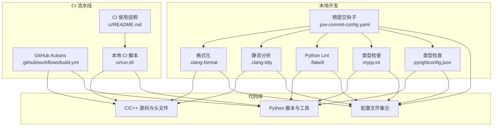
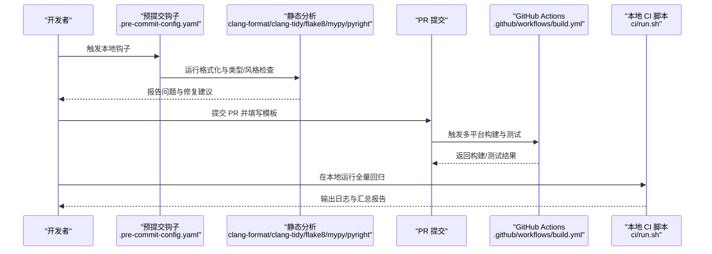
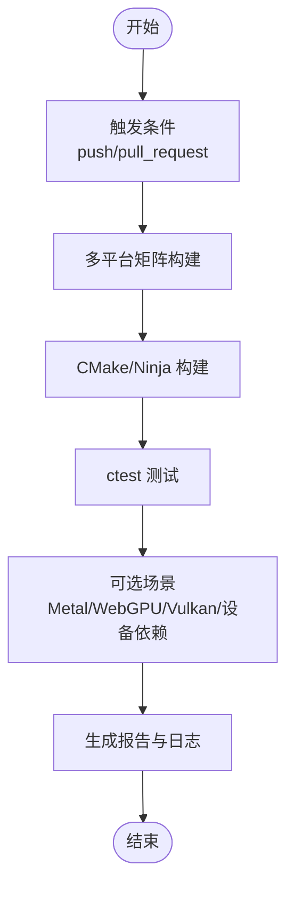
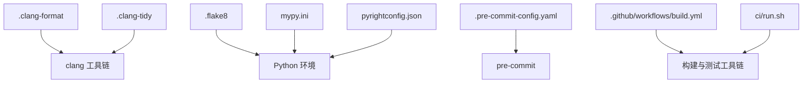

# 代码质量和规范

<cite>
**本文引用的文件**
- [.clang-format](file://.clang-format)
- [.clang-tidy](file://.clang-tidy)
- [.flake8](file://.flake8)
- [.pre-commit-config.yaml](file://.pre-commit-config.yaml)
- [mypy.ini](file://mypy.ini)
- [pyrightconfig.json](file://pyrightconfig.json)
- [CONTRIBUTING.md](file://CONTRIBUTING.md)
- [.github/pull_request_template.md](file://.github/pull_request_template.md)
- [.github/workflows/build.yml](file://.github/workflows/build.yml)
- [ci/README.md](file://ci/README.md)
- [ci/run.sh](file://ci/run.sh)
</cite>

## 目录
1. [引言](#引言)
2. [项目结构](#项目结构)
3. [核心组件](#核心组件)
4. [架构总览](#架构总览)
5. [详细组件分析](#详细组件分析)
6. [依赖关系分析](#依赖关系分析)
7. [性能考量](#性能考量)
8. [故障排查指南](#故障排查指南)
9. [结论](#结论)
10. [附录](#附录)

## 引言
本文件旨在为 llama.cpp 建立一套系统化的代码质量保证体系，覆盖编码规范与命名约定（C/C++ 与 Python）、静态代码分析工具配置与使用、代码审查流程与质量检查标准、代码格式化工具配置与使用、持续集成中的质量门禁机制、代码重构与维护最佳实践，以及文档编写规范与 API 注释标准。目标是提升代码一致性、可读性、可维护性与稳定性。

## 项目结构
llama.cpp 采用模块化与多后端架构，核心由 C/C++ 实现，同时提供 Python 脚本与工具用于模型转换、测试与基准评估。质量保证体系围绕以下方面展开：
- 编码规范：C/C++ 使用 clang-format 与 clang-tidy；Python 使用 flake8、mypy、pyright。
- 静态分析：在本地与 CI 中统一执行，确保问题早发现、早修复。
- 审查流程：PR 模板与贡献指南明确要求与流程。
- CI 质量门禁：通过 GitHub Actions 多平台矩阵构建与测试，结合本地 CI 脚本进行全量回归验证。
- 文档与注释：鼓励在头文件中补充 API 简要说明，保持文档与代码同步更新。

图表来源
- [.clang-format](file://.clang-format)
- [.clang-tidy](file://.clang-tidy)
- [.flake8](file://.flake8)
- [mypy.ini](file://mypy.ini)
- [pyrightconfig.json](file://pyrightconfig.json)
- [.pre-commit-config.yaml](file://.pre-commit-config.yaml)
- [.github/workflows/build.yml](file://.github/workflows/build.yml)
- [ci/run.sh](file://ci/run.sh)
- [ci/README.md](file://ci/README.md)

章节来源
- [.clang-format](file://.clang-format)
- [.clang-tidy](file://.clang-tidy)
- [.flake8](file://.flake8)
- [mypy.ini](file://mypy.ini)
- [pyrightconfig.json](file://pyrightconfig.json)
- [.pre-commit-config.yaml](file://.pre-commit-config.yaml)
- [.github/workflows/build.yml](file://.github/workflows/build.yml)
- [ci/README.md](file://ci/README.md)
- [ci/run.sh](file://ci/run.sh)

## 核心组件
- 编码规范与命名约定
  - C/C++：缩进宽度与制表符、大括号风格、行宽限制、指针与引用对齐、函数与变量命名风格等，详见 clang-format 配置与贡献指南。
  - Python：行长度、忽略规则、排除路径、类型严格模式与报告策略，详见 flake8、mypy 与 pyright 配置。
- 静态代码分析
  - clang-tidy：启用 bugprone/readability/performance/portability 等检查集，部分规则按需关闭以适配现有代码。
  - flake8：统一 Python 代码风格与复杂度控制。
  - mypy：严格模式与允许未类型定义/调用，避免导入未类型错误。
  - pyright：跨目录与多 Python 版本环境的类型检查，报告未使用导入、重复导入、弃用项等。
- 预提交钩子
  - 自动清理尾随空白、文件末尾换行、大文件、YAML 校验等；Python 使用 flake8 钩子。
- 代码审查流程
  - PR 模板与贡献指南明确了测试要求、分 PR 提交、AI 使用披露与审查合并流程。
- CI 质量门禁
  - GitHub Actions 多平台矩阵构建与测试；本地 CI 脚本支持一键全量回归，含模型推理、困惑度、量化、嵌入等场景。
- 文档与注释
  - 鼓励在头文件中补充 API 简要说明，保持文档与代码同步更新。

章节来源
- [CONTRIBUTING.md](file://CONTRIBUTING.md)
- [.clang-format](file://.clang-format)
- [.clang-tidy](file://.clang-tidy)
- [.flake8](file://.flake8)
- [mypy.ini](file://mypy.ini)
- [pyrightconfig.json](file://pyrightconfig.json)
- [.pre-commit-config.yaml](file://.pre-commit-config.yaml)
- [.github/pull_request_template.md](file://.github/pull_request_template.md)
- [.github/workflows/build.yml](file://.github/workflows/build.yml)
- [ci/README.md](file://ci/README.md)
- [ci/run.sh](file://ci/run.sh)

## 架构总览
下图展示从本地开发到 CI 的质量保证闭环：开发者在本地通过预提交钩子与静态分析工具进行自检；提交 PR 后由 GitHub Actions 执行多平台构建与测试；本地 CI 脚本提供与 CI 等价的全量回归能力，便于在本地复现与调试。

图表来源
- [.pre-commit-config.yaml](file://.pre-commit-config.yaml)
- [.clang-format](file://.clang-format)
- [.clang-tidy](file://.clang-tidy)
- [.flake8](file://.flake8)
- [mypy.ini](file://mypy.ini)
- [pyrightconfig.json](file://pyrightconfig.json)
- [.github/workflows/build.yml](file://.github/workflows/build.yml)
- [ci/run.sh](file://ci/run.sh)

章节来源
- [.pre-commit-config.yaml](file://.pre-commit-config.yaml)
- [.clang-format](file://.clang-format)
- [.clang-tidy](file://.clang-tidy)
- [.flake8](file://.flake8)
- [mypy.ini](file://mypy.ini)
- [pyrightconfig.json](file://pyrightconfig.json)
- [.github/workflows/build.yml](file://.github/workflows/build.yml)
- [ci/run.sh](file://ci/run.sh)

## 详细组件分析

### C/C++ 编码规范与 clang-format
- 关键要点
  - 缩进宽度与制表符：统一 4 空格；禁止使用制表符。
  - 行宽限制：120 列。
  - 大括号风格：自定义风格，函数体与控制结构的大括号位置遵循配置。
  - 指针与引用对齐：Middle/Left 对齐策略。
  - 包含排序：按双引号、系统头、第三方头、源码顺序分组并排序。
  - 结束换行：强制在文件末尾插入换行。
  - C++ 标准：c++17。
- 命名约定
  - 函数、变量、类型使用 snake_case。
  - 枚举值使用全大写并带前缀（如 LLAMA_XXX）。
  - 类/模块方法命名遵循 <class>_<method>，动作优先，名词可省略。
  - 不透明类型使用 _t 后缀（如 llama_context_t）。
  - 文件命名：C/C++ 小写短横线，Python 小写蛇形。
- 其他
  - 避免现代 STL 与模板滥用，优先基础 for 循环与简单结构。
  - 垂直对齐提升可读性，批量编辑友好。
  - 清理尾随空格，使用 4 空格缩进，括号在同一行，指针与引用风格一致（如 void* ptr，int& a）。

章节来源
- [CONTRIBUTING.md](file://CONTRIBUTING.md)
- [.clang-format](file://.clang-format)

### C/C++ 静态分析与 clang-tidy
- 关键要点
  - 启用检查集：bugprone、readability、performance、portability、misc 等。
  - 关闭规则：如标识符长度、魔法数、大小写字面量后缀、布尔表达式简化、SIMD 内建宏等，以降低迁移成本。
  - 格式风格：不强制 clang-format，保持与 .clang-format 协同。
- 使用建议
  - 在本地与 CI 中统一执行，确保新增或修改代码符合检查集。
  - 对于历史遗留代码，逐步收敛至新规则，避免一次性大规模改动。

章节来源
- [.clang-tidy](file://.clang-tidy)

### Python 编码规范与工具链
- flake8
  - 行长度：125。
  - 忽略规则：E203、E211、E221、E225、E231、E241、E251、E261、E266、E501、E701、E704、W503 等。
  - 排除路径：examples、tools、__init__.py、.git、__pycache__、build、dist 等。
- mypy
  - 严格模式开启，允许未类型定义与调用，避免导入未类型错误，抑制返回 any 警告。
- pyright
  - 跨目录路径：gguf-py、model-conversion 脚本与工具。
  - Python 版本：3.9；针对特定子目录设置版本覆盖（如 3.8、3.10）。
  - 报告策略：未使用导入警告、重复导入错误、弃用项警告、无必要类型忽略注释信息级别。
- 命名约定
  - Python 文件名小写蛇形，变量与函数 snake_case，类名 PascalCase，常量 UPPER_CASE。

章节来源
- [.flake8](file://.flake8)
- [mypy.ini](file://mypy.ini)
- [pyrightconfig.json](file://pyrightconfig.json)
- [CONTRIBUTING.md](file://CONTRIBUTING.md)

### 预提交钩子与本地质量门禁
- 钩子功能
  - 清理尾随空白、文件末尾换行、大文件检测、YAML 校验。
  - Python 使用 flake8 钩子，额外安装 flake8-no-print。
- 使用建议
  - 在本地安装并启用 pre-commit，确保每次提交前自动执行检查。
  - 对于大型变更，先在本地运行完整 CI 脚本，减少 CI 失败概率。

章节来源
- [.pre-commit-config.yaml](file://.pre-commit-config.yaml)

### 代码审查流程与质量检查标准
- PR 模板
  - 明确概述、附加信息与要求，强调已阅读贡献指南与 AI 使用披露。
- 贡献指南
  - 测试要求：本地执行完整 CI、验证困惑度与性能、backend ops 一致性检查。
  - 分 PR 策略：每个特性或修复单独提交，复杂功能先开需求讨论。
  - 新数据类型/量化类型新增需提供模型转换、困惑度对比、KL 散度与纯 CPU 性能数据。
  - 维护与协作：新增代码应有维护者与长期支持承诺。
- 合并策略
  - 维护者负责审查与合并，采用 squash-merge，提交标题格式规范。

章节来源
- [.github/pull_request_template.md](file://.github/pull_request_template.md)
- [CONTRIBUTING.md](file://CONTRIBUTING.md)

### 持续集成中的质量门禁机制
- GitHub Actions
  - 触发条件：push 与 pull_request，限定源码与构建相关文件变更。
  - 并发控制：同一工作流的并发组与取消策略。
  - 环境变量：日志颜色、时间戳、前缀等统一开关。
  - 多平台矩阵：macOS、Ubuntu、Windows、Android、WebGPU、Vulkan、HIP、MUSA、CUDA 等。
  - 关键步骤：克隆仓库、缓存（ccache）、构建（CMake/Ninja）、测试（ctest）、可选的 Metal/设备依赖准备。
- 本地 CI 脚本
  - 支持按后端开关构建（CUDA、SYCL、Vulkan、WebGPU、MUSA、BLAS、OpenVINO 等）。
  - 提供 Debug/Release 双模式测试、模型推理、困惑度、量化、嵌入、重排等场景。
  - 生成汇总报告与日志，便于定位问题。

图表来源
- [.github/workflows/build.yml](file://.github/workflows/build.yml)

章节来源
- [.github/workflows/build.yml](file://.github/workflows/build.yml)
- [ci/README.md](file://ci/README.md)
- [ci/run.sh](file://ci/run.sh)

### 代码格式化工具配置与使用
- clang-format
  - 使用 .clang-format 配置文件，推荐在 IDE 中启用保存时格式化。
  - 对于 C/C++ 新增或修改文件，先运行 clang-format，再提交。
- flake8
  - 在本地与 CI 中统一执行，确保 Python 代码风格一致。
- mypy 与 pyright
  - 在本地安装并运行，确保类型检查通过后再提交。
- 预提交钩子
  - 安装 pre-commit 并运行 pre-commit install，确保每次提交前自动执行格式化与检查。

章节来源
- [.clang-format](file://.clang-format)
- [.flake8](file://.flake8)
- [mypy.ini](file://mypy.ini)
- [pyrightconfig.json](file://pyrightconfig.json)
- [.pre-commit-config.yaml](file://.pre-commit-config.yaml)

### 代码重构与维护最佳实践
- 重构原则
  - 保持向后兼容，避免破坏公共 API。
  - 逐步替换复杂逻辑为清晰结构，减少认知复杂度。
  - 保持命名一致性，遵循既有命名约定。
- 维护策略
  - 新增或修改大块代码需提供 CI 工作流与硬件支持。
  - 在 CODEOWNERS 中标注维护者，确保长期可维护性。
- 性能与正确性
  - 修改 ggml 或算子实现时，务必运行 test-backend-ops 以验证不同后端一致性。
  - 新增数据类型需提供困惑度、KL 散度与性能对比数据。

章节来源
- [CONTRIBUTING.md](file://CONTRIBUTING.md)

### 文档编写规范与 API 注释标准
- 文档责任
  - 文档是社区努力，鼓励在头文件中为 API 添加简要说明，便于他人理解与使用。
- 更新策略
  - 发现过时或错误文档时，及时更新，保持与代码一致。
- API 注释
  - 鼓励在公共接口处添加简洁明了的注释，说明用途、参数与返回值。

章节来源
- [CONTRIBUTING.md](file://CONTRIBUTING.md)

## 依赖关系分析
- 工具链依赖
  - clang-format 与 clang-tidy 依赖 clang 工具链。
  - flake8、mypy、pyright 依赖 Python 环境与虚拟环境。
  - 预提交钩子依赖 pre-commit。
- CI 依赖
  - GitHub Actions 依赖各平台容器与工具链（如 CUDA、ROCm、Vulkan、WebGPU 等）。
  - 本地 CI 脚本依赖 CMake、Ninja、Python 虚拟环境与模型资源。

图表来源
- [.clang-format](file://.clang-format)
- [.clang-tidy](file://.clang-tidy)
- [.flake8](file://.flake8)
- [mypy.ini](file://mypy.ini)
- [pyrightconfig.json](file://pyrightconfig.json)
- [.pre-commit-config.yaml](file://.pre-commit-config.yaml)
- [.github/workflows/build.yml](file://.github/workflows/build.yml)
- [ci/run.sh](file://ci/run.sh)

章节来源
- [.clang-format](file://.clang-format)
- [.clang-tidy](file://.clang-tidy)
- [.flake8](file://.flake8)
- [mypy.ini](file://mypy.ini)
- [pyrightconfig.json](file://pyrightconfig.json)
- [.pre-commit-config.yaml](file://.pre-commit-config.yaml)
- [.github/workflows/build.yml](file://.github/workflows/build.yml)
- [ci/run.sh](file://ci/run.sh)

## 性能考量
- 构建与测试
  - 使用 ccache 加速增量编译；在 CI 中按平台启用缓存策略。
  - 多平台矩阵覆盖主流 CPU/GPU 架构，确保跨平台性能与正确性。
- 本地回归
  - 本地 CI 脚本提供 Debug/Release 双模式测试，包含模型推理、困惑度、量化、嵌入、重排等场景，便于快速定位性能退化点。
- 数据指标
  - 困惑度与性能数据作为量化类型与模型精度评估的关键指标，需在 PR 中提供对比数据。

章节来源
- [.github/workflows/build.yml](file://.github/workflows/build.yml)
- [ci/README.md](file://ci/README.md)
- [ci/run.sh](file://ci/run.sh)
- [CONTRIBUTING.md](file://CONTRIBUTING.md)

## 故障排查指南
- 本地检查失败
  - 使用 clang-format 与 clang-tidy 逐条修正问题；查看 .clang-format 与 .clang-tidy 配置确认规则。
  - Python 问题使用 flake8、mypy、pyright 逐一排查；核对 .flake8、mypy.ini、pyrightconfig.json。
- CI 失败
  - 查看 GitHub Actions 日志，定位失败作业与错误信息。
  - 使用本地 CI 脚本在相同后端与配置下复现，缩小问题范围。
- 预提交钩子失败
  - 安装并启用 pre-commit，确保钩子版本与配置一致；清理尾随空白与文件末尾换行。

章节来源
- [.clang-format](file://.clang-format)
- [.clang-tidy](file://.clang-tidy)
- [.flake8](file://.flake8)
- [mypy.ini](file://mypy.ini)
- [pyrightconfig.json](file://pyrightconfig.json)
- [.pre-commit-config.yaml](file://.pre-commit-config.yaml)
- [.github/workflows/build.yml](file://.github/workflows/build.yml)
- [ci/run.sh](file://ci/run.sh)

## 结论
llama.cpp 的代码质量保证体系以“本地自检 + CI 门禁 + 社区审查”为核心，辅以统一的编码规范与静态分析工具，确保跨平台、多后端的稳定性与一致性。建议团队在日常开发中坚持使用 clang-format/clang-tidy、flake8/mypy/pyright、预提交钩子与本地 CI 脚本，配合贡献指南与 PR 模板，持续提升代码质量与可维护性。

## 附录
- 快速清单
  - C/C++：clang-format 格式化，clang-tidy 通过，遵循命名约定。
  - Python：flake8、mypy、pyright 通过，文件名与命名约定符合要求。
  - 预提交：安装并启用 pre-commit，确保每次提交前检查。
  - CI：在目标平台与后端上运行本地 CI 脚本，确保回归通过。
  - 审查：按 PR 模板与贡献指南准备材料，提供测试与性能数据。