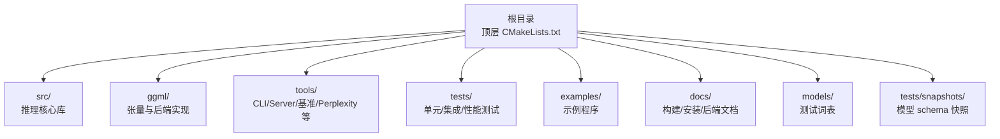
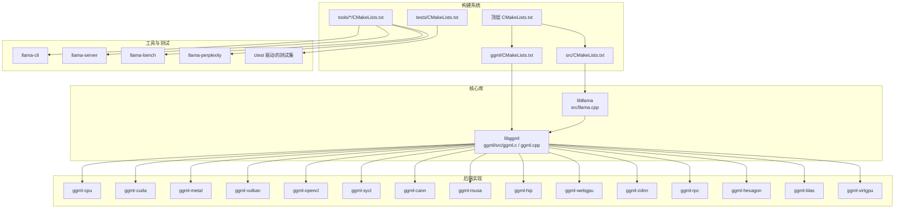
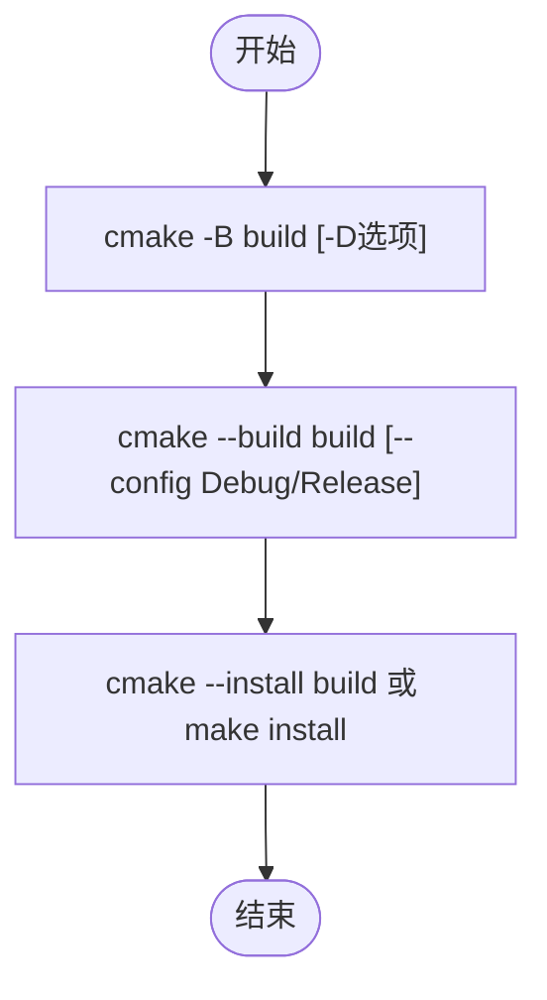
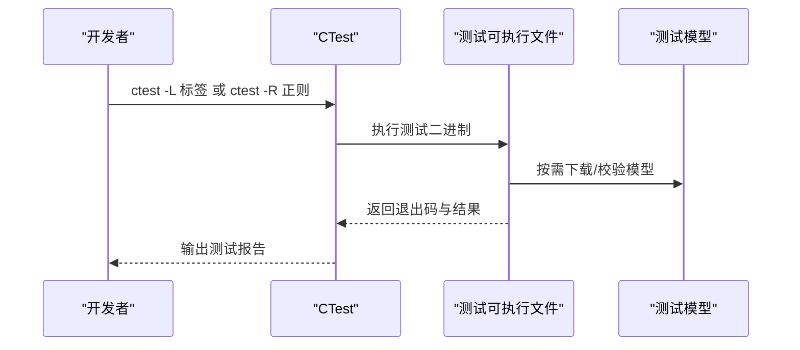
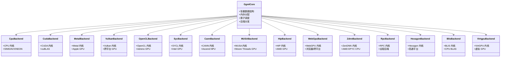
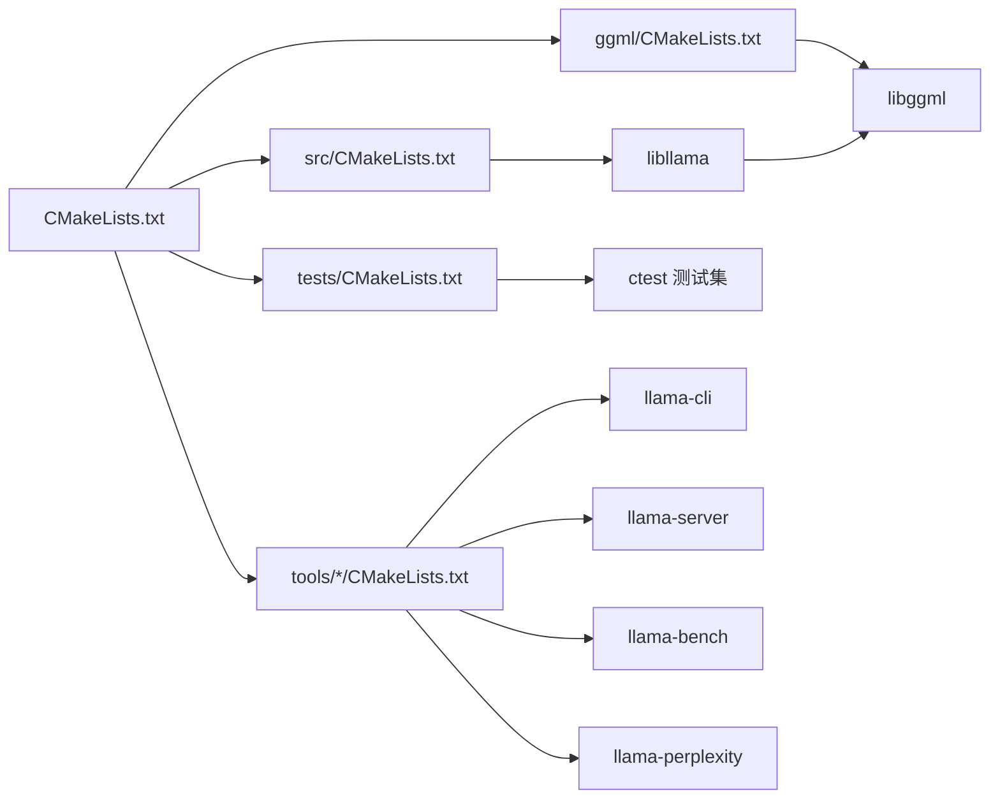

# 开发和测试

<cite>
**本文引用的文件**
- [CMakeLists.txt](file://CMakeLists.txt)
- [cmake/common.cmake](file://cmake/common.cmake)
- [tests/CMakeLists.txt](file://tests/CMakeLists.txt)
- [docs/build.md](file://docs/build.md)
- [docs/install.md](file://docs/install.md)
- [README.md](file://README.md)
- [CONTRIBUTING.md](file://CONTRIBUTING.md)
- [ci/README.md](file://ci/README.md)
- [scripts/debug-test.sh](file://scripts/debug-test.sh)
- [examples/simple/CMakeLists.txt](file://examples/simple/CMakeLists.txt)
- [examples/simple/simple.cpp](file://examples/simple/simple.cpp)
- [tools/llama-bench/CMakeLists.txt](file://tools/llama-bench/CMakeLists.txt)
- [tools/llama-bench/llama-bench.cpp](file://tools/llama-bench/llama-bench.cpp)
- [tools/perplexity/CMakeLists.txt](file://tools/perplexity/CMakeLists.txt)
- [tools/perplexity/perplexity.cpp](file://tools/perplexity/perplexity.cpp)
- [tools/server/CMakeLists.txt](file://tools/server/CMakeLists.txt)
- [tools/server/server.cpp](file://tools/server/server.cpp)
- [ggml/CMakeLists.txt](file://ggml/CMakeLists.txt)
- [ggml/include/ggml.h](file://ggml/include/ggml.h)
- [ggml/include/ggml-cpu.h](file://ggml/include/ggml-cpu.h)
- [ggml/include/ggml-cuda.h](file://ggml/include/ggml-cuda.h)
- [ggml/include/ggml-metal.h](file://ggml/include/ggml-metal.h)
- [ggml/include/ggml-vulkan.h](file://ggml/include/ggml-vulkan.h)
- [ggml/include/ggml-opencl.h](file://ggml/include/ggml-opencl.h)
- [ggml/include/ggml-sycl.h](file://ggml/include/ggml-sycl.h)
- [ggml/include/ggml-cann.h](file://ggml/include/ggml-cann.h)
- [ggml/include/ggml-zdnn.h](file://ggml/include/ggml-zdnn.h)
- [ggml/include/ggml-webgpu.h](file://ggml/include/ggml-webgpu.h)
- [ggml/include/ggml-virtgpu.h](file://ggml/include/ggml-virtgpu.h)
- [ggml/include/ggml-musa.h](file://ggml/include/ggml-musa.h)
- [ggml/include/ggml-hip.h](file://ggml/include/ggml-hip.h)
- [ggml/include/ggml-rpc.h](file://ggml/include/ggml-rpc.h)
- [ggml/include/ggml-opt.h](file://ggml/include/ggml-opt.h)
- [ggml/include/ggml-blas.h](file://ggml/include/ggml-blas.h)
- [ggml/include/ggml-hexagon.h](file://ggml/include/ggml-hexagon.h)
- [ggml/include/ggml-backend.h](file://ggml/include/ggml-backend.h)
- [ggml/src/ggml.c](file://ggml/src/ggml.c)
- [ggml/src/ggml.cpp](file://ggml/src/ggml.cpp)
- [ggml/src/ggml-cpu/ggml-cpu.c](file://ggml/src/ggml-cpu/ggml-cpu.c)
- [ggml/src/ggml-cpu/ggml-cpu.cpp](file://ggml/src/ggml-cpu/ggml-cpu.cpp)
- [ggml/src/ggml-cuda/ggml-cuda.c](file://ggml/src/ggml-cuda/ggml-cuda.c)
- [ggml/src/ggml-cuda/ggml-cuda.cpp](file://ggml/src/ggml-cuda/ggml-cuda.cpp)
- [ggml/src/ggml-vulkan/ggml-vulkan.c](file://ggml/src/ggml-vulkan/ggml-vulkan.c)
- [ggml/src/ggml-vulkan/ggml-vulkan.cpp](file://ggml/src/ggml-vulkan/ggml-vulkan.cpp)
- [ggml/src/ggml-opencl/ggml-opencl.c](file://ggml/src/ggml-opencl/ggml-opencl.c)
- [ggml/src/ggml-opencl/ggml-opencl.cpp](file://ggml/src/ggml-opencl/ggml-opencl.cpp)
- [ggml/src/ggml-sycl/ggml-sycl.c](file://ggml/src/ggml-sycl/ggml-sycl.c)
- [ggml/src/ggml-sycl/ggml-sycl.cpp](file://ggml/src/ggml-sycl/ggml-sycl.cpp)
- [ggml/src/ggml-cann/ggml-cann.c](file://ggml/src/ggml-cann/ggml-cann.c)
- [ggml/src/ggml-cann/ggml-cann.cpp](file://ggml/src/ggml-cann/ggml-cann.cpp)
- [ggml/src/ggml-zdnn/ggml-zdnn.c](file://ggml/src/ggml-zdnn/ggml-zdnn.c)
- [ggml/src/ggml-zdnn/ggml-zdnn.cpp](file://ggml/src/ggml-zdnn/ggml-zdnn.cpp)
- [ggml/src/ggml-webgpu/ggml-webgpu.c](file://ggml/src/ggml-webgpu/ggml-webgpu.c)
- [ggml/src/ggml-webgpu/ggml-webgpu.cpp](file://ggml/src/ggml-webgpu/ggml-webgpu.cpp)
- [ggml/src/ggml-virtgpu/ggml-virtgpu.c](file://ggml/src/ggml-virtgpu/ggml-virtgpu.c)
- [ggml/src/ggml-virtgpu/ggml-virtgpu.cpp](file://ggml/src/ggml-virtgpu/ggml-virtgpu.cpp)
- [ggml/src/ggml-musa/ggml-musa.c](file://ggml/src/ggml-musa/ggml-musa.c)
- [ggml/src/ggml-musa/ggml-musa.cpp](file://ggml/src/ggml-musa/ggml-musa.cpp)
- [ggml/src/ggml-hip/ggml-hip.c](file://ggml/src/ggml-hip/ggml-hip.c)
- [ggml/src/ggml-hip/ggml-hip.cpp](file://ggml/src/ggml-hip/ggml-hip.cpp)
- [ggml/src/ggml-rpc/ggml-rpc.c](file://ggml/src/ggml-rpc/ggml-rpc.c)
- [ggml/src/ggml-rpc/ggml-rpc.cpp](file://ggml/src/ggml-rpc/ggml-rpc.cpp)
- [ggml/src/ggml-blas/ggml-blas.c](file://ggml/src/ggml-blas/ggml-blas.c)
- [ggml/src/ggml-blas/ggml-blas.cpp](file://ggml/src/ggml-blas/ggml-blas.cpp)
- [ggml/src/ggml-hexagon/ggml-hexagon.c](file://ggml/src/ggml-hexagon/ggml-hexagon.c)
- [ggml/src/ggml-hexagon/ggml-hexagon.cpp](file://ggml/src/ggml-hexagon/ggml-hexagon.cpp)
- [src/CMakeLists.txt](file://src/CMakeLists.txt)
- [src/llama.cpp](file://src/llama.cpp)
- [src/llama.h](file://src/llama.h)
- [include/llama.h](file://include/llama.h)
- [include/llama-cpp.h](file://include/llama-cpp.h)
- [tests/testing.h](file://tests/testing.h)
- [tests/test-thread-safety.cpp](file://tests/test-thread-safety.cpp)
- [tests/test-llama-grammar.cpp](file://tests/test-llama-grammar.cpp)
- [tests/test-tokenizer-0.cpp](file://tests/test-tokenizer-0.cpp)
- [tests/test-tokenizer-1-bpe.cpp](file://tests/test-tokenizer-1-bpe.cpp)
- [tests/test-tokenizer-1-spm.cpp](file://tests/test-tokenizer-1-spm.cpp)
- [tests/test-arg-parser.cpp](file://tests/test-arg-parser.cpp)
- [tests/test-gguf.cpp](file://tests/test-gguf.cpp)
- [tests/test-backend-ops.cpp](file://tests/test-backend-ops.cpp)
- [tests/test-quantize-fns.cpp](file://tests/test-quantize-fns.cpp)
- [tests/test-quantize-perf.cpp](file://tests/test-quantize-perf.cpp)
- [tests/test-rope.cpp](file://tests/test-rope.cpp)
- [tests/test-model-load-cancel.cpp](file://tests/test-model-load-cancel.cpp)
- [tests/test-autorelease.cpp](file://tests/test-autorelease.cpp)
- [tests/test-backend-sampler.cpp](file://tests/test-backend-sampler.cpp)
- [tests/test-state-restore-fragmented.cpp](file://tests/test-state-restore-fragmented.cpp)
- [tests/test-alloc.cpp](file://tests/test-alloc.cpp)
- [tests/test-log.cpp](file://tests/test-log.cpp)
- [tests/test-json-partial.cpp](file://tests/test-json-partial.cpp)
- [tests/test-regex-partial.cpp](file://tests/test-regex-partial.cpp)
- [tests/test-peg-parser.cpp](file://tests/test-peg-parser.cpp)
- [tests/test-chat.cpp](file://tests/test-chat.cpp)
- [tests/test-chat-template.cpp](file://tests/test-chat-template.cpp)
- [tests/test-jinja.cpp](file://tests/test-jinja.cpp)
- [tests/test-chat-auto-parser.cpp](file://tests/test-chat-auto-parser.cpp)
- [tests/test-chat-peg-parser.cpp](file://tests/test-chat-peg-parser.cpp)
- [tests/test-json-schema-to-grammar.cpp](file://tests/test-json-schema-to-grammar.cpp)
- [tests/test-grammar-integration.cpp](file://tests/test-grammar-integration.cpp)
- [tests/test-llama-archs.cpp](file://tests/test-llama-archs.cpp)
- [tests/test-gbnf-validator.cpp](file://tests/test-gbnf-validator.cpp)
- [tests/test-grammar-parser.cpp](file://tests/test-grammar-parser.cpp)
- [tests/test-llama-grammar.cpp](file://tests/test-llama-grammar.cpp)
- [tests/test-sampling.cpp](file://tests/test-sampling.cpp)
- [tests/test-reasoning-budget.cpp](file://tests/test-reasoning-budget.cpp)
- [tests/test-opt.cpp](file://tests/test-opt.cpp)
- [tests/test-gguf-model-data.cpp](file://tests/test-gguf-model-data.cpp)
- [tests/test-quant-type-selection.cpp](file://tests/test-quant-type-selection.cpp)
- [tests/test-mtmd-c-api.c](file://tests/test-mtmd-c-api.c)
- [tests/test-c.c](file://tests/test-c.c)
- [tests/export-graph-ops.cpp](file://tests/export-graph-ops.cpp)
- [tests/get-model.cpp](file://tests/get-model.cpp)
- [tests/get-model.h](file://tests/get-model.h)
- [tests/snapshots/](file://tests/snapshots/)
- [tests/snapshots/qwen3-0.6b.schema](file://tests/snapshots/qwen3-0.6b.schema)
- [tests/snapshots/meta-llama-3.1-70b-instruct.schema](file://tests/snapshots/meta-llama-3.1-70b-instruct.schema)
- [tests/snapshots/gemma-3-4b-it.schema](file://tests/snapshots/gemma-3-4b-it.schema)
- [tests/snapshots/nemotron-nano-3-30b-a3b.schema](file://tests/snapshots/nemotron-nano-3-30b-a3b.schema)
- [tests/snapshots/glm-4.6v.schema](file://tests/snapshots/glm-4.6v.schema)
- [tests/snapshots/deepseek-v3.1.schema](file://tests/snapshots/deepseek-v3.1.schema)
- [tests/snapshots/gpt-oss-120b.schema](file://tests/snapshots/gpt-oss-120b.schema)
- [tests/snapshots/qwen3-coder-next.schema](file://tests/snapshots/qwen3-coder-next.schema)
- [tests/snapshots/qwen3.5-27b.schema](file://tests/snapshots/qwen3.5-27b.schema)
- [tests/snapshots/qwen3.5-397b-a17b.schema](file://tests/snapshots/qwen3.5-397b-a17b.schema)
- [tests/snapshots/step-3.5-flash.schema](file://tests/snapshots/step-3.5-flash.schema)
- [models/ggml-vocab-llama-bpe.gguf](file://models/ggml-vocab-llama-bpe.gguf)
- [models/ggml-vocab-llama-spm.gguf](file://models/ggml-vocab-llama-spm.gguf)
- [models/ggml-vocab-gemma-4.gguf](file://models/ggml-vocab-gemma-4.gguf)
- [models/ggml-vocab-qwen2.gguf](file://models/ggml-vocab-qwen2.gguf)
- [models/ggml-vocab-falcon.gguf](file://models/ggml-vocab-falcon.gguf)
- [models/ggml-vocab-gpt-2.gguf](file://models/ggml-vocab-gpt-2.gguf)
- [models/ggml-vocab-mpt.gguf](file://models/ggml-vocab-mpt.gguf)
- [models/ggml-vocab-phi-3.gguf](file://models/ggml-vocab-phi-3.gguf)
- [models/ggml-vocab-bert-bge.gguf](file://models/ggml-vocab-bert-bge.gguf)
- [models/ggml-vocab-command-r.gguf](file://models/ggml-vocab-command-r.gguf)
- [models/ggml-vocab-deepseek-coder.gguf](file://models/ggml-vocab-deepseek-coder.gguf)
- [models/ggml-vocab-deepseek-llm.gguf](file://models/ggml-vocab-deepseek-llm.gguf)
- [models/ggml-vocab-refact.gguf](file://models/ggml-vocab-refact.gguf)
- [models/ggml-vocab-starcoder.gguf](file://models/ggml-vocab-starcoder.gguf)
</cite>

## 目录
1. [简介](#简介)
2. [项目结构](#项目结构)
3. [核心组件](#核心组件)
4. [架构总览](#架构总览)
5. [详细组件分析](#详细组件分析)
6. [依赖关系分析](#依赖关系分析)
7. [性能考量](#性能考量)
8. [故障排查指南](#故障排查指南)
9. [结论](#结论)
10. [附录](#附录)

## 简介
本指南面向希望在本地搭建 llama.cpp 开发与测试环境的工程师与研究者，覆盖以下主题：
- 开发环境配置：编译器、构建工具、系统依赖与第三方库
- CMake 构建系统：常用选项、后端开关、安装与打包
- 测试框架：单元测试、集成测试、性能测试与模型下载机制
- 代码质量保障：静态分析、代码格式化、持续集成与自测
- 调试工具与最佳实践：常见问题定位、日志与断点策略
- 示例程序：从最小可运行到多模态与服务端
- 贡献流程：提交规范、评审与合并流程
- 版本管理与发布：版本号生成、安装目录与包配置

## 项目结构
llama.cpp 采用分层模块化组织：
- 根级 CMakeLists.txt 定义顶层构建目标、可选功能与安装规则
- src 子目录为推理核心库（libllama），对外暴露 C 接口
- ggml 子目录为张量计算与后端实现（CPU、CUDA、Metal、Vulkan、OpenCL、SYCL、CANN、MUSA、HIP、WebGPU、VirtGPU、BLIS、RPC、Hexagon 等）
- tools 子目录包含命令行工具与服务端（如 llama-cli、llama-server、llama-bench、llama-perplexity 等）
- tests 子目录包含全面的单元/集成/性能测试，并通过 CTest 驱动
- examples 子目录提供简单示例与 Swift/Android 等平台示例
- docs 子目录提供构建、安装与后端文档
- models 与 tests/snapshots 提供测试用词表与模型 schema 快照

**图表来源**
- [CMakeLists.txt](file://CMakeLists.txt)
- [src/CMakeLists.txt](file://src/CMakeLists.txt)
- [ggml/CMakeLists.txt](file://ggml/CMakeLists.txt)
- [tools/server/CMakeLists.txt](file://tools/server/CMakeLists.txt)
- [tests/CMakeLists.txt](file://tests/CMakeLists.txt)
- [examples/simple/CMakeLists.txt](file://examples/simple/CMakeLists.txt)

**章节来源**
- [CMakeLists.txt](file://CMakeLists.txt)
- [docs/build.md](file://docs/build.md)

## 核心组件
- 推理核心库（libllama）：位于 src，提供 C 接口与上下文管理、采样、KV 缓存、量化等能力
- 张量库（ggml）：位于 ggml，提供跨后端张量运算与优化内核
- 工具链：tools 下的 CLI、Server、llama-bench、llama-perplexity 等
- 测试套件：tests 下的各类测试，覆盖语法解析、采样、线程安全、量化、后端一致性等
- 示例：examples 下的最小示例与多平台示例

**章节来源**
- [src/CMakeLists.txt](file://src/CMakeLists.txt)
- [ggml/CMakeLists.txt](file://ggml/CMakeLists.txt)
- [tools/server/CMakeLists.txt](file://tools/server/CMakeLists.txt)
- [tests/CMakeLists.txt](file://tests/CMakeLists.txt)
- [examples/simple/CMakeLists.txt](file://examples/simple/CMakeLists.txt)

## 架构总览
下图展示从源码到可执行程序与库的关键路径，以及后端选择与链接关系。

**图表来源**
- [CMakeLists.txt](file://CMakeLists.txt)
- [src/CMakeLists.txt](file://src/CMakeLists.txt)
- [ggml/CMakeLists.txt](file://ggml/CMakeLists.txt)
- [tools/server/CMakeLists.txt](file://tools/server/CMakeLists.txt)
- [tests/CMakeLists.txt](file://tests/CMakeLists.txt)

## 详细组件分析

### CMake 构建系统与自定义选项
- 基本构建
  - 使用 CMake 生成构建系统并编译，支持单/多配置生成器与并行编译
  - 默认 Release 构建类型，可通过 -DCMAKE_BUILD_TYPE 指定 Debug/MinSizeRel/RelWithDebInfo
- 库与安装
  - 顶层安装规则将 libllama 与公共头文件安装至系统目录
  - 可通过 LLAMA_BUILD_* 选项控制是否构建 examples、tools、tests、server 等
- 后端与特性开关
  - 通过 GGML_* 选项启用对应后端（如 GGML_CUDA、GGML_METAL、GGML_VULKAN、GGML_OPENCL、GGML_SYCL、GGML_CANN、GGML_MUSA、GGML_HIP、GGML_WEBGPU、GGML_ZDNN、GGML_BLIS、GGML_RPC、GGML_HEXAGON、GGML_VIRTGPU）
  - 其他通用选项：LLAMA_ALL_WARNINGS、LLAMA_FATAL_WARNINGS、LLAMA_SANITIZE_*、LLAMA_OPENSSL、LLAMA_LLGUIDANCE 等
- 动态加载后端
  - 支持 GGML_BACKEND_DL 将后端作为动态库按需加载，便于跨硬件复用同一二进制
- 版本与打包
  - 通过 build-info 与 cmake/llama.pc.in 生成 pkg-config 文件与版本信息

**图表来源**
- [CMakeLists.txt](file://CMakeLists.txt)
- [docs/build.md](file://docs/build.md)

**章节来源**
- [CMakeLists.txt](file://CMakeLists.txt)
- [docs/build.md](file://docs/build.md)

### 测试框架结构与运行机制
- 测试组织
  - tests/CMakeLists.txt 定义统一的构建与注册函数（llama_build、llama_test、llama_build_and_test），并按标签与工作目录组织测试
  - 大部分测试以 add_test + CTest 驱动；部分测试通过 llama_build_and_test 一次性构建并注册
- 单元测试
  - 覆盖语法解析（PEG/Jinja）、聊天模板、日志、正则、JSON 片段、量化函数/性能、RoPE、线程安全、参数解析、GGUF、后端算子一致性、采样与推理预算等
- 集成测试
  - 包含模型加载取消、自动释放、状态恢复（分片 KV 缓存）、多模态 C-API 测试等
- 性能测试
  - 通过 llama-bench 进行吞吐/时延测量；配合模型下载脚本与快照 schema 验证
- 模型下载与缓存
  - tests/CMakeLists.txt 中通过 CMake 命令下载测试模型，使用 SHA256 校验，避免重复下载
- Python 相关测试
  - 部分测试通过外部脚本或 Python 组件验证（例如 Jinja）

**图表来源**
- [tests/CMakeLists.txt](file://tests/CMakeLists.txt)
- [tests/test-thread-safety.cpp](file://tests/test-thread-safety.cpp)
- [tests/test-gguf.cpp](file://tests/test-gguf.cpp)
- [tests/test-backend-ops.cpp](file://tests/test-backend-ops.cpp)
- [tests/test-quantize-fns.cpp](file://tests/test-quantize-fns.cpp)
- [tests/test-quantize-perf.cpp](file://tests/test-quantize-perf.cpp)
- [tests/test-rope.cpp](file://tests/test-rope.cpp)
- [tests/test-model-load-cancel.cpp](file://tests/test-model-load-cancel.cpp)
- [tests/test-autorelease.cpp](file://tests/test-autorelease.cpp)
- [tests/test-backend-sampler.cpp](file://tests/test-backend-sampler.cpp)
- [tests/test-state-restore-fragmented.cpp](file://tests/test-state-restore-fragmented.cpp)
- [tests/test-alloc.cpp](file://tests/test-alloc.cpp)
- [tests/test-log.cpp](file://tests/test-log.cpp)
- [tests/test-json-partial.cpp](file://tests/test-json-partial.cpp)
- [tests/test-regex-partial.cpp](file://tests/test-regex-partial.cpp)
- [tests/test-peg-parser.cpp](file://tests/test-peg-parser.cpp)
- [tests/test-chat.cpp](file://tests/test-chat.cpp)
- [tests/test-chat-template.cpp](file://tests/test-chat-template.cpp)
- [tests/test-jinja.cpp](file://tests/test-jinja.cpp)
- [tests/test-chat-auto-parser.cpp](file://tests/test-chat-auto-parser.cpp)
- [tests/test-chat-peg-parser.cpp](file://tests/test-chat-peg-parser.cpp)
- [tests/test-json-schema-to-grammar.cpp](file://tests/test-json-schema-to-grammar.cpp)
- [tests/test-grammar-integration.cpp](file://tests/test-grammar-integration.cpp)
- [tests/test-llama-archs.cpp](file://tests/test-llama-archs.cpp)
- [tests/test-gbnf-validator.cpp](file://tests/test-gbnf-validator.cpp)
- [tests/test-grammar-parser.cpp](file://tests/test-grammar-parser.cpp)
- [tests/test-llama-grammar.cpp](file://tests/test-llama-grammar.cpp)
- [tests/test-sampling.cpp](file://tests/test-sampling.cpp)
- [tests/test-reasoning-budget.cpp](file://tests/test-reasoning-budget.cpp)
- [tests/test-opt.cpp](file://tests/test-opt.cpp)
- [tests/test-gguf-model-data.cpp](file://tests/test-gguf-model-data.cpp)
- [tests/test-quant-type-selection.cpp](file://tests/test-quant-type-selection.cpp)
- [tests/test-mtmd-c-api.c](file://tests/test-mtmd-c-api.c)
- [tests/test-c.c](file://tests/test-c.c)
- [tests/export-graph-ops.cpp](file://tests/export-graph-ops.cpp)
- [tests/get-model.cpp](file://tests/get-model.cpp)
- [tests/get-model.h](file://tests/get-model.h)

**章节来源**
- [tests/CMakeLists.txt](file://tests/CMakeLists.txt)

### 后端与算子实现概览
- 后端接口与头文件
  - ggml/include 下包含各后端头文件（如 ggml-cpu.h、ggml-cuda.h、ggml-metal.h、ggml-vulkan.h、ggml-opencl.h、ggml-sycl.h、ggml-cann.h、ggml-musa.h、ggml-hip.h、ggml-webgpu.h、ggml-zdnn.h、ggml-virtgpu.h、ggml-blas.h、ggml-rpc.h、ggml-hexagon.h、ggml-backend.h 等）
- 关键实现文件
  - ggml/src 下对应后端源文件（如 ggml-cpu.c/.cpp、ggml-cuda.c/.cpp、ggml-vulkan.c/.cpp、ggml-opencl.c/.cpp、ggml-sycl.c/.cpp、ggml-cann.c/.cpp、ggml-musa.c/.cpp、ggml-hip.c/.cpp、ggml-webgpu.c/.cpp、ggml-zdnn.c/.cpp、ggml-virtgpu.c/.cpp、ggml-blas.c/.cpp、ggml-rpc.c/.cpp、ggml-hexagon.c/.cpp）
- 核心张量库
  - ggml/src/ggml.c / ggml.cpp 实现张量数据结构、内存分配、算子调度与后端分发

**图表来源**
- [ggml/include/ggml.h](file://ggml/include/ggml.h)
- [ggml/include/ggml-cpu.h](file://ggml/include/ggml-cpu.h)
- [ggml/include/ggml-cuda.h](file://ggml/include/ggml-cuda.h)
- [ggml/include/ggml-metal.h](file://ggml/include/ggml-metal.h)
- [ggml/include/ggml-vulkan.h](file://ggml/include/ggml-vulkan.h)
- [ggml/include/ggml-opencl.h](file://ggml/include/ggml-opencl.h)
- [ggml/include/ggml-sycl.h](file://ggml/include/ggml-sycl.h)
- [ggml/include/ggml-cann.h](file://ggml/include/ggml-cann.h)
- [ggml/include/ggml-musa.h](file://ggml/include/ggml-musa.h)
- [ggml/include/ggml-hip.h](file://ggml/include/ggml-hip.h)
- [ggml/include/ggml-webgpu.h](file://ggml/include/ggml-webgpu.h)
- [ggml/include/ggml-zdnn.h](file://ggml/include/ggml-zdnn.h)
- [ggml/include/ggml-virtgpu.h](file://ggml/include/ggml-virtgpu.h)
- [ggml/include/ggml-blas.h](file://ggml/include/ggml-blas.h)
- [ggml/include/ggml-rpc.h](file://ggml/include/ggml-rpc.h)
- [ggml/include/ggml-hexagon.h](file://ggml/include/ggml-hexagon.h)
- [ggml/include/ggml-backend.h](file://ggml/include/ggml-backend.h)
- [ggml/src/ggml.c](file://ggml/src/ggml.c)
- [ggml/src/ggml.cpp](file://ggml/src/ggml.cpp)

**章节来源**
- [ggml/CMakeLists.txt](file://ggml/CMakeLists.txt)
- [ggml/include/ggml.h](file://ggml/include/ggml.h)
- [ggml/src/ggml.c](file://ggml/src/ggml.c)
- [ggml/src/ggml.cpp](file://ggml/src/ggml.cpp)

### 示例程序分析与学习方法
- 最小示例（examples/simple）
  - 提供最简调用流程，适合初学者理解初始化、加载模型、生成文本的基本步骤
  - 通过 CMakeLists.txt 与 simple.cpp 展示如何链接 libllama 并运行
- Swift/Android/其他平台示例
  - examples 下包含 SwiftUI、Android 等示例工程，便于移植到移动端或桌面端
- 学习建议
  - 从 simple.cpp 出发，逐步增加对话模式、聊天模板、语法约束、嵌入/重排等高级功能
  - 对照 tests 中相关测试用例，验证行为一致性

**章节来源**
- [examples/simple/CMakeLists.txt](file://examples/simple/CMakeLists.txt)
- [examples/simple/simple.cpp](file://examples/simple/simple.cpp)

### 性能测试与基准
- llama-bench
  - 用于评估不同后端、线程数、上下文长度、批大小等条件下的吞吐与时延
  - 通过 CMake 配置与工具链编译，输出标准化表格
- llama-perplexity
  - 用于评估模型在给定文本上的困惑度等指标
- 自测建议
  - 在相同硬件与后端条件下多次运行，取均值与方差
  - 对比不同量化方案与后端实现的性能差异

**章节来源**
- [tools/llama-bench/CMakeLists.txt](file://tools/llama-bench/CMakeLists.txt)
- [tools/llama-bench/llama-bench.cpp](file://tools/llama-bench/llama-bench.cpp)
- [tools/perplexity/CMakeLists.txt](file://tools/perplexity/CMakeLists.txt)
- [tools/perplexity/perplexity.cpp](file://tools/perplexity/perplexity.cpp)

### 服务端与 WebUI
- llama-server
  - 提供 OpenAI 兼容的 HTTP 接口，支持并发、嵌入、重排、多模态等扩展
  - 通过 tools/server/CMakeLists.txt 构建，入口在 server.cpp
- WebUI
  - 可通过 LLAMA_BUILD_WEBUI 控制是否构建内置 WebUI

**章节来源**
- [tools/server/CMakeLists.txt](file://tools/server/CMakeLists.txt)
- [tools/server/server.cpp](file://tools/server/server.cpp)

## 依赖关系分析
- 顶层依赖
  - CMakeLists.txt 通过 add_subdirectory 引入 src、common、tests、examples、tools，并根据选项决定是否构建
  - 当未使用系统 ggml 时，通过 add_subdirectory(ggml) 构建 ggml 子树
- 库间关系
  - libllama 依赖 libggml；工具与测试分别链接 libllama 与 libllama-common
  - 后端实现作为 ggml 的子模块存在，通过编译选项启用
- 安装与打包
  - 顶层安装规则将 libllama 与公共头文件安装；同时生成 pkg-config 文件与版本文件

**图表来源**
- [CMakeLists.txt](file://CMakeLists.txt)
- [src/CMakeLists.txt](file://src/CMakeLists.txt)
- [ggml/CMakeLists.txt](file://ggml/CMakeLists.txt)
- [tests/CMakeLists.txt](file://tests/CMakeLists.txt)
- [tools/server/CMakeLists.txt](file://tools/server/CMakeLists.txt)

**章节来源**
- [CMakeLists.txt](file://CMakeLists.txt)

## 性能考量
- 后端选择
  - 不同后端在不同硬件上表现差异显著，建议优先尝试 Metal（Apple）、CUDA（NVIDIA）、Vulkan（跨平台 GPU）、OpenCL（Adreno）、SYCL（Intel GPU）、CANN/MUSA（国产 GPU）、HIP（AMD GPU）、WebGPU（浏览器/跨平台）等
- 环境变量与运行时参数
  - CUDA：CUDA_VISIBLE_DEVICES、CUDA_SCALE_LAUNCH_QUEUES、GGML_CUDA_* 系列环境变量
  - HIP：HIP_VISIBLE_DEVICES、HSA_OVERRIDE_GFX_VERSION
  - Vulkan：VK_ICD_FILENAMES、驱动选择
  - SYCL：oneAPI 环境变量与编译器
- 量化与内存
  - 选择合适的量化类型（如 Q4_0、Q4_K、Q5_K、BF16、FP16）平衡精度与显存/内存占用
- 线程与批处理
  - 合理设置线程数与上下文长度，避免过度并行导致的调度开销

[本节为通用指导，无需特定文件引用]

## 故障排查指南
- 常见问题定位
  - 线程安全测试失败：检查多线程共享资源访问与锁策略
  - 后端算子不一致：使用 test-backend-ops 对比不同后端输出
  - 量化函数异常：核对输入范围与边界条件，参考 test-quantize-fns.cpp 与 test-quantize-perf.cpp
  - RoPE 参数错误：核对 theta 与维度映射，参考 test-rope.cpp
  - 模型加载中断：使用 test-model-load-cancel.cpp 验证取消逻辑
  - 自动释放与状态恢复：参考 test-autorelease.cpp 与 test-state-restore-fragmented.cpp
- 日志与断点
  - 利用 tests/test-log.cpp 的日志机制辅助定位
  - 结合 CMake 的 -DCMAKE_BUILD_TYPE=Debug 与 IDE 断点进行调试
- 调试脚本
  - scripts/debug-test.sh 提供快速调试入口与参数组合

**章节来源**
- [tests/test-thread-safety.cpp](file://tests/test-thread-safety.cpp)
- [tests/test-backend-ops.cpp](file://tests/test-backend-ops.cpp)
- [tests/test-quantize-fns.cpp](file://tests/test-quantize-fns.cpp)
- [tests/test-quantize-perf.cpp](file://tests/test-quantize-perf.cpp)
- [tests/test-rope.cpp](file://tests/test-rope.cpp)
- [tests/test-model-load-cancel.cpp](file://tests/test-model-load-cancel.cpp)
- [tests/test-autorelease.cpp](file://tests/test-autorelease.cpp)
- [tests/test-state-restore-fragmented.cpp](file://tests/test-state-restore-fragmented.cpp)
- [tests/test-log.cpp](file://tests/test-log.cpp)
- [scripts/debug-test.sh](file://scripts/debug-test.sh)

## 结论
llama.cpp 提供了完善的开发与测试基础设施：清晰的 CMake 分层结构、丰富的后端实现、全面的测试矩阵与基准工具、便捷的示例程序与服务端。遵循本文档的环境搭建与测试流程，可在多平台上高效迭代与验证新功能与性能优化。

[本节为总结性内容，无需特定文件引用]

## 附录

### 开发环境搭建与安装
- 安装方式
  - 通过包管理器安装预构建版本（Windows 的 winget、Mac/Linux 的 Homebrew/MacPorts/Nix）
  - 从源码构建：参考 docs/build.md 的 CPU/BLAS/Metal/CUDA/Vulkan/... 后端构建说明
- 常用依赖
  - OpenSSL（HTTPS/TLS，可选）
  - 各后端对应的 SDK/驱动（CUDA、ROCm、MUSA、CANN、Vulkan SDK、oneAPI 等）
  - CMake、Ninja（可选，提升编译速度）
- 建议
  - 使用 ccache 加速重复编译
  - 在多配置生成器（如 Xcode/Visual Studio）下进行 Debug 构建

**章节来源**
- [docs/install.md](file://docs/install.md)
- [docs/build.md](file://docs/build.md)
- [README.md](file://README.md)

### 代码质量保证
- 静态分析与格式化
  - 使用 clang-tidy 与 clang-format（版本要求见 CONTRIBUTING.md）
  - 通过 .clang-tidy、.clang-format、.editorconfig 等配置文件统一风格
- 持续集成
  - ci/README.md 描述了自托管 CI 的使用方式，建议在推送前本地完整跑一遍
- 规范与评审
  - 遵循 CONTRIBUTING.md 的编码规范、命名约定与提交流程

**章节来源**
- [CONTRIBUTING.md](file://CONTRIBUTING.md)
- [ci/README.md](file://ci/README.md)

### 贡献流程与规范
- 提交前自检
  - 运行本地 CI（ci/run.sh）与性能/困惑度测试（llama-bench、llama-perplexity）
  - 若修改 ggml，补充或更新 test-backend-ops 测试
- 分支与 PR
  - 保持每个 PR 的原子性，复杂功能建议先开需求讨论
  - 允许维护者直接推送到你的分支以加速评审
- 合并
  - 维护者负责 squash 合并，提交标题格式有建议规范

**章节来源**
- [CONTRIBUTING.md](file://CONTRIBUTING.md)

### 版本管理与发布
- 版本号
  - 通过 build-info 与 cmake/llama.pc.in 生成版本号与 pkg-config 文件
- 安装目录
  - 顶层安装规则将头文件、库与二进制安装到 GNUInstallDirs 指定目录
- 发布
  - 通过 GitHub Releases 发布二进制与包

**章节来源**
- [CMakeLists.txt](file://CMakeLists.txt)