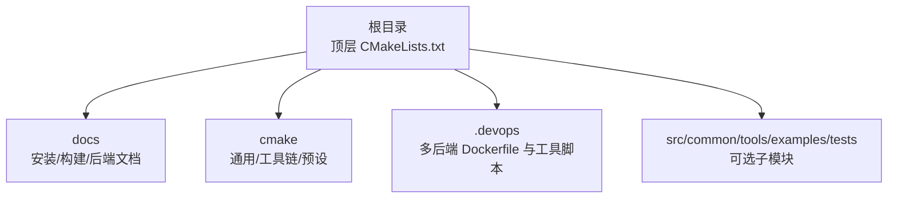
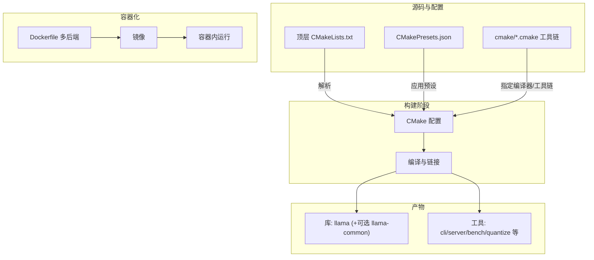
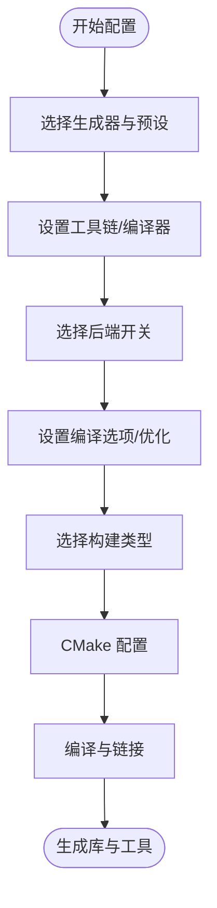
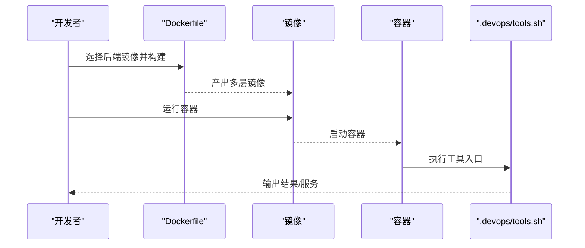
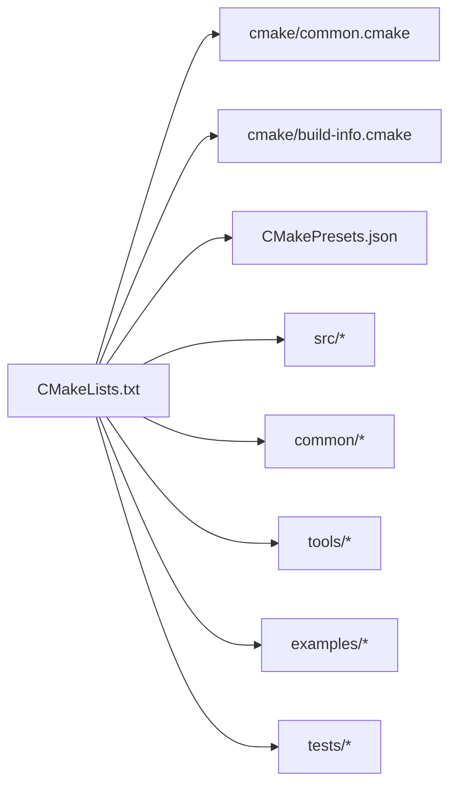

# 开发环境搭建

<cite>
**本文引用的文件**
- [README.md](file://README.md)
- [docs/build.md](file://docs/build.md)
- [docs/install.md](file://docs/install.md)
- [docs/docker.md](file://docs/docker.md)
- [CMakeLists.txt](file://CMakeLists.txt)
- [cmake/common.cmake](file://cmake/common.cmake)
- [cmake/build-info.cmake](file://cmake/build-info.cmake)
- [CMakePresets.json](file://CMakePresets.json)
- [cmake/x64-windows-llvm.cmake](file://cmake/x64-windows-llvm.cmake)
- [cmake/arm64-apple-clang.cmake](file://cmake/arm64-apple-clang.cmake)
- [cmake/arm64-windows-llvm.cmake](file://cmake/arm64-windows-llvm.cmake)
- [.devops/cpu.Dockerfile](file://.devops/cpu.Dockerfile)
- [.devops/cuda.Dockerfile](file://.devops/cuda.Dockerfile)
- [.devops/rocm.Dockerfile](file://.devops/rocm.Dockerfile)
- [.devops/intel.Dockerfile](file://.devops/intel.Dockerfile)
- [.devops/openvino.Dockerfile](file://.devops/openvino.Dockerfile)
- [.devops/vulkan.Dockerfile](file://.devops/vulkan.Dockerfile)
- [.devops/tools.sh](file://.devops/tools.sh)
</cite>

## 目录
1. [简介](#简介)
2. [项目结构](#项目结构)
3. [核心组件](#核心组件)
4. [架构总览](#架构总览)
5. [详细组件分析](#详细组件分析)
6. [依赖关系分析](#依赖关系分析)
7. [性能考量](#性能考量)
8. [故障排查指南](#故障排查指南)
9. [结论](#结论)
10. [附录](#附录)

## 简介
本指南面向希望在本地或容器环境中从源码构建 llama.cpp 的开发者，覆盖系统要求、前置条件、CMake 构建配置、跨平台安装步骤、IDE 集成与调试、容器化与虚拟环境、以及环境验证方法。文档内容均基于仓库中的官方构建与安装文档、CMake 脚本与预设、以及多平台 Dockerfile。

## 项目结构
llama.cpp 采用分层模块化组织：
- 根目录包含顶层 CMakeLists.txt、构建预设 CMakePresets.json、以及各平台/后端的 CMake 工具链脚本。
- docs 目录提供安装、构建与后端使用指南。
- .devops 目录提供多后端的 Dockerfile 与运行脚本，便于在容器中快速复现开发与运行环境。
- cmake 子目录包含通用编译选项、构建信息注入等公共逻辑。

章节来源
- [CMakeLists.txt:1-291](file://CMakeLists.txt#L1-L291)
- [CMakePresets.json:1-96](file://CMakePresets.json#L1-L96)

## 核心组件
- 构建系统：CMake（支持多生成器、多工具链、多后端开关）
- 后端矩阵：CPU、Metal、CUDA、HIP/ROCm、Vulkan、SYCL、CANN、OpenVINO、ZenDNN、KleidiAI、OpenCL 等
- 可选组件：HTTP 服务器、示例程序、测试、工具集
- 容器化：官方提供 CPU、CUDA、ROCm、Intel SYCL、OpenVINO、Vulkan 等多后端镜像

章节来源
- [docs/build.md:1-774](file://docs/build.md#L1-L774)
- [CMakeLists.txt:34-114](file://CMakeLists.txt#L34-L114)

## 架构总览
下图展示从源码到可执行产物的关键流程：CMake 解析顶层配置与预设，按后端开关编译对应模块，最终生成库与工具二进制；同时提供容器镜像以实现“即取即用”的开发/运行环境。

图表来源
- [CMakeLists.txt:1-291](file://CMakeLists.txt#L1-L291)
- [CMakePresets.json:1-96](file://CMakePresets.json#L1-L96)
- [.devops/cpu.Dockerfile:1-92](file://.devops/cpu.Dockerfile#L1-L92)
- [.devops/cuda.Dockerfile:1-98](file://.devops/cuda.Dockerfile#L1-L98)
- [.devops/rocm.Dockerfile:1-114](file://.devops/rocm.Dockerfile#L1-L114)
- [.devops/intel.Dockerfile:1-113](file://.devops/intel.Dockerfile#L1-L113)
- [.devops/openvino.Dockerfile:1-185](file://.devops/openvino.Dockerfile#L1-L185)
- [.devops/vulkan.Dockerfile:1-95](file://.devops/vulkan.Dockerfile#L1-L95)

## 详细组件分析

### 系统要求与前置条件
- 操作系统兼容性
  - Linux：广泛支持，建议使用较新发行版以获得更好的编译器与依赖包支持。
  - macOS：Apple Silicon 与 Intel 均可，Metal 默认启用；可选 Vulkan（需驱动与 SDK）。
  - Windows：MSVC 或 LLVM 工具链均可；ARM64 有专用工具链与预设。
- 编译器版本要求
  - CMake 版本：3.14–3.28（仓库声明）
  - GCC/G++：现代版本（示例 Dockerfile 使用 gcc-14）
  - Clang：推荐使用较新版本以获得完整特性支持
  - MSVC：Windows 上可用
  - oneAPI 编译器（icx/icpx）：用于 SYCL 后端
- 必需依赖
  - OpenSSL（可选，HTTPS/TLS 功能）
  - Vulkan SDK（可选，Vulkan 后端）
  - CUDA Toolkit（可选，NVIDIA GPU）
  - ROCm（可选，AMD GPU）
  - Intel oneAPI（可选，SYCL 后端）
  - OpenVINO（可选，Intel CPU/GPU/NPU）
  - 其他：BLAS 实现（OpenBLAS/BLIS/oneMKL）、OpenCL 头文件与 ICD 库（可选）

章节来源
- [CMakeLists.txt:1-20](file://CMakeLists.txt#L1-L20)
- [docs/build.md:67-87](file://docs/build.md#L67-L87)
- [docs/build.md:489-504](file://docs/build.md#L489-L504)
- [docs/build.md:149-156](file://docs/build.md#L149-L156)
- [docs/build.md:354-356](file://docs/build.md#L354-L356)
- [.devops/cpu.Dockerfile:8](file://.devops/cpu.Dockerfile#L8)
- [.devops/cuda.Dockerfile:14-17](file://.devops/cuda.Dockerfile#L14-L17)
- [.devops/rocm.Dockerfile:24-31](file://.devops/rocm.Dockerfile#L24-L31)
- [.devops/intel.Dockerfile:8-9](file://.devops/intel.Dockerfile#L8-L9)
- [.devops/openvino.Dockerfile:28-43](file://.devops/openvino.Dockerfile#L28-L43)
- [.devops/vulkan.Dockerfile:6-10](file://.devops/vulkan.Dockerfile#L6-L10)

### CMake 构建系统配置与自定义参数
- 基本构建
  - 单配置生成器（如 Unix Makefiles）：通过 -DCMAKE_BUILD_TYPE 指定 Debug/Release/RelWithDebInfo/MinSizeRel
  - 多配置生成器（如 Xcode/Visual Studio）：使用 -G 指定生成器并配合 --config
  - 并行编译：添加 -j 或使用 Ninja
  - 静态库：-DBUILD_SHARED_LIBS=OFF
- 后端开关（示例）
  - Metal：默认启用；禁用：-DGGML_METAL=OFF
  - CUDA：-DGGML_CUDA=ON
  - HIP/ROCm：-DGGML_HIP=ON，并设置 GPU_TARGETS 或 AMDGPU_TARGETS
  - Vulkan：-DGGML_VULKAN=ON
  - SYCL：-DGGML_SYCL=ON（可搭配 icx/icpx）
  - CANN：-DGGML_CANN=ON
  - OpenVINO：-DGGML_OPENVINO=ON
  - BLIS/oneMKL/OpenBLAS：-DGGML_BLAS=ON -DGGML_BLAS_VENDOR=...
  - KleidiAI：-DGGML_CPU_KLEIDIAI=ON
  - OpenCL：-DGGML_OPENCL=ON
- 编译器与工具链
  - Windows LLVM 工具链：通过 CMAKE_TOOLCHAIN_FILE 指向 cmake/x64-windows-llvm.cmake 或 cmake/arm64-windows-llvm.cmake
  - macOS Apple Clang：通过 cmake/arm64-apple-clang.cmake
  - oneAPI：设置 CMAKE_C_COMPILER=icx、CMAKE_CXX_COMPILER=icpx
- 预设（CMakePresets.json）
  - 提供常用组合：x64-linux-gcc、arm64-windows-llvm、arm64-apple-clang、x64-windows-llvm、x64-windows-sycl、x64-windows-vulkan 等
  - 预设自动设置生成器、编译器、后端开关与安装 RPATH
- 编译器标志与优化
  - 全警告：-DLLAMA_ALL_WARNINGS=ON（默认开启）
  - 将警告视为错误：-DLLAMA_FATAL_WARNINGS=ON
  - Sanitizer：-DLLAMA_SANITIZE_THREAD/ADDRESS/UNDEFINED=ON
  - 构建信息注入：通过 cmake/build-info.cmake 注入构建号、提交、编译器与目标平台信息

图表来源
- [CMakeLists.txt:34-114](file://CMakeLists.txt#L34-L114)
- [CMakeLists.txt:120-140](file://CMakeLists.txt#L120-L140)
- [cmake/common.cmake:3-58](file://cmake/common.cmake#L3-L58)
- [cmake/build-info.cmake:18-49](file://cmake/build-info.cmake#L18-L49)
- [CMakePresets.json:1-96](file://CMakePresets.json#L1-L96)

章节来源
- [CMakeLists.txt:34-114](file://CMakeLists.txt#L34-L114)
- [CMakeLists.txt:120-140](file://CMakeLists.txt#L120-L140)
- [cmake/common.cmake:3-58](file://cmake/common.cmake#L3-L58)
- [cmake/build-info.cmake:18-49](file://cmake/build-info.cmake#L18-L49)
- [CMakePresets.json:1-96](file://CMakePresets.json#L1-L96)

### 不同平台具体安装步骤

#### Linux
- 使用发行版包管理器安装依赖（示例：OpenSSL、BLAS、Vulkan 等）
- 使用 CMake 与 Ninja 或其他生成器进行构建
- 可选：使用官方 Dockerfile 在容器中构建与运行
- 常见后端：CUDA、ROCm、Vulkan、SYCL、OpenVINO、ZenDNN、KleidiAI、OpenCL

章节来源
- [docs/build.md:489-516](file://docs/build.md#L489-L516)
- [docs/build.md:354-356](file://docs/build.md#L354-L356)
- [docs/build.md:149-156](file://docs/build.md#L149-L156)
- [docs/build.md:354-356](file://docs/build.md#L354-L356)
- [docs/build.md:590-616](file://docs/build.md#L590-L616)
- [docs/build.md:618-642](file://docs/build.md#L618-L642)
- [docs/build.md:644-647](file://docs/build.md#L644-L647)
- [.devops/cpu.Dockerfile:8](file://.devops/cpu.Dockerfile#L8)
- [.devops/cuda.Dockerfile:14-17](file://.devops/cuda.Dockerfile#L14-L17)
- [.devops/rocm.Dockerfile:24-31](file://.devops/rocm.Dockerfile#L24-L31)
- [.devops/intel.Dockerfile:8-9](file://.devops/intel.Dockerfile#L8-L9)
- [.devops/openvino.Dockerfile:28-43](file://.devops/openvino.Dockerfile#L28-L43)
- [.devops/vulkan.Dockerfile:6-10](file://.devops/vulkan.Dockerfile#L6-L10)

#### macOS
- 默认启用 Metal；可通过命令行参数禁用 GPU 推理
- 可选启用 Vulkan（需 LunarG SDK 与驱动）
- 使用 Xcode 或 Ninja 生成器构建

章节来源
- [docs/build.md:132-137](file://docs/build.md#L132-L137)
- [docs/build.md:528-557](file://docs/build.md#L528-L557)

#### Windows
- MSVC 或 LLVM 工具链均可
- ARM64 有专用工具链与预设
- 可使用 CMake 预设简化配置

章节来源
- [docs/build.md:67-82](file://docs/build.md#L67-L82)
- [CMakePresets.json:34-57](file://CMakePresets.json#L34-L57)
- [cmake/x64-windows-llvm.cmake](file://cmake/x64-windows-llvm.cmake)
- [cmake/arm64-windows-llvm.cmake](file://cmake/arm64-windows-llvm.cmake)

### IDE 与开发工具链配置
- 生成编译数据库：CMAKE_EXPORT_COMPILE_COMMANDS=ON（预设已开启），便于 clangd/VS Code 等工具进行代码补全与跳转
- 预设统一配置：通过 CMakePresets.json 统一管理编译器、后端与构建类型
- 安装 RPATH：预设设置 $ORIGIN 与 $ORIGIN/..，便于运行时加载动态库
- 代码风格与静态检查：可结合 .clang-format/.clang-tidy（仓库提供相应文件）

章节来源
- [CMakePresets.json:7-12](file://CMakePresets.json#L7-L12)
- [CMakeLists.txt:8](file://CMakeLists.txt#L8)

### 虚拟环境与容器化
- 官方提供多后端 Dockerfile：CPU、CUDA、ROCm、Intel SYCL、OpenVINO、Vulkan
- 运行脚本 .devops/tools.sh 提供统一入口，支持转换模型、量化、运行、基准测试、服务等
- 容器镜像分层：基础运行时镜像 + 构建产物复制 + 可选 Python 环境

图表来源
- [.devops/cpu.Dockerfile:1-92](file://.devops/cpu.Dockerfile#L1-L92)
- [.devops/cuda.Dockerfile:1-98](file://.devops/cuda.Dockerfile#L1-L98)
- [.devops/rocm.Dockerfile:1-114](file://.devops/rocm.Dockerfile#L1-L114)
- [.devops/intel.Dockerfile:1-113](file://.devops/intel.Dockerfile#L1-L113)
- [.devops/openvino.Dockerfile:1-185](file://.devops/openvino.Dockerfile#L1-L185)
- [.devops/vulkan.Dockerfile:1-95](file://.devops/vulkan.Dockerfile#L1-L95)
- [.devops/tools.sh:1-54](file://.devops/tools.sh#L1-L54)

章节来源
- [.devops/cpu.Dockerfile:1-92](file://.devops/cpu.Dockerfile#L1-L92)
- [.devops/cuda.Dockerfile:1-98](file://.devops/cuda.Dockerfile#L1-L98)
- [.devops/rocm.Dockerfile:1-114](file://.devops/rocm.Dockerfile#L1-L114)
- [.devops/intel.Dockerfile:1-113](file://.devops/intel.Dockerfile#L1-L113)
- [.devops/openvino.Dockerfile:1-185](file://.devops/openvino.Dockerfile#L1-L185)
- [.devops/vulkan.Dockerfile:1-95](file://.devops/vulkan.Dockerfile#L1-L95)
- [.devops/tools.sh:1-54](file://.devops/tools.sh#L1-L54)

### 开发环境验证
- 基本验证
  - 成功编译：生成库与工具二进制
  - 运行示例：使用 llama-cli 加载模型进行推理
  - 服务器验证：启动 llama-server 并访问健康检查端点
- 后端验证
  - CUDA：查看设备列表与运行日志确认 GPU 使用
  - ROCm：确认 HIP/ROCm 设备可用
  - Vulkan：运行 vulkaninfo 并确认驱动与 ICD
  - SYCL：确认 oneAPI 环境变量与设备
  - OpenVINO：确认 OpenVINO 环境与驱动
- 容器验证
  - 使用 .devops/tools.sh 的 --run/--server/--bench 等子命令验证功能
  - 健康检查：容器内置 HEALTHCHECK（如服务器镜像）

章节来源
- [.devops/tools.sh:10-33](file://.devops/tools.sh#L10-L33)
- [docs/build.md:518-526](file://docs/build.md#L518-L526)
- [docs/build.md:508-510](file://docs/build.md#L508-L510)
- [.devops/cpu.Dockerfile:89](file://.devops/cpu.Dockerfile#L89)
- [.devops/cuda.Dockerfile:95](file://.devops/cuda.Dockerfile#L95)
- [.devops/rocm.Dockerfile:111](file://.devops/rocm.Dockerfile#L111)
- [.devops/intel.Dockerfile:111](file://.devops/intel.Dockerfile#L111)
- [.devops/openvino.Dockerfile:182](file://.devops/openvino.Dockerfile#L182)
- [.devops/vulkan.Dockerfile:92](file://.devops/vulkan.Dockerfile#L92)

## 依赖关系分析
- 顶层 CMakeLists.txt 控制构建开关与模块装配，调用 cmake/common.cmake 注入编译选项，使用 cmake/build-info.cmake 注入构建信息
- CMakePresets.json 提供标准化的配置组合，减少手工参数输入
- 各后端通过独立的 CMake 选项与工具链脚本集成，支持动态加载后端库（GGML_BACKEND_DL）

图表来源
- [CMakeLists.txt:120-140](file://CMakeLists.txt#L120-L140)
- [cmake/common.cmake:1](file://cmake/common.cmake#L1)
- [cmake/build-info.cmake:18-49](file://cmake/build-info.cmake#L18-L49)
- [CMakePresets.json:1-96](file://CMakePresets.json#L1-L96)

章节来源
- [CMakeLists.txt:120-140](file://CMakeLists.txt#L120-L140)
- [cmake/common.cmake:1-59](file://cmake/common.cmake#L1-L59)
- [cmake/build-info.cmake:18-49](file://cmake/build-info.cmake#L18-L49)
- [CMakePresets.json:1-96](file://CMakePresets.json#L1-L96)

## 性能考量
- 编译器与优化
  - 使用 Ninja 与并行编译提升速度
  - ccache 可显著加速重复编译
  - 合理设置 -DCMAKE_BUILD_TYPE 与 -DLLAMA_ALL_WARNINGS/-DLLAMA_FATAL_WARNINGS
- 后端选择
  - GPU 后端（CUDA/ROCm/Vulkan/SYCL）可显著提升吞吐，但需注意驱动与运行时环境变量
  - Metal 在 macOS 上默认启用，适合 Apple Silicon
- 运行时参数
  - CUDA：可调整 CUDA_VISIBLE_DEVICES、CUDA_SCALE_LAUNCH_QUEUES、统一内存等
  - ROCm：可启用 P2P、统一内存（UMA）
  - Vulkan：确保驱动与 ICD 正确安装
  - SYCL：根据硬件选择合适的计算精度与设备

章节来源
- [docs/build.md:42-60](file://docs/build.md#L42-L60)
- [docs/build.md:257-289](file://docs/build.md#L257-L289)
- [docs/build.md:389-403](file://docs/build.md#L389-L403)
- [docs/build.md:508-526](file://docs/build.md#L508-L526)
- [docs/build.md:115-126](file://docs/build.md#L115-L126)

## 故障排查指南
- CMake 版本不匹配
  - 确保 CMake 在 3.14–3.28 范围内
- 缺少依赖
  - OpenSSL：安装 libssl-dev 或 openssl-devel
  - Vulkan：安装 libvulkan-dev、glslc、spirv-headers
  - CUDA：确认 nvcc 可用与驱动匹配
  - ROCm：确认 HIP/ROCm 安装与设备库路径
  - SYCL：确认 oneAPI 环境变量与 icx/icpx
- 编译器问题
  - Windows LLVM 工具链：使用 cmake/x64-windows-llvm.cmake 或 cmake/arm64-windows-llvm.cmake
  - macOS：使用 cmake/arm64-apple-clang.cmake
- 运行时问题
  - CUDA：检查 CUDA_VISIBLE_DEVICES、统一内存、P2P 设置
  - Vulkan：运行 vulkaninfo 确认驱动与 ICD
  - OpenVINO：确认 OpenVINO 环境变量与驱动安装

章节来源
- [CMakeLists.txt:1-20](file://CMakeLists.txt#L1-L20)
- [docs/build.md:84-86](file://docs/build.md#L84-L86)
- [docs/build.md:489-504](file://docs/build.md#L489-L504)
- [docs/build.md:149-156](file://docs/build.md#L149-L156)
- [docs/build.md:354-356](file://docs/build.md#L354-L356)
- [docs/build.md:508-510](file://docs/build.md#L508-L510)
- [docs/build.md:257-289](file://docs/build.md#L257-L289)

## 结论
通过 CMake 预设与工具链脚本，llama.cpp 支持在多平台、多后端环境下高效构建与运行。结合官方 Dockerfile 与工具脚本，开发者可以快速搭建一致的开发/运行环境，并通过容器化实现跨平台复用。建议优先使用预设与容器镜像，再根据需要微调后端与编译选项。

## 附录
- 快速开始（本地构建）
  - 克隆仓库并进入目录
  - 使用 CMake 预设或手动配置后端
  - 使用 Ninja 或其他生成器编译
- 快速开始（容器）
  - 选择对应后端 Dockerfile 并构建镜像
  - 使用 .devops/tools.sh 进行模型转换/量化/运行/服务

章节来源
- [docs/install.md:1-51](file://docs/install.md#L1-L51)
- [docs/build.md:33-60](file://docs/build.md#L33-L60)
- [.devops/tools.sh:10-33](file://.devops/tools.sh#L10-L33)