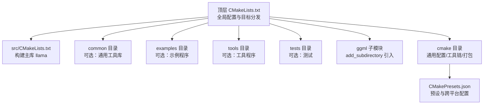
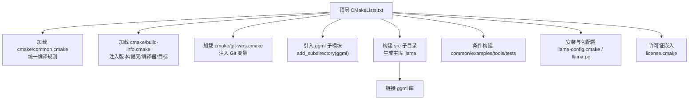
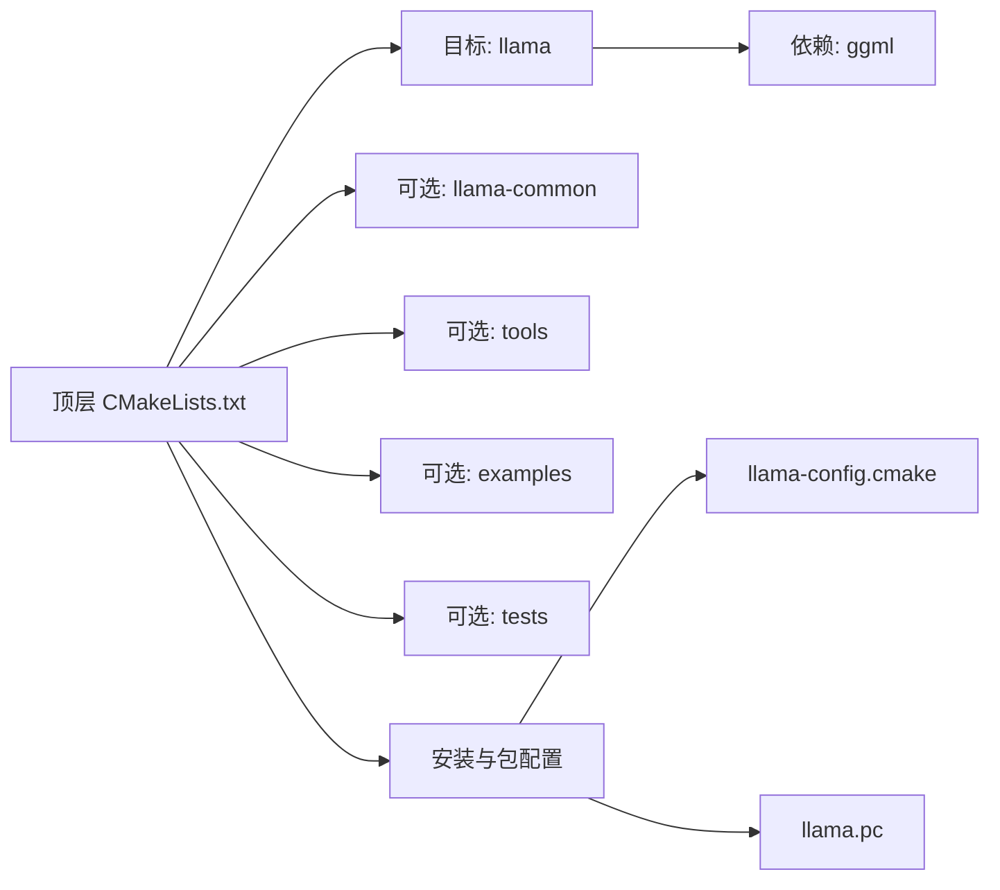
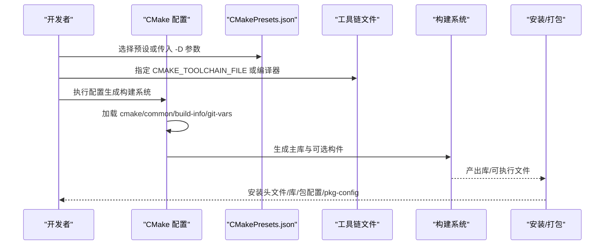

# 构建系统详解

<cite>
**本文引用的文件**
- [CMakeLists.txt](file://CMakeLists.txt)
- [CMakePresets.json](file://CMakePresets.json)
- [Makefile](file://Makefile)
- [cmake/common.cmake](file://cmake/common.cmake)
- [cmake/build-info.cmake](file://cmake/build-info.cmake)
- [cmake/git-vars.cmake](file://cmake/git-vars.cmake)
- [cmake/license.cmake](file://cmake/license.cmake)
- [cmake/llama-config.cmake.in](file://cmake/llama-config.cmake.in)
- [cmake/x64-windows-llvm.cmake](file://cmake/x64-windows-llvm.cmake)
- [cmake/arm64-apple-clang.cmake](file://cmake/arm64-apple-clang.cmake)
- [cmake/arm64-linux-clang.cmake](file://cmake/arm64-linux-clang.cmake)
- [cmake/riscv64-spacemit-linux-gnu-gcc.cmake](file://cmake/riscv64-spacemit-linux-gnu-gcc.cmake)
- [src/CMakeLists.txt](file://src/CMakeLists.txt)
- [ggml/cmake/common.cmake](file://ggml/cmake/common.cmake)
</cite>

## 目录
1. [简介](#简介)
2. [项目结构](#项目结构)
3. [核心组件](#核心组件)
4. [架构总览](#架构总览)
5. [详细组件分析](#详细组件分析)
6. [依赖关系分析](#依赖关系分析)
7. [性能考量](#性能考量)
8. [故障排除指南](#故障排除指南)
9. [结论](#结论)
10. [附录](#附录)

## 简介
本文件深入解析 llama.cpp 的构建系统架构与使用方法，覆盖 CMake 配置项与变量、编译器检测、后端选择、优化与调试配置、构建目标与产物生成、跨平台与交叉编译支持、构建脚本与自定义流程、构建缓存与增量构建机制，并提供常见问题排查与性能优化建议。文档面向不同技术背景的读者，既提供高层概览也包含代码级细节。

## 项目结构
llama.cpp 的构建系统以 CMake 为核心，顶层 CMakeLists.txt 负责全局配置与目标分发；src 子目录构建主库；common、examples、tools、tests 等子目录在相应开关开启时参与构建；cmake 目录提供通用配置、工具链与打包安装逻辑；ggml 子模块通过 add_subdirectory 引入并作为公共依赖。

图表来源
- [CMakeLists.txt:1-291](file://CMakeLists.txt#L1-L291)
- [src/CMakeLists.txt:1-61](file://src/CMakeLists.txt#L1-L61)

章节来源
- [CMakeLists.txt:1-291](file://CMakeLists.txt#L1-L291)
- [CMakePresets.json:1-96](file://CMakePresets.json#L1-L96)

## 核心组件
- 全局配置与开关
  - 构建类型与输出路径：默认 Release，统一运行时与库输出目录。
  - 选项体系：调试与警告、Sanitizer、共享库、工具与示例、服务端与 WebUI、第三方库（如 OpenSSL）等。
  - 版本与构建信息：通过 build-info 与 git-vars 注入版本号、提交号、编译器与目标平台信息。
- 通用编译规则
  - 统一添加编译标志与 Sanitizer，按编译器差异化处理。
  - 将 ggml 的警告与错误策略继承到 llama。
- 主库构建
  - 汇总源文件，设置版本、SOVERSION、编译特性与链接依赖（ggml）。
- 安装与包配置
  - 安装头文件与库，生成 CMake 包配置与 pkg-config 文件，支持外部项目 find_package(llama)。
- 许可证嵌入
  - 自动聚合许可证文本并嵌入目标，便于分发合规。

章节来源
- [CMakeLists.txt:10-131](file://CMakeLists.txt#L10-L131)
- [cmake/common.cmake:1-59](file://cmake/common.cmake#L1-L59)
- [cmake/build-info.cmake:1-49](file://cmake/build-info.cmake#L1-L49)
- [cmake/git-vars.cmake:1-23](file://cmake/git-vars.cmake#L1-L23)
- [src/CMakeLists.txt:11-61](file://src/CMakeLists.txt#L11-L61)
- [cmake/license.cmake:1-41](file://cmake/license.cmake#L1-L41)

## 架构总览
下图展示从顶层配置到各子模块的构建流程与依赖关系：

图表来源
- [CMakeLists.txt:120-187](file://CMakeLists.txt#L120-L187)
- [src/CMakeLists.txt:54-54](file://src/CMakeLists.txt#L54-L54)

## 详细组件分析

### 1) 全局配置与选项体系
- 构建类型与默认值
  - 非 Xcode/MSVC 且未指定时，默认 Release；提供 Debug/Release/MinSizeRel/RelWithDebInfo 供选择。
- 输出目录
  - 运行时与库统一输出至二进制目录下的 bin。
- 平台与编译器差异
  - Windows 定义安全宏；MSVC 启用 UTF-8 与大对象支持。
  - Emscripten 下启用内存增长与可选 HTML 输出，支持 64 位内存模式。
- 选项清单（节选）
  - 警告与错误：LLAMA_ALL_WARNINGS、LLAMA_ALL_WARNINGS_3RD_PARTY、LLAMA_FATAL_WARNINGS。
  - Sanitizer：LLAMA_SANITIZE_THREAD、LLAMA_SANITIZE_ADDRESS、LLAMA_SANITIZE_UNDEFINED。
  - 构件：LLAMA_BUILD_COMMON、LLAMA_BUILD_TESTS、LLAMA_BUILD_TOOLS、LLAMA_BUILD_EXAMPLES、LLAMA_BUILD_SERVER、LLAMA_BUILD_WEBUI、LLAMA_TOOLS_INSTALL、LLAMA_TESTS_INSTALL。
  - 第三方：LLAMA_OPENSSL、LLAMA_LLGUIDANCE。
  - 兼容性过渡：对旧选项进行提示与映射。
- ggml 选项继承
  - 继承警告与错误策略；为 ggml 的特定选项设置默认值（如 llamafile、cuda graphs）。

章节来源
- [CMakeLists.txt:10-131](file://CMakeLists.txt#L10-L131)
- [CMakeLists.txt:132-167](file://CMakeLists.txt#L132-L167)

### 2) 编译器检测与统一规则
- 统一函数
  - llama_add_compile_flags：根据编译器 ID 添加 Werror、警告集与 Sanitizer；MSVC 使用 /WX。
  - ggml_get_flags：按编译器注入额外标志（由 ggml/cmake/common.cmake 提供）。
- 作用域
  - 通过生成器表达式对 C/C++ 分别应用编译选项，确保兼容性。

章节来源
- [cmake/common.cmake:1-59](file://cmake/common.cmake#L1-L59)
- [ggml/cmake/common.cmake:1-200](file://ggml/cmake/common.cmake#L1-L200)

### 3) 构建信息与版本注入
- build-info.cmake
  - 通过 Git 获取短提交号与构建序号；记录编译器与目标平台信息。
- git-vars.cmake
  - 注入当前提交的 SHA1、本地日期与主题，便于诊断与追踪。
- 版本号
  - 基于构建序号生成安装版本号，用于包管理与 ABI 兼容。

章节来源
- [cmake/build-info.cmake:1-49](file://cmake/build-info.cmake#L1-L49)
- [cmake/git-vars.cmake:1-23](file://cmake/git-vars.cmake#L1-L23)
- [CMakeLists.txt:124-130](file://CMakeLists.txt#L124-L130)

### 4) 主库构建（src）
- 目标与属性
  - 目标名：llama；设置版本与 SOVERSION；在共享库模式下启用位置无关代码并定义构建宏。
- 源码组织
  - 聚合 include/llama.h 与多个实现文件；动态收集 models/*.cpp。
- 依赖与接口
  - 链接 ggml；公开 include 目录；声明 C++17 特性。
- 产物
  - 生成库文件，安装头文件与库；通过 CMake 包配置导出。

章节来源
- [src/CMakeLists.txt:11-61](file://src/CMakeLists.txt#L11-L61)
- [CMakeLists.txt:242-250](file://CMakeLists.txt#L242-L250)

### 5) 工具与示例构建
- 条件构建
  - LLAMA_BUILD_COMMON 控制 common 与第三方（如 cpp-httplib）是否加入。
  - LLAMA_BUILD_TESTS、LLAMA_BUILD_EXAMPLES、LLAMA_BUILD_TOOLS 决定 tests、examples、tools 是否构建。
- 安装策略
  - 工具与测试的安装可通过对应开关控制；服务端与 WebUI 可独立开关。

章节来源
- [CMakeLists.txt:199-216](file://CMakeLists.txt#L199-L216)

### 6) 安装与包配置
- GNUInstallDirs：标准化安装目录变量。
- CMakePackageConfigHelpers：生成 llama-config.cmake，导出头文件与库目录、查找 ggml。
- pkg-config：生成 llama.pc，便于传统工具链集成。
- Python 转换脚本：随可执行文件一起安装，便于模型转换。

章节来源
- [CMakeLists.txt:235-291](file://CMakeLists.txt#L235-L291)
- [cmake/llama-config.cmake.in:1-31](file://cmake/llama-config.cmake.in#L1-L31)

### 7) 许可证嵌入
- license.cmake
  - 聚合 licenses/* 到全局属性，生成 license.cpp 并注入目标，便于分发时嵌入许可证列表。

章节来源
- [cmake/license.cmake:1-41](file://cmake/license.cmake#L1-L41)
- [CMakeLists.txt:218-230](file://CMakeLists.txt#L218-L230)

### 8) 跨平台与工具链
- 预设（CMakePresets.json）
  - 提供 Ninja 生成器、构建类型、静态库开关、后端开关（如 Vulkan、SYCL）等常用组合。
  - 针对 Windows/Apple/Linux 的 LLVM/Clang 工具链预设，以及 MSVC 预设。
- 手工工具链文件
  - x64-windows-llvm.cmake：Windows 上使用 Clang。
  - arm64-apple-clang.cmake：Darwin arm64，设置编译器目标与架构/警告标志。
  - arm64-linux-clang.cmake：Linux arm64，设置编译器目标与架构/警告标志。
  - riscv64-spacemit-linux-gnu-gcc.cmake：RISC-V 交叉编译，要求环境变量 RISCV_ROOT_PATH。
- 通用规则
  - 通过 CMAKE_TOOLCHAIN_FILE 指定工具链文件，或直接设置 C/C++ 编译器。

章节来源
- [CMakePresets.json:1-96](file://CMakePresets.json#L1-L96)
- [cmake/x64-windows-llvm.cmake:1-6](file://cmake/x64-windows-llvm.cmake#L1-L6)
- [cmake/arm64-apple-clang.cmake:1-17](file://cmake/arm64-apple-clang.cmake#L1-L17)
- [cmake/arm64-linux-clang.cmake:1-18](file://cmake/arm64-linux-clang.cmake#L1-L18)
- [cmake/riscv64-spacemit-linux-gnu-gcc.cmake:1-30](file://cmake/riscv64-spacemit-linux-gnu-gcc.cmake#L1-L30)

### 9) 构建目标与产物
- 主库：llama（含 models/*.cpp 动态聚合），安装头文件与库。
- 工具与示例：在开关开启时构建并可安装。
- 测试：在开启 common 与 tests 且非 JS 环境时构建。
- 包配置：llama-config.cmake、llama.pc、安装脚本 convert_hf_to_gguf.py。

章节来源
- [src/CMakeLists.txt:9-42](file://src/CMakeLists.txt#L9-L42)
- [CMakeLists.txt:199-216](file://CMakeLists.txt#L199-L216)
- [CMakeLists.txt:264-291](file://CMakeLists.txt#L264-L291)

### 10) 构建缓存与增量构建
- CMAKE_EXPORT_COMPILE_COMMANDS：导出 compile_commands.json，提升编辑器体验与调试效率。
- 预设中的缓存变量：集中管理构建类型、后端开关、工具链等，便于复用与增量更新。
- Ninja 生成器：默认预设使用 Ninja，具备良好的增量构建与并行能力。

章节来源
- [CMakeLists.txt:8](file://CMakeLists.txt#L8)
- [CMakePresets.json:7](file://CMakePresets.json#L7)

### 11) 使用方法与自定义流程
- 基本步骤
  - 选择预设（如 x64-linux-gcc-release 或 arm64-apple-clang-release）。
  - 指定工具链文件（如 CMAKE_TOOLCHAIN_FILE）或直接设置编译器。
  - 开启所需功能（如 Vulkan、SYCL、WebUI、Tests、Tools、Examples）。
- 自定义
  - 通过 CMakePresets.json 扩展新预设，或直接传入 -D 开关覆盖默认值。
  - 在 src/common/tools/examples/tests 的 CMakeLists.txt 中按需增删目标。

章节来源
- [CMakePresets.json:1-96](file://CMakePresets.json#L1-L96)
- [CMakeLists.txt:176-187](file://CMakeLists.txt#L176-L187)

## 依赖关系分析

图表来源
- [src/CMakeLists.txt:54-54](file://src/CMakeLists.txt#L54-L54)
- [CMakeLists.txt:199-216](file://CMakeLists.txt#L199-L216)
- [CMakeLists.txt:256-291](file://CMakeLists.txt#L256-L291)

章节来源
- [src/CMakeLists.txt:54-54](file://src/CMakeLists.txt#L54-L54)
- [CMakeLists.txt:176-187](file://CMakeLists.txt#L176-L187)

## 性能考量
- 优化与调试
  - 默认 Release；可切换 RelWithDebInfo 获取调试符号与优化兼顾。
  - 通过 LLAMA_ALL_WARNINGS 与 LLAMA_FATAL_WARNINGS 提升代码质量，减少潜在性能隐患。
- 后端与加速
  - 预设中包含 Vulkan、SYCL 等后端开关，按需启用可获得硬件加速收益。
- 并行与工具链
  - Ninja 生成器与多核编译提升构建速度；MSVC 多工具任务与进程计数在独立模式下启用。
- Sanitizer
  - Address/Thread/Undefined Sanitizer 可帮助定位问题，但会带来运行时开销，建议仅在开发与调试阶段启用。

章节来源
- [CMakeLists.txt:10-13](file://CMakeLists.txt#L10-L13)
- [CMakeLists.txt:92-101](file://CMakeLists.txt#L92-L101)
- [CMakePresets.json:23-32](file://CMakePresets.json#L23-L32)
- [CMakeLists.txt:77-79](file://CMakeLists.txt#L77-L79)

## 故障排除指南
- 构建系统变更提示
  - 顶层 Makefile 已弃用，改用 CMake；请参考官方构建文档。
- Git 信息缺失
  - 若未找到 Git，构建信息可能不准确；可在 CI 环境中显式提供 Git 可执行路径。
- 交叉编译失败
  - RISC-V 交叉编译需设置 RISCV_ROOT_PATH；确认工具链三元组与 sysroot 配置正确。
- Sanitizer 报错
  - 启用 Sanitizer 后链接器需支持对应运行时；确保编译器与运行时一致。
- 预设冲突
  - 不同预设的缓存变量可能相互覆盖；建议明确指定所需预设或使用 -D 显式覆盖。

章节来源
- [Makefile:6-9](file://Makefile#L6-L9)
- [cmake/build-info.cmake:8-16](file://cmake/build-info.cmake#L8-L16)
- [cmake/riscv64-spacemit-linux-gnu-gcc.cmake:9-21](file://cmake/riscv64-spacemit-linux-gnu-gcc.cmake#L9-L21)
- [cmake/common.cmake:36-57](file://cmake/common.cmake#L36-L57)
- [CMakePresets.json:9-12](file://CMakePresets.json#L9-L12)

## 结论
llama.cpp 的构建系统以 CMake 为中心，通过统一的编译规则、灵活的选项体系与丰富的跨平台工具链支持，实现了从单机开发到多平台部署的一体化构建流程。借助预设与缓存变量，用户可以快速定制构建配置；通过安装与包配置文件，外部项目可无缝集成。建议在开发阶段启用严格警告与 Sanitizer，在发布阶段采用 Release 并按需启用硬件后端以获得最佳性能。

## 附录
- 关键流程示意（从配置到产物）

图表来源
- [CMakePresets.json:1-96](file://CMakePresets.json#L1-L96)
- [CMakeLists.txt:120-131](file://CMakeLists.txt#L120-L131)
- [src/CMakeLists.txt:11-61](file://src/CMakeLists.txt#L11-L61)
- [CMakeLists.txt:256-291](file://CMakeLists.txt#L256-L291)