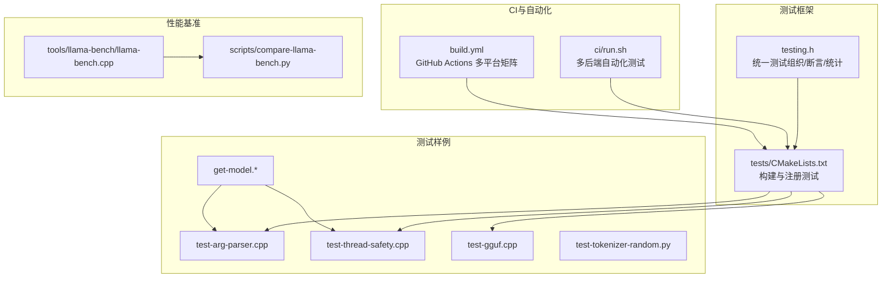
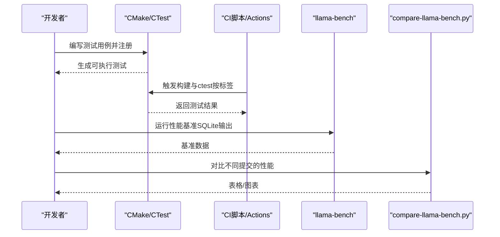
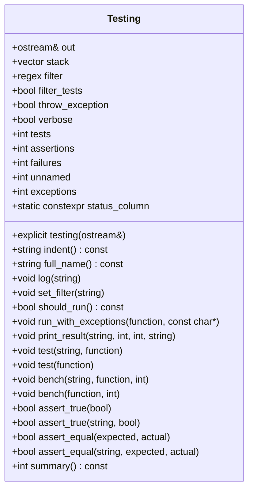
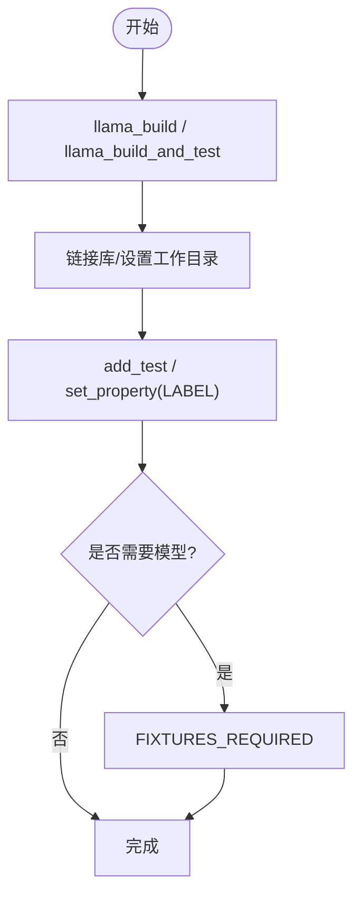
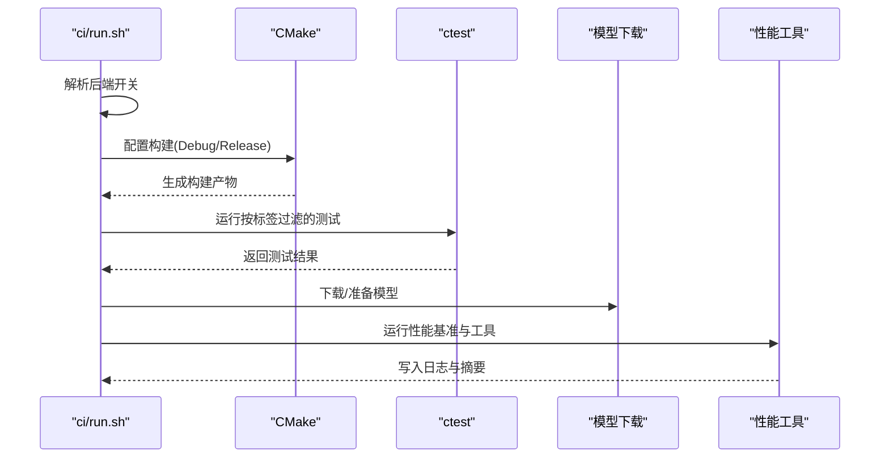
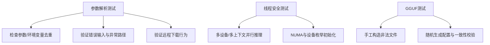
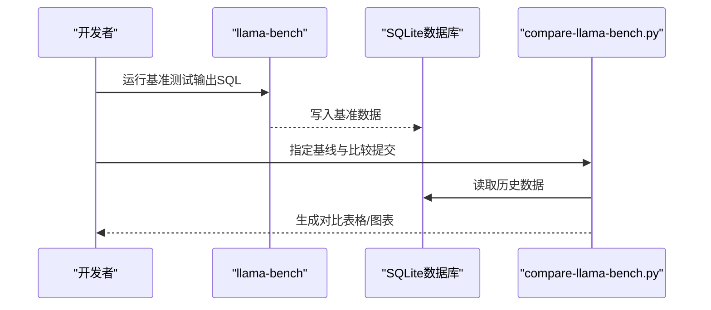
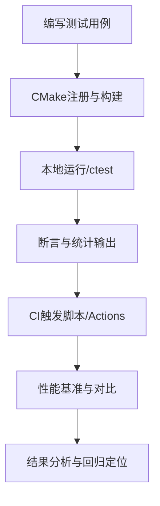
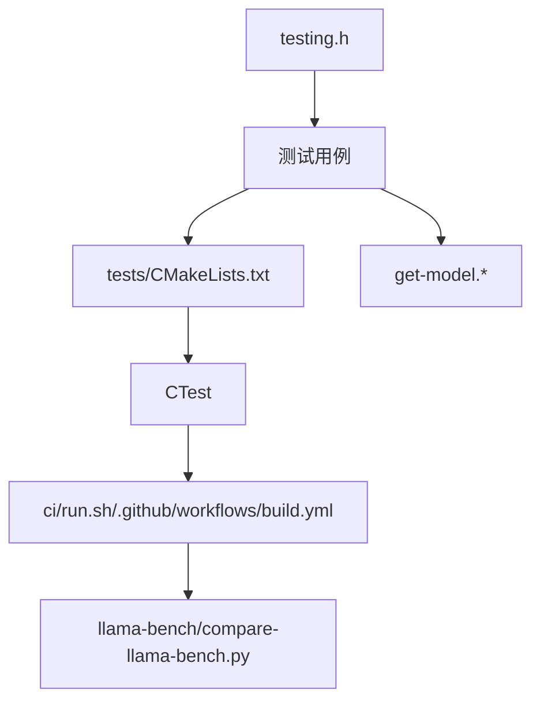

# 测试框架和流程

<cite>
**本文档引用的文件**
- [tests/testing.h](file://tests/testing.h)
- [tests/CMakeLists.txt](file://tests/CMakeLists.txt)
- [ci/run.sh](file://ci/run.sh)
- [.github/workflows/build.yml](file://.github/workflows/build.yml)
- [tests/get-model.h](file://tests/get-model.h)
- [tests/get-model.cpp](file://tests/get-model.cpp)
- [tests/test-arg-parser.cpp](file://tests/test-arg-parser.cpp)
- [tests/test-thread-safety.cpp](file://tests/test-thread-safety.cpp)
- [tests/test-gguf.cpp](file://tests/test-gguf.cpp)
- [tools/llama-bench/llama-bench.cpp](file://tools/llama-bench/llama-bench.cpp)
- [scripts/compare-llama-bench.py](file://scripts/compare-llama-bench.py)
- [tests/test-tokenizer-random.py](file://tests/test-tokenizer-random.py)
</cite>

## 目录
1. [简介](#简介)
2. [项目结构](#项目结构)
3. [核心组件](#核心组件)
4. [架构总览](#架构总览)
5. [详细组件分析](#详细组件分析)
6. [依赖关系分析](#依赖关系分析)
7. [性能考量](#性能考量)
8. [故障排查指南](#故障排查指南)
9. [结论](#结论)
10. [附录](#附录)

## 简介
本文件系统性梳理 llama.cpp 的测试框架与测试流程，覆盖单元测试、集成测试、性能测试与回归测试的分类与实践；阐述测试框架的结构与组织方式（测试用例编写、断言机制、测试数据管理）；说明持续集成流程与自动化测试执行；提供本地测试环境搭建与运行方法；解释测试覆盖率与性能基准测试的使用；并给出测试结果分析与问题定位的方法，以及测试工具的使用与自定义测试用例的开发建议。

## 项目结构
llama.cpp 的测试体系由以下部分组成：
- 测试框架与断言：位于 tests/testing.h，提供统一的测试组织、过滤、断言与统计输出能力。
- 测试构建与注册：位于 tests/CMakeLists.txt，通过函数封装统一构建可执行测试、注册 CTest 测试标签与工作目录。
- 持续集成脚本：位于 ci/run.sh，负责在不同平台与后端组合下自动构建、运行测试与性能基准。
- GitHub Actions 工作流：位于 .github/workflows/build.yml，定义多平台矩阵构建与测试任务。
- 测试辅助与数据：tests/get-model.* 提供模型文件获取逻辑；各测试样例展示不同模块的验证方式。
- 性能基准与对比：tools/llama-bench 提供推理性能基准；scripts/compare-llama-bench.py 用于对比不同提交的性能结果。

图示来源
- [tests/testing.h:12-244](file://tests/testing.h#L12-L244)
- [tests/CMakeLists.txt:3-117](file://tests/CMakeLists.txt#L3-L117)
- [ci/run.sh:220-273](file://ci/run.sh#L220-L273)
- [.github/workflows/build.yml:59-134](file://.github/workflows/build.yml#L59-L134)
- [tests/get-model.cpp:7-21](file://tests/get-model.cpp#L7-L21)
- [tests/test-arg-parser.cpp:13-200](file://tests/test-arg-parser.cpp#L13-L200)
- [tests/test-thread-safety.cpp:16-165](file://tests/test-thread-safety.cpp#L16-L165)
- [tests/test-gguf.cpp:1-200](file://tests/test-gguf.cpp#L1-L200)
- [tools/llama-bench/llama-bench.cpp:38-200](file://tools/llama-bench/llama-bench.cpp#L38-L200)
- [scripts/compare-llama-bench.py:105-200](file://scripts/compare-llama-bench.py#L105-L200)

章节来源
- [tests/CMakeLists.txt:1-303](file://tests/CMakeLists.txt#L1-L303)
- [ci/run.sh:1-744](file://ci/run.sh#L1-L744)
- [.github/workflows/build.yml:1-1110](file://.github/workflows/build.yml#L1-L1110)

## 核心组件
- 统一测试框架 testing.h
  - 支持命名空间栈式组织（支持分组/子测试）、正则过滤、异常捕获与统计。
  - 提供断言接口：assert_true、assert_equal，并输出失败详情。
  - 提供基准测试宏：bench，支持多次迭代取平均耗时与吞吐率统计。
  - 输出格式化，包含测试计数、断言计数、失败次数与异常次数。
- 测试构建与注册 tests/CMakeLists.txt
  - 封装 llama_build、llama_test、llama_test_cmd、llama_build_and_test 等函数，统一链接库、安装与标签。
  - 针对不同后端与平台条件编译，按标签（如 main、python、model）组织测试。
  - 对需要模型的测试，通过 CMake 下载模型并设置 FIXTURES_REQUIRED。
- 持续集成脚本 ci/run.sh
  - 自动检测后端开关（CUDA、ROCm、SYCL、Vulkan、WebGPU、MUSA、BLAS、OpenVINO 等），拼接 CMake 参数。
  - 分别运行 Debug/Release 构建与测试，按标签过滤；支持带模型的测试与性能基准。
  - 生成 README.md 汇总日志与状态。
- GitHub Actions 工作流 .github/workflows/build.yml
  - 定义 macOS、Ubuntu、Windows、ARM64 等多平台矩阵，启用 ccache、超时控制与并发取消。
  - 在各平台上执行 CMake 构建与 ctest 测试，部分平台附加内存泄漏检测或特定后端测试。
- 测试辅助与数据 tests/get-model.*
  - 提供 get_model_or_exit，优先从命令行参数读取模型路径，否则从环境变量 LLAMACPP_TEST_MODELFILE 获取；未提供时打印警告并跳过测试。
- 性能基准与对比 tools/llama-bench/llama-bench.cpp 与 scripts/compare-llama-bench.py
  - llama-bench 提供多种推理场景与后端配置，支持 SQLite 输出。
  - compare-llama-bench.py 用于对比不同提交的性能结果，生成表格与可选图表。

章节来源
- [tests/testing.h:12-244](file://tests/testing.h#L12-L244)
- [tests/CMakeLists.txt:3-117](file://tests/CMakeLists.txt#L3-L117)
- [ci/run.sh:57-273](file://ci/run.sh#L57-L273)
- [.github/workflows/build.yml:59-134](file://.github/workflows/build.yml#L59-L134)
- [tests/get-model.cpp:7-21](file://tests/get-model.cpp#L7-L21)
- [tools/llama-bench/llama-bench.cpp:38-200](file://tools/llama-bench/llama-bench.cpp#L38-L200)
- [scripts/compare-llama-bench.py:105-200](file://scripts/compare-llama-bench.py#L105-L200)

## 架构总览
测试体系围绕“统一框架 + 构建注册 + 自动化执行 + 性能对比”的闭环展开。开发者通过编写测试用例并使用 CMake 函数注册到 CTest；CI 脚本与 GitHub Actions 在多平台、多后端环境下批量执行；性能基准工具与对比脚本支撑回归测试与性能回归监控。

图示来源
- [tests/CMakeLists.txt:19-117](file://tests/CMakeLists.txt#L19-L117)
- [ci/run.sh:220-273](file://ci/run.sh#L220-L273)
- [.github/workflows/build.yml:59-134](file://.github/workflows/build.yml#L59-L134)
- [tools/llama-bench/llama-bench.cpp:38-200](file://tools/llama-bench/llama-bench.cpp#L38-L200)
- [scripts/compare-llama-bench.py:105-200](file://scripts/compare-llama-bench.py#L105-L200)

## 详细组件分析

### 组件A：统一测试框架 testing.h
- 设计要点
  - 使用栈式命名空间（stack）实现层级化测试名，便于过滤与输出对齐。
  - 断言失败与异常捕获统一计数，支持抛出异常以中断 CI。
  - 基准测试宏内部循环计时，输出 n、平均耗时与速率，便于性能回归。
- 关键接口
  - test(name, func) / test(func)：注册并执行测试，支持过滤与异常处理。
  - bench(name, func, iterations)：重复执行并统计平均耗时与吞吐。
  - assert_true/assert_equal：断言失败时输出期望值与实际值，便于定位。
  - summary()：汇总测试计数、断言计数、失败与异常数，返回退出码。
- 适用场景
  - 单元测试：验证函数行为、边界条件与错误路径。
  - 集成测试：验证模块间交互与配置正确性。
  - 回归测试：通过断言确保功能不退化。

图示来源
- [tests/testing.h:12-244](file://tests/testing.h#L12-L244)

章节来源
- [tests/testing.h:12-244](file://tests/testing.h#L12-L244)

### 组件B：测试构建与注册 tests/CMakeLists.txt
- 设计要点
  - 封装构建与注册：llama_build、llama_test、llama_test_cmd、llama_build_and_test。
  - 统一链接库（llama、llama-common），支持安装与工作目录设置。
  - 标签化组织：通过 LABEL 区分 main、python、model 等类别，便于 CI 过滤。
  - 条件编译：根据后端与平台开关选择性构建测试（如 OpenVINO、Windows 共享库限制等）。
  - 模型测试：通过 add_test + FIXTURES_REQUIRED 实现模型下载前置与复用。
- 典型用法
  - llama_build_and_test(test-arg-parser.cpp)：构建并注册测试，自动链接依赖。
  - llama_test(test-tokenizer-0 ...)：为同一目标注册多个参数化的测试。
  - set_tests_properties(... FIXTURES_REQUIRED test-download-model)：确保模型可用后再执行。

图示来源
- [tests/CMakeLists.txt:3-117](file://tests/CMakeLists.txt#L3-L117)
- [tests/CMakeLists.txt:225-231](file://tests/CMakeLists.txt#L225-L231)
- [tests/CMakeLists.txt:233-234](file://tests/CMakeLists.txt#L233-L234)
- [tests/CMakeLists.txt:251-252](file://tests/CMakeLists.txt#L251-L252)

章节来源
- [tests/CMakeLists.txt:1-303](file://tests/CMakeLists.txt#L1-L303)

### 组件C：持续集成与自动化执行
- ci/run.sh
  - 后端开关解析：根据环境变量（GG_BUILD_CUDA/ROCM/SYCL/Vulkan/WebGPU/MUSA/BLAS/OpenVINO 等）拼接 CMake 参数。
  - 构建与测试：分别在 Debug/Release 目录执行 cmake --build 与 ctest，按标签过滤。
  - 带模型测试：通过 LLAMACPP_TEST_MODELFILE 环境变量传递模型路径，执行 model 标签测试。
  - 性能基准：下载模型后运行 llama-bench 与相关工具，收集 perplexity、保存/加载状态等指标。
  - 日志汇总：将各阶段日志写入输出目录 README.md 并记录退出码。
- GitHub Actions build.yml
  - 多平台矩阵：macOS、Ubuntu、Windows、ARM64 等，启用 ccache、超时与并发取消。
  - 构建与测试：在各平台执行 CMake 构建与 ctest，部分平台附加特定后端测试或内存泄漏检测。

图示来源
- [ci/run.sh:57-273](file://ci/run.sh#L57-L273)
- [.github/workflows/build.yml:59-134](file://.github/workflows/build.yml#L59-L134)

章节来源
- [ci/run.sh:1-744](file://ci/run.sh#L1-L744)
- [.github/workflows/build.yml:1-1110](file://.github/workflows/build.yml#L1-L1110)

### 组件D：测试用例与断言机制
- 参数解析测试 test-arg-parser.cpp
  - 验证参数去重、环境变量冲突、短长参数顺序等规则。
  - 覆盖无效输入、缺失值、类型错误、非法组合等错误路径。
  - 验证远程下载函数行为。
- 线程安全测试 test-thread-safety.cpp
  - 在多 GPU/CPU/层分割场景下创建多个上下文并行推理，检查失败标记与日志。
  - 通过 NUMA 初始化与设备枚举，覆盖多设备配置。
- GGUF 文件测试 test-gguf.cpp
  - 手工构造多种非法头/键值/张量/数据布局，验证解析器的健壮性与错误处理。
  - 随机生成张量配置与键值类型，覆盖边界与一致性校验。

图示来源
- [tests/test-arg-parser.cpp:13-200](file://tests/test-arg-parser.cpp#L13-L200)
- [tests/test-thread-safety.cpp:16-165](file://tests/test-thread-safety.cpp#L16-L165)
- [tests/test-gguf.cpp:1-200](file://tests/test-gguf.cpp#L1-L200)

章节来源
- [tests/test-arg-parser.cpp:1-213](file://tests/test-arg-parser.cpp#L1-L213)
- [tests/test-thread-safety.cpp:1-165](file://tests/test-thread-safety.cpp#L1-L165)
- [tests/test-gguf.cpp:1-200](file://tests/test-gguf.cpp#L1-L200)

### 组件E：测试数据管理与模型获取
- tests/get-model.*
  - get_model_or_exit：优先从 argv[1] 获取模型路径；否则从环境变量 LLAMACPP_TEST_MODELFILE 读取；未提供时打印警告并退出当前测试。
  - 作用：统一模型路径来源，避免硬编码；在 CI 中通过环境变量注入模型路径。

章节来源
- [tests/get-model.h:1-3](file://tests/get-model.h#L1-L3)
- [tests/get-model.cpp:7-21](file://tests/get-model.cpp#L7-L21)

### 组件F：性能基准与回归测试
- tools/llama-bench/llama-bench.cpp
  - 提供高精度计时、设备信息采集、多种推理场景与后端配置。
  - 支持 SQLite 输出，便于后续对比分析。
- scripts/compare-llama-bench.py
  - 从 JSON/CSV/SQLite 读取数据，按提交与配置分组，计算均值与标准差。
  - 生成表格（默认 pipe 格式，可切换 latex/mediawiki 等），支持生成对比图。
- 使用建议
  - 在 CI 中定期运行 llama-bench 并写入 SQLite 数据库。
  - 使用 compare-llama-bench.py 对比 master 与 PR 提交，识别性能回归。

图示来源
- [tools/llama-bench/llama-bench.cpp:38-200](file://tools/llama-bench/llama-bench.cpp#L38-L200)
- [scripts/compare-llama-bench.py:105-200](file://scripts/compare-llama-bench.py#L105-L200)

章节来源
- [tools/llama-bench/llama-bench.cpp:1-2432](file://tools/llama-bench/llama-bench.cpp#L1-L2432)
- [scripts/compare-llama-bench.py:1-1103](file://scripts/compare-llama-bench.py#L1-L1103)

### 组件G：概念性测试流程
以下为通用测试流程的概念图，展示从编写到执行再到结果分析的完整闭环。

（该图为概念性流程，不直接映射具体源文件）

## 依赖关系分析
- 组件耦合与内聚
  - testing.h 作为底层基础设施，被所有测试用例依赖；测试用例通过 CMake 注册到 CTest，形成清晰的内聚模块。
  - tests/CMakeLists.txt 对构建细节进行抽象，降低测试用例对构建细节的耦合。
  - ci/run.sh 与 GitHub Actions 工作流对测试执行进行统一调度，屏蔽平台差异。
- 外部依赖与集成点
  - 性能基准工具链：llama-bench 与 compare-llama-bench.py 形成性能回归闭环。
  - 模型获取：tests/get-model.* 与 CMake FIXTURES 机制配合，确保测试可复现。
- 潜在循环依赖
  - 当前结构中未发现循环依赖；测试用例仅依赖框架与公共库，不反向依赖构建系统。

图示来源
- [tests/testing.h:12-244](file://tests/testing.h#L12-L244)
- [tests/CMakeLists.txt:1-303](file://tests/CMakeLists.txt#L1-L303)
- [ci/run.sh:220-273](file://ci/run.sh#L220-L273)
- [.github/workflows/build.yml:59-134](file://.github/workflows/build.yml#L59-L134)
- [tests/get-model.cpp:7-21](file://tests/get-model.cpp#L7-L21)
- [tools/llama-bench/llama-bench.cpp:38-200](file://tools/llama-bench/llama-bench.cpp#L38-L200)
- [scripts/compare-llama-bench.py:105-200](file://scripts/compare-llama-bench.py#L105-L200)

章节来源
- [tests/CMakeLists.txt:1-303](file://tests/CMakeLists.txt#L1-L303)
- [ci/run.sh:1-744](file://ci/run.sh#L1-L744)
- [.github/workflows/build.yml:1-1110](file://.github/workflows/build.yml#L1-L1110)

## 性能考量
- 计时精度与稳定性
  - 基准测试采用高分辨率时钟，多次迭代取平均与标准差，减少抖动影响。
- 场景覆盖
  - llama-bench 覆盖不同模型大小、线程数、上下文长度、后端与设备配置，便于横向对比。
- 数据持久化与对比
  - SQLite 输出便于长期存储与跨提交对比；compare-llama-bench.py 支持表格化展示与可视化。
- CI 中的性能回归
  - 建议在 CI 中固定关键场景（如常见模型与后端）的基准测试，结合阈值告警识别回归。

（本节为通用指导，不直接分析具体文件）

## 故障排查指南
- 断言失败定位
  - 使用 testing.h 的断言输出，关注期望值与实际值差异，结合测试名层级快速定位。
- 异常捕获与统计
  - run_with_exceptions 统一捕获异常并计数，summary 输出异常总数，便于快速判断是否为异常导致的失败。
- 模型相关测试跳过
  - 若未提供模型路径，get_model_or_exit 会打印警告并退出当前测试；可通过设置 LLAMACPP_TEST_MODELFILE 或传入模型路径解决。
- CI 失败排查
  - 查看 ci/run.sh 生成的日志文件与 README.md 摘要；根据后端开关确认构建配置；必要时在本地复现相同环境变量与构建参数。

章节来源
- [tests/testing.h:61-79](file://tests/testing.h#L61-L79)
- [tests/get-model.cpp:7-21](file://tests/get-model.cpp#L7-L21)
- [ci/run.sh:220-273](file://ci/run.sh#L220-L273)

## 结论
llama.cpp 的测试框架以 testing.h 为核心，结合 CMake 的统一构建与注册机制，在 CI 中实现了跨平台、多后端的自动化测试与性能回归监控。通过明确的断言机制、模型获取策略与性能基准工具链，项目能够稳定地验证功能正确性与性能稳定性。建议在日常开发中遵循统一的测试用例编写规范，并在关键场景引入性能回归测试，以保障代码质量与性能表现。

## 附录

### 本地测试环境搭建与运行方法
- 基本步骤
  - 使用 CMake 配置构建（可启用所需后端），然后构建测试目标。
  - 使用 ctest 按标签运行测试（如 -L main、-L model、-L python）。
  - 对于需要模型的测试，设置 LLAMACPP_TEST_MODELFILE 或在命令行传入模型路径。
- 参考路径
  - [tests/CMakeLists.txt:1-303](file://tests/CMakeLists.txt#L1-L303)
  - [tests/get-model.cpp:7-21](file://tests/get-model.cpp#L7-L21)

章节来源
- [tests/CMakeLists.txt:1-303](file://tests/CMakeLists.txt#L1-L303)
- [tests/get-model.cpp:7-21](file://tests/get-model.cpp#L7-L21)

### 测试分类与实践要点
- 单元测试
  - 验证函数/模块的独立行为，断言期望输出与异常路径。
  - 示例：参数解析测试、GGUF 解析健壮性测试。
- 集成测试
  - 验证模块间交互与配置正确性，如聊天模板、语法解析、采样器等。
  - 示例：聊天模板、语法解析、采样器测试。
- 性能测试
  - 使用 llama-bench 进行多场景基准测试，输出 SQLite 数据并用 compare-llama-bench.py 对比。
  - 示例：推理吞吐、延迟、内存占用等指标。
- 回归测试
  - 通过断言与性能阈值，确保功能与性能不退化。
  - 示例：线程安全测试、量化转换测试等。

章节来源
- [tests/test-arg-parser.cpp:1-213](file://tests/test-arg-parser.cpp#L1-L213)
- [tests/test-gguf.cpp:1-200](file://tests/test-gguf.cpp#L1-L200)
- [tests/test-thread-safety.cpp:1-165](file://tests/test-thread-safety.cpp#L1-L165)
- [tools/llama-bench/llama-bench.cpp:1-2432](file://tools/llama-bench/llama-bench.cpp#L1-L2432)
- [scripts/compare-llama-bench.py:1-1103](file://scripts/compare-llama-bench.py#L1-L1103)

### 测试工具使用与自定义测试用例开发
- 自定义测试用例
  - 在 tests/ 目录下新增 .cpp/.py 文件，使用 testing.h 的断言接口编写用例。
  - 通过 tests/CMakeLists.txt 的函数注册到 CTest，并按需设置标签与工作目录。
- Python 辅助测试
  - 可参考 tests/test-tokenizer-random.py，通过 CFFI 加载 libllama 动态库并与 Hugging Face AutoTokenizer 对比。
- 性能回归
  - 在 CI 中定期运行 llama-bench 并写入 SQLite；使用 compare-llama-bench.py 生成对比报告。

章节来源
- [tests/testing.h:12-244](file://tests/testing.h#L12-L244)
- [tests/CMakeLists.txt:1-303](file://tests/CMakeLists.txt#L1-L303)
- [tests/test-tokenizer-random.py:1-200](file://tests/test-tokenizer-random.py#L1-L200)
- [tools/llama-bench/llama-bench.cpp:1-2432](file://tools/llama-bench/llama-bench.cpp#L1-L2432)
- [scripts/compare-llama-bench.py:1-1103](file://scripts/compare-llama-bench.py#L1-L1103)