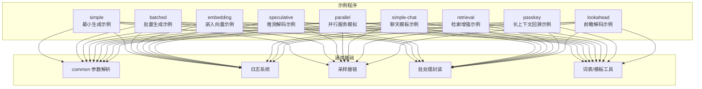
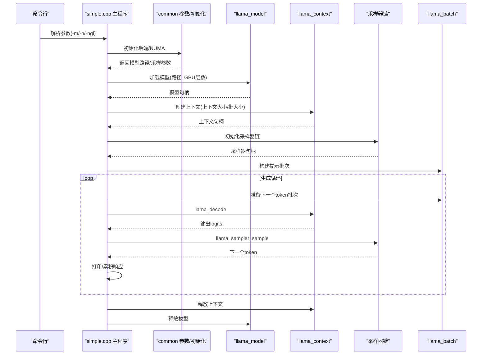
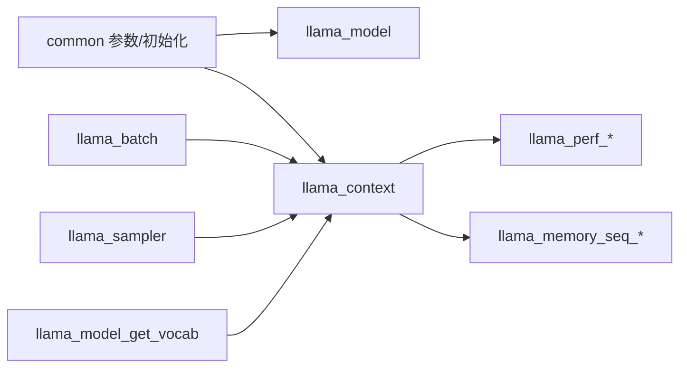

# 示例程序分析

<cite>
**本文引用的文件**
- [examples/simple/README.md](file://examples/simple/README.md)
- [examples/simple/simple.cpp](file://examples/simple/simple.cpp)
- [examples/batched/README.md](file://examples/batched/README.md)
- [examples/batched/batched.cpp](file://examples/batched/batched.cpp)
- [examples/embedding/README.md](file://examples/embedding/README.md)
- [examples/embedding/embedding.cpp](file://examples/embedding/embedding.cpp)
- [examples/speculative/README.md](file://examples/speculative/README.md)
- [examples/speculative/speculative.cpp](file://examples/speculative/speculative.cpp)
- [examples/parallel/README.md](file://examples/parallel/README.md)
- [examples/parallel/parallel.cpp](file://examples/parallel/parallel.cpp)
- [examples/simple-chat/README.md](file://examples/simple-chat/README.md)
- [examples/simple-chat/simple-chat.cpp](file://examples/simple-chat/simple-chat.cpp)
- [examples/retrieval/README.md](file://examples/retrieval/README.md)
- [examples/retrieval/retrieval.cpp](file://examples/retrieval/retrieval.cpp)
- [examples/passkey/README.md](file://examples/passkey/README.md)
- [examples/passkey/passkey.cpp](file://examples/passkey/passkey.cpp)
- [examples/lookahead/README.md](file://examples/lookahead/README.md)
- [examples/lookahead/lookahead.cpp](file://examples/lookahead/lookahead.cpp)
</cite>

## 目录
1. [引言](#引言)
2. [项目结构](#项目结构)
3. [核心组件](#核心组件)
4. [架构总览](#架构总览)
5. [详细组件分析](#详细组件分析)
6. [依赖关系分析](#依赖关系分析)
7. [性能考量](#性能考量)
8. [故障排查指南](#故障排查指南)
9. [结论](#结论)
10. [附录](#附录)

## 引言
本文件系统性梳理 llama.cpp 仓库中的示例程序与最佳实践，覆盖文本生成、批量推理、嵌入向量生成、检索增强、并行服务模拟、聊天模板应用、推测解码与前瞻解码等典型场景。文档从功能、实现原理、代码结构、接口抽象、运行方式、参数配置、关键算法与优化技巧、扩展与定制方法、以及从示例中学习项目架构与开发模式等方面进行深入解析，并提供可操作的实践建议。

## 项目结构
示例程序主要位于 examples/ 目录下，按功能划分为多个子目录，每个子目录包含独立的可执行程序与说明文档。这些示例统一采用 common 参数解析、日志、批处理与采样器等通用基础设施，体现了模块化与接口抽象的设计思想。

图示来源
- [examples/simple/simple.cpp:14-224](file://examples/simple/simple.cpp#L14-L224)
- [examples/batched/batched.cpp:19-265](file://examples/batched/batched.cpp#L19-L265)
- [examples/embedding/embedding.cpp:97-415](file://examples/embedding/embedding.cpp#L97-L415)
- [examples/speculative/speculative.cpp:33-661](file://examples/speculative/speculative.cpp#L33-L661)
- [examples/parallel/parallel.cpp:156-521](file://examples/parallel/parallel.cpp#L156-L521)
- [examples/simple-chat/simple-chat.cpp:15-211](file://examples/simple-chat/simple-chat.cpp#L15-L211)
- [examples/retrieval/retrieval.cpp:115-308](file://examples/retrieval/retrieval.cpp#L115-L308)
- [examples/passkey/passkey.cpp:19-278](file://examples/passkey/passkey.cpp#L19-L278)
- [examples/lookahead/lookahead.cpp:41-484](file://examples/lookahead/lookahead.cpp#L41-L484)

章节来源
- [examples/simple/README.md:1-22](file://examples/simple/README.md#L1-L22)
- [examples/batched/README.md:1-45](file://examples/batched/README.md#L1-L45)
- [examples/embedding/README.md:1-62](file://examples/embedding/README.md#L1-L62)
- [examples/speculative/README.md:1-10](file://examples/speculative/README.md#L1-L10)
- [examples/parallel/README.md:1-15](file://examples/parallel/README.md#L1-L15)
- [examples/simple-chat/README.md:1-8](file://examples/simple-chat/README.md#L1-L8)
- [examples/retrieval/README.md:1-70](file://examples/retrieval/README.md#L1-L70)
- [examples/passkey/README.md:1-16](file://examples/passkey/README.md#L1-L16)
- [examples/lookahead/README.md:1-14](file://examples/lookahead/README.md#L1-L14)

## 核心组件
- 参数解析与初始化：各示例通过 common_params_parse 完成命令行参数解析，随后调用 common_init_from_params 初始化模型与上下文，确保后端、NUMA、KV 统一缓存等策略一致。
- 批处理与序列管理：llama_batch 提供令牌批次构建；llama_seq_id 管理多序列；KV 缓存通过 llama_memory_seq_* 接口进行复制、保留与裁剪，支持并行与长上下文场景。
- 采样器链：llama_sampler_chain 支持贪心、top-k、top-p、温度、随机种子等组合，满足不同生成需求。
- 词表与模板：llama_model_get_vocab 获取词表；llama_chat_apply_template 应用聊天模板，简化对话格式化。
- 嵌入与相似度：embedding 示例提供 token/序列嵌入提取与归一化，支持余弦相似度计算与输出格式控制。
- 性能计时与统计：llama_perf_* 系列函数打印解码、采样、加载等阶段耗时与吞吐。

章节来源
- [examples/batched/batched.cpp:22-101](file://examples/batched/batched.cpp#L22-L101)
- [examples/embedding/embedding.cpp:97-168](file://examples/embedding/embedding.cpp#L97-L168)
- [examples/parallel/parallel.cpp:156-284](file://examples/parallel/parallel.cpp#L156-L284)
- [examples/simple-chat/simple-chat.cpp:75-155](file://examples/simple-chat/simple-chat.cpp#L75-L155)
- [examples/retrieval/retrieval.cpp:115-185](file://examples/retrieval/retrieval.cpp#L115-L185)
- [examples/passkey/passkey.cpp:66-119](file://examples/passkey/passkey.cpp#L66-L119)
- [examples/lookahead/lookahead.cpp:41-127](file://examples/lookahead/lookahead.cpp#L41-L127)

## 架构总览
以下序列图展示“最小生成示例”从参数解析到生成结束的主流程，体现模块化与接口抽象：

图示来源
- [examples/simple/simple.cpp:14-224](file://examples/simple/simple.cpp#L14-L224)

## 详细组件分析

### 最小生成示例（simple）
- 功能：以最简方式演示文本生成，支持命令行参数指定模型、预测长度与GPU层数。
- 实现要点：
  - 使用 ggml_backend_load_all 动态加载后端。
  - llama_model_load_from_file 与 llama_init_from_model 初始化模型与上下文。
  - llama_tokenize 分词，llama_batch_get_one 构建批次。
  - llama_decode 迭代解码，llama_sampler_sample 抽样，llama_token_to_piece 转换为字符串。
  - llama_perf_* 打印计时统计。
- 运行与参数
  - 示例命令见 README；常用参数 -m 指定模型，-n 指定生成长度，-ngl 指定GPU层数。
- 关键算法与优化
  - 顺序解码，单线程，适合入门与基准对比。
- 扩展与定制
  - 可替换采样器链、启用KV统一缓存、调整上下文大小与批大小以适配更长输入。

章节来源
- [examples/simple/README.md:1-22](file://examples/simple/README.md#L1-L22)
- [examples/simple/simple.cpp:14-224](file://examples/simple/simple.cpp#L14-L224)

### 批量生成示例（batched）
- 功能：并行生成多条序列，支持多路采样器配置与KV缓存复用。
- 实现要点：
  - 为每条序列创建独立采样器，支持 top-k/top-p/温度/随机种子。
  - llama_batch_init 构建多序列批次，llama_memory_seq_cp 复制系统KV缓存。
  - 通过 i_batch 记录每序列最后token位置，逐token迭代生成。
- 运行与参数
  - 示例命令见 README；-np 指定并行数，-p 指定提示，-n 指定生成长度。
- 关键算法与优化
  - 批内多序列解码，减少重复提示计算；KV缓存复用降低内存占用。
- 扩展与定制
  - 可根据 n_ctx 与 n_batch 调整，避免KV不足导致的错误。

章节来源
- [examples/batched/README.md:1-45](file://examples/batched/README.md#L1-L45)
- [examples/batched/batched.cpp:19-265](file://examples/batched/batched.cpp#L19-L265)

### 嵌入向量示例（embedding）
- 功能：对文本生成高维嵌入向量，支持多种池化类型与输出格式。
- 实现要点：
  - 将输入按分隔符切分为多段，分别分词并编码，批量提取嵌入。
  - 支持 token 级与序列级嵌入，可选归一化策略与输出格式（原始/JSON/数组）。
  - 余弦相似度矩阵用于检索增强场景。
- 运行与参数
  - 常用参数 --pooling、--embd-normalize、--embd-output-format、--embd-separator。
- 关键算法与优化
  - 批处理嵌入，减少模型调用次数；归一化提升相似度稳定性。
- 扩展与定制
  - 可自定义分隔符与池化策略，结合检索示例实现RAG。

章节来源
- [examples/embedding/README.md:1-62](file://examples/embedding/README.md#L1-L62)
- [examples/embedding/embedding.cpp:97-415](file://examples/embedding/embedding.cpp#L97-L415)

### 推测解码示例（speculative）
- 功能：演示推测解码与树形推测，加速生成并保持正确性。
- 实现要点：
  - 加载目标模型与草稿模型，校验词表一致性。
  - 通过 common_sampler_clone 克隆采样器，树形分支生成候选序列。
  - 验证阶段基于概率阈值接受或拒绝草稿token，必要时重采样。
  - 统计接受率与速度，打印性能计时。
- 运行与参数
  - 需要 --model-draft 指定草稿模型；支持 n_predict、n_parallel 等。
- 关键算法与优化
  - 草稿模型快速生成候选，目标模型验证，显著提升吞吐。
- 扩展与定制
  - 可调整 n_draft、p_split 与采样策略以平衡速度与质量。

章节来源
- [examples/speculative/README.md:1-10](file://examples/speculative/README.md#L1-L10)
- [examples/speculative/speculative.cpp:33-661](file://examples/speculative/speculative.cpp#L33-L661)

### 并行服务模拟示例（parallel）
- 功能：模拟服务器并发请求，共享系统提示，动态插入新请求。
- 实现要点：
  - 为每个客户端分配独立序列ID，共享系统提示KV缓存。
  - 支持连续批处理 cont_batching，动态清理与复用KV缓存。
  - 统计每客户端提示与生成速度，记录缓存命中/缺失。
- 运行与参数
  - 示例命令见 README；-np 指定并发客户端数，-ns 指定总请求数，--junk 控制垃圾问题数量。
- 关键算法与优化
  - 共享系统提示KV缓存，减少重复计算；按 n_batch 分块解码，自动降速重试以缓解KV满。
- 扩展与定制
  - 可接入外部提示文件，自定义垃圾内容模板，适配不同对话风格。

章节来源
- [examples/parallel/README.md:1-15](file://examples/parallel/README.md#L1-L15)
- [examples/parallel/parallel.cpp:156-521](file://examples/parallel/parallel.cpp#L156-L521)

### 聊天模板示例（simple-chat）
- 功能：使用 GGUF 文件中的聊天模板构建对话，交互式生成回复。
- 实现要点：
  - llama_model_chat_template 获取模板；llama_chat_apply_template 格式化消息列表。
  - 逐轮生成，检测结束标记，维护消息历史。
- 运行与参数
  - 示例命令见 README；-m 指定模型，-c 指定上下文大小，-ngl 指定GPU层数。
- 关键算法与优化
  - 模板驱动的消息拼接，避免手工格式化错误。
- 扩展与定制
  - 可自定义消息结构与模板，适配不同指令微调模型。

章节来源
- [examples/simple-chat/README.md:1-8](file://examples/simple-chat/README.md#L1-L8)
- [examples/simple-chat/simple-chat.cpp:15-211](file://examples/simple-chat/simple-chat.cpp#L15-L211)

### 检索增强示例（retrieval）
- 功能：对多文件进行分块、嵌入与相似度检索，交互式查询返回相关片段。
- 实现要点：
  - 读取文件，按分隔符切分为固定大小的块；分词后批量嵌入。
  - 查询时计算余弦相似度，输出前K个最相关块及其位置与原文。
- 运行与参数
  - 示例命令见 README；--context-file 指定文件，--chunk-size 与 --chunk-separator 控制分块策略。
- 关键算法与优化
  - 批处理嵌入与相似度计算，支持BERT类池化模型。
- 扩展与定制
  - 可扩展为持久化嵌入库，支持增量更新与过滤策略。

章节来源
- [examples/retrieval/README.md:1-70](file://examples/retrieval/README.md#L1-L70)
- [examples/retrieval/retrieval.cpp:115-308](file://examples/retrieval/retrieval.cpp#L115-L308)

### 长上下文回溯示例（passkey）
- 功能：在长上下文中定位关键信息（如密码），评估模型长上下文记忆能力。
- 实现要点：
  - 构造包含“垃圾”文本的长提示，在特定位置插入目标值；通过 KV 缓存压缩与滑动窗口维持可用上下文。
  - 逐步填充KV缓存，随后生成目标值。
- 运行与参数
  - 示例命令见 README；--junk 控制垃圾段数量，--pos 指定插入位置，--keep 与 --grp-attn-n 影响上下文压缩策略。
- 关键算法与优化
  - 自注意力组内压缩与KV缓存滑动，平衡长上下文与资源消耗。
- 扩展与定制
  - 可调整插入策略与压缩因子，适配不同模型与任务。

章节来源
- [examples/passkey/README.md:1-16](file://examples/passkey/README.md#L1-L16)
- [examples/passkey/passkey.cpp:19-278](file://examples/passkey/passkey.cpp#L19-L278)

### 前瞻解码示例（lookahead）
- 功能：前瞻解码通过多序列与n-gram验证加速生成。
- 实现要点：
  - 维护当前token与多层Jacobi序列，构建验证n-gram队列。
  - 通过批量解码同时评估当前token与验证n-gram，若匹配则接受并推进，否则重采样。
  - 统计接受率与速度，打印调试信息。
- 运行与参数
  - 示例命令见 README；-hf 指定模型，-p 指定提示，-n 指定生成长度，-c 指定上下文大小。
- 关键算法与优化
  - 多序列并行与n-gram验证，显著提升吞吐与稳定性。
- 扩展与定制
  - 可调整窗口W、n-gram大小N与验证数G以适配不同硬件与延迟要求。

章节来源
- [examples/lookahead/README.md:1-14](file://examples/lookahead/README.md#L1-L14)
- [examples/lookahead/lookahead.cpp:41-484](file://examples/lookahead/lookahead.cpp#L41-L484)

## 依赖关系分析
- 统一依赖：所有示例均依赖 common 参数解析、日志、批处理与采样器链等通用模块。
- 模型与上下文：llama_model 与 llama_context 提供推理核心；llama_batch 管理批次；llama_sampler 提供抽样。
- KV缓存：llama_memory_seq_* 接口贯穿并行、长上下文与检索场景，是性能与正确性的关键。
- 词表与模板：llama_model_get_vocab 与 llama_chat_apply_template 保证对话格式一致性。

图示来源
- [examples/batched/batched.cpp:22-101](file://examples/batched/batched.cpp#L22-L101)
- [examples/embedding/embedding.cpp:97-168](file://examples/embedding/embedding.cpp#L97-L168)
- [examples/parallel/parallel.cpp:156-284](file://examples/parallel/parallel.cpp#L156-L284)
- [examples/simple-chat/simple-chat.cpp:75-155](file://examples/simple-chat/simple-chat.cpp#L75-L155)
- [examples/retrieval/retrieval.cpp:115-185](file://examples/retrieval/retrieval.cpp#L115-L185)
- [examples/passkey/passkey.cpp:66-119](file://examples/passkey/passkey.cpp#L66-L119)
- [examples/lookahead/lookahead.cpp:41-127](file://examples/lookahead/lookahead.cpp#L41-L127)

## 性能考量
- 批大小与上下文大小：n_batch 与 n_ctx 的合理设置直接影响吞吐与显存占用；长上下文需考虑KV缓存容量与压缩策略。
- 并行与序列：多序列并行可提升吞吐，但需注意KV缓存碎片化与内存压力。
- 采样策略：温度、top-k/top-p、核采样等影响生成质量与速度；推测/前瞻解码在保证正确性前提下显著提速。
- I/O与批处理：embedding/retrieval 中的批处理嵌入与相似度计算应尽量利用批内并行，减少模型调用次数。
- 日志与调试：在生产环境中建议关闭冗余日志，仅保留错误级别以降低开销。

## 故障排查指南
- 模型加载失败
  - 检查模型路径与权重格式；确认 n_gpu_layers 与后端兼容性。
  - 参考：[examples/simple/simple.cpp:75-94](file://examples/simple/simple.cpp#L75-L94)
- KV缓存不足
  - 增大 n_ctx 或减小 n_parallel；在并行示例中启用 kv_unified；必要时降低 n_batch。
  - 参考：[examples/batched/batched.cpp:104-108](file://examples/batched/batched.cpp#L104-L108)
- 生成卡住或提前结束
  - 检查结束标记检测逻辑与 n_predict 设置；确认采样器链配置。
  - 参考：[examples/parallel/parallel.cpp:458-488](file://examples/parallel/parallel.cpp#L458-L488)
- 嵌入维度不匹配
  - 确认模型输出维度与归一化参数一致；检查池化类型是否支持序列级嵌入。
  - 参考：[examples/embedding/embedding.cpp:258-260](file://examples/embedding/embedding.cpp#L258-L260)
- 推测/前瞻解码异常
  - 校验草稿模型与目标模型词表一致性；调整 n_draft 与 p_split。
  - 参考：[examples/speculative/speculative.cpp:107-157](file://examples/speculative/speculative.cpp#L107-L157)

章节来源
- [examples/simple/simple.cpp:75-94](file://examples/simple/simple.cpp#L75-L94)
- [examples/batched/batched.cpp:104-108](file://examples/batched/batched.cpp#L104-L108)
- [examples/parallel/parallel.cpp:458-488](file://examples/parallel/parallel.cpp#L458-L488)
- [examples/embedding/embedding.cpp:258-260](file://examples/embedding/embedding.cpp#L258-L260)
- [examples/speculative/speculative.cpp:107-157](file://examples/speculative/speculative.cpp#L107-L157)

## 结论
llama.cpp 的示例程序展示了从最小生成到复杂推理范式的完整谱系：参数解析与初始化、批处理与序列管理、采样器链、词表与模板、嵌入与检索、长上下文与KV缓存管理、推测与前瞻解码等。通过这些示例，开发者可以快速掌握项目架构、接口抽象与最佳实践，并在此基础上进行扩展与定制，落地到实际工程场景。

## 附录
- 实践建议
  - 从 simple 开始，逐步迁移到 batched、embedding、retrieval、parallel、speculative、lookahead。
  - 在生产环境优先启用 kv_unified、合理设置 n_batch 与 n_ctx，监控 llama_perf_* 输出。
  - 对于长上下文任务，结合 passkey 的KV滑动与压缩策略，平衡性能与准确性。
- 学习路径
  - 先理解 simple 与 batched 的基本流程；
  - 再掌握 embedding 与 retrieval 的数据管线；
  - 最后探索 parallel、speculative、lookahead 的高级优化技巧。