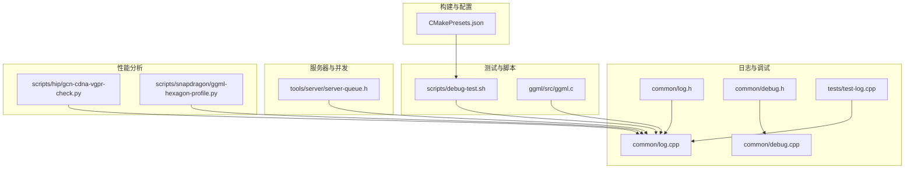
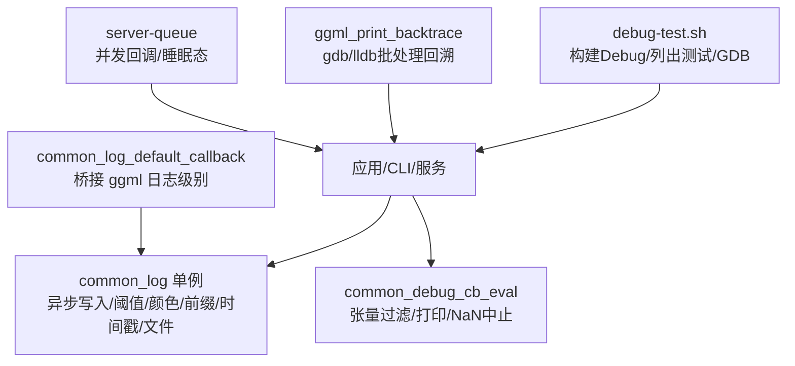
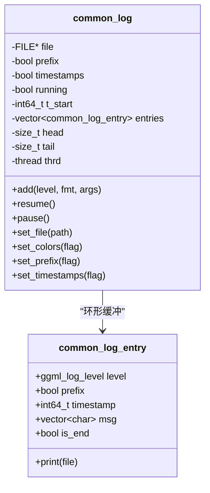
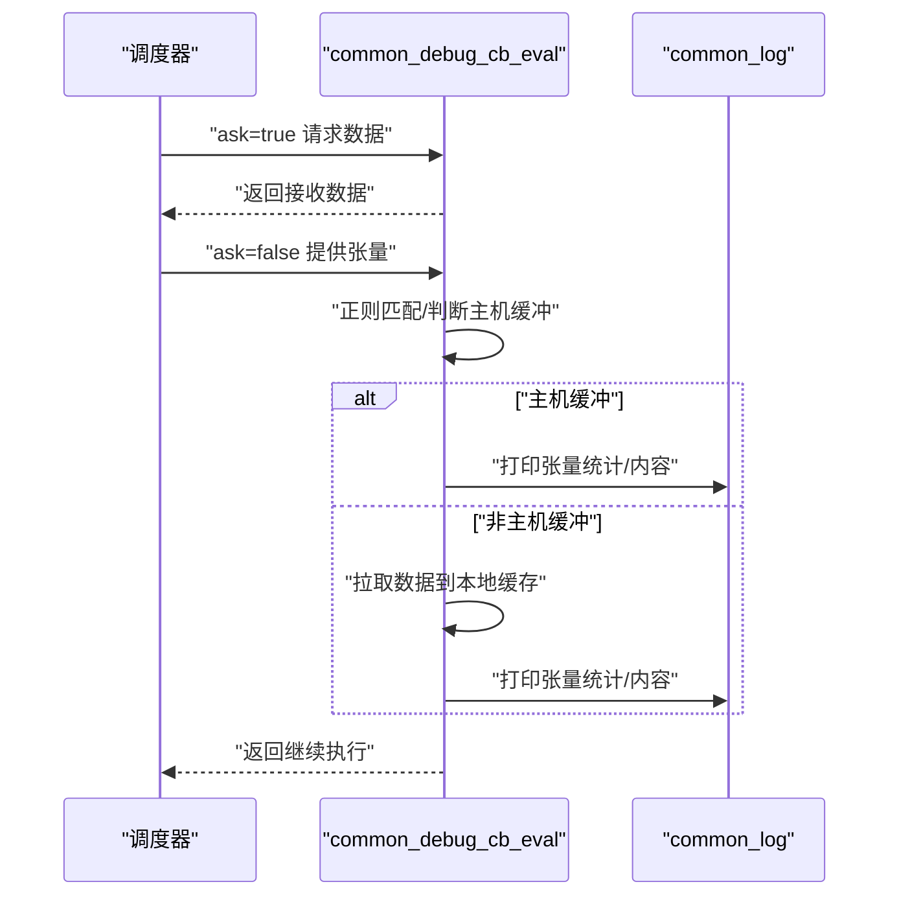
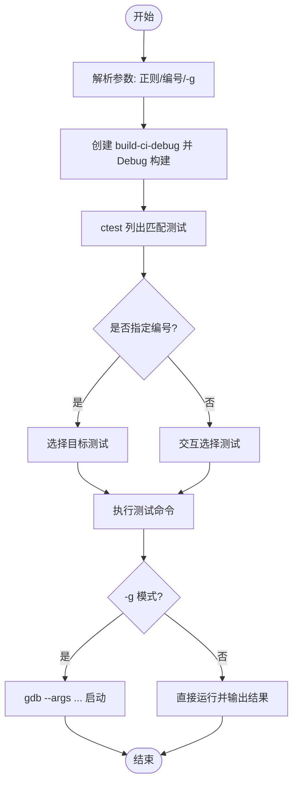
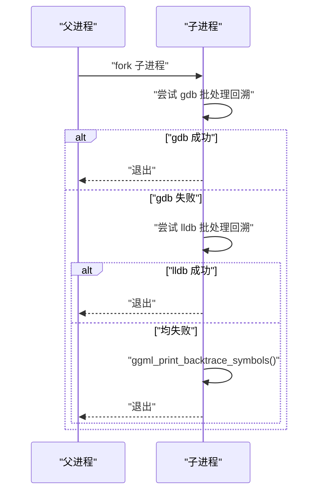
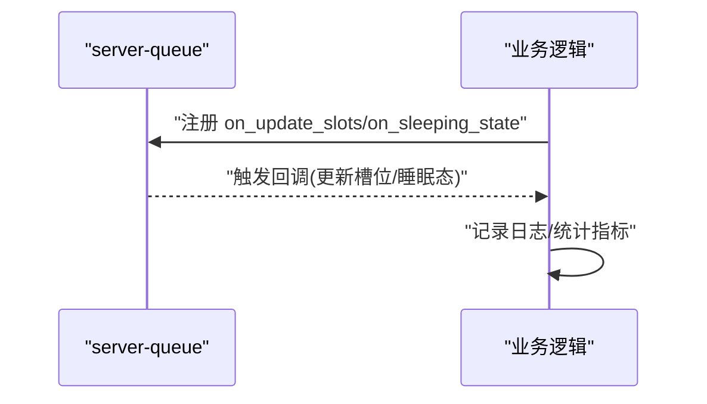
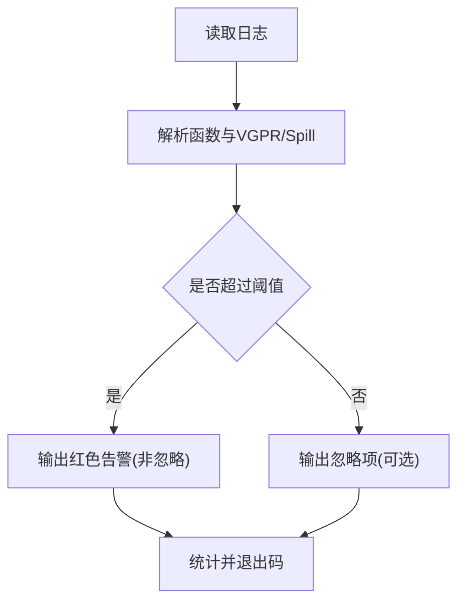
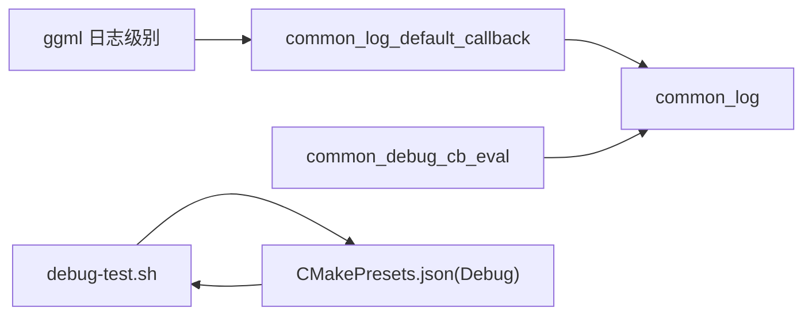

# 调试和诊断工具

<cite>
**本文引用的文件**
- [common/log.h](file://common/log.h)
- [common/log.cpp](file://common/log.cpp)
- [common/debug.h](file://common/debug.h)
- [common/debug.cpp](file://common/debug.cpp)
- [docs/development/debugging-tests.md](file://docs/development/debugging-tests.md)
- [scripts/debug-test.sh](file://scripts/debug-test.sh)
- [ggml/src/ggml.c](file://ggml/src/ggml.c)
- [tests/test-log.cpp](file://tests/test-log.cpp)
- [tools/server/server-queue.h](file://tools/server/server-queue.h)
- [scripts/hip/gcn-cdna-vgpr-check.py](file://scripts/hip/gcn-cdna-vgpr-check.py)
- [scripts/snapdragon/ggml-hexagon-profile.py](file://scripts/snapdragon/ggml-hexagon-profile.py)
- [CMakePresets.json](file://CMakePresets.json)
</cite>

## 目录
1. [简介](#简介)
2. [项目结构](#项目结构)
3. [核心组件](#核心组件)
4. [架构总览](#架构总览)
5. [详细组件分析](#详细组件分析)
6. [依赖关系分析](#依赖关系分析)
7. [性能考量](#性能考量)
8. [故障排查指南](#故障排查指南)
9. [结论](#结论)
10. [附录](#附录)

## 简介
本指南面向 llama.cpp 的开发者与运维人员，系统性介绍项目中的调试与诊断工具链，涵盖：
- 调试器配置与使用（GDB、LLDB、Visual Studio）
- 日志系统配置与使用（日志级别、输出格式、过滤机制）
- 性能分析工具（CPU 分析器、内存分析器、后端性能监控）
- 常见问题诊断与解决步骤
- 内存泄漏检测与调试技巧
- 网络调试与并发问题排查
- 远程调试与生产环境问题定位

## 项目结构
围绕调试与诊断的关键目录与文件：
- 日志子系统：common/log.h, common/log.cpp
- 调试回调与张量检查：common/debug.h, common/debug.cpp
- 测试调试脚本：scripts/debug-test.sh
- 测试用例验证日志线程安全：tests/test-log.cpp
- 后端回溯与崩溃处理：ggml/src/ggml.c
- 服务器队列与并发状态：tools/server/server-queue.h
- 平台特定性能分析脚本：scripts/hip/gcn-cdna-vgpr-check.py、scripts/snapdragon/ggml-hexagon-profile.py
- 构建预设（含 Debug 配置）：CMakePresets.json

**图表来源**
- [common/log.h:1-124](file://common/log.h#L1-L124)
- [common/log.cpp:1-454](file://common/log.cpp#L1-L454)
- [common/debug.h:1-32](file://common/debug.h#L1-L32)
- [common/debug.cpp:1-191](file://common/debug.cpp#L1-L191)
- [scripts/debug-test.sh:1-203](file://scripts/debug-test.sh#L1-L203)
- [ggml/src/ggml.c:180-236](file://ggml/src/ggml.c#L180-L236)
- [tests/test-log.cpp:1-43](file://tests/test-log.cpp#L1-L43)
- [tools/server/server-queue.h:93-130](file://tools/server/server-queue.h#L93-L130)
- [scripts/hip/gcn-cdna-vgpr-check.py:149-178](file://scripts/hip/gcn-cdna-vgpr-check.py#L149-L178)
- [scripts/snapdragon/ggml-hexagon-profile.py:134-166](file://scripts/snapdragon/ggml-hexagon-profile.py#L134-L166)
- [CMakePresets.json:65-66](file://CMakePresets.json#L65-L66)

**章节来源**
- [common/log.h:1-124](file://common/log.h#L1-L124)
- [common/log.cpp:1-454](file://common/log.cpp#L1-L454)
- [common/debug.h:1-32](file://common/debug.h#L1-L32)
- [common/debug.cpp:1-191](file://common/debug.cpp#L1-L191)
- [scripts/debug-test.sh:1-203](file://scripts/debug-test.sh#L1-L203)
- [ggml/src/ggml.c:180-236](file://ggml/src/ggml.c#L180-L236)
- [tests/test-log.cpp:1-43](file://tests/test-log.cpp#L1-L43)
- [tools/server/server-queue.h:93-130](file://tools/server/server-queue.h#L93-L130)
- [scripts/hip/gcn-cdna-vgpr-check.py:149-178](file://scripts/hip/gcn-cdna-vgpr-check.py#L149-L178)
- [scripts/snapdragon/ggml-hexagon-profile.py:134-166](file://scripts/snapdragon/ggml-hexagon-profile.py#L134-L166)
- [CMakePresets.json:65-66](file://CMakePresets.json#L65-L66)

## 核心组件
- 日志系统（common_log）：支持多线程异步写入、可配置前缀与时间戳、颜色输出、文件落盘、阈值控制与回调桥接。
- 调试回调（common_debug_cb_eval）：在图执行阶段按需打印张量统计信息，支持正则过滤与 NaN 中断。
- 测试调试脚本（debug-test.sh）：一键构建 Debug 环境、列出匹配测试、进入 GDB 调试或直接运行。
- 回溯与崩溃处理（ggml_print_backtrace）：Linux 下自动尝试 gdb/lldb 批处理回溯，失败时回退到符号化回溯。
- 服务器并发与队列（server-queue）：提供睡眠态回调与结果队列，便于并发问题定位。

**章节来源**
- [common/log.h:24-124](file://common/log.h#L24-L124)
- [common/log.cpp:124-454](file://common/log.cpp#L124-L454)
- [common/debug.h:11-31](file://common/debug.h#L11-L31)
- [common/debug.cpp:143-191](file://common/debug.cpp#L143-L191)
- [scripts/debug-test.sh:109-181](file://scripts/debug-test.sh#L109-L181)
- [ggml/src/ggml.c:180-236](file://ggml/src/ggml.c#L180-L236)
- [tools/server/server-queue.h:93-130](file://tools/server/server-queue.h#L93-L130)

## 架构总览
下图展示日志与调试在系统中的交互关系，以及与测试脚本、后端回溯、服务器队列的集成。

**图表来源**
- [common/log.cpp:363-453](file://common/log.cpp#L363-L453)
- [common/debug.cpp:143-191](file://common/debug.cpp#L143-L191)
- [scripts/debug-test.sh:109-181](file://scripts/debug-test.sh#L109-L181)
- [ggml/src/ggml.c:180-236](file://ggml/src/ggml.c#L180-L236)
- [tools/server/server-queue.h:93-130](file://tools/server/server-queue.h#L93-L130)

## 详细组件分析

### 日志系统（common_log）
- 多线程与环形缓冲：内部工作线程从环形缓冲取日志条目，支持动态扩容；暂停/恢复/刷新保证一致性。
- 输出控制：阈值控制（verbosity）、前缀与时间戳、颜色开关、文件落盘。
- 回调桥接：将 ggml 的日志级别映射为内部级别，并受阈值过滤。
- 线程安全：通过互斥锁与条件变量协调；Windows 下单例泄漏以避免 DLL 退出时卡死，建议在退出前手动刷新。

**图表来源**
- [common/log.cpp:124-357](file://common/log.cpp#L124-L357)

**章节来源**
- [common/log.h:24-124](file://common/log.h#L24-L124)
- [common/log.cpp:124-454](file://common/log.cpp#L124-L454)
- [tests/test-log.cpp:6-42](file://tests/test-log.cpp#L6-L42)

### 调试回调（common_debug_cb_eval）
- 作用：在计算图执行期间，对满足过滤条件的张量进行数据采集与打印，支持正则过滤与 NaN 中断。
- 使用方式：通过参数对象注册回调与用户数据，构造时传入过滤模式与是否遇到 NaN 中止标志。
- 数据采集：若非主机缓冲，先拉取到本地缓存再打印；对非量化类型进行数值遍历与统计。

**图表来源**
- [common/debug.cpp:143-191](file://common/debug.cpp#L143-L191)
- [common/log.cpp:448-453](file://common/log.cpp#L448-L453)

**章节来源**
- [common/debug.h:11-31](file://common/debug.h#L11-L31)
- [common/debug.cpp:20-35](file://common/debug.cpp#L20-L35)
- [common/debug.cpp:79-131](file://common/debug.cpp#L79-L131)
- [common/debug.cpp:143-191](file://common/debug.cpp#L143-L191)

### 测试调试脚本（debug-test.sh）
- 自动创建 Debug 构建目录、编译测试二进制。
- 通过 ctest 列出匹配正则的测试，支持选择具体测试编号。
- 支持 -g 模式直接进入 GDB，设置断点与交互调试。
- 可直接运行测试并输出 PASS/FAIL。

**图表来源**
- [scripts/debug-test.sh:65-181](file://scripts/debug-test.sh#L65-L181)

**章节来源**
- [scripts/debug-test.sh:1-203](file://scripts/debug-test.sh#L1-L203)
- [docs/development/debugging-tests.md:1-105](file://docs/development/debugging-tests.md#L1-L105)

### 后端回溯与崩溃处理（ggml_print_backtrace）
- 在 Linux 上，进程异常时会尝试启动 gdb 或 lldb 批处理模式生成回溯；失败则回退到符号化回溯。
- 该能力可用于快速定位崩溃位置，尤其适用于生产环境的自动回溯。

**图表来源**
- [ggml/src/ggml.c:180-236](file://ggml/src/ggml.c#L180-L236)

**章节来源**
- [ggml/src/ggml.c:180-236](file://ggml/src/ggml.c#L180-L236)

### 服务器并发与队列（server-queue）
- 提供更新槽位回调与睡眠态回调，便于观察任务排队、唤醒与资源占用变化。
- 结合日志系统可追踪请求生命周期与并发瓶颈。

**图表来源**
- [tools/server/server-queue.h:93-130](file://tools/server/server-queue.h#L93-L130)

**章节来源**
- [tools/server/server-queue.h:93-130](file://tools/server/server-queue.h#L93-L130)

### 平台特定性能分析脚本
- AMD GPU（GCN/CDNA）VGPR 检查：解析日志函数 VGPR 总数并标记超过阈值的函数，支持忽略列表。
- Qualcomm Hexagon 操作剖析：对日志进行分组统计并按列排序输出报告。

**图表来源**
- [scripts/hip/gcn-cdna-vgpr-check.py:149-178](file://scripts/hip/gcn-cdna-vgpr-check.py#L149-L178)

**章节来源**
- [scripts/hip/gcn-cdna-vgpr-check.py:149-178](file://scripts/hip/gcn-cdna-vgpr-check.py#L149-L178)
- [scripts/snapdragon/ggml-hexagon-profile.py:134-166](file://scripts/snapdragon/ggml-hexagon-profile.py#L134-L166)

## 依赖关系分析
- 日志系统依赖 ggml 日志级别枚举，通过回调桥接统一输出。
- 调试回调依赖 ggml 张量描述与缓冲类型，结合 common_log 输出。
- 测试脚本依赖 CMake 与 ctest，构建 Debug 版本并进入 GDB。
- 构建预设提供 Debug/Release/Reldbg 等配置，便于切换调试与性能分析。

**图表来源**
- [common/log.cpp:448-453](file://common/log.cpp#L448-L453)
- [common/debug.cpp:143-191](file://common/debug.cpp#L143-L191)
- [scripts/debug-test.sh:112-115](file://scripts/debug-test.sh#L112-L115)
- [CMakePresets.json:65-66](file://CMakePresets.json#L65-L66)

**章节来源**
- [common/log.cpp:448-453](file://common/log.cpp#L448-L453)
- [common/debug.cpp:143-191](file://common/debug.cpp#L143-L191)
- [scripts/debug-test.sh:112-115](file://scripts/debug-test.sh#L112-L115)
- [CMakePresets.json:65-66](file://CMakePresets.json#L65-L66)

## 性能考量
- 日志异步化与阈值控制：避免高频日志影响吞吐；在性能敏感路径降低日志级别或关闭前缀/时间戳。
- 张量打印开销：仅在必要时启用调试回调，避免对非量化类型全量打印。
- 构建配置：使用 Debug 预设进行开发调试，Release/Reldbg 用于性能评估。
- 平台脚本：利用 VGPR 检查与 Hexagon 分析报告定位热点算子与寄存器压力。

**章节来源**
- [common/log.cpp:253-306](file://common/log.cpp#L253-L306)
- [common/debug.cpp:79-131](file://common/debug.cpp#L79-L131)
- [CMakePresets.json:65-66](file://CMakePresets.json#L65-L66)
- [scripts/hip/gcn-cdna-vgpr-check.py:149-178](file://scripts/hip/gcn-cdna-vgpr-check.py#L149-L178)
- [scripts/snapdragon/ggml-hexagon-profile.py:134-166](file://scripts/snapdragon/ggml-hexagon-profile.py#L134-L166)

## 故障排查指南

### 调试器配置与使用
- GDB
  - 使用测试脚本进入 GDB：在仓库根目录执行脚本并选择测试编号，随后在 GDB 提示符设置断点与查看栈。
  - 关键步骤参考：[scripts/debug-test.sh:177-181](file://scripts/debug-test.sh#L177-L181)，[docs/development/debugging-tests.md:19-34](file://docs/development/debugging-tests.md#L19-L34)。
- LLDB
  - macOS/iOS 工程默认使用 LLDB 调试器，可在 Xcode 启动/调试配置中选择 LLDB。
  - 参考：[scripts/apple/validate-macos.sh:609-612](file://scripts/apple/validate-macos.sh#L609-L612) 等脚本中对 LLDB 的引用。
- Visual Studio
  - Windows MSVC 预设提供 Debug/Release/Reldbg，可在 VS 中加载生成的解决方案进行调试。
  - 参考：[CMakePresets.json:83-85](file://CMakePresets.json#L83-L85)。

**章节来源**
- [scripts/debug-test.sh:177-181](file://scripts/debug-test.sh#L177-L181)
- [docs/development/debugging-tests.md:19-34](file://docs/development/debugging-tests.md#L19-L34)
- [scripts/apple/validate-macos.sh:609-612](file://scripts/apple/validate-macos.sh#L609-L612)
- [CMakePresets.json:83-85](file://CMakePresets.json#L83-L85)

### 日志系统配置与使用
- 设置日志阈值：在代码中调用设置接口，仅输出不低于阈值级别的消息。
- 输出格式：开启前缀与时间戳，区分不同级别颜色；必要时将日志写入文件。
- 过滤机制：通过回调桥接与阈值控制减少噪声；在高并发场景建议关闭前缀/时间戳以降低开销。
- 线程安全：测试用例展示了多线程并发写日志与动态切换前缀/时间戳的行为，参考：[tests/test-log.cpp:6-42](file://tests/test-log.cpp#L6-L42)。

**章节来源**
- [common/log.h:24-124](file://common/log.h#L24-L124)
- [common/log.cpp:308-428](file://common/log.cpp#L308-L428)
- [tests/test-log.cpp:6-42](file://tests/test-log.cpp#L6-L42)

### 性能分析工具
- CPU 分析器：结合 Debug 构建与服务器队列回调，定位慢请求与阻塞点。
- 内存分析器：使用平台脚本检查寄存器压力（如 VGPR），识别热点内核；参考：[scripts/hip/gcn-cdna-vgpr-check.py:149-178](file://scripts/hip/gcn-cdna-vgpr-check.py#L149-L178)。
- GPU 性能监控：Hexagon 分析脚本输出操作耗时与维度等统计，参考：[scripts/snapdragon/ggml-hexagon-profile.py:134-166](file://scripts/snapdragon/ggml-hexagon-profile.py#L134-L166)。

**章节来源**
- [scripts/hip/gcn-cdna-vgpr-check.py:149-178](file://scripts/hip/gcn-cdna-vgpr-check.py#L149-L178)
- [scripts/snapdragon/ggml-hexagon-profile.py:134-166](file://scripts/snapdragon/ggml-hexagon-profile.py#L134-L166)

### 常见问题诊断与解决步骤
- 崩溃回溯：在 Linux 环境下自动尝试 gdb/lldb 批处理回溯，失败回退到符号化回溯，参考：[ggml/src/ggml.c:180-236](file://ggml/src/ggml.c#L180-L236)。
- 测试失败：使用测试脚本列出匹配测试，选择编号并进入 GDB 定位问题，参考：[scripts/debug-test.sh:121-164](file://scripts/debug-test.sh#L121-L164)。
- 并发问题：通过服务器队列回调观察睡眠态与槽位更新，结合日志定位竞争与饥饿，参考：[tools/server/server-queue.h:93-130](file://tools/server/server-queue.h#L93-L130)。

**章节来源**
- [ggml/src/ggml.c:180-236](file://ggml/src/ggml.c#L180-L236)
- [scripts/debug-test.sh:121-164](file://scripts/debug-test.sh#L121-L164)
- [tools/server/server-queue.h:93-130](file://tools/server/server-queue.h#L93-L130)

### 内存泄漏检测与调试技巧
- 建议在退出前调用日志刷新接口，确保所有日志落盘，避免 Windows DLL 退出时卡死，参考：[common/log.cpp:430-433](file://common/log.cpp#L430-L433)。
- 对于外部库或动态加载模块，可结合平台工具（如 AddressSanitizer、Valgrind）进行泄漏检测，但需在 Debug 构建下启用相应选项。

**章节来源**
- [common/log.cpp:430-433](file://common/log.cpp#L430-L433)

### 网络调试与并发问题排查
- 服务器队列回调提供“睡眠态”与“槽位更新”的事件钩子，便于观察请求排队与唤醒时机。
- 结合日志前缀与时间戳，可还原请求生命周期与并发冲突点。

**章节来源**
- [tools/server/server-queue.h:93-130](file://tools/server/server-queue.h#L93-L130)
- [common/log.cpp:92-121](file://common/log.cpp#L92-L121)

### 远程调试与生产环境问题定位
- 生产环境可借助后端回溯能力自动生成崩溃栈，参考：[ggml/src/ggml.c:180-236](file://ggml/src/ggml.c#L180-L236)。
- 通过 Debug 构建与日志阈值控制，逐步缩小问题范围；必要时在受控环境中启用更详细的日志与调试回调。

**章节来源**
- [ggml/src/ggml.c:180-236](file://ggml/src/ggml.c#L180-L236)

## 结论
llama.cpp 的调试与诊断工具链覆盖了日志、测试、回溯、性能分析与并发观测等多个维度。通过合理配置日志级别与输出格式、使用测试脚本与调试器、结合平台特定性能脚本与服务器队列回调，可以高效定位与解决开发与生产环境中的问题。建议在 Debug 构建下进行深入分析，在 Release/Reldbg 下进行性能回归验证。

## 附录
- 构建预设（Debug/Release/Reldbg）：[CMakePresets.json:65-66](file://CMakePresets.json#L65-L66)
- 测试调试脚本使用说明：[docs/development/debugging-tests.md:1-105](file://docs/development/debugging-tests.md#L1-L105)