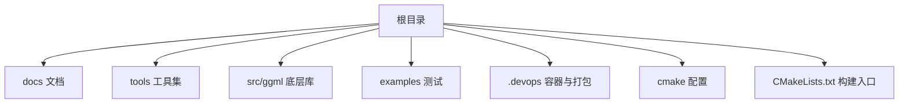
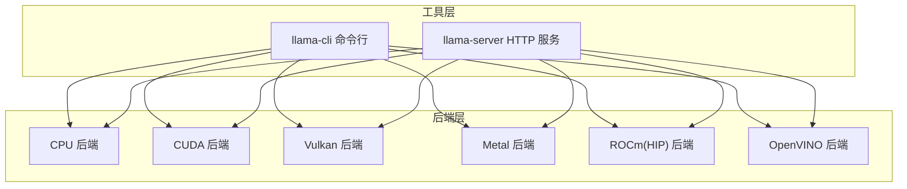
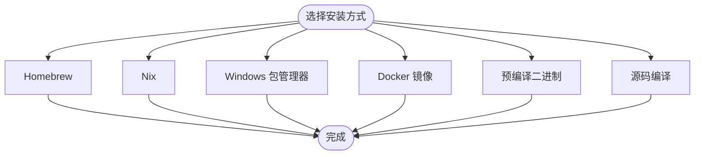
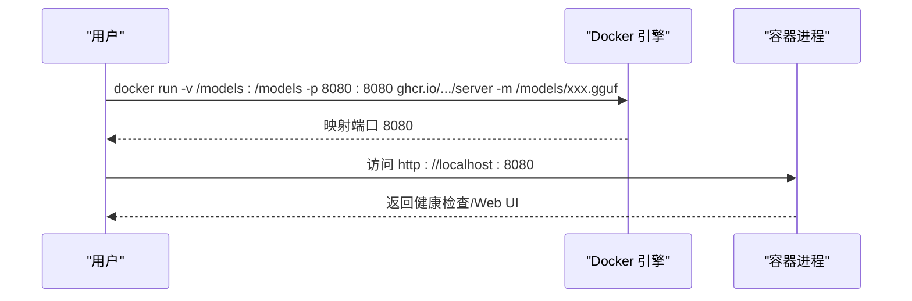
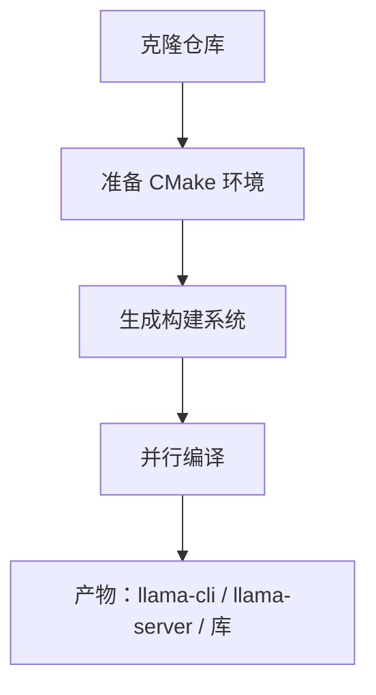
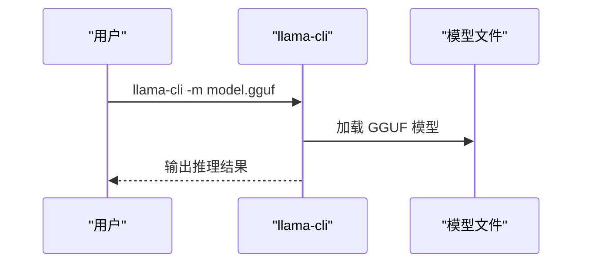
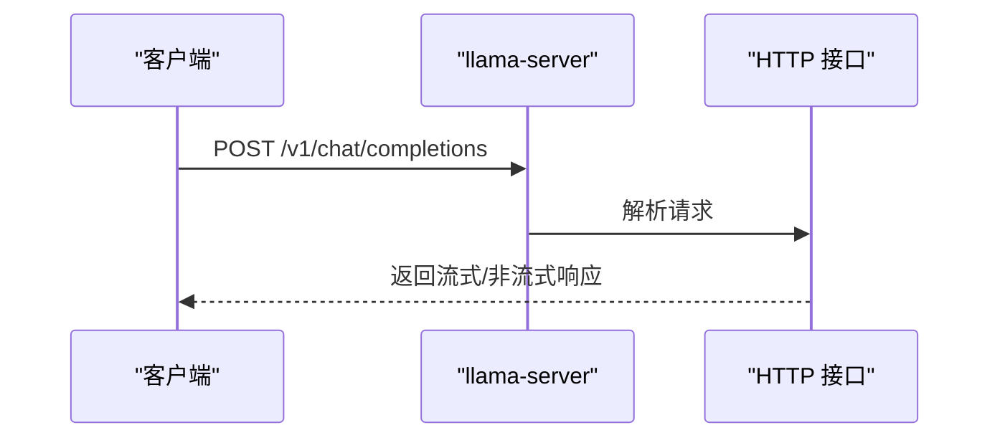
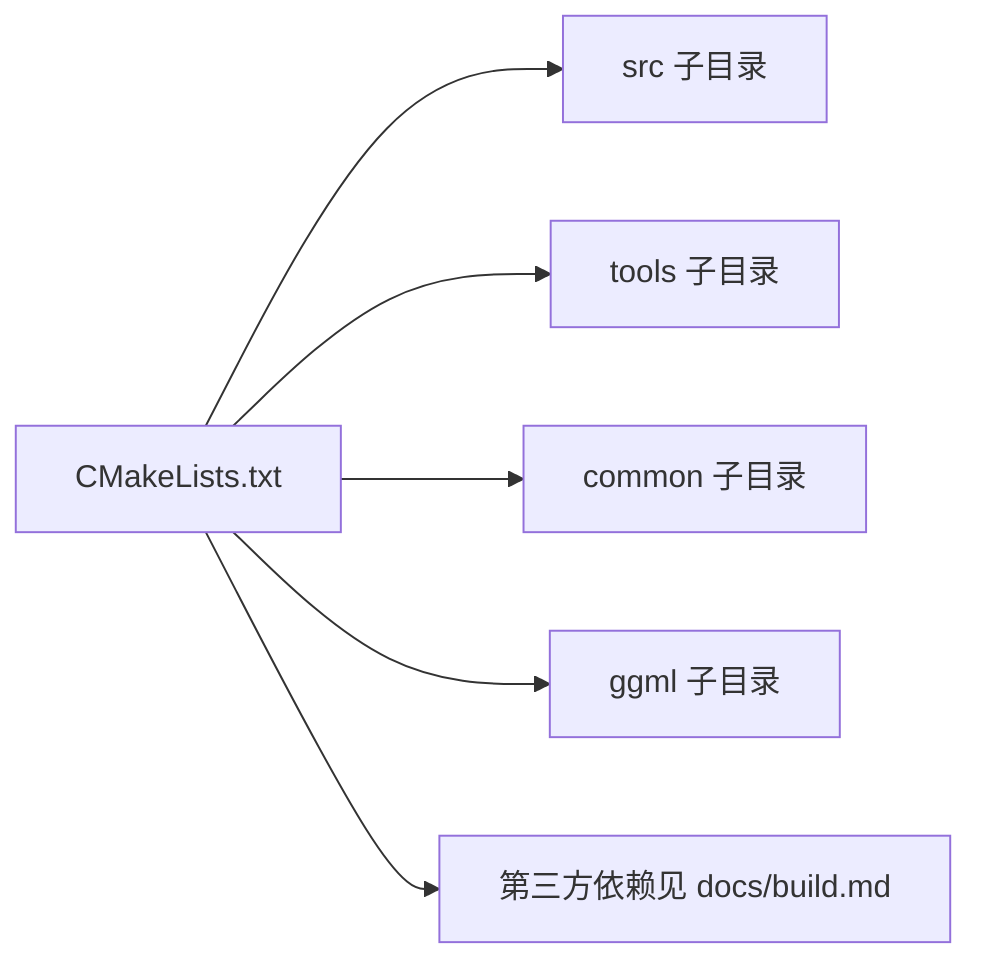

# 快速开始

<cite>
**本文引用的文件**
- [README.md](file://README.md)
- [docs/install.md](file://docs/install.md)
- [docs/docker.md](file://docs/docker.md)
- [docs/build.md](file://docs/build.md)
- [Makefile](file://Makefile)
- [CMakeLists.txt](file://CMakeLists.txt)
- [tools/cli/README.md](file://tools/cli/README.md)
- [tools/server/README.md](file://tools/server/README.md)
- [flake.nix](file://flake.nix)
- [.devops/cpu.Dockerfile](file://.devops/cpu.Dockerfile)
- [.devops/cuda.Dockerfile](file://.devops/cuda.Dockerfile)
- [.devops/rocm.Dockerfile](file://.devops/rocm.Dockerfile)
- [.devops/vulkan.Dockerfile](file://.devops/vulkan.Dockerfile)
- [.devops/openvino.Dockerfile](file://.devops/openvino.Dockerfile)
</cite>

## 目录
1. [简介](#简介)
2. [项目结构](#项目结构)
3. [核心组件](#核心组件)
4. [架构总览](#架构总览)
5. [详细组件分析](#详细组件分析)
6. [依赖关系分析](#依赖关系分析)
7. [性能考虑](#性能考虑)
8. [故障排除指南](#故障排除指南)
9. [结论](#结论)
10. [附录](#附录)

## 简介
本指南面向首次接触 llama.cpp 的用户，提供从零开始的完整安装与使用流程，覆盖多种安装方式（包管理器、Docker、预编译二进制、源码编译），并给出模型获取与基础使用示例，帮助你在本地或容器环境中快速完成推理与服务部署。

## 项目结构
仓库采用模块化组织，核心目录与用途概览：
- docs：构建、安装、Docker 使用等官方文档
- tools：命令行工具与服务器实现（llama-cli、llama-server 等）
- src/ggml：底层张量与后端库（CUDA、Vulkan、Metal 等）
- examples/tests：示例与测试
- .devops：多后端 Dockerfile 与打包脚本
- cmake：CMake 模块与配置
- CMakeLists.txt：顶层构建入口

章节来源
- [README.md:33-56](file://README.md#L33-L56)
- [CMakeLists.txt:1-291](file://CMakeLists.txt#L1-L291)

## 核心组件
- llama-cli：交互式推理工具，支持对话模式、模板、语法约束等
- llama-server：OpenAI 兼容 HTTP 服务，支持并发、连续批处理、多模态、函数调用等
- 后端库（ggml）：提供 CPU、CUDA、Vulkan、Metal、ROCm、OpenVINO 等加速后端

章节来源
- [README.md:325-444](file://README.md#L325-L444)
- [tools/cli/README.md:1-197](file://tools/cli/README.md#L1-L197)
- [tools/server/README.md:1-260](file://tools/server/README.md#L1-L260)

## 架构总览
llama.cpp 的运行时由“工具层”和“后端层”组成。工具层提供 CLI 与 HTTP 服务；后端层负责在不同硬件上执行张量计算。

图表来源
- [tools/cli/README.md:1-197](file://tools/cli/README.md#L1-L197)
- [tools/server/README.md:1-260](file://tools/server/README.md#L1-L260)
- [docs/build.md:275-296](file://docs/build.md#L275-L296)

## 详细组件分析

### 安装方式总览
- 包管理器安装（brew、nix、winget、MacPorts）
- Docker 镜像（CPU、CUDA、ROCm、Vulkan、OpenVINO 多版本）
- 预编译二进制（发布页）
- 源码编译（CMake）

章节来源
- [docs/install.md:1-51](file://docs/install.md#L1-L51)
- [docs/docker.md:1-143](file://docs/docker.md#L1-L143)
- [README.md:35-42](file://README.md#L35-L42)

### 包管理器安装（brew、nix、winget、MacPorts）
- Windows：winget 安装
- macOS/Linux：brew 安装
- macOS：MacPorts 安装
- 多平台：nix 安装

章节来源
- [docs/install.md:10-51](file://docs/install.md#L10-L51)

### Docker 安装与使用
- 镜像类型：full（含转换与量化工具）、light（仅 CLI/Completion）、server（仅 HTTP 服务）
- GPU 支持镜像：CUDA、ROCm、MUSA、Intel SYCL、Vulkan、OpenVINO
- 使用要点：挂载模型目录、设置端口映射、可选 --gpus（CUDA）

图表来源
- [docs/docker.md:43-143](file://docs/docker.md#L43-L143)
- [tools/server/README.md:348-354](file://tools/server/README.md#L348-L354)

章节来源
- [docs/docker.md:7-143](file://docs/docker.md#L7-L143)

### 源码编译（CMake）
- 顶层构建入口：CMakeLists.txt
- Makefile 已弃用，改用 CMake
- 常用选项：启用后端（如 GGML_CUDA、GGML_VULKAN）、静态/动态库、测试与示例开关

图表来源
- [docs/build.md:1-774](file://docs/build.md#L1-L774)
- [CMakeLists.txt:1-291](file://CMakeLists.txt#L1-L291)
- [Makefile:1-10](file://Makefile#L1-L10)

章节来源
- [docs/build.md:31-66](file://docs/build.md#L31-L66)
- [CMakeLists.txt:104-116](file://CMakeLists.txt#L104-L116)

### 模型获取与使用
- 支持直接从 Hugging Face 下载模型（-hf 参数）
- 模型格式：GGUF（可通过 convert 脚本转换）
- 获取建议：优先选择 GGUF 格式，便于本地推理与跨平台复用

章节来源
- [README.md:297-324](file://README.md#L297-L324)

### 基础使用示例

#### 使用 llama-cli 推理
- 加载本地模型文件
- 或通过 -hf 直接下载并运行
- 可进入对话模式（自动识别模板或手动指定）

图表来源
- [README.md:44-55](file://README.md#L44-L55)
- [tools/cli/README.md:1-197](file://tools/cli/README.md#L1-L197)

章节来源
- [README.md:44-55](file://README.md#L44-L55)
- [tools/cli/README.md:1-197](file://tools/cli/README.md#L1-L197)

#### 启动 llama-server 提供 OpenAI 兼容 API
- 默认监听 127.0.0.1:8080，支持 Web UI
- 可通过 Docker 快速部署，或本地编译运行
- 支持并发槽位、连续批处理、多模态、函数调用等

图表来源
- [tools/server/README.md:328-354](file://tools/server/README.md#L328-L354)
- [tools/server/README.md:367-500](file://tools/server/README.md#L367-L500)

章节来源
- [tools/server/README.md:1-260](file://tools/server/README.md#L1-L260)
- [tools/server/README.md:328-354](file://tools/server/README.md#L328-L354)

## 依赖关系分析
- 构建系统：CMake（顶层入口），模块化子目录（src、tools、common、ggml）
- 运行时依赖：各后端库（CUDA、Vulkan、Metal、ROCm、OpenVINO 等）
- 工具链：C/C++ 编译器、CMake、Python（用于模型转换脚本）

图表来源
- [CMakeLists.txt:193-216](file://CMakeLists.txt#L193-L216)
- [docs/build.md:88-131](file://docs/build.md#L88-L131)

章节来源
- [CMakeLists.txt:193-216](file://CMakeLists.txt#L193-L216)
- [docs/build.md:88-131](file://docs/build.md#L88-L131)

## 性能考虑
- 后端选择：根据硬件选择 Metal（Apple）、CUDA（NVIDIA）、ROCm（AMD）、Vulkan（跨平台 GPU）、OpenVINO（Intel CPU/GPU/NPU）
- 线程与批处理：合理设置线程数、上下文大小、批大小与物理批大小
- 设备分层：将部分层加载到 VRAM（-ngl），或使用混合精度
- 连续批处理与并发槽位：提升多用户场景吞吐

章节来源
- [docs/build.md:132-146](file://docs/build.md#L132-L146)
- [tools/server/README.md:177-179](file://tools/server/README.md#L177-L179)
- [tools/cli/README.md:31-38](file://tools/cli/README.md#L31-L38)

## 故障排除指南
- 构建系统变更：不再使用 Makefile，请使用 CMake
- 无法找到后端库：确认已按需启用对应后端（如 GGML_CUDA、GGML_VULKAN 等）
- Docker GPU 不可用：确认已正确安装 nvidia/musa/rocm 等运行时，并在容器中以 --gpus/--device 方式挂载
- 模型加载失败：确保模型为 GGUF 格式，或使用 convert 脚本转换
- 权限与网络：某些功能需要 HTTPS/TLS，可安装 OpenSSL 开发库以启用

章节来源
- [Makefile:6-10](file://Makefile#L6-L10)
- [docs/build.md:83-87](file://docs/build.md#L83-L87)
- [docs/docker.md:75-108](file://docs/docker.md#L75-L108)
- [README.md:314-324](file://README.md#L314-L324)

## 结论
通过本快速开始指南，你可以在多种环境下安装并使用 llama.cpp：从包管理器与 Docker 快速起步，到源码编译获得更强定制能力；从本地推理到启动 OpenAI 兼容 HTTP 服务，满足开发与生产需求。建议先以 Docker 或包管理器验证环境，再根据硬件特性选择合适的后端进行优化。

## 附录

### 多平台安装速查
- Windows：winget
- macOS/Linux：brew、nix、MacPorts
- Docker：CPU、CUDA、ROCm、Vulkan、OpenVINO 镜像
- 源码：CMake 构建，按需启用后端

章节来源
- [docs/install.md:3-51](file://docs/install.md#L3-L51)
- [docs/docker.md:7-41](file://docs/docker.md#L7-L41)
- [docs/build.md:31-66](file://docs/build.md#L31-L66)

### Nix 安装入口
- flake 提供统一入口与可复现环境，支持多后端与交叉构建

章节来源
- [flake.nix:1-181](file://flake.nix#L1-L181)

### Dockerfile 一览（后端）
- CPU：通用 CPU 后端
- CUDA：NVIDIA GPU
- ROCm：AMD GPU
- Vulkan：跨平台 GPU
- OpenVINO：Intel CPU/GPU/NPU

章节来源
- [.devops/cpu.Dockerfile:1-92](file://.devops/cpu.Dockerfile#L1-L92)
- [.devops/cuda.Dockerfile:1-98](file://.devops/cuda.Dockerfile#L1-L98)
- [.devops/rocm.Dockerfile:1-114](file://.devops/rocm.Dockerfile#L1-L114)
- [.devops/vulkan.Dockerfile:1-95](file://.devops/vulkan.Dockerfile#L1-L95)
- [.devops/openvino.Dockerfile:1-185](file://.devops/openvino.Dockerfile#L1-L185)