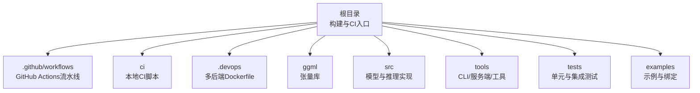
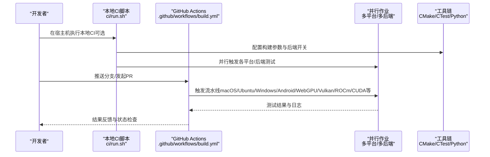
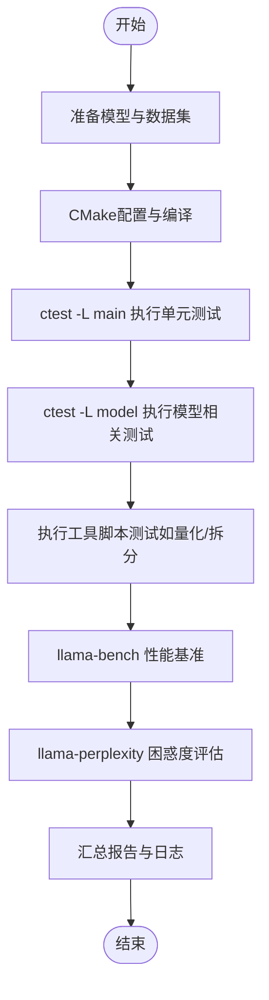
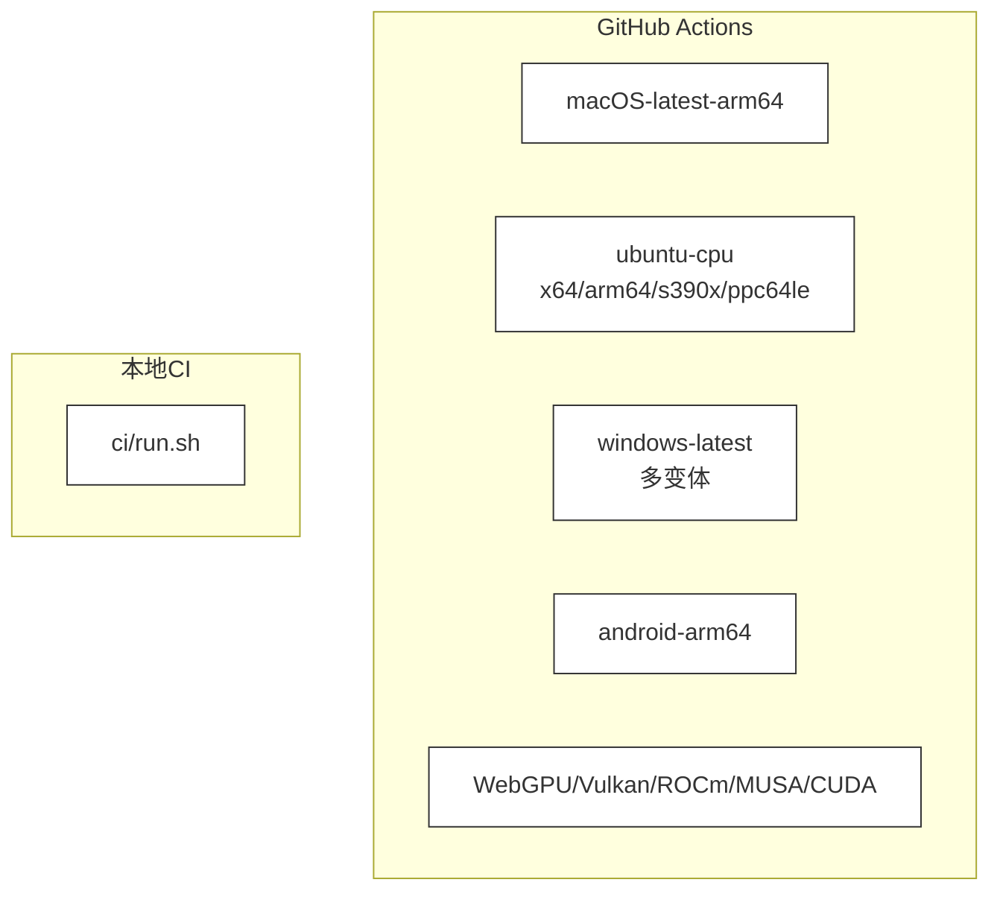
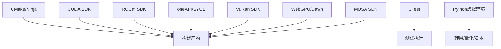

# 开发工作流程

<cite>
**本文引用的文件**   
- [README.md](file://README.md)
- [CONTRIBUTING.md](file://CONTRIBUTING.md)
- [.github/workflows/build.yml](file://.github/workflows/build.yml)
- [ci/README.md](file://ci/README.md)
- [ci/run.sh](file://ci/run.sh)
- [.devops/tools.sh](file://.devops/tools.sh)
- [.devops/cpu.Dockerfile](file://.devops/cpu.Dockerfile)
- [.devops/cuda.Dockerfile](file://.devops/cuda.Dockerfile)
- [.devops/rocm.Dockerfile](file://.devops/rocm.Dockerfile)
</cite>

## 目录
1. [简介](#简介)
2. [项目结构](#项目结构)
3. [核心组件](#核心组件)
4. [架构总览](#架构总览)
5. [详细组件分析](#详细组件分析)
6. [依赖关系分析](#依赖关系分析)
7. [性能考量](#性能考量)
8. [故障排查指南](#故障排查指南)
9. [结论](#结论)
10. [附录](#附录)

## 简介
本指南面向扩展开发者，系统化梳理从环境搭建、代码规范与提交流程，到测试策略（单元、集成、性能）、持续集成与自动化测试、代码审查与质量门禁、发布管理、调试与排错、文档维护、社区贡献与开源协作，以及版本控制与分支管理等全链路工作流程。内容以仓库现有 CI、脚本与文档为依据，确保可落地、可复用。

## 项目结构
该仓库采用模块化与多后端并行的工程组织方式：
- 根目录包含构建入口、CI 脚本与工作流、Docker 多后端镜像定义、示例与工具等。
- 源码按领域拆分：ggml 张量库、模型实现、通用工具、服务端与 CLI 工具、测试与基准工具等。
- .github/workflows 提供跨平台、多后端的自动化流水线；ci/run.sh 支持本地自建 CI 的完整覆盖。

图示来源
- [.github/workflows/build.yml](file://.github/workflows/build.yml)
- [ci/run.sh](file://ci/run.sh)
- [.devops/cpu.Dockerfile](file://.devops/cpu.Dockerfile)

章节来源
- [README.md: 1-597:1-597](file://README.md#L1-L597)

## 核心组件
- 构建与测试
  - CMake 驱动的多后端构建（CPU、CUDA、HIP/ROCm、Vulkan、WebGPU、SYCL、RPC 等）。
  - CTest 分类标签驱动的测试执行（main、model、python 等）。
- 自动化流水线
  - GitHub Actions 覆盖 macOS、Ubuntu、Windows、Android、WebGPU、Vulkan、ROCm、MUSA、CUDA 等平台与后端。
- 本地 CI
  - ci/run.sh 提供统一入口，支持通过环境变量启用不同后端与模式，自动下载模型与数据集，执行转换、量化、困惑度评估、嵌入与重排序等任务。
- 开发工具与容器
  - .devops/*.Dockerfile 定义 CPU、CUDA、ROCm 等运行时镜像，配合 .devops/tools.sh 提供一键式工具入口。

章节来源
- [.github/workflows/build.yml: 1-800:1-800](file://.github/workflows/build.yml#L1-L800)
- [ci/README.md: 1-34:1-34](file://ci/README.md#L1-L34)
- [ci/run.sh: 1-744:1-744](file://ci/run.sh#L1-L744)
- [.devops/tools.sh: 1-54:1-54](file://.devops/tools.sh#L1-L54)

## 架构总览
下图展示从开发者本地到云端 CI 的整体流程：本地开发与自检 → 提交 PR 触发 GitHub Actions → 多平台多后端流水线并行执行 → 本地 CI 可在宿主机器上复现完整测试矩阵。

图示来源
- [ci/run.sh: 1-744:1-744](file://ci/run.sh#L1-L744)
- [.github/workflows/build.yml: 1-800:1-800](file://.github/workflows/build.yml#L1-L800)

## 详细组件分析

### 环境搭建与本地开发
- 快速开始与安装
  - 支持 brew、nix、winget、Docker、预编译二进制与源码构建等多种方式。
- 本地 CI 运行
  - 使用 ci/run.sh 在宿主机复现完整 CI 矩阵，支持通过环境变量开启 CUDA、ROCm、SYCL、Vulkan、WebGPU、MUSA、BLAS、OpenVINO 等后端。
  - 建议先在 CPU-only 模式验证，再逐步叠加后端以定位问题。
- 容器化开发
  - 使用 .devops/*.Dockerfile 构建运行时镜像，结合 .devops/tools.sh 提供统一入口（转换、量化、运行、服务器等）。

章节来源
- [README.md: 33-597:33-597](file://README.md#L33-L597)
- [ci/README.md: 1-34:1-34](file://ci/README.md#L1-L34)
- [ci/run.sh: 1-744:1-744](file://ci/run.sh#L1-L744)
- [.devops/cpu.Dockerfile: 1-92:1-92](file://.devops/cpu.Dockerfile#L1-L92)
- [.devops/cuda.Dockerfile: 1-98:1-98](file://.devops/cuda.Dockerfile#L1-L98)
- [.devops/rocm.Dockerfile: 1-114:1-114](file://.devops/rocm.Dockerfile#L1-L114)
- [.devops/tools.sh: 1-54:1-54](file://.devops/tools.sh#L1-L54)

### 代码规范与提交流程
- 提交前自检
  - 在本地执行完整 CI（ci/run.sh），确保无回归；使用困惑度与性能工具（llama-perplexity、llama-bench）验证质量与性能。
  - 若修改 ggml 源码或算子，需补充 test-backend-ops 对齐不同后端输出。
- PR 规范
  - 单一功能/修复一个 PR；复杂特性建议先开需求讨论；新增数据类型需提供量化对比与性能数据。
  - 允许维护者直接推送修改以加速评审。
- 合并策略
  - 维护者负责 squash 合并，提交标题格式包含模块与 Issue 编号。

章节来源
- [CONTRIBUTING.md: 29-70:29-70](file://CONTRIBUTING.md#L29-L70)

### 测试策略
- 单元测试
  - CTest 分类标签驱动：ctest -L main、model、python 等，按标签选择性执行。
- 集成测试
  - 本地 CI 自动下载模型与数据集，执行转换、量化、生成、困惑度、嵌入、重排序等端到端流程。
- 性能测试
  - 使用 llama-bench 评估不同参数组合下的吞吐与延迟；结合 llama-perplexity 验证质量稳定性。

图示来源
- [ci/run.sh: 251-284:251-284](file://ci/run.sh#L251-L284)
- [ci/run.sh: 285-307:285-307](file://ci/run.sh#L285-L307)
- [ci/run.sh: 372-518:372-518](file://ci/run.sh#L372-L518)
- [ci/run.sh: 520-632:520-632](file://ci/run.sh#L520-L632)

章节来源
- [ci/run.sh: 251-284:251-284](file://ci/run.sh#L251-L284)
- [ci/run.sh: 285-307:285-307](file://ci/run.sh#L285-L307)
- [ci/run.sh: 372-518:372-518](file://ci/run.sh#L372-L518)
- [ci/run.sh: 520-632:520-632](file://ci/run.sh#L520-L632)

### 持续集成与自动化测试
- GitHub Actions
  - 覆盖 macOS（ARM/Intel）、Ubuntu（x64/arm64/s390x/ppc64le）、Windows（x64/ARM64）、Android、WebGPU、Vulkan、ROCm、MUSA、CUDA 等平台与后端。
  - 支持缓存（ccache）、并发取消、超时控制与分类标签测试。
- 本地 CI
  - ci/run.sh 提供与云端一致的测试矩阵，便于快速定位问题与减少云端资源占用。

图示来源
- [.github/workflows/build.yml: 63-800:63-800](file://.github/workflows/build.yml#L63-L800)
- [ci/run.sh: 1-744:1-744](file://ci/run.sh#L1-L744)

章节来源
- [.github/workflows/build.yml: 63-800:63-800](file://.github/workflows/build.yml#L63-L800)
- [ci/README.md: 1-34:1-34](file://ci/README.md#L1-L34)

### 代码审查与质量门禁
- 代码审查
  - 由维护者主导，遵循提交前自检与最小变更原则；允许维护者直接推送修改以推进评审。
- 质量门禁
  - 通过 CTest 分类标签与本地 CI 的一致性校验；对 ggml 修改要求 test-backend-ops 对齐。
  - 新增数据类型需提供量化与性能对比数据。

章节来源
- [CONTRIBUTING.md: 29-70:29-70](file://CONTRIBUTING.md#L29-L70)
- [CONTRIBUTING.md: 43-47:43-47](file://CONTRIBUTING.md#L43-L47)

### 发布管理
- 合并与提交
  - 维护者负责 squash 合并，提交标题包含模块与 Issue 编号，便于追踪。
- 版本与产物
  - 仓库通过 GitHub Releases 发布二进制与包；容器镜像由 .devops/*.Dockerfile 构建并可作为运行时分发。

章节来源
- [CONTRIBUTING.md: 59-64:59-64](file://CONTRIBUTING.md#L59-L64)
- [README.md: 5-7:5-7](file://README.md#L5-L7)

### 调试工具与故障排查
- 日志与诊断
  - 设置日志前缀与时间戳，便于定位问题；部分作业启用内存泄漏检测（如 macOS Metal）。
- 本地复现
  - 使用 ci/run.sh 在宿主机复现云端失败场景；按后端启用环境变量（如 GG_BUILD_CUDA、GG_BUILD_ROCM 等）。
- 容器辅助
  - 使用 .devops/tools.sh 一键调用转换、量化、运行、服务器等工具，便于隔离与复现。

章节来源
- [.github/workflows/build.yml: 52-58:52-58](file://.github/workflows/build.yml#L52-L58)
- [ci/run.sh: 697-744:697-744](file://ci/run.sh#L697-L744)
- [.devops/tools.sh: 1-54:1-54](file://.devops/tools.sh#L1-L54)

### 文档编写与维护
- 文档职责
  - 文档是社区共同维护；当需要查阅源码理解 API 时，应在头文件中添加简要说明以便后续参考。
- 文档更新
  - 发现过时或错误信息应及时更新；保持与代码变更同步。

章节来源
- [CONTRIBUTING.md: 185-190:185-190](file://CONTRIBUTING.md#L185-L190)

### 社区贡献与开源协作
- 贡献者等级
  - 区分贡献者、协同者与维护者三类角色，明确职责与权限。
- AI 使用政策
  - 明确禁止完全或主要由 AI 生成的 PR；若使用 AI 辅助，需披露并进行人工审查。
- 讨论与问题
  - 利用 Issues、PRs 与 Discussions 获取背景信息与最佳实践。

章节来源
- [CONTRIBUTING.md: 1-27:1-27](file://CONTRIBUTING.md#L1-L27)
- [README.md: 13-30:13-30](file://README.md#L13-L30)

### 版本控制与分支管理
- 触发机制
  - push 到 master 与 pull_request 触发流水线；路径过滤仅在相关文件变更时运行。
- 并发与缓存
  - 使用 concurrency 控制并行作业；ccache 加速构建。
- 分支策略
  - 建议每个 PR 专注单一功能；复杂特性先行需求讨论；新增数据类型需满足额外条件。

章节来源
- [.github/workflows/build.yml: 3-46:3-46](file://.github/workflows/build.yml#L3-L46)
- [CONTRIBUTING.md: 39-49:39-49](file://CONTRIBUTING.md#L39-L49)

## 依赖关系分析
- 构建与测试依赖
  - CMake 与 Ninja（可选）用于配置与构建；CTest 用于测试；Python 虚拟环境用于工具链与脚本。
- 后端依赖
  - CUDA、ROCm、SYCL、Vulkan、WebGPU、MUSA 等后端分别依赖对应 SDK 或运行时。
- 容器依赖
  - Dockerfile 基于 Ubuntu/ROCm/ROCm 运行时镜像，安装必要工具链与运行时库。

图示来源
- [.github/workflows/build.yml: 63-800:63-800](file://.github/workflows/build.yml#L63-L800)
- [ci/run.sh: 71-176:71-176](file://ci/run.sh#L71-L176)
- [.devops/cpu.Dockerfile: 7-22:7-22](file://.devops/cpu.Dockerfile#L7-L22)
- [.devops/cuda.Dockerfile: 14-27:14-27](file://.devops/cuda.Dockerfile#L14-L27)
- [.devops/rocm.Dockerfile: 24-44:24-44](file://.devops/rocm.Dockerfile#L24-L44)

章节来源
- [.github/workflows/build.yml: 63-800:63-800](file://.github/workflows/build.yml#L63-L800)
- [ci/run.sh: 71-176:71-176](file://ci/run.sh#L71-L176)

## 性能考量
- 性能基准
  - 使用 llama-bench 对比不同后端与参数组合的吞吐与延迟。
- 质量评估
  - 使用 llama-perplexity 评估模型质量，避免回归。
- 量化与精度
  - 新增数据类型需提供与 FP16/BF16 的对比与 KL 散度数据。

章节来源
- [CONTRIBUTING.md: 43-47:43-47](file://CONTRIBUTING.md#L43-L47)
- [README.md: 472-491:472-491](file://README.md#L472-L491)

## 故障排查指南
- 常见问题定位
  - 查看 CTest 输出与日志文件；确认后端开关是否正确；核对模型路径与权限。
- 本地复现
  - 使用 ci/run.sh 指定后端环境变量，复现云端失败场景；必要时降低测试范围（如排除耗时测试）。
- 容器辅助
  - 使用 .devops/tools.sh 快速切换工具入口，隔离环境差异。

章节来源
- [ci/run.sh: 178-217:178-217](file://ci/run.sh#L178-L217)
- [ci/run.sh: 220-284:220-284](file://ci/run.sh#L220-L284)
- [.devops/tools.sh: 1-54:1-54](file://.devops/tools.sh#L1-L54)

## 结论
本指南将仓库现有的 CI、脚本与文档转化为可操作的工作流程：以本地 CI 为先、以分类测试为纲、以多后端并行为基、以容器与工具链为辅，形成从开发到评审再到发布的闭环。遵循上述流程可显著提升扩展开发效率与质量稳定性。

## 附录
- 关键命令与入口
  - 本地 CI：bash ./ci/run.sh <输出目录> <挂载目录>
  - 容器工具：./.devops/tools.sh --convert/--quantize/--run/--bench/--perplexity/--server
  - Docker 构建：使用 .devops/*.Dockerfile 构建 CPU/CUDA/ROCm 运行时镜像

章节来源
- [ci/README.md: 7-26:7-26](file://ci/README.md#L7-L26)
- [.devops/tools.sh: 10-53:10-53](file://.devops/tools.sh#L10-L53)
- [.devops/cpu.Dockerfile: 16-33:16-33](file://.devops/cpu.Dockerfile#L16-L33)
- [.devops/cuda.Dockerfile: 23-38:23-38](file://.devops/cuda.Dockerfile#L23-L38)
- [.devops/rocm.Dockerfile: 37-55:37-55](file://.devops/rocm.Dockerfile#L37-L55)