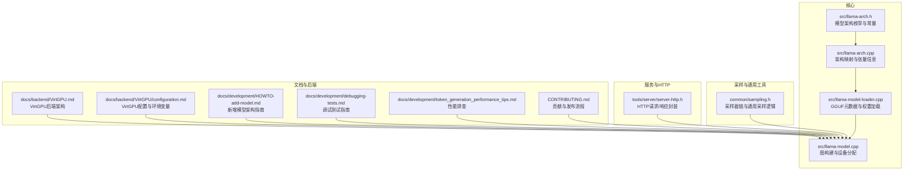
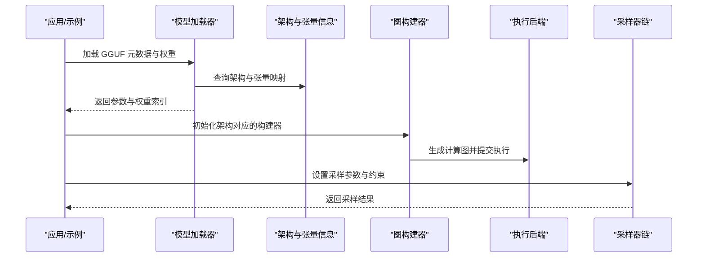
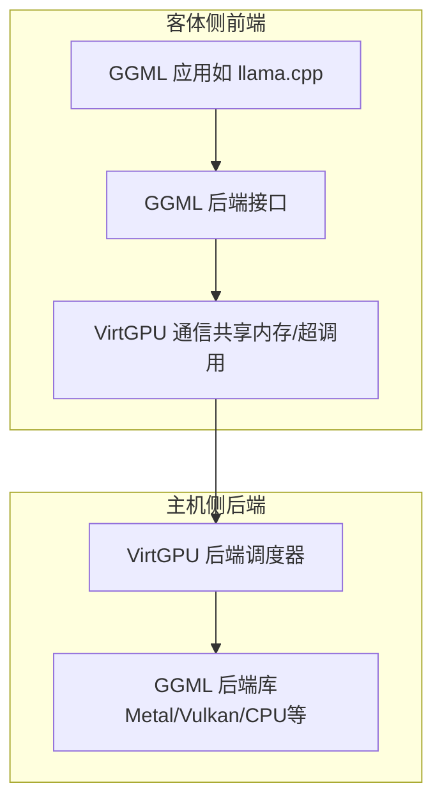
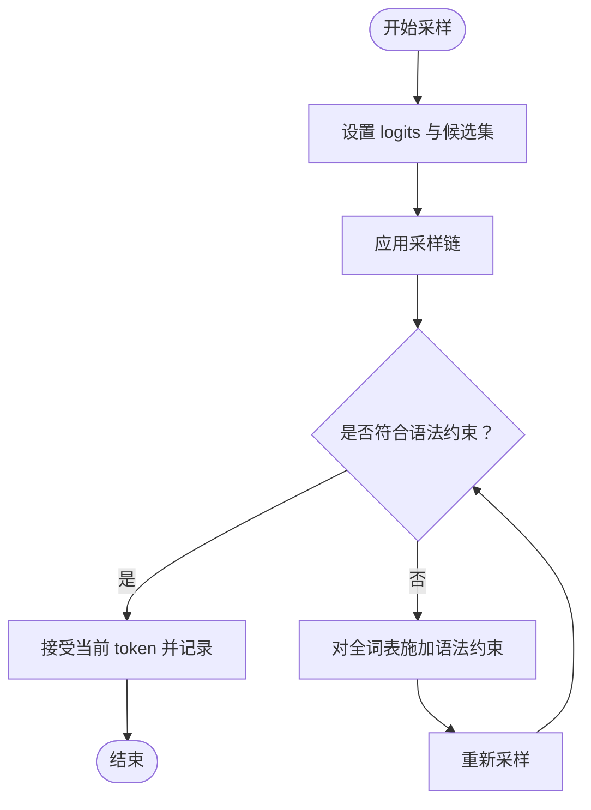
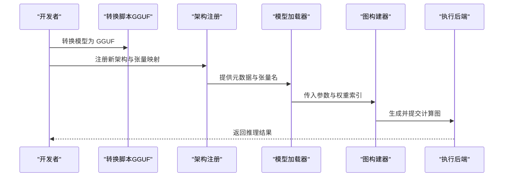
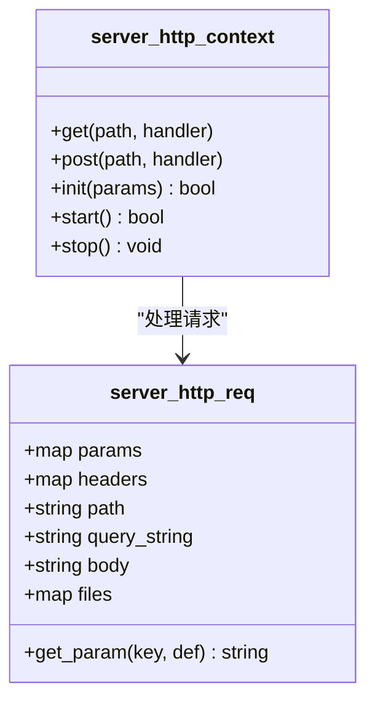
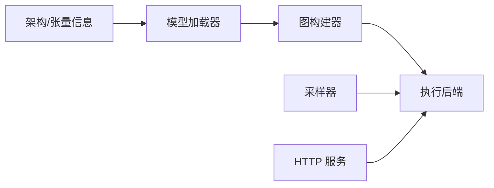

# 扩展和插件开发

<cite>
**本文引用的文件**
- [README.md](file://README.md)
- [HOWTO-add-model.md](file://docs/development/HOWTO-add-model.md)
- [debugging-tests.md](file://docs/development/debugging-tests.md)
- [token_generation_performance_tips.md](file://docs/development/token_generation_performance_tips.md)
- [CONTRIBUTING.md](file://CONTRIBUTING.md)
- [llama-arch.h](file://src/llama-arch.h)
- [llama-arch.cpp](file://src/llama-arch.cpp)
- [llama-model-loader.cpp](file://src/llama-model-loader.cpp)
- [llama-model.cpp](file://src/llama-model.cpp)
- [sampling.h](file://common/sampling.h)
- [server-http.h](file://tools/server/server-http.h)
- [VirtGPU.md](file://docs/backend/VirtGPU.md)
- [configuration.md](file://docs/backend/VirtGPU/configuration.md)
</cite>

## 目录
1. [简介](#简介)
2. [项目结构](#项目结构)
3. [核心组件](#核心组件)
4. [架构总览](#架构总览)
5. [详细组件分析](#详细组件分析)
6. [依赖关系分析](#依赖关系分析)
7. [性能考量](#性能考量)
8. [故障排查指南](#故障排查指南)
9. [结论](#结论)
10. [附录](#附录)

## 简介
本指南面向希望在 llama.cpp 基础上进行扩展与定制的开发者，覆盖以下主题：
- 自定义后端（backend）的开发流程：接口实现、性能优化与测试验证
- 采样器（sampler）扩展：方法与实现技巧
- 新模型架构支持：模型注册、前向图构建与优化策略
- 第三方集成：API 扩展与插件架构最佳实践
- 完整开发示例与代码模板路径
- 调试与测试方法
- 版本兼容性与升级策略
- 社区贡献与发布流程

## 项目结构
llama.cpp 采用模块化分层设计：
- 核心推理引擎位于 src/，包含模型加载、参数解析、图构建与执行等
- 后端抽象通过 ggml 后端接口实现，支持 CPU、CUDA、Metal、Vulkan 等
- 工具与示例位于 tools/ 与 examples/，便于集成与二次开发
- 文档位于 docs/，涵盖开发、调试、性能优化与后端适配指南

**图表来源**
- [llama-arch.h](file://src/llama-arch.h)
- [llama-arch.cpp](file://src/llama-arch.cpp)
- [llama-model-loader.cpp](file://src/llama-model-loader.cpp)
- [llama-model.cpp](file://src/llama-model.cpp)
- [sampling.h](file://common/sampling.h)
- [server-http.h](file://tools/server/server-http.h)
- [VirtGPU.md](file://docs/backend/VirtGPU.md)
- [configuration.md](file://docs/backend/VirtGPU/configuration.md)
- [HOWTO-add-model.md](file://docs/development/HOWTO-add-model.md)
- [debugging-tests.md](file://docs/development/debugging-tests.md)
- [token_generation_performance_tips.md](file://docs/development/token_generation_performance_tips.md)
- [CONTRIBUTING.md](file://CONTRIBUTING.md)

**章节来源**
- [README.md](file://README.md)
- [HOWTO-add-model.md](file://docs/development/HOWTO-add-model.md)

## 核心组件
- 模型架构与张量命名规范：通过枚举与名称生成器统一不同模型的张量命名，确保图构建一致性
- 模型加载器：从 GGUF 元数据读取参数、校验权重并建立张量索引
- 图构建与执行：根据架构选择对应的构建器，生成计算图并在后端执行
- 采样器：提供可组合的采样链，支持 top-k、top-p、温度、多样性采样等
- HTTP 服务：提供 REST 接口封装，便于 API 扩展与插件集成

**章节来源**
- [llama-arch.h](file://src/llama-arch.h)
- [llama-arch.cpp](file://src/llama-arch.cpp)
- [llama-model-loader.cpp](file://src/llama-model-loader.cpp)
- [llama-model.cpp](file://src/llama-model.cpp)
- [sampling.h](file://common/sampling.h)
- [server-http.h](file://tools/server/server-http.h)

## 架构总览
下图展示从模型加载到图执行的关键路径，以及后端与服务层的交互。

**图表来源**
- [llama-model-loader.cpp](file://src/llama-model-loader.cpp)
- [llama-arch.cpp](file://src/llama-arch.cpp)
- [llama-model.cpp](file://src/llama-model.cpp)
- [sampling.h](file://common/sampling.h)

## 详细组件分析

### 自定义后端开发（以 VirtGPU 为例）
VirtGPU 提供了跨主机-客体（Host-Guest）的后端抽象，通过共享内存与超调用实现高效通信。

- 关键特性
  - 动态加载主机侧后端库
  - 零拷贝数据传输（共享内存页）
  - 支持设备/缓冲操作与计算转发
- 配置要点
  - 环境变量：后端库路径、日志输出等
  - 协议：握手、动态加载、转发三类命令
  - 序列化：固定/变长编码与边界检查

**图表来源**
- [VirtGPU.md](file://docs/backend/VirtGPU.md)
- [configuration.md](file://docs/backend/VirtGPU/configuration.md)

**章节来源**
- [VirtGPU.md](file://docs/backend/VirtGPU.md)
- [configuration.md](file://docs/backend/VirtGPU/configuration.md)

### 采样器扩展与实现技巧
- 通用采样器链：支持按顺序添加多种采样策略（top-k、top-p、温度、多样性采样等），并可结合语法约束
- 采样流程
  - 设置候选集与 logits
  - 应用采样链
  - 语法约束验证；若不满足则回退到全词表约束
  - 记录历史与性能指标
- 实现建议
  - 将采样链参数化，便于在不同场景切换
  - 对大模型或复杂语法，优先对候选集应用约束以提升性能
  - 使用统一的候选容器访问未采样词的概率分布

**图表来源**
- [sampling.h](file://common/sampling.h)

**章节来源**
- [sampling.h](file://common/sampling.h)

### 新模型架构支持开发（注册、构建与优化）
- 步骤概览
  - 将模型转换为 GGUF（Python 脚本）
  - 在 C++ 中注册新架构、映射张量名、加载元数据
  - 实现图构建器，生成对应计算图
  - 可选：多模态编码器扩展
- 关键实现点
  - 架构注册与张量命名：在架构头/源文件中添加新枚举值与张量信息
  - 模型加载：从 GGUF 读取参数、KV 键、张量布局，建立权重索引
  - 图构建：根据架构实例化对应的构建器，拼接算子形成计算图
  - 设备与分片：根据张量维度与后端能力进行切分与放置
- 性能优化
  - 利用 ggml 的张量信息（层类型、算子）指导缓冲类型与放置
  - 针对注意力/FFN/SSM 等关键路径选择合适后端与量化方案
  - 对 Recurrent/Mamba 类模型，关注线性注意力与状态缓存的切分策略

**图表来源**
- [HOWTO-add-model.md](file://docs/development/HOWTO-add-model.md)
- [llama-arch.h](file://src/llama-arch.h)
- [llama-arch.cpp](file://src/llama-arch.cpp)
- [llama-model-loader.cpp](file://src/llama-model-loader.cpp)
- [llama-model.cpp](file://src/llama-model.cpp)

**章节来源**
- [HOWTO-add-model.md](file://docs/development/HOWTO-add-model.md)
- [llama-arch.h](file://src/llama-arch.h)
- [llama-arch.cpp](file://src/llama-arch.cpp)
- [llama-model-loader.cpp](file://src/llama-model-loader.cpp)
- [llama-model.cpp](file://src/llama-model.cpp)

### 第三方集成：API 扩展与插件架构
- HTTP 层封装：提供请求/响应结构与处理器注册机制，便于扩展路由与中间件
- 插件建议
  - 以模块化方式组织路由与业务逻辑
  - 通过统一的上下文传递参数与状态
  - 对外部资源（文件上传、远程服务）进行安全与超时控制
- 示例参考
  - 服务端 HTTP 请求/响应结构与处理器注册接口

**图表来源**
- [server-http.h](file://tools/server/server-http.h)

**章节来源**
- [server-http.h](file://tools/server/server-http.h)

## 依赖关系分析
- 组件耦合
  - 架构层与加载层强相关：加载器依赖架构映射与张量信息
  - 图构建器依赖架构与加载器提供的参数
  - 执行后端与图构建器解耦，通过 ggml 后端接口抽象
  - 采样器独立于图构建，但依赖上下文与候选集
- 外部依赖
  - ggml 后端库（CPU、CUDA、Metal、Vulkan 等）
  - HTTP 服务器与 JSON 解析库（用于服务端）

**图表来源**
- [llama-arch.cpp](file://src/llama-arch.cpp)
- [llama-model-loader.cpp](file://src/llama-model-loader.cpp)
- [llama-model.cpp](file://src/llama-model.cpp)
- [sampling.h](file://common/sampling.h)
- [server-http.h](file://tools/server/server-http.h)

**章节来源**
- [llama-arch.cpp](file://src/llama-arch.cpp)
- [llama-model-loader.cpp](file://src/llama-model-loader.cpp)
- [llama-model.cpp](file://src/llama-model.cpp)
- [sampling.h](file://common/sampling.h)
- [server-http.h](file://tools/server/server-http.h)

## 性能考量
- GPU 使用确认：编译启用后端并使用相应标志，运行时观察后端卸载提示
- 线程数控制：避免 CPU 过饱和，必要时降低线程数以提升吞吐
- 分片与放置：根据张量维度与后端能力进行合理切分与缓冲类型选择
- 采样优化：对候选集施加语法约束以减少全词表开销

**章节来源**
- [token_generation_performance_tips.md](file://docs/development/token_generation_performance_tips.md)

## 故障排查指南
- 快速调试测试
  - 使用调试脚本定位测试、设置断点、在 GDB 中运行
  - 通过正则匹配筛选目标测试，缩短反馈循环
- 日志与诊断
  - 后端日志：VirtGPU 支持将日志写入指定文件
  - 运行时诊断：关注后端卸载与设备使用情况
- 常见问题
  - 张量重复：加载器会检测重复张量名并报错
  - 分片计数不一致：多分片模型需确保分片数量与索引正确
  - 未知架构：加载器无法识别的架构会抛出异常

**章节来源**
- [debugging-tests.md](file://docs/development/debugging-tests.md)
- [configuration.md](file://docs/backend/VirtGPU/configuration.md)
- [llama-model-loader.cpp](file://src/llama-model-loader.cpp)

## 结论
通过明确的模块划分与抽象接口，llama.cpp 为扩展后端、采样器与新模型架构提供了清晰路径。遵循本文的开发流程、性能优化与测试方法，可在保证兼容性的前提下快速迭代与集成。

## 附录
- 开发示例与模板路径
  - 新增模型架构：参考文档与现有模型实现
  - 自定义后端：参考 VirtGPU 文档与接口
  - 采样器扩展：参考通用采样器接口与示例
  - 服务扩展：参考 HTTP 请求/响应封装与处理器注册
- 版本兼容性与升级策略
  - 遵循贡献指南中的命名、编码与维护要求
  - 对后端扩展与新数据类型，提供对比实验与基准数据
  - 保持与 ggml 接口的兼容性，避免破坏性变更
- 社区贡献与发布流程
  - 提交 PR 前先本地完整 CI
  - 遵循 AI 使用政策与贡献指南
  - 保持代码可维护性与文档同步更新

**章节来源**
- [HOWTO-add-model.md](file://docs/development/HOWTO-add-model.md)
- [VirtGPU.md](file://docs/backend/VirtGPU.md)
- [sampling.h](file://common/sampling.h)
- [server-http.h](file://tools/server/server-http.h)
- [CONTRIBUTING.md](file://CONTRIBUTING.md)