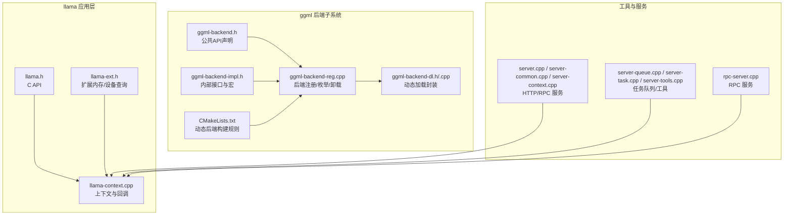
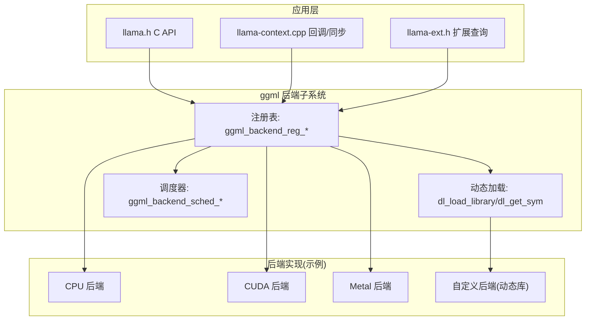
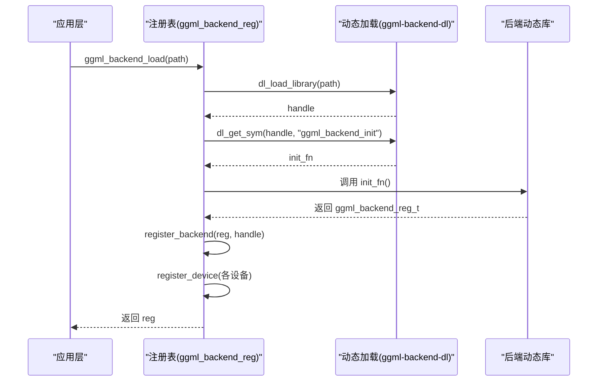
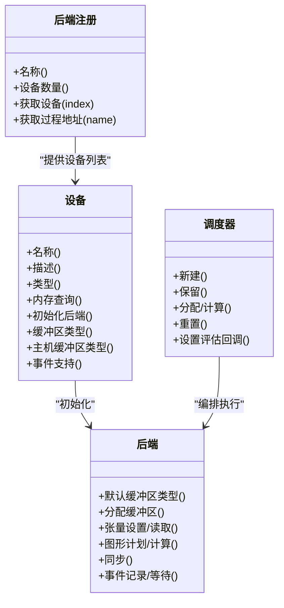
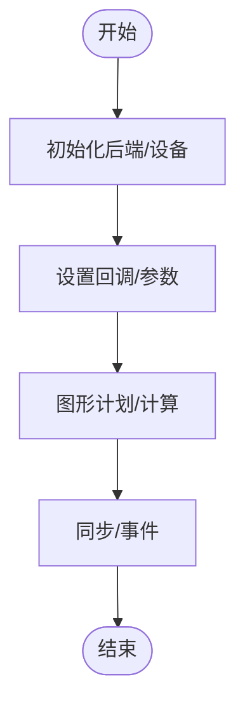
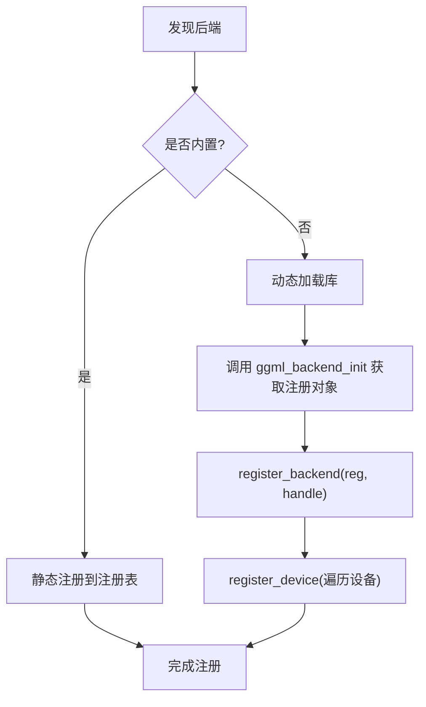
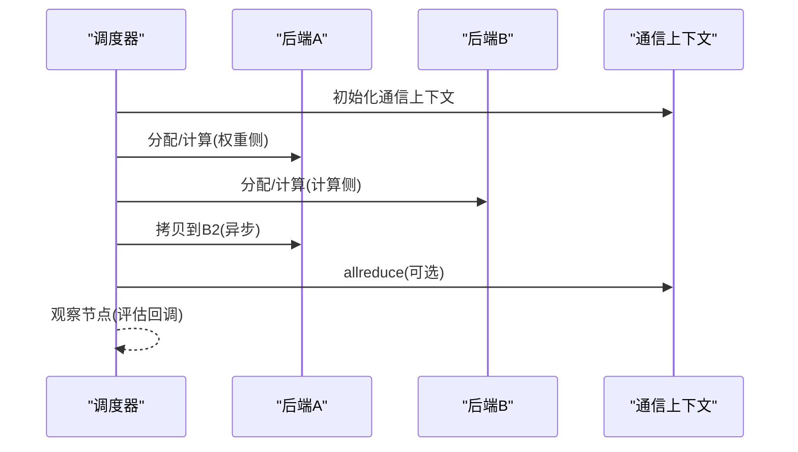
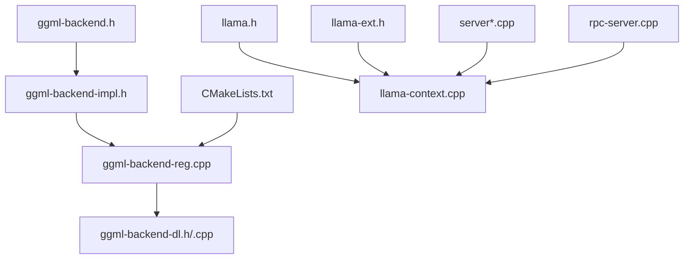

# 插件架构设计

<cite>
**本文引用的文件**
- [ggml-backend.h](file://ggml/include/ggml-backend.h)
- [ggml-backend-impl.h](file://ggml/src/ggml-backend-impl.h)
- [ggml-backend-reg.cpp](file://ggml/src/ggml-backend-reg.cpp)
- [ggml-backend-dl.h](file://ggml/src/ggml-backend-dl.h)
- [ggml-backend-dl.cpp](file://ggml/src/ggml-backend-dl.cpp)
- [CMakeLists.txt](file://ggml/src/CMakeLists.txt)
- [llama.h](file://include/llama.h)
- [llama-context.cpp](file://src/llama-context.cpp)
- [llama-ext.h](file://src/llama-ext.h)
- [llama.cpp](file://examples/simple/llama.cpp)
- [server.cpp](file://tools/server/server.cpp)
- [server-common.cpp](file://tools/server/server-common.cpp)
- [server-context.cpp](file://tools/server/server-context.cpp)
- [server-queue.cpp](file://tools/server/server-queue.cpp)
- [server-task.cpp](file://tools/server/server-task.cpp)
- [server-tools.cpp](file://tools/server/server-tools.cpp)
- [server-http.cpp](file://tools/server/server-http.cpp)
- [server-models.cpp](file://tools/server/server-models.cpp)
- [server-chat.cpp](file://tools/server/server-chat.cpp)
- [server-chat.h](file://tools/server/server-chat.h)
- [rpc-server.cpp](file://tools/rpc/rpc-server.cpp)
- [ggml-backend.cpp](file://ggml/src/ggml-backend.cpp)
</cite>

## 目录
1. [引言](#引言)
2. [项目结构](#项目结构)
3. [核心组件](#核心组件)
4. [架构总览](#架构总览)
5. [组件详解](#组件详解)
6. [依赖关系分析](#依赖关系分析)
7. [性能考量](#性能考量)
8. [故障排查指南](#故障排查指南)
9. [结论](#结论)
10. [附录](#附录)

## 引言
本文件面向希望在 llama.cpp 基础上进行插件化扩展与二次开发的工程师，系统阐述其“后端插件化”（Backend Plugin）的设计理念、动态加载机制、接口规范、生命周期管理、依赖与配置体系、跨插件通信与数据共享、安全隔离与资源限制、打包分发与版本管理策略，并提供可操作的开发示例与模板路径指引。本文所有技术细节均以仓库源码为依据，避免臆测。

## 项目结构
llama.cpp 的插件化能力主要由 ggml 后端子系统提供，核心围绕“设备/后端注册表 + 动态加载 + 调度器”的架构展开；应用层（如命令行、服务器、RPC 等）通过统一的 C 接口与后端交互。下图给出与插件相关的关键模块与文件映射：

**图表来源**
- [ggml-backend.h:228-258](file://ggml/include/ggml-backend.h#L228-L258)
- [ggml-backend-reg.cpp:1-392](file://ggml/src/ggml-backend-reg.cpp#L1-L392)
- [ggml-backend-dl.h:1-44](file://ggml/src/ggml-backend-dl.h#L1-L44)
- [ggml-backend-dl.cpp:1-49](file://ggml/src/ggml-backend-dl.cpp#L1-L49)
- [CMakeLists.txt:248-272](file://ggml/src/CMakeLists.txt#L248-L272)
- [llama.h:948-972](file://include/llama.h#L948-L972)
- [llama-context.cpp:1199-1199](file://src/llama-context.cpp#L1199-L1199)
- [llama-ext.h:65-91](file://src/llama-ext.h#L65-L91)
- [server.cpp:1-200](file://tools/server/server.cpp#L1-L200)
- [rpc-server.cpp:1-200](file://tools/rpc/rpc-server.cpp#L1-L200)

**章节来源**
- [ggml-backend.h:228-258](file://ggml/include/ggml-backend.h#L228-L258)
- [ggml-backend-reg.cpp:1-392](file://ggml/src/ggml-backend-reg.cpp#L1-L392)
- [ggml-backend-dl.h:1-44](file://ggml/src/ggml-backend-dl.h#L1-L44)
- [ggml-backend-dl.cpp:1-49](file://ggml/src/ggml-backend-dl.cpp#L1-L49)
- [CMakeLists.txt:248-272](file://ggml/src/CMakeLists.txt#L248-L272)
- [llama.h:948-972](file://include/llama.h#L948-L972)
- [llama-context.cpp:1199-1199](file://src/llama-context.cpp#L1199-L1199)
- [llama-ext.h:65-91](file://src/llama-ext.h#L65-L91)

## 核心组件
- 后端注册表与设备枚举：负责收集已编译或动态加载的后端及其设备信息，提供按名称/类型查找与初始化入口。
- 动态加载子系统：跨平台封装 dlopen/dlclose 与 Windows LoadLibrary/GetProcAddress，支持从动态库导出后端注册函数。
- 后端接口规范：定义后端/设备/缓冲区/事件等抽象，以及调度器对多后端的编排能力。
- 应用层回调与上下文：提供评估回调、中止回调、线程数设置等扩展点，便于插件式行为注入。
- 服务与工具层：HTTP/RPC/队列/任务/模型管理等，作为插件的运行载体与集成点。

**章节来源**
- [ggml-backend.h:194-258](file://ggml/include/ggml-backend.h#L194-L258)
- [ggml-backend-impl.h:214-275](file://ggml/src/ggml-backend-impl.h#L214-L275)
- [ggml-backend-reg.cpp:1-392](file://ggml/src/ggml-backend-reg.cpp#L1-L392)
- [llama.h:948-972](file://include/llama.h#L948-L972)
- [llama-context.cpp:1199-1199](file://src/llama-context.cpp#L1199-L1199)

## 架构总览
下图展示“动态加载 + 注册表 + 调度器”的插件化架构，以及应用层如何通过统一接口与后端交互：

**图表来源**
- [ggml-backend.h:228-258](file://ggml/include/ggml-backend.h#L228-L258)
- [ggml-backend-reg.cpp:1-392](file://ggml/src/ggml-backend-reg.cpp#L1-L392)
- [ggml-backend-dl.cpp:1-49](file://ggml/src/ggml-backend-dl.cpp#L1-L49)
- [llama.h:948-972](file://include/llama.h#L948-L972)
- [llama-context.cpp:1199-1199](file://src/llama-context.cpp#L1199-L1199)
- [llama-ext.h:65-91](file://src/llama-ext.h#L65-L91)

## 组件详解

### 动态加载机制
- 平台适配：Windows 使用 LoadLibrary/GetProcAddress，类 Unix 使用 dlopen/dlsym，错误处理与符号解析封装在独立文件中。
- 加载流程：通过路径加载动态库，获取导出的后端初始化函数，返回注册对象并登记到全局注册表，同时注册其设备列表。
- 卸载流程：移除该后端的所有设备条目，并释放动态库句柄（注意：当前析构阶段仅释放句柄，不提供销毁资源的通用函数，存在潜在资源泄漏风险）。

**图表来源**
- [ggml-backend-reg.cpp:213-257](file://ggml/src/ggml-backend-reg.cpp#L213-L257)
- [ggml-backend-dl.cpp:1-49](file://ggml/src/ggml-backend-dl.cpp#L1-L49)
- [ggml-backend.h:252-258](file://ggml/include/ggml-backend.h#L252-L258)

**章节来源**
- [ggml-backend-dl.h:1-44](file://ggml/src/ggml-backend-dl.h#L1-L44)
- [ggml-backend-dl.cpp:1-49](file://ggml/src/ggml-backend-dl.cpp#L1-L49)
- [ggml-backend-reg.cpp:213-282](file://ggml/src/ggml-backend-reg.cpp#L213-L282)
- [ggml-backend.h:252-258](file://ggml/include/ggml-backend.h#L252-L258)

### 插件接口设计
- 后端注册接口：包含名称、设备数量与访问器、自定义函数地址查询等。
- 设备接口：设备属性（名称/描述/类型/内存）、初始化后端流、缓冲区类型、主机缓冲区/事件支持等。
- 公共后端 API：缓冲区/张量操作、异步拷贝、事件同步、设备/注册枚举、最佳设备选择、动态加载/卸载等。
- 扩展能力：通信上下文、分片缓冲区类型、线程数设置、特征标志查询、评估回调等。

**图表来源**
- [ggml-backend.h:194-258](file://ggml/include/ggml-backend.h#L194-L258)
- [ggml-backend.h:260-432](file://ggml/include/ggml-backend.h#L260-L432)
- [ggml-backend-impl.h:214-275](file://ggml/src/ggml-backend-impl.h#L214-L275)

**章节来源**
- [ggml-backend.h:194-258](file://ggml/include/ggml-backend.h#L194-L258)
- [ggml-backend.h:260-432](file://ggml/include/ggml-backend.h#L260-L432)
- [ggml-backend-impl.h:214-275](file://ggml/src/ggml-backend-impl.h#L214-L275)

### 生命周期管理
- 初始化：通过设备枚举或最佳设备选择初始化后端流；也可直接按名称/类型初始化。
- 运行期：支持设置评估回调、中止回调、线程数等；可进行张量异步拷贝与事件同步。
- 结束：释放后端与缓冲区；动态加载的后端卸载时会移除其设备并释放句柄。

**图表来源**
- [ggml-backend.h:244-250](file://ggml/include/ggml-backend.h#L244-L250)
- [llama.h:948-972](file://include/llama.h#L948-L972)
- [llama-context.cpp:1199-1199](file://src/llama-context.cpp#L1199-L1199)

**章节来源**
- [ggml-backend.h:244-250](file://ggml/include/ggml-backend.h#L244-L250)
- [llama.h:948-972](file://include/llama.h#L948-L972)
- [llama-context.cpp:1199-1199](file://src/llama-context.cpp#L1199-L1199)

### 插件注册、依赖与配置
- 注册方式：静态编译内置后端（如 CPU/CUDA/Metal 等），或动态加载外部后端库。
- 依赖管理：动态库需满足 ggml 后端接口约定；构建脚本支持将后端作为 MODULE 输出并安装到指定目录。
- 配置系统：通过设备/后端属性与特性查询接口获取能力清单；可通过参数字符串传递后端特定配置。

**图表来源**
- [ggml-backend-reg.cpp:1-167](file://ggml/src/ggml-backend-reg.cpp#L1-L167)
- [CMakeLists.txt:248-272](file://ggml/src/CMakeLists.txt#L248-L272)
- [ggml-backend.h:252-258](file://ggml/include/ggml-backend.h#L252-L258)

**章节来源**
- [ggml-backend-reg.cpp:1-167](file://ggml/src/ggml-backend-reg.cpp#L1-L167)
- [CMakeLists.txt:248-272](file://ggml/src/CMakeLists.txt#L248-L272)
- [ggml-backend.h:252-258](file://ggml/include/ggml-backend.h#L252-L258)

### 插件间通信与数据共享
- 通信上下文：后端注册接口提供通信上下文初始化/释放/归约等回调，用于张量并行等场景。
- 数据共享：通过缓冲区类型与张量拷贝接口在不同后端之间传输数据；调度器负责分配与搬运。
- 评估回调：调度器允许设置评估回调，便于观察节点执行状态，实现跨插件的观测与协调。

**图表来源**
- [ggml-backend.h:205-223](file://ggml/include/ggml-backend.h#L205-L223)
- [ggml-backend.h:316-352](file://ggml/include/ggml-backend.h#L316-L352)
- [ggml-backend.cpp:1916-1916](file://ggml/src/ggml-backend.cpp#L1916-L1916)

**章节来源**
- [ggml-backend.h:205-223](file://ggml/include/ggml-backend.h#L205-L223)
- [ggml-backend.h:316-352](file://ggml/include/ggml-backend.h#L316-L352)
- [ggml-backend.cpp:1916-1916](file://ggml/src/ggml-backend.cpp#L1916-L1916)

### 安全隔离、权限控制与资源限制
- 线程与中止：应用层可设置中止回调，后端实现可轮询中止信号；线程数可配置，避免过度占用。
- 资源限制：设备内存查询与缓冲区大小限制；调度器在保留/分配阶段进行资源规划。
- 动态库安全：动态加载失败会记录错误；卸载时仅释放句柄，不主动销毁后端资源，避免后台线程仍在使用资源导致问题。

**章节来源**
- [llama.h:948-972](file://include/llama.h#L948-L972)
- [llama-ext.h:65-91](file://src/llama-ext.h#L65-L91)
- [ggml-backend-reg.cpp:169-177](file://ggml/src/ggml-backend-reg.cpp#L169-L177)

### 开发框架与使用指南
- 创建自定义后端：遵循后端接口约定，导出初始化函数与可选评分函数；在构建系统中以 MODULE 方式输出动态库。
- 注册与加载：将动态库放置于可发现路径，调用加载接口完成注册；或在启动时自动扫描目录。
- 集成到应用：通过设备/后端枚举选择目标后端，初始化后端流；在调度器中进行图形计算与数据搬运。
- 示例参考：
  - 简单推理示例：[examples/simple/llama.cpp](file://examples/simple/llama.cpp)
  - 服务器框架：[tools/server/server.cpp](file://tools/server/server.cpp)，[tools/server/server-common.cpp](file://tools/server/server-common.cpp)，[tools/server/server-context.cpp](file://tools/server/server-context.cpp)，[tools/server/server-queue.cpp](file://tools/server/server-queue.cpp)，[tools/server/server-task.cpp](file://tools/server/server-task.cpp)，[tools/server/server-tools.cpp](file://tools/server/server-tools.cpp)，[tools/server/server-http.cpp](file://tools/server/server-http.cpp)，[tools/server/server-models.cpp](file://tools/server/server-models.cpp)，[tools/server/server-chat.cpp](file://tools/server/server-chat.cpp)，[tools/server/server-chat.h](file://tools/server/server-chat.h)
  - RPC 服务：[tools/rpc/rpc-server.cpp](file://tools/rpc/rpc-server.cpp)

**章节来源**
- [CMakeLists.txt:248-272](file://ggml/src/CMakeLists.txt#L248-L272)
- [ggml-backend.h:252-258](file://ggml/include/ggml-backend.h#L252-L258)
- [llama.h:948-972](file://include/llama.h#L948-L972)
- [llama-context.cpp:1199-1199](file://src/llama-context.cpp#L1199-L1199)

### 打包、分发与版本管理
- 构建产物：动态后端以 MODULE 形式输出至运行时目录，安装阶段可定向到指定库目录。
- 版本与兼容：后端注册对象包含 API 版本字段；建议在发布前固定 API 版本并进行兼容性测试。
- 分发策略：将动态库与应用二进制一起分发；在运行时通过路径或环境变量指定后端目录。

**章节来源**
- [CMakeLists.txt:248-272](file://ggml/src/CMakeLists.txt#L248-L272)
- [ggml-backend-impl.h:226-230](file://ggml/src/ggml-backend-impl.h#L226-L230)

### 调试、测试与性能分析
- 回调与日志：应用层可设置评估回调与日志回调，便于观察节点执行与定位问题。
- 对比验证：提供后端对比接口，可在相同图上比较两个后端的输出一致性。
- 性能分析：结合调度器的保留/分配与同步接口，测量关键阶段耗时；利用张量拷贝与事件同步进行细粒度分析。

**章节来源**
- [llama.h:948-972](file://include/llama.h#L948-L972)
- [ggml-backend.h:418-424](file://ggml/include/ggml-backend.h#L418-L424)
- [ggml-backend.cpp:2155-2155](file://ggml/src/ggml-backend.cpp#L2155-L2155)

## 依赖关系分析
下图展示插件化相关模块之间的依赖关系与耦合度：

**图表来源**
- [ggml-backend.h:1-432](file://ggml/include/ggml-backend.h#L1-L432)
- [ggml-backend-impl.h:1-275](file://ggml/src/ggml-backend-impl.h#L1-L275)
- [ggml-backend-reg.cpp:1-392](file://ggml/src/ggml-backend-reg.cpp#L1-L392)
- [ggml-backend-dl.h:1-44](file://ggml/src/ggml-backend-dl.h#L1-L44)
- [ggml-backend-dl.cpp:1-49](file://ggml/src/ggml-backend-dl.cpp#L1-L49)
- [CMakeLists.txt:248-272](file://ggml/src/CMakeLists.txt#L248-L272)
- [llama.h:1-200](file://include/llama.h#L1-L200)
- [llama-context.cpp:1-200](file://src/llama-context.cpp#L1-L200)
- [llama-ext.h:1-91](file://src/llama-ext.h#L1-L91)
- [server.cpp:1-200](file://tools/server/server.cpp#L1-L200)
- [rpc-server.cpp:1-200](file://tools/rpc/rpc-server.cpp#L1-L200)

**章节来源**
- [ggml-backend.h:1-432](file://ggml/include/ggml-backend.h#L1-L432)
- [ggml-backend-impl.h:1-275](file://ggml/src/ggml-backend-impl.h#L1-L275)
- [ggml-backend-reg.cpp:1-392](file://ggml/src/ggml-backend-reg.cpp#L1-L392)
- [ggml-backend-dl.h:1-44](file://ggml/src/ggml-backend-dl.h#L1-L44)
- [ggml-backend-dl.cpp:1-49](file://ggml/src/ggml-backend-dl.cpp#L1-L49)
- [CMakeLists.txt:248-272](file://ggml/src/CMakeLists.txt#L248-L272)
- [llama.h:1-200](file://include/llama.h#L1-L200)
- [llama-context.cpp:1-200](file://src/llama-context.cpp#L1-L200)
- [llama-ext.h:1-91](file://src/llama-ext.h#L1-L91)
- [server.cpp:1-200](file://tools/server/server.cpp#L1-L200)
- [rpc-server.cpp:1-200](file://tools/rpc/rpc-server.cpp#L1-L200)

## 性能考量
- 异步拷贝与事件：优先使用异步拷贝与事件同步，减少阻塞；在支持的设备上启用主机固定缓冲区与事件能力。
- 线程与并行：合理设置后端线程数，避免与系统线程池冲突；在调度器中启用并行与算子卸载策略。
- 缓冲区与内存：根据设备内存总量与可用性进行保留/分配规划；对权重与计算缓冲区分级使用。

[本节为通用指导，无需具体文件引用]

## 故障排查指南
- 动态加载失败：检查库路径与符号导出；查看错误信息；确认后端 API 版本匹配。
- 卸载异常：当前注册表析构仅释放句柄，若后端存在后台线程可能造成资源泄漏；建议在应用退出前显式停止相关线程。
- 回调与同步：若出现卡顿，检查中止回调与同步调用是否正确设置；必要时关闭评估回调以降低开销。
- 服务器/工具层：关注 HTTP/RPC/队列/任务模块的日志与错误码，定位请求处理链路中的瓶颈。

**章节来源**
- [ggml-backend-reg.cpp:169-177](file://ggml/src/ggml-backend-reg.cpp#L169-L177)
- [ggml-backend-dl.cpp:28-46](file://ggml/src/ggml-backend-dl.cpp#L28-L46)
- [llama.h:948-972](file://include/llama.h#L948-L972)
- [llama-context.cpp:3062-3123](file://src/llama-context.cpp#L3062-L3123)

## 结论
llama.cpp 的插件化架构以 ggml 后端子系统为核心，通过统一的注册表与动态加载机制，实现了对多种硬件后端的抽象与编排。开发者可基于标准接口快速扩展新后端，并将其无缝集成到应用层与服务框架中。在实际工程中，应重视资源管理与安全隔离，完善测试与性能分析流程，确保插件在复杂场景下的稳定性与可维护性。

[本节为总结性内容，无需具体文件引用]

## 附录
- 快速开始参考：
  - 简单推理示例：[examples/simple/llama.cpp](file://examples/simple/llama.cpp)
  - 服务器框架：[tools/server/server.cpp](file://tools/server/server.cpp)，[tools/server/server-common.cpp](file://tools/server/server-common.cpp)，[tools/server/server-context.cpp](file://tools/server/server-context.cpp)，[tools/server/server-queue.cpp](file://tools/server/server-queue.cpp)，[tools/server/server-task.cpp](file://tools/server/server-task.cpp)，[tools/server/server-tools.cpp](file://tools/server/server-tools.cpp)，[tools/server/server-http.cpp](file://tools/server/server-http.cpp)，[tools/server/server-models.cpp](file://tools/server/server-models.cpp)，[tools/server/server-chat.cpp](file://tools/server/server-chat.cpp)，[tools/server/server-chat.h](file://tools/server/server-chat.h)
  - RPC 服务：[tools/rpc/rpc-server.cpp](file://tools/rpc/rpc-server.cpp)
- 关键 API 参考：
  - 后端注册与动态加载：[ggml-backend.h:228-258](file://ggml/include/ggml-backend.h#L228-L258)
  - 设备与后端接口：[ggml-backend.h:194-258](file://ggml/include/ggml-backend.h#L194-L258)
  - 扩展查询与内存统计：[llama-ext.h:65-91](file://src/llama-ext.h#L65-L91)
  - 应用层回调与同步：[llama.h:948-972](file://include/llama.h#L948-L972)，[llama-context.cpp:1199-1199](file://src/llama-context.cpp#L1199-L1199)