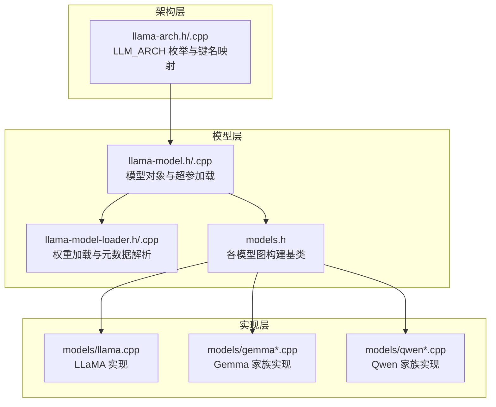
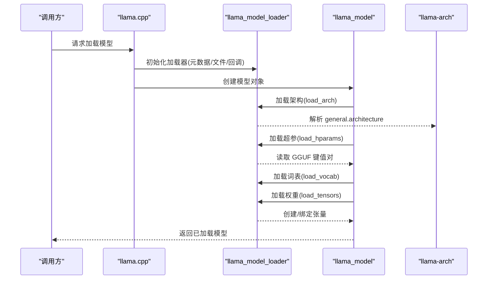
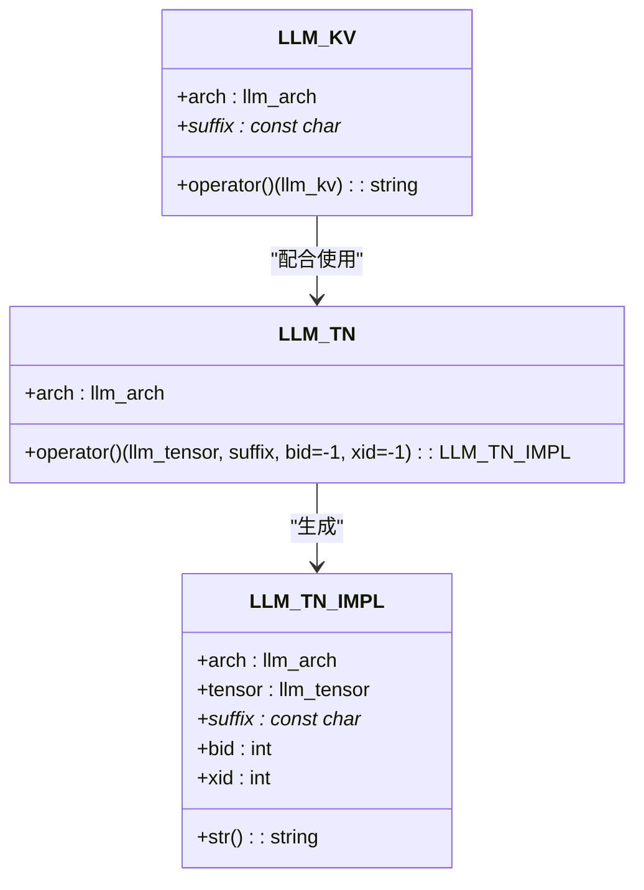
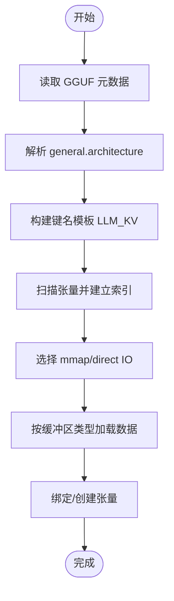
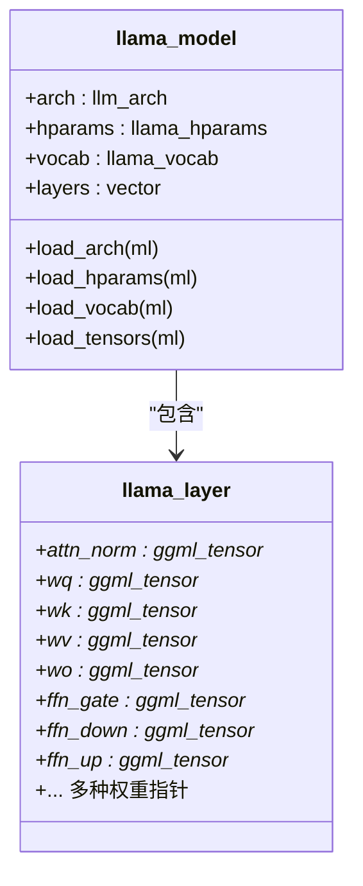
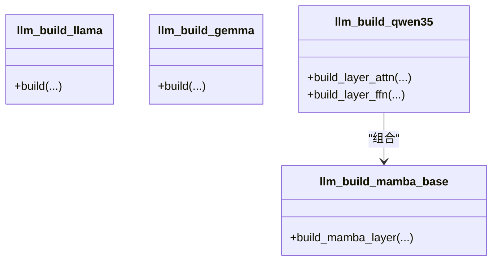
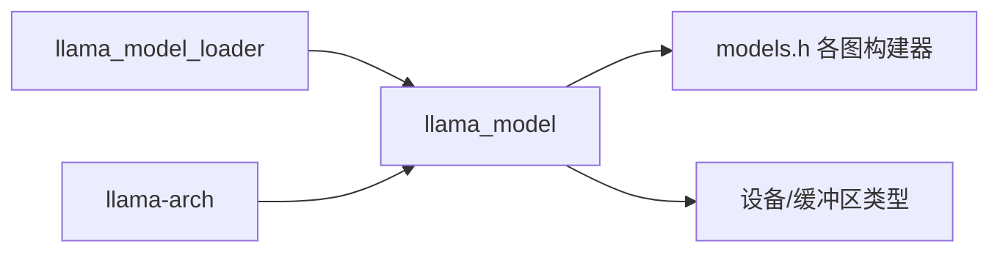

# 模型架构扩展

<cite>
**本文档引用的文件**
- [llama-model-loader.h](file://src/llama-model-loader.h)
- [llama-model-loader.cpp](file://src/llama-model-loader.cpp)
- [llama-model.h](file://src/llama-model.h)
- [llama-model.cpp](file://src/llama-model.cpp)
- [llama-arch.h](file://src/llama-arch.h)
- [llama-arch.cpp](file://src/llama-arch.cpp)
- [llama.cpp](file://src/llama.cpp)
- [models.h](file://src/models/models.h)
- [llama.cpp](file://src/models/llama.cpp)
- [gemma.cpp](file://src/models/gemma.cpp)
- [gemma3.cpp](file://src/models/gemma3.cpp)
- [qwen.cpp](file://src/models/qwen.cpp)
- [qwen2.cpp](file://src/models/qwen2.cpp)
- [qwen3.cpp](file://src/models/qwen3.cpp)
- [qwen35.cpp](file://src/models/qwen35.cpp)
- [qwen3next.cpp](file://src/models/qwen3next.cpp)
- [qwen2vl.cpp](file://src/models/qwen2vl.cpp)
</cite>

## 目录
1. [简介](#简介)
2. [项目结构](#项目结构)
3. [核心组件](#核心组件)
4. [架构总览](#架构总览)
5. [详细组件分析](#详细组件分析)
6. [依赖关系分析](#依赖关系分析)
7. [性能考虑](#性能考虑)
8. [故障排除指南](#故障排除指南)
9. [结论](#结论)
10. [附录](#附录)

## 简介
本指南面向希望在 llama.cpp 中新增或扩展模型架构的开发者，系统讲解模型注册机制、权重加载流程、KV 缓存管理以及多模态扩展策略。文档以 LLaMA、Gemma、Qwen 等现有实现为参考案例，总结可复用的模式与最佳实践，并提供验证、性能测试与兼容性检查方法。

## 项目结构
llama.cpp 将“模型架构”与“具体实现”解耦：架构枚举与键值映射定义在架构层，具体模型的图构建在 models 层，而模型加载与权重管理由模型加载器统一处理。

**图表来源**
- [llama-arch.h:13-141](file://src/llama-arch.h#L13-L141)
- [llama-model.h:512-634](file://src/llama-model.h#L512-L634)
- [llama-model-loader.h:31-207](file://src/llama-model-loader.h#L31-L207)
- [models.h:113-721](file://src/models/models.h#L113-L721)

**章节来源**
- [llama-arch.h:13-141](file://src/llama-arch.h#L13-L141)
- [llama-model.h:512-634](file://src/llama-model.h#L512-L634)
- [llama-model-loader.h:31-207](file://src/llama-model-loader.h#L31-L207)
- [models.h:113-721](file://src/models/models.h#L113-L721)

## 核心组件
- 模型加载器（llama_model_loader）：负责从 GGUF 元数据中解析架构、键值对、张量索引，按需进行内存映射与数据加载。
- 模型对象（llama_model）：封装超参、词表、层结构与张量集合，协调加载器完成权重装载与设备分配。
- 架构与键值（llama-arch）：统一管理模型架构枚举、键名模板与张量命名模板，确保不同模型共享一致的元数据访问接口。
- 图构建器（models.h）：为各模型提供图构建基类，定义注意力、FFN、SSM 等模块的构建流程。

**章节来源**
- [llama-model-loader.h:31-207](file://src/llama-model-loader.h#L31-L207)
- [llama-model.h:512-634](file://src/llama-model.h#L512-L634)
- [llama-arch.h:565-639](file://src/llama-arch.h#L565-L639)
- [models.h:13-721](file://src/models/models.h#L13-L721)

## 架构总览
模型加载的关键路径如下：

**图表来源**
- [llama.cpp:115-169](file://src/llama.cpp#L115-L169)
- [llama-model.cpp:691-704](file://src/llama-model.cpp#L691-L704)
- [llama-model-loader.cpp:510-706](file://src/llama-model-loader.cpp#L510-L706)

**章节来源**
- [llama.cpp:115-169](file://src/llama.cpp#L115-L169)
- [llama-model.cpp:691-704](file://src/llama-model.cpp#L691-L704)
- [llama-model-loader.cpp:510-706](file://src/llama-model-loader.cpp#L510-L706)

## 详细组件分析

### 组件A：模型注册机制与架构枚举
- 架构枚举（LLM_ARCH_*）：集中定义所有支持的模型架构，新增模型需在此处登记。
- 键名模板（LLM_KV_*）：通过 LLM_KV 类将架构与键名模板组合，形成统一的元数据访问接口。
- 张量命名模板（LLM_TN_IMPL）：通过 LLM_TN 将架构与张量类型组合，生成每层张量的标准命名，便于跨模型一致性。

**图表来源**
- [llama-arch.h:565-639](file://src/llama-arch.h#L565-L639)

**章节来源**
- [llama-arch.h:13-141](file://src/llama-arch.h#L13-L141)
- [llama-arch.h:565-639](file://src/llama-arch.h#L565-L639)
- [llama-arch.cpp:9-137](file://src/llama-arch.cpp#L9-L137)

### 组件B：模型加载器（权重加载与元数据解析）
- 元数据解析：从 GGUF 中读取 general.architecture、版本、分片信息等；支持 KV 覆盖与类型推断。
- 张量索引：建立张量名称到文件偏移的映射，支持多文件分片合并。
- 数据加载：根据缓冲区类型列表与设备分配策略，创建/绑定张量，支持 mmap/direct IO 与进度回调。

**图表来源**
- [llama-model-loader.cpp:510-706](file://src/llama-model-loader.cpp#L510-L706)
- [llama-model-loader.h:31-207](file://src/llama-model-loader.h#L31-L207)

**章节来源**
- [llama-model-loader.h:31-207](file://src/llama-model-loader.h#L31-L207)
- [llama-model-loader.cpp:510-706](file://src/llama-model-loader.cpp#L510-L706)

### 组件C：模型对象（超参、词表、层结构）
- 超参加载：从 GGUF 键值对读取上下文长度、嵌入维度、层数、注意力头数等。
- 词表加载：根据 tokenizer 键值初始化词表与聊天模板。
- 层结构：维护每层的注意力与 FFN 权重指针，支持 MoE、SSM、RWKV 等变体。

**图表来源**
- [llama-model.h:512-634](file://src/llama-model.h#L512-L634)
- [llama-model.h:213-497](file://src/llama-model.h#L213-L497)

**章节来源**
- [llama-model.h:512-634](file://src/llama-model.h#L512-L634)
- [llama-model.cpp:691-704](file://src/llama-model.cpp#L691-L704)

### 组件D：图构建器（前向传播实现）
- 基类体系：models.h 提供大量图构建基类，覆盖注意力、FFN、SSM、RWKV、DeltaNet 等模块。
- 模型特化：各模型在基类基础上实现具体的前向计算图，如 Qwen 的线性注意力与 DeltaNet、Gemma 的 AltUp/Laurel 等。

**图表来源**
- [models.h:405-421](file://src/models/models.h#L405-L421)
- [models.h:287-289](file://src/models/models.h#L287-L289)
- [models.h:585-616](file://src/models/models.h#L585-L616)

**章节来源**
- [models.h:113-721](file://src/models/models.h#L113-L721)

### 参考案例：LLaMA、Gemma、Qwen 的实现要点
- LLaMA 实现要点
  - 使用 LLM_TENSOR_TOKEN_EMBD/POS_EMBD/OUTPUT 等标准张量名模板。
  - 注意力与 FFN 的常规实现，支持并行残差与 RMSNorm。
  - 参考：[llama.cpp](file://src/models/llama.cpp)

- Gemma 家族实现要点
  - 支持 Gemma3/3N/4 的特殊层输出缩放、AltUp/Laurel 等特性。
  - 使用 LLM_TENSOR_ALTUP_*、LLM_TENSOR_LAUREL_* 等张量。
  - 参考：[gemma.cpp](file://src/models/gemma.cpp)、[gemma3.cpp](file://src/models/gemma3.cpp)

- Qwen 家族实现要点
  - Qwen3/Qwen3.5/Qwen3Next 使用 DeltaNet 或线性注意力，支持 QK 分离与广播。
  - Qwen2/VL/3VL 支持视觉编码器与多模态融合。
  - 参考：[qwen.cpp](file://src/models/qwen.cpp)、[qwen2.cpp](file://src/models/qwen2.cpp)、[qwen3.cpp](file://src/models/qwen3.cpp)、[qwen35.cpp](file://src/models/qwen35.cpp)、[qwen3next.cpp](file://src/models/qwen3next.cpp)、[qwen2vl.cpp](file://src/models/qwen2vl.cpp)

**章节来源**
- [llama.cpp](file://src/models/llama.cpp)
- [gemma.cpp](file://src/models/gemma.cpp)
- [gemma3.cpp](file://src/models/gemma3.cpp)
- [qwen.cpp](file://src/models/qwen.cpp)
- [qwen2.cpp](file://src/models/qwen2.cpp)
- [qwen3.cpp](file://src/models/qwen3.cpp)
- [qwen35.cpp](file://src/models/qwen35.cpp)
- [qwen3next.cpp](file://src/models/qwen3next.cpp)
- [qwen2vl.cpp](file://src/models/qwen2vl.cpp)

## 依赖关系分析
- 模块耦合
  - llama_model 依赖 llama_model_loader 进行权重加载，依赖 llama-arch 进行键名/张量名解析。
  - 各模型图构建器依赖 llama_model 的层结构与 hparams。
- 设备与缓冲区
  - llama_model.cpp 中通过正则表达式匹配张量名，决定分割轴与粒度，从而影响设备分配与性能。

**图表来源**
- [llama-model.cpp:37-381](file://src/llama-model.cpp#L37-L381)
- [llama-model.h:512-634](file://src/llama-model.h#L512-L634)
- [llama-arch.h:565-639](file://src/llama-arch.h#L565-L639)

**章节来源**
- [llama-model.cpp:37-381](file://src/llama-model.cpp#L37-L381)
- [llama-model.h:512-634](file://src/llama-model.h#L512-L634)
- [llama-arch.h:565-639](file://src/llama-arch.h#L565-L639)

## 性能考虑
- 缓冲区类型与设备分配
  - 通过 LLM_TENSOR_INFOS 映射张量操作与层位置，有助于选择合适的缓冲区类型与设备后端。
- 分割策略
  - llama_model.cpp 中基于张量名的正则匹配，确定分割轴、段长与粒度，影响跨设备负载均衡与带宽利用。
- I/O 与内存映射
  - 支持 mmap 与 direct IO，结合进度回调可控制加载阶段的资源占用。

**章节来源**
- [llama-arch.cpp:552-770](file://src/llama-arch.cpp#L552-L770)
- [llama-model.cpp:37-381](file://src/llama-model.cpp#L37-L381)
- [llama-model-loader.cpp:510-706](file://src/llama-model-loader.cpp#L510-L706)

## 故障排除指南
- 常见错误与定位
  - 未知架构：当 general.architecture 无法识别时会抛出异常，检查 GGUF 文件是否完整或模型是否受支持。
  - 张量缺失：若 GGUF 中缺少必需张量，加载器会报错，需确认权重文件与模型配置一致。
  - 分片不匹配：多文件分片数量或索引不正确会导致加载失败，需核对 split.* 键值。
- 调试建议
  - 开启加载器打印与进度回调，观察加载阶段与耗时。
  - 使用 KV 覆盖功能临时调整关键超参，验证加载路径。

**章节来源**
- [llama.cpp:115-169](file://src/llama.cpp#L115-L169)
- [llama-model-loader.cpp:510-706](file://src/llama-model-loader.cpp#L510-L706)

## 结论
通过统一的架构枚举、键名模板与张量命名模板，llama.cpp 在保持高度可扩展的同时，实现了对多架构模型的一致化接入。新增模型的核心在于：在架构层登记、在加载器中正确解析元数据与权重、在图构建器中实现前向逻辑，并遵循 KV 与张量命名的最佳实践。配合完善的验证与性能测试流程，可快速、稳定地完成模型扩展。

## 附录

### 新模型架构添加流程（步骤清单）
- 在架构层登记
  - 在 LLM_ARCH 枚举中添加新模型标识。
  - 在 LLM_KV_NAMES/LLM_TENSOR_NAMES 中补充键名与张量命名模板。
- 在模型层对接
  - 在 llama_model 中完善超参与词表加载逻辑。
  - 在 models.h 中新增图构建器基类或特化实现。
- 在加载器中适配
  - 确保 GGUF 键名与张量名模板与实现一致。
  - 如有特殊权重布局，更新张量索引与创建逻辑。
- 验证与测试
  - 单元测试：验证 KV 读取、张量创建与设备分配。
  - 功能测试：端到端推理与输出一致性校验。
  - 性能测试：对比不同后端与分片策略下的吞吐与延迟。
- 兼容性检查
  - 对比不同 GGUF 版本与分片格式的兼容性。
  - 多后端（CPU/GPU/IGPU/RPC）验证。

**章节来源**
- [llama-arch.h:13-141](file://src/llama-arch.h#L13-L141)
- [llama-arch.cpp:139-341](file://src/llama-arch.cpp#L139-L341)
- [llama-model.h:512-634](file://src/llama-model.h#L512-L634)
- [models.h:113-721](file://src/models/models.h#L113-L721)
- [llama-model-loader.h:31-207](file://src/llama-model-loader.h#L31-L207)