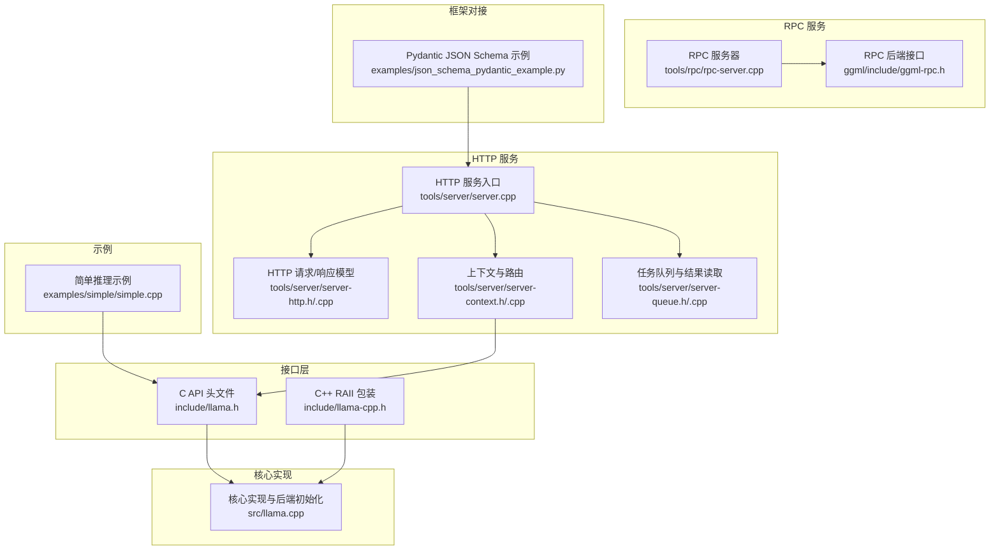
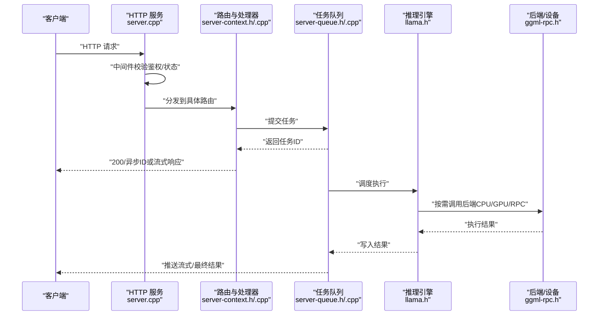
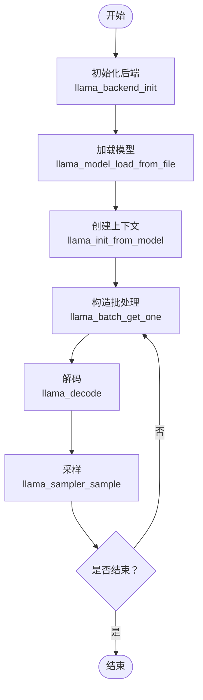
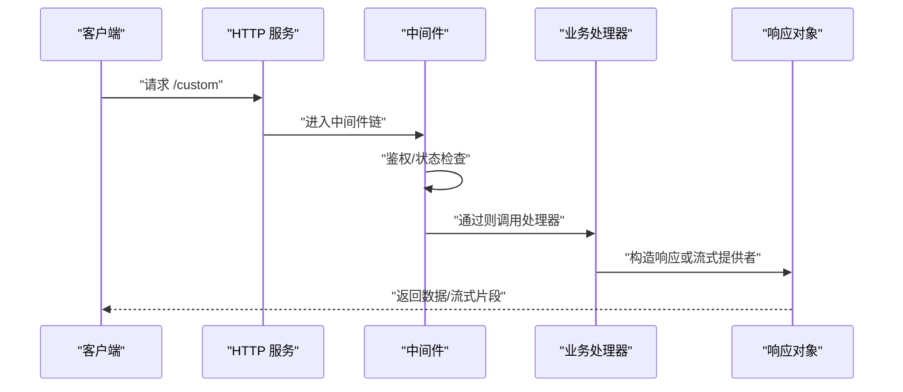
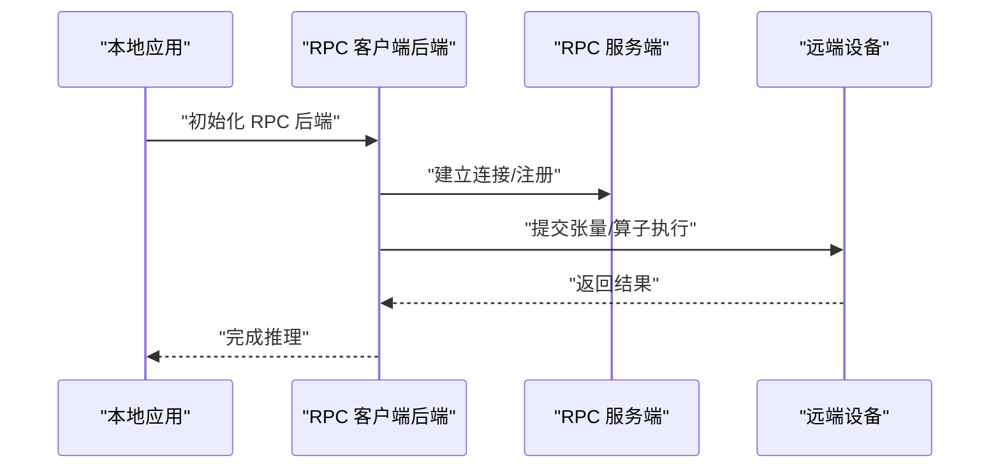
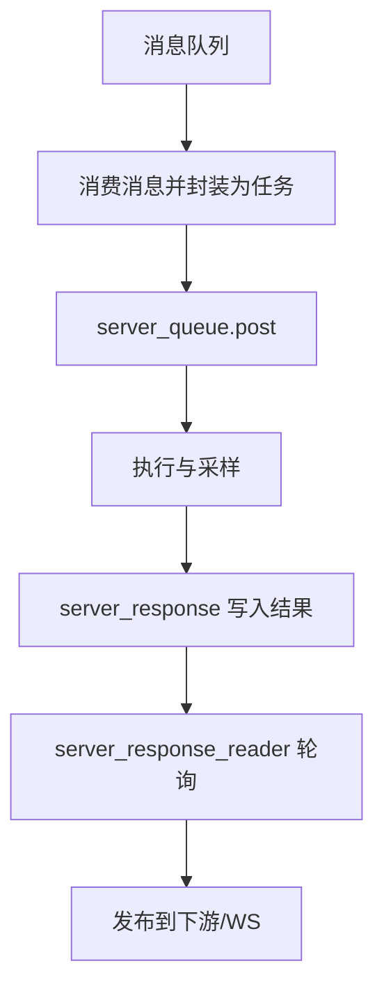
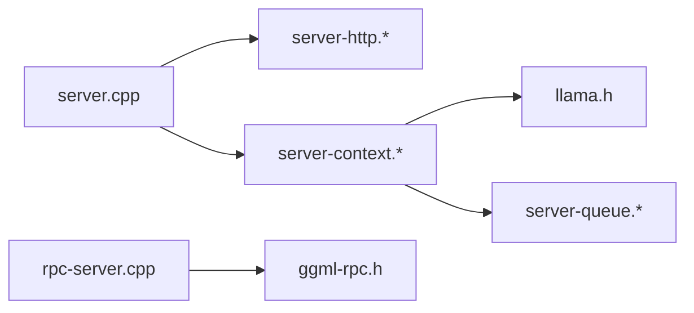

# 第三方集成开发

<cite>
**本文引用的文件**
- [llama.h](file://include/llama.h)
- [llama-cpp.h](file://include/llama-cpp.h)
- [llama.cpp](file://src/llama.cpp)
- [simple.cpp](file://examples/simple/simple.cpp)
- [server.cpp](file://tools/server/server.cpp)
- [server-http.h](file://tools/server/server-http.h)
- [server-http.cpp](file://tools/server/server-http.cpp)
- [rpc-server.cpp](file://tools/rpc/rpc-server.cpp)
- [ggml-rpc.h](file://ggml/include/ggml-rpc.h)
- [server-context.h](file://tools/server/server-context.h)
- [server-context.cpp](file://tools/server/server-context.cpp)
- [server-queue.h](file://tools/server/server-queue.h)
- [server-queue.cpp](file://tools/server/server-queue.cpp)
- [json_schema_pydantic_example.py](file://examples/json_schema_pydantic_example.py)
</cite>

## 目录
1. [简介](#简介)
2. [项目结构](#项目结构)
3. [核心组件](#核心组件)
4. [架构总览](#架构总览)
5. [详细组件分析](#详细组件分析)
6. [依赖关系分析](#依赖关系分析)
7. [性能考量](#性能考量)
8. [故障排查指南](#故障排查指南)
9. [结论](#结论)
10. [附录](#附录)

## 简介
本指南面向需要将 llama.cpp 与第三方系统集成的开发者，覆盖以下主题：
- llama.cpp 的 C API 扩展机制与外部系统对接方法
- HTTP API 的扩展开发：自定义路由、中间件与认证机制
- WebSocket 集成、RPC 通信与消息队列集成
- 与主流框架（FastAPI、Django、Spring Boot）的对接模式
- 微服务架构下的集成策略与分布式部署方案
- 安全、性能与监控最佳实践
- 版本兼容性与向后兼容性保障

## 项目结构
llama.cpp 提供了从底层 C API 到上层 HTTP 服务、RPC 服务以及示例应用的完整栈。关键路径如下：
- C/C++ 接口：include/llama.h、include/llama-cpp.h
- 核心实现：src/llama.cpp
- 示例与简单用法：examples/simple/simple.cpp
- HTTP 服务：tools/server/server.cpp、tools/server/server-http.h/.cpp、tools/server/server-context.h/.cpp、tools/server/server-queue.h/.cpp
- RPC 服务：tools/rpc/rpc-server.cpp、ggml/include/ggml-rpc.h
- 框架对接示例：examples/json_schema_pydantic_example.py

**图表来源**
- [llama.h](file://include/llama.h)
- [llama-cpp.h](file://include/llama-cpp.h)
- [llama.cpp](file://src/llama.cpp)
- [simple.cpp](file://examples/simple/simple.cpp)
- [server.cpp](file://tools/server/server.cpp)
- [server-http.h](file://tools/server/server-http.h)
- [server-http.cpp](file://tools/server/server-http.cpp)
- [server-context.h](file://tools/server/server-context.h)
- [server-context.cpp](file://tools/server/server-context.cpp)
- [server-queue.h](file://tools/server/server-queue.h)
- [server-queue.cpp](file://tools/server/server-queue.cpp)
- [rpc-server.cpp](file://tools/rpc/rpc-server.cpp)
- [ggml-rpc.h](file://ggml/include/ggml-rpc.h)
- [json_schema_pydantic_example.py](file://examples/json_schema_pydantic_example.py)

**章节来源**
- [llama.h:1-800](file://include/llama.h#L1-L800)
- [llama.cpp:1-200](file://src/llama.cpp#L1-L200)
- [simple.cpp:1-224](file://examples/simple/simple.cpp#L1-L224)
- [server.cpp:1-200](file://tools/server/server.cpp#L1-L200)
- [server-http.h:1-90](file://tools/server/server-http.h#L1-L90)
- [server-http.cpp:1-200](file://tools/server/server-http.cpp#L1-L200)
- [server-context.h:1-147](file://tools/server/server-context.h#L1-L147)
- [server-context.cpp:1-200](file://tools/server/server-context.cpp#L1-L200)
- [server-queue.h:1-190](file://tools/server/server-queue.h#L1-L190)
- [rpc-server.cpp:1-200](file://tools/rpc/rpc-server.cpp#L1-L200)
- [ggml-rpc.h:1-35](file://ggml/include/ggml-rpc.h#L1-L35)
- [json_schema_pydantic_example.py:1-83](file://examples/json_schema_pydantic_example.py#L1-L83)

## 核心组件
- C API 与 C++ RAII 包装
  - C API 定义了模型加载、上下文创建、批处理、采样器、适配器等接口，支持多后端（CPU/GPU/RPC）与量化类型选择。
  - C++ 包装通过智能指针自动释放资源，简化生命周期管理。
- 核心实现与后端初始化
  - 初始化后端、NUMA、时间测量；提供能力查询（如 mmap/mlock/gpu offload/rpc 支持）。
- HTTP 服务
  - 基于 cpp-httplib 实现，提供 OpenAI 兼容路由、指标、健康检查、鉴权中间件、流式响应等。
- RPC 服务
  - 提供远程后端初始化、设备内存查询、服务注册与客户端连接。
- 任务队列与响应读取
  - 支持任务入队、延迟执行、槽位状态跟踪与轮询式结果读取。

**章节来源**
- [llama.h:430-520](file://include/llama.h#L430-L520)
- [llama-cpp.h:11-31](file://include/llama-cpp.h#L11-L31)
- [llama.cpp:83-108](file://src/llama.cpp#L83-L108)
- [server-http.h:19-32](file://tools/server/server-http.h#L19-L32)
- [server-http.cpp:136-196](file://tools/server/server-http.cpp#L136-L196)
- [ggml-rpc.h:19-32](file://ggml/include/ggml-rpc.h#L19-L32)
- [server-queue.h:13-115](file://tools/server/server-queue.h#L13-L115)

## 架构总览
下图展示了从客户端到推理引擎的整体调用链路，包括 HTTP 路由、中间件、任务队列与后端执行。

**图表来源**
- [server.cpp:172-200](file://tools/server/server.cpp#L172-L200)
- [server-http.cpp:136-196](file://tools/server/server-http.cpp#L136-L196)
- [server-context.h:90-147](file://tools/server/server-context.h#L90-L147)
- [server-queue.h:13-115](file://tools/server/server-queue.h#L13-L115)
- [llama.h:474-504](file://include/llama.h#L474-L504)
- [ggml-rpc.h:19-32](file://ggml/include/ggml-rpc.h#L19-L32)

## 详细组件分析

### C API 扩展与外部系统对接
- 模型与上下文
  - 使用默认参数初始化后端，加载模型文件，创建上下文，设置批大小、线程数、采样器链等。
  - 参考：[llama_backend_init:442-446](file://include/llama.h#L442-L446)、[llama_model_load_from_file:477-479](file://include/llama.h#L477-L479)、[llama_init_from_model:502-504](file://include/llama.h#L502-L504)、[llama_sampler_chain_default_params:436-437](file://include/llama.h#L436-L437)。
- 批处理与解码
  - 使用 [llama_batch_get_one](file://include/llama.h) 构造批，调用 [llama_decode](file://include/llama.h) 进行解码，结合采样器得到下一个 token。
  - 参考：[simple.cpp:149-204](file://examples/simple/simple.cpp#L149-L204)。
- 适配器与控制向量
  - 支持 LoRA 适配器与控制向量，便于在不重训练的情况下切换风格或指令。
  - 参考：[llama_set_adapters_lora:669-673](file://include/llama.h#L669-L673)、[llama_set_adapter_cvec:681-687](file://include/llama.h#L681-L687)。
- 能力检测
  - 查询 mmap/mlock/gpu offload/rpc 支持，用于运行时能力判断与降级策略。
  - 参考：[llama_supports_mmap:520-522](file://include/llama.h#L520-L522)、[llama_supports_gpu_offload:523-527](file://include/llama.h#L523-L527)、[llama_supports_rpc:523-527](file://include/llama.h#L523-L527)。

**图表来源**
- [llama.h:442-504](file://include/llama.h#L442-L504)
- [simple.cpp:149-204](file://examples/simple/simple.cpp#L149-L204)

**章节来源**
- [llama.h:442-520](file://include/llama.h#L442-L520)
- [simple.cpp:84-204](file://examples/simple/simple.cpp#L84-L204)

### HTTP API 扩展：自定义路由、中间件与认证
- 自定义路由
  - 在 HTTP 服务中注册 GET/POST 路由，使用 [server_http_context::get/post:84-85](file://tools/server/server-http.h#L84-L85) 注册处理器。
  - 参考：[server.cpp:172-200](file://tools/server/server.cpp#L172-L200)。
- 中间件
  - 异常包装器统一捕获异常并返回错误响应；鉴权中间件校验 Authorization/X-Api-Key 并支持公开端点白名单。
  - 参考：[server.cpp:38-72](file://tools/server/server.cpp#L38-L72)、[server-http.cpp:136-196](file://tools/server/server-http.cpp#L136-196)。
- 认证机制
  - 支持单/多 API Key，支持 Bearer 与 Anthropic X-Api-Key 头；未提供或无效时返回 401。
  - 参考：[server-http.cpp:140-196](file://tools/server/server-http.cpp#L140-196)。
- 流式响应
  - 通过 server_http_res 的 next 回调实现增量输出，适用于长文本生成与工具调用流式返回。
  - 参考：[server-http.h:19-32](file://tools/server/server-http.h#L19-L32)。

**图表来源**
- [server.cpp:38-72](file://tools/server/server.cpp#L38-L72)
- [server-http.cpp:136-196](file://tools/server/server-http.cpp#L136-L196)
- [server-http.h:19-32](file://tools/server/server-http.h#L19-L32)

**章节来源**
- [server.cpp:172-200](file://tools/server/server.cpp#L172-L200)
- [server-http.cpp:136-196](file://tools/server/server-http.cpp#L136-L196)
- [server-http.h:19-32](file://tools/server/server-http.h#L19-L32)

### WebSocket 集成
- 当前仓库未直接提供 WebSocket 服务端实现。可采用以下策略：
  - 在现有 HTTP 服务基础上，为特定端点（如 /chat/stream 或 /ws）启用 WebSocket 协议升级，并复用 server-context 的任务队列与采样器链。
  - 将 server-response-reader 的轮询/事件通知机制映射到 WebSocket 文本帧，实现流式生成。
  - 注意：WebSocket 需要额外的连接管理、心跳与断线重连逻辑，建议参考现有 server-queue 的并发模型与回调机制。

[本节为概念性内容，不直接分析具体文件，故无“章节来源”]

### RPC 通信与远程后端
- RPC 服务端
  - 提供本地 RPC 服务器启动、设备列表、缓存目录管理与线程数配置，支持多设备与本地缓存。
  - 参考：[rpc-server.cpp:172-200](file://tools/rpc/rpc-server.cpp#L172-L200)、[rpc-server.cpp:126-170](file://tools/rpc/rpc-server.cpp#L126-L170)。
- RPC 客户端后端
  - 通过 [ggml_backend_rpc_init:20-21](file://ggml/include/ggml-rpc.h#L20-L21) 创建远程后端，使用 [ggml_backend_rpc_buffer_type:23-24](file://ggml/include/ggml-rpc.h#L23-L24) 获取缓冲区类型，使用 [ggml_backend_rpc_start_server:27-28](file://ggml/include/ggml-rpc.h#L27-L28) 启动服务。
  - 参考：[ggml-rpc.h:19-32](file://ggml/include/ggml-rpc.h#L19-32)。
- 集成要点
  - 在 C API 层通过后端注册与设备选择，透明地将计算卸载到远端设备。
  - 结合 server-context 的任务队列，实现跨进程/跨机器的任务调度与结果回传。

**图表来源**
- [rpc-server.cpp:172-200](file://tools/rpc/rpc-server.cpp#L172-L200)
- [ggml-rpc.h:19-32](file://ggml/include/ggml-rpc.h#L19-L32)

**章节来源**
- [rpc-server.cpp:172-200](file://tools/rpc/rpc-server.cpp#L172-L200)
- [rpc-server.cpp:126-170](file://tools/rpc/rpc-server.cpp#L126-L170)
- [ggml-rpc.h:19-32](file://ggml/include/ggml-rpc.h#L19-L32)

### 消息队列集成
- 任务队列与结果读取
  - server_queue 支持任务入队、延迟执行、槽位优先与回调；server_response 提供结果聚合与等待机制；server_response_reader 提供轮询式读取。
  - 参考：[server-queue.h:13-115](file://tools/server/server-queue.h#L13-L115)、[server-queue.cpp](file://tools/server/server-queue.cpp)。
- 对接策略
  - 将外部消息队列（如 Kafka/RabbitMQ/Redis Stream）作为任务源，消费消息后封装为 server_task 并通过 queue_tasks.post 投递。
  - 使用 server_response_reader 轮询结果，将最终结果或流式片段发布到下游队列或 WebSocket。
- 并发与可靠性
  - 利用 server_queue 的条件变量与互斥锁，确保多线程安全；结合槽位状态回调，实现高吞吐与低延迟。

**图表来源**
- [server-queue.h:13-115](file://tools/server/server-queue.h#L13-L115)
- [server-queue.cpp](file://tools/server/server-queue.cpp)

**章节来源**
- [server-queue.h:13-115](file://tools/server/server-queue.h#L13-L115)

### 与主流框架的集成模式
- FastAPI（Python）
  - 使用 OpenAI 兼容端点，结合 Pydantic JSON Schema 约束输出格式，实现结构化 JSON 生成。
  - 参考：[json_schema_pydantic_example.py:1-83](file://examples/json_schema_pydantic_example.py#L1-L83)。
- Django（Python）
  - 将 llama.cpp HTTP 服务作为后端，Django 视图通过 HTTP 客户端调用 /v1/chat/completions 等端点，解析响应并渲染模板。
- Spring Boot（Java/Kotlin）
  - 通过 HTTP 客户端（如 WebClient）调用 /v1/chat/completions，使用 SSE 或 WebSocket 实现流式输出；或以同步方式调用后端并缓存结果。

[本节为通用集成模式说明，不直接分析具体文件，故无“章节来源”]

### 微服务架构与分布式部署
- 路由器模式
  - 通过 server.cpp 的路由器模式，将请求代理到不同模型实例或后端，实现多模型/多租户隔离。
  - 参考：[server.cpp:130-170](file://tools/server/server.cpp#L130-L170)。
- 任务分发
  - server-queue 与 server-response 提供统一的任务与结果抽象，可在多个服务实例之间共享队列或通过消息队列解耦。
- 设备与后端
  - 结合 RPC 与多后端注册，将不同设备/节点纳入统一调度；根据负载与延迟动态选择最优后端。

**章节来源**
- [server.cpp:130-170](file://tools/server/server.cpp#L130-L170)
- [server-queue.h:13-115](file://tools/server/server-queue.h#L13-L115)

## 依赖关系分析
- 组件耦合
  - server.cpp 依赖 server-http.* 与 server-context.*；server-context.* 依赖 llama.h 与 server-queue.*；rpc-server.cpp 依赖 ggml-rpc.h。
- 外部依赖
  - HTTP 服务基于 cpp-httplib；RPC 依赖 ggml 后端注册表与设备驱动。
- 潜在循环依赖
  - 当前模块划分清晰，未见直接循环依赖；注意避免在 server-http.* 中引入 server-context.* 的实现细节。

**图表来源**
- [server.cpp:1-200](file://tools/server/server.cpp#L1-L200)
- [server-http.h:1-90](file://tools/server/server-http.h#L1-L90)
- [server-context.h:1-147](file://tools/server/server-context.h#L1-L147)
- [server-queue.h:1-190](file://tools/server/server-queue.h#L1-L190)
- [rpc-server.cpp:1-200](file://tools/rpc/rpc-server.cpp#L1-L200)
- [ggml-rpc.h:1-35](file://ggml/include/ggml-rpc.h#L1-L35)

**章节来源**
- [server.cpp:1-200](file://tools/server/server.cpp#L1-L200)
- [server-http.h:1-90](file://tools/server/server-http.h#L1-L90)
- [server-context.h:1-147](file://tools/server/server-context.h#L1-L147)
- [server-queue.h:1-190](file://tools/server/server-queue.h#L1-L190)
- [rpc-server.cpp:1-200](file://tools/rpc/rpc-server.cpp#L1-L200)
- [ggml-rpc.h:1-35](file://ggml/include/ggml-rpc.h#L1-L35)

## 性能考量
- 上下文与批处理
  - 合理设置 n_ctx、n_batch、n_ubatch，避免过小导致频繁解码开销，过大导致内存压力。
  - 参考：[llama.h:331-383](file://include/llama.h#L331-L383)。
- 线程与 NUMA
  - 使用 llama_numa_init 与线程池绑定，提升多核利用率。
  - 参考：[llama.cpp:94-104](file://src/llama.cpp#L94-L104)。
- GPU 与 RPC
  - 在支持 GPU 的环境中启用 offload；RPC 场景下减少网络往返与数据拷贝。
  - 参考：[llama.h:523-527](file://include/llama.h#L523-L527)、[ggml-rpc.h:19-32](file://ggml/include/ggml-rpc.h#L19-L32)。
- 采样与缓存
  - 使用合适的采样器链与日志偏置，结合提示缓存与槽位复用降低重复计算。
  - 参考：[server-context.cpp:1-200](file://tools/server/server-context.cpp#L1-L200)。

[本节提供通用性能建议，不直接分析具体文件，故无“章节来源”]

## 故障排查指南
- HTTP 401 未授权
  - 检查 Authorization/X-Api-Key 头是否正确传递，确认 API Key 是否在服务端配置。
  - 参考：[server-http.cpp:140-196](file://tools/server/server-http.cpp#L140-196)。
- 路由未找到
  - 确认路由注册顺序与路径前缀；检查 ex_wrapper 是否包裹处理器。
  - 参考：[server.cpp:172-200](file://tools/server/server.cpp#L172-L200)。
- 任务积压与超时
  - 检查 server-queue 的延迟队列与槽位状态；调整轮询间隔与超时参数。
  - 参考：[server-queue.h:13-115](file://tools/server/server-queue.h#L13-L115)。
- RPC 连接失败
  - 校验 RPC 服务端地址、端口与缓存目录权限；确认 ggml 后端已加载。
  - 参考：[rpc-server.cpp:126-170](file://tools/rpc/rpc-server.cpp#L126-L170)、[ggml-rpc.h:19-32](file://ggml/include/ggml-rpc.h#L19-L32)。

**章节来源**
- [server-http.cpp:140-196](file://tools/server/server-http.cpp#L140-L196)
- [server.cpp:172-200](file://tools/server/server.cpp#L172-L200)
- [server-queue.h:13-115](file://tools/server/server-queue.h#L13-L115)
- [rpc-server.cpp:126-170](file://tools/rpc/rpc-server.cpp#L126-L170)
- [ggml-rpc.h:19-32](file://ggml/include/ggml-rpc.h#L19-L32)

## 结论
通过 C API、HTTP 服务、RPC 与消息队列的组合，llama.cpp 能够灵活对接多种第三方系统与框架。建议在生产环境重视鉴权、可观测性与弹性伸缩，结合任务队列与 RPC 后端实现高可用与高性能的推理平台。

[本节为总结性内容，不直接分析具体文件，故无“章节来源”]

## 附录
- 快速开始（C API）
  - 初始化后端 → 加载模型 → 创建上下文 → 构造批处理 → 解码 → 采样 → 输出。
  - 参考：[llama.cpp:83-108](file://src/llama.cpp#L83-L108)、[simple.cpp:84-204](file://examples/simple/simple.cpp#L84-L204)。
- HTTP 扩展清单
  - 注册新路由 → 编写处理器 → 中间件链 → 鉴权与流式响应。
  - 参考：[server.cpp:172-200](file://tools/server/server.cpp#L172-L200)、[server-http.cpp:136-196](file://tools/server/server-http.cpp#L136-196)。
- RPC 部署清单
  - 启动 RPC 服务端 → 客户端后端初始化 → 设备选择 → 任务提交。
  - 参考：[rpc-server.cpp:172-200](file://tools/rpc/rpc-server.cpp#L172-200)、[ggml-rpc.h:19-32](file://ggml/include/ggml-rpc.h#L19-L32)。

**章节来源**
- [llama.cpp:83-108](file://src/llama.cpp#L83-L108)
- [simple.cpp:84-204](file://examples/simple/simple.cpp#L84-L204)
- [server.cpp:172-200](file://tools/server/server.cpp#L172-L200)
- [server-http.cpp:136-196](file://tools/server/server-http.cpp#L136-L196)
- [rpc-server.cpp:172-200](file://tools/rpc/rpc-server.cpp#L172-L200)
- [ggml-rpc.h:19-32](file://ggml/include/ggml-rpc.h#L19-L32)