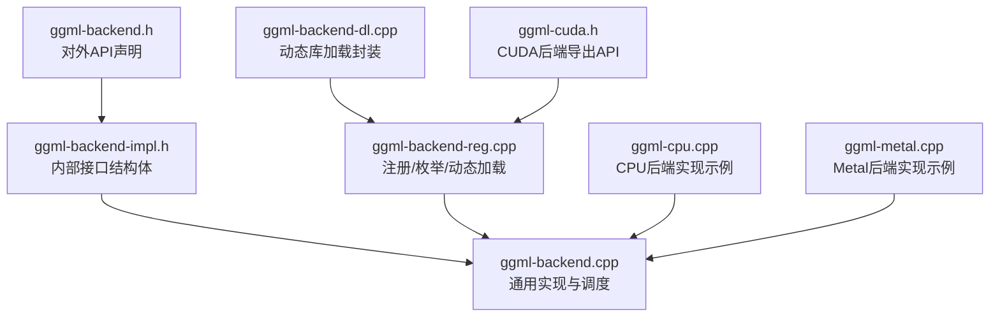
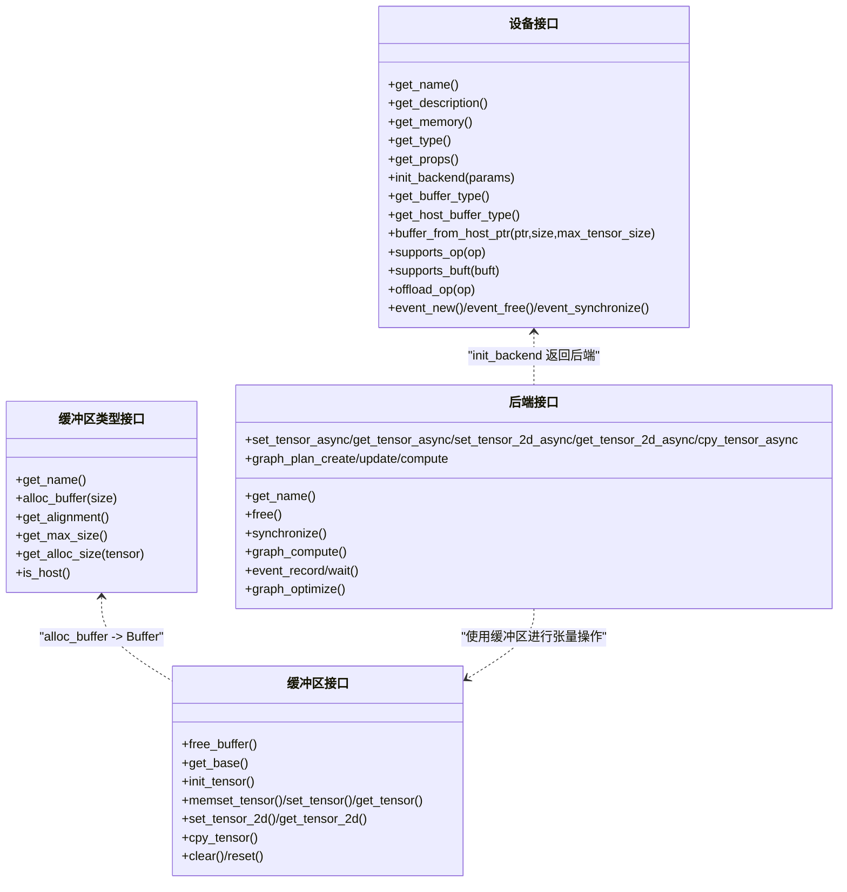
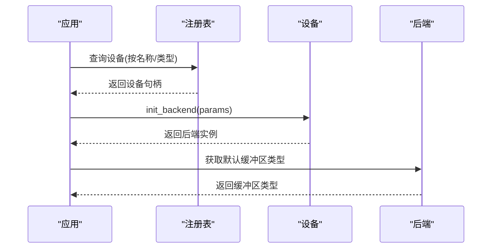
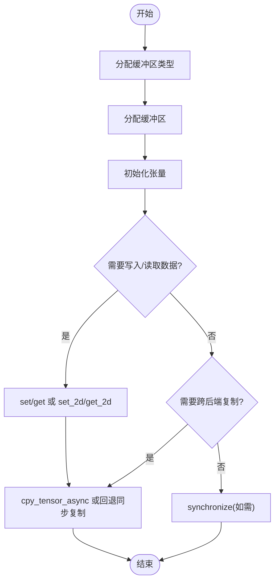
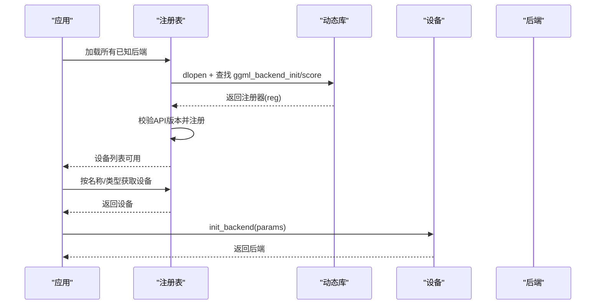
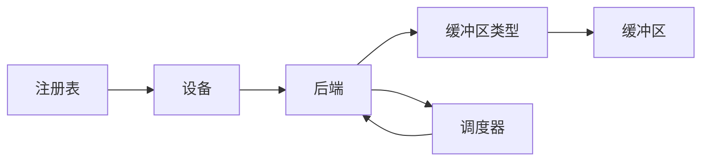

# 自定义后端开发

<cite>
**本文引用的文件**
- [ggml-backend.h](file://ggml/include/ggml-backend.h)
- [ggml-backend-impl.h](file://ggml/src/ggml-backend-impl.h)
- [ggml-backend.cpp](file://ggml/src/ggml-backend.cpp)
- [ggml-backend-reg.cpp](file://ggml/src/ggml-backend-reg.cpp)
- [ggml-backend-dl.cpp](file://ggml/src/ggml-backend-dl.cpp)
- [ggml-cpu.cpp](file://ggml/src/ggml-cpu/ggml-cpu.cpp)
- [ggml-metal.cpp](file://ggml/src/ggml-metal/ggml-metal.cpp)
- [ggml-cuda.h](file://ggml/include/ggml-cuda.h)
</cite>

## 目录
1. [简介](#简介)
2. [项目结构](#项目结构)
3. [核心组件](#核心组件)
4. [架构总览](#架构总览)
5. [详细组件分析](#详细组件分析)
6. [依赖关系分析](#依赖关系分析)
7. [性能考量](#性能考量)
8. [故障排查指南](#故障排查指南)
9. [结论](#结论)
10. [附录](#附录)

## 简介
本文件面向希望在 ggml 生态中实现“自定义后端”的开发者，系统性阐述 ggml 后端接口架构与实现要点，覆盖以下主题：
- ggml_backend_interface 的函数指针实现要求与职责边界
- 后端初始化流程、设备查询、缓冲区类型与缓冲区管理
- 张量操作（数据读写、批量拷贝、清零）与异步执行机制
- 基于 CUDA、Metal 等现有后端的实现参考
- 后端注册、动态加载、设备枚举与最佳实践
- 性能优化技巧（内核优化、内存对齐、并行策略）
- 调试与测试方法（单元测试、性能基准）
- 常见问题排查与解决方案

## 项目结构
围绕后端开发的核心代码位于 ggml 子模块，主要由三部分组成：
- 接口与公共 API：ggml-backend.h 定义对外 API；ggml-backend-impl.h 定义内部接口结构体与回调表
- 核心调度与通用逻辑：ggml-backend.cpp 提供缓冲区、后端、事件、调度器等通用实现
- 注册与动态加载：ggml-backend-reg.cpp 实现后端注册、设备枚举、动态加载；ggml-backend-dl.cpp 提供跨平台动态库加载

图示来源
- [ggml-backend.h](file://ggml/include/ggml-backend.h)
- [ggml-backend-impl.h](file://ggml/src/ggml-backend-impl.h)
- [ggml-backend.cpp](file://ggml/src/ggml-backend.cpp)
- [ggml-backend-reg.cpp](file://ggml/src/ggml-backend-reg.cpp)
- [ggml-backend-dl.cpp](file://ggml/src/ggml-backend-dl.cpp)
- [ggml-cpu.cpp](file://ggml/src/ggml-cpu/ggml-cpu.cpp)
- [ggml-metal.cpp](file://ggml/src/ggml-metal/ggml-metal.cpp)
- [ggml-cuda.h](file://ggml/include/ggml-cuda.h)

章节来源
- [ggml-backend.h](file://ggml/include/ggml-backend.h)
- [ggml-backend-impl.h](file://ggml/src/ggml-backend-impl.h)
- [ggml-backend.cpp](file://ggml/src/ggml-backend.cpp)
- [ggml-backend-reg.cpp](file://ggml/src/ggml-backend-reg.cpp)
- [ggml-backend-dl.cpp](file://ggml/src/ggml-backend-dl.cpp)

## 核心组件
- 后端设备（Device）：描述硬件能力、内存信息、支持的操作与缓冲区类型
- 后端（Backend）：面向计算流的抽象，负责图计划、异步执行、同步、事件
- 缓冲区类型（Buffer Type）：描述如何分配与对齐内存，是否为主机内存
- 缓冲区（Buffer）：具体内存块，承载张量数据，支持初始化、清零、设置/获取、批量拷贝
- 事件（Event）：用于跨流/跨设备同步
- 调度器（Scheduler）：多后端协同，自动分配节点到后端、拆分图、管理输入输出与复制

章节来源
- [ggml-backend.h](file://ggml/include/ggml-backend.h)
- [ggml-backend-impl.h](file://ggml/src/ggml-backend-impl.h)
- [ggml-backend.cpp](file://ggml/src/ggml-backend.cpp)

## 架构总览
下图展示后端接口的层次关系与调用方向，帮助理解从应用到设备驱动的职责划分。

图示来源
- [ggml-backend-impl.h](file://ggml/src/ggml-backend-impl.h)
- [ggml-backend.h](file://ggml/include/ggml-backend.h)

## 详细组件分析

### 1) ggml_backend_interface 函数指针实现要求
后端实现需提供一组函数指针，对应如下职责：
- 名称与生命周期：get_name/free
- 异步数据访问：set_tensor_async/get_tensor_async/set_tensor_2d_async/get_tensor_2d_async
- 异步张量拷贝：cpy_tensor_async（可选）
- 同步：synchronize（若支持异步则必须）
- 图计划与计算：graph_plan_create/update/compute（可选）、graph_compute（始终支持）
- 事件：event_record/event_wait（可选）
- 图优化：graph_optimize（可选）

这些函数指针构成后端接口的核心，决定后端是否支持异步、事件同步、图计划复用等高级特性。

章节来源
- [ggml-backend-impl.h](file://ggml/src/ggml-backend-impl.h)
- [ggml-backend.cpp](file://ggml/src/ggml-backend.cpp)

### 2) 后端初始化流程与设备查询
- 设备查询：通过注册表枚举设备，按名称或类型查找设备
- 初始化：设备接口的 init_backend 将返回一个后端实例
- 默认缓冲区类型：后端可通过设备接口提供的默认缓冲区类型进行内存分配
- 设备属性：通过设备接口获取名称、描述、内存、类型与能力（异步、主机缓冲、事件等）

图示来源
- [ggml-backend-reg.cpp](file://ggml/src/ggml-backend-reg.cpp)
- [ggml-backend.cpp](file://ggml/src/ggml-backend.cpp)
- [ggml-backend.h](file://ggml/include/ggml-backend.h)

章节来源
- [ggml-backend-reg.cpp](file://ggml/src/ggml-backend-reg.cpp)
- [ggml-backend.cpp](file://ggml/src/ggml-backend.cpp)
- [ggml-backend.h](file://ggml/include/ggml-backend.h)

### 3) 缓冲区管理与张量操作
- 缓冲区类型：提供对齐、最大尺寸、主机标识、按张量估算分配大小等能力
- 缓冲区：提供基址、清零、初始化张量、设置/获取、批量拷贝、重置等
- 张量操作：支持同步与异步 set/get、2D 批量拷贝、memset
- 复制：支持同后端/跨后端复制，异步复制不可用时回退到同步

图示来源
- [ggml-backend.cpp](file://ggml/src/ggml-backend.cpp)
- [ggml-backend-impl.h](file://ggml/src/ggml-backend-impl.h)

章节来源
- [ggml-backend.cpp](file://ggml/src/ggml-backend.cpp)
- [ggml-backend-impl.h](file://ggml/src/ggml-backend-impl.h)

### 4) 异步执行机制
- 异步数据访问：set/get 2d_async 支持批量连续拷贝
- 同步：synchronize 确保所有挂起操作完成
- 事件：event_record/wait 提供跨流/跨设备同步点
- 调度器：在多后端场景中，调度器会根据权重位置、操作支持性与缓冲区类型自动拆分图，并在必要时插入复制

章节来源
- [ggml-backend.cpp](file://ggml/src/ggml-backend.cpp)
- [ggml-backend.h](file://ggml/include/ggml-backend.h)

### 5) 现有后端实现参考

#### CPU 后端
- 特点：无异步数据访问指针（NULL），使用图计划与工作区内存进行计算
- 关键实现：graph_plan_create/graph_plan_compute、graph_compute、free
- 线程与中断：支持线程数配置、中止回调

章节来源
- [ggml-cpu.cpp](file://ggml/src/ggml-cpu/ggml-cpu.cpp)

#### Metal 后端
- 特点：提供共享/私有两种缓冲区类型，分别封装 Metal 共享/私有内存访问
- 关键实现：缓冲区类型 alloc_buffer、get_base、memset/set/get、clear；支持拷贝（返回 false 表示不支持）
- 设备：支持多设备、缓冲区类型与主机缓冲类型

章节来源
- [ggml-metal.cpp](file://ggml/src/ggml-metal/ggml-metal.cpp)

#### CUDA 后端（接口导出）
- 特点：提供后端初始化、设备计数/描述/内存查询、主机缓冲注册、跨设备 allreduce、分割缓冲区类型等
- 导出 API：后端注册、设备缓冲类型、主机缓冲类型、设备描述与内存查询等

章节来源
- [ggml-cuda.h](file://ggml/include/ggml-cuda.h)

### 6) 后端注册、设备枚举与动态加载
- 静态注册：编译期启用的后端（如 CPU、CUDA、Metal、SYCL、Vulkan 等）通过注册函数加入全局注册表
- 动态加载：从指定路径加载动态库，解析 ggml_backend_init 与可选 ggml_backend_score，校验 API 版本后注册
- 设备枚举：按名称/类型/索引获取设备，支持最佳设备选择（优先 GPU/IGPU/CPU）

图示来源
- [ggml-backend-reg.cpp](file://ggml/src/ggml-backend-reg.cpp)
- [ggml-backend-dl.cpp](file://ggml/src/ggml-backend-dl.cpp)

章节来源
- [ggml-backend-reg.cpp](file://ggml/src/ggml-backend-reg.cpp)
- [ggml-backend-dl.cpp](file://ggml/src/ggml-backend-dl.cpp)

## 依赖关系分析
- 组件耦合
  - 后端依赖设备接口提供的缓冲区类型与能力
  - 缓冲区类型决定缓冲区行为（对齐、最大尺寸、主机标识）
  - 调度器依赖后端/设备能力进行图拆分与复制决策
- 外部依赖
  - 动态库加载：Windows 使用 LoadLibrary，类 Unix 使用 dlopen
  - 各后端库（CUDA/Metal/SYCL/Vulkan/OpenCL 等）以动态库形式提供注册器

图示来源
- [ggml-backend-reg.cpp](file://ggml/src/ggml-backend-reg.cpp)
- [ggml-backend.cpp](file://ggml/src/ggml-backend.cpp)
- [ggml-backend-impl.h](file://ggml/src/ggml-backend-impl.h)

章节来源
- [ggml-backend-reg.cpp](file://ggml/src/ggml-backend-reg.cpp)
- [ggml-backend.cpp](file://ggml/src/ggml-backend.cpp)
- [ggml-backend-impl.h](file://ggml/src/ggml-backend-impl.h)

## 性能考量
- 内存对齐与分配
  - 使用缓冲区类型的对齐与最大尺寸约束，避免越界与缓存行碎片
  - 对张量估算分配大小，减少额外填充带来的浪费
- 异步与流水线
  - 在支持异步的后端上，优先使用 set/get 2d_async 与事件同步，降低 CPU 等待时间
  - 调度器的多后端拆分与复制应尽量减少跨设备传输
- 并行与线程
  - 合理设置线程数，避免过度并行导致上下文切换开销
  - 利用图计划复用与图优化，减少重复规划成本
- 内核优化
  - 针对目标硬件编写高效内核，注意数据布局与访存模式
  - 使用主机固定缓冲（如 CUDA pinned buffer）加速主机-设备传输

## 故障排查指南
- 动态库加载失败
  - 检查 ggml_backend_init 是否存在且 API 版本匹配
  - 确认 ggml_backend_score 返回非 0（若提供）
- 设备不可用
  - 检查设备能力标志（异步、主机缓冲、事件）与后端实现是否一致
  - 确认缓冲区类型与张量布局兼容
- 异步操作未生效
  - 确保后端实现了 synchronize，并在需要时调用
  - 检查 set/get 2d_async 的偏移与步长参数
- 跨后端复制失败
  - 若 cpy_tensor_async 返回 false，回退到同步复制路径
  - 确保源/目标缓冲区类型受支持

章节来源
- [ggml-backend-reg.cpp](file://ggml/src/ggml-backend-reg.cpp)
- [ggml-backend.cpp](file://ggml/src/ggml-backend.cpp)

## 结论
实现自定义后端的关键在于正确实现后端接口的函数指针、提供稳定的缓冲区类型与缓冲区实现，并在需要时支持异步与事件同步。通过参考 CPU、Metal、CUDA 等现有实现，可以快速搭建符合规范的后端。结合调度器与动态加载机制，可实现灵活的多后端协同与运行时扩展。

## 附录

### A. 后端注册与动态加载最佳实践
- 提供稳定的 ggml_backend_init 与可选 ggml_backend_score
- 在注册器中声明 API 版本并与当前头文件保持一致
- 通过环境变量或构建选项控制后端启用/禁用

章节来源
- [ggml-backend-reg.cpp](file://ggml/src/ggml-backend-reg.cpp)
- [ggml-backend-dl.cpp](file://ggml/src/ggml-backend-dl.cpp)

### B. 设备查询与选择
- 优先选择 GPU/IGPU，否则回退到 CPU
- 依据内存总量与类型（主机/设备）选择合适缓冲区类型

章节来源
- [ggml-backend-reg.cpp](file://ggml/src/ggml-backend-reg.cpp)
- [ggml-backend.h](file://ggml/include/ggml-backend.h)

### C. 调试与测试建议
- 单元测试：验证缓冲区对齐、清零、设置/获取、批量拷贝与跨后端复制
- 性能基准：对比同步/异步、不同线程数、不同缓冲区类型下的吞吐与延迟
- 日志与断言：在关键路径添加日志与断言，定位越界与不兼容问题

[本节为通用指导，无需列出章节来源]