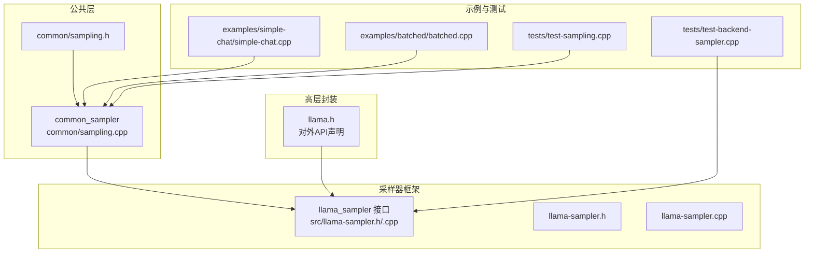
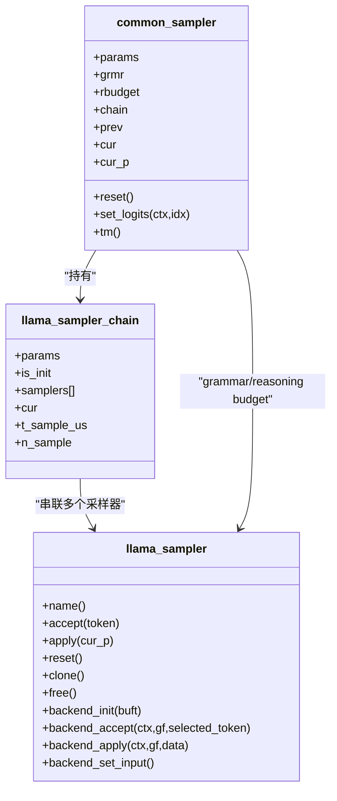
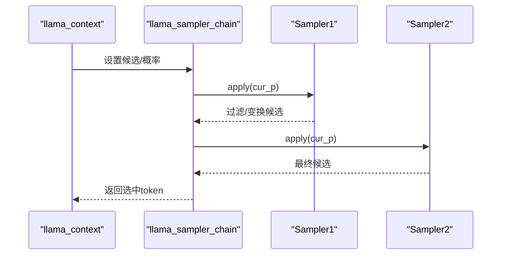
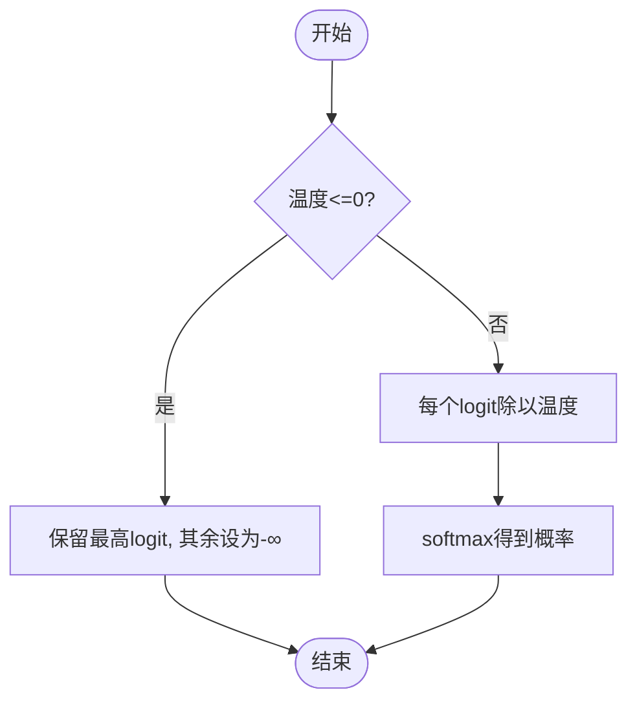
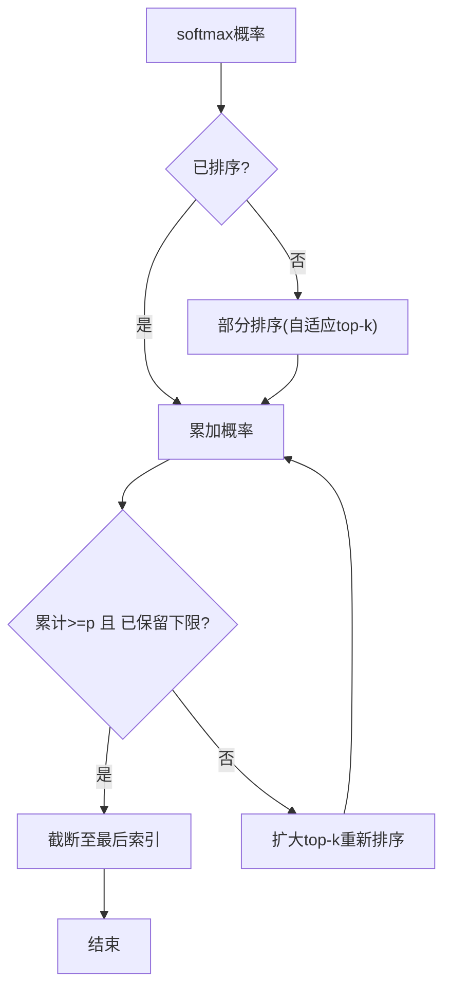
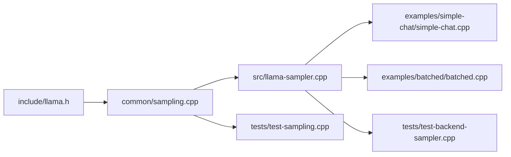

# 采样器扩展开发

<cite>
**本文引用的文件**
- [src/llama-sampler.h](file://src/llama-sampler.h)
- [src/llama-sampler.cpp](file://src/llama-sampler.cpp)
- [common/sampling.h](file://common/sampling.h)
- [common/sampling.cpp](file://common/sampling.cpp)
- [include/llama.h](file://include/llama.h)
- [tests/test-sampling.cpp](file://tests/test-sampling.cpp)
- [tests/test-backend-sampler.cpp](file://tests/test-backend-sampler.cpp)
- [examples/simple-chat/simple-chat.cpp](file://examples/simple-chat/simple-chat.cpp)
- [examples/batched/batched.cpp](file://examples/batched/batched.cpp)
</cite>

## 目录
1. [简介](#简介)
2. [项目结构](#项目结构)
3. [核心组件](#核心组件)
4. [架构总览](#架构总览)
5. [详细组件分析](#详细组件分析)
6. [依赖关系分析](#依赖关系分析)
7. [性能考量](#性能考量)
8. [故障排查指南](#故障排查指南)
9. [结论](#结论)
10. [附录](#附录)

## 简介
本指南面向希望在 llama.cpp 基础上开发与扩展“采样器”的工程师，系统讲解 llama_sampler 的架构设计、采样链路、常见采样策略（温度采样、Top-k、Top-p、Min-p、Tail-free/Typical-p、Dry 等）的数学原理与实现细节，并提供自定义采样器的开发流程、参数配置、组合使用与性能优化建议。同时给出与推理引擎的集成方式、质量评估方法与调优策略，以及可参考的测试用例路径。

## 项目结构
采样相关的核心代码位于 src 与 common 两个目录：
- src/llama-sampler.*：采样器框架、通用采样器实现、采样链与后端支持
- common/sampling.*：高层采样器封装 common_sampler，负责参数解析、grammar/reasoning budget 集成、采样主流程
- include/llama.h：对外公开的采样器初始化 API 声明
- tests/*：采样器单元测试与后端采样器测试
- examples/*：示例程序中如何添加采样器到采样链

**图表来源**
- [common/sampling.cpp:187-412](file://common/sampling.cpp#L187-L412)
- [src/llama-sampler.h:12-34](file://src/llama-sampler.h#L12-L34)
- [src/llama-sampler.cpp:349-804](file://src/llama-sampler.cpp#L349-L804)
- [include/llama.h:1180-1316](file://include/llama.h#L1180-L1316)

**章节来源**
- [common/sampling.cpp:187-412](file://common/sampling.cpp#L187-L412)
- [src/llama-sampler.h:12-34](file://src/llama-sampler.h#L12-L34)
- [src/llama-sampler.cpp:349-804](file://src/llama-sampler.cpp#L349-L804)
- [include/llama.h:1180-1316](file://include/llama.h#L1180-L1316)

## 核心组件
- 采样器接口与生命周期
  - llama_sampler 结构体与接口函数：初始化、克隆、应用、接受、重置、释放
  - 采样器链 llama_sampler_chain：按顺序串联多个采样器，统一计时与后端执行
- 常见采样器
  - 贪婪采样、均匀分布采样、Top-k、Top-p、Min-p、Temperature/动态温度、Dry、Typical-p、XTC、Penalties、Adaptive-p、Grammar、Reasoning Budget 等
- 高层封装 common_sampler
  - 统一设置候选、应用采样链、Grammar 拒绝采样、Reasoning Budget 抑制、历史记录、性能统计

**章节来源**
- [src/llama-sampler.cpp:351-426](file://src/llama-sampler.cpp#L351-L426)
- [src/llama-sampler.cpp:624-790](file://src/llama-sampler.cpp#L624-L790)
- [common/sampling.cpp:111-169](file://common/sampling.cpp#L111-L169)
- [common/sampling.cpp:537-617](file://common/sampling.cpp#L537-L617)

## 架构总览
llama_sampler 采用“接口 + 实现 + 链式组合”的架构。每个采样器实现一个接口函数表，采样链将多个采样器按序执行；common_sampler 则在高层封装了 logits 获取、grammar/reasoning budget、采样主循环与性能统计。

**图表来源**
- [src/llama-sampler.h:12-34](file://src/llama-sampler.h#L12-L34)
- [src/llama-sampler.cpp:624-790](file://src/llama-sampler.cpp#L624-L790)
- [common/sampling.cpp:111-169](file://common/sampling.cpp#L111-L169)

## 详细组件分析

### 采样器链与后端支持
- 采样器链负责顺序执行各采样器，并在后端模式下检测每个采样器是否能在设备上运行
- 后端支持检测通过构建最小图并检查设备是否支持所需算子
- 链式调用时跳过后端已执行的采样器，避免重复计算

**图表来源**
- [src/llama-sampler.cpp:642-662](file://src/llama-sampler.cpp#L642-L662)
- [src/llama-sampler.cpp:558-622](file://src/llama-sampler.cpp#L558-L622)

**章节来源**
- [src/llama-sampler.cpp:624-790](file://src/llama-sampler.cpp#L624-L790)
- [src/llama-sampler.cpp:558-622](file://src/llama-sampler.cpp#L558-L622)

### 温度采样（Temperature）
- 数学原理：对 logits 做除法缩放，再 softmax 得到新分布；温度越低越贪婪，越高越随机
- 实现要点：当温度为 0 时退化为贪心（仅最高 logit 保留），否则逐元素除以温度并 softmax
- 动态温度扩展：支持随上下文或步数变化的温度曲线

**图表来源**
- [src/llama-sampler.cpp:265-287](file://src/llama-sampler.cpp#L265-L287)
- [src/llama-sampler.cpp:1883-1999](file://src/llama-sampler.cpp#L1883-L1999)

**章节来源**
- [src/llama-sampler.cpp:265-287](file://src/llama-sampler.cpp#L265-L287)
- [src/llama-sampler.cpp:1883-1999](file://src/llama-sampler.cpp#L1883-L1999)

### Top-k 采样
- 数学原理：仅保留前 k 个最高 logit，其余置零或丢弃
- 实现要点：若未排序则进行部分排序以快速定位 top-k，然后截断大小

**章节来源**
- [src/llama-sampler.cpp:1255-1335](file://src/llama-sampler.cpp#L1255-L1335)
- [src/llama-sampler.cpp:317-334](file://src/llama-sampler.cpp#L317-L334)

### Top-p（核采样/Nucleus）采样
- 数学原理：按概率从高到低累加，直到累计概率达到阈值 p，至少保留 min_keep 个
- 实现要点：大集合时采用“自适应 top-k”先部分排序，再累加判断；小集合直接原地排序

**图表来源**
- [src/llama-sampler.cpp:1351-1404](file://src/llama-sampler.cpp#L1351-L1404)
- [src/llama-sampler.cpp:289-315](file://src/llama-sampler.cpp#L289-L315)

**章节来源**
- [src/llama-sampler.cpp:1351-1404](file://src/llama-sampler.cpp#L1351-L1404)
- [src/llama-sampler.cpp:289-315](file://src/llama-sampler.cpp#L289-L315)

### Min-p 采样
- 数学原理：保留满足 p_i ≥ p × p_max 的 token，至少保留 min_keep 个
- 实现要点：未排序时先扫描最大 logit，构造阈值；排序后从头向后扫描满足条件的区间

**章节来源**
- [src/llama-sampler.cpp:1543-1595](file://src/llama-sampler.cpp#L1543-L1595)

### Tail-free/Typical-p 采样
- 数学原理：基于“典型性”思想，保留相对“典型”的 token，丢弃尾部低典型性的 token
- 实现要点：通常结合 softmax 概率与熵/信息量度量，保留概率分布较集中的候选；具体阈值与最小保留数量由参数控制

**章节来源**
- [src/llama-sampler.cpp:1407-1511](file://src/llama-sampler.cpp#L1407-L1511)

### Dry 采样（Dry Multiplier/Base/Allowed Length/Penalty Last N）
- 设计目标：抑制重复与无意义的重复片段，提升多样性与可控性
- 参数含义（来自高层封装打印）：multiplier、base、allowed_length、penalty_last_n
- 实现要点：基于滑动窗口统计最近 token 序列，对可能形成重复片段的候选施加惩罚

**章节来源**
- [common/sampling.cpp:171-184](file://common/sampling.cpp#L171-L184)
- [src/llama-sampler.cpp:320-328](file://src/llama-sampler.cpp#L320-L328)

### Penalties（重复/频率/存在惩罚）
- 设计目标：抑制重复 token、降低高频词权重、鼓励覆盖更广词汇
- 实现要点：根据最近 N 个 token 的出现次数与类型，对相应 logits 施加线性/幂律惩罚

**章节来源**
- [src/llama-sampler.cpp:1598-1669](file://src/llama-sampler.cpp#L1598-L1669)

### Adaptive-p 与 Mirostat
- Adaptive-p：在采样链末尾选择单个 token 的自适应策略
- Mirostat/Mirostat V2：基于目标熵的自适应温度调节，使实际熵接近目标

**章节来源**
- [common/sampling.cpp:374-383](file://common/sampling.cpp#L374-L383)
- [src/llama-sampler.cpp:1883-1999](file://src/llama-sampler.cpp#L1883-L1999)

### Grammar 与 Reasoning Budget
- Grammar：在采样后对候选 token 应用语法约束，不满足则拒绝并重采
- Reasoning Budget：在特定标记范围内限制生成长度或施加抑制，避免冗长推理块

**章节来源**
- [common/sampling.cpp:426-439](file://common/sampling.cpp#L426-L439)
- [common/sampling.cpp:537-617](file://common/sampling.cpp#L537-L617)

## 依赖关系分析
- common_sampler 依赖 llama.h 中的采样器 API 与上下文接口
- 采样器链依赖 ggml 后端能力检测与图构建
- 示例程序通过 llama_sampler_chain_add 将采样器加入链路

**图表来源**
- [include/llama.h:1180-1316](file://include/llama.h#L1180-L1316)
- [common/sampling.cpp:187-412](file://common/sampling.cpp#L187-L412)
- [src/llama-sampler.cpp:349-804](file://src/llama-sampler.cpp#L349-L804)
- [examples/simple-chat/simple-chat.cpp:90-100](file://examples/simple-chat/simple-chat.cpp#L90-L100)
- [examples/batched/batched.cpp:78-82](file://examples/batched/batched.cpp#L78-L82)
- [tests/test-sampling.cpp:60-120](file://tests/test-sampling.cpp#L60-L120)
- [tests/test-backend-sampler.cpp:300-470](file://tests/test-backend-sampler.cpp#L300-L470)

**章节来源**
- [include/llama.h:1180-1316](file://include/llama.h#L1180-L1316)
- [examples/simple-chat/simple-chat.cpp:90-100](file://examples/simple-chat/simple-chat.cpp#L90-L100)
- [examples/batched/batched.cpp:78-82](file://examples/batched/batched.cpp#L78-L82)
- [tests/test-sampling.cpp:60-120](file://tests/test-sampling.cpp#L60-L120)
- [tests/test-backend-sampler.cpp:300-470](file://tests/test-backend-sampler.cpp#L300-L470)

## 性能考量
- 部分排序优化：Top-p 在大集合时采用“自适应 top-k”减少排序开销
- softmax 稳定性：减去最大 logit 再指数化，避免溢出
- 后端支持检测：在链初始化阶段检测设备是否支持采样器所需算子，避免运行时失败
- 预分配缓冲：采样链预分配当前候选数组，减少频繁内存分配
- 计时与统计：链内维护采样耗时与次数，便于性能分析

**章节来源**
- [src/llama-sampler.cpp:135-215](file://src/llama-sampler.cpp#L135-L215)
- [src/llama-sampler.cpp:289-315](file://src/llama-sampler.cpp#L289-L315)
- [src/llama-sampler.cpp:558-622](file://src/llama-sampler.cpp#L558-L622)
- [src/llama-sampler.cpp:792-804](file://src/llama-sampler.cpp#L792-L804)

## 故障排查指南
- 采样后无选中 token：检查采样链最终是否为空，确保有基础采样器（如 dist）在链末尾
- Grammar 冲突：grammar_first 模式下会先应用 grammar 再采样；若频繁拒绝，考虑放宽 grammar 或改用 lazy grammar
- 后端采样不可用：grammar 与 reasoning budget 与后端采样不兼容，需禁用后端采样
- 性能异常：确认是否启用了不必要的采样器链；检查 softmax 是否频繁触发；核对 Top-p 的 min_keep 与 Top-k 的 k 设置

**章节来源**
- [common/sampling.cpp:537-617](file://common/sampling.cpp#L537-L617)
- [common/sampling.cpp:389-399](file://common/sampling.cpp#L389-L399)

## 结论
llama_sampler 提供了清晰的接口与高效的链式执行模型，配合 common_sampler 的高层封装，能够灵活组合多种采样策略，并在 CPU/GPU 后端之间自动切换。通过合理配置参数与采样器顺序，可在可控性与多样性之间取得平衡；借助测试用例与性能统计工具，可以持续评估与优化采样质量。

## 附录

### 自定义采样器开发流程
- 定义采样器上下文结构体，继承后端支持基类（如需要后端）
- 实现接口函数表：name/accept/apply/reset/clone/free，以及可选的 backend_* 函数
- 在链中注册：通过 llama_sampler_chain_add 加入采样链
- 参数配置：在 common_params_sampling 中设置对应参数，由 common_sampler 初始化时自动装配
- 性能优化：尽量复用部分排序、softmax 稳定性、后端支持检测

**章节来源**
- [src/llama-sampler.cpp:349-426](file://src/llama-sampler.cpp#L349-L426)
- [src/llama-sampler.cpp:624-790](file://src/llama-sampler.cpp#L624-L790)
- [common/sampling.cpp:187-412](file://common/sampling.cpp#L187-L412)

### 采样器组合与高级技术
- 经典顺序：Penalties → Dry → Top-k → Top-p → Min-p → Temperature/Typical-p/XTC → Dist（或 Mirostat/Adaptive-p）
- 与 Grammar/Reasoning Budget 协作：Grammar 可在采样后拒绝不合法 token；Reasoning Budget 在特定区间施加抑制
- 后端采样：仅在设备支持所有算子时启用，否则回退到 CPU 采样

**章节来源**
- [common/sampling.cpp:314-383](file://common/sampling.cpp#L314-L383)
- [src/llama-sampler.cpp:558-622](file://src/llama-sampler.cpp#L558-L622)

### 采样质量评估与调优策略
- 评估指标：困惑度（perplexity）、人类评分、语法正确率、任务指标（如准确率）
- 调优策略：逐步调整温度、Top-k、Top-p、Min-p、Dry 参数；观察候选分布直方图与熵；对比不同采样器组合的稳定性与多样性

**章节来源**
- [common/sampling.cpp:484-527](file://common/sampling.cpp#L484-L527)

### 代码示例与测试用例路径
- 示例程序中添加采样器到链路
  - [examples/simple-chat/simple-chat.cpp:90-100](file://examples/simple-chat/simple-chat.cpp#L90-L100)
  - [examples/batched/batched.cpp:78-82](file://examples/batched/batched.cpp#L78-L82)
- 测试用例
  - [tests/test-sampling.cpp:60-120](file://tests/test-sampling.cpp#L60-L120)
  - [tests/test-backend-sampler.cpp:300-470](file://tests/test-backend-sampler.cpp#L300-L470)