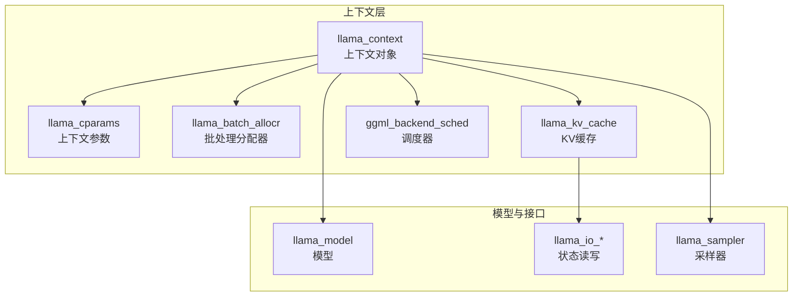
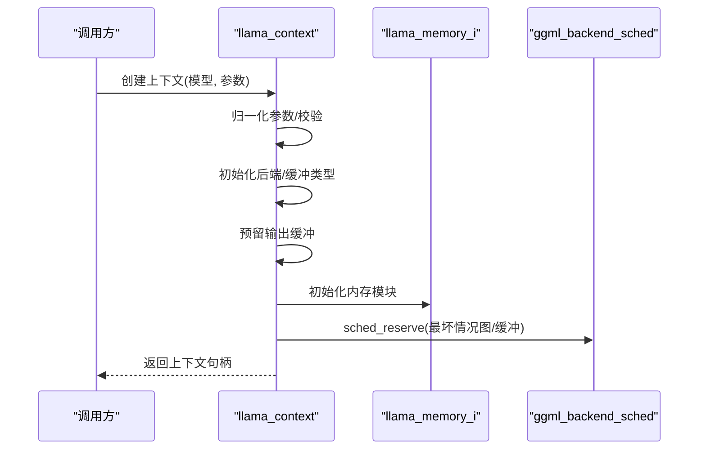
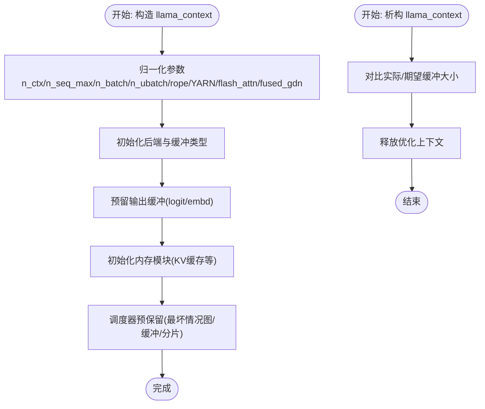
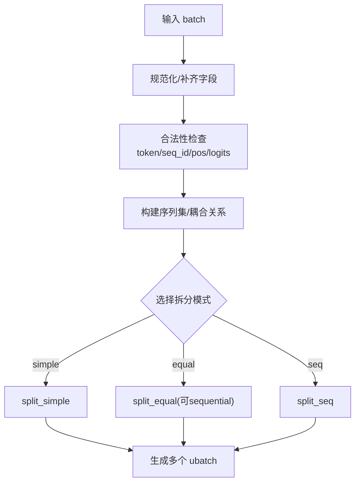
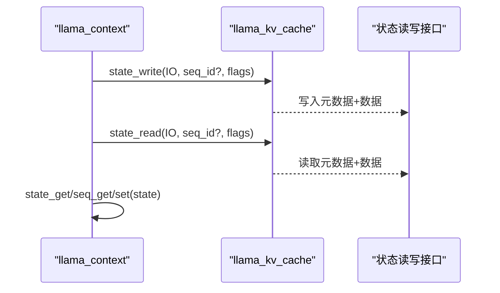
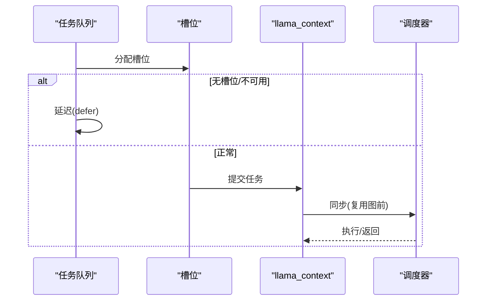
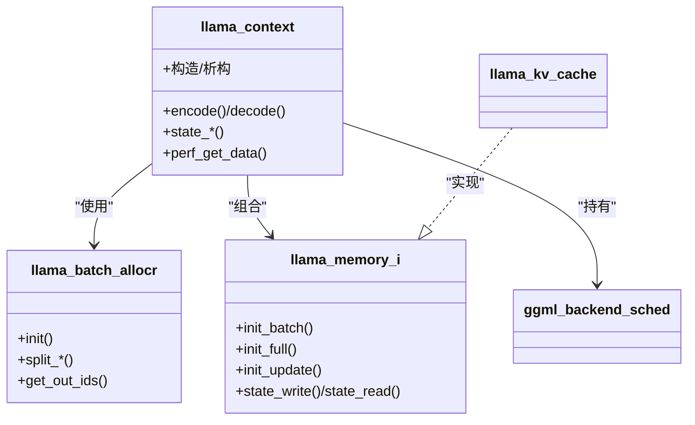

# 上下文管理

<cite>
**本文引用的文件**
- [llama-context.h](file://src/llama-context.h)
- [llama-context.cpp](file://src/llama-context.cpp)
- [llama-batch.h](file://src/llama-batch.h)
- [llama-batch.cpp](file://src/llama-batch.cpp)
- [llama-kv-cache.h](file://src/llama-kv-cache.h)
- [llama-kv-cache.cpp](file://src/llama-kv-cache.cpp)
- [llama-memory.h](file://src/llama-memory.h)
- [llama-memory.cpp](file://src/llama-memory.cpp)
- [llama-cparams.h](file://src/llama-cparams.h)
- [ggml-backend.cpp](file://ggml/src/ggml-backend.cpp)
- [server-context.cpp](file://tools/server/server-context.cpp)
</cite>

## 目录
1. [引言](#引言)
2. [项目结构](#项目结构)
3. [核心组件](#核心组件)
4. [架构总览](#架构总览)
5. [详细组件分析](#详细组件分析)
6. [依赖关系分析](#依赖关系分析)
7. [性能考量](#性能考量)
8. [故障排查指南](#故障排查指南)
9. [结论](#结论)

## 引言
本文件系统性解析 llama.cpp 的上下文管理系统与实现细节，围绕以下目标展开：上下文创建与销毁流程（资源初始化、参数配置与清理）、批处理机制（批量大小设置、序列对齐与动态批处理）、上下文状态管理（会话跟踪、状态持久化与并发访问控制）、上下文切换策略（多任务调度、优先级管理与资源抢占），以及性能优化与故障恢复的最佳实践。

## 项目结构
llama.cpp 将“上下文”抽象为一个统一的执行环境，负责：
- 参数与硬件后端初始化
- 计算图构建与复用
- 批处理拆分与内存上下文管理
- 输出缓冲与采样器集成
- 状态保存/加载与性能统计

图表来源
- [llama-context.h:26-350](file://src/llama-context.h#L26-L350)
- [llama-context.cpp:24-367](file://src/llama-context.cpp#L24-L367)
- [llama-batch.h:72-174](file://src/llama-batch.h#L72-L174)
- [llama-kv-cache.h:20-120](file://src/llama-kv-cache.h#L20-L120)
- [ggml-backend.cpp:1727-1794](file://ggml/src/ggml-backend.cpp#L1727-L1794)

章节来源
- [llama-context.h:26-350](file://src/llama-context.h#L26-L350)
- [llama-context.cpp:24-367](file://src/llama-context.cpp#L24-L367)
- [llama-batch.h:72-174](file://src/llama-batch.h#L72-L174)
- [llama-kv-cache.h:20-120](file://src/llama-kv-cache.h#L20-L120)
- [ggml-backend.cpp:1727-1794](file://ggml/src/ggml-backend.cpp#L1727-L1794)

## 核心组件
- 上下文对象（llama_context）：封装模型、参数、后端、调度器、输出缓冲、采样器、内存模块等；提供 encode/decode、状态读写、性能统计等能力。
- 批处理分配器（llama_batch_allocr）：输入规范化、位置连续性校验、序列集划分（简单/等长/按序列集）、输出索引映射。
- KV 缓存（llama_kv_cache）：KV 单元格环形缓冲、槽位查找与应用、流式复制、状态读写。
- 内存接口（llama_memory_i）：抽象内存上下文生命周期（init_batch/init_full/init_update/apply/clear/state_*）。
- 调度器（ggml_backend_sched）：多后端图调度、分片、事件同步、回调与重用。

章节来源
- [llama-context.h:26-350](file://src/llama-context.h#L26-L350)
- [llama-context.cpp:1171-1241](file://src/llama-context.cpp#L1171-L1241)
- [llama-batch.h:72-174](file://src/llama-batch.h#L72-L174)
- [llama-batch.cpp:25-389](file://src/llama-batch.cpp#L25-L389)
- [llama-kv-cache.h:20-120](file://src/llama-kv-cache.h#L20-L120)
- [llama-kv-cache.cpp:79-200](file://src/llama-kv-cache.cpp#L79-L200)
- [llama-memory.h:68-123](file://src/llama-memory.h#L68-L123)
- [ggml-backend.cpp:774-828](file://ggml/src/ggml-backend.cpp#L774-L828)

## 架构总览
llama_context 在构造时完成：
- 参数归一化与校验（n_ctx、n_seq_max、n_batch、n_ubatch、rope/YARN、flash_attn/fused_gdn 自适应）
- 后端设备枚举与缓冲类型选择
- 输出缓冲预留与性能计时初始化
- 内存模块初始化（KV 缓存等）
- 调度器预保留（worst-case 图节点数、缓冲大小、PP 分片数）

图表来源
- [llama-context.cpp:24-367](file://src/llama-context.cpp#L24-L367)
- [llama-context.cpp:389-630](file://src/llama-context.cpp#L389-L630)
- [ggml-backend.cpp:1727-1794](file://ggml/src/ggml-backend.cpp#L1727-L1794)

章节来源
- [llama-context.cpp:24-367](file://src/llama-context.cpp#L24-L367)
- [llama-context.cpp:389-630](file://src/llama-context.cpp#L389-L630)
- [ggml-backend.cpp:1727-1794](file://ggml/src/ggml-backend.cpp#L1727-L1794)

## 详细组件分析

### 上下文创建与销毁流程
- 创建阶段
  - 参数归一化：n_ctx、n_ctx_seq、n_batch、n_ubatch、rope/YARN、flash_attn/fused_gdn 自动判定、KV 统一/分离、线程数、池化类型等。
  - 后端初始化：遍历模型设备与加速设备，初始化 CPU/GPU/加速后端，并收集 set_n_threads 函数指针。
  - 输出缓冲：根据 n_seq_max 预留 logits/embd 缓冲大小。
  - 内存模块：按 type_k/type_v/swa_full 初始化 KV 缓存等。
  - 调度器：计算最坏情况图节点数，reserve 一次 worst-case 图与 PP/TG 分片，记录缓冲大小与分片信息。
- 销毁阶段
  - 统计实际/期望缓冲大小差异，释放优化上下文与后端资源。

图表来源
- [llama-context.cpp:24-367](file://src/llama-context.cpp#L24-L367)
- [llama-context.cpp:369-387](file://src/llama-context.cpp#L369-L387)
- [llama-context.cpp:389-630](file://src/llama-context.cpp#L389-L630)

章节来源
- [llama-context.cpp:24-367](file://src/llama-context.cpp#L24-L367)
- [llama-context.cpp:369-387](file://src/llama-context.cpp#L369-L387)
- [llama-context.cpp:389-630](file://src/llama-context.cpp#L389-L630)

### 批处理机制：批量大小、序列对齐与动态批处理
- 输入规范化与校验
  - 校验 token/seq_id/pos/logits 合法性，自动补齐缺失字段（如 seq_id、pos、logits）。
  - 检查序列位置连续性（M-RoPE 允许跳跃但有约束）与耦合序列一致性。
- 序列集划分
  - split_simple：按顺序取未使用 token，适合无序或混合场景。
  - split_equal：按“等长序列集”打包，支持 sequential 模式（需无耦合）。
  - split_seq：按单个序列集打包，保证同一 ubatch 内序列集不交叉。
- 输出索引映射
  - out_ids 记录输出 token 在原始 batch 中的顺序，用于后续 logits/embd 的行映射。

图表来源
- [llama-batch.cpp:25-389](file://src/llama-batch.cpp#L25-L389)
- [llama-batch.cpp:474-653](file://src/llama-batch.cpp#L474-L653)
- [llama-batch.h:72-174](file://src/llama-batch.h#L72-L174)

章节来源
- [llama-batch.cpp:25-389](file://src/llama-batch.cpp#L25-L389)
- [llama-batch.cpp:474-653](file://src/llama-batch.cpp#L474-L653)
- [llama-batch.h:72-174](file://src/llama-batch.h#L72-L174)

### 上下文状态管理：会话跟踪、状态持久化与并发访问控制
- 会话跟踪
  - 通过 seq_id 唯一标识序列，seq_idx 提供序列到 ubatch 内部索引的映射。
  - 输出缓冲按输出 token 顺序维护 output_ids，支持负索引定位最后输出行。
- 状态持久化
  - 支持整体上下文状态与按序列的状态保存/加载（state_get/seq_get/set）。
  - KV 缓存支持 state_write/state_read，包含元数据与数据两部分。
- 并发访问控制
  - 多后端调度器通过事件与同步确保复用图在 GPU 上次计算完成后再覆盖输入。
  - 可设置中止回调，便于外部中断。

图表来源
- [llama-context.h:122-157](file://src/llama-context.h#L122-L157)
- [llama-kv-cache.h:141-145](file://src/llama-kv-cache.h#L141-L145)
- [llama-kv-cache.cpp:281-307](file://src/llama-kv-cache.cpp#L281-L307)

章节来源
- [llama-context.h:122-157](file://src/llama-context.h#L122-L157)
- [llama-kv-cache.h:141-145](file://src/llama-kv-cache.h#L141-L145)
- [llama-kv-cache.cpp:281-307](file://src/llama-kv-cache.cpp#L281-L307)

### 上下文切换策略：多任务调度、优先级管理与资源抢占
- 多任务调度
  - 服务器侧通过队列与槽位管理任务，若无可用槽位或请求超出上下文长度则延迟或拒绝。
- 优先级管理
  - 进程优先级可通过通用工具设置（POSIX/Windows），影响调度器与系统调度行为。
- 资源抢占
  - 调度器在复用图前进行同步，避免 GPU 上次计算未完成导致的输入覆盖。
  - 可设置中止回调以响应外部中断。

图表来源
- [server-context.cpp:1867-1883](file://tools/server/server-context.cpp#L1867-L1883)
- [ggml-backend.cpp:1708-1725](file://ggml/src/ggml-backend.cpp#L1708-L1725)
- [common.cpp:208-259](file://common/common.cpp#L208-L259)

章节来源
- [server-context.cpp:1867-1883](file://tools/server/server-context.cpp#L1867-L1883)
- [ggml-backend.cpp:1708-1725](file://ggml/src/ggml-backend.cpp#L1708-L1725)
- [common.cpp:208-259](file://common/common.cpp#L208-L259)

### 性能优化与故障恢复最佳实践
- 性能优化
  - 启用/禁用自动特性：Flash Attention 与融合 Gated Delta Net 的自动探测与回退。
  - 图复用：通过 can_reuse 与 gf_res_prev 复用最坏情况图，减少图重建开销。
  - 线程与后端：合理设置 n_threads/n_threads_batch，按后端能力设置 set_n_threads。
  - KV 统一/分离：根据 n_seq_max 与 n_ctx_seq 的关系选择统一或分离 KV，平衡内存与吞吐。
- 故障恢复
  - 分配失败：graph_alloc 返回失败时，检查缓冲大小与分片数，必要时关闭 PP 或降低 n_ubatch。
  - 中止回调：设置 abort_callback 以响应外部取消。
  - 状态恢复：利用 state_save/load 与 KV 状态读写进行断点续跑。

章节来源
- [llama-context.cpp:429-549](file://src/llama-context.cpp#L429-L549)
- [llama-context.cpp:1171-1241](file://src/llama-context.cpp#L1171-L1241)
- [llama-context.cpp:1017-1032](file://src/llama-context.cpp#L1017-L1032)
- [llama-kv-cache.cpp:281-307](file://src/llama-kv-cache.cpp#L281-L307)

## 依赖关系分析
- 上下文对调度器的依赖：通过 ggml_backend_sched 完成图的分片、事件同步与缓冲分配。
- 上下文对内存模块的依赖：llama_memory_i 抽象了不同内存实现（KV 缓存、iSWA 等），上下文仅通过接口交互。
- 上下文对批处理分配器的依赖：encode/decode 前通过 balloc 规范化输入、划分 ubatch。
- 参数结构（llama_cparams）贯穿上下文生命周期，决定 n_ctx_seq、n_batch、n_ubatch、rope/YARN、flash_attn/fused_gdn 等关键行为。

图表来源
- [llama-context.h:26-350](file://src/llama-context.h#L26-L350)
- [llama-batch.h:72-174](file://src/llama-batch.h#L72-L174)
- [llama-memory.h:68-123](file://src/llama-memory.h#L68-L123)
- [llama-kv-cache.h:20-120](file://src/llama-kv-cache.h#L20-L120)
- [ggml-backend.cpp:774-828](file://ggml/src/ggml-backend.cpp#L774-L828)

章节来源
- [llama-context.h:26-350](file://src/llama-context.h#L26-L350)
- [llama-batch.h:72-174](file://src/llama-batch.h#L72-L174)
- [llama-memory.h:68-123](file://src/llama-memory.h#L68-L123)
- [llama-kv-cache.h:20-120](file://src/llama-kv-cache.h#L20-L120)
- [ggml-backend.cpp:774-828](file://ggml/src/ggml-backend.cpp#L774-L828)

## 性能考量
- 图复用与重用：通过 can_reuse 与 gf_res_prev 复用图，减少图构建与分配成本。
- 自适应特性：自动检测 Flash Attention 与融合算子支持，避免不兼容导致的回退。
- 线程与后端：合理设置线程数与后端缓冲类型，避免过度竞争与拷贝。
- KV 统一/分离：在多序列场景下权衡内存占用与吞吐。

## 故障排查指南
- 分配失败（GGML_STATUS_ALLOC_FAILED）
  - 检查调度器缓冲大小与分片数，尝试关闭流水线并行或降低 n_ubatch。
- 中止执行（GGML_STATUS_ABORTED）
  - 设置 abort_callback 并在外部触发中止，确保上下文及时释放。
- 状态读写异常
  - 确认 state_write/state_read 的 flags 与目标序列是否一致，KV 元数据与数据两部分均需正确读写。
- 服务器槽位不足
  - 若无可用槽位或请求超过上下文长度，服务端会延迟或拒绝，需调整并发或上下文大小。

章节来源
- [llama-context.cpp:1214-1218](file://src/llama-context.cpp#L1214-L1218)
- [llama-context.cpp:1017-1032](file://src/llama-context.cpp#L1017-L1032)
- [llama-kv-cache.cpp:281-307](file://src/llama-kv-cache.cpp#L281-L307)
- [server-context.cpp:2335-2354](file://tools/server/server-context.cpp#L2335-L2354)

## 结论
llama.cpp 的上下文管理以“llama_context”为核心，结合“llama_batch_allocr”“llama_memory_i”“ggml_backend_sched”形成完整的推理执行闭环。通过严格的参数归一化、自动化的后端特性探测、可复用的计算图与灵活的批处理拆分策略，系统在多后端异构环境下实现了高吞吐与高可用。配合状态持久化与中止回调，能够满足生产级部署的性能与可靠性需求。