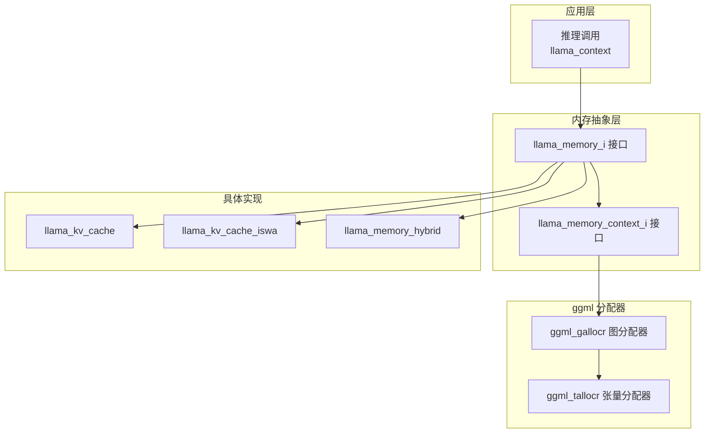
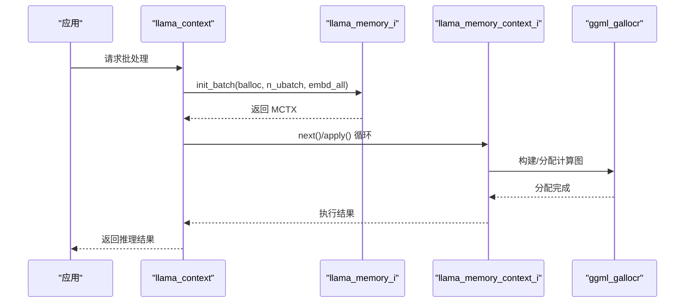
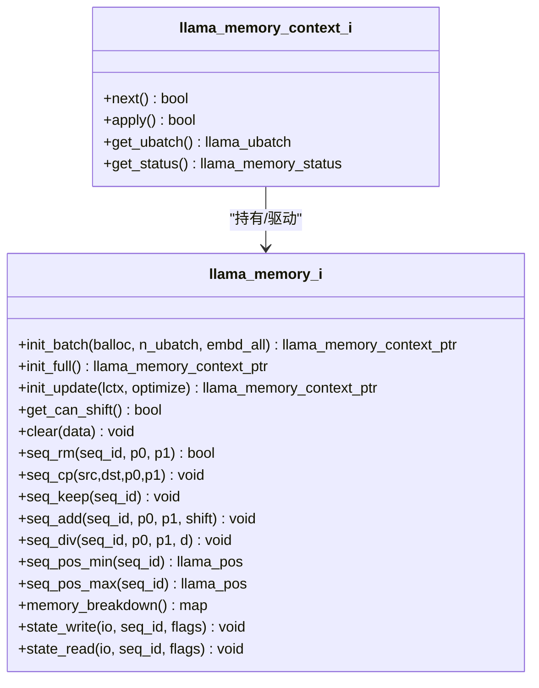
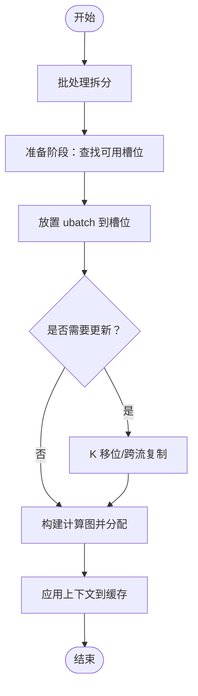
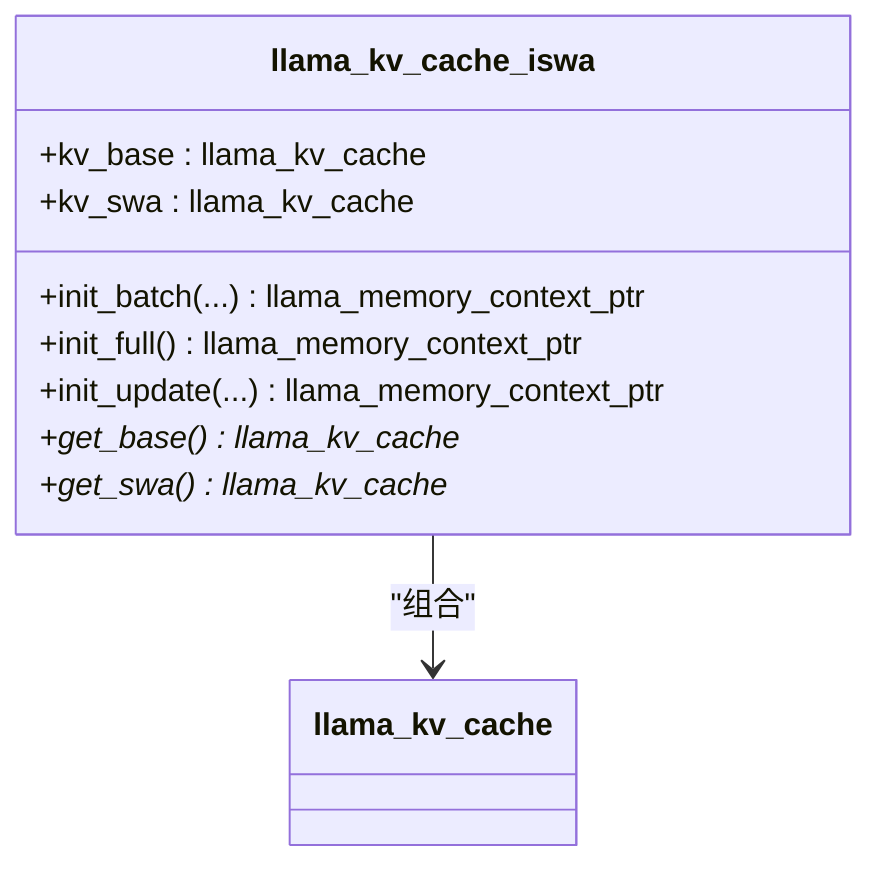
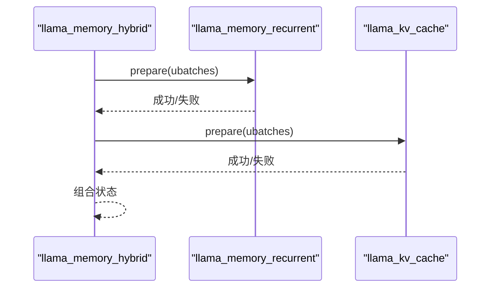
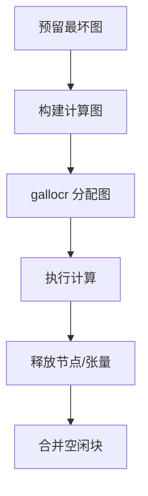
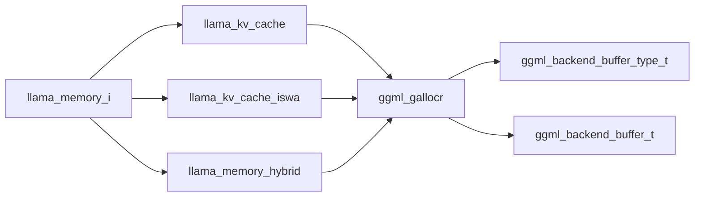

# 内存管理优化

<cite>
**本文档引用的文件**
- [llama-memory.h](file://src/llama-memory.h)
- [llama-memory.cpp](file://src/llama-memory.cpp)
- [llama-kv-cache.h](file://src/llama-kv-cache.h)
- [llama-kv-cache.cpp](file://src/llama-kv-cache.cpp)
- [llama-kv-cache-iswa.h](file://src/llama-kv-cache-iswa.h)
- [llama-kv-cache-iswa.cpp](file://src/llama-kv-cache-iswa.cpp)
- [llama-memory-hybrid.h](file://src/llama-memory-hybrid.h)
- [llama-memory-hybrid.cpp](file://src/llama-memory-hybrid.cpp)
- [ggml-alloc.h](file://ggml/include/ggml-alloc.h)
- [ggml-alloc.c](file://ggml/src/ggml-alloc.c)
- [ggml.h](file://ggml/include/ggml.h)
- [llama-context.h](file://src/llama-context.h)
- [fit.cpp](file://common/fit.cpp)
- [common.cpp](file://common/common.cpp)
</cite>

## 目录
1. [简介](#简介)
2. [项目结构](#项目结构)
3. [核心组件](#核心组件)
4. [架构总览](#架构总览)
5. [详细组件分析](#详细组件分析)
6. [依赖关系分析](#依赖关系分析)
7. [性能考量](#性能考量)
8. [故障排查指南](#故障排查指南)
9. [结论](#结论)
10. [附录](#附录)

## 简介
本文件系统性解析 llama.cpp 的内存管理机制与优化策略，覆盖以下主题：
- 内存分配策略：连续内存块分配、碎片整理与内存池管理
- KV 缓存内存管理：缓存大小控制、淘汰策略与内存复用
- 模型权重内存布局：张量对齐、缓存行优化与 NUMA 亲和性
- 内存泄漏防护：自动释放、引用计数与异常安全
- 内存使用监控与性能分析工具的使用指南

## 项目结构
llama.cpp 将内存管理抽象为“通用内存接口”与多种具体实现（KV 缓存、混合模式、SWA 等），并通过 ggml 的图分配器完成计算图阶段的缓冲区分配与复用。

**图表来源**
- [llama-memory.h:68-123](file://src/llama-memory.h#L68-L123)
- [llama-kv-cache.h:20-307](file://src/llama-kv-cache.h#L20-L307)
- [llama-kv-cache-iswa.h:14-80](file://src/llama-kv-cache-iswa.h#L14-L80)
- [llama-memory-hybrid.h:19-90](file://src/llama-memory-hybrid.h#L19-L90)
- [ggml-alloc.h:46-82](file://ggml/include/ggml-alloc.h#L46-L82)

**章节来源**
- [llama-memory.h:16-123](file://src/llama-memory.h#L16-L123)
- [llama-kv-cache.h:1-421](file://src/llama-kv-cache.h#L1-L421)
- [ggml-alloc.h:1-86](file://ggml/include/ggml-alloc.h#L1-L86)

## 核心组件
- 通用内存接口：定义批处理初始化、更新、序列操作、状态读写等统一能力，支持不同后端缓冲类型统计与断言。
- 具体实现：
  - KV 缓存：按层组织 K/V 张量，支持流式复制、跨流拷贝、旋转注意力预计算、头部移动与滑动窗口。
  - SWA 集成：将非 SWA 层与 SWA 层分别缓存，支持全尺寸 SWA 缓存配置。
  - 混合模式：同时支持注意力与循环层的缓存，按层过滤与复用。
- ggml 分配器：提供图级与张量级分配器，支持多缓冲区、动态分块、最佳适配与空闲块合并。

**章节来源**
- [llama-memory.h:68-123](file://src/llama-memory.h#L68-L123)
- [llama-kv-cache.h:20-307](file://src/llama-kv-cache.h#L20-L307)
- [llama-kv-cache-iswa.h:14-80](file://src/llama-kv-cache-iswa.h#L14-L80)
- [llama-memory-hybrid.h:19-90](file://src/llama-memory-hybrid.h#L19-L90)
- [ggml-alloc.h:13-82](file://ggml/include/ggml-alloc.h#L13-L82)

## 架构总览
llama.cpp 的内存管理以“抽象接口 + 多实现 + ggml 分配器”的方式解耦。推理流程中，llama_context 调用内存接口进行批处理拆分与准备，生成上下文对象；随后通过 ggml 图分配器在计算图构建时一次性分配所有中间张量，避免运行期频繁分配。

**图表来源**
- [llama-context.h:109-117](file://src/llama-context.h#L109-L117)
- [llama-memory.h:81-91](file://src/llama-memory.h#L81-L91)
- [ggml-alloc.h:48-74](file://ggml/include/ggml-alloc.h#L48-L74)

## 详细组件分析

### 通用内存接口与状态机
- 接口职责：批处理拆分、全缓存模拟、更新准备、序列操作（删除/复制/保留/位移/分割）、状态读写。
- 状态组合与失败判定：提供状态组合与失败判断辅助函数，用于混合内存类型（如 iSWA）的状态聚合。

**图表来源**
- [llama-memory.h:68-123](file://src/llama-memory.h#L68-L123)

**章节来源**
- [llama-memory.h:16-123](file://src/llama-memory.h#L16-L123)
- [llama-memory.cpp:3-59](file://src/llama-memory.cpp#L3-L59)

### KV 缓存：连续内存块、碎片整理与复用
- 连续内存块分配：每个层创建 3D 张量（n_embd, kv_size, n_stream），视图切片形成流式访问；通过 ggml 后端缓冲类型与上下文分离，按设备/主机分配。
- 碎片整理：动态张量分配器维护空闲块列表，采用“最佳适配 + 尾部重用”策略，并在释放时尝试与相邻空闲块合并，减少碎片。
- 内存池管理：虚拟缓冲区将大块内存拆分为多个后端缓冲（chunks），在图分配时按节点布局分配，避免重复分配与拷贝。
- 旋转注意力：对量化头维度进行哈达玛旋转矩阵预计算，减少运行时开销。
- 更新与复制：支持跨流数据复制、K 移位、序列位移/分割，配合调度器同步执行。

**图表来源**
- [llama-kv-cache.cpp:626-673](file://src/llama-kv-cache.cpp#L626-L673)
- [ggml-alloc.c:201-308](file://ggml/src/ggml-alloc.c#L201-L308)

**章节来源**
- [llama-kv-cache.h:20-307](file://src/llama-kv-cache.h#L20-L307)
- [llama-kv-cache.cpp:79-327](file://src/llama-kv-cache.cpp#L79-L327)
- [ggml-alloc.c:120-389](file://ggml/src/ggml-alloc.c#L120-L389)

### SWA 集成（iSWA）：双缓存与全尺寸配置
- 双缓存设计：非 SWA 层与 SWA 层分别使用独立 KV 缓存实例，按层过滤与大小配置。
- 全尺寸 SWA：可选将 SWA 缓存大小设为与基础缓存一致，提升性能一致性。
- 批处理准备：先尝试简单拆分，失败则回退到等分拆分，确保两套缓存均能容纳。

**图表来源**
- [llama-kv-cache-iswa.h:14-80](file://src/llama-kv-cache-iswa.h#L14-L80)
- [llama-kv-cache-iswa.cpp:14-73](file://src/llama-kv-cache-iswa.cpp#L14-L73)

**章节来源**
- [llama-kv-cache-iswa.h:14-80](file://src/llama-kv-cache-iswa.h#L14-L80)
- [llama-kv-cache-iswa.cpp:14-248](file://src/llama-kv-cache-iswa.cpp#L14-L248)

### 混合模式：注意力与循环层共存
- 层过滤：根据模型参数区分注意力与循环层，分别交由对应内存实现管理。
- 并行准备：先准备循环层，再准备注意力层，若任一失败则整体回退。
- 状态写入：可选择仅写入部分序列状态，降低 IO 压力。

**图表来源**
- [llama-memory-hybrid.cpp:62-112](file://src/llama-memory-hybrid.cpp#L62-L112)

**章节来源**
- [llama-memory-hybrid.h:19-90](file://src/llama-memory-hybrid.h#L19-L90)
- [llama-memory-hybrid.cpp:11-199](file://src/llama-memory-hybrid.cpp#L11-L199)

### ggml 分配器：图级与张量级分配
- 图分配器（gallocr）：基于拓扑遍历，优先复用父张量内存，支持多缓冲区、节点/叶缓冲区 ID 映射、预留最坏情况图以避免重分配。
- 张量分配器（tallocr）：线性分配，按对齐要求推进偏移，适合固定图或小规模分配。
- 动态分配器：维护空闲块数组，采用最佳适配与尾部重用策略，释放时合并相邻空闲块。

**图表来源**
- [ggml-alloc.h:48-82](file://ggml/include/ggml-alloc.h#L48-L82)
- [ggml-alloc.c:537-711](file://ggml/src/ggml-alloc.c#L537-L711)

**章节来源**
- [ggml-alloc.h:13-86](file://ggml/include/ggml-alloc.h#L13-L86)
- [ggml-alloc.c:120-389](file://ggml/src/ggml-alloc.c#L120-L389)

## 依赖关系分析
- 抽象接口依赖：llama_memory_i 与 llama_memory_context_i 作为统一契约，屏蔽具体实现差异。
- 实现依赖：KV 缓存依赖 ggml 张量与后端缓冲类型；iSWA 与混合模式组合多个 KV 缓存实例。
- 分配器依赖：ggml_gallocr 依赖 ggml_backend_buffer_type_t 与 ggml_backend_buffer，实现按设备/主机的缓冲分配与复用。

**图表来源**
- [llama-memory.h:68-123](file://src/llama-memory.h#L68-L123)
- [llama-kv-cache.h:20-307](file://src/llama-kv-cache.h#L20-L307)
- [llama-kv-cache-iswa.h:14-80](file://src/llama-kv-cache-iswa.h#L14-L80)
- [llama-memory-hybrid.h:19-90](file://src/llama-memory-hybrid.h#L19-L90)
- [ggml-alloc.h:9-12](file://ggml/include/ggml-alloc.h#L9-L12)

**章节来源**
- [llama-memory.h:68-123](file://src/llama-memory.h#L68-L123)
- [ggml-alloc.h:9-12](file://ggml/include/ggml-alloc.h#L9-L12)

## 性能考量
- 对齐与缓存行：分配器严格遵循后端缓冲对齐要求，减少跨行访问与 TLB 压力。
- 预计算与复用：旋转注意力哈达玛矩阵预计算，图分配器优先复用父张量内存，减少拷贝与碎片。
- 多缓冲区：虚拟缓冲区将大内存拆分为多个后端缓冲，提高大模型在多设备场景下的分配成功率。
- NUMA 亲和性：通过设置进程优先级与 CPU 亲和（Linux），在多核系统中提升数学密集型任务性能。

**章节来源**
- [ggml-alloc.c:52-56](file://ggml/src/ggml-alloc.c#L52-L56)
- [llama-kv-cache.cpp:304-323](file://src/llama-kv-cache.cpp#L304-L323)
- [common.cpp:135-224](file://common/common.cpp#L135-L224)

## 故障排查指南
- 准备阶段失败：当无法找到合适槽位或拆分失败时，返回失败状态；检查 KV 缓存大小、序列范围与拆分策略。
- 更新阶段失败：K 移位或跨流复制失败时，需确认调度器已同步且缓冲类型匹配。
- 内存不足：通过内存分解接口查看各后端缓冲类型占用，结合预留最坏图避免运行期重分配。
- 性能异常：启用调试环境变量（如 KV 缓存调试、注意力旋转禁用）定位问题；使用内存分解打印输出分析设备/主机内存分布。

**章节来源**
- [llama-kv-cache.cpp:626-673](file://src/llama-kv-cache.cpp#L626-L673)
- [fit.cpp:784-908](file://common/fit.cpp#L784-L908)

## 结论
llama.cpp 的内存管理通过“抽象接口 + 多实现 + ggml 分配器”的架构实现了高内聚、低耦合的内存子系统。其核心优势在于：
- 以图分配器为核心的“一次分配、多次复用”，显著降低运行期分配开销；
- KV 缓存的流式与跨流复制能力，满足长上下文与多序列场景；
- SWA 与混合模式扩展，覆盖更广泛的模型形态；
- 预计算与对齐策略提升缓存命中与吞吐；
- 完整的监控与调试工具链，便于定位与优化内存问题。

## 附录

### 内存使用监控与性能分析工具
- 内存分解打印：遍历内存分解映射，按设备与主机汇总模型、上下文、计算占用，输出表格化报告。
- 设备内存拟合：根据目标剩余内存与模型层划分策略，自动调整每设备层数与溢出缓冲类型，确保满足内存约束。
- 运行时性能：通过上下文性能接口获取推理统计，结合内存分解定位瓶颈。

**章节来源**
- [fit.cpp:784-908](file://common/fit.cpp#L784-L908)
- [fit.cpp:228-255](file://common/fit.cpp#L228-L255)
- [fit.cpp:585-608](file://common/fit.cpp#L585-L608)
- [llama-context.h:162-165](file://src/llama-context.h#L162-L165)