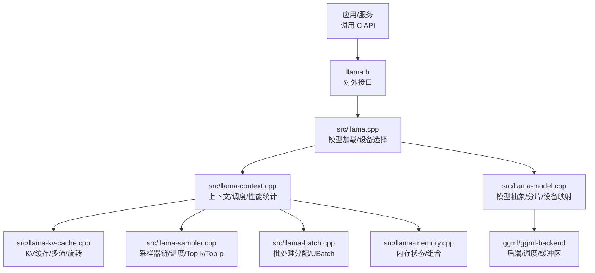
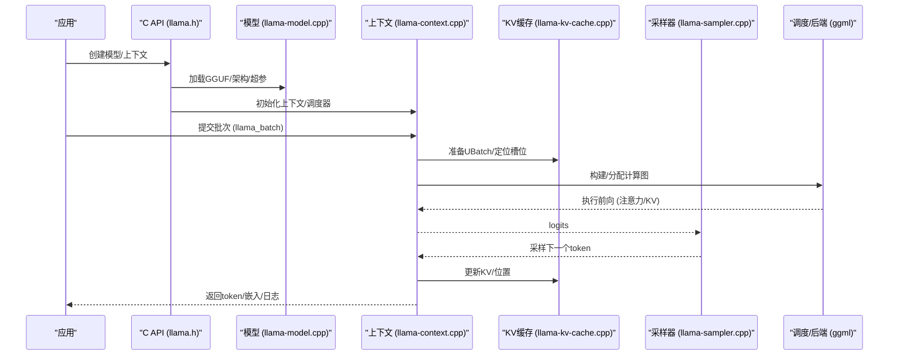
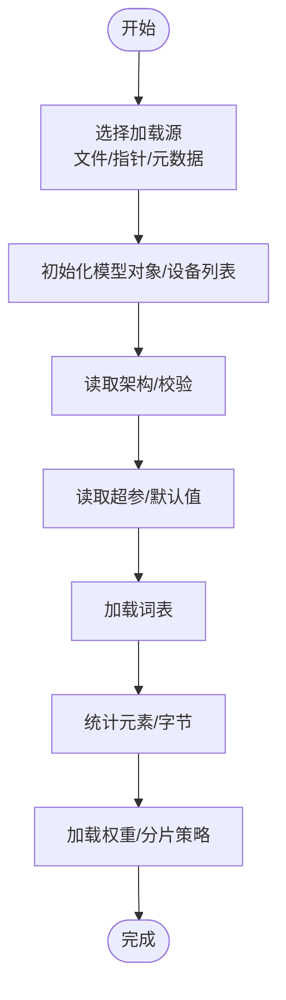
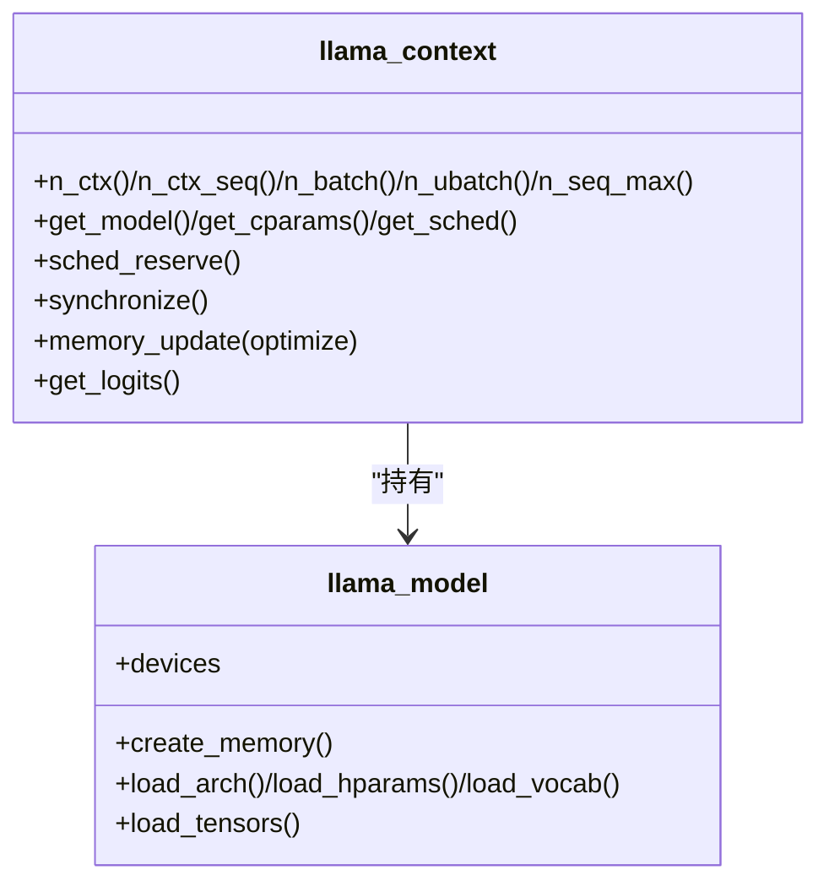
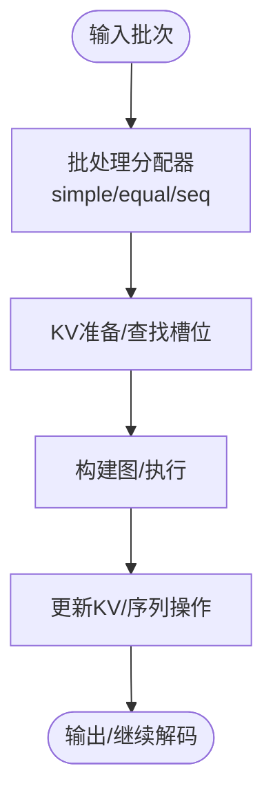
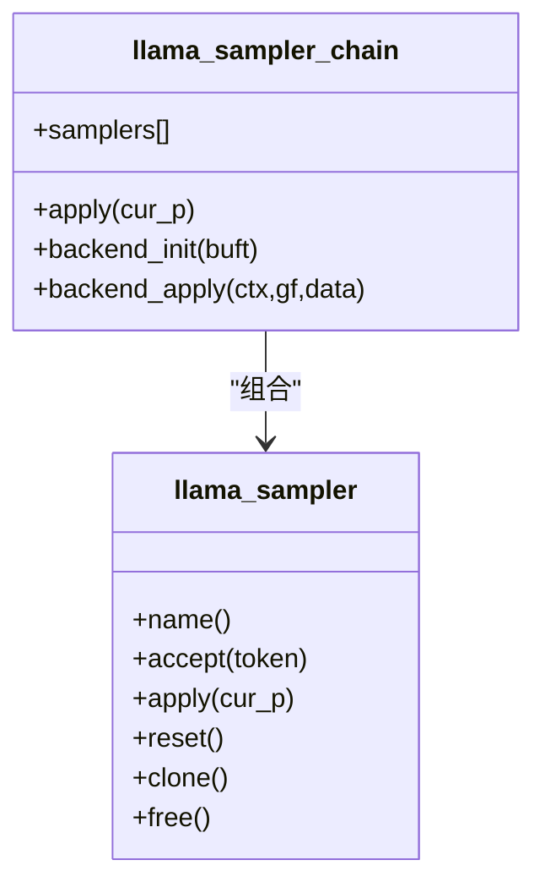
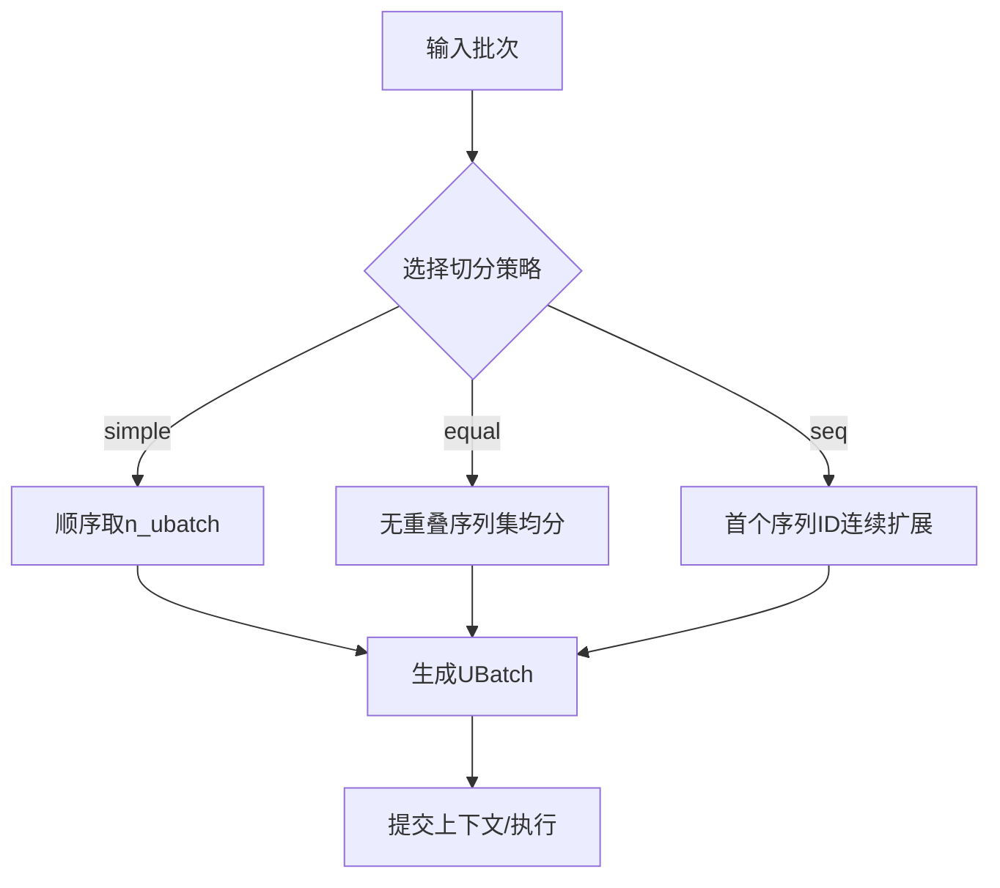
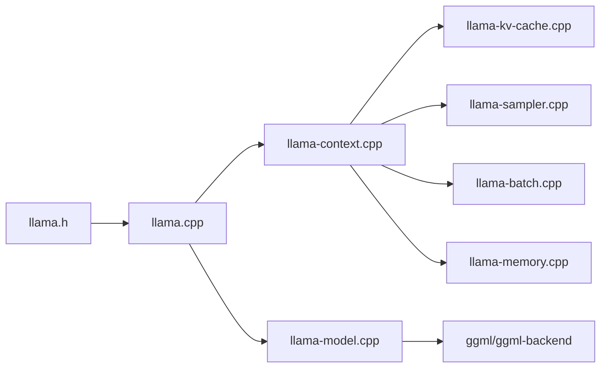

# 推理引擎详解

<cite>
**本文引用的文件**
- [llama.cpp](file://src/llama.cpp)
- [llama-context.cpp](file://src/llama-context.cpp)
- [llama-kv-cache.cpp](file://src/llama-kv-cache.cpp)
- [llama-sampler.cpp](file://src/llama-sampler.cpp)
- [llama-model.cpp](file://src/llama-model.cpp)
- [llama-batch.cpp](file://src/llama-batch.cpp)
- [llama-memory.cpp](file://src/llama-memory.cpp)
- [llama-impl.h](file://src/llama-impl.h)
- [llama.h](file://include/llama.h)
</cite>

## 目录
1. [引言](#引言)
2. [项目结构](#项目结构)
3. [核心组件](#核心组件)
4. [架构总览](#架构总览)
5. [详细组件分析](#详细组件分析)
6. [依赖关系分析](#依赖关系分析)
7. [性能考量](#性能考量)
8. [故障排查指南](#故障排查指南)
9. [结论](#结论)
10. [附录](#附录)

## 引言
本文件面向希望深入理解 llama.cpp 推理引擎的工程师与研究者，系统解析其架构设计、核心推理流程（前向传播、注意力机制、位置编码、输出生成）、模型加载与 GGUF 解析、上下文与 KV 缓存管理、采样器实现与批处理并行优化，并提供性能调优与内存优化建议。文档以代码为依据，辅以图示帮助读者建立从高层到代码级的完整认知。

## 项目结构
llama.cpp 采用分层模块化组织：上层通过 C 接口暴露能力；中层封装模型、上下文、KV 缓存、采样器与批处理；底层基于 ggml 后端调度与张量计算。关键目录与职责概览：
- include：对外公开的 C API 头文件，定义模型、上下文、采样器、批处理等接口与参数结构。
- src：核心实现，包含模型加载、上下文初始化、KV 缓存、采样器链、批处理分配器、内存管理、模型抽象等。
- ggml 及 ggml-backend：通用张量库与后端调度框架，负责设备选择、算子执行、内存缓冲区管理与图构建。
- examples/tests/docs：示例、测试与文档，便于验证与学习。

**图表来源**
- [llama.h:434-518](file://include/llama.h#L434-L518)
- [llama.cpp:114-169](file://src/llama.cpp#L114-L169)
- [llama-context.cpp:24-86](file://src/llama-context.cpp#L24-L86)
- [llama-kv-cache.cpp:79-131](file://src/llama-kv-cache.cpp#L79-L131)
- [llama-sampler.cpp:624-790](file://src/llama-sampler.cpp#L624-L790)
- [llama-batch.cpp:12-31](file://src/llama-batch.cpp#L12-L31)
- [llama-memory.cpp:1-60](file://src/llama-memory.cpp#L1-L60)
- [llama-model.cpp:646-683](file://src/llama-model.cpp#L646-L683)

**章节来源**
- [llama.h:434-518](file://include/llama.h#L434-L518)
- [llama.cpp:114-169](file://src/llama.cpp#L114-L169)
- [llama-context.cpp:24-86](file://src/llama-context.cpp#L24-L86)
- [llama-kv-cache.cpp:79-131](file://src/llama-kv-cache.cpp#L79-L131)
- [llama-sampler.cpp:624-790](file://src/llama-sampler.cpp#L624-L790)
- [llama-batch.cpp:12-31](file://src/llama-batch.cpp#L12-L31)
- [llama-memory.cpp:1-60](file://src/llama-memory.cpp#L1-L60)
- [llama-model.cpp:646-683](file://src/llama-model.cpp#L646-L683)

## 核心组件
- 模型与上下文
  - 模型层负责架构识别、超参解析、权重加载与设备/缓冲区类型选择；上下文层负责后端初始化、调度器创建、KV 缓存与采样器初始化、性能计时与统计。
- KV 缓存
  - 支持统一/分离缓冲、按序列/按流管理、可选量化、注意力旋转（Hadamard）与跨流复制/位移（K-shift）。
- 采样器
  - 提供链式采样器，支持温度缩放、Top-k、Top-p、最小概率、XTC、Mirostat 等策略，并可后端加速。
- 批处理与并行
  - 批处理分配器支持简单/等长/按序三种切分策略，自动推导位置、序列集与输出标记，保证连续性与耦合约束。
- 内存管理
  - 统一的状态组合与失败判定，支持动态更新与重置。

**章节来源**
- [llama-model.cpp:646-683](file://src/llama-model.cpp#L646-L683)
- [llama-context.cpp:24-86](file://src/llama-context.cpp#L24-L86)
- [llama-kv-cache.cpp:79-131](file://src/llama-kv-cache.cpp#L79-L131)
- [llama-sampler.cpp:624-790](file://src/llama-sampler.cpp#L624-L790)
- [llama-batch.cpp:12-31](file://src/llama-batch.cpp#L12-L31)
- [llama-memory.cpp:1-60](file://src/llama-memory.cpp#L1-L60)

## 架构总览
llama.cpp 的推理路径自上而下：应用通过 C API 创建模型与上下文，上下文根据设备与后端初始化调度器，随后在每次解码中构建计算图，经由 KV 缓存与注意力计算得到 logits，再由采样器链生成下一个 token，最终写回上下文与 KV 缓存。

**图表来源**
- [llama.h:474-518](file://include/llama.h#L474-L518)
- [llama-model.cpp:696-728](file://src/llama-model.cpp#L696-L728)
- [llama-context.cpp:389-467](file://src/llama-context.cpp#L389-L467)
- [llama-kv-cache.cpp:626-661](file://src/llama-kv-cache.cpp#L626-L661)
- [llama-sampler.cpp:642-662](file://src/llama-sampler.cpp#L642-L662)

## 详细组件分析

### 模型加载与 GGUF 解析
- 加载入口
  - 通过文件/指针/元数据三类源之一加载，打印进度回调，选择设备与分片模式，初始化模型对象与设备列表。
- 超参与架构
  - 从 GGUF 中读取上下文长度、嵌入维度、层数、注意力头数、FFN 尺寸、RoPE 类型与缩放参数等；对特定架构（如 Qwen3/3.5）进行特殊分片段与粒度计算。
- 权重加载与设备映射
  - 基于元设备（Meta Device）与 split 轴策略，将张量按轴拆分到多个设备，支持镜像/部分/按头比例等不同模式；记录每层张量所在设备以便后续调度。
- 分片策略
  - 针对 Q/K/V/FFN/输出等张量类别，计算分片段与粒度，确保块大小对齐与均匀分配；支持旋转补偿以避免舍入偏差导致的不均衡。

**图表来源**
- [llama.cpp:114-169](file://src/llama.cpp#L114-L169)
- [llama.cpp:171-382](file://src/llama.cpp#L171-L382)
- [llama-model.cpp:696-728](file://src/llama-model.cpp#L696-L728)
- [llama-model.cpp:207-381](file://src/llama-model.cpp#L207-L381)

**章节来源**
- [llama.cpp:114-169](file://src/llama.cpp#L114-L169)
- [llama.cpp:171-382](file://src/llama.cpp#L171-L382)
- [llama-model.cpp:696-728](file://src/llama-model.cpp#L696-L728)
- [llama-model.cpp:207-381](file://src/llama-model.cpp#L207-L381)

### 上下文初始化与调度
- 参数与约束
  - n_ctx/n_ctx_seq/n_batch/n_ubatch/n_seq_max 等参数在构造时确定，考虑因果注意力、KV 统一/分离、Flash Attention 自动检测与融合算子支持探测。
- 后端与缓冲区
  - 枚举 CPU/GPU/IGPU/ACCEL 设备，选择合适的缓冲区类型（含主机缓冲），并为每个后端维护缓冲区大小期望值用于调试与对齐。
- 调度预留
  - 预留最坏情况图节点与分片数，支持 PP/TG 两阶段预留与二次确认，避免运行期重新分配；若启用流水线并行需设备具备异步与事件能力。
- 性能统计
  - 记录首次评估时间、累计评估耗时、批评估耗时与令牌数，支持同步点以合并统计。

**图表来源**
- [llama-context.cpp:24-86](file://src/llama-context.cpp#L24-L86)
- [llama-context.cpp:389-630](file://src/llama-context.cpp#L389-L630)
- [llama-model.cpp:646-683](file://src/llama-model.cpp#L646-L683)

**章节来源**
- [llama-context.cpp:24-86](file://src/llama-context.cpp#L24-L86)
- [llama-context.cpp:389-630](file://src/llama-context.cpp#L389-L630)
- [llama-model.cpp:646-683](file://src/llama-model.cpp#L646-L683)

### KV 缓存与上下文管理
- 结构与布局
  - 按层维护 K/V 张量，支持统一/分离缓冲、可选转置 V、量化类型与注意力旋转（Hadamard）；支持多流（按序列或统一流）以提升并发。
- 槽位分配与更新
  - 批处理分配器将输入映射为 UBatch，KV 缓存据此在各流中寻找可用槽位并应用 UBatches；支持跨流复制（stream copy）与 K-shift。
- 序列操作
  - 支持删除/复制/保留/位移/整除等序列操作，配合 SWA 与可变头尺寸场景；提供最小/最大位置查询与内存占用分解。
- 注意力旋转
  - 对量化且维度满足条件的 K/V 启用旋转，预生成哈达玛矩阵以减少传输开销。

**图表来源**
- [llama-batch.cpp:474-611](file://src/llama-batch.cpp#L474-L611)
- [llama-kv-cache.cpp:626-661](file://src/llama-kv-cache.cpp#L626-L661)
- [llama-kv-cache.cpp:741-800](file://src/llama-kv-cache.cpp#L741-L800)

**章节来源**
- [llama-batch.cpp:12-31](file://src/llama-batch.cpp#L12-L31)
- [llama-batch.cpp:474-611](file://src/llama-batch.cpp#L474-L611)
- [llama-kv-cache.cpp:79-131](file://src/llama-kv-cache.cpp#L79-L131)
- [llama-kv-cache.cpp:626-661](file://src/llama-kv-cache.cpp#L626-L661)
- [llama-kv-cache.cpp:741-800](file://src/llama-kv-cache.cpp#L741-L800)

### 采样器实现与策略
- 采样器链
  - 支持多序列独立采样器链，链内按顺序应用各采样器；支持后端加速（仅当后端支持所需算子）。
- 核心策略
  - 温度缩放、Top-k、Top-p、最小概率、XTC、Mirostat 等；提供环形缓冲与桶排序优化的局部排序。
- 后端支持探测
  - 在给定缓冲区类型下构建最小图，检查所有算子是否被后端支持，决定是否启用后端执行。

**图表来源**
- [llama-sampler.cpp:351-426](file://src/llama-sampler.cpp#L351-L426)
- [llama-sampler.cpp:624-790](file://src/llama-sampler.cpp#L624-L790)
- [llama-sampler.cpp:558-622](file://src/llama-sampler.cpp#L558-L622)

**章节来源**
- [llama-sampler.cpp:250-387](file://src/llama-sampler.cpp#L250-L387)
- [llama-sampler.cpp:624-790](file://src/llama-sampler.cpp#L624-L790)
- [llama-sampler.cpp:558-622](file://src/llama-sampler.cpp#L558-L622)

### 批处理机制与并行推理
- 输入规范
  - 支持 token 或嵌入两种输入；自动补齐缺失字段（位置、序列ID、输出标记）；校验序列连续性与耦合一致性。
- 切分策略
  - simple：按顺序取连续 token；
  - equal：按“无重叠序列集”尽可能均分；
  - seq：按首个序列ID连续扩展。
- 输出与位置
  - 支持仅输出最后 token 或全部 token；M-RoPE 下允许位置跳跃但需满足约束。

**图表来源**
- [llama-batch.cpp:474-611](file://src/llama-batch.cpp#L474-L611)
- [llama-batch.cpp:25-89](file://src/llama-batch.cpp#L25-L89)

**章节来源**
- [llama-batch.cpp:25-89](file://src/llama-batch.cpp#L25-L89)
- [llama-batch.cpp:474-611](file://src/llama-batch.cpp#L474-L611)

### 位置编码与注意力机制
- RoPE 类型与缩放
  - 支持常规/NEOX/M-RoPE/I-MRoPE/Vision 等类型；YaRN/LongRoPE 等缩放类型与频率基/缩放因子配置。
- 注意力旋转
  - 对量化 K/V 且维度满足条件时启用哈达玛旋转，减少精度损失；可强制禁用。
- Flash Attention 自动检测
  - 上下文在自动模式下探测 FA 张量所在设备与层设备是否一致，不一致则回退关闭。

**章节来源**
- [llama-context.cpp:87-158](file://src/llama-context.cpp#L87-L158)
- [llama-kv-cache.cpp:283-327](file://src/llama-kv-cache.cpp#L283-L327)
- [llama-context.cpp:429-467](file://src/llama-context.cpp#L429-L467)

### 输出生成与日志
- 日志与嵌入
  - 可选择返回 logits 或嵌入；输出标记决定哪些 token 的结果需要返回。
- 性能计时
  - 首次评估后修正加载耗时；累计单令牌与批量评估耗时与次数。

**章节来源**
- [llama-batch.cpp:120-146](file://src/llama-batch.cpp#L120-L146)
- [llama-context.cpp:632-664](file://src/llama-context.cpp#L632-L664)

## 依赖关系分析
- 组件耦合
  - 上下文持有模型与后端调度器；KV 缓存依赖上下文与批处理分配器；采样器链依赖上下文与词汇表；模型层负责设备映射与分片。
- 外部依赖
  - ggml 与 ggml-backend 提供张量、算子、后端注册、设备/缓冲区类型、调度器与图构建；C API 作为唯一对外接口。
- 循环依赖
  - 未见直接循环；模块间通过接口与指针传递，遵循单向依赖。

**图表来源**
- [llama.h:434-518](file://include/llama.h#L434-L518)
- [llama.cpp:114-169](file://src/llama.cpp#L114-L169)
- [llama-context.cpp:24-86](file://src/llama-context.cpp#L24-L86)
- [llama-kv-cache.cpp:79-131](file://src/llama-kv-cache.cpp#L79-L131)
- [llama-sampler.cpp:624-790](file://src/llama-sampler.cpp#L624-L790)
- [llama-batch.cpp:12-31](file://src/llama-batch.cpp#L12-L31)
- [llama-memory.cpp:1-60](file://src/llama-memory.cpp#L1-L60)
- [llama-model.cpp:646-683](file://src/llama-model.cpp#L646-L683)

**章节来源**
- [llama.h:434-518](file://include/llama.h#L434-L518)
- [llama.cpp:114-169](file://src/llama.cpp#L114-L169)
- [llama-context.cpp:24-86](file://src/llama-context.cpp#L24-L86)
- [llama-kv-cache.cpp:79-131](file://src/llama-kv-cache.cpp#L79-L131)
- [llama-sampler.cpp:624-790](file://src/llama-sampler.cpp#L624-L790)
- [llama-batch.cpp:12-31](file://src/llama-batch.cpp#L12-L31)
- [llama-memory.cpp:1-60](file://src/llama-memory.cpp#L1-L60)
- [llama-model.cpp:646-683](file://src/llama-model.cpp#L646-L683)

## 性能考量
- 设备与后端
  - 优先使用 GPU/IGPU，若无可用设备则回退 CPU；RPC 服务器优先级更高以减少网络传输。
- 分片与流水线
  - 层分片（split_mode=LAYER/TENSOR）与行分片（ROW）结合，Meta Device 自动分配；流水线并行需设备支持异步与事件。
- Flash Attention 与融合算子
  - 自动探测 FA 与融合 Gated Delta Net 支持，不匹配时自动降级；注意 KV 量化与 FA 兼容性。
- 批处理与内存
  - 合理设置 n_batch/n_ubatch/n_seq_max；等长切分（equal）在多序列场景更均衡；避免频繁重分配。
- KV 缓存优化
  - 统一缓冲（kv_unified）适合共享前缀场景；量化 K/V 与注意力旋转可降低显存；SWA 与可变头尺寸需注意填充与对齐。
- 采样器后端
  - 仅在后端支持所需算子时启用后端采样，避免额外图构建成本。

**章节来源**
- [llama.cpp:222-357](file://src/llama.cpp#L222-L357)
- [llama-context.cpp:314-356](file://src/llama-context.cpp#L314-L356)
- [llama-context.cpp:429-549](file://src/llama-context.cpp#L429-L549)
- [llama-batch.cpp:508-611](file://src/llama-batch.cpp#L508-L611)
- [llama-kv-cache.cpp:153-327](file://src/llama-kv-cache.cpp#L153-L327)
- [llama-sampler.cpp:558-622](file://src/llama-sampler.cpp#L558-L622)

## 故障排查指南
- 模型加载失败
  - 检查加载源唯一性、后端是否加载、vocab_only 模式、取消回调返回值；查看进度回调输出。
- 设备/分片问题
  - 确认 split_mode 与设备数量匹配；Tensor 并行需架构支持；主 GPU 索引合法。
- KV 缓存异常
  - 关注序列位置连续性与耦合一致性；检查跨流复制与 K-shift 是否触发；查看内存占用分解。
- 采样器后端不支持
  - 查看后端支持探测日志；必要时禁用后端采样或更换后端。
- 性能异常
  - 检查是否启用流水线并行与融合算子；核对 n_batch/n_ubatch 设置；关注首次评估时间修正。

**章节来源**
- [llama.cpp:190-217](file://src/llama.cpp#L190-L217)
- [llama.cpp:344-357](file://src/llama.cpp#L344-L357)
- [llama-context.cpp:314-356](file://src/llama-context.cpp#L314-L356)
- [llama-kv-cache.cpp:741-800](file://src/llama-kv-cache.cpp#L741-L800)
- [llama-sampler.cpp:558-622](file://src/llama-sampler.cpp#L558-L622)

## 结论
llama.cpp 的推理引擎以清晰的分层架构与强大的后端调度为核心，围绕模型加载、上下文初始化、KV 缓存、采样器链与批处理展开，既保证了灵活性（多设备/分片/后端），也兼顾了性能（FA/融合算子/流水线）。通过合理配置参数与策略，可在不同硬件与任务场景下取得良好吞吐与延迟表现。

## 附录
- 关键宏与常量
  - 时间测量与格式化工具、日志级别、张量名前缀等辅助宏与工具函数。
- API 参考要点
  - 模型/上下文/采样器/批处理等结构体字段与默认参数，便于正确初始化与调用。

**章节来源**
- [llama-impl.h:22-76](file://src/llama-impl.h#L22-L76)
- [llama.h:434-518](file://include/llama.h#L434-L518)