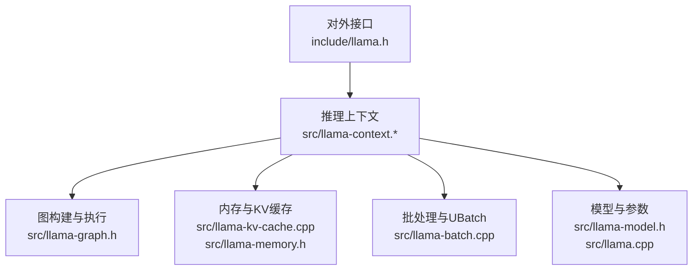
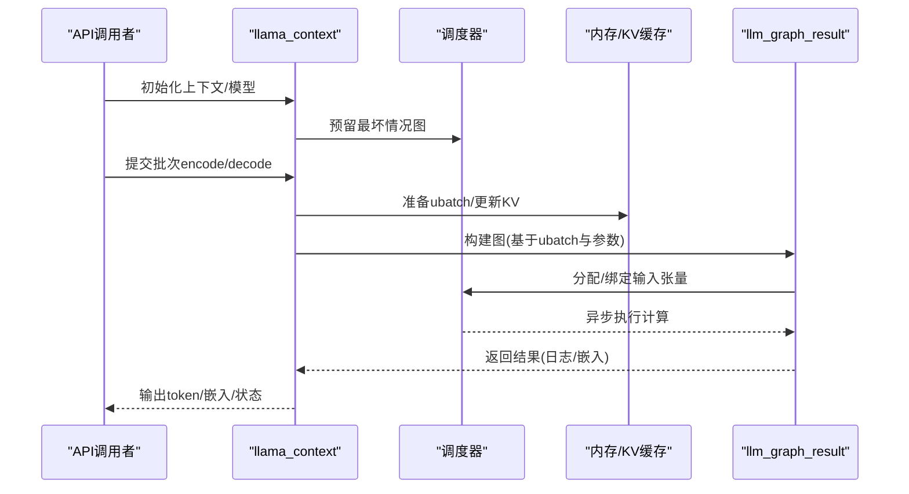
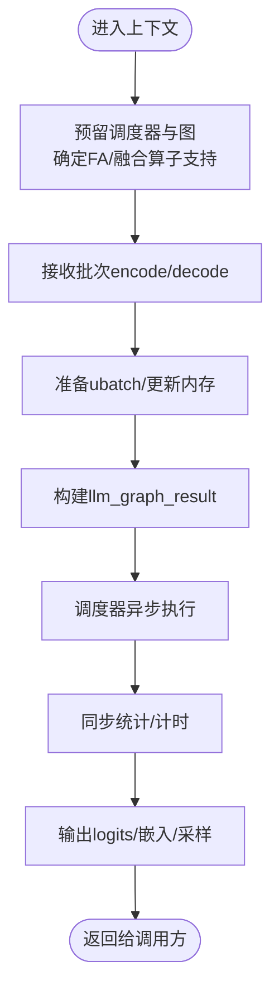
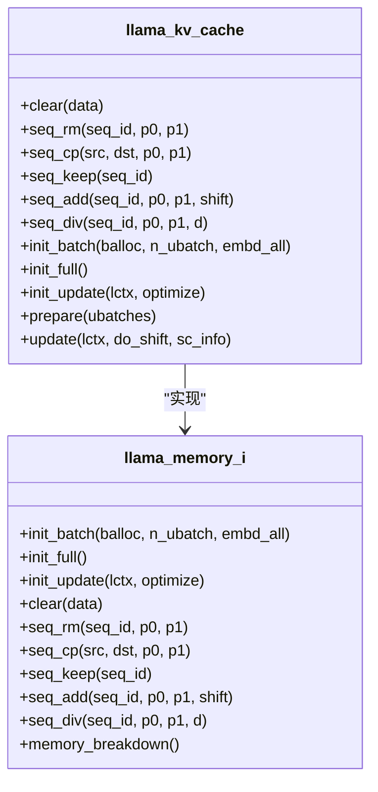
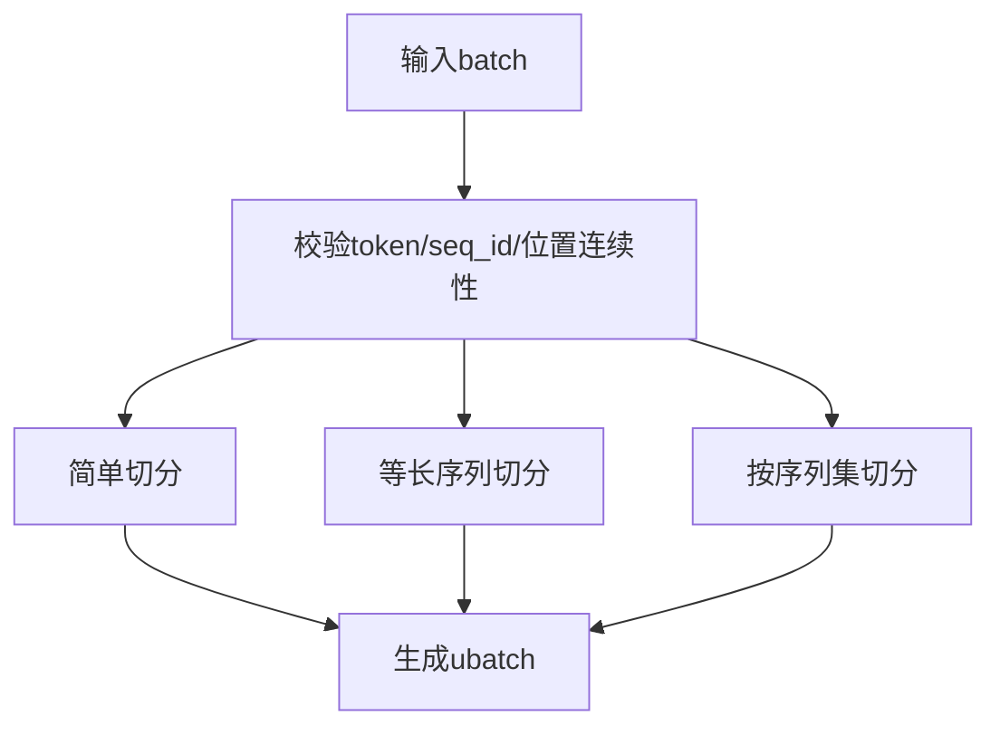
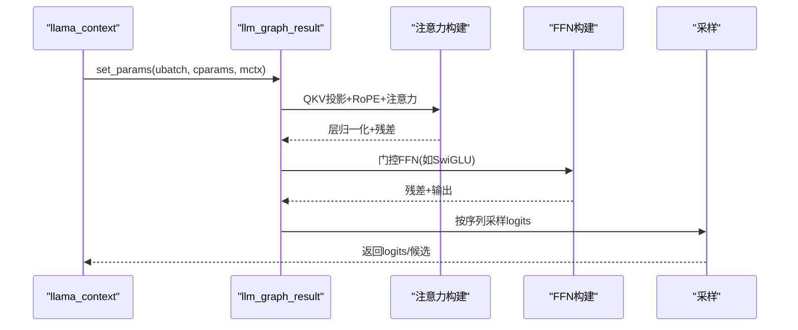
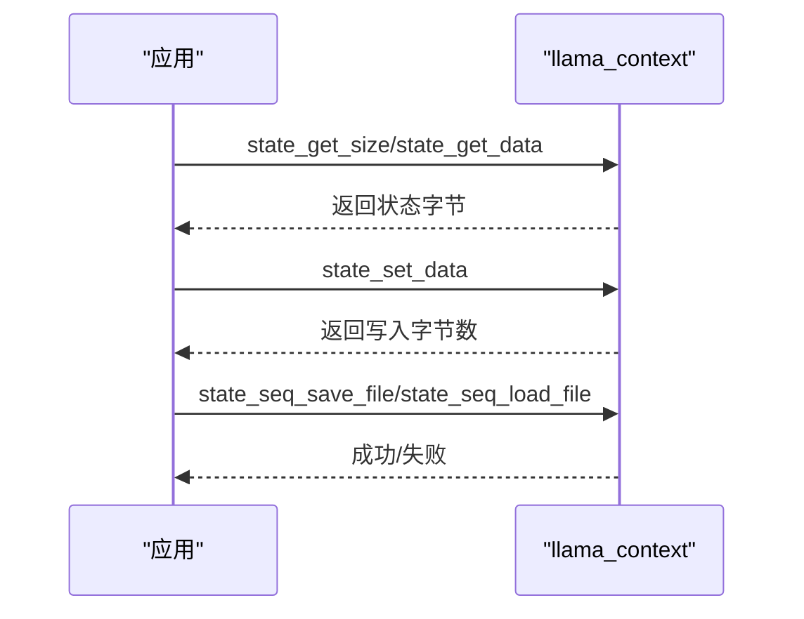
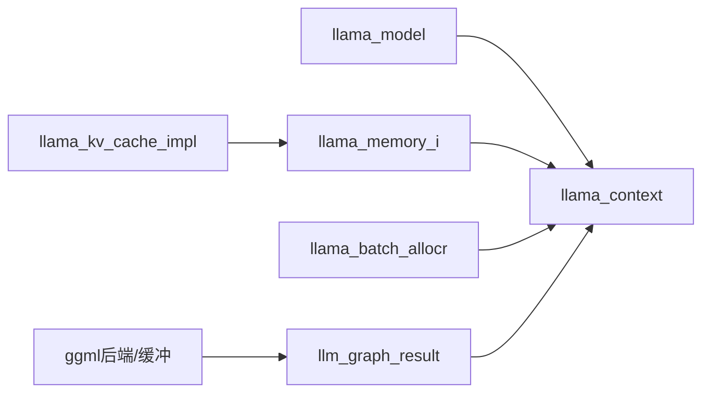

# 核心推理流程

<cite>
**本文档引用的文件**
- [llama.cpp](file://src/llama.cpp)
- [llama-context.cpp](file://src/llama-context.cpp)
- [llama-context.h](file://src/llama-context.h)
- [llama-kv-cache.cpp](file://src/llama-kv-cache.cpp)
- [llama-batch.cpp](file://src/llama-batch.cpp)
- [llama-model.h](file://src/llama-model.h)
- [llama-memory.h](file://src/llama-memory.h)
- [llama-graph.h](file://src/llama-graph.h)
- [llama.h](file://include/llama.h)
- [llama-impl.h](file://src/llama-impl.h)
</cite>

## 目录
1. [简介](#简介)
2. [项目结构](#项目结构)
3. [核心组件](#核心组件)
4. [架构总览](#架构总览)
5. [详细组件分析](#详细组件分析)
6. [依赖关系分析](#依赖关系分析)
7. [性能考虑](#性能考虑)
8. [故障排除指南](#故障排除指南)
9. [结论](#结论)

## 简介
本文件系统性解析 llama.cpp 的核心推理流程与实现机制，重点覆盖以下方面：
- 前向传播：注意力计算、位置编码（RoPE）应用、激活函数处理
- 上下文管理：KV 缓存机制、序列长度管理、内存复用
- 批处理机制：批量大小优化、并行推理、流水线处理
- 推理状态管理：会话维护、状态保存与恢复
- 性能调优：内存使用优化与计算效率提升

## 项目结构
llama.cpp 采用分层模块化设计：
- 接口层：对外暴露 C API（include/llama.h）
- 上下文与调度层：推理上下文、图构建与执行（src/llama-context.*、src/llama-graph.h）
- 模型与参数层：模型加载、超参与硬件后端选择（src/llama-model.h、src/llama.cpp）
- 内存与缓存层：KV 缓存、混合内存、递归记忆等（src/llama-kv-cache.cpp、src/llama-memory.h）
- 批处理与输入管理：批切分、位置与序列一致性校验（src/llama-batch.cpp）

**图表来源**
- [llama.h](file://include/llama.h)
- [llama-context.cpp](file://src/llama-context.cpp)
- [llama-graph.h](file://src/llama-graph.h)
- [llama-kv-cache.cpp](file://src/llama-kv-cache.cpp)
- [llama-batch.cpp](file://src/llama-batch.cpp)
- [llama-model.h](file://src/llama-model.h)
- [llama.cpp](file://src/llama.cpp)

**章节来源**
- [llama.h:1-800](file://include/llama.h#L1-L800)
- [llama.cpp:1-559](file://src/llama.cpp#L1-L559)

## 核心组件
- llama_context：推理上下文，负责调度器初始化、图预留、输出缓冲、采样器配置、状态保存/加载、性能统计等
- llama_model：模型抽象，包含架构、词表、权重张量、设备分配与内存预算
- llama_memory_i：内存抽象接口，支持 KV 缓存、iSWA、混合内存等策略
- llama_kv_cache：KV 缓存实现，支持跨序列流、旋转矩阵、量化类型、离线/在线切换
- llama_batch_allocr：批处理切分器，负责将输入 batch 切分为 ubatch，并进行序列连续性与耦合性校验
- llm_graph_*：图输入/输出与结果封装，统一注意力、FFN、归一化、采样等构建流程

**章节来源**
- [llama-context.h:26-350](file://src/llama-context.h#L26-L350)
- [llama-model.h:512-641](file://src/llama-model.h#L512-L641)
- [llama-memory.h:68-123](file://src/llama-memory.h#L68-L123)
- [llama-kv-cache.cpp:79-327](file://src/llama-kv-cache.cpp#L79-L327)
- [llama-batch.cpp:25-389](file://src/llama-batch.cpp#L25-L389)
- [llama-graph.h:519-703](file://src/llama-graph.h#L519-L703)

## 架构总览
llama.cpp 的推理路径从 C API 入口进入，经由上下文初始化与图预留，随后在每个推理步中根据 ubatch 构建图并执行，期间通过内存模块协调 KV 缓存与状态更新。

**图表来源**
- [llama-context.cpp:389-630](file://src/llama-context.cpp#L389-L630)
- [llama-graph.h:637-703](file://src/llama-graph.h#L637-L703)
- [llama-kv-cache.cpp:626-673](file://src/llama-kv-cache.cpp#L626-L673)

## 详细组件分析

### 推理上下文与调度
- 调度器预留：根据最大 token 数、序列数、输出数预留最坏情况图节点与分割数，自动检测 Flash Attention 与融合算子支持
- 同步与计时：在单 token 与批量评估之间区分统计，首次评估后修正加载耗时
- 输出缓冲：按需保留输出缓冲区，支持 logits 与嵌入的重排映射
- 状态保存/恢复：提供完整状态与序列级状态的序列化/反序列化接口

**图表来源**
- [llama-context.cpp:389-630](file://src/llama-context.cpp#L389-L630)
- [llama-context.h:109-224](file://src/llama-context.h#L109-L224)

**章节来源**
- [llama-context.cpp:389-630](file://src/llama-context.cpp#L389-L630)
- [llama-context.h:109-224](file://src/llama-context.h#L109-L224)

### KV 缓存与上下文管理
- KV 结构：按层为单位创建 K/V 张量，支持多流（多序列）共享或独立缓冲；可选量化类型与旋转矩阵（Hadamard）以适配量化注意力
- 位置编码：支持常规 RoPE、NEOX/RoFormer 变体、M-RoPE、长上下文 YaRN 等
- 序列操作：删除、复制、保留、相对位移、整除缩放；支持跨流数据拷贝与头部回退
- 更新与迁移：支持 K 移位（K-shift）、跨流拷贝、内存更新后的图重置与重新分配

**图表来源**
- [llama-kv-cache.cpp:79-327](file://src/llama-kv-cache.cpp#L79-L327)
- [llama-memory.h:68-123](file://src/llama-memory.h#L68-L123)

**章节来源**
- [llama-kv-cache.cpp:79-327](file://src/llama-kv-cache.cpp#L79-L327)
- [llama-memory.h:68-123](file://src/llama-memory.h#L68-L123)

### 批处理与UBatch切分
- 输入校验：token 与 seq_id 范围检查、位置连续性（M-RoPE 特殊规则）、耦合序列一致性
- 切分策略：简单切分（顺序）、等长序列切分（equal_seqs）、按序列集切分（seq），支持顺序约束与输出映射
- UBatch 组织：token/embd/pos/seq_id/unq/idx/output 等字段的紧凑布局，便于图构建与内存复用

**图表来源**
- [llama-batch.cpp:25-389](file://src/llama-batch.cpp#L25-L389)

**章节来源**
- [llama-batch.cpp:25-389](file://src/llama-batch.cpp#L25-L389)

### 图构建与前向传播
- 图类型：默认、编码器、解码器三类，支持交叉注意力与池化输出
- 注意力构建：Q/K/V 投影、RoPE 旋转、注意力分数计算、softmax、加权 V、输出投影；支持 Flash Attention 自动检测与禁用
- FFN 构建：SwiGLU/Gated/REGLU/GEGLU 等门控变体，支持并行/串行门控路径
- 归一化与激活：LayerNorm/RMSNorm/GroupNorm，激活函数（Silu/GELU/ReLU 等）
- 采样与输出：按序列采样 logits，生成候选 token 与概率

**图表来源**
- [llama-graph.h:717-800](file://src/llama-graph.h#L717-L800)
- [llama-context.cpp:212-224](file://src/llama-context.cpp#L212-L224)

**章节来源**
- [llama-graph.h:31-800](file://src/llama-graph.h#L31-L800)
- [llama-context.cpp:212-224](file://src/llama-context.cpp#L212-L224)

### 推理状态管理与会话
- 完整状态：包含 logits、embedding 与内存状态，支持序列化/反序列化
- 序列级状态：按 seq_id 保存/恢复 token 序列，支持部分范围操作
- 文件接口：提供 state_get_data/state_set_data 与 state_save_file/state_load_file

**图表来源**
- [llama.h:764-800](file://include/llama.h#L764-L800)
- [llama-context.h:126-157](file://src/llama-context.h#L126-L157)

**章节来源**
- [llama.h:764-800](file://include/llama.h#L764-L800)
- [llama-context.h:126-157](file://src/llama-context.h#L126-L157)

## 依赖关系分析
- llama_context 依赖 llama_model、llama_memory_i、llama_batch_allocr、llm_graph_result
- llama_memory_i 的具体实现（如 llama_kv_cache）依赖 ggml 后端与缓冲类型
- llm_graph_result 封装 ggml 计算图与输入/输出张量，通过回调函数应用后端策略

**图表来源**
- [llama-context.h:26-350](file://src/llama-context.h#L26-L350)
- [llama-model.h:512-641](file://src/llama-model.h#L512-L641)
- [llama-memory.h:68-123](file://src/llama-memory.h#L68-L123)
- [llama-graph.h:519-703](file://src/llama-graph.h#L519-L703)

**章节来源**
- [llama-context.h:26-350](file://src/llama-context.h#L26-L350)
- [llama-model.h:512-641](file://src/llama-model.h#L512-L641)
- [llama-memory.h:68-123](file://src/llama-memory.h#L68-L123)
- [llama-graph.h:519-703](file://src/llama-graph.h#L519-L703)

## 性能考虑
- Flash Attention 自动检测：在预留阶段扫描图中的注意力张量，若设备不匹配则禁用
- 融合算子：自动探测融合 Gated Delta Net 支持，减少核间通信
- 管道并行：多 GPU 场景下启用，要求设备支持异步与事件
- 内存预算：按后端缓冲类型估算计算缓冲大小，避免重复分配
- 量化与旋转：对量化注意力启用旋转矩阵（Hadamard）以提升精度
- 批处理优化：合理设置 n_batch/n_ubatch，避免过小导致频繁图重建；等长序列切分可提升吞吐

[本节为通用指导，无需特定文件引用]

## 故障排除指南
- 加载失败：检查后端是否加载、设备可用性、模型拆分路径正确性
- KV 缓存异常：确认序列位置连续性、耦合序列一致性、跨流拷贝范围
- Flash Attention 失败：查看自动检测日志，确认设备与注意力张量所在设备一致
- 内存不足：降低 n_batch/n_ubatch、关闭非必要 offload、调整类型 K/V 量化

**章节来源**
- [llama.cpp:171-382](file://src/llama.cpp#L171-L382)
- [llama-batch.cpp:255-384](file://src/llama-batch.cpp#L255-L384)
- [llama-context.cpp:429-467](file://src/llama-context.cpp#L429-L467)

## 结论
llama.cpp 通过“上下文 + 调度器 + 图构建 + 内存管理”的清晰分层，实现了高效、可扩展的推理流水线。KV 缓存与批处理切分是吞吐优化的关键，而自动化的 FA/融合算子检测与管道并行进一步提升了端到端性能。结合合理的参数配置与状态管理，可在多硬件平台上获得稳定且高性能的推理体验。