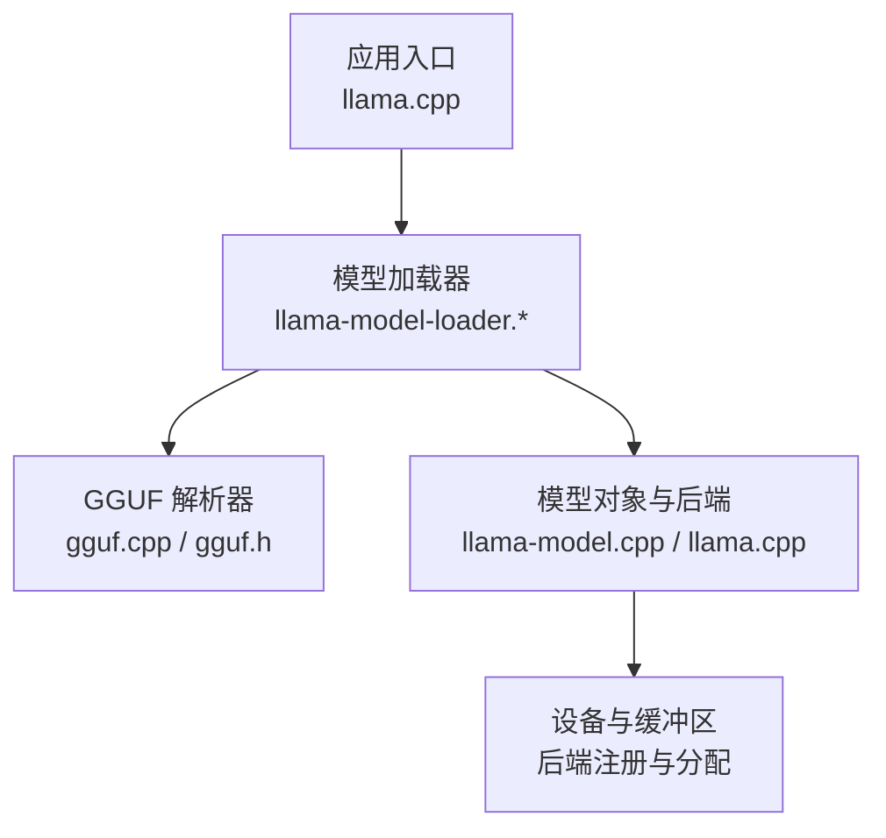
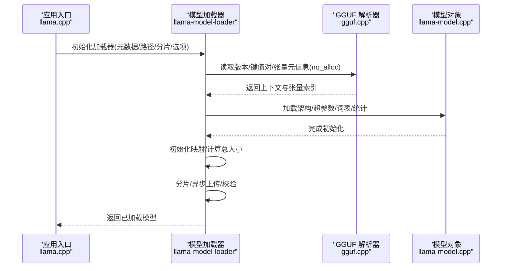
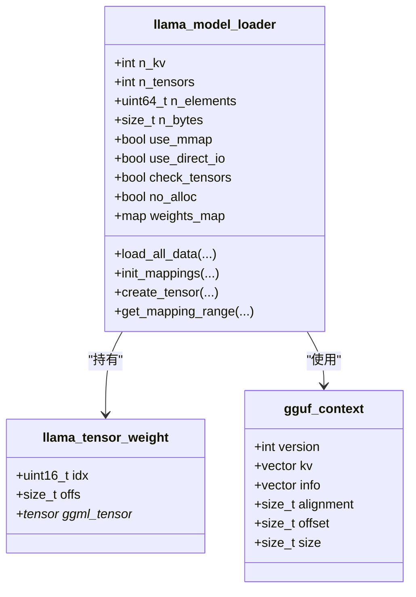
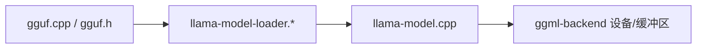

# 模型加载机制

<cite>
**本文档引用的文件**
- [src/llama-model-loader.cpp](file://src/llama-model-loader.cpp)
- [src/llama-model-loader.h](file://src/llama-model-loader.h)
- [ggml/src/gguf.cpp](file://ggml/src/gguf.cpp)
- [ggml/include/gguf.h](file://ggml/include/gguf.h)
- [src/llama.cpp](file://src/llama.cpp)
- [src/llama-model.cpp](file://src/llama-model.cpp)
- [src/llama-arch.cpp](file://src/llama-arch.cpp)
- [src/llama-hparams.cpp](file://src/llama-hparams.cpp)
- [src/llama-mmap.cpp](file://src/llama-mmap.cpp)
</cite>

## 目录
1. [简介](#简介)
2. [项目结构](#项目结构)
3. [核心组件](#核心组件)
4. [架构总览](#架构总览)
5. [详细组件分析](#详细组件分析)
6. [依赖关系分析](#依赖关系分析)
7. [性能考虑](#性能考虑)
8. [故障排除指南](#故障排除指南)
9. [结论](#结论)

## 简介
本文件深入解析 llama.cpp 的模型加载机制，重点覆盖以下方面：
- GGUF 格式解析：元数据提取、张量信息读取与权重数据加载
- 模型架构检测与验证：架构类型识别、超参数解析与兼容性检查
- 权重加载策略：内存映射（mmap）、分片加载与异步上传
- 模型初始化流程：参数校验、内存分配与后端注册
- 性能优化技巧与错误处理策略，并提供调试方法

## 项目结构
llama.cpp 将模型加载分为三层：
- 底层：GGUF 文件解析（gguf.cpp）与格式定义（gguf.h）
- 中层：模型加载器（llama-model-loader.*），负责元数据、张量索引与权重加载
- 上层：模型对象与后端设备管理（llama.cpp、llama-model.cpp），负责架构检测、参数解析与设备选择

图表来源
- [src/llama.cpp:114-169](file://src/llama.cpp#L114-L169)
- [src/llama-model-loader.cpp:510-820](file://src/llama-model-loader.cpp#L510-L820)
- [ggml/src/gguf.cpp:397-800](file://ggml/src/gguf.cpp#L397-L800)

章节来源
- [src/llama.cpp:114-169](file://src/llama.cpp#L114-L169)
- [src/llama-model-loader.cpp:510-820](file://src/llama-model-loader.cpp#L510-L820)
- [ggml/src/gguf.cpp:397-800](file://ggml/src/gguf.cpp#L397-L800)

## 核心组件
- GGUF 解析器：从文件中读取版本、键值对、张量元信息与数据偏移，支持 no_alloc 模式仅构建张量描述而不加载二进制数据
- 模型加载器：封装 GGUF 元数据访问、张量索引、权重定位、内存映射、分片加载与异步上传
- 模型对象与后端：根据架构类型加载超参数、词汇表与统计信息；选择设备与缓冲区类型；进行张量创建与数据填充

章节来源
- [ggml/include/gguf.h:72-82](file://ggml/include/gguf.h#L72-L82)
- [src/llama-model-loader.h:31-135](file://src/llama-model-loader.h#L31-L135)
- [src/llama.cpp:114-169](file://src/llama.cpp#L114-L169)

## 架构总览
模型加载主流程如下：

图表来源
- [src/llama.cpp:114-169](file://src/llama.cpp#L114-L169)
- [src/llama-model-loader.cpp:510-820](file://src/llama-model-loader.cpp#L510-L820)
- [ggml/src/gguf.cpp:397-800](file://ggml/src/gguf.cpp#L397-L800)

## 详细组件分析

### GGUF 格式解析与元数据提取
- 版本与头部校验：读取魔数与版本号，拒绝过旧或不兼容版本
- 键值对读取：遍历 KV 对，记录重复键、数组长度与类型，支持字符串、标量与数组
- 张量元信息：逐个读取张量名称、维度、类型与数据偏移，计算行步长与对齐
- 数据段对齐：按 general.alignment 对齐，累加得到数据段总大小
- no_alloc 模式：仅构建 ggml 张量描述，不加载二进制数据，便于后续按需分配

章节来源
- [ggml/src/gguf.cpp:431-735](file://ggml/src/gguf.cpp#L431-L735)
- [ggml/include/gguf.h:72-82](file://ggml/include/gguf.h#L72-L82)

### 张量信息读取与权重定位
- 张量索引：通过 gguf_find_tensor 获取张量在元数据中的索引，结合 gguf_get_tensor_offset 计算权重在文件中的绝对偏移
- 偏移边界检查：确保权重数据位于文件范围内，避免越界
- 多文件分片：为每个分片文件建立独立索引，统一合并到 weights_map，保证张量名唯一

章节来源
- [src/llama-model-loader.h:31-50](file://src/llama-model-loader.h#L31-L50)
- [src/llama-model-loader.cpp:574-650](file://src/llama-model-loader.cpp#L574-L650)

### 权重数据加载策略
- 内存映射（mmap）：优先使用 mmap 提升大模型加载性能；支持 NUMA 优化与 mlock 固定内存
- 直接 I/O（Direct I/O）：Linux 下尝试 O_DIRECT，若失败回退到标准 I/O
- 异步上传（Async Upload）：当使用非主机缓冲区且后端支持时，使用固定大小的环形主机缓冲区与事件同步，提升 GPU 传输效率
- 校验（check_tensors）：可选地对每块数据进行行数据有效性校验，保障数值稳定性

章节来源
- [src/llama-mmap.cpp:183-200](file://src/llama-mmap.cpp#L183-L200)
- [src/llama-model-loader.cpp:1326-1681](file://src/llama-model-loader.cpp#L1326-L1681)

### 模型架构检测与验证
- 架构识别：从 general.architecture 读取架构字符串，映射到内部枚举（llm_arch）
- 超参数解析：通过 LLM_KV 名称映射读取上下文长度、嵌入维度、层数等关键超参
- 兼容性检查：针对不同张量操作（如 rope、mul_mat、ssm 等）动态测试缓冲区类型是否支持对应算子

章节来源
- [src/llama-arch.cpp:9-137](file://src/llama-arch.cpp#L9-L137)
- [src/llama-hparams.cpp:1-200](file://src/llama-hparams.cpp#L1-L200)
- [src/llama-model-loader.cpp:892-1043](file://src/llama-model-loader.cpp#L892-L1043)

### 模型初始化流程
- 设备选择：自动探测 CPU/GPU/IGPU/RPC 等后端，支持单卡、多卡与元设备（Meta Device）张量并行
- 缓冲区类型选择：根据张量类型与算子需求选择合适的缓冲区类型（CPU/GPU/主机缓冲区）
- 张量创建：在对应上下文中复制张量描述，必要时创建视图（view）以复用内存
- 数据填充：通过 mmap 或文件读取填充张量数据；支持异步上传到 GPU

章节来源
- [src/llama.cpp:221-381](file://src/llama.cpp#L221-L381)
- [src/llama-model-loader.cpp:1045-1285](file://src/llama-model-loader.cpp#L1045-L1285)

### 关键类关系图

图表来源
- [src/llama-model-loader.h:31-135](file://src/llama-model-loader.h#L31-L135)
- [ggml/include/gguf.h:70-90](file://ggml/include/gguf.h#L70-L90)

## 依赖关系分析
- 模型加载器依赖 GGUF 解析器提供的元数据与张量索引
- 模型对象依赖加载器提供的张量描述与数据填充结果
- 后端系统（ggml-backend）决定缓冲区类型与设备分配策略

图表来源
- [ggml/src/gguf.cpp:397-800](file://ggml/src/gguf.cpp#L397-L800)
- [src/llama-model-loader.cpp:510-820](file://src/llama-model-loader.cpp#L510-L820)
- [src/llama-model.cpp:37-205](file://src/llama-model.cpp#L37-L205)

章节来源
- [ggml/src/gguf.cpp:397-800](file://ggml/src/gguf.cpp#L397-L800)
- [src/llama-model-loader.cpp:510-820](file://src/llama-model-loader.cpp#L510-L820)
- [src/llama-model.cpp:37-205](file://src/llama-model.cpp#L37-L205)

## 性能考虑
- 使用 mmap 降低内存占用峰值，适合大模型加载
- Direct I/O 在 Linux 下可减少内核缓存开销，但需硬件/文件系统支持
- 异步上传：在 GPU 非默认缓冲区场景下，使用固定大小环形主机缓冲区与事件同步，平衡带宽与延迟
- 缓冲区类型选择：尽量避免频繁移动张量，减少跨设备拷贝
- NUMA 优化：在多插槽系统上启用 NUMA 绑定，提升内存访问局部性

章节来源
- [src/llama-mmap.cpp:183-200](file://src/llama-mmap.cpp#L183-L200)
- [src/llama-model-loader.cpp:1413-1681](file://src/llama-model-loader.cpp#L1413-L1681)

## 故障排除指南
常见问题与排查要点：
- GGUF 版本不兼容：确认文件版本与库支持范围
- 重复键或重复张量名：GGUF 解析阶段会报错，需重新导出
- 张量形状不匹配：加载器会比对期望维度并抛出异常
- 数据越界：权重偏移超出文件范围，检查分片完整性
- 缓冲区类型不支持：针对特定算子（rope、ssm、mul_mat 等）动态测试，必要时调整张量覆盖或后端配置
- 直接 I/O 失败：自动回退到标准 I/O，检查权限与文件系统

章节来源
- [ggml/src/gguf.cpp:431-735](file://ggml/src/gguf.cpp#L431-L735)
- [src/llama-model-loader.cpp:862-890](file://src/llama-model-loader.cpp#L862-L890)
- [src/llama-model-loader.cpp:1376-1397](file://src/llama-model-loader.cpp#L1376-L1397)

## 结论
llama.cpp 的模型加载机制通过清晰的分层设计实现了高性能与高可靠性的统一：底层 GGUF 解析提供精确的元数据与张量索引；中层加载器负责权重定位、内存映射与异步上传；上层模型对象与后端系统完成架构检测、参数解析与设备分配。配合完善的错误处理与性能优化策略，能够在多种硬件环境下稳定高效地加载各类 GGUF 模型。