# 采样策略实现

<cite>
**本文档引用的文件**
- [sampling.h](file://common/sampling.h)
- [sampling.cpp](file://common/sampling.cpp)
- [llama-sampler.h](file://src/llama-sampler.h)
- [llama-sampler.cpp](file://src/llama-sampler.cpp)
- [common.h](file://common/common.h)
- [arg.cpp](file://common/arg.cpp)
- [common.cpp](file://common/common.cpp)
</cite>

## 目录
1. [简介](#简介)
2. [项目结构](#项目结构)
3. [核心组件](#核心组件)
4. [架构概览](#架构概览)
5. [详细组件分析](#详细组件分析)
6. [依赖关系分析](#依赖关系分析)
7. [性能考虑](#性能考虑)
8. [故障排除指南](#故障排除指南)
9. [结论](#结论)

## 简介

llama.cpp 的采样策略实现是一个高度模块化的系统，支持多种采样算法和策略组合。该系统通过采样器链（sampler chain）的设计，实现了灵活的采样流程控制，包括贪心采样、温度控制、核采样（Top-P/Nucleus）、顶部-K 采样、最小概率采样、典型采样、温度扩展采样等多种策略。

该实现的核心特点包括：
- **可配置的采样器链**：支持多种采样策略的组合和排序
- **数值稳定性保证**：采用最大值减法的 softmax 实现
- **性能优化**：使用桶排序和部分排序技术
- **语法约束支持**：集成语法驱动的采样约束
- **重复惩罚机制**：支持频率惩罚和存在惩罚

## 项目结构

llama.cpp 的采样系统主要分布在以下文件中：

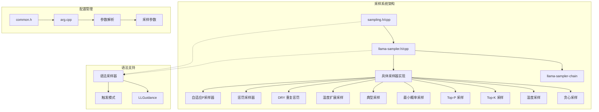

**图表来源**
- [sampling.h:1-120](file://common/sampling.h#L1-L120)
- [llama-sampler.h:1-43](file://src/llama-sampler.h#L1-L43)

**章节来源**
- [sampling.h:1-120](file://common/sampling.h#L1-L120)
- [sampling.cpp:187-412](file://common/sampling.cpp#L187-L412)
- [llama-sampler.h:12-34](file://src/llama-sampler.h#L12-L34)

## 核心组件

### 采样器链（Sampler Chain）

采样器链是整个采样系统的核心，它将多个采样器按顺序组织起来执行采样过程。

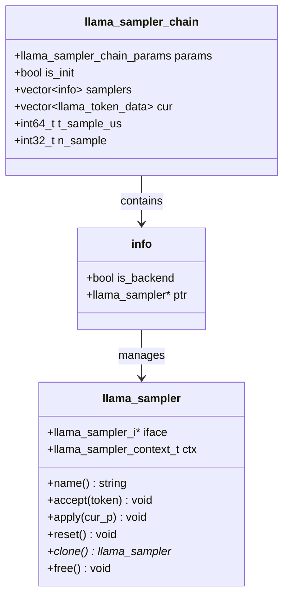

**图表来源**
- [llama-sampler.h:12-34](file://src/llama-sampler.h#L12-L34)

### 采样器接口定义

每个采样器都遵循统一的接口规范：

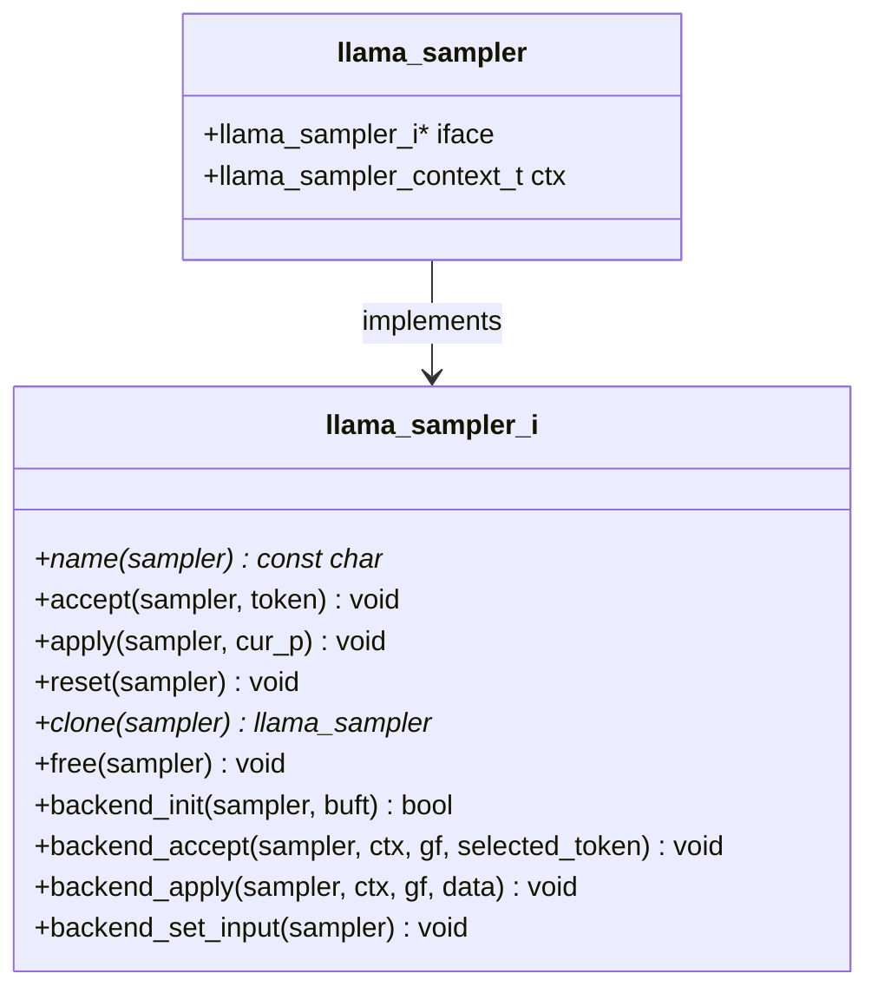

**图表来源**
- [llama-sampler.cpp:351-426](file://src/llama-sampler.cpp#L351-L426)

**章节来源**
- [llama-sampler.h:12-34](file://src/llama-sampler.h#L12-L34)
- [llama-sampler.cpp:351-426](file://src/llama-sampler.cpp#L351-L426)

## 架构概览

llama.cpp 的采样系统采用分层架构设计，从底层的采样器实现到上层的应用接口，形成了完整的采样生态系统。

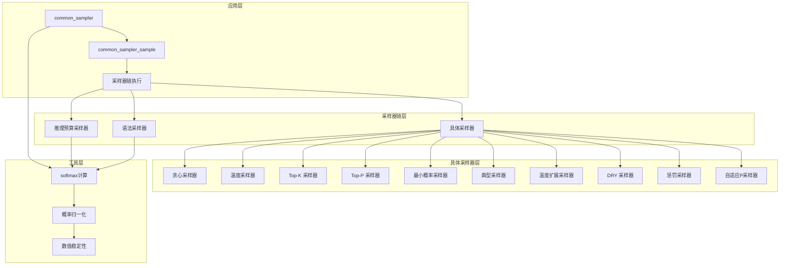

**图表来源**
- [sampling.cpp:537-617](file://common/sampling.cpp#L537-L617)
- [llama-sampler.cpp:624-792](file://src/llama-sampler.cpp#L624-L792)

## 详细组件分析

### 贪心采样器（Greedy Sampler）

贪心采样是最简单的采样策略，直接选择具有最高 logit 值的标记。

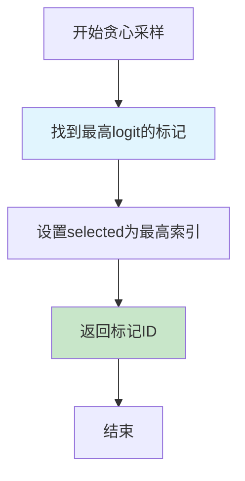

**图表来源**
- [llama-sampler.cpp:963-970](file://src/llama-sampler.cpp#L963-L970)

贪心采样的特点：
- 时间复杂度：O(n)，其中 n 是候选标记数量
- 空间复杂度：O(1)
- 确定性：每次都会产生相同的结果
- 适用场景：需要确定性输出的任务

**章节来源**
- [llama-sampler.cpp:931-1018](file://src/llama-sampler.cpp#L931-L1018)

### 温度采样器（Temperature Sampler）

温度采样通过调整 logits 来控制采样的随机性程度。

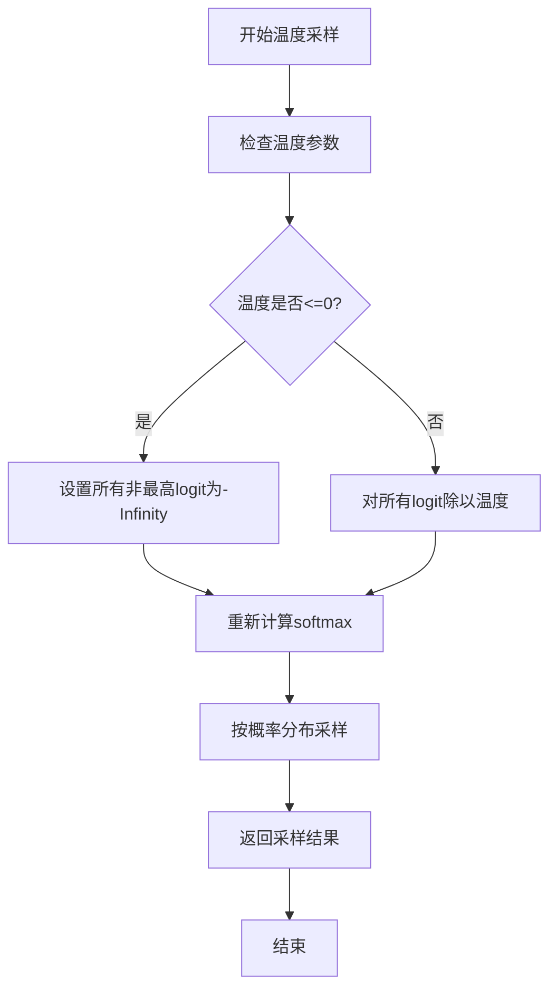

**图表来源**
- [llama-sampler.cpp:265-287](file://src/llama-sampler.cpp#L265-L287)

温度采样的数学公式：
- 对于每个 logits：logit' = logit / T
- 其中 T 为温度参数，T > 0

**章节来源**
- [llama-sampler.cpp:1798-1898](file://src/llama-sampler.cpp#L1798-L1898)

### Top-K 采样器

Top-K 采样器只保留前 K 个最高概率的标记进行采样。

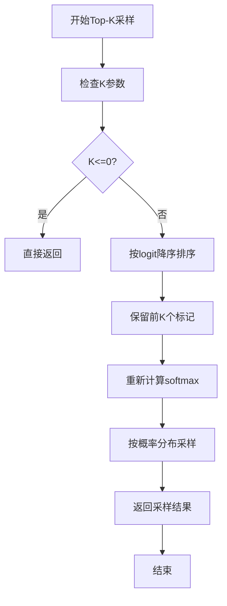

**图表来源**
- [llama-sampler.cpp:317-334](file://src/llama-sampler.cpp#L317-L334)

**章节来源**
- [llama-sampler.cpp:1246-1335](file://src/llama-sampler.cpp#L1246-L1335)

### Top-P（核）采样器

Top-P 采样器（也称为核采样）根据累积概率质量选择标记集合。

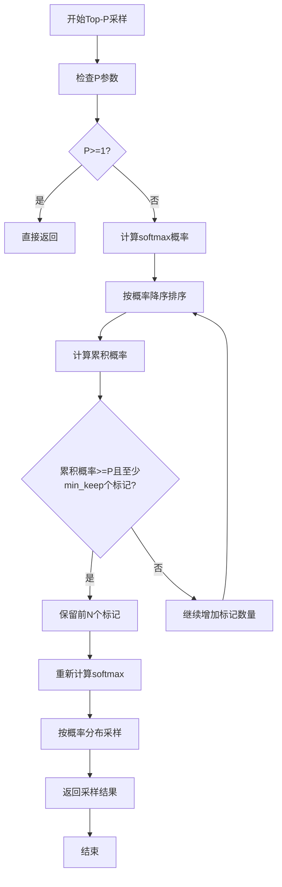

**图表来源**
- [llama-sampler.cpp:1351-1404](file://src/llama-sampler.cpp#L1351-L1404)

Top-P 采样的关键特性：
- 自适应选择标记数量
- 确保至少保留 min_keep 个标记
- 动态调整候选集大小

**章节来源**
- [llama-sampler.cpp:1337-1529](file://src/llama-sampler.cpp#L1337-L1529)

### 最小概率采样器（Min-P Sampler）

最小概率采样器基于概率阈值过滤标记，只保留满足条件的标记。

```mermaid
flowchart TD
A[开始Min-P采样] --> B[检查P参数]
B --> C{P<=0或无标记?}
C --> |是| D[直接返回]
C --> |否| E{是否已排序?}
E --> |否| F[未排序实现]
E --> |是| G[排序实现]
F --> H[计算最大logit]
H --> I[计算阈值: max_logit + log(P)]
I --> J[保留logit>=阈值的标记]
J --> K{标记数量>=min_keep?}
K --> |是| L[成功应用]
K --> |否| M[使用排序实现]
G --> N[按logit降序排序]
N --> O[计算阈值]
O --> P[逐个检查标记]
P --> Q[保留满足条件的标记]
L --> R[更新大小]
M --> R
R --> S[返回结果]
S --> T[结束]
```

**图表来源**
- [llama-sampler.cpp:1543-1595](file://src/llama-sampler.cpp#L1543-L1595)

**章节来源**
- [llama-sampler.cpp:1531-1684](file://src/llama-sampler.cpp#L1531-L1684)

### 典型采样器（Typical Sampler）

典型采样器基于概率分布的熵来选择标记，优先选择符合预期概率的标记。

```mermaid
flowchart TD
A[开始典型采样] --> B[检查P参数]
B --> C{P>=1?}
C --> |是| D[直接返回]
C --> |否| E[计算softmax概率]
E --> F[计算熵: H = -Σp*log(p)]
F --> G[计算每个标记的偏移: |log(p_i) - H|]
G --> H[按偏移升序排序]
H --> I[计算累积概率]
I --> J{累积概率>P且至少min_keep个标记?}
J --> |是| K[保留前N个标记]
J --> |否| L[继续添加标记]
K --> M[重新计算softmax]
L --> H
M --> N[按概率分布采样]
N --> O[返回采样结果]
O --> P[结束]
```

**图表来源**
- [llama-sampler.cpp:1698-1756](file://src/llama-sampler.cpp#L1698-L1756)

**章节来源**
- [llama-sampler.cpp:1687-1794](file://src/llama-sampler.cpp#L1687-L1794)

### 温度扩展采样器（Temp-Ext Sampler）

温度扩展采样器根据概率分布的熵动态调整温度参数。

```mermaid
flowchart TD
A[开始温度扩展采样] --> B[检查delta参数]
B --> C{delta>0?}
C --> |否| D[使用标准温度采样]
C --> |是| E[计算最大可能熵]
E --> F[计算实际熵]
F --> G[归一化熵: normalized_entropy = entropy/max_entropy]
G --> H[计算动态温度: dyn_temp = min_temp + (max_temp-min_temp)*pow(normalized_entropy, exponent)]
H --> I[应用动态温度缩放]
I --> J[重新计算softmax概率]
J --> K[返回结果]
D --> K
K --> L[结束]
```

**图表来源**
- [llama-sampler.cpp:1913-1982](file://src/llama-sampler.cpp#L1913-L1982)

**章节来源**
- [llama-sampler.cpp:1900-2099](file://src/llama-sampler.cpp#L1900-L2099)

### DRY 重复惩罚采样器

DRY（Discrete Repeat Yourself）采样器专门用于检测和惩罚重复序列。

```mermaid
flowchart TD
A[开始DRY采样] --> B[检查参数有效性]
B --> C{参数有效?}
C --> |否| D[直接返回]
C --> |是| E[获取最后N个标记]
E --> F[查找重启序列]
F --> G[计算重复长度限制]
G --> H[使用Z算法计算重复计数]
H --> I[找到最大重复长度]
I --> J[应用惩罚: penalty = multiplier * base^(repeat_exp)]
J --> K[更新logits]
K --> L[返回结果]
L --> M[结束]
```

**图表来源**
- [llama-sampler.cpp:2930-3136](file://src/llama-sampler.cpp#L2930-L3136)

**章节来源**
- [llama-sampler.cpp:2857-3231](file://src/llama-sampler.cpp#L2857-L3231)

### 惩罚采样器

惩罚采样器实现频率惩罚和存在惩罚功能。

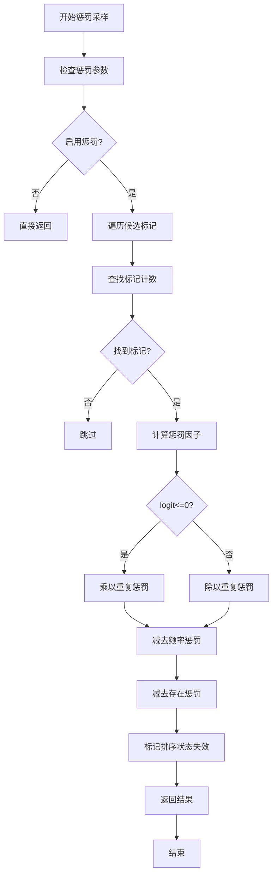

**图表来源**
- [llama-sampler.cpp:2669-2700](file://src/llama-sampler.cpp#L2669-L2700)

**章节来源**
- [llama-sampler.cpp:2620-2767](file://src/llama-sampler.cpp#L2620-L2767)

### 自适应P采样器

自适应P采样器维护一个指数移动平均来动态调整目标概率。

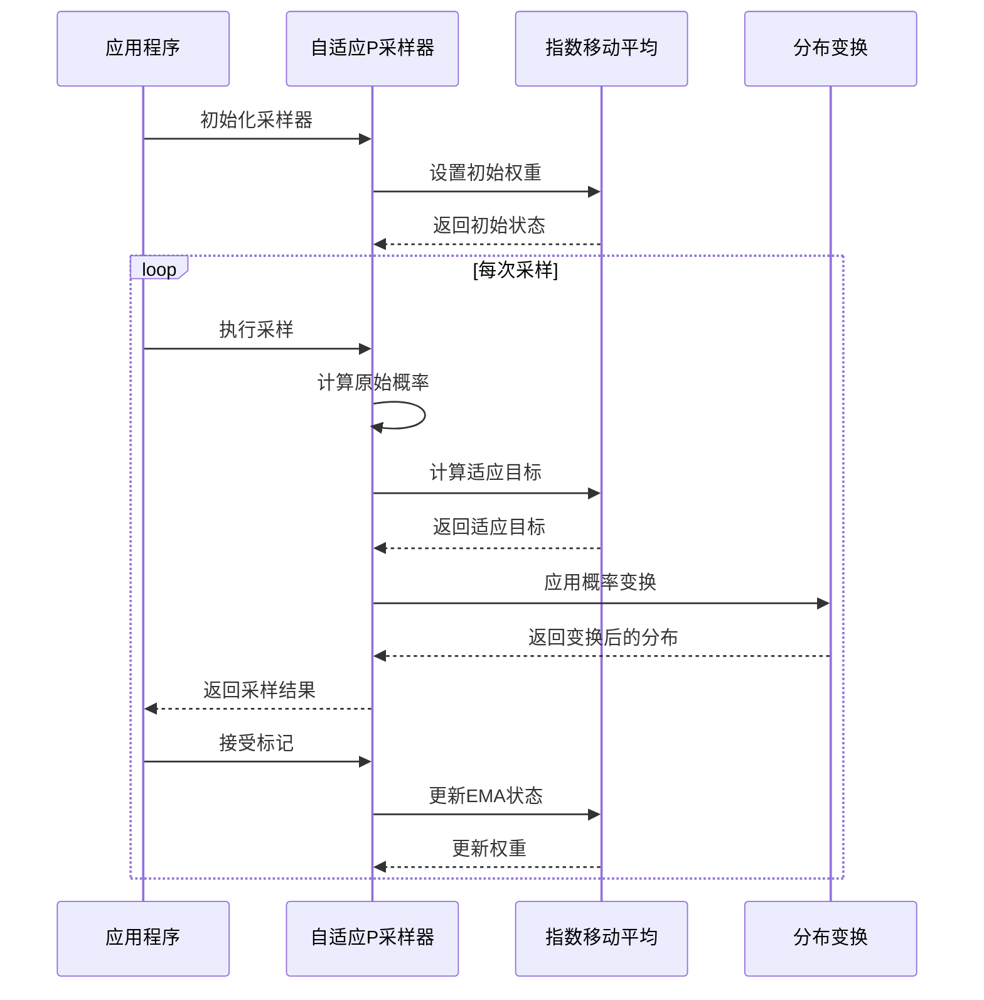

**图表来源**
- [llama-sampler.cpp:3294-3356](file://src/llama-sampler.cpp#L3294-L3356)

**章节来源**
- [llama-sampler.cpp:3262-3424](file://src/llama-sampler.cpp#L3262-L3424)

## 依赖关系分析

### 参数配置系统

llama.cpp 的采样参数通过统一的配置系统管理：

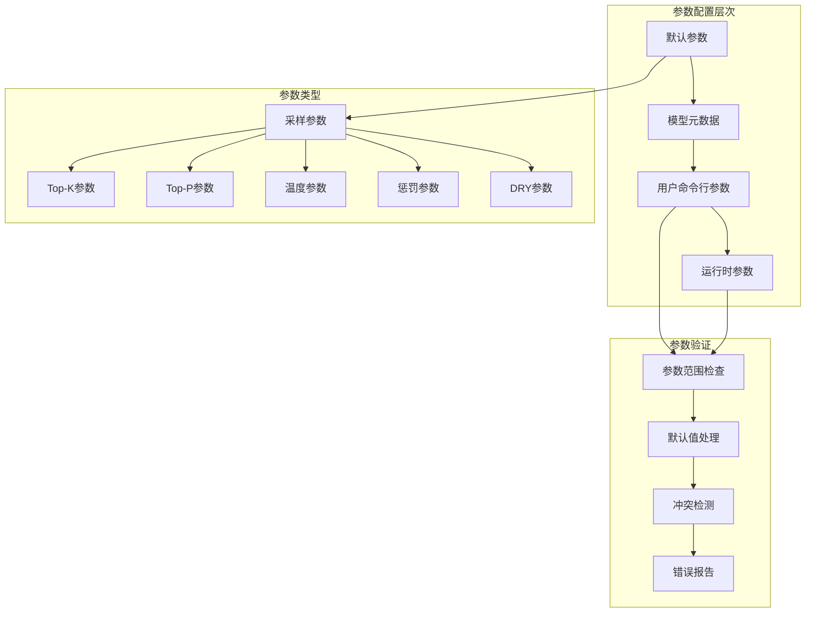

**图表来源**
- [common.h:211-227](file://common/common.h#L211-L227)
- [arg.cpp:1675-1699](file://common/arg.cpp#L1675-L1699)

### 采样器链初始化流程

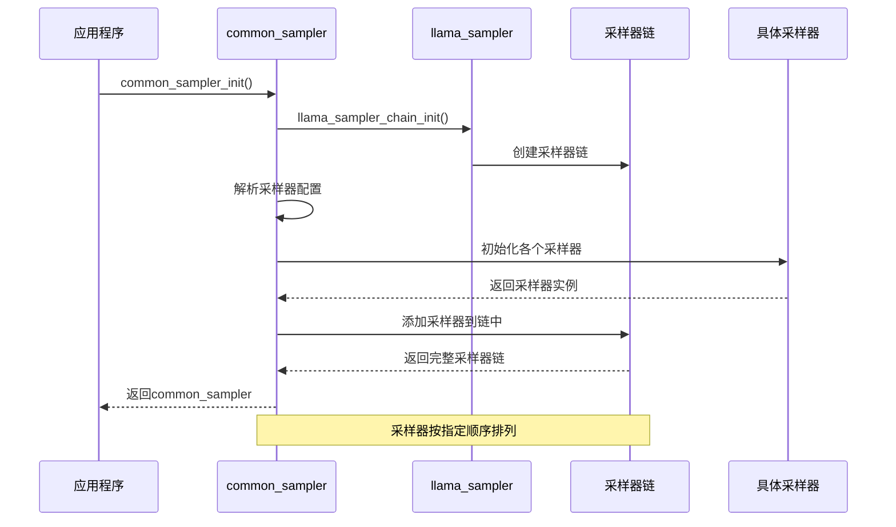

**图表来源**
- [sampling.cpp:187-412](file://common/sampling.cpp#L187-L412)

**章节来源**
- [sampling.cpp:187-412](file://common/sampling.cpp#L187-L412)
- [common.cpp:1116-1127](file://common/common.cpp#L1116-L1127)

## 性能考虑

### 数值稳定性优化

llama.cpp 在 softmax 计算中采用了数值稳定性的优化策略：

```mermaid
flowchart TD
A[开始softmax计算] --> B[找到最大logit值]
B --> C[对每个logit执行: logit' = exp(logit - max_logit)]
C --> D[计算总和: sum = Σexp(logit')]
D --> E[对每个概率执行: p = exp(logit') / sum]
E --> F[返回概率分布]
F --> G[结束]
style B fill:#fff3e0
style E fill:#e8f5e8
```

**图表来源**
- [llama-sampler.cpp:289-315](file://src/llama-sampler.cpp#L289-L315)

### 排序算法优化

对于大规模词汇表，系统采用了混合排序策略：

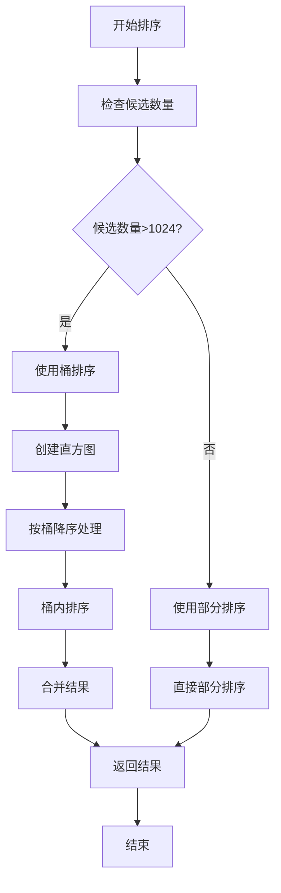

**图表来源**
- [llama-sampler.cpp:135-215](file://src/llama-sampler.cpp#L135-L215)

### 内存管理优化

采样器系统采用了多种内存优化技术：

1. **预分配缓冲区**：采样器链预分配缓冲区避免重复分配
2. **环形缓冲区**：用于历史标记存储，支持固定容量
3. **智能重用**：在采样器之间共享数据结构

**章节来源**
- [llama-sampler.cpp:24-132](file://src/llama-sampler.cpp#L24-L132)
- [sampling.cpp:111-169](file://common/sampling.cpp#L111-L169)

## 故障排除指南

### 常见问题诊断

1. **采样器链为空**
   - 检查采样器配置参数
   - 确认采样器名称正确
   - 验证采样器初始化顺序

2. **概率分布异常**
   - 检查数值稳定性实现
   - 验证 softmax 计算
   - 确认概率归一化

3. **性能问题**
   - 分析排序算法复杂度
   - 检查内存分配模式
   - 优化候选集大小

### 调试技巧

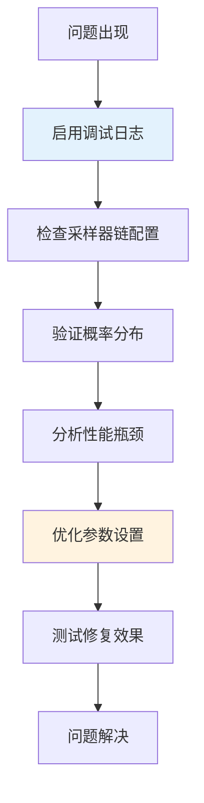

**章节来源**
- [sampling.cpp:484-527](file://common/sampling.cpp#L484-L527)

## 结论

llama.cpp 的采样策略实现展现了现代语言模型采样系统的最佳实践。通过模块化的设计、完善的参数配置、数值稳定的算法实现和性能优化，该系统为各种应用场景提供了灵活而强大的采样能力。

关键优势包括：
- **灵活性**：支持多种采样策略的组合和自定义
- **性能**：针对大规模词汇表进行了专门优化
- **稳定性**：确保数值计算的准确性和一致性
- **可扩展性**：易于添加新的采样策略和功能

对于开发者而言，理解这些采样策略的工作原理有助于更好地配置和优化生成效果，满足不同应用场景的需求。