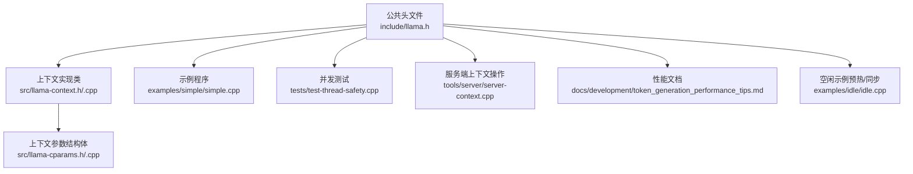
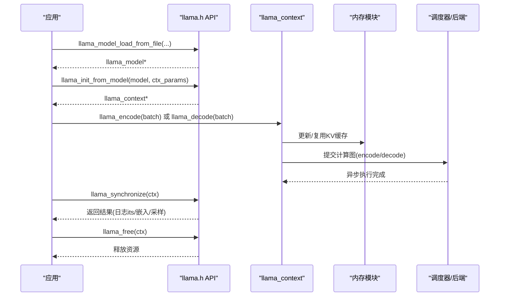
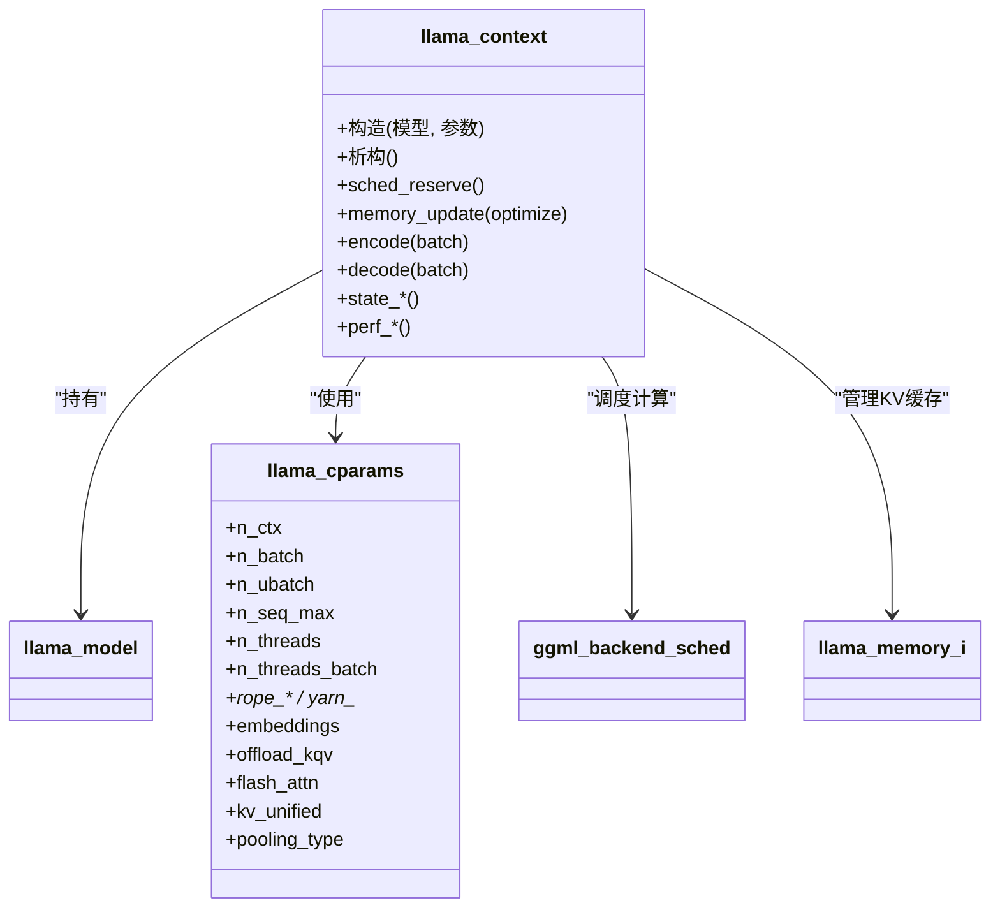

# 上下文管理

<cite>
**本文引用的文件**
- [llama.h](file://include/llama.h)
- [llama-context.h](file://src/llama-context.h)
- [llama-context.cpp](file://src/llama-context.cpp)
- [llama-cparams.h](file://src/llama-cparams.h)
- [llama-cparams.cpp](file://src/llama-cparams.cpp)
- [simple.cpp](file://examples/simple/simple.cpp)
- [test-thread-safety.cpp](file://tests/test-thread-safety.cpp)
- [token_generation_performance_tips.md](file://docs/development/token_generation_performance_tips.md)
- [server-context.cpp](file://tools/server/server-context.cpp)
- [idle.cpp](file://examples/idle/idle.cpp)
</cite>

## 目录
1. [简介](#简介)
2. [项目结构](#项目结构)
3. [核心组件](#核心组件)
4. [架构总览](#架构总览)
5. [详细组件分析](#详细组件分析)
6. [依赖分析](#依赖分析)
7. [性能考虑](#性能考虑)
8. [故障排查指南](#故障排查指南)
9. [结论](#结论)
10. [附录：完整端到端示例路径](#附录完整端到端示例路径)

## 简介
本文件面向 llama.cpp 的“上下文管理”能力，系统化梳理 llama_context 的创建、配置、使用与销毁流程；详解 llama_context_params 各项参数对行为与性能的影响；给出最佳实践与性能调优建议；说明状态管理、内存分配与资源清理机制；并覆盖多上下文并发使用的注意事项与线程安全要点。文末提供从模型加载到推理执行的完整示例路径，便于快速上手。

## 项目结构
围绕上下文管理的关键代码分布在以下位置：
- 公共头文件定义了上下文 API、参数结构体与默认值
- C++ 实现封装了上下文对象生命周期、调度器与内存模块初始化
- 示例程序展示了从创建上下文到生成文本的完整流程
- 测试用例验证了多上下文并发场景下的线程安全性
- 文档提供了性能调优建议

**图表来源**
- [llama.h:331-383](file://include/llama.h#L331-L383)
- [llama-context.h:26-350](file://src/llama-context.h#L26-L350)
- [llama-context.cpp:24-367](file://src/llama-context.cpp#L24-L367)
- [llama-cparams.h:9-47](file://src/llama-cparams.h#L9-L47)
- [simple.cpp:111-124](file://examples/simple/simple.cpp#L111-L124)
- [test-thread-safety.cpp:82-91](file://tests/test-thread-safety.cpp#L82-L91)
- [server-context.cpp:2171-2198](file://tools/server/server-context.cpp#L2171-L2198)
- [token_generation_performance_tips.md:1-41](file://docs/development/token_generation_performance_tips.md#L1-L41)
- [idle.cpp:54-67](file://examples/idle/idle.cpp#L54-L67)

**章节来源**
- [llama.h:331-383](file://include/llama.h#L331-L383)
- [llama-context.h:26-350](file://src/llama-context.h#L26-L350)
- [llama-context.cpp:24-367](file://src/llama-context.cpp#L24-L367)
- [llama-cparams.h:9-47](file://src/llama-cparams.h#L9-L47)
- [simple.cpp:111-124](file://examples/simple/simple.cpp#L111-L124)
- [test-thread-safety.cpp:82-91](file://tests/test-thread-safety.cpp#L82-L91)
- [server-context.cpp:2171-2198](file://tools/server/server-context.cpp#L2171-L2198)
- [token_generation_performance_tips.md:1-41](file://docs/development/token_generation_performance_tips.md#L1-L41)
- [idle.cpp:54-67](file://examples/idle/idle.cpp#L54-L67)

## 核心组件
- 上下文参数结构体：llama_context_params
  - 定义于公共头文件，用于控制上下文大小、批处理大小、序列数上限、线程数、RoPE/YaRN 参数、注意力类型、是否启用嵌入输出、是否将 KQV 操作与缓存卸载到设备等
- 上下文实现类：llama_context
  - 封装调度器、后端缓冲区、内存模块、采样器链、输出缓冲等；负责上下文初始化、图预留、计算执行、状态保存/恢复、性能统计等
- 关键 API
  - 创建上下文：llama_init_from_model(...)
  - 销毁上下文：llama_free(...)
  - 批量编码/解码：llama_encode(...) / llama_decode(...)
  - 线程与同步：llama_set_n_threads(...) / llama_synchronize(...)
  - 性能查询：llama_perf_context_* / llama_perf_sampler_*

**章节来源**
- [llama.h:331-383](file://include/llama.h#L331-L383)
- [llama-context.h:26-350](file://src/llama-context.h#L26-L350)
- [llama-context.cpp:24-367](file://src/llama-context.cpp#L24-L367)

## 架构总览
llama_context 在构造时根据 llama_context_params 初始化调度器、后端与内存模块，并进行“最坏情况”图预留以降低运行时分配开销。推理阶段通过 encode/decode 接口提交批次，调度器在 CPU/GPU 设备间分配计算节点，最终将结果写回主机缓冲供采样或嵌入提取使用。

**图表来源**
- [llama.h:477-512](file://include/llama.h#L477-L512)
- [llama-context.cpp:24-367](file://src/llama-context.cpp#L24-L367)
- [llama-context.h:119-121](file://src/llama-context.h#L119-L121)

## 详细组件分析

### 1) 上下文参数结构体：llama_context_params
- 关键字段与含义
  - n_ctx：推理上下文长度（0 表示使用模型训练上下文）
  - n_batch / n_ubatch：逻辑批大小与物理批大小
  - n_seq_max：最大并发序列数
  - n_threads / n_threads_batch：单令牌生成与批量提示处理的线程数
  - rope_scaling_type / rope_freq_base / rope_freq_scale：RoPE 缩放策略与频率参数
  - yarn_*：YaRN 扩展/注意力/低/高修正维度与原始上下文
  - embeddings / offload_kqv / op_offload：是否输出嵌入、是否将 KQV 卸载到设备、是否将主机张量运算卸载到设备
  - pooling_type / attention_type / flash_attn_type：池化类型、注意力类型、Flash Attention 使用策略
  - type_k / type_v：K/V 缓存数据类型（实验性）
  - cb_eval / cb_eval_user_data：评估回调
  - abort_callback / abort_callback_data：中止回调
  - swa_full / kv_unified：SWA 缓存全尺寸、统一 KV 缓存
  - samplers / n_samplers：后端采样器链配置（实验性）

- 默认值与实际值
  - 提供默认函数 llama_context_default_params()
  - 实际生效值可能因设备能力、模型元数据与自动检测而调整（如 Flash Attention 自动判定）

- 影响与约束
  - n_ctx 会按 256 对齐并影响 n_ctx_seq（单序列上下文），当 n_seq_max 较大时需确保 n_ctx 能被整除
  - 当启用量化 V 缓存但未启用 Flash Attention 时会触发错误
  - kv_unified 会影响 n_ctx_seq 的分配策略

**章节来源**
- [llama.h:331-383](file://include/llama.h#L331-L383)
- [llama-context.cpp:57-218](file://src/llama-context.cpp#L57-L218)
- [llama-context.cpp:351-355](file://src/llama-context.cpp#L351-L355)

### 2) 上下文实现类：llama_context
- 生命周期
  - 构造：解析参数、初始化后端与调度器、预留最坏情况图、初始化内存模块与采样器
  - 运行：encode/decode 处理批次，调度器异步执行，必要时同步等待
  - 销毁：释放优化器、检查各后端计算缓冲区大小与预期是否一致

- 关键职责
  - sched_reserve：根据 n_ctx/n_batch/n_seq_max 预留计算图与缓冲，支持自动 Flash Attention 与融合算子检测
  - memory_update：动态更新内存模块（如 SWA/循环缓存），并在需要时重新预留图
  - 输出管理：维护 logits/embeddings/sampled 结果缓冲，支持按输出索引访问
  - 状态保存/恢复：支持整体或单序列的状态序列化/反序列化

- 线程与同步
  - attach/detach 线程池接口
  - synchronize：汇总统计、记录首次评估耗时、重置队列计数

**章节来源**
- [llama-context.h:26-350](file://src/llama-context.h#L26-L350)
- [llama-context.cpp:24-367](file://src/llama-context.cpp#L24-L367)
- [llama-context.cpp:389-630](file://src/llama-context.cpp#L389-L630)
- [llama-context.cpp:632-664](file://src/llama-context.cpp#L632-L664)

### 3) 参数结构体与默认值：llama_cparams
- 作用：将公共参数映射到上下文内部使用的紧凑结构，包含上下文长度、批大小、序列数、线程数、RoPE/YaRN、注意力/池化类型、设备卸载开关、性能统计开关等
- 限制：n_seq_max 最大值由 LLAMA_MAX_SEQ 控制

**章节来源**
- [llama-cparams.h:9-47](file://src/llama-cparams.h#L9-L47)
- [llama-cparams.cpp:3-6](file://src/llama-cparams.cpp#L3-L6)

### 4) API 使用流程与示例路径
- 基本流程
  - 加载后端 → 加载模型 → 初始化上下文 → 初始化采样器链 → 提交提示批次 encode（可选）→ 解码生成 → 采样/输出 → 同步 → 释放
- 示例路径
  - 端到端示例：[simple.cpp:111-124](file://examples/simple/simple.cpp#L111-L124) 展示了从创建上下文到生成文本的完整步骤
  - 预热与同步：[idle.cpp:64-76](file://examples/idle/idle.cpp#L64-L76) 展示了 warmup 与同步调用
  - 服务端上下文位移（KV 缓存移动）：[server-context.cpp:2171-2198](file://tools/server/server-context.cpp#L2171-L2198) 展示了基于内存接口的序列片段删除与位移

**章节来源**
- [simple.cpp:111-124](file://examples/simple/simple.cpp#L111-L124)
- [idle.cpp:64-76](file://examples/idle/idle.cpp#L64-L76)
- [server-context.cpp:2171-2198](file://tools/server/server-context.cpp#L2171-L2198)

### 5) 并发与线程安全
- 多上下文并发
  - 测试用例表明可在不同模型副本上并行创建多个上下文，分别在不同 GPU/CPU 上运行推理
  - 每个上下文独立持有自己的调度器、内存模块与采样器链
- 注意事项
  - 不同上下文之间共享只读模型，各自维护独立的上下文状态
  - 确保每个上下文的 n_seq_max、n_batch、n_ubatch 设置合理，避免跨上下文互相抢占资源
  - 若使用自定义采样器链，请确保其生命周期不早于上下文销毁

**章节来源**
- [test-thread-safety.cpp:82-91](file://tests/test-thread-safety.cpp#L82-L91)
- [test-thread-safety.cpp:100-146](file://tests/test-thread-safety.cpp#L100-L146)

## 依赖分析
- 头文件依赖
  - llama.h 定义了公共 API、参数结构体与默认值
  - llama-context.h/.cpp 依赖 ggml 后端、调度器、内存模块与采样器
  - llama-cparams.h/.cpp 提供内部参数映射
- 运行时依赖
  - 后端设备初始化（CPU/GPU/加速器）
  - 调度器按设备能力分配计算节点
  - 内存模块管理 KV 缓存与输出缓冲

**图表来源**
- [llama-context.h:26-350](file://src/llama-context.h#L26-L350)
- [llama-cparams.h:9-47](file://src/llama-cparams.h#L9-L47)
- [llama.h:477-512](file://include/llama.h#L477-L512)

**章节来源**
- [llama-context.h:26-350](file://src/llama-context.h#L26-L350)
- [llama-cparams.h:9-47](file://src/llama-cparams.h#L9-L47)
- [llama.h:477-512](file://include/llama.h#L477-L512)

## 性能考虑
- 线程数设置
  - CPU 过载会导致吞吐下降，建议从较小线程数开始逐步提升，直至瓶颈出现后再下调
- GPU 卸载与 Flash Attention
  - 合理设置 n_gpu_layers 与 -ngl 参数，使尽可能多层参与 GPU 计算
  - Flash Attention 自动检测失败时会回退到禁用模式
- 批处理与上下文大小
  - n_batch 与 n_ubatch 应结合模型注意力类型与硬件能力设定
  - n_ctx 会按 256 对齐并影响 n_ctx_seq，注意 n_seq_max 与整除关系
- 预热与同步
  - 首次评估耗时计入加载时间，可通过预热与同步减少首 token 延迟
- 性能统计
  - 使用性能接口收集生成速度、提示处理时间与图复用次数等指标

**章节来源**
- [token_generation_performance_tips.md:1-41](file://docs/development/token_generation_performance_tips.md#L1-L41)
- [llama-context.cpp:429-467](file://src/llama-context.cpp#L429-L467)
- [llama.h:1519-1526](file://include/llama.h#L1519-L1526)

## 故障排查指南
- Flash Attention 与量化 V 缓存
  - 若请求量化 V 缓存但未启用 Flash Attention，将抛出异常
- KV 缓存位移与序列管理
  - 服务端示例展示了如何基于内存接口对序列片段进行删除与位移，以实现无限续写
- 中止回调
  - 可通过设置 abort_callback 在 CPU 执行路径中断 decode
- 线程池与同步
  - 如遇到性能异常，先确认线程数设置与是否正确调用同步接口

**章节来源**
- [llama-context.cpp:351-355](file://src/llama-context.cpp#L351-L355)
- [server-context.cpp:2171-2198](file://tools/server/server-context.cpp#L2171-L2198)
- [llama.h:966-972](file://include/llama.h#L966-L972)

## 结论
llama_context 通过参数化配置与自动化的调度器预留，实现了在多设备环境下的高效推理。合理设置上下文大小、批处理与线程数，配合 Flash Attention 与设备卸载，可显著提升吞吐与延迟表现。多上下文并发场景下，应确保资源隔离与参数匹配，避免相互干扰。借助状态保存/恢复与性能统计接口，可进一步完善生产级部署与监控。

## 附录：完整端到端示例路径
- 从模型加载到推理执行的最小示例
  - [simple.cpp:86-94](file://examples/simple/simple.cpp#L86-L94)：加载后端与模型
  - [simple.cpp:111-119](file://examples/simple/simple.cpp#L111-L119)：初始化上下文参数并创建上下文
  - [simple.cpp:149-156](file://examples/simple/simple.cpp#L149-L156)：encode（可选）与解码主循环
  - [simple.cpp:218-220](file://examples/simple/simple.cpp#L218-L220)：释放采样器、上下文与模型
- 预热与同步
  - [idle.cpp:64-76](file://examples/idle/idle.cpp#L64-L76)：warmup 与同步
- 服务端上下文位移（KV 缓存）
  - [server-context.cpp:2171-2198](file://tools/server/server-context.cpp#L2171-L2198)：序列片段删除与位移

**章节来源**
- [simple.cpp:86-94](file://examples/simple/simple.cpp#L86-L94)
- [simple.cpp:111-119](file://examples/simple/simple.cpp#L111-L119)
- [simple.cpp:149-156](file://examples/simple/simple.cpp#L149-L156)
- [simple.cpp:218-220](file://examples/simple/simple.cpp#L218-L220)
- [idle.cpp:64-76](file://examples/idle/idle.cpp#L64-L76)
- [server-context.cpp:2171-2198](file://tools/server/server-context.cpp#L2171-L2198)