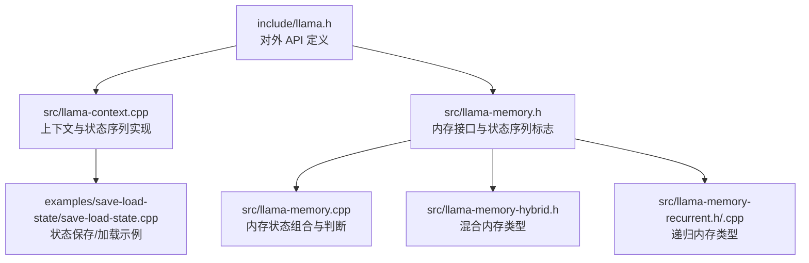
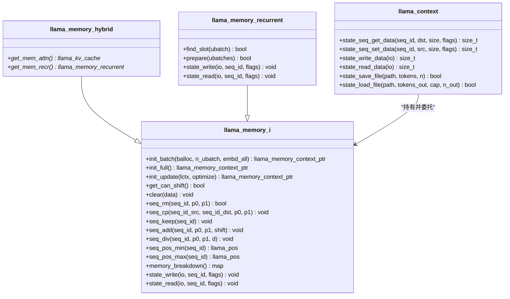
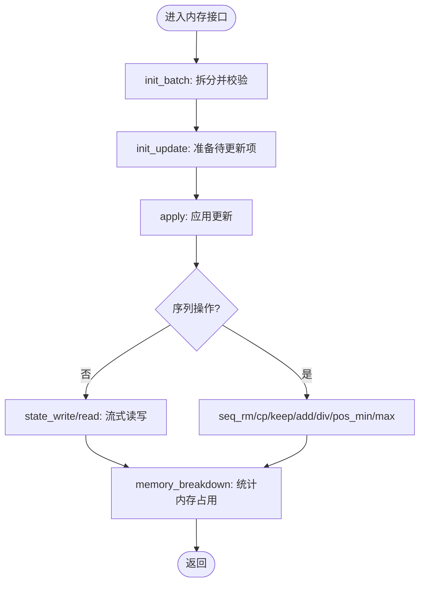
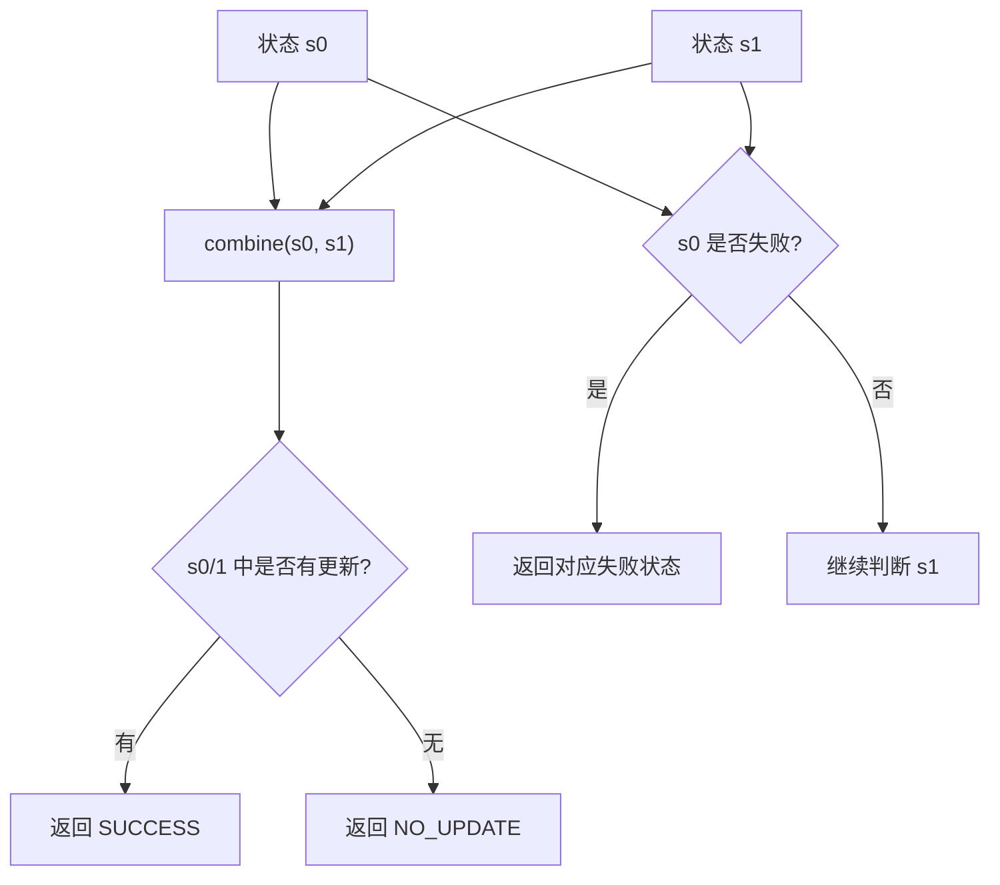
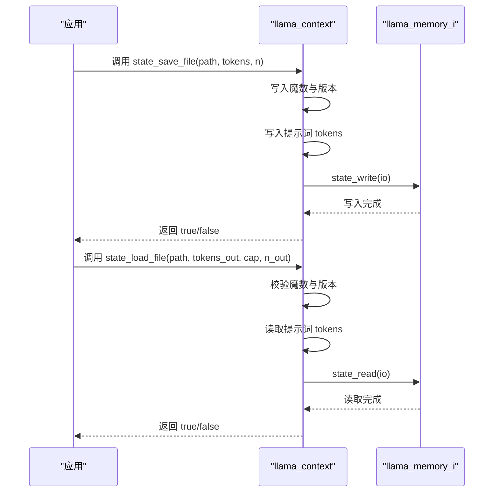
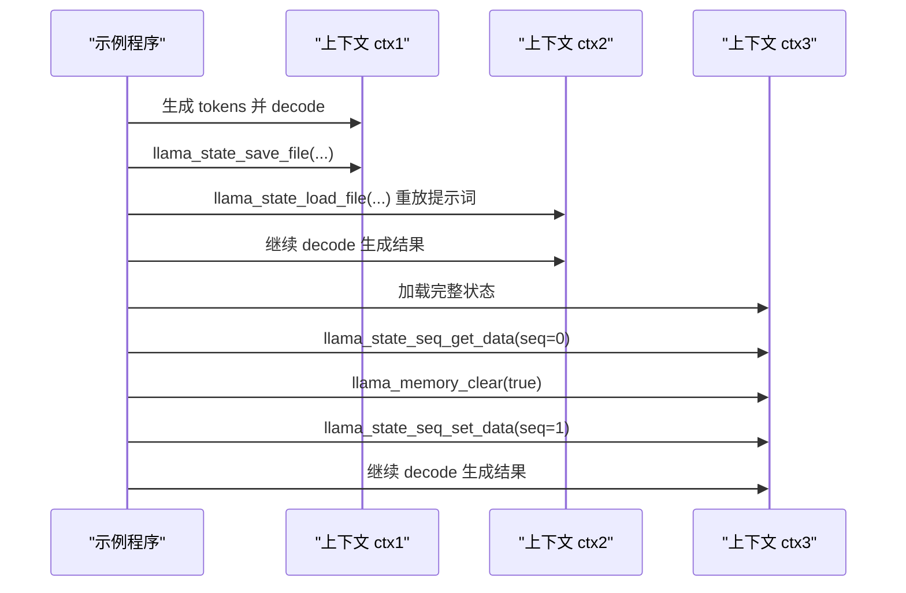
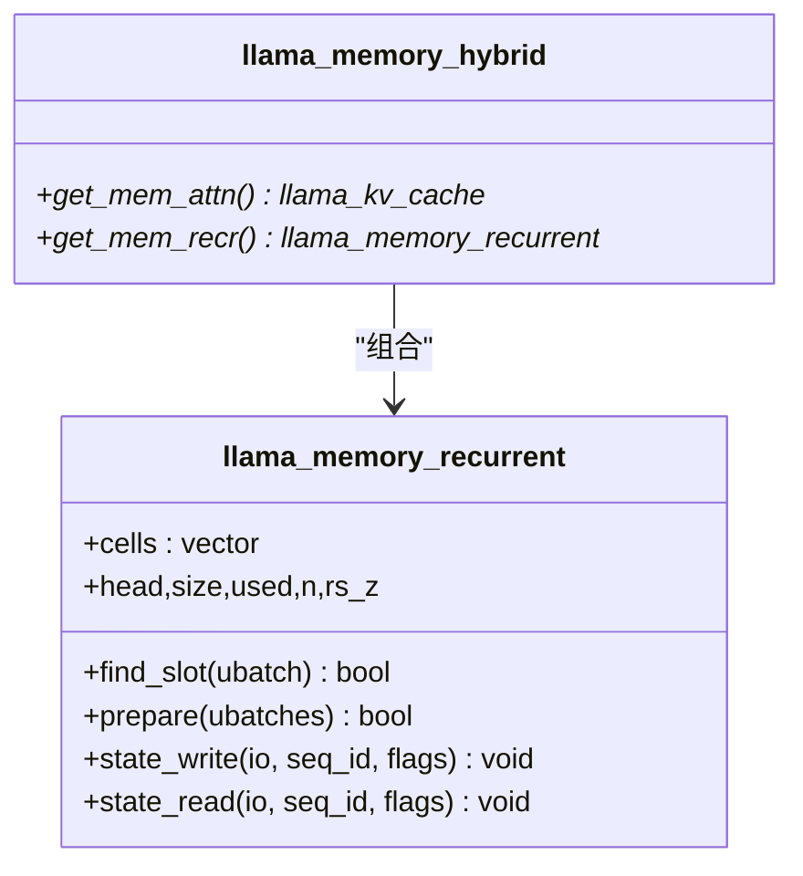
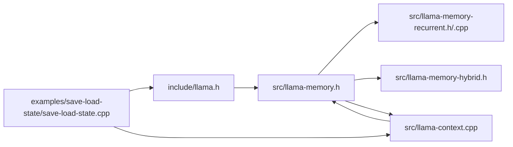

# 内存和会话

<cite>
**本文引用的文件**
- [llama.h](file://include/llama.h)
- [llama-memory.h](file://src/llama-memory.h)
- [llama-memory.cpp](file://src/llama-memory.cpp)
- [llama-context.cpp](file://src/llama-context.cpp)
- [save-load-state.cpp](file://examples/save-load-state/save-load-state.cpp)
- [llama-memory-hybrid.h](file://src/llama-memory-hybrid.h)
- [llama-memory-recurrent.h](file://src/llama-memory-recurrent.h)
- [llama-memory-recurrent.cpp](file://src/llama-memory-recurrent.cpp)
</cite>

## 目录
1. [简介](#简介)
2. [项目结构](#项目结构)
3. [核心组件](#核心组件)
4. [架构总览](#架构总览)
5. [详细组件分析](#详细组件分析)
6. [依赖关系分析](#依赖关系分析)
7. [性能考量](#性能考量)
8. [故障排查指南](#故障排查指南)
9. [结论](#结论)
10. [附录](#附录)

## 简介
本文件面向 llama.cpp 的内存管理与会话持久化能力，系统性梳理内存缓冲区管理、序列操作与状态保存/恢复机制，重点围绕 C 接口中的 llama_memory_t 类型及其操作方法，以及会话文件（session）与序列状态（state sequence）的保存与加载流程。同时提供内存优化策略、性能调优建议、最佳实践与并发注意事项，并通过示例展示如何在应用中正确使用这些 API。

## 项目结构
- 头文件定义对外 API：包括模型/上下文初始化、批处理、采样器、内存接口、状态读写等。
- 实现层提供具体内存类型（如 KV 缓存、递归状态缓存、混合类型）及上下文状态序列的读写。
- 示例程序演示状态保存/加载与序列级状态迁移。

**图表来源**
- [llama.h](file://include/llama.h)
- [llama-memory.h](file://src/llama-memory.h)
- [llama-context.cpp](file://src/llama-context.cpp)
- [llama-memory-hybrid.h](file://src/llama-memory-hybrid.h)
- [llama-memory-recurrent.h](file://src/llama-memory-recurrent.h)
- [llama-memory-recurrent.cpp](file://src/llama-memory-recurrent.cpp)
- [save-load-state.cpp](file://examples/save-load-state/save-load-state.cpp)

**章节来源**
- [llama.h](file://include/llama.h)
- [llama-memory.h](file://src/llama-memory.h)
- [llama-context.cpp](file://src/llama-context.cpp)
- [save-load-state.cpp](file://examples/save-load-state/save-load-state.cpp)

## 核心组件
- llama_memory_t（类型别名）：指向内存接口对象的指针，用于统一管理 KV 缓存、递归状态等不同类型的内存。
- 内存接口 llama_memory_i：定义了批处理拆分、更新准备、序列操作（删除/复制/保留/位移/整除）、位置范围查询、内存占用统计、状态读写等方法。
- 上下文状态序列接口：支持按序列保存/加载状态，以及完整上下文状态的保存/加载。
- 状态序列标志：控制仅保存部分状态（如 SWA 或递归缓存），或扩展到更细粒度的读写。

关键 API 概览（节选）：
- 获取内存对象：llama_get_memory(ctx)
- 清空内存：llama_memory_clear(mem, data)
- 序列操作：llama_memory_seq_rm/cp/keep/add/div/pos_min/pos_max
- 状态序列：llama_state_seq_get_size/get_data/set_data/save/load
- 完整状态：llama_state_get_size/get_data/set_data/save/load

**章节来源**
- [llama.h](file://include/llama.h)
- [llama-memory.h](file://src/llama-memory.h)
- [llama-context.cpp](file://src/llama-context.cpp)

## 架构总览
llama.cpp 将“内存”抽象为可插拔的接口 llama_memory_i，不同的模型架构（如注意力型、递归型、混合型）通过各自的实现类承载 KV 缓存、递归状态等。上下文在执行 decode/encode 前后，通过该接口进行批处理拆分、更新准备与应用，以及状态序列的读写。

**图表来源**
- [llama-memory.h](file://src/llama-memory.h)
- [llama-memory-hybrid.h](file://src/llama-memory-hybrid.h)
- [llama-memory-recurrent.h](file://src/llama-memory-recurrent.h)
- [llama-context.cpp](file://src/llama-context.cpp)

## 详细组件分析

### 组件一：llama_memory_i 接口与状态序列标志
- 设计要点
  - 批处理拆分与校验：init_batch 用于将输入批拆分为若干微批（ubatch），并验证是否能放入缓存；init_full 用于模拟最坏情况分配；init_update 用于准备待应用的更新（如位移/复制）。
  - 序列操作：支持对指定序列在位置区间 [p0, p1) 进行删除、复制、保留、相对位移、整除等操作；并提供最小/最大位置查询。
  - 状态读写：state_write/state_read 支持将内存模块的状态以流式方式写入/读取，可按序列或全量写入；配合 flags 可仅写入部分状态（如 SWA 或递归缓存）。
  - 内存占用统计：memory_breakdown 返回按缓冲区类型划分的内存使用量，便于诊断与优化。
- 状态序列标志
  - 部分状态：仅保存/恢复特定子模块（如 SWA 或递归缓存），避免冗余数据。
  - 兼容性：提供旧版宏常量与扩展版本的 get_size/get_data/set_data 接口。

**图表来源**
- [llama-memory.h](file://src/llama-memory.h)

**章节来源**
- [llama-memory.h](file://src/llama-memory.h)
- [llama.h](file://include/llama.h)

### 组件二：llama_memory_status 与失败处理
- 状态枚举
  - 成功/无更新/准备失败/计算失败。
- 组合与判断
  - llama_memory_status_combine：合并两个状态，若任一有更新则整体视为成功。
  - llama_memory_status_is_fail：判断是否为失败状态。
- 使用场景
  - 在混合内存类型（如 iSWA）中，将多个子模块的状态合并，确保错误优先传播。

**图表来源**
- [llama-memory.cpp](file://src/llama-memory.cpp)

**章节来源**
- [llama-memory.cpp](file://src/llama-memory.cpp)

### 组件三：上下文状态序列与会话文件
- 完整状态
  - llama_state_get_size：获取完整状态大小。
  - llama_state_get_data / llama_state_set_data：将上下文状态写入/从缓冲区读取。
  - llama_state_save_file / llama_state_load_file：将完整状态保存到/从文件加载。
- 序列状态
  - llama_state_seq_get_size / get_data / set_data：针对单个序列保存/恢复状态。
  - llama_state_seq_save_file / llama_state_seq_load_file：序列状态文件的保存/加载。
- 文件格式
  - 会话文件头含魔数与版本号，先写入提示词 token 序列，再写入状态数据。
  - 序列状态文件同样包含魔数、版本与提示词，随后是序列状态数据。

**图表来源**
- [llama.h](file://include/llama.h)
- [llama-context.cpp](file://src/llama-context.cpp)

**章节来源**
- [llama.h](file://include/llama.h)
- [llama-context.cpp](file://src/llama-context.cpp)

### 组件四：示例程序：状态保存/加载与序列迁移
- 功能概览
  - 初始化模型与上下文，生成提示词 token 序列。
  - 生成若干输出 token 后，保存完整状态到文件。
  - 创建新上下文，加载状态文件，重放最后 token，继续生成。
  - 保存序列 0 的状态，清空 KV，将状态迁移到序列 1 并继续生成。
- 关键点
  - 当 n_parallel == 1 时启用统一 KV 缓存，保证多序列场景下的稳定性。
  - 使用 llama_state_seq_get_size/get_data/set_data 实现序列级状态迁移。

**图表来源**
- [save-load-state.cpp](file://examples/save-load-state/save-load-state.cpp)
- [llama.h](file://include/llama.h)

**章节来源**
- [save-load-state.cpp](file://examples/save-load-state/save-load-state.cpp)
- [llama.h](file://include/llama.h)

### 组件五：递归内存与混合内存
- 递归内存（llama_memory_recurrent）
  - 适用于 Mamba/RWKV 等递归状态模型，使用固定大小的内存单元（cells）存储每个序列的状态。
  - 提供 find_slot/prepare 等方法进行槽位查找与准备，支持状态的写入/读取。
- 混合内存（llama_memory_hybrid）
  - 同时管理注意力型 KV 缓存与递归状态，适配混合架构模型。
  - 提供注意力与递归两套上下文，分别处理各自类型的 ubatch。

**图表来源**
- [llama-memory-recurrent.h](file://src/llama-memory-recurrent.h)
- [llama-memory-recurrent.cpp](file://src/llama-memory-recurrent.cpp)
- [llama-memory-hybrid.h](file://src/llama-memory-hybrid.h)

**章节来源**
- [llama-memory-recurrent.h](file://src/llama-memory-recurrent.h)
- [llama-memory-recurrent.cpp](file://src/llama-memory-recurrent.cpp)
- [llama-memory-hybrid.h](file://src/llama-memory-hybrid.h)

## 依赖关系分析
- 外部依赖
  - ggml 类型与后端缓冲区类型（ggml_backend_buffer_type_t）用于内存统计与设备/主机内存区分。
- 内部耦合
  - llama_context 通过 llama_memory_i 委托内存管理与状态序列读写。
  - 不同内存实现（递归/混合）共享同一接口，便于替换与扩展。
- 潜在循环依赖
  - 通过头文件前向声明与实现分离，避免直接循环包含。

**图表来源**
- [llama.h](file://include/llama.h)
- [llama-memory.h](file://src/llama-memory.h)
- [llama-memory-recurrent.h](file://src/llama-memory-recurrent.h)
- [llama-memory-recurrent.cpp](file://src/llama-memory-recurrent.cpp)
- [llama-memory-hybrid.h](file://src/llama-memory-hybrid.h)
- [llama-context.cpp](file://src/llama-context.cpp)
- [save-load-state.cpp](file://examples/save-load-state/save-load-state.cpp)

**章节来源**
- [llama.h](file://include/llama.h)
- [llama-memory.h](file://src/llama-memory.h)
- [llama-context.cpp](file://src/llama-context.cpp)

## 性能考量
- 批处理与微批（ubatch）
  - 通过 init_batch 将大批次拆分为更小的 ubatch，减少峰值内存占用并提升缓存命中率。
- 更新准备与应用
  - init_update 与 apply 分离，允许在不改变图的前提下预处理更新，降低重复计算成本。
- 内存类型选择
  - 注意力型模型优先 KV 缓存；递归型模型使用递归状态；混合模型采用混合内存以兼顾两者。
- 内存占用统计
  - 使用 memory_breakdown 按缓冲区类型查看占用，辅助定位瓶颈与优化方向。
- 线程与调度
  - llama_set_n_threads 控制生成与批处理线程数，合理配置可提升吞吐。

[本节为通用指导，无需列出具体文件来源]

## 故障排查指南
- 状态读写失败
  - 检查魔数与版本是否匹配（会话/序列文件）。
  - 确认目标缓冲区大小足够（state_get_size/state_seq_get_size）。
  - 观察返回值与日志，必要时在调用前后同步（synchronize）。
- 序列操作异常
  - seq_rm/seq_cp/seq_keep/seq_add/seq_div 的区间参数需符合约定（p0/p1 的负值语义）。
  - 对于递归内存，注意槽位查找与等长序列约束。
- 内存状态组合
  - 若使用混合内存，检查各子模块状态组合是否失败（prepare/apply 返回 false）。

**章节来源**
- [llama-context.cpp](file://src/llama-context.cpp)
- [llama-memory.cpp](file://src/llama-memory.cpp)
- [llama-memory-recurrent.cpp](file://src/llama-memory-recurrent.cpp)

## 结论
llama.cpp 的内存管理通过统一的 llama_memory_i 接口抽象，实现了对不同模型架构（注意力型、递归型、混合型）的内存与状态管理。结合上下文的状态序列读写 API，开发者可以实现完整的会话持久化与序列级状态迁移。通过合理的批处理拆分、更新准备与内存类型选择，可在资源受限环境下获得稳定且高性能的推理体验。

[本节为总结性内容，无需列出具体文件来源]

## 附录

### API 参考速查
- 获取内存对象：llama_get_memory(ctx)
- 清空内存：llama_memory_clear(mem, data)
- 序列操作：llama_memory_seq_rm/cp/keep/add/div/pos_min/pos_max
- 完整状态：llama_state_get_size/get_data/set_data/save/load
- 序列状态：llama_state_seq_get_size/get_data/set_data/save/load
- 扩展序列状态：llama_state_seq_get_size_ext/get_data_ext/set_data_ext（带 flags）

**章节来源**
- [llama.h](file://include/llama.h)
- [llama-context.cpp](file://src/llama-context.cpp)