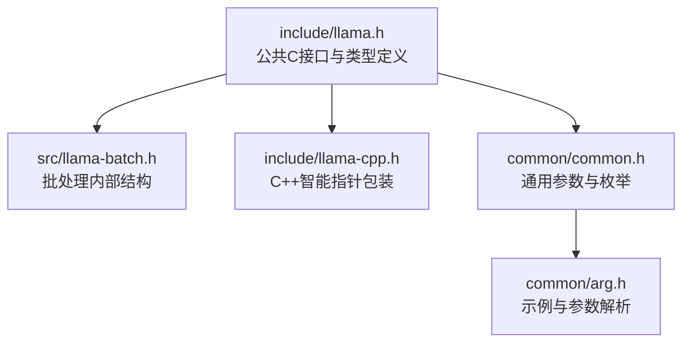
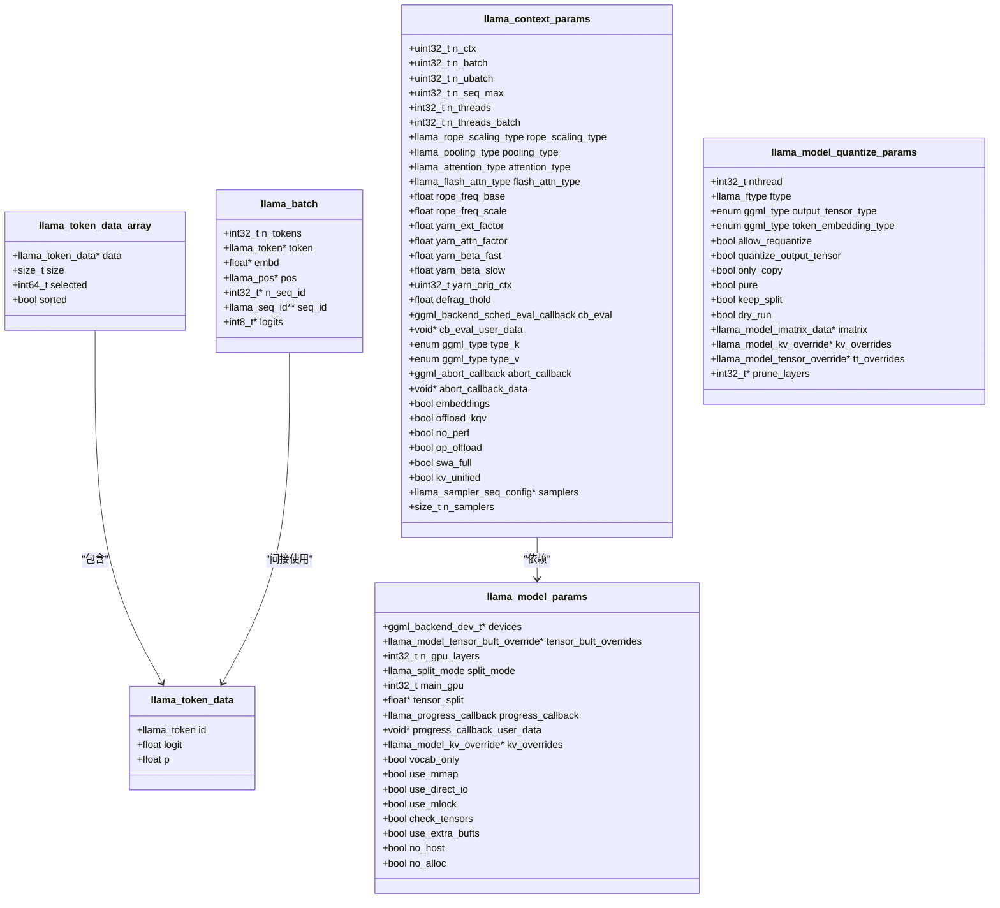
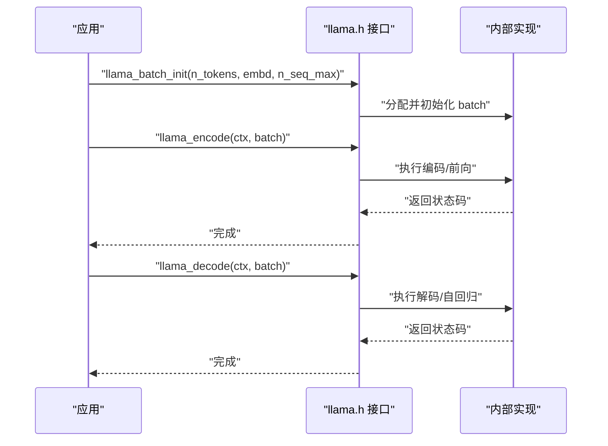
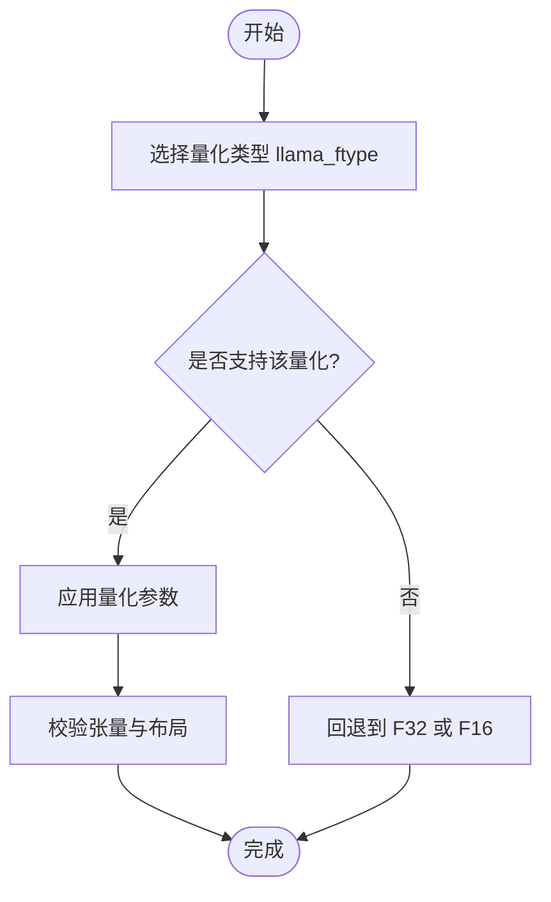
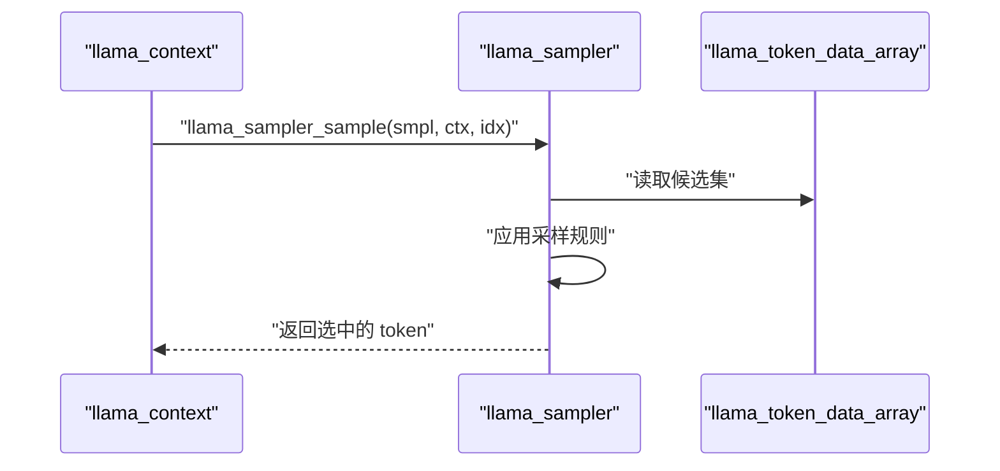
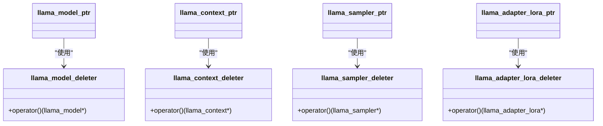
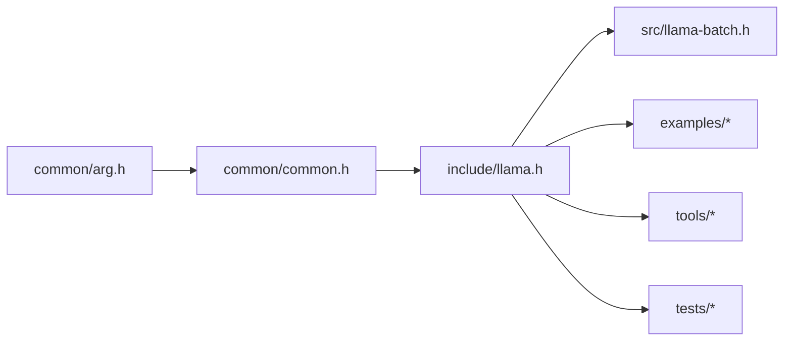

# 基础类型和常量

<cite>
**本文档引用的文件**
- [llama.h](file://include/llama.h)
- [llama-cpp.h](file://include/llama-cpp.h)
- [llama-batch.h](file://src/llama-batch.h)
- [common.h](file://common/common.h)
- [arg.h](file://common/arg.h)
</cite>

## 目录
1. [简介](#简介)
2. [项目结构](#项目结构)
3. [核心组件](#核心组件)
4. [架构总览](#架构总览)
5. [详细组件分析](#详细组件分析)
6. [依赖分析](#依赖分析)
7. [性能考虑](#性能考虑)
8. [故障排除指南](#故障排除指南)
9. [结论](#结论)
10. [附录](#附录)

## 简介
本文件为 llama.cpp 的基础类型与常量的权威参考，覆盖以下内容：
- 枚举类型：llama_vocab_type、llama_ftype、llama_rope_scaling_type、llama_pooling_type、llama_attention_type、llama_flash_attn_type、llama_split_mode 等
- 数据结构：llama_token_data、llama_token_data_array、llama_batch、llama_model_params、llama_context_params、llama_model_quantize_params 等
- 全局常量：LLAMA_DEFAULT_SEED、LLAMA_TOKEN_NULL、文件魔数与版本等
- 类型间的关系与转换规则
- 实际用法示例路径（以源码路径形式给出）

## 项目结构
llama.cpp 的公共接口集中在 include/llama.h 中，C++ 包装在 include/llama-cpp.h；批处理内部实现位于 src/llama-batch.h；通用参数与枚举在 common/common.h 与 common/arg.h 中。

**图表来源**
- [llama.h](file://include/llama.h)
- [llama-cpp.h](file://include/llama-cpp.h)
- [llama-batch.h](file://src/llama-batch.h)
- [common.h](file://common/common.h)
- [arg.h](file://common/arg.h)

**章节来源**
- [llama.h](file://include/llama.h)
- [llama-cpp.h](file://include/llama-cpp.h)
- [llama-batch.h](file://src/llama-batch.h)
- [common.h](file://common/common.h)
- [arg.h](file://common/arg.h)

## 核心组件

### 枚举类型

- llama_vocab_type
  - 用途：标识模型使用的词表类型（分词器类型）
  - 取值：NONE、SPM（LLaMA 字节级 BPE + 字节回退）、BPE（GPT-2 字节级 BPE）、WPM（BERT WordPiece）、UGM（T5 Unigram）、RWKV（RWKV 贪婪分词）、PLAMO2（PalaMo-2 Aho-Corasick 动态规划）
  - 使用场景：选择合适的分词策略，影响 tokenization/detokenization 行为
  - 示例路径：[llama.h](file://include/llama.h)

- llama_rope_type
  - 用途：RoPE 实现类型（与 ggml 对齐）
  - 取值：NONE、NORM、NEOX、MROPE、IMROPE、VISION
  - 使用场景：多模态或长序列模型中设置 RoPE 类型
  - 示例路径：[llama.h](file://include/llama.h)

- llama_token_type
  - 用途：标记 token 的语义类别（兼容性保留）
  - 取值：UNDEFINED、NORMAL、UNKNOWN、CONTROL、USER_DEFINED、UNUSED、BYTE
  - 使用场景：历史兼容与属性标注
  - 示例路径：[llama.h](file://include/llama.h)

- llama_token_attr
  - 用途：token 属性位掩码
  - 取值：UNDEFINED、UNKNOWN、UNUSED、NORMAL、CONTROL、USER_DEFINED、BYTE、NORMALIZED、LSTRIP、RSTRIP、SINGLE_WORD
  - 使用场景：控制 token 的渲染与归一化行为
  - 示例路径：[llama.h](file://include/llama.h)

- llama_ftype
  - 用途：模型权重量化类型（文件存储格式）
  - 取值：ALL_F32、MOSTLY_F16、MOSTLY_Q4_0、...、MOSTLY_Q6_K、MOSTLY_IQ2_XXS、...、MOSTLY_IQ1_M、MOSTLY_BF16、MOSTLY_TQ1_0、MOSTLY_TQ2_0、MOSTLY_MXFP4_MOE、MOSTLY_NVFP4、MOSTLY_Q1_0、GUESSED
  - 使用场景：量化模型加载与推理精度/显存权衡
  - 示例路径：[llama.h](file://include/llama.h)

- llama_rope_scaling_type
  - 用途：RoPE 缩放策略
  - 取值：UNSPECIFIED、NONE、LINEAR、YARN、LONGROPE、MAX_VALUE
  - 使用场景：长上下文扩展（YaRN、LongRoPE 等）
  - 示例路径：[llama.h](file://include/llama.h)

- llama_pooling_type
  - 用途：嵌入池化方式
  - 取值：UNSPECIFIED、NONE、MEAN、CLS、LAST、RANK
  - 使用场景：文本检索/分类任务的嵌入聚合
  - 示例路径：[llama.h](file://include/llama.h)

- llama_attention_type
  - 用途：注意力类型
  - 取值：UNSPECIFIED、CAUSAL、NON_CAUSAL
  - 使用场景：生成与编码器-解码器任务
  - 示例路径：[llama.h](file://include/llama.h)

- llama_flash_attn_type
  - 用途：是否启用 Flash Attention
  - 取值：AUTO、DISABLED、ENABLED
  - 使用场景：加速注意力计算
  - 示例路径：[llama.h](file://include/llama.h)

- llama_split_mode
  - 用途：模型分片/并行策略
  - 取值：NONE、LAYER、ROW、TENSOR
  - 使用场景：多 GPU 分布式推理
  - 示例路径：[llama.h](file://include/llama.h)

- llama_model_kv_override_type
  - 用途：模型元数据覆盖类型
  - 取值：INT、FLOAT、BOOL、STR
  - 使用场景：运行时覆盖模型配置
  - 示例路径：[llama.h](file://include/llama.h)

- llama_model_meta_key
  - 用途：采样相关元数据键
  - 取值：SAMPLING_SEQUENCE、SAMPLING_TOP_K、SAMPLING_TOP_P、SAMPLING_MIN_P、SAMPLING_XTC_PROBABILITY、SAMPLING_XTC_THRESHOLD、SAMPLING_TEMP、SAMPLING_PENALTY_LAST_N、SAMPLING_PENALTY_REPEAT、SAMPLING_MIROSTAT、SAMPLING_MIROSTAT_TAU、SAMPLING_MIROSTAT_ETA
  - 使用场景：动态调整采样策略
  - 示例路径：[llama.h](file://include/llama.h)

**章节来源**
- [llama.h](file://include/llama.h)

### 数据结构

- llama_token_data
  - 字段：id（token id）、logit（对数值）、p（概率）
  - 用途：采样候选信息载体
  - 示例路径：[llama.h](file://include/llama.h)

- llama_token_data_array
  - 字段：data（数组指针）、size（大小）、selected（选中索引）、sorted（是否已排序）
  - 用途：采样器输入/输出容器
  - 示例路径：[llama.h](file://include/llama.h)

- llama_batch
  - 字段：n_tokens、token、embd、pos、n_seq_id、seq_id、logits
  - 用途：批量编码/解码输入，支持多序列与嵌入
  - 示例路径：[llama.h](file://include/llama.h)

- llama_model_params
  - 字段：devices、tensor_buft_overrides、n_gpu_layers、split_mode、main_gpu、tensor_split、progress_callback、progress_callback_user_data、kv_overrides、vocab_only、use_mmap、use_direct_io、use_mlock、check_tensors、use_extra_bufts、no_host、no_alloc
  - 用途：模型加载参数
  - 示例路径：[llama.h](file://include/llama.h)

- llama_context_params
  - 字段：n_ctx、n_batch、n_ubatch、n_seq_max、n_threads、n_threads_batch、rope_scaling_type、pooling_type、attention_type、flash_attn_type、rope_freq_base、rope_freq_scale、yarn_ext_factor、yarn_attn_factor、yarn_beta_fast、yarn_beta_slow、yarn_orig_ctx、defrag_thold、cb_eval、cb_eval_user_data、type_k、type_v、abort_callback、abort_callback_data、embeddings、offload_kqv、no_perf、op_offload、swa_full、kv_unified、samplers、n_samplers
  - 用途：上下文运行参数
  - 示例路径：[llama.h](file://include/llama.h)

- llama_model_quantize_params
  - 字段：nthread、ftype、output_tensor_type、token_embedding_type、allow_requantize、quantize_output_tensor、only_copy、pure、keep_split、dry_run、imatrix、kv_overrides、tt_overrides、prune_layers
  - 用途：量化参数
  - 示例路径：[llama.h](file://include/llama.h)

- llama_logit_bias
  - 字段：token、bias
  - 用途：logit 偏置
  - 示例路径：[llama.h](file://include/llama.h)

- llama_sampler_chain_params
  - 字段：no_perf
  - 用途：采样链默认参数
  - 示例路径：[llama.h](file://include/llama.h)

- llama_chat_message
  - 字段：role、content
  - 用途：聊天模板消息
  - 示例路径：[llama.h](file://include/llama.h)

- llama_model_tensor_override
  - 字段：pattern、type
  - 用途：按模式覆盖张量类型
  - 示例路径：[llama.h](file://include/llama.h)

- llama_model_imatrix_data
  - 字段：name、data、size
  - 用途：重要性矩阵数据
  - 示例路径：[llama.h](file://include/llama.h)

- llama_model_tensor_buft_override
  - 字段：pattern、buft
  - 用途：按模式覆盖缓冲区类型
  - 示例路径：[llama.h](file://include/llama.h)

- llama_model_kv_override
  - 字段：tag、key、val_i64/val_f64/val_bool/val_str
  - 用途：KV 元数据覆盖
  - 示例路径：[llama.h](file://include/llama.h)

- llama_sampler_seq_config
  - 字段：seq_id、sampler
  - 用途：按序列绑定采样器
  - 示例路径：[llama.h](file://include/llama.h)

**章节来源**
- [llama.h](file://include/llama.h)

### 全局常量

- LLAMA_DEFAULT_SEED
  - 含义：默认随机种子
  - 示例路径：[llama.h](file://include/llama.h)

- LLAMA_TOKEN_NULL
  - 含义：无效 token 值
  - 示例路径：[llama.h](file://include/llama.h)

- 文件魔数与版本
  - LLAMA_FILE_MAGIC_GGLA、LLAMA_FILE_MAGIC_GGSN、LLAMA_FILE_MAGIC_GGSQ
  - LLAMA_SESSION_MAGIC、LLAMA_SESSION_VERSION
  - LLAMA_STATE_SEQ_MAGIC、LLAMA_STATE_SEQ_VERSION
  - 示例路径：[llama.h](file://include/llama.h)

- llama_state_seq_flags
  - LLAMA_STATE_SEQ_FLAGS_SWA_ONLY、LLAMA_STATE_SEQ_FLAGS_PARTIAL_ONLY
  - 示例路径：[llama.h](file://include/llama.h)

**章节来源**
- [llama.h](file://include/llama.h)

## 架构总览

llama.cpp 的基础类型与常量构成公共 API 的核心，围绕以下主题组织：
- 模型与上下文参数（llama_model_params、llama_context_params）
- 批处理与序列（llama_batch、llama_token_data、llama_token_data_array）
- 量化与采样（llama_ftype、llama_model_quantize_params、llama_sampler_*）
- RoPE 与注意力（llama_rope_scaling_type、llama_attention_type、llama_flash_attn_type）
- 会话与状态（文件魔数、状态序列标志）

**图表来源**
- [llama.h](file://include/llama.h)

**章节来源**
- [llama.h](file://include/llama.h)

## 详细组件分析

### llama_batch 与批处理流程

llama_batch 是批处理的核心数据结构，支持：
- token 数组与嵌入数组二选一（embd 优先）
- 多序列（seq_id）与位置（pos）信息
- 输出控制（logits）

**图表来源**
- [llama.h](file://include/llama.h)

**章节来源**
- [llama.h](file://include/llama.h)

### 量化类型与转换规则

llama_ftype 决定权重存储精度与布局，常见转换规则：
- 从 FP32 到 Q4/Q5/Q8 等低精度量化，减少显存占用
- IQ/AFM/Others 系列用于特定硬件/精度需求
- GUESSED 表示未在文件中指定的推断类型

**图表来源**
- [llama.h](file://include/llama.h)

**章节来源**
- [llama.h](file://include/llama.h)

### 采样器与 token_data_array

llama_token_data_array 作为采样器输入，包含候选 token 的 logit/p 概率，sampler 在其上进行变换后选择最终 token。

**图表来源**
- [llama.h](file://include/llama.h)

**章节来源**
- [llama.h](file://include/llama.h)

### C++ 包装与 RAII

C++ 头文件提供基于智能指针的 RAII 封装，自动释放资源。

**图表来源**
- [llama-cpp.h](file://include/llama-cpp.h)

**章节来源**
- [llama-cpp.h](file://include/llama-cpp.h)

## 依赖分析

- include/llama.h 是所有类型与 API 的根定义，被 src/* 与 examples/* 广泛引用
- src/llama-batch.h 依赖 include/llama.h，并扩展出内部批处理结构
- common/common.h 与 common/arg.h 提供通用参数与示例枚举，与 llama.h 的枚举形成互补

**图表来源**
- [llama.h](file://include/llama.h)
- [llama-batch.h](file://src/llama-batch.h)
- [common.h](file://common/common.h)
- [arg.h](file://common/arg.h)

**章节来源**
- [llama.h](file://include/llama.h)
- [llama-batch.h](file://src/llama-batch.h)
- [common.h](file://common/common.h)
- [arg.h](file://common/arg.h)

## 性能考虑
- 量化类型（llama_ftype）直接影响显存占用与吞吐，建议根据硬件能力选择合适量化
- Flash Attention（llama_flash_attn_type）可显著提升注意力计算性能
- 批处理大小（n_batch/n_ubatch）与线程数（n_threads/n_threads_batch）需结合硬件调优
- KV 缓存类型（type_k/type_v）与 offload 设置影响内存与带宽平衡

## 故障排除指南
- 会话/状态文件魔数不匹配：检查 LLAMA_SESSION_MAGIC/VERSION 与保存时一致
- 批处理失败：核对 n_batch 与 n_ubatch 配置，确保 batch.n_tokens 与输入长度一致
- 采样异常：确认 llama_token_data_array.sorted 标志与采样器要求一致
- 量化错误：检查 llama_model_quantize_params 的 ftype 与设备支持情况

**章节来源**
- [llama.h](file://include/llama.h)

## 结论
本文档系统梳理了 llama.cpp 的基础类型与常量，明确了各枚举与结构的用途、取值范围与使用场景，并通过图示展示了关键流程与依赖关系。建议在实际开发中：
- 明确选择合适的量化类型与注意力策略
- 正确构造与传递 llama_batch
- 使用 C++ RAII 包装管理生命周期
- 借助示例工程理解参数配置与调用顺序

## 附录

### 常用类型与常量速查

- 词表类型：llama_vocab_type
- RoPE 类型：llama_rope_type
- Token 属性：llama_token_attr
- 量化类型：llama_ftype
- RoPE 缩放：llama_rope_scaling_type
- 池化类型：llama_pooling_type
- 注意力类型：llama_attention_type
- Flash Attention：llama_flash_attn_type
- 分片模式：llama_split_mode
- 默认种子：LLAMA_DEFAULT_SEED
- 无效 token：LLAMA_TOKEN_NULL
- 文件魔数：LLAMA_FILE_MAGIC_GGLA/GGSN/GGSQ
- 会话/状态版本：LLAMA_SESSION_VERSION/LLAMA_STATE_SEQ_VERSION

**章节来源**
- [llama.h](file://include/llama.h)