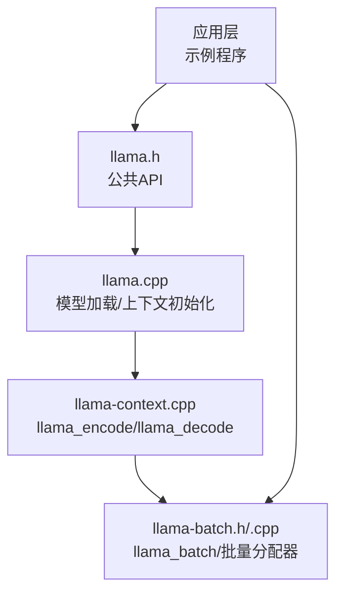
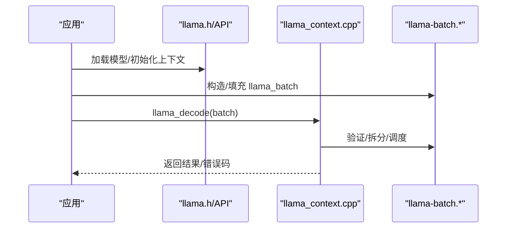
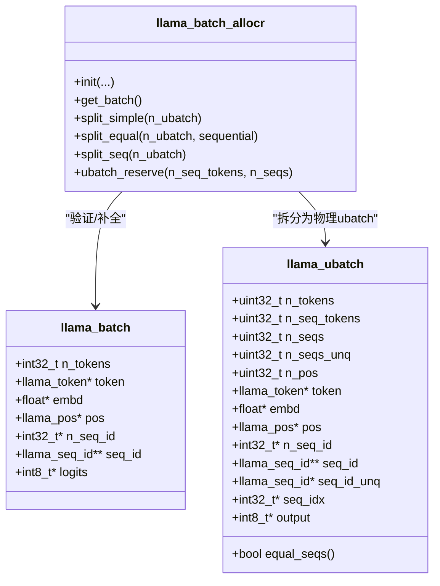
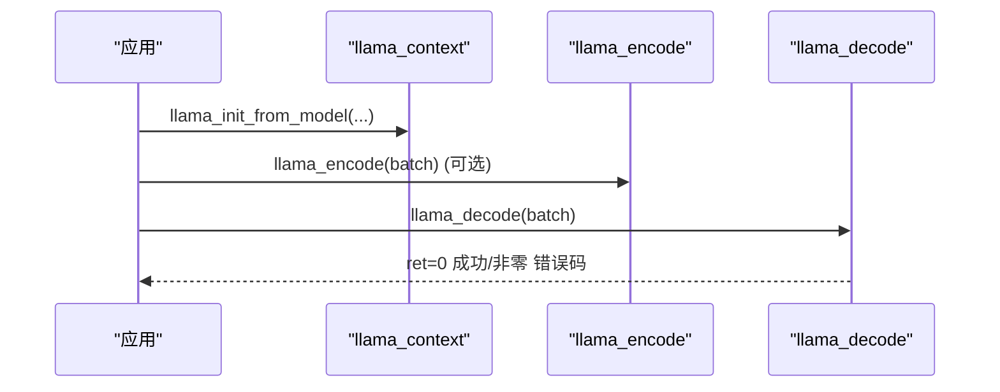
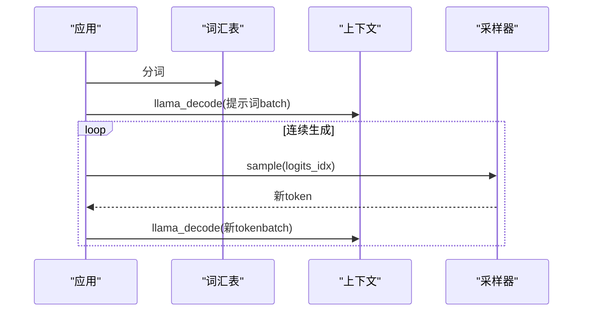
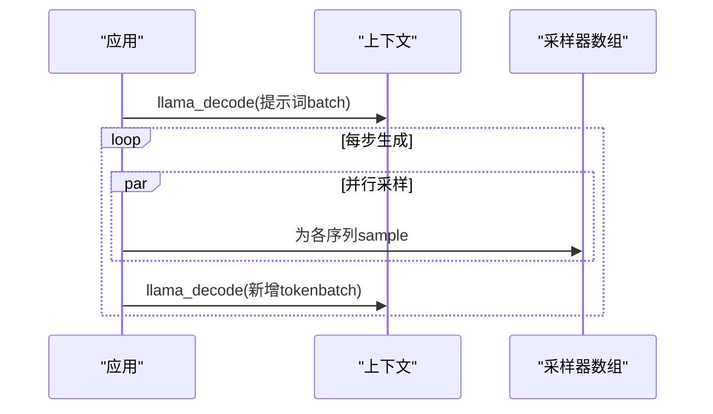
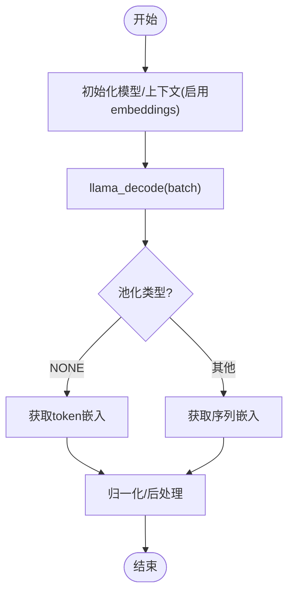
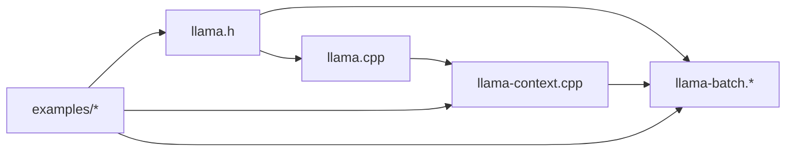

# 推理执行

<cite>
**本文引用的文件**
- [llama.h](file://include/llama.h)
- [llama.cpp](file://src/llama.cpp)
- [llama-batch.h](file://src/llama-batch.h)
- [llama-batch.cpp](file://src/llama-batch.cpp)
- [llama-context.cpp](file://src/llama-context.cpp)
- [simple.cpp](file://examples/simple/simple.cpp)
- [batched.cpp](file://examples/batched/batched.cpp)
- [embedding.cpp](file://examples/embedding/embedding.cpp)
</cite>

## 目录
1. [简介](#简介)
2. [项目结构](#项目结构)
3. [核心组件](#核心组件)
4. [架构总览](#架构总览)
5. [详细组件分析](#详细组件分析)
6. [依赖关系分析](#依赖关系分析)
7. [性能考虑](#性能考虑)
8. [故障排查指南](#故障排查指南)
9. [结论](#结论)
10. [附录](#附录)

## 简介
本文件面向 llama.cpp 的推理执行能力，提供系统化的 API 参考与实践指南。内容覆盖：
- 文本生成、嵌入提取、序列编码与解码的核心接口
- llama_batch 结构体的使用方式与批量处理机制
- 推理执行的完整流程：输入预处理、前向传播、采样与输出后处理
- 多种推理模式：连续生成、批量处理、嵌入生成
- 性能优化、内存管理与错误处理策略
- 基于仓库示例的实际调用路径与最佳实践

## 项目结构
围绕推理执行的关键模块与文件如下：
- 公共头文件与 API 定义：include/llama.h
- 批处理与批量分配器：src/llama-batch.h, src/llama-batch.cpp
- 上下文与推理入口：src/llama-context.cpp
- 示例程序：examples/simple/simple.cpp、examples/batched/batched.cpp、examples/embedding/embedding.cpp

图表来源
- [llama.h:235-244](file://include/llama.h#L235-L244)
- [llama-batch.h:15-69](file://src/llama-batch.h#L15-L69)
- [llama-batch.cpp:863-920](file://src/llama-batch.cpp#L863-L920)
- [llama-context.cpp:3440-3460](file://src/llama-context.cpp#L3440-L3460)

章节来源
- [llama.h:235-244](file://include/llama.h#L235-L244)
- [llama-batch.h:15-69](file://src/llama-batch.h#L15-L69)
- [llama-batch.cpp:863-920](file://src/llama-batch.cpp#L863-L920)
- [llama-context.cpp:3440-3460](file://src/llama-context.cpp#L3440-L3460)

## 核心组件
- llama_batch：描述一次前向计算的输入数据集合，支持 token 序列或显式嵌入输入，并可指定每个 token 的位置与所属序列。
- llama_context：封装模型状态、KV 缓存、采样器与性能计时等，提供 encode/decode 接口。
- llama_model：模型元信息与权重，通过 llama_model_load_from_file 等接口加载。

关键 API 与数据结构概览：
- llama_batch：字段包括 n_tokens、token/embd、pos、seq_id、n_seq_id、logits 等，用于描述输入与输出需求。
- llama_encode/llama_decode：对输入 batch 进行前向计算，返回非零错误码时表示失败。
- llama_batch_init/get_one/free：用于分配与释放 batch 内存。
- llama_context_params：控制上下文大小、批大小、线程数、池化类型、注意力类型、是否启用 GPU Offload 等。

章节来源
- [llama.h:235-244](file://include/llama.h#L235-L244)
- [llama.h:331-383](file://include/llama.h#L331-L383)
- [llama.cpp:384-434](file://src/llama.cpp#L384-L434)
- [llama-batch.cpp:863-920](file://src/llama-batch.cpp#L863-L920)

## 架构总览
llama.cpp 的推理执行由“应用层 → API 层 → 上下文层 → 批处理层”构成。应用层通过 llama.h 提供的 API 初始化模型与上下文；llama_context.cpp 实现 encode/decode 的核心逻辑；llama-batch.* 负责将输入组织为 batch 并进行合法性检查与拆分。

图表来源
- [llama.h:474-512](file://include/llama.h#L474-L512)
- [llama-context.cpp:3451-3460](file://src/llama-context.cpp#L3451-L3460)
- [llama-batch.cpp:25-389](file://src/llama-batch.cpp#L25-L389)

## 详细组件分析

### 组件一：llama_batch 结构与批量处理
- 字段语义
  - n_tokens：本次 batch 中的 token 数量
  - token/embd：分别表示 token 序列或显式嵌入向量
  - pos：每个 token 的位置（支持多维位置，如 M-RoPE）
  - seq_id/n_seq_id：每个 token 所属的一个或多个序列
  - logits：指示是否需要输出该 token 的 logits/嵌入
- 初始化与释放
  - llama_batch_init：按最大 token 数与序列数分配内存
  - llama_batch_get_one：快速构造单个序列的 batch
  - llama_batch_free：释放 batch 占用的内存
- 批量分配器（llama_batch_allocr）
  - 负责输入校验、缺失字段自动补全、位置一致性检查、耦合序列约束、序列集划分等
  - 支持三种拆分策略：简单拆分、等长序列集拆分、按序列集拆分

图表来源
- [llama.h:235-244](file://include/llama.h#L235-L244)
- [llama-batch.h:15-69](file://src/llama-batch.h#L15-L69)
- [llama-batch.h:72-174](file://src/llama-batch.h#L72-L174)

章节来源
- [llama.h:235-244](file://include/llama.h#L235-L244)
- [llama-batch.h:15-69](file://src/llama-batch.h#L15-L69)
- [llama-batch.h:72-174](file://src/llama-batch.h#L72-L174)
- [llama-batch.cpp:25-389](file://src/llama-batch.cpp#L25-L389)
- [llama-batch.cpp:863-920](file://src/llama-batch.cpp#L863-L920)

### 组件二：推理入口与执行流程
- llama_encode：对编码器输入（如 encoder-decoder 模型的编码阶段）进行前向
- llama_decode：对解码器输入（或纯解码模型）进行前向，返回非零错误码表示失败
- 性能统计：llama_perf_context_* 提供加载、提示词评估、生成评估的时间统计

图表来源
- [llama-context.cpp:3440-3460](file://src/llama-context.cpp#L3440-L3460)
- [llama.cpp:384-434](file://src/llama.cpp#L384-L434)

章节来源
- [llama-context.cpp:3440-3460](file://src/llama-context.cpp#L3440-L3460)
- [llama.cpp:384-434](file://src/llama.cpp#L384-L434)

### 组件三：文本生成（连续生成）
- 典型流程
  - 初始化模型与上下文，设置采样器链
  - 将提示词分词后放入 batch，llama_decode 计算提示词
  - 循环：采样下一个 token → 构造新 batch → llama_decode → 输出
- 关键点
  - 使用 llama_batch_get_one 快速构造单 token 输入
  - 通过 logits 控制是否输出 logits
  - 注意 KV 缓存容量与上下文长度限制

图表来源
- [simple.cpp:147-204](file://examples/simple/simple.cpp#L147-L204)
- [llama-batch.cpp:863-875](file://src/llama-batch.cpp#L863-L875)

章节来源
- [simple.cpp:147-204](file://examples/simple/simple.cpp#L147-L204)
- [llama-batch.cpp:863-875](file://src/llama-batch.cpp#L863-L875)

### 组件四：批量处理（多序列并行）
- 典型流程
  - 初始化多个采样器配置，每个对应一个序列
  - 构造初始 batch 包含所有序列的提示词，llama_decode 计算提示词
  - 主循环：对每个序列采样新 token → 添加到 batch → llama_decode
- 关键点
  - 通过 seq_id 指定每个 token 所属序列
  - logits 仅在需要时开启（如提示词最后一个 token）
  - 注意 n_batch 与 n_ctx 的设置以满足并行度与上下文需求

图表来源
- [batched.cpp:118-231](file://examples/batched/batched.cpp#L118-L231)

章节来源
- [batched.cpp:118-231](file://examples/batched/batched.cpp#L118-L231)

### 组件五：嵌入提取（Embedding）
- 典型流程
  - 设置 ctx_params.embeddings=true 启用嵌入输出
  - llama_decode 后，根据 pooling 类型选择 token 嵌入或序列嵌入
  - 对输出进行归一化等处理
- 关键点
  - pooling_type 控制是逐 token 还是按序列聚合
  - n_batch 通常设为 n_ctx 以充分利用上下文
  - 支持分类任务的 rerank 场景

图表来源
- [embedding.cpp:37-72](file://examples/embedding/embedding.cpp#L37-L72)
- [embedding.cpp:244-287](file://examples/embedding/embedding.cpp#L244-L287)

章节来源
- [embedding.cpp:37-72](file://examples/embedding/embedding.cpp#L37-L72)
- [embedding.cpp:244-287](file://examples/embedding/embedding.cpp#L244-L287)

## 依赖关系分析
- API 层（llama.h）定义了模型、上下文、采样器、batch 等核心类型与接口
- 实现层（llama.cpp、llama-context.cpp）负责模型加载、上下文初始化、encode/decode
- 批处理层（llama-batch.*）负责 batch 的合法性与拆分
- 示例层（examples/*）展示了典型调用路径

图表来源
- [llama.h:474-512](file://include/llama.h#L474-L512)
- [llama.cpp:384-434](file://src/llama.cpp#L384-L434)
- [llama-context.cpp:3440-3460](file://src/llama-context.cpp#L3440-L3460)
- [llama-batch.cpp:863-920](file://src/llama-batch.cpp#L863-L920)

章节来源
- [llama.h:474-512](file://include/llama.h#L474-L512)
- [llama.cpp:384-434](file://src/llama.cpp#L384-L434)
- [llama-context.cpp:3440-3460](file://src/llama-context.cpp#L3440-L3460)
- [llama-batch.cpp:863-920](file://src/llama-batch.cpp#L863-L920)

## 性能考虑
- 上下文与批大小
  - n_ctx、n_batch、n_ubatch 的合理设置直接影响吞吐与延迟
  - n_ubatch 通常不小于 n_batch（非因果模型）
- 线程与并行
  - n_threads / n_threads_batch 控制前向与批处理线程数
  - n_parallel 控制并行序列数量
- 设备与 Offload
  - n_gpu_layers、offload_kqv、op_offload 等参数影响显存占用与速度
- 性能计时
  - llama_perf_context_* 输出加载、提示词评估、生成评估耗时，便于定位瓶颈

章节来源
- [llama.h:331-383](file://include/llama.h#L331-L383)
- [llama.cpp:536-557](file://src/llama.cpp#L536-L557)

## 故障排查指南
- 常见错误码与含义
  - llama_decode 返回 1：上下文超限（n_ctx 不足）
  - llama_decode 返回 -1：输入 batch 非法
  - llama_decode 返回 < -1：计算错误
- 建议排查步骤
  - 检查 n_ctx 是否足够容纳提示词与生成长度
  - 检查 batch 的 seq_id、pos、logits 是否正确设置
  - 检查 KV 缓存是否被清空或截断导致位置不连续
  - 在服务端场景中，结合日志与错误字符串定位具体 slot/序列

章节来源
- [server-context.cpp:2795-2826](file://tools/server/server-context.cpp#L2795-L2826)

## 结论
llama.cpp 的推理执行以 llama_batch 为核心载体，通过 encode/decode 将输入组织为高效的张量计算图。配合合理的上下文与批处理参数、设备 offload 以及采样器链，可在多种场景（连续生成、批量并行、嵌入提取）下获得稳定且高性能的推理体验。建议在生产环境中结合性能计时与日志，持续监控与优化关键路径。

## 附录
- API 一览（节选）
  - 模型与上下文：llama_model_load_from_file、llama_init_from_model、llama_free
  - 批处理：llama_batch_init、llama_batch_get_one、llama_batch_free
  - 推理：llama_encode、llama_decode
  - 性能：llama_perf_context_*、llama_time_us

章节来源
- [llama.h:474-512](file://include/llama.h#L474-L512)
- [llama-batch.cpp:863-920](file://src/llama-batch.cpp#L863-L920)
- [llama-context.cpp:3440-3460](file://src/llama-context.cpp#L3440-L3460)