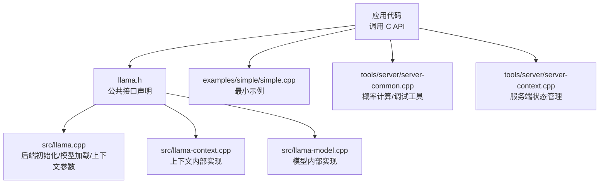
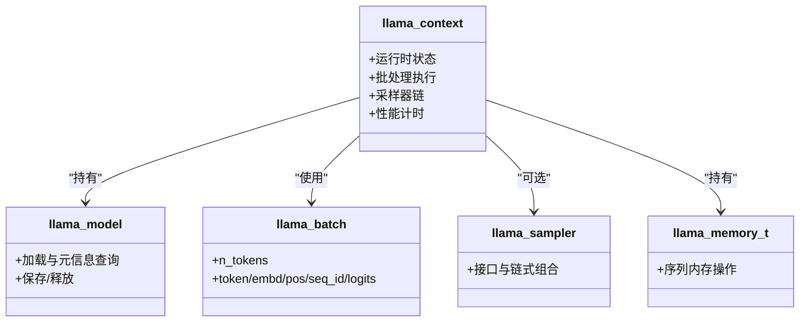
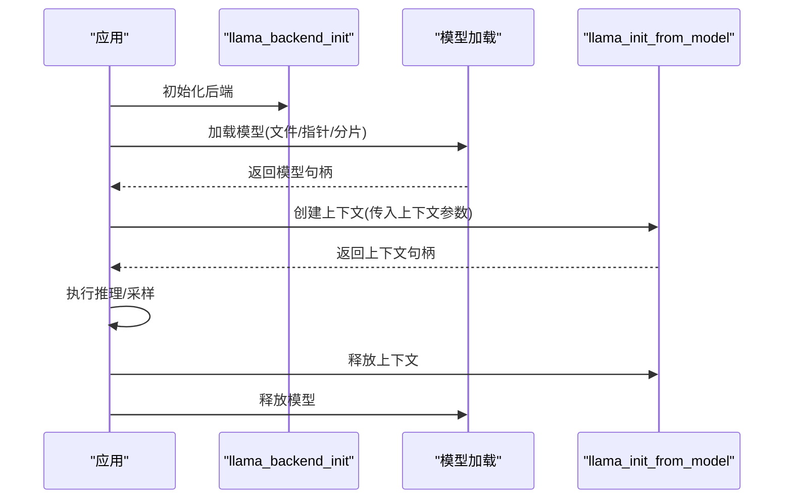
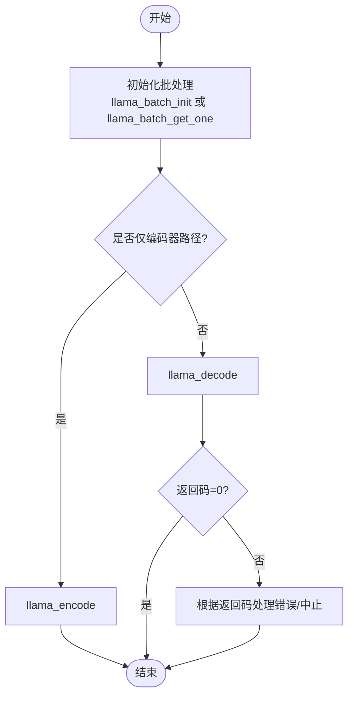
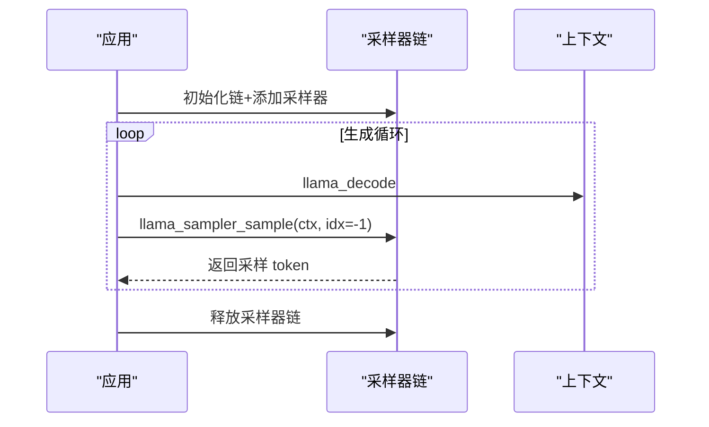
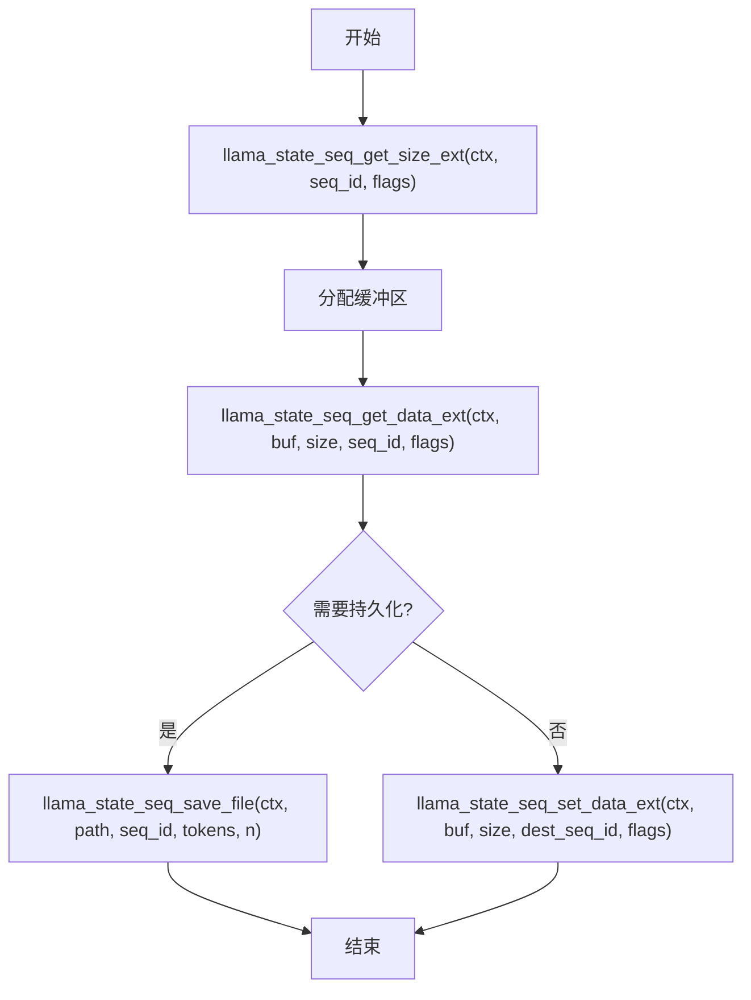
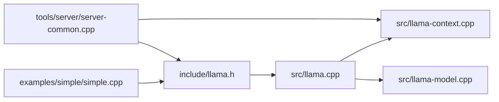
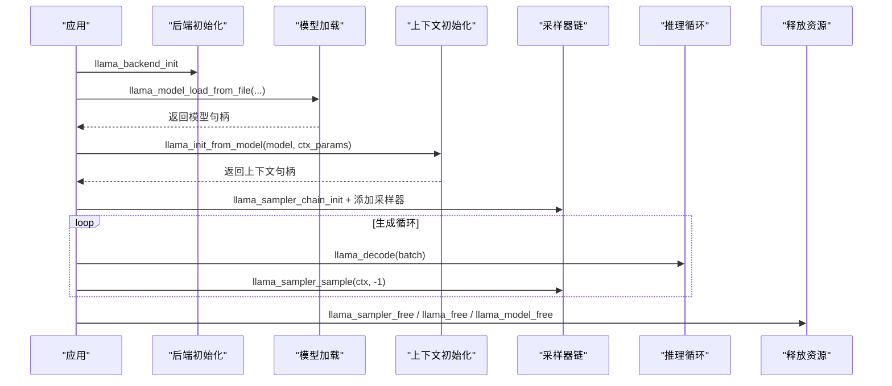

# 核心 API 参考

<cite>
**本文档引用的文件**
- [llama.h](file://include/llama.h)
- [llama-cpp.h](file://include/llama-cpp.h)
- [llama.cpp](file://src/llama.cpp)
- [llama-context.cpp](file://src/llama-context.cpp)
- [llama-model.cpp](file://src/llama-model.cpp)
- [simple.cpp](file://examples/simple/simple.cpp)
- [server-common.cpp](file://tools/server/server-common.cpp)
- [server-context.cpp](file://tools/server/server-context.cpp)
</cite>

## 目录
1. [简介](#简介)
2. [项目结构](#项目结构)
3. [核心组件](#核心组件)
4. [架构总览](#架构总览)
5. [详细组件分析](#详细组件分析)
6. [依赖关系分析](#依赖关系分析)
7. [性能考虑](#性能考虑)
8. [故障排除指南](#故障排除指南)
9. [结论](#结论)
10. [附录](#附录)

## 简介
本参考文档面向 llama.cpp 的 C API，系统性梳理公共接口函数、数据结构与使用流程，重点覆盖以下方面：
- 模型加载与上下文初始化：llama_model_* 与 llama_init_from_model
- 推理执行：llama_encode / llama_decode 与批处理 llama_batch
- 上下文管理：线程数设置、嵌入提取、采样器链
- 会话状态：序列状态保存/恢复、全局状态序列化
- 错误处理与返回码语义
- 线程安全性与并发注意事项
- 性能计时与度量工具
- 完整的生命周期示例（从初始化到清理）

## 项目结构
llama.cpp 的 C API 主要由以下部分组成：
- 头文件定义：include/llama.h（公共 API 声明）、include/llama-cpp.h（C++ RAII 包装）
- 核心实现：src/llama.cpp（后端初始化、模型加载、上下文参数等）、src/llama-context.cpp（上下文内部实现）、src/llama-model.cpp（模型内部实现）
- 示例与工具：examples/simple/simple.cpp 展示最小可用流程；tools/server 下的实现展示了复杂场景下的状态管理与采样

**图表来源**
- [llama.h:1-1566](file://include/llama.h#L1-L1566)
- [llama.cpp:1-200](file://src/llama.cpp#L1-L200)
- [llama-context.cpp:1-200](file://src/llama-context.cpp#L1-L200)
- [llama-model.cpp:1-200](file://src/llama-model.cpp#L1-L200)
- [simple.cpp:1-224](file://examples/simple/simple.cpp#L1-L224)
- [server-common.cpp:1260-1309](file://tools/server/server-common.cpp#L1260-L1309)
- [server-context.cpp:1-200](file://tools/server/server-context.cpp#L1-L200)

**章节来源**
- [llama.h:1-1566](file://include/llama.h#L1-L1566)
- [llama.cpp:1-200](file://src/llama.cpp#L1-L200)
- [llama-context.cpp:1-200](file://src/llama-context.cpp#L1-L200)
- [llama-model.cpp:1-200](file://src/llama-model.cpp#L1-L200)
- [simple.cpp:1-224](file://examples/simple/simple.cpp#L1-L224)
- [server-common.cpp:1260-1309](file://tools/server/server-common.cpp#L1260-L1309)
- [server-context.cpp:1-200](file://tools/server/server-context.cpp#L1-L200)

## 核心组件
本节概述 C API 的关键类型与函数族，帮助快速定位功能。

- 类型与枚举
  - 基本类型：llama_token、llama_pos、llama_seq_id、llama_memory_t
  - 枚举：llama_vocab_type、llama_rope_type、llama_token_type、llama_token_attr、llama_ftype、llama_rope_scaling_type、llama_pooling_type、llama_attention_type、llama_flash_attn_type、llama_split_mode
  - 数据结构：llama_token_data、llama_token_data_array、llama_batch、llama_model_params、llama_context_params、llama_model_quantize_params、llama_sampler_chain_params、llama_chat_message、llama_logit_bias

- 后端与初始化
  - llama_backend_init / llama_backend_free：初始化/释放后端
  - llama_numa_init：NUMA 优化
  - llama_time_us：微秒级时间戳
  - llama_max_devices / llama_max_tensor_buft_overrides：设备与覆盖限制查询
  - llama_supports_*：特性检测（mmap/mlock/GPU RPC）

- 模型加载与管理
  - llama_model_load_from_file / llama_model_load_from_file_ptr / llama_model_load_from_splits：从文件/指针/多分片加载
  - llama_model_init_from_user：自定义张量数据源
  - llama_model_save_to_file：保存模型
  - llama_model_free：释放模型
  - llama_init_from_model：基于模型创建上下文
  - llama_free：释放上下文
  - llama_get_model / llama_get_memory / llama_pooling_type：查询上下文关联对象与池化类型

- 模型元信息与能力
  - llama_model_* 系列：上下文大小、嵌入维度、层数、头数、SWA 等
  - llama_model_meta_*：元数据键值访问
  - llama_model_chat_template / llama_model_n_params / llama_model_size：模板、参数量、模型大小
  - llama_model_has_encoder / llama_model_has_decoder / llama_model_decoder_start_token：编码器/解码器能力
  - llama_model_is_*：模型类型判断（递归/混合/扩散）

- 量化与适配器
  - llama_model_quantize：量化模型
  - llama_adapter_lora_*：LoRA 适配器加载/元数据/释放
  - llama_set_adapters_lora / llama_set_adapter_cvec：在上下文中设置适配器

- 内存与状态
  - llama_memory_*：序列内存操作（删除/复制/保留/位移/缩放）
  - llama_state_* / llama_state_seq_*：全局状态与序列状态的序列化/反序列化
  - llama_state_save_file / llama_state_load_file：会话文件读写

- 编码/解码与批处理
  - llama_batch_get_one / llama_batch_init / llama_batch_free：批处理构建与释放
  - llama_encode / llama_decode：编码器路径与解码器路径
  - llama_set_n_threads / llama_n_threads / llama_n_threads_batch：线程数设置与查询
  - llama_set_embeddings / llama_set_causal_attn / llama_set_warmup / llama_set_abort_callback / llama_synchronize：运行期控制
  - llama_get_logits / llama_get_logits_ith / llama_get_embeddings / llama_get_embeddings_ith / llama_get_embeddings_seq：输出访问

- 采样与概率
  - llama_sampler_*：采样器接口与链式采样器
  - llama_sampler_init_*：各类采样器工厂（贪心、随机、Top-K、Top-P、Min-P、Typical、温度、XTC、Top-n-σ、Mirostat、语法、惩罚、DRY、自适应P、Logit Bias、Infill）
  - llama_sampler_sample：对指定位置进行采样
  - llama_get_sampled_*：后端采样结果访问

- 词汇表与分词
  - llama_tokenize / llama_token_to_piece / llama_detokenize：文本与 token 转换
  - llama_vocab_*：词汇表查询与特殊 token 访问

- 聊天模板
  - llama_chat_apply_template / llama_chat_builtin_templates：模板应用与内置模板列表

- 日志与性能
  - llama_log_*：日志回调设置
  - llama_perf_context_* / llama_perf_sampler_*：性能统计与打印

**章节来源**
- [llama.h:60-1566](file://include/llama.h#L60-L1566)
- [llama.cpp:37-112](file://src/llama.cpp#L37-L112)
- [llama-context.cpp:24-200](file://src/llama-context.cpp#L24-L200)
- [llama-model.cpp:1-200](file://src/llama-model.cpp#L1-L200)

## 架构总览
llama.cpp 的 C API 将“模型”和“上下文”解耦：
- llama_model：描述模型结构、权重与元信息，负责加载与元数据查询
- llama_context：持有运行时状态（KV 缓存、采样器、线程池、性能计时等），承载推理过程
- llama_batch：批处理抽象，支持 token 序列与嵌入两种输入方式

**图表来源**
- [llama.h:60-1566](file://include/llama.h#L60-L1566)
- [llama-context.cpp:24-200](file://src/llama-context.cpp#L24-L200)

## 详细组件分析

### 模型加载与上下文初始化
- 模型加载
  - 支持从文件、FILE 指针或多个分片加载；支持进度回调与 KV 覆盖
  - 返回模型句柄或空指针（失败）
- 上下文初始化
  - 通过 llama_init_from_model 创建上下文，传入 llama_context_params
  - 参数包括上下文长度、批大小、线程数、RoPE/YARN 设置、池化类型、注意力类型、Flash Attention 开关、K/V 缓存类型、采样器链等
- 生命周期
  - 成功后需在使用完毕后调用 llama_free 释放上下文，再调用 llama_model_free 释放模型

**图表来源**
- [llama.h:440-520](file://include/llama.h#L440-L520)
- [llama.cpp:83-112](file://src/llama.cpp#L83-L112)
- [llama-context.cpp:24-200](file://src/llama-context.cpp#L24-L200)

**章节来源**
- [llama.h:440-520](file://include/llama.h#L440-L520)
- [llama.cpp:83-112](file://src/llama.cpp#L83-L112)
- [llama-context.cpp:24-200](file://src/llama-context.cpp#L24-L200)

### 推理执行与批处理
- 批处理
  - llama_batch_get_one：快速构造单序列批
  - llama_batch_init：按最大 token 数初始化批，支持嵌入或 token 输入
  - llama_batch_free：释放批
- 编码/解码
  - llama_encode：仅编码器路径（如 encoder-decoder），将输出内部缓存以供后续解码器使用
  - llama_decode：解码器路径（或带 KV 缓存的通用路径），返回码语义明确：0 成功，正数警告（如无可用 KV 插槽），负数致命错误
- 线程与性能
  - llama_set_n_threads：设置生成与批处理线程数
  - llama_synchronize：等待计算完成
  - llama_get_logits / llama_get_embeddings：获取输出

**图表来源**
- [llama.h:917-972](file://include/llama.h#L917-L972)
- [llama.cpp:114-169](file://src/llama.cpp#L114-L169)

**章节来源**
- [llama.h:917-972](file://include/llama.h#L917-L972)
- [llama.cpp:114-169](file://src/llama.cpp#L114-L169)

### 上下文参数与运行期控制
- 上下文参数
  - n_ctx / n_batch / n_ubatch / n_seq_max：上下文长度、批大小、物理批大小、最大序列数
  - n_threads / n_threads_batch：生成与批处理线程数
  - rope_scaling_type / rope_freq_base / rope_freq_scale / yarn_*：RoPE/YARN 配置
  - pooling_type / attention_type / flash_attn_type：池化、注意力与 Flash Attention
  - type_k / type_v：K/V 缓存数据类型
  - cb_eval / abort_callback：评估回调与中止回调
  - embeddings / offload_kqv / no_perf / op_offload / swa_full / kv_unified / samplers：运行期开关与采样器链
- 运行期控制
  - llama_set_embeddings / llama_set_causal_attn / llama_set_warmup / llama_set_abort_callback / llama_synchronize
  - llama_n_threads / llama_n_threads_batch 查询当前线程数

**章节来源**
- [llama.h:331-383](file://include/llama.h#L331-L383)
- [llama.h:943-972](file://include/llama.h#L943-L972)

### 采样器与概率
- 采样器接口
  - llama_sampler_i：名称、接受、应用、重置、克隆、释放与后端接口（可选）
  - llama_sampler_chain_*：链式采样器的初始化、添加、查询、移除
- 工厂函数
  - llama_sampler_init_greedy / llama_sampler_init_dist / llama_sampler_init_top_k / llama_sampler_init_top_p / llama_sampler_init_min_p / llama_sampler_init_typical / llama_sampler_init_temp / llama_sampler_init_temp_ext / llama_sampler_init_xtc / llama_sampler_init_top_n_sigma / llama_sampler_init_mirostat / llama_sampler_init_mirostat_v2 / llama_sampler_init_grammar / llama_sampler_init_grammar_lazy_patterns / llama_sampler_init_penalties / llama_sampler_init_dry / llama_sampler_init_adaptive_p / llama_sampler_init_logit_bias / llama_sampler_init_infill
- 使用流程
  - 初始化采样器链，按需添加各采样器，最后以“选择器”采样器收尾
  - 在每次生成前调用 llama_sampler_sample 获取 token

**图表来源**
- [llama.h:1174-1471](file://include/llama.h#L1174-L1471)

**章节来源**
- [llama.h:1174-1471](file://include/llama.h#L1174-L1471)

### 会话状态与序列状态
- 全局状态
  - llama_state_get_size / llama_state_get_data / llama_state_set_data：获取/设置全局状态（含 logits/embedding/KV）
  - llama_state_save_file / llama_state_load_file：保存/加载会话文件
- 序列状态
  - llama_state_seq_get_size / llama_state_seq_get_data / llama_state_seq_set_data：序列级状态序列化/反序列化
  - llama_state_seq_save_file / llama_state_seq_load_file：序列状态文件读写
  - llama_state_seq_get_size_ext / llama_state_seq_get_data_ext / llama_state_seq_set_data_ext：扩展标志（如仅 SWA/KV 缓存）

**图表来源**
- [llama.h:824-887](file://include/llama.h#L824-L887)

**章节来源**
- [llama.h:824-887](file://include/llama.h#L824-L887)

### 词汇表与分词
- 词汇表访问：llama_vocab_*（文本/分数/属性/特殊 token）
- 分词：llama_tokenize（文本->token）、llama_token_to_piece（token->piece）、llama_detokenize（token->文本）
- 特殊标记：BOS/EOS/EOT/SEP/NL/PAD/MASK/FIM_* 等

**章节来源**
- [llama.h:1039-1147](file://include/llama.h#L1039-L1147)

### 聊天模板
- llama_chat_apply_template：应用内置模板格式化对话
- llama_chat_builtin_templates：获取内置模板列表

**章节来源**
- [llama.h:1148-1172](file://include/llama.h#L1148-L1172)

### 日志与性能
- 日志：llama_log_get / llama_log_set
- 性能：llama_perf_context_* / llama_perf_sampler_*（统计、打印、重置）

**章节来源**
- [llama.h:1489-1527](file://include/llama.h#L1489-L1527)

## 依赖关系分析
- 头文件依赖
  - llama.h 依赖 ggml、ggml-backend、gguf 等底层库头文件
- 实现依赖
  - llama.cpp 调用 llama-context.cpp 与 llama-model.cpp 的内部实现
  - 服务器示例依赖 common/sampling/speculative 等模块

**图表来源**
- [llama.h:1-14](file://include/llama.h#L1-L14)
- [llama.cpp:1-28](file://src/llama.cpp#L1-L28)
- [llama-context.cpp:1-13](file://src/llama-context.cpp#L1-L13)
- [llama-model.cpp:1-18](file://src/llama-model.cpp#L1-L18)
- [simple.cpp:1-7](file://examples/simple/simple.cpp#L1-L7)
- [server-common.cpp:1-11](file://tools/server/server-common.cpp#L1-L11)

**章节来源**
- [llama.h:1-14](file://include/llama.h#L1-L14)
- [llama.cpp:1-28](file://src/llama.cpp#L1-L28)
- [llama-context.cpp:1-13](file://src/llama-context.cpp#L1-L13)
- [llama-model.cpp:1-18](file://src/llama-model.cpp#L1-L18)
- [simple.cpp:1-7](file://examples/simple/simple.cpp#L1-L7)
- [server-common.cpp:1-11](file://tools/server/server-common.cpp#L1-L11)

## 性能考虑
- 线程配置
  - 合理设置 n_threads 与 n_threads_batch，避免过载导致缓存抖动
- 批处理策略
  - n_batch 与 n_ubatch 的关系：n_ubatch 不得超过 n_batch；嵌入模式要求 n_batch==n_ubatch
- KV 缓存与池化
  - embeddings=true 时注意输出布局与性能权衡
  - pooling_type 影响嵌入聚合方式
- 设备与卸载
  - offload_kqv/op_offload/swa_full/kv_unified 等参数影响内存占用与吞吐
- 性能度量
  - 使用 llama_perf_context_* 与 llama_perf_sampler_* 获取耗时与采样统计

**章节来源**
- [llama.h:331-383](file://include/llama.h#L331-L383)
- [llama.h:1496-1527](file://include/llama.h#L1496-L1527)

## 故障排除指南
- 返回码语义
  - llama_decode：0 成功；>0 警告（如无可用 KV 插槽）；<0 致命错误；2 表示被中止
- 中止与回调
  - 通过 abort_callback 与 llama_set_abort_callback 实现中断
- 错误处理建议
  - 模型加载失败返回空指针；批处理失败检查 n_tokens 与 seq_id 对齐
  - 量化/适配器失败检查参数与元数据一致性
- 日志
  - 使用 llama_log_set 设置统一日志回调，便于定位问题

**章节来源**
- [llama.h:927-941](file://include/llama.h#L927-L941)
- [llama.h:966-967](file://include/llama.h#L966-L967)
- [llama.cpp:114-169](file://src/llama.cpp#L114-L169)

## 结论
llama.cpp 的 C API 提供了从模型加载、上下文管理到推理执行、采样与状态持久化的完整能力。通过合理的参数配置与批处理策略，可在多硬件后端上获得稳定且高性能的推理体验。建议在生产环境中结合性能计时与日志回调，持续监控关键指标并及时调整参数。

## 附录

### API 使用流程示例（最小可用）
以下流程对应 examples/simple/simple.cpp 的核心步骤，展示从初始化到清理的完整生命周期：

**图表来源**
- [simple.cpp:80-224](file://examples/simple/simple.cpp#L80-L224)
- [llama.h:440-520](file://include/llama.h#L440-L520)
- [llama.h:1174-1471](file://include/llama.h#L1174-L1471)

**章节来源**
- [simple.cpp:80-224](file://examples/simple/simple.cpp#L80-L224)

### C++ RAII 包装
- include/llama-cpp.h 提供基于 std::unique_ptr 的 RAII 包装，自动释放模型、上下文、采样器与 LoRA 适配器，降低资源泄漏风险。

**章节来源**
- [llama-cpp.h:1-31](file://include/llama-cpp.h#L1-L31)