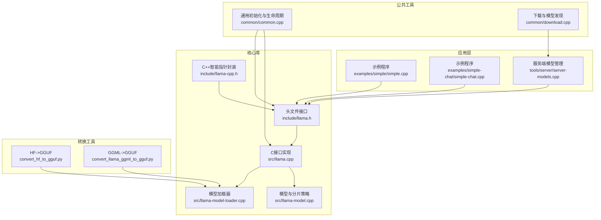
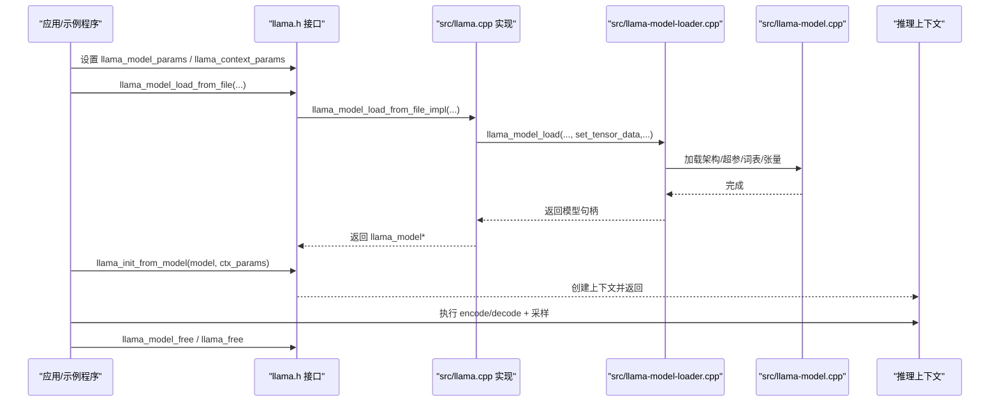
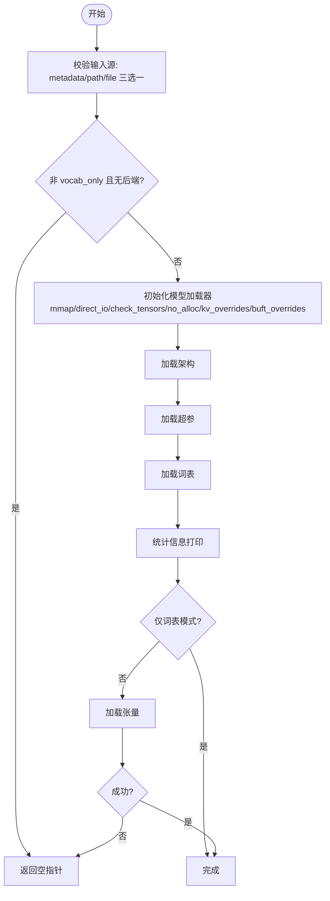
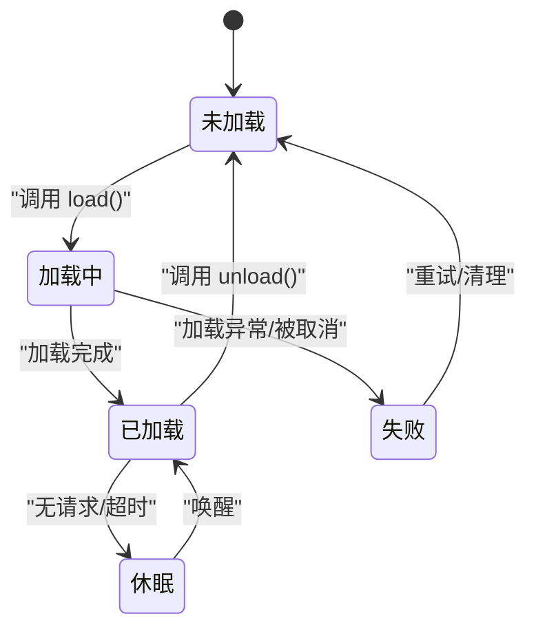
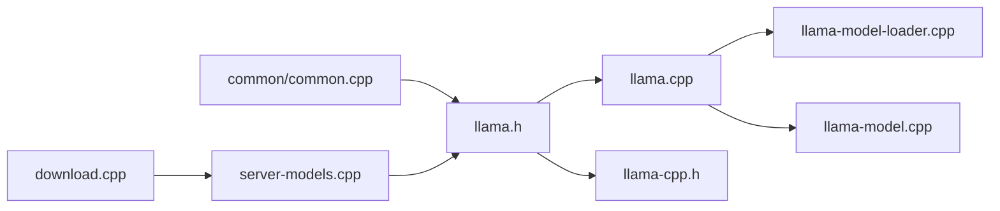

# 模型管理

<cite>
**本文引用的文件**
- [llama.h](file://include/llama.h)
- [llama-cpp.h](file://include/llama-cpp.h)
- [llama.cpp](file://src/llama.cpp)
- [llama-model-loader.cpp](file://src/llama-model-loader.cpp)
- [llama-model.cpp](file://src/llama-model.cpp)
- [simple.cpp](file://examples/simple/simple.cpp)
- [simple-chat.cpp](file://examples/simple-chat/simple-chat.cpp)
- [common.cpp](file://common/common.cpp)
- [server-models.cpp](file://tools/server/server-models.cpp)
- [server-models.h](file://tools/server/server-models.h)
- [download.cpp](file://common/download.cpp)
- [convert_hf_to_gguf.py](file://convert_hf_to_gguf.py)
- [convert_llama_ggml_to_gguf.py](file://convert_llama_ggml_to_gguf.py)
</cite>

## 目录
1. [简介](#简介)
2. [项目结构](#项目结构)
3. [核心组件](#核心组件)
4. [架构总览](#架构总览)
5. [详细组件分析](#详细组件分析)
6. [依赖关系分析](#依赖关系分析)
7. [性能考量](#性能考量)
8. [故障排查指南](#故障排查指南)
9. [结论](#结论)
10. [附录](#附录)

## 简介
本文件为 llama.cpp 的“模型管理”API参考与实践指南，覆盖模型加载、初始化、配置、上下文创建、采样器链、适配器（LoRA）以及释放等全生命周期流程。重点解释 llama_model_params、llama_context_params、量化类型选择与性能优化策略，并提供从单机示例到服务端模型实例管理的端到端参考。

## 项目结构
围绕模型管理的关键目录与文件：
- 头文件与C/C++封装：include/llama.h、include/llama-cpp.h
- 核心实现：src/llama.cpp、src/llama-model-loader.cpp、src/llama-model.cpp
- 示例程序：examples/simple/simple.cpp、examples/simple-chat/simple-chat.cpp
- 通用初始化与生命周期：common/common.cpp
- 服务端模型实例管理：tools/server/server-models.cpp、tools/server/server-models.h
- 下载与模型发现：common/download.cpp
- 转换脚本（HF/GGML 到 GGUF）：convert_hf_to_gguf.py、convert_llama_ggml_to_gguf.py

图表来源
- [llama.h](file://include/llama.h)
- [llama.cpp](file://src/llama.cpp)
- [llama-model-loader.cpp](file://src/llama-model-loader.cpp)
- [llama-model.cpp](file://src/llama-model.cpp)
- [llama-cpp.h](file://include/llama-cpp.h)
- [simple.cpp](file://examples/simple/simple.cpp)
- [simple-chat.cpp](file://examples/simple-chat/simple-chat.cpp)
- [common.cpp](file://common/common.cpp)
- [server-models.cpp](file://tools/server/server-models.cpp)
- [download.cpp](file://common/download.cpp)
- [convert_hf_to_gguf.py](file://convert_hf_to_gguf.py)
- [convert_llama_ggml_to_gguf.py](file://convert_llama_ggml_to_gguf.py)

章节来源
- [llama.h](file://include/llama.h)
- [llama.cpp](file://src/llama.cpp)
- [llama-model-loader.cpp](file://src/llama-model-loader.cpp)
- [llama-model.cpp](file://src/llama-model.cpp)
- [llama-cpp.h](file://include/llama-cpp.h)
- [simple.cpp](file://examples/simple/simple.cpp)
- [simple-chat.cpp](file://examples/simple-chat/simple-chat.cpp)
- [common.cpp](file://common/common.cpp)
- [server-models.cpp](file://tools/server/server-models.cpp)
- [download.cpp](file://common/download.cpp)
- [convert_hf_to_gguf.py](file://convert_hf_to_gguf.py)
- [convert_llama_ggml_to_gguf.py](file://convert_llama_ggml_to_gguf.py)

## 核心组件
- 模型句柄与上下文
  - llama_model：模型对象句柄，持有权重、超参、词汇表等
  - llama_context：推理上下文，维护KV缓存、批处理、采样器链等
- 关键参数结构
  - llama_model_params：控制模型加载行为（设备、分片、回调、元数据覆盖、IO策略等）
  - llama_context_params：控制上下文大小、批大小、线程数、RoPE/YaRN参数、后端调度回调、采样器链等
  - llama_model_quantize_params：量化参数（目标类型、是否纯量化、是否仅复制、imatrix、KV覆盖、张量覆盖等）
- 辅助封装
  - llama_model_ptr、llama_context_ptr：基于 RAII 的自动释放

章节来源
- [llama.h](file://include/llama.h)
- [llama-cpp.h](file://include/llama-cpp.h)

## 架构总览
模型管理的端到端流程：应用通过 C 接口加载模型、初始化上下文、设置采样器链、执行推理、最后释放资源；服务端还负责多实例生命周期管理与状态轮询。

图表来源
- [llama.h](file://include/llama.h)
- [llama.cpp](file://src/llama.cpp)
- [llama-model-loader.cpp](file://src/llama-model-loader.cpp)
- [llama-model.cpp](file://src/llama-model.cpp)

## 详细组件分析

### 1) 模型加载与初始化（llama_model_load_from_file 系列）
- 入口函数
  - llama_model_load_from_file：从文件路径加载模型
  - llama_model_load_from_file_ptr：从已打开的 FILE* 加载
  - llama_model_load_from_splits：支持自定义命名的多分片加载
  - llama_model_init_from_user：从 GGUF 元数据与用户提供的张量数据回调构建模型
- 关键流程
  - 参数校验（三者只能选其一作为输入源）
  - 后端可用性检查（若非 vocab_only）
  - 初始化加载器（支持 mmap/direct_io/check_tensors/no_alloc/kv_overrides/tensor_buft_overrides）
  - 加载架构、超参、词表、统计信息
  - 可选跳过权重（vocab_only）
  - 加载张量（可被进度回调中断）

图表来源
- [llama.cpp](file://src/llama.cpp)
- [llama-model-loader.cpp](file://src/llama-model-loader.cpp)

章节来源
- [llama.h](file://include/llama.h)
- [llama.cpp](file://src/llama.cpp)
- [llama-model-loader.cpp](file://src/llama-model-loader.cpp)

### 2) 上下文创建与参数（llama_init_from_model / llama_context_params）
- llama_init_from_model：基于已加载模型创建推理上下文
- 关键参数
  - n_ctx/n_batch/n_ubatch/n_seq_max：上下文长度、逻辑/物理批大小、最大并发序列
  - n_threads/n_threads_batch：主/批处理线程数
  - rope_scaling_type/rope_freq_base/rope_freq_scale/yarn_*：RoPE/YaRN 配置
  - type_k/type_v：K/V 缓存数据类型（实验性）
  - embeddings/offload_kqv/op_offload：嵌入提取、KQV卸载、主机算子卸载
  - no_perf、cb_eval/abort_callback：性能计时、评估回调、中止回调
  - samplers/n_samplers：后端采样器链（需保持生命周期）

章节来源
- [llama.h](file://include/llama.h)
- [llama.cpp](file://src/llama.cpp)

### 3) 模型参数结构详解（llama_model_params）
- 设备与分片
  - devices：设备列表（NULL 表示使用全部可用设备）
  - n_gpu_layers：存储于显存的层数（负值表示全部）
  - split_mode：分片模式（单卡/按层/按行/张量并行）
  - main_gpu：单卡模式下使用的GPU编号
  - tensor_split：按GPU分配比例（逐设备）
  - tensor_buft_overrides：按模式匹配的张量缓冲区类型覆盖
- 回调与元数据
  - progress_callback/progress_callback_user_data：加载进度回调（返回true继续，false中止）
  - kv_overrides：模型元数据键值覆盖（如采样相关参数）
- I/O与校验
  - use_mmap/use_direct_io/use_mlock：内存映射/直读/强制常驻内存
  - check_tensors：校验张量数据
  - use_extra_bufts/no_host/no_alloc：额外缓冲区、绕过主机缓冲、仅模拟分配

章节来源
- [llama.h](file://include/llama.h)

### 4) 量化类型与转换（llama_ftype 与转换脚本）
- 支持的量化类型（部分列举）
  - F32/F16/BF16/Q4_0/Q4_1/Q5_0/Q5_1/Q8_0、Q2_K/Q3_K_S/Q3_K_M/Q3_K_L/Q4_K_S/Q4_K_M/Q5_K_S/Q5_K_M/Q6_K、
  - IQ2_XXS/IQ2_XS/IQ2_S/IQ2_M/IQ3_XS/IQ3_XXS/IQ1_S/IQ1_M/IQ4_NL/IQ4_XS/IQ3_S/IQ3_M、
  - TQ1_0/TQ2_0、MXFP4 MoE、NVFP4、Q1_0、GUESSED
- 选择建议
  - 优先 F16（精度与体积平衡），其次 BF16（部分硬件更友好）
  - 小模型或显存紧张：考虑 Q4_K 系列；大模型：Q5_K/M 或更高精度
  - 低显存/移动端：Q2_K_S/Q3_K_S；对质量敏感：Q4_K_M/Q5_K_M
- 转换工具
  - convert_hf_to_gguf.py：将 HuggingFace 模型转为 GGUF，自动推断量化类型
  - convert_llama_ggml_to_gguf.py：将旧版 GGML/GGMF/GGJT 转为 GGUF

章节来源
- [llama.h](file://include/llama.h)
- [llama-model-loader.cpp](file://src/llama-model-loader.cpp)
- [convert_hf_to_gguf.py](file://convert_hf_to_gguf.py)
- [convert_llama_ggml_to_gguf.py](file://convert_llama_ggml_to_gguf.py)

### 5) 分片与张量拆分策略（多GPU/多设备）
- 分片模式
  - LLAMA_SPLIT_MODE_NONE：单GPU
  - LLAMA_SPLIT_MODE_LAYER：按层与KV跨GPU拆分
  - LLAMA_SPLIT_MODE_ROW：按行与KV跨GPU拆分，支持张量并行
  - LLAMA_SPLIT_MODE_TENSOR：张量级拆分
- 自动拆分规则
  - 基于张量名称正则匹配（注意力Q/K/V/FFN/输出/SSM等）确定轴与段
  - 计算 granular 分块大小，结合 tensor_split 与旋转避免 aliasing
  - 支持 Recurrent/Jamba/Granite 等特殊架构的拆分差异

章节来源
- [llama.h](file://include/llama.h)
- [llama-model.cpp](file://src/llama-model.cpp)

### 6) 采样器链与后端采样（可选）
- llama_sampler_chain_*：初始化采样器链，添加贪心/最小概率/温度/分布等采样器
- llama_context_params 中可直接注入后端采样器链（需保持生命周期）

章节来源
- [llama.h](file://include/llama.h)
- [simple-chat.cpp](file://examples/simple-chat/simple-chat.cpp)

### 7) 适配器（LoRA）加载与应用
- llama_adapter_lora_init：从文件加载 LoRA 适配器
- llama_set_adapters_lora：在上下文中设置/切换适配器及其缩放
- llama_adapter_meta_*：读取适配器元数据（如任务名、提示前缀等）

章节来源
- [llama.h](file://include/llama.h)

### 8) 生命周期管理（加载 → 推理 → 释放）
- 单机示例
  - 初始化后端 → 构造 llama_model_params → llama_model_load_from_file → 获取 vocab → 构造 llama_context_params → llama_init_from_model → 推理循环（encode/decode + 采样）→ llama_model_free / llama_free
- 服务端模型实例
  - server_models::load/unload：启动/终止子进程实例，跟踪状态（UNLOADED/LOADING/LOADED/SLEEPING）
  - 状态轮询与失败处理，支持 LRU 淘汰与容量限制

图表来源
- [server-models.h](file://tools/server/server-models.h)
- [server-models.cpp](file://tools/server/server-models.cpp)

章节来源
- [simple.cpp](file://examples/simple/simple.cpp)
- [simple-chat.cpp](file://examples/simple-chat/simple-chat.cpp)
- [common.cpp](file://common/common.cpp)
- [server-models.cpp](file://tools/server/server-models.cpp)
- [server-models.h](file://tools/server/server-models.h)

### 9) 模型元数据与查询
- llama_model_get_vocab / llama_model_n_*：获取词表、维度、层数、头数、上下文长度等
- llama_model_meta_*：读取模型元数据键值（字符串/数量/索引遍历）
- llama_model_chat_template / llama_model_desc：聊天模板与描述

章节来源
- [llama.h](file://include/llama.h)

### 10) 错误处理与取消
- 进度回调：progress_callback 返回 false 可中止加载（返回 -2）
- 张量校验失败/架构不支持/后端未加载：返回空指针并记录错误
- 服务端：加载失败进入 FAILED 状态，支持轮询检测

章节来源
- [llama.cpp](file://src/llama.cpp)
- [server-models.cpp](file://tools/server/server-models.cpp)

## 依赖关系分析
- 头文件接口依赖 ggml/ggml-backend/gguf
- C 接口实现依赖模型加载器与模型内部架构/分片策略
- 服务端依赖通用初始化与下载模块进行模型发现与实例管理

图表来源
- [llama.h](file://include/llama.h)
- [llama.cpp](file://src/llama.cpp)
- [llama-model-loader.cpp](file://src/llama-model-loader.cpp)
- [llama-model.cpp](file://src/llama-model.cpp)
- [llama-cpp.h](file://include/llama-cpp.h)
- [common.cpp](file://common/common.cpp)
- [server-models.cpp](file://tools/server/server-models.cpp)
- [download.cpp](file://common/download.cpp)

章节来源
- [llama.h](file://include/llama.h)
- [llama.cpp](file://src/llama.cpp)
- [llama-model-loader.cpp](file://src/llama-model-loader.cpp)
- [llama-model.cpp](file://src/llama-model.cpp)
- [llama-cpp.h](file://include/llama-cpp.h)
- [common.cpp](file://common/common.cpp)
- [server-models.cpp](file://tools/server/server-models.cpp)
- [download.cpp](file://common/download.cpp)

## 性能考量
- 线程与批处理
  - 合理设置 n_threads/n_threads_batch，避免过度竞争
  - n_batch ≤ n_ubatch，根据硬件能力调整
- 显存与分片
  - n_gpu_layers 与 split_mode/ tensor_split 组合决定显存占用与吞吐
  - 对大模型优先启用张量并行（ROW/TENSOR）以提升利用率
- 数据类型
  - F16/BF16 在多数GPU上性能与精度平衡最佳；小模型可尝试 Q2_K_S/Q3_K_S
- I/O 与内存
  - use_mmap/use_mlock 可减少拷贝与页错误；direct_io 在特定系统上可能更快
- RoPE/YaRN
  - 正确设置 rope_freq_base/scale 与 YaRN 参数，避免越界或精度下降
- 采样器链
  - 后端采样器链（op_offload）可降低主机压力，但需注意兼容性

## 故障排查指南
- “无法加载模型”
  - 检查后端是否加载（ggml_backend_load_all），或明确加载指定后端
  - 确认模型路径正确，必要时使用 llama_model_load_from_splits
  - 开启 progress_callback 并观察返回值以判断是否被中止
- “显存不足/分片异常”
  - 降低 n_gpu_layers 或调整 split_mode
  - 使用 tensor_buft_overrides 为关键张量指定更合适的缓冲类型
- “推理速度慢”
  - 提高 n_batch/n_threads，启用 op_offload
  - 选择更合适的量化类型（F16/BF16/Q4_K_M/Q5_K_M）
- “服务端模型反复失败”
  - 查看状态轮询日志，确认 FAILED 状态原因
  - 检查 models_max 限制与 LRU 淘汰策略

章节来源
- [llama.cpp](file://src/llama.cpp)
- [llama-model-loader.cpp](file://src/llama-model-loader.cpp)
- [server-models.cpp](file://tools/server/server-models.cpp)

## 结论
llama.cpp 的模型管理以清晰的 C 接口与可扩展的加载器为核心，配合灵活的分片策略、量化类型与上下文参数，既满足单机快速验证，也支撑服务端多实例管理。遵循本文的参数配置与最佳实践，可在不同硬件与部署环境下获得稳定且高性能的推理体验。

## 附录

### A. 常用 API 一览（路径定位）
- 模型加载
  - [llama_model_load_from_file](file://include/llama.h)
  - [llama_model_load_from_file_ptr](file://include/llama.h)
  - [llama_model_load_from_splits](file://include/llama.h)
  - [llama_model_init_from_user](file://include/llama.h)
- 模型与上下文
  - [llama_model_free](file://include/llama.h)
  - [llama_init_from_model](file://include/llama.h)
  - [llama_free](file://include/llama.h)
- 查询与元数据
  - [llama_model_get_vocab](file://include/llama.h)
  - [llama_model_meta_*](file://include/llama.h)
  - [llama_model_n_*](file://include/llama.h)
- 量化与转换
  - [llama_model_quantize](file://include/llama.h)
  - [convert_hf_to_gguf.py](file://convert_hf_to_gguf.py)
  - [convert_llama_ggml_to_gguf.py](file://convert_llama_ggml_to_gguf.py)
- 服务端模型管理
  - [server_models::load/unload/ensure_model_ready](file://tools/server/server-models.cpp)
  - [server_model_status 枚举](file://tools/server/server-models.h)

### B. 量化类型速查（部分）
- 全精度：ALL_F32
- 半精度：MOSTLY_F16、MOSTLY_BF16
- 低精度：Q4_0、Q4_1、Q5_0、Q5_1、Q8_0
- 高密度：Q2_K、Q3_K_S/M/L、Q4_K_S/M、Q5_K_S/M、Q6_K
- 混合精度：MXFP4 MoE、NVFP4
- 稀疏/三进制：TQ1_0、TQ2_0
- 极低：IQ2_XXS/XS/S/M、IQ1_S/M、IQ4_NL、IQ4_XS、IQ3_S/M/XXS
- 其他：Q1_0、GUESSED

章节来源
- [llama.h](file://include/llama.h)
- [llama-model-loader.cpp](file://src/llama-model-loader.cpp)