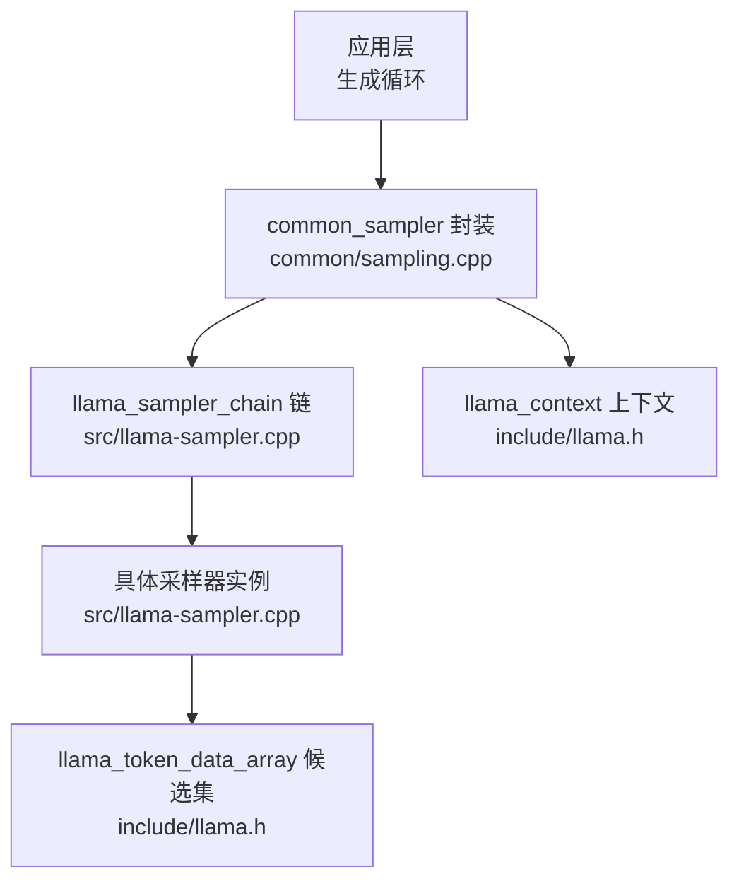
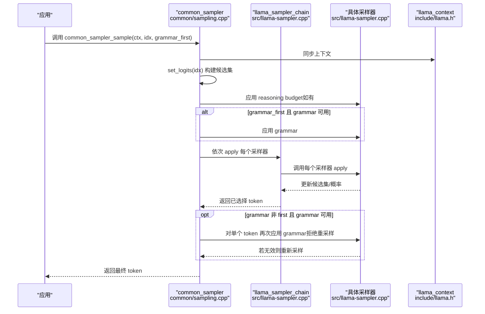
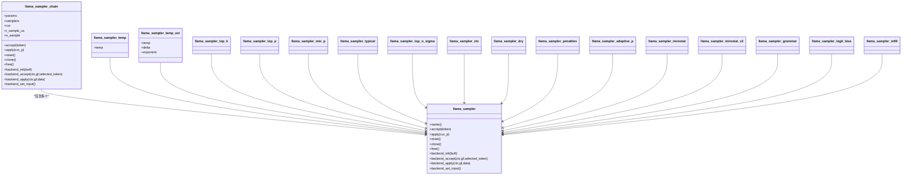
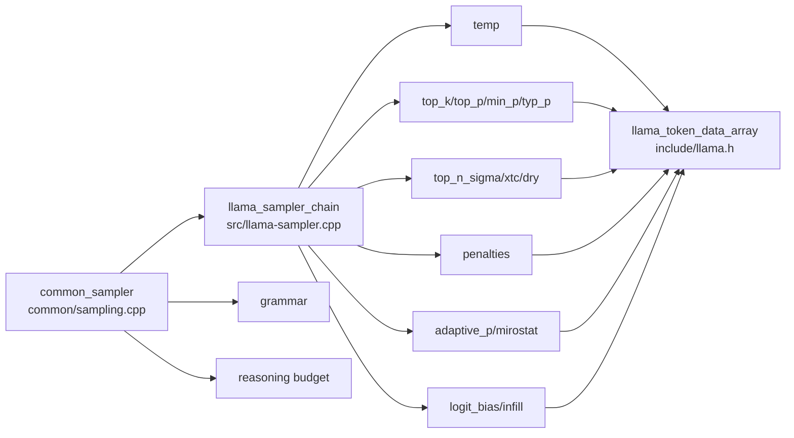

# 采样器和操作符

<cite>
**本文引用的文件**
- [llama.h](file://include/llama.h)
- [llama-sampler.h](file://src/llama-sampler.h)
- [llama-sampler.cpp](file://src/llama-sampler.cpp)
- [sampling.h](file://common/sampling.h)
- [sampling.cpp](file://common/sampling.cpp)
- [test-sampling.cpp](file://tests/test-sampling.cpp)
</cite>

## 目录
1. [简介](#简介)
2. [项目结构](#项目结构)
3. [核心组件](#核心组件)
4. [架构总览](#架构总览)
5. [详细组件分析](#详细组件分析)
6. [依赖关系分析](#依赖关系分析)
7. [性能考量](#性能考量)
8. [故障排查指南](#故障排查指南)
9. [结论](#结论)
10. [附录：API 参考与最佳实践](#附录api-参考与最佳实践)

## 简介
本文件面向 llama.cpp 的采样器与采样链（sampler chain）能力，提供系统化、可操作的 API 参考与工程实践指南。内容覆盖：
- 采样策略与参数：温度采样、Top-K、Top-P（核采样）、典型采样、最小概率采样、XTC、DRY、惩罚项、自适应概率（adaptive-p）、mirostat、推理预算（reasoning budget）、语法约束（grammar）等
- 采样链构建与使用：如何按序组合多个采样器，以及在不同后端（CPU/GPU/混合）上的执行路径
- 参数调优建议与效果对比：基于实现细节给出经验性建议
- 自定义采样器扩展：接口规范与实现要点
- 质量评估与性能分析：采样链计时、候选集访问、历史记录与回溯
- 实际应用示例：常见策略组合与最佳实践

## 项目结构
围绕采样功能的关键文件组织如下：
- 接口与数据结构定义：include/llama.h
- 采样器内核与链式执行：src/llama-sampler.{h,cpp}
- 通用采样器封装与链初始化：common/sampling.{h,cpp}
- 单元测试与基准：tests/test-sampling.cpp

图示来源
- [llama.h:200-216](file://include/llama.h#L200-L216)
- [llama-sampler.cpp:624-790](file://src/llama-sampler.cpp#L624-L790)
- [sampling.cpp:187-412](file://common/sampling.cpp#L187-L412)

章节来源
- [llama.h:200-216](file://include/llama.h#L200-L216)
- [llama-sampler.h:10-34](file://src/llama-sampler.h#L10-L34)
- [llama-sampler.cpp:624-790](file://src/llama-sampler.cpp#L624-L790)
- [sampling.h:35-120](file://common/sampling.h#L35-L120)
- [sampling.cpp:187-412](file://common/sampling.cpp#L187-L412)

## 核心组件
- 采样器接口与链式执行
  - llama_sampler：统一的采样器抽象，支持 apply/accept/reset/clone/free 以及后端执行接口
  - llama_sampler_chain：将多个采样器按顺序串联，逐个应用到当前候选集
- 通用采样器封装 common_sampler
  - 维护 grammar、reasoning budget、采样链、最近一次接受的 token 历史、当前候选集
  - 提供 common_sampler_sample/common_sampler_sample_and_accept_n 等高层入口
- 数据结构
  - llama_token_data / llama_token_data_array：保存候选 token 的 id、logit、概率、排序状态与选择索引
- 关键枚举与名称映射
  - 采样器类型枚举与名称/字符映射，便于从字符串或字符序列构建采样链

章节来源
- [llama-sampler.h:10-34](file://src/llama-sampler.h#L10-L34)
- [llama-sampler.cpp:351-426](file://src/llama-sampler.cpp#L351-L426)
- [llama.h:200-216](file://include/llama.h#L200-L216)
- [sampling.h:35-120](file://common/sampling.h#L35-L120)
- [sampling.cpp:728-843](file://common/sampling.cpp#L728-L843)

## 架构总览
采样链的执行流程如下：

图示来源
- [sampling.cpp:537-617](file://common/sampling.cpp#L537-L617)
- [llama-sampler.cpp:642-662](file://src/llama-sampler.cpp#L642-L662)

章节来源
- [sampling.cpp:537-617](file://common/sampling.cpp#L537-L617)
- [llama-sampler.cpp:642-662](file://src/llama-sampler.cpp#L642-L662)

## 详细组件分析

### 1) 采样器链与执行模型
- 链式结构
  - llama_sampler_chain 维护一个采样器列表，按顺序执行 apply；若启用后端，则在链上遇到不支持后端的采样器时停止后端执行，切换到 CPU 执行
- 计时与统计
  - 链对象维护采样耗时与次数，可通过 llama_perf_sampler 获取统计信息
- 克隆与重置
  - 支持 clone 整条链，以及对链内采样器进行 reset

章节来源
- [llama-sampler.h:10-34](file://src/llama-sampler.h#L10-L34)
- [llama-sampler.cpp:624-790](file://src/llama-sampler.cpp#L624-L790)
- [llama-sampler.cpp:3855-3886](file://src/llama-sampler.cpp#L3855-L3886)

### 2) 通用采样器封装 common_sampler
- 初始化与参数
  - 依据 common_params_sampling 构建采样链，支持 grammar、reasoning budget、logit bias、penalties、top-k/p/min-p/typ_p/top-n-sigma/temperature/dry/xtc/infill/adaptive-p/mirostat 等
- 核心流程
  - set_logits(idx)：从上下文获取 logits/probs/candidates，并转换为内部候选集
  - common_sampler_sample：先应用 reasoning budget，再按顺序应用 grammar（可选 grammar_first），最后应用采样链；若 grammar_first 未通过，会回退到 grammar-first 的重采样路径
  - common_sampler_accept：将 token 接受至 grammar/reasoning budget/链的历史中
- 辅助能力
  - 获取候选集、最近 token、打印采样链、打印最近历史、获取种子等

章节来源
- [sampling.h:35-120](file://common/sampling.h#L35-L120)
- [sampling.cpp:187-412](file://common/sampling.cpp#L187-L412)
- [sampling.cpp:537-617](file://common/sampling.cpp#L537-L617)
- [sampling.cpp:664-689](file://common/sampling.cpp#L664-L689)

### 3) 具体采样器实现概览
以下采样器均以 llama_sampler 抽象实现，支持 apply/reset/accept/clone/free，并可在后端可用时走后端执行路径（如 logit-bias、temperature、temperature-ext 等）：

- 温度采样（temp）
  - 将 logits 除以温度系数，温度越低越确定
  - 特殊情况：temp==1.0 时为空操作
- 动态温度（temp-ext）
  - 基于熵动态调整温度，使采样更具适应性
- Top-K
  - 仅保留前 K 个最高 logit 的候选
- Top-P（核采样）
  - 累积概率超过 p 的候选集合
- 最小概率采样（min-p）
  - 保留概率不低于 max(p_min, max(p)*min_p_ratio) 的候选
- 典型采样（typical-p）
  - 基于“意外度”剪枝，保留惊讶度较小的候选
- Top-N-Sigma
  - 基于 logits 的均值与标准差，保留不超过 n 个 sigma 的候选
- XTC
  - 在满足阈值条件下，裁剪尾部候选，保留头部高概率段
- DRY（重复抑制）
  - 基于重启序列与 Z-算法检测重复，对可能延续重复的 token 施加惩罚
- 惩罚项（penalties）
  - 对最近出现的 token 施加重复/频率/存在性惩罚
- 自适应概率（adaptive-p）
  - 基于历史选择的原始概率计算自适应目标，通过非线性变换增强分布差异
- Mirostat/Mirostat v2
  - 基于目标惊讶度自适应调节截断/掩码，维持稳定惊讶度
- 语法约束（grammar）
  - 将候选集限制在符合语法规则的范围内，支持惰性模式与触发词/触发正则
- 推理预算（reasoning budget）
  - 控制推理块内的 token 数量与范围，避免过度生成
- Logit Bias
  - 对指定 token 增加/减少 logits
- Infill
  - 针对填充任务的特殊处理（合并公共前缀、阈值过滤等）

章节来源
- [llama-sampler.cpp:1798-1898](file://src/llama-sampler.cpp#L1798-L1898)
- [llama-sampler.cpp:1900-2066](file://src/llama-sampler.cpp#L1900-L2066)
- [llama-sampler.cpp:1780-1794](file://src/llama-sampler.cpp#L1780-L1794)
- [llama-sampler.cpp:1807-1821](file://src/llama-sampler.cpp#L1807-L1821)
- [llama-sampler.cpp:2101-2208](file://src/llama-sampler.cpp#L2101-L2208)
- [llama-sampler.cpp:2210-2424](file://src/llama-sampler.cpp#L2210-L2424)
- [llama-sampler.cpp:2325-2424](file://src/llama-sampler.cpp#L2325-L2424)
- [llama-sampler.cpp:2426-2618](file://src/llama-sampler.cpp#L2426-L2618)
- [llama-sampler.cpp:2620-2767](file://src/llama-sampler.cpp#L2620-L2767)
- [llama-sampler.cpp:2769-2855](file://src/llama-sampler.cpp#L2769-L2855)
- [llama-sampler.cpp:2857-3231](file://src/llama-sampler.cpp#L2857-L3231)
- [llama-sampler.cpp:3262-3424](file://src/llama-sampler.cpp#L3262-L3424)
- [llama-sampler.cpp:3426-3592](file://src/llama-sampler.cpp#L3426-L3592)
- [llama-sampler.cpp:3594-3823](file://src/llama-sampler.cpp#L3594-L3823)

### 4) 采样器类图（关键实现）

图示来源
- [llama-sampler.h:10-34](file://src/llama-sampler.h#L10-L34)
- [llama-sampler.cpp:351-426](file://src/llama-sampler.cpp#L351-L426)
- [llama-sampler.cpp:1798-1898](file://src/llama-sampler.cpp#L1798-L1898)
- [llama-sampler.cpp:1900-2066](file://src/llama-sampler.cpp#L1900-L2066)
- [llama-sampler.cpp:2101-2208](file://src/llama-sampler.cpp#L2101-L2208)
- [llama-sampler.cpp:2210-2424](file://src/llama-sampler.cpp#L2210-L2424)
- [llama-sampler.cpp:2426-2618](file://src/llama-sampler.cpp#L2426-L2618)
- [llama-sampler.cpp:2620-2767](file://src/llama-sampler.cpp#L2620-L2767)
- [llama-sampler.cpp:2769-2855](file://src/llama-sampler.cpp#L2769-L2855)
- [llama-sampler.cpp:2857-3231](file://src/llama-sampler.cpp#L2857-L3231)
- [llama-sampler.cpp:3262-3424](file://src/llama-sampler.cpp#L3262-L3424)
- [llama-sampler.cpp:3426-3592](file://src/llama-sampler.cpp#L3426-L3592)
- [llama-sampler.cpp:3594-3823](file://src/llama-sampler.cpp#L3594-L3823)

## 依赖关系分析
- common_sampler 依赖 llama_sampler_chain 与具体采样器实现
- 具体采样器依赖 llama_token_data_array 进行候选集操作
- grammar/reasoning budget 作为外部约束与采样链并行工作
- 后端支持由各采样器的 backend_* 接口决定，链在遇到不支持后端的采样器时自动降级

图示来源
- [sampling.cpp:187-412](file://common/sampling.cpp#L187-L412)
- [llama-sampler.cpp:624-790](file://src/llama-sampler.cpp#L624-L790)
- [llama.h:200-216](file://include/llama.h#L200-L216)

章节来源
- [sampling.cpp:187-412](file://common/sampling.cpp#L187-L412)
- [llama-sampler.cpp:624-790](file://src/llama-sampler.cpp#L624-L790)
- [llama.h:200-216](file://include/llama.h#L200-L216)

## 性能考量
- 采样链计时
  - 通过 llama_perf_sampler 获取采样耗时与调用次数，用于性能分析
- 候选集大小
  - Top-K 与 Top-P 会显著降低候选集规模，提升采样效率；但需权衡多样性与质量
- 后端执行
  - 部分采样器支持后端执行（如 temp/temp-ext/logit-bias），链在遇到不支持的采样器时会自动切换到 CPU
- 语法约束与推理预算
  - grammar 的惰性模式与 reasoning budget 的结合可减少不必要的全集计算，提高吞吐

章节来源
- [llama-sampler.cpp:3855-3886](file://src/llama-sampler.cpp#L3855-L3886)
- [sampling.cpp:537-617](file://common/sampling.cpp#L537-L617)

## 故障排查指南
- 无选择 token
  - 当所有候选被掩蔽为 -∞ 时，可能出现无法选择的情况。检查 grammar 是否过于严格、Top-P 设置过低、min-p 阈值过高、penalties 过强
- 采样链未生效
  - 确认采样器是否正确添加到链中；检查 grammar_first 与 grammar 的交互逻辑
- 后端不生效
  - 若链中存在不支持后端的采样器，后端执行会被禁用。可移除或替换该采样器
- 重复输出
  - 启用 DRY 或 penalties；合理设置重复窗口与惩罚强度
- 采样质量不佳
  - 调整温度、Top-K/P、典型采样、最小概率采样、adaptive-p 的目标与衰减

章节来源
- [sampling.cpp:537-617](file://common/sampling.cpp#L537-L617)
- [llama-sampler.cpp:694-725](file://src/llama-sampler.cpp#L694-L725)

## 结论
llama.cpp 的采样系统以统一的 llama_sampler 抽象为核心，通过链式组合实现灵活多样的采样策略。common_sampler 在此基础上提供了 grammar/reasoning budget、候选集管理与性能统计等高级能力。通过合理配置采样链与参数，可以在质量与效率之间取得良好平衡。

## 附录：API 参考与最佳实践

### A. 采样器链构建与使用
- 初始化
  - 使用 common_sampler_init 传入模型与采样参数，内部根据参数构建采样链与 grammar/reasoning budget
- 添加采样器
  - 通过 common_params_sampling 中的 samplers 字段指定采样器顺序；常见顺序：penalties → top_n_sigma → top_k → typical_p → top_p → min_p → xtc → temperature → dist（或 adaptive-p）
- 执行采样
  - common_sampler_sample：返回单个 token
  - common_sampler_sample_and_accept_n：批量草稿匹配，返回已接受的 token 序列
- 接受与重置
  - common_sampler_accept：将 token 接受至 grammar/reasoning budget/链
  - common_sampler_reset：重置链状态

章节来源
- [sampling.cpp:187-412](file://common/sampling.cpp#L187-L412)
- [sampling.cpp:619-656](file://common/sampling.cpp#L619-L656)
- [sampling.cpp:441-470](file://common/sampling.cpp#L441-L470)

### B. 采样策略与参数调优
- 温度采样（temp/temp-ext）
  - 降低温度提升确定性，升高温度增加多样性；temp-ext 基于熵动态调整，适合复杂场景
- Top-K/Top-P/最小概率采样
  - Top-K 适合控制多样性；Top-P（核采样）更平滑；min-p 可避免极端低概率 token 影响
- 典型采样（typical-p）
  - 保留“不意外”的 token，适合需要稳定输出的任务
- Top-N-Sigma/XTC
  - 基于统计分布的裁剪，适合长文本与重复抑制
- DRY
  - 高强度重复抑制，适合长对话或指令遵循
- 惩罚项（penalties）
  - 频率/存在/重复惩罚三者配合，避免重复与单调
- 自适应概率（adaptive-p）
  - 通过 EMA 历史概率自适应目标，提升一致性
- Mirostat/Mirostat v2
  - 维持稳定惊讶度，适合需要可控多样性的任务
- Grammar/Reasoning Budget
  - grammar_first 适用于必须满足语法的任务；reasoning budget 用于控制推理块长度

章节来源
- [llama-sampler.cpp:1798-1898](file://src/llama-sampler.cpp#L1798-L1898)
- [llama-sampler.cpp:1900-2066](file://src/llama-sampler.cpp#L1900-L2066)
- [llama-sampler.cpp:1780-1794](file://src/llama-sampler.cpp#L1780-L1794)
- [llama-sampler.cpp:2101-2208](file://src/llama-sampler.cpp#L2101-L2208)
- [llama-sampler.cpp:2210-2424](file://src/llama-sampler.cpp#L2210-L2424)
- [llama-sampler.cpp:2325-2424](file://src/llama-sampler.cpp#L2325-L2424)
- [llama-sampler.cpp:2426-2618](file://src/llama-sampler.cpp#L2426-L2618)
- [llama-sampler.cpp:2620-2767](file://src/llama-sampler.cpp#L2620-L2767)
- [llama-sampler.cpp:2769-2855](file://src/llama-sampler.cpp#L2769-L2855)
- [llama-sampler.cpp:2857-3231](file://src/llama-sampler.cpp#L2857-L3231)
- [llama-sampler.cpp:3262-3424](file://src/llama-sampler.cpp#L3262-L3424)

### C. 自定义采样器开发
- 接口要求
  - 实现 name/accept/apply/reset/clone/free；如需后端执行，实现 backend_init/backend_accept/backend_apply/backend_set_input
- 注册与接入
  - 通过 llama_sampler_init 创建实例，加入 llama_sampler_chain
- 注意事项
  - apply 中应直接修改 llama_token_data_array 的 logit/p，必要时更新 selected 与 sorted 标志
  - 如涉及随机数，确保 seed 管理与 reset 行为一致

章节来源
- [llama-sampler.cpp:351-426](file://src/llama-sampler.cpp#L351-L426)
- [llama-sampler.cpp:624-790](file://src/llama-sampler.cpp#L624-L790)

### D. 采样结果质量评估与性能分析
- 质量评估
  - 通过 common_sampler_prev_str 获取最近 token 文本，辅助人工评估连贯性与主题一致性
  - 通过 common_sampler_get_candidates 获取候选集，观察分布与 top-k/top-p 的覆盖情况
- 性能分析
  - llama_perf_sampler 获取采样耗时与次数；结合 llama_perf_context 分析整体生成时间构成
  - 使用 common_sampler_get_seed 获取当前链的种子，便于复现实验

章节来源
- [sampling.cpp:664-689](file://common/sampling.cpp#L664-L689)
- [sampling.cpp:484-527](file://common/sampling.cpp#L484-L527)
- [llama-sampler.cpp:3827-3851](file://src/llama-sampler.cpp#L3827-L3851)

### E. 实际应用示例与最佳实践
- 通用对话
  - 推荐链：penalties → top_n_sigma → top_k → typical_p → top_p → min_p → temperature → dist
- 结构化输出（JSON/XML）
  - 强烈建议开启 grammar；必要时 grammar_first；可配合 reasoning budget 控制长度
- 代码示例路径
  - 采样链构建与使用：[sampling.cpp:187-412](file://common/sampling.cpp#L187-L412)
  - 采样执行与接受：[sampling.cpp:537-617](file://common/sampling.cpp#L537-L617)
  - 测试用例（组合测试）：[test-sampling.cpp:374-395](file://tests/test-sampling.cpp#L374-L395)

章节来源
- [sampling.cpp:187-412](file://common/sampling.cpp#L187-L412)
- [sampling.cpp:537-617](file://common/sampling.cpp#L537-L617)
- [test-sampling.cpp:374-395](file://tests/test-sampling.cpp#L374-L395)