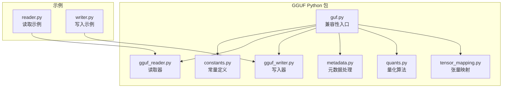
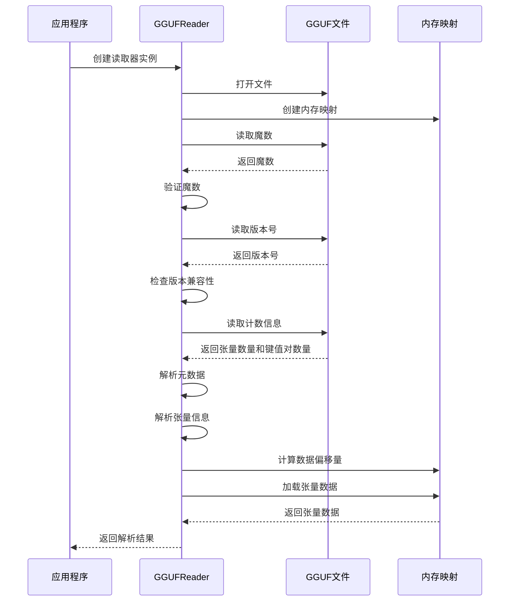
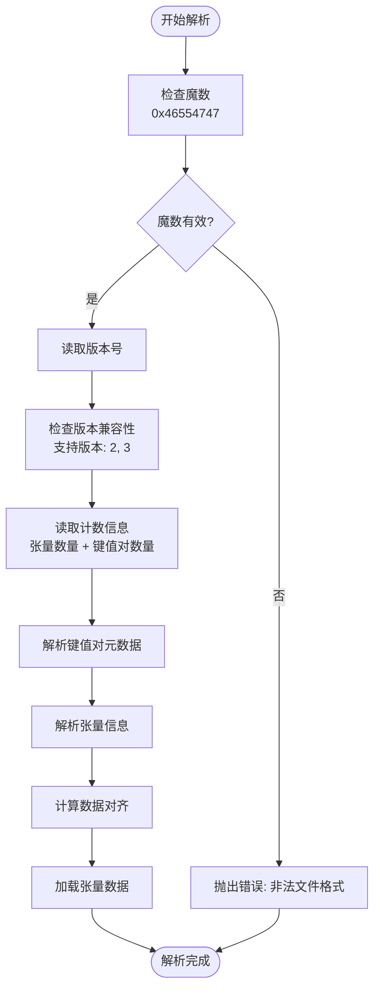
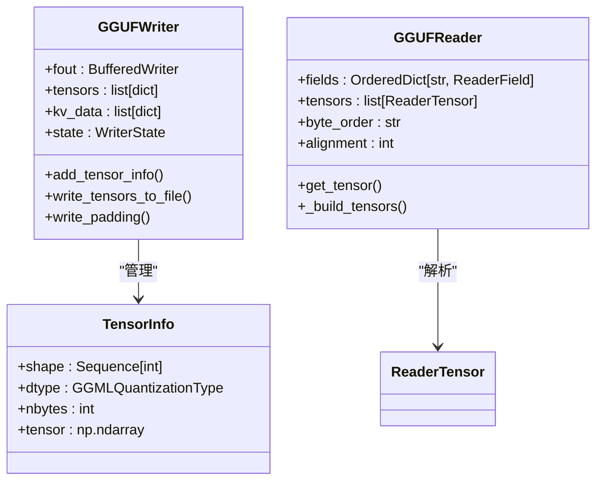
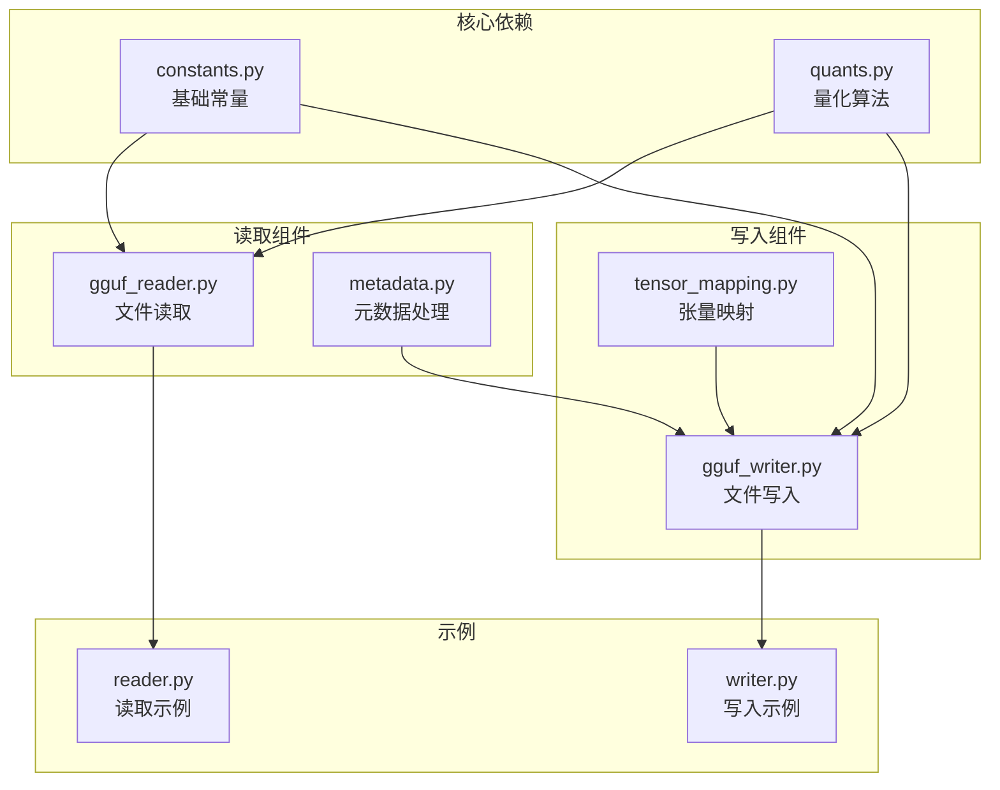

# GGUF 格式规范

<cite>
**本文档引用的文件**
- [gguf.py](file://gguf-py/gguf/gguf.py)
- [constants.py](file://gguf-py/gguf/constants.py)
- [gguf_reader.py](file://gguf-py/gguf/gguf_reader.py)
- [gguf_writer.py](file://gguf-py/gguf/gguf_writer.py)
- [metadata.py](file://gguf-py/gguf/metadata.py)
- [quants.py](file://gguf-py/gguf/quants.py)
- [tensor_mapping.py](file://gguf-py/gguf/tensor_mapping.py)
- [reader.py](file://gguf-py/examples/reader.py)
- [writer.py](file://gguf-py/examples/writer.py)
</cite>

## 目录
1. [简介](#简介)
2. [项目结构](#项目结构)
3. [核心组件](#核心组件)
4. [架构概览](#架构概览)
5. [详细组件分析](#详细组件分析)
6. [依赖关系分析](#依赖关系分析)
7. [性能考虑](#性能考虑)
8. [故障排除指南](#故障排除指南)
9. [结论](#结论)
10. [附录](#附录)

## 简介

GGUF（Generic Graph Utility Format）是一种专为机器学习模型设计的二进制格式，主要用于存储和传输大型语言模型的权重、元数据和相关配置信息。该格式由 llama.cpp 项目开发和维护，旨在提供高效、跨平台且易于使用的模型序列化解决方案。

GGUF 格式的主要特点包括：
- **二进制优化**：采用紧凑的二进制表示，减少存储空间和加载时间
- **量化支持**：内置多种量化格式，支持从 FP32 到 INT4 的广泛范围
- **元数据管理**：丰富的元数据存储能力，包括模型架构、超参数等
- **端序兼容**：自动处理不同字节序之间的转换
- **分片支持**：支持大模型的分片存储和加载

## 项目结构

该项目采用模块化的 Python 包结构，主要包含以下核心组件：



**图表来源**
- [gguf.py:1-16](file://gguf-py/gguf/gguf.py#L1-L16)
- [constants.py:1-800](file://gguf-py/gguf/constants.py#L1-L800)

**章节来源**
- [gguf.py:1-16](file://gguf-py/gguf/gguf.py#L1-L16)
- [constants.py:1-800](file://gguf-py/gguf/constants.py#L1-L800)

## 核心组件

### 基础常量和枚举

GGUF 格式的核心定义集中在常量文件中，包括魔数、版本号、数据类型等基础信息。

**章节来源**
- [constants.py:10-13](file://gguf-py/gguf/constants.py#L10-L13)

### 读取器组件

GGUFReader 类提供了完整的文件读取功能，能够解析文件头、元数据、张量信息和实际的数据内容。

**章节来源**
- [gguf_reader.py:111-186](file://gguf-py/gguf/gguf_reader.py#L111-L186)

### 写入器组件

GGUFWriter 类负责将模型数据和元数据写入 GGUF 文件，支持多种数据类型的添加和张量的序列化。

**章节来源**
- [gguf_writer.py:65-112](file://gguf-py/gguf/gguf_writer.py#L65-L112)

### 元数据处理

metadata 模块提供了从各种来源（模型卡片、配置文件等）提取和处理元数据的功能。

**章节来源**
- [metadata.py:18-60](file://gguf-py/gguf/metadata.py#L18-L60)

## 架构概览

GGUF 格式遵循标准的二进制文件结构，采用分层设计：



**图表来源**
- [gguf_reader.py:132-186](file://gguf-py/gguf/gguf_reader.py#L132-L186)

## 详细组件分析

### 文件头结构

GGUF 文件的头部包含魔数、版本号和基本的计数信息：



**图表来源**
- [gguf_reader.py:136-186](file://gguf-py/gguf/gguf_reader.py#L136-L186)

**章节来源**
- [gguf_reader.py:136-186](file://gguf-py/gguf/gguf_reader.py#L136-L186)

### 元数据系统

GGUF 使用键值对系统存储模型的各种元数据，包括通用信息、模型特定参数等。

**章节来源**
- [constants.py:20-359](file://gguf-py/gguf/constants.py#L20-L359)

### 张量管理系统

张量在 GGUF 文件中的存储采用了高效的压缩和组织方式：



**图表来源**
- [gguf_writer.py:41-71](file://gguf-py/gguf/gguf_writer.py#L41-L71)
- [gguf_reader.py:100-110](file://gguf-py/gguf/gguf_reader.py#L100-L110)

**章节来源**
- [gguf_writer.py:41-71](file://gguf-py/gguf/gguf_writer.py#L41-L71)
- [gguf_reader.py:100-110](file://gguf-py/gguf/gguf_reader.py#L100-L110)

### 量化系统

GGUF 支持多种量化格式，每种格式都有其特定的压缩率和精度特征：

**章节来源**
- [quants.py:56-76](file://gguf-py/gguf/quants.py#L56-L76)

### 张量命名映射

为了支持不同框架的模型，GGUF 提供了灵活的张量名称映射系统：

**章节来源**
- [tensor_mapping.py:8-161](file://gguf-py/gguf/tensor_mapping.py#L8-L161)

## 依赖关系分析



**图表来源**
- [constants.py:1-800](file://gguf-py/gguf/constants.py#L1-L800)
- [gguf_reader.py:24-32](file://gguf-py/gguf/gguf_reader.py#L24-L32)
- [gguf_writer.py:19-31](file://gguf-py/gguf/gguf_writer.py#L19-L31)

**章节来源**
- [constants.py:1-800](file://gguf-py/gguf/constants.py#L1-L800)
- [gguf_reader.py:24-32](file://gguf-py/gguf/gguf_reader.py#L24-L32)
- [gguf_writer.py:19-31](file://gguf-py/gguf/gguf_writer.py#L19-L31)

## 性能考虑

### 内存映射优化

GGUF 读取器使用内存映射技术来提高大文件的处理效率：

**章节来源**
- [gguf_reader.py:133-134](file://gguf-py/gguf/gguf_reader.py#L133-L134)

### 对齐策略

文件中的数据按照指定的对齐边界进行排列，以确保跨平台的兼容性和访问效率：

**章节来源**
- [gguf_reader.py:181-184](file://gguf-py/gguf/gguf_reader.py#L181-L184)

### 量化压缩

通过多种量化格式，GGUF 能够显著减少模型文件的大小：

**章节来源**
- [quants.py:14-26](file://gguf-py/gguf/quants.py#L14-L26)

## 故障排除指南

### 常见问题诊断

1. **魔数验证失败**
   - 检查文件是否为有效的 GGUF 格式
   - 验证文件完整性

2. **版本不兼容**
   - 确认使用的 GGUF 版本与文件版本兼容
   - 更新相关的库版本

3. **张量重复名称**
   - 检查张量命名的唯一性
   - 避免重复的张量名称

**章节来源**
- [gguf_reader.py:137-150](file://gguf-py/gguf/gguf_reader.py#L137-L150)
- [gguf_reader.py:325-327](file://gguf-py/gguf/gguf_reader.py#L325-L327)

### 调试技巧

1. **使用示例脚本**
   - 参考提供的读取和写入示例
   - 逐步验证每个步骤的正确性

2. **日志记录**
   - 启用详细的日志输出
   - 监控文件解析过程

**章节来源**
- [reader.py:1-50](file://gguf-py/examples/reader.py#L1-L50)
- [writer.py:1-40](file://gguf-py/examples/writer.py#L1-L40)

## 结论

GGUF 格式为机器学习模型提供了一个高效、灵活且跨平台的存储解决方案。通过精心设计的二进制结构、丰富的元数据支持和强大的量化能力，它成为了现代 AI 模型部署的理想选择。

该格式的主要优势包括：
- **高性能**：优化的二进制结构和内存映射技术
- **高兼容性**：支持多种量化格式和跨平台字节序
- **高扩展性**：灵活的元数据系统和张量映射机制
- **易用性**：完善的 Python API 和示例代码

随着 AI 模型规模的不断增长，GGUF 格式将继续发展和完善，为机器学习社区提供更好的支持。

## 附录

### API 使用示例

#### 读取 GGUF 文件
```python
from gguf.gguf_reader import GGUFReader

reader = GGUFReader("model.gguf")
for key, field in reader.fields.items():
    print(f"{key}: {field.contents()}")
```

#### 写入 GGUF 文件
```python
from gguf import GGUFWriter
import numpy as np

writer = GGUFWriter("output.gguf", "llama")
writer.add_uint32("answer", 42)
writer.add_tensor("weights", np.random.randn(100, 100))
writer.write_header_to_file()
writer.write_kv_data_to_file()
writer.write_tensors_to_file()
writer.close()
```

**章节来源**
- [reader.py:14-42](file://gguf-py/examples/reader.py#L14-L42)
- [writer.py:14-35](file://gguf-py/examples/writer.py#L14-L35)