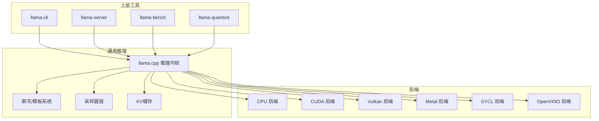
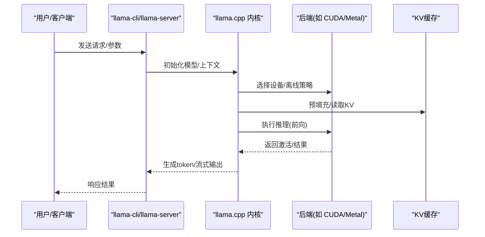
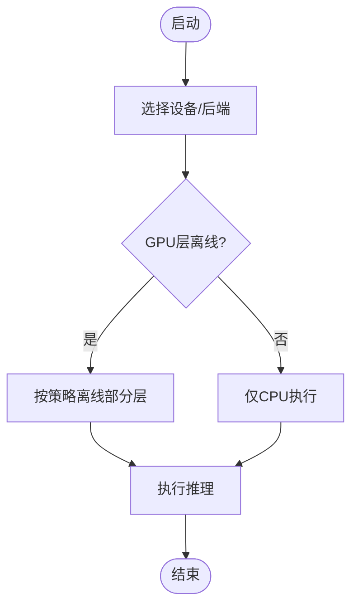
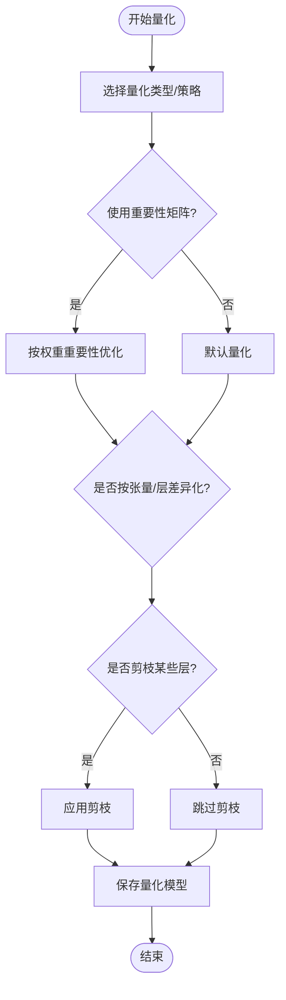
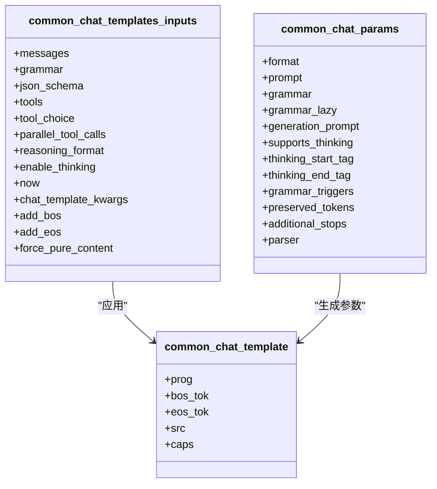
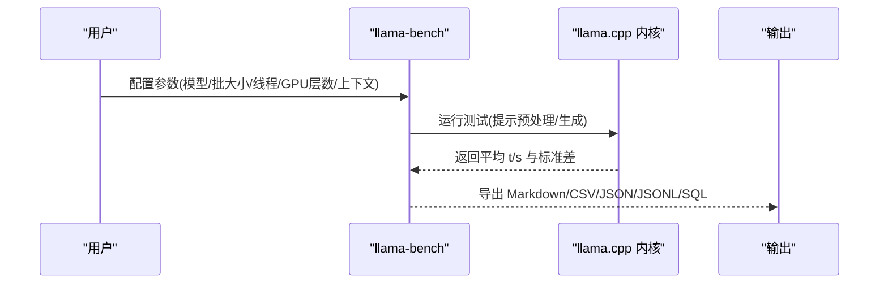
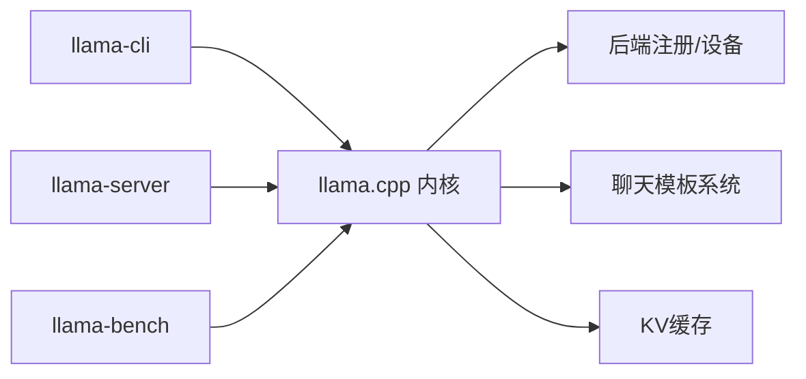

# 模型优化策略

<cite>
**本文引用的文件**
- [README.md](file://README.md)
- [build.md](file://docs/build.md)
- [token_generation_performance_tips.md](file://docs/development/token_generation_performance_tips.md)
- [quantize/README.md](file://tools/quantize/README.md)
- [llama-bench/README.md](file://tools/llama-bench/README.md)
- [multimodal.md](file://docs/multimodal.md)
- [llama.cpp](file://src/llama.cpp)
- [ggml.c](file://ggml/src/ggml.c)
- [chat.h](file://common/chat.h)
- [chat.cpp](file://common/chat.cpp)
- [meta-llama-Llama-3.1-8B-Instruct.jinja](file://models/templates/meta-llama-Llama-3.1-8B-Instruct.jinja)
- [Qwen-Qwen2.5-7B-Instruct.jinja](file://models/templates/Qwen-Qwen2.5-7B-Instruct.jinja)
- [templates/README.md](file://models/templates/README.md)
</cite>

## 目录
1. [引言](#引言)
2. [项目结构](#项目结构)
3. [核心组件](#核心组件)
4. [架构总览](#架构总览)
5. [详细组件分析](#详细组件分析)
6. [依赖关系分析](#依赖关系分析)
7. [性能考量](#性能考量)
8. [故障排查指南](#故障排查指南)
9. [结论](#结论)
10. [附录](#附录)

## 引言
本指南围绕 llama.cpp 的模型优化策略展开，系统覆盖推理加速、内存优化与存储压缩，并结合不同硬件后端（GPU/CPU/专用加速器）给出可操作的优化路径；同时介绍模型压缩（剪枝、知识蒸馏、知识压缩）在本仓库中的应用现状与实践建议；最后提供性能基准测试方法、优化效果评估工具、模型模板系统的使用与定制方法，并辅以优化前后的对比思路与部署案例分析框架。

## 项目结构
llama.cpp 采用分层设计：上层为推理接口与工具（CLI、HTTP 服务、基准工具），中层为通用模型加载与调度（模型加载、上下文管理、采样器、KV 缓存），底层为跨平台后端（CPU、CUDA、Vulkan、Metal、SYCL 等）。模板系统通过 Jinja 解析器与 PEG 解析器支持聊天、工具调用与多模态输入格式化。

图示来源
- [README.md:275-296](file://README.md#L275-L296)
- [build.md:1-774](file://docs/build.md#L1-L774)
- [llama.cpp:83-108](file://src/llama.cpp#L83-L108)

章节来源
- [README.md:275-296](file://README.md#L275-L296)
- [build.md:1-774](file://docs/build.md#L1-L774)

## 核心组件
- 推理内核与设备选择：负责模型加载、设备列表构建、设备优先级与拆分模式（张量并行/层并行）、GPU/CPU 层离线策略。
- 聊天与模板系统：基于 Jinja 的模板渲染与 PEG 的消息解析，支持工具调用、思维内容、多模态内容片段。
- 基准测试工具：llama-bench 提供多种测试场景（提示预处理、文本生成、批大小、线程数、GPU 层数等）与多格式输出。
- 量化与压缩：llama-quantize 支持多种低精度量化方案，兼顾速度与存储，提供重要性矩阵与按张量类型控制。
- 多模态：图像/音频输入，支持投影模块离线与禁用离线选项。
- 性能诊断：token 生成性能排查文档提供 GPU 使用验证与 CPU 过载排查方法。

章节来源
- [llama.cpp:219-382](file://src/llama.cpp#L219-L382)
- [chat.h:52-79](file://common/chat.h#L52-L79)
- [chat.cpp:73-151](file://common/chat.cpp#L73-L151)
- [llama-bench/README.md:20-86](file://tools/llama-bench/README.md#L20-L86)
- [quantize/README.md:1-172](file://tools/quantize/README.md#L1-L172)
- [multimodal.md:1-145](file://docs/multimodal.md#L1-L145)
- [token_generation_performance_tips.md:1-41](file://docs/development/token_generation_performance_tips.md#L1-L41)

## 架构总览
llama.cpp 的运行时由“工具层 → 推理内核 → 后端”三层构成。推理内核负责模型加载、上下文管理、KV 缓存、采样与生成循环；后端抽象屏蔽了不同硬件的差异；模板系统在聊天与多模态场景下将消息结构转换为模型可接受的序列。

图示来源
- [llama.cpp:368-382](file://src/llama.cpp#L368-L382)
- [build.md:767-774](file://docs/build.md#L767-L774)

## 详细组件分析

### 推理加速与设备选择
- 设备选择与离线策略
  - 支持自动选择可用设备（GPU/IGPU/RPC），并可指定主 GPU、张量并行模式与设备列表。
  - 可通过命令行参数控制 GPU 层数离线（如 -ngl），实现大模型分层离线以突破显存限制。
- 后端能力
  - 支持 Metal（Apple Silicon）、CUDA（NVIDIA）、Vulkan（跨 GPU）、SYCL（Intel/AMD GPU）、OpenVINO（Intel CPU/GPU/NPU）、CANN（Ascend NPU）、HIP（AMD GPU）等。
- 运行时环境变量
  - CUDA：可见设备、统一内存、P2P、队列规模、计算精度强制等。
  - 其他后端：可见设备、驱动/SDK 配置等。

图示来源
- [llama.cpp:221-366](file://src/llama.cpp#L221-L366)
- [build.md:147-290](file://docs/build.md#L147-L290)
- [build.md:351-403](file://docs/build.md#L351-L403)
- [build.md:404-526](file://docs/build.md#L404-L526)
- [build.md:559-584](file://docs/build.md#L559-L584)
- [build.md:767-774](file://docs/build.md#L767-L774)

章节来源
- [llama.cpp:219-382](file://src/llama.cpp#L219-L382)
- [build.md:147-290](file://docs/build.md#L147-L290)
- [build.md:351-403](file://docs/build.md#L351-L403)
- [build.md:404-526](file://docs/build.md#L404-L526)
- [build.md:559-584](file://docs/build.md#L559-L584)
- [build.md:767-774](file://docs/build.md#L767-L774)

### 内存优化与存储压缩
- 存储压缩（量化）
  - 支持多种低精度量化方案，显著降低模型体积与提升推理速度；可通过重要性矩阵（imatrix）与按张量类型控制进一步优化质量与性能平衡。
  - 提供纯量化、输出层/词嵌入单独量化、按正则表达式对特定层进行差异化量化、剪枝等高级选项。
- 内存使用
  - 大模型需要充足的磁盘空间与内存用于中间文件；内存与磁盘需求通常相当，需预留足够空间。
- KV 缓存量化
  - 可配置 K/V 缓存量化类型（f16 等），在长上下文场景下节省显存/内存。

图示来源
- [quantize/README.md:47-98](file://tools/quantize/README.md#L47-L98)
- [quantize/README.md:100-110](file://tools/quantize/README.md#L100-L110)
- [quantize/README.md:112-172](file://tools/quantize/README.md#L112-L172)

章节来源
- [quantize/README.md:1-172](file://tools/quantize/README.md#L1-L172)

### 多模态优化
- 输入类型：图像与音频（音频当前为实验性）。
- 投影模块离线：默认将投影模块离线到 GPU，可禁用以避免显存占用或兼容不支持的设备。
- 上下文窗口：部分 OCR/多模态模型需要较大的上下文窗口（如 -c 8192）。

章节来源
- [multimodal.md:1-145](file://docs/multimodal.md#L1-L145)

### 聊天模板系统与推理模板
- 模板能力
  - 基于 Jinja 的模板渲染，支持系统消息、工具定义、思维内容、时间注入、工具调用 JSON 约束等。
  - PEG 解析器用于增量解析与工具调用提取，支持多模态内容片段拼接。
- 模板定制
  - 模板位于 models/templates，可通过脚本从 Hugging Face 拉取并生成 jinja 文件。
  - 示例模板展示了 Llama 3.1 与 Qwen 的工具调用格式与系统提示组织方式。

图示来源
- [chat.h:52-79](file://common/chat.h#L52-L79)
- [chat.h:158-175](file://common/chat.h#L158-L175)
- [chat.h:177-190](file://common/chat.h#L177-L190)
- [chat.cpp:73-151](file://common/chat.cpp#L73-L151)

章节来源
- [chat.h:1-285](file://common/chat.h#L1-L285)
- [chat.cpp:1-200](file://common/chat.cpp#L1-L200)
- [templates/README.md:1-27](file://models/templates/README.md#L1-L27)
- [meta-llama-Llama-3.1-8B-Instruct.jinja:1-110](file://models/templates/meta-llama-Llama-3.1-8B-Instruct.jinja#L1-L110)
- [Qwen-Qwen2.5-7B-Instruct.jinja:1-55](file://models/templates/Qwen-Qwen2.5-7B-Instruct.jinja#L1-L55)

### 基准测试与优化效果评估
- 测试场景
  - 文本生成、提示预处理、不同批大小、线程数、GPU 层数、预填充上下文深度等。
- 输出格式
  - 支持 Markdown、CSV、JSON、JSONL、SQL，便于导入数据库或自动化分析。
- 注意事项
  - 结果不含分词与采样耗时，仅统计推理阶段。

图示来源
- [llama-bench/README.md:20-86](file://tools/llama-bench/README.md#L20-L86)
- [llama-bench/README.md:87-178](file://tools/llama-bench/README.md#L87-L178)
- [llama-bench/README.md:179-352](file://tools/llama-bench/README.md#L179-L352)

章节来源
- [llama-bench/README.md:1-352](file://tools/llama-bench/README.md#L1-L352)

### 不同硬件平台的优化要点
- NVIDIA CUDA
  - 通过 -DGGML_CUDA=ON 构建；设置 CUDA_VISIBLE_DEVICES 控制可见设备；可启用统一内存、P2P、调整队列规模；必要时强制 FP32/FP16 计算以避免数值问题。
- AMD GPU（ROCm/HIP）
  - 通过 -DGGML_HIP=ON 构建；可启用 rocWMMA 加速；使用 HIP_VISIBLE_DEVICES 与 HSA_OVERRIDE_GFX_VERSION 进行设备隔离与架构适配。
- Intel GPU/CPU（SYCL/OpenVINO）
  - SYCL 支持 Intel GPU；OpenVINO 针对 Intel CPU/GPU/NPU；注意后端兼容性与驱动版本。
- Apple Silicon（Metal）
  - 默认启用 Metal；可通过 --n-gpu-layers 0 禁用 GPU；也可通过 --device none 完全关闭 GPU。
- Vulkan/WebGPU
  - Vulkan 支持跨 GPU；WebGPU 处于开发中；需安装对应 SDK 并正确配置 ICD/驱动。
- CANN（Ascend NPU）
  - 通过 -DGGML_CANN=ON 构建；注意设备与驱动安装。

章节来源
- [build.md:147-290](file://docs/build.md#L147-L290)
- [build.md:351-403](file://docs/build.md#L351-L403)
- [build.md:404-526](file://docs/build.md#L404-L526)
- [build.md:559-584](file://docs/build.md#L559-L584)
- [build.md:738-774](file://docs/build.md#L738-L774)

### 面向不同应用场景的优化策略
- 实时推理
  - 减少批大小与上下文深度；启用 GPU 层离线；限制线程数；使用合适的 KV 缓存量化；避免过度的后端开销。
- 批量处理
  - 提升批大小与上下文深度；合理设置 ubatch；利用多 GPU/多进程并行；开启统一内存以缓解显存不足。
- 边缘设备部署
  - 优先使用轻量化量化（如 Q4_K_M/Q5_K_M）；减少 KV 缓存大小；禁用不必要的后端；在 CPU 上启用 BLAS/优化库；考虑 OpenVINO/Intel ZenDNN。

章节来源
- [quantize/README.md:112-172](file://tools/quantize/README.md#L112-L172)
- [llama-bench/README.md:120-178](file://tools/llama-bench/README.md#L120-L178)
- [build.md:88-131](file://docs/build.md#L88-L131)
- [build.md:586-617](file://docs/build.md#L586-L617)

## 依赖关系分析
- 组件耦合
  - 工具层（CLI/Server/Bench）依赖推理内核；推理内核依赖后端注册表与设备选择逻辑；模板系统独立但被工具层广泛使用。
- 外部依赖
  - 后端依赖各自 SDK/驱动（CUDA、ROCm、Vulkan、Metal、SYCL、OpenVINO、CANN 等）。
  - 第三方库：HTTP 服务器、图像/音频解码、JSON 库等。

图示来源
- [README.md:590-597](file://README.md#L590-L597)
- [llama.cpp:83-108](file://src/llama.cpp#L83-L108)

章节来源
- [README.md:590-597](file://README.md#L590-L597)
- [llama.cpp:83-108](file://src/llama.cpp#L83-L108)

## 性能考量
- 线程与 CPU 过载
  - 线程数过高会导致 CPU 过载，应根据物理核心数逐步调整；在 GPU 加速场景下，适当降低线程数可显著提升吞吐。
- GPU 利用率与离线策略
  - 合理设置 -ngl 以最大化 GPU 层离线；注意不同后端的计算精度与稳定性权衡。
- KV 缓存与上下文深度
  - 长上下文会增加 KV 占用，可调整缓存量化类型与预填充深度进行权衡。
- 基准测试与指标
  - 使用 llama-bench 的多场景组合测试，关注平均 t/s 与标准差；导出为 CSV/JSON/SQL 便于横向对比。

章节来源
- [token_generation_performance_tips.md:19-41](file://docs/development/token_generation_performance_tips.md#L19-L41)
- [llama-bench/README.md:73-178](file://tools/llama-bench/README.md#L73-L178)

## 故障排查指南
- GPU 是否被使用
  - 构建时确保后端已启用；运行时观察日志中 GPU 离线层数与 VRAM 使用信息。
- CPU 过载
  - 将 -t 设置为较小值（如 1）验证是否改善；若明显提升，逐步增加至物理核心数附近。
- CUDA 环境变量
  - 检查 CUDA_VISIBLE_DEVICES、统一内存、P2P、队列规模等变量设置。
- 模板与工具调用
  - 确认模板与工具定义一致；检查 PEG 解析器输出与增量差异计算是否异常。

章节来源
- [token_generation_performance_tips.md:3-17](file://docs/development/token_generation_performance_tips.md#L3-L17)
- [build.md:257-289](file://docs/build.md#L257-L289)
- [chat.cpp:153-200](file://common/chat.cpp#L153-L200)

## 结论
llama.cpp 在多后端与多场景下提供了完善的模型优化能力：通过合理的设备离线策略、量化压缩、KV 缓存优化与模板系统，可在不同硬件平台上实现高效稳定的推理。配合 llama-bench 的多维度基准测试，可以形成从“参数调优—性能评估—部署落地”的闭环优化流程。

## 附录
- 模型压缩技术现状
  - 仓库提供丰富的量化工具与策略，支持按张量类型差异化量化与剪枝；知识蒸馏与知识压缩在本仓库未直接提供工具，但可通过外部流程将教师模型量化/蒸馏后接入本推理管线。
- 模板定制最佳实践
  - 使用 models/templates 下的 jinja 模板作为基线，结合具体模型的工具定义与思维标签进行微调；通过 --chat-template 或模板源文件进行切换与验证。

章节来源
- [quantize/README.md:58-98](file://tools/quantize/README.md#L58-L98)
- [templates/README.md:1-27](file://models/templates/README.md#L1-L27)