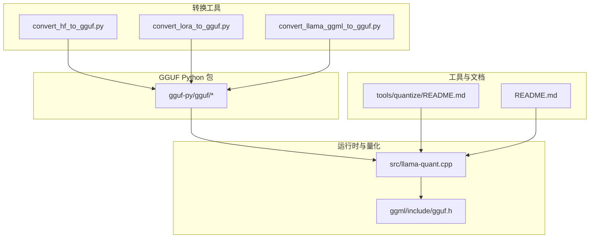
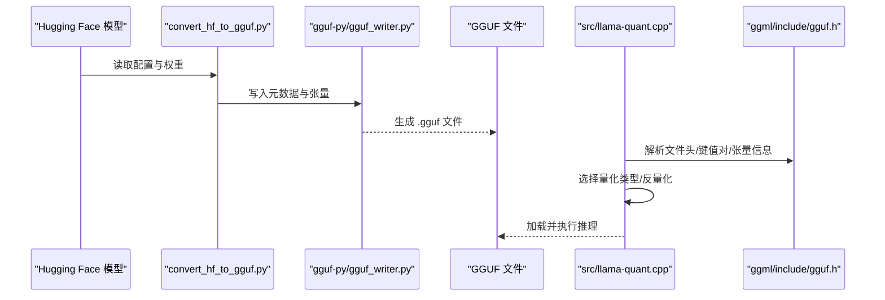
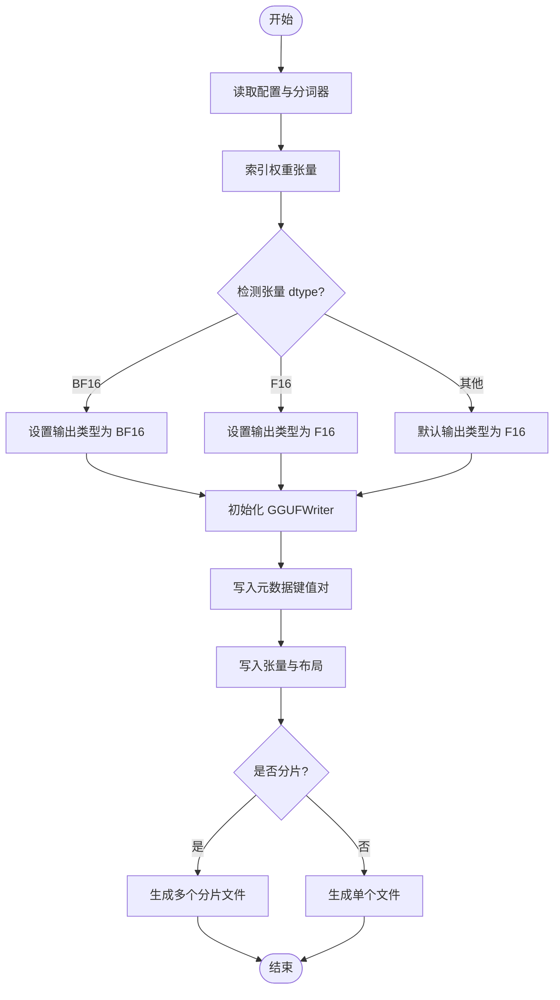
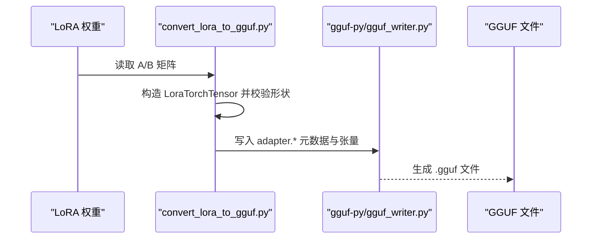
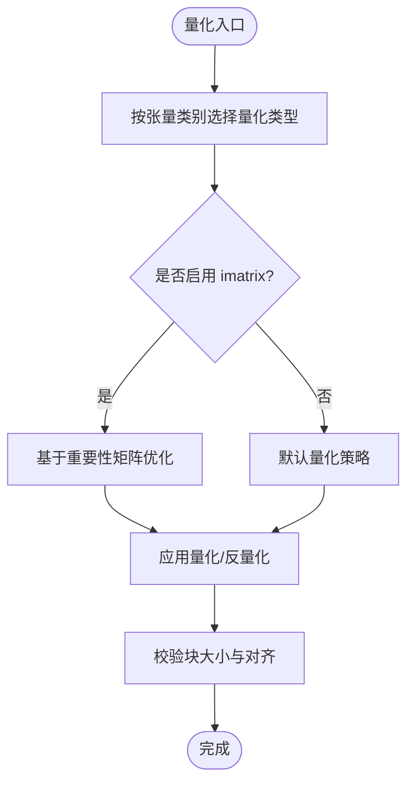
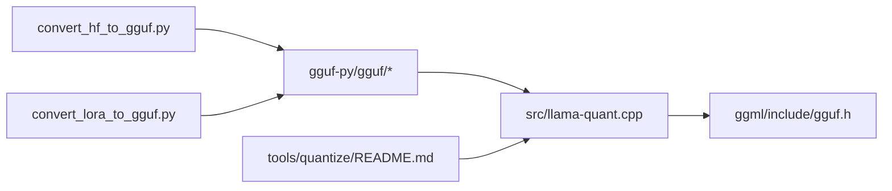

# 模型格式和转换

<cite>
**本文引用的文件**
- [README.md](file://README.md)
- [convert_hf_to_gguf.py](file://convert_hf_to_gguf.py)
- [convert_lora_to_gguf.py](file://convert_lora_to_gguf.py)
- [gguf-py/README.md](file://gguf-py/README.md)
- [gguf-py/gguf/__init__.py](file://gguf-py/gguf/__init__.py)
- [gguf-py/gguf/constants.py](file://gguf-py/gguf/constants.py)
- [gguf-py/gguf/gguf_reader.py](file://gguf-py/gguf/gguf_reader.py)
- [gguf-py/gguf/gguf_writer.py](file://gguf-py/gguf/gguf_writer.py)
- [gguf-py/gguf/quants.py](file://gguf-py/gguf/quants.py)
- [ggml/include/gguf.h](file://ggml/include/gguf.h)
- [src/llama-quant.cpp](file://src/llama-quant.cpp)
- [tools/quantize/README.md](file://tools/quantize/README.md)
- [requirements/requirements-convert_hf_to_gguf.txt](file://requirements/requirements-convert_hf_to_gguf.txt)
</cite>

## 目录
1. [简介](#简介)
2. [项目结构](#项目结构)
3. [核心组件](#核心组件)
4. [架构总览](#架构总览)
5. [详细组件分析](#详细组件分析)
6. [依赖关系分析](#依赖关系分析)
7. [性能考量](#性能考量)
8. [故障排查指南](#故障排查指南)
9. [结论](#结论)
10. [附录](#附录)

## 简介
本文件系统性解析 llama.cpp 支持的模型格式与转换工具链，重点围绕 GGUF（GGML Universal File）格式展开，涵盖其规范、元数据结构、量化信息与张量布局；提供从 PyTorch/Hugging Face 模型到 GGUF 的完整转换流程；深入讲解各类量化技术（1.5 至 8 位整数量化、混合精度、稀疏化思路）；说明 LoRA 适配器的转换与应用；给出模型优化策略与性能调优建议，并总结模型验证与调试工具的使用方法及常见转换示例与最佳实践。

## 项目结构
llama.cpp 将模型转换与运行时解码分离：转换阶段由 Python 脚本完成，运行时由 C/C++ 核心加载 GGUF 文件并执行推理。关键模块如下：
- 转换工具：convert_hf_to_gguf.py、convert_lora_to_gguf.py、convert_llama_ggml_to_gguf.py
- GGUF Python 包：gguf-py 提供读写、常量、量化、词表等能力
- 运行时与量化：src/llama-quant.cpp、ggml/include/gguf.h
- 工具与文档：tools/quantize/README.md、README.md

图示来源
- [convert_hf_to_gguf.py](file://convert_hf_to_gguf.py)
- [convert_lora_to_gguf.py](file://convert_lora_to_gguf.py)
- [gguf-py/gguf/__init__.py](file://gguf-py/gguf/__init__.py)
- [src/llama-quant.cpp](file://src/llama-quant.cpp)
- [ggml/include/gguf.h](file://ggml/include/gguf.h)
- [tools/quantize/README.md](file://tools/quantize/README.md)
- [README.md](file://README.md)

章节来源
- [README.md](file://README.md)
- [gguf-py/README.md](file://gguf-py/README.md)

## 核心组件
- GGUF 规范与结构
  - 文件头含魔数、版本、张量数、键值对数
  - 键值对支持标量与数组类型
  - 张量区包含名称、维度、类型、偏移
  - 可选对齐参数 general.alignment，默认 32 字节
- 元数据键空间
  - general.*：通用元数据（类型、架构、量化版本、对齐、文件类型、采样参数、作者版权、URL、DOI、UUID、源信息、基础模型、数据集等）
  - {arch}.*：模型架构参数（上下文长度、嵌入维、块数、前馈维、注意力头数、RMS/LayerNorm epsilon、池化类型、logit 缩放、温度、滑动窗口、RoPE 缩放等）
  - tokenizer.*：分词器配置（模型、预处理器、词表、特殊 token、聊天模板等）
  - adapter.*：LoRA 适配器元数据（alpha、task_name、prompt_prefix 等）
  - clip.* / clip.vision.* / clip.audio.*：多模态投影器与视觉/音频编码器参数
  - imatrix.*：重要性矩阵（imatrix.chunk_count、chunk_size、datasets）
- 量化类型与张量映射
  - GGUF 定义了多种量化类型（如 Q4_K、IQ4_XS 等），通过 GGML_QUANT_SIZES 映射块大小与类型字节数
  - gguf-py.quants 提供量化/反量化实现与网格查找表
  - gguf-py.constants 定义了各架构的张量映射（如 TOKEN_EMBD、ATTN_Q、FFN_* 等）

章节来源
- [ggml/include/gguf.h](file://ggml/include/gguf.h)
- [gguf-py/gguf/constants.py](file://gguf-py/gguf/constants.py)
- [gguf-py/gguf/quants.py](file://gguf-py/gguf/quants.py)

## 架构总览
下图展示从 Hugging Face 模型到 GGUF 的端到端转换与运行时加载路径。

图示来源
- [convert_hf_to_gguf.py](file://convert_hf_to_gguf.py)
- [gguf-py/gguf/gguf_writer.py](file://gguf-py/gguf/gguf_writer.py)
- [src/llama-quant.cpp](file://src/llama-quant.cpp)
- [ggml/include/gguf.h](file://ggml/include/gguf.h)

## 详细组件分析

### 组件一：GGUF 规范与元数据
- 文件结构要点
  - 魔数与版本：确保文件识别与兼容性
  - 对齐：general.alignment 控制张量数据对齐，影响内存访问效率
  - 键值对：统一存储模型超参、采样参数、分词器配置、适配器与多模态参数
- 关键元数据键
  - general.architecture、general.quantization_version、general.alignment、general.file_type
  - 采样推荐参数（top_k、top_p、temp、penalty 等）
  - 作者/许可证/链接/仓库信息
  - 基础模型与数据集溯源
  - 架构特定参数（上下文长度、嵌入维、块数、注意力头数、RMS/层归一化 epsilon、滑动窗口、RoPE 缩放等）
  - 分词器键（模型、预处理器、词表、特殊 token、聊天模板）
  - 适配器键（LoRA alpha、task_name、prompt_prefix）
  - 多模态键（projector 类型、图像/音频编码器参数、SAM 参数等）
  - 重要性矩阵键（imatrix.chunk_count、chunk_size、datasets）

章节来源
- [ggml/include/gguf.h](file://ggml/include/gguf.h)
- [gguf-py/gguf/constants.py](file://gguf-py/gguf/constants.py)

### 组件二：从 PyTorch 到 GGUF 的转换流程
- 输入与准备
  - 使用 AutoConfig/AutoTokenizer 读取 Hugging Face 模型配置与分词器
  - 通过 safetensors 或 PyTorch 权重索引张量
- 模型注册与张量映射
  - 每个模型类继承 ModelBase，定义 block_count 与 tensor_map
  - 自动推断输出精度（F16/BF16），或由用户指定
- 写入 GGUF
  - 初始化 GGUFWriter，设置架构、字节序、对齐、分片策略
  - 写入键值对与张量，支持干跑（dry-run）与小首片（small_first_shard）
  - 输出一个或多个分片文件

图示来源
- [convert_hf_to_gguf.py](file://convert_hf_to_gguf.py)
- [gguf-py/gguf/gguf_writer.py](file://gguf-py/gguf/gguf_writer.py)

章节来源
- [convert_hf_to_gguf.py](file://convert_hf_to_gguf.py)
- [requirements/requirements-convert_hf_to_gguf.txt](file://requirements/requirements-convert_hf_to_gguf.txt)

### 组件三：LoRA 适配器的转换与应用
- LoRA 张量表示
  - LoRA 以 A/B 两矩阵形式存储，形状分别为 (rank, out_dim) 与 (in_dim, rank)
  - 支持切片、重塑、转置等操作以适配不同架构
- 转换流程
  - 读取 LoRA 权重，构造 LoraTorchTensor
  - 写入 GGUFWriter，键名遵循 adapter.* 命名约定（alpha、task_name、prompt_prefix 等）
  - 运行时按需合并到目标模型权重中进行推理

图示来源
- [convert_lora_to_gguf.py](file://convert_lora_to_gguf.py)
- [gguf-py/gguf/gguf_writer.py](file://gguf-py/gguf/gguf_writer.py)

章节来源
- [convert_lora_to_gguf.py](file://convert_lora_to_gguf.py)
- [gguf-py/gguf/constants.py](file://gguf-py/gguf/constants.py)

### 组件四：量化技术与运行时处理
- 量化类型与块大小
  - 通过 GGML_QUANT_SIZES 获取每种量化类型的块大小与类型字节数
  - 量化/反量化在 gguf-py.quants 中实现，支持网格查找与批量处理
- 运行时量化选择
  - src/llama-quant.cpp 根据张量类别（嵌入、注意力 V、FFN 上/门/下、输出等）选择合适的量化类型
  - 支持 imatrix 重要性矩阵优化、纯量化（pure）、保留输出权重、按正则覆盖特定张量类型等选项
- 性能与质量权衡
  - 不同量化方案在体积与速度上差异显著，需结合精度损失评估（如困惑度、KL 散度）

图示来源
- [src/llama-quant.cpp](file://src/llama-quant.cpp)
- [gguf-py/gguf/quants.py](file://gguf-py/gguf/quants.py)

章节来源
- [src/llama-quant.cpp](file://src/llama-quant.cpp)
- [tools/quantize/README.md](file://tools/quantize/README.md)
- [gguf-py/gguf/quants.py](file://gguf-py/gguf/quants.py)

### 组件五：GGUF 读写与验证
- 读取器
  - gguf-py/gguf_reader.py 支持读取键值对、张量信息与数据偏移，自动处理大小端与对齐
- 写入器
  - gguf-py/gguf_writer.py 支持多分片、干跑、参数统计（总参数、共享参数、专家参数、专家数量）
- Python 包与脚本
  - gguf-py/README.md 提供安装、示例脚本（dump、set_metadata、convert_endian、new_metadata、GUI 编辑器）

章节来源
- [gguf-py/gguf/gguf_reader.py](file://gguf-py/gguf/gguf_reader.py)
- [gguf-py/gguf/gguf_writer.py](file://gguf-py/gguf/gguf_writer.py)
- [gguf-py/README.md](file://gguf-py/README.md)

## 依赖关系分析
- 转换工具依赖 gguf-py 包提供的常量、量化与写入接口
- 运行时通过 ggml/include/gguf.h 解析 GGUF 文件头与元数据
- 量化逻辑在 src/llama-quant.cpp 中实现，受运行时参数与 imatrix 影响
- 文档与工具链相互补充：tools/quantize/README.md 提供量化命令与参数说明

图示来源
- [convert_hf_to_gguf.py](file://convert_hf_to_gguf.py)
- [convert_lora_to_gguf.py](file://convert_lora_to_gguf.py)
- [gguf-py/gguf/__init__.py](file://gguf-py/gguf/__init__.py)
- [src/llama-quant.cpp](file://src/llama-quant.cpp)
- [ggml/include/gguf.h](file://ggml/include/gguf.h)
- [tools/quantize/README.md](file://tools/quantize/README.md)

章节来源
- [README.md](file://README.md)
- [gguf-py/README.md](file://gguf-py/README.md)

## 性能考量
- 量化方案选择
  - 高精度（F16/BF16）适合严格精度场景；低精度（Q4_K_M/Q5_K_M 等）适合边缘部署
  - 2/3/4/5/6/8 位整数量化在体积与吞吐之间权衡，需结合硬件指令集优化
- 对齐与分片
  - 设置合理的 general.alignment（默认 32）可提升内存访问效率
  - 大模型建议分片输出，便于分布式加载与缓存
- imatrix 重要性矩阵
  - 在量化过程中引入 imatrix 可显著降低精度损失，尤其对注意力 V 与 FFN 下/门等敏感层
- 线程与后端
  - 合理设置线程数与后端（Metal/CUDA/BLAS 等）可提升吞吐

## 故障排查指南
- 常见问题
  - 量化失败：检查张量最后一维是否为量化块大小的整数倍；确认 imatrix 与张量列表匹配
  - 运行时加载错误：确认 GGUF 版本与运行时兼容；检查 general.alignment 是否为 2 的幂
  - LoRA 应用异常：核对 adapter.* 元数据键与 A/B 矩阵形状一致性
- 调试工具
  - 使用 gguf-py 的 dump/set_metadata/convert_endian/new_metadata 脚本检查与修改元数据
  - 使用 tools/quantize/README.md 中的命令与参数进行最小化复现
  - 运行时可通过日志与错误码定位问题

章节来源
- [tools/quantize/README.md](file://tools/quantize/README.md)
- [gguf-py/README.md](file://gguf-py/README.md)

## 结论
GGUF 作为 llama.cpp 的统一模型格式，通过标准化的元数据与张量布局，实现了跨平台、跨架构的高效推理。借助 convert_hf_to_gguf.py 与 convert_lora_to_gguf.py，用户可将主流 Hugging Face 模型与 LoRA 适配器转换为 GGUF；通过 src/llama-quant.cpp 与丰富的量化策略，可在体积与性能间灵活权衡。配合 gguf-py 与工具链文档，可实现从转换到部署的全链路闭环。

## 附录
- 常见转换示例与最佳实践
  - 将 PyTorch 模型转换为 F16/GGUF：先用 convert_hf_to_gguf.py，再用 llama-quantize 量化至所需精度
  - 使用 LoRA：先用 convert_lora_to_gguf.py 生成适配器 GGUF，运行时按需合并
  - 多模态模型：确保 tokenizer.* 与 clip.* 元数据齐全，必要时使用 Hugging Face GGUF Editor 辅助
  - 大模型分片：利用 split_max_tensors/split_max_size 与 small_first_shard 优化加载
- 参考文档
  - README.md：快速入门、模型下载与量化说明
  - tools/quantize/README.md：量化工具命令与参数详解
  - gguf-py/README.md：Python 包安装与脚本使用

章节来源
- [README.md](file://README.md)
- [tools/quantize/README.md](file://tools/quantize/README.md)
- [gguf-py/README.md](file://gguf-py/README.md)